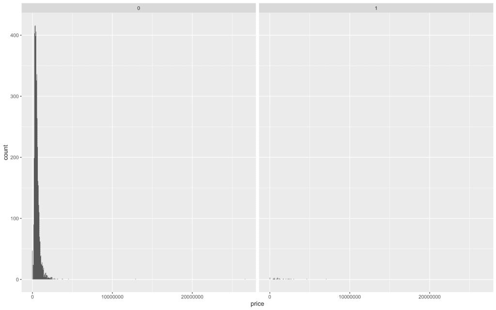
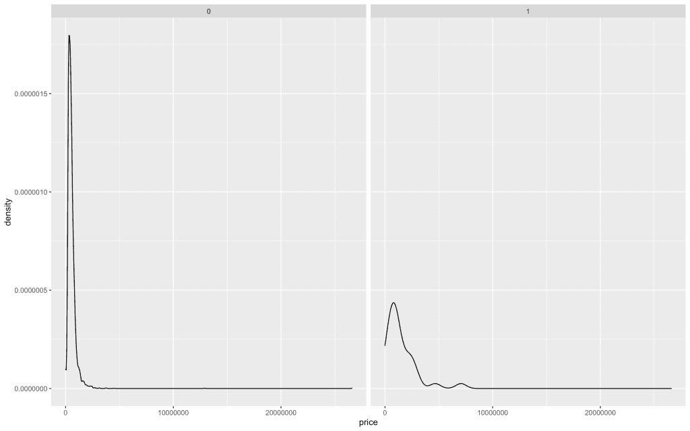
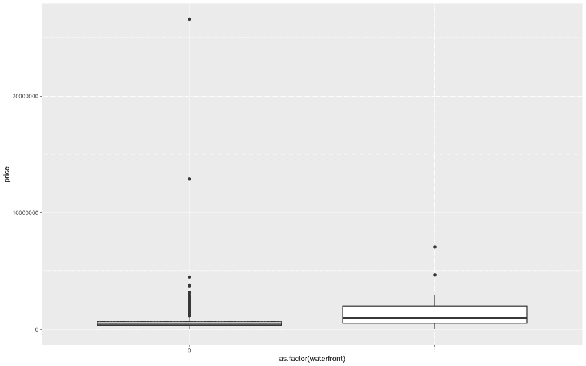
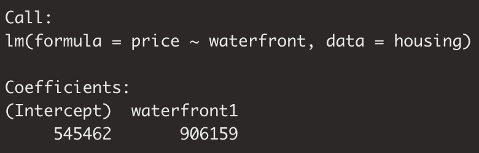
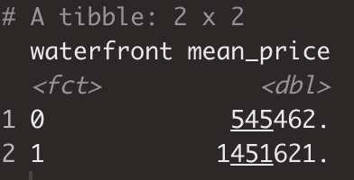

# 预测房价:使用分类因子回归

> 原文：<https://towardsdatascience.com/predicting-home-prices-using-regression-with-categorical-factors-9a35da52067b?source=collection_archive---------42----------------------->

## 分类解释变量的正确解释入门


图片来自 [Pixabay](https://pixabay.com/?utm_source=link-attribution&utm_medium=referral&utm_campaign=image&utm_content=384596) 的[鲁迪和](https://pixabay.com/users/Skitterphoto-324082/?utm_source=link-attribution&utm_medium=referral&utm_campaign=image&utm_content=384596)

# 范畴回归导论

回归是数据科学世界中的一个主题，因此以最简单的形式理解它是很有用的。

我最近写了一篇文章，为我们提供了回归的更多细节。你可以在这里找到。为了继续我们在那里探索的思想，今天我们将探索回归模型的创建，其中解释变量是分类数据点。

正如我提到的，从头开始很好地理解应用程序和方法是很重要的。这将有助于你利用机器学习算法&其他以不同方式利用回归概念的统计分析。

# 让我们从一点 EDA 开始

当涉及到可视化因变量(数值型)和自变量(分类型)之间的关系时，有一些标准的视觉效果是你应该经常考虑的。

我们想看到的是模式或关系。当处理两个数值变量时，散点图是一个明显的选择。

在这种情况下，有几个很好的选择是刻面直方图和箱线图。

# 柱状图

让我们从一个分面直方图开始。Facet 只是意味着我们不是创建一个单一的直方图，而是实际上有一个给定分类变量的每个级别的直方图。

请放心，`ggplot`让这变得非常容易。

正如您在下面看到的，我按照常规制作了一个直方图来表示价格的分布，但是我还包含了`facet_wrap`命令，指示程序为传递给`facet_wrap(~)`的字段的每个值可视化一个直方图。由于 waterfront 字段只有两个值，我们将看到两个相邻的窗格，其中包含 waterfront 值的价格值直方图。

```
housing %>%
  ggplot(aes(x = price)) +
    geom_histogram(binwidth = 50000) +
    facet_wrap(~waterfront)
```



我们可以看到，总的来说，绝大多数住宅没有滨水区，但这并不一定意味着所有有滨水区的住宅价格都更高。如果我们观察这两个群体的平均价格，我们会发现滨水积极型公司的平均价格更高，因为相对集中程度没有那么高。

# 密度图

分布的更好的相对可视化是`geom_density`

```
housing %>%
      ggplot(aes(x = price)) +
      geom_density(binwidth = 50000) +
      facet_wrap(~waterfront)
```



现在，我们可以更好地捕捉分布中给定部分的相对浓度。

# 箱线图

现在让我们用一个箱线图来可视化同样的数据。正如你在下面看到的,`ggplot`的语法几乎完全相同。

```
housing %>%
  ggplot(aes(x = as.factor(waterfront), y = price)) +
    geom_boxplot()
    facet_wrap(~waterfront)
```



箱线图的中心线由分组数据集的中值表示。虽然这两种可视化方法都以某种形式呈现分布，但箱形图的美妙之处在于我们可以非常精确地测量和比较平均值、IQR 等。

它有助于使事情变得容易理解。

# EDA 外卖

一种类型的可视化比另一种更好吗？我会说是的，因为不同的事情。当谈到探索性数据分析或您作为数据科学家可能进行的任何类型的分析时，很容易开始使用您工具带上的工具，因为您知道这是人们做的事情，但是如果您有使用给定工具的明确目的和意图，它会使您使用给定工具的工作更有意义。

在这种情况下，直方图将有助于您更好地理解分布的形状，而箱线图将有助于您更清楚地比较数据集的分组。

# 让我们建立一个回归模型

在构建回归模型时，了解幕后到底发生了什么非常重要。

你可以参考[这篇文章](/build-evaluate-and-interpret-your-own-linear-regression-model-in-minutes-e6a3e8253501)，而不是重新解释如何解释各种回归输出，我们将在这里继续。

如您所知，回归模型中使用的每个解释变量都有一个系数。该系数包括我们通过回归生成的直线方程中直线的斜率。

让我们快速运行我们的回归，只传递滨水区变量作为解释变量。

```
fit <- lm(price ~ waterfront,
            data = housing)
fit
```



正如我们之前所见，构建线性模型包括 y 截距 545，462 和系数、斜率或β906，159。

所以我们的公式是 Y = 545462+906159 * X

因为对于海滨我们只有两个选项 1 或 0，所以让我们将其中一个值传递给我们的直线方程并预测 y。

没有滨水区:

545,462 = 545,462 + 906,159*0

在没有滨水区的情况下，我们将传递一个 0，取消那个系数，只给我们留下 y 截距的值。

有滨水区:

1,451,621 = 545,462 + 906,159*1

相反，当有一个滨水区时，我们将 X 视为 1，有效地将 y 截距和系数相加，得到 150 万美元。

这里的解读简直够了。现在让我们看看引擎盖下面。

# 群体手段

我们将从这个开始，看看滨水组的每个值的平均值。

```
housing %>% 
  group_by(waterfront) %>% 
  summarize(mean_price = mean(price))
```

这是我们得到的结果:



我们可以看到没有滨水区的平均价格为 545，462 英镑，没有滨水区的平均价格为 1，451，621 英镑。

注意到这两个数字有什么熟悉的地方吗？

如果您已经注意到非滨水住宅的组均值和模型的 y 截距是相同的，或者滨水住宅的组均值和滨水住宅的模型输出是相同的，那么您已经知道了。

那么这里到底发生了什么…

当您将分类变量传递给回归模型时，在这种情况下，滨水区变量，基线组均值 545K 被指定为 y 截距，变量系数现在被定义为滨水区 **1** ，请注意，1 实际上是基线组均值(其中滨水区= 0)和滨水区= 1 时的组均值之间的差异。注意，基线组是按照字母顺序建立的。

如果该变量有三个值，第三个值的系数也将是其组均值和基线组均值之间的相对差值。

# 结论

总结我们的经验，

在进行 EDA 时，如果您希望评估数值型因变量和分类型自变量之间的关系，有几个很好的可视化选项:

*   直方图(分面)
*   密度图(分面)
*   箱线图(分面)

在采用分类解释变量/自变量的回归模型中:

*   y 截距等于基线组平均值
*   基线组是根据变量值的字母顺序建立的
*   系数等于分类变量的给定值和基线组均值(或 y 截距)之间的相对差值

理解我们使用的工具的内部工作原理很重要。我希望这本使用分类变量进行回归的初级读本在您利用这些和其他工具进行分析时证明是有用的。

祝数据科学快乐！