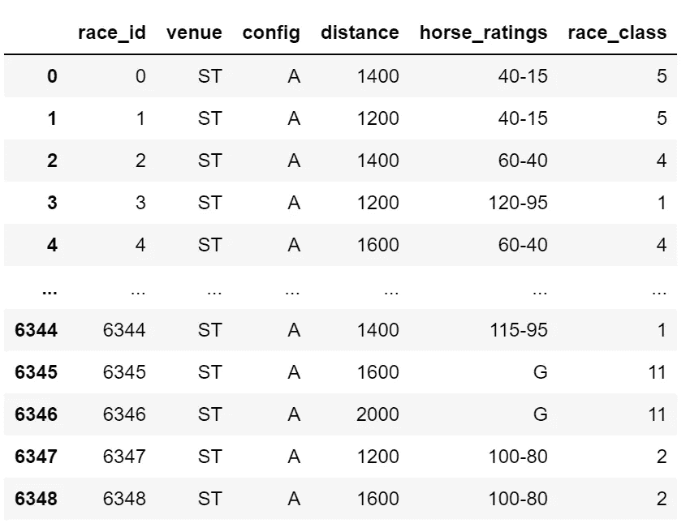
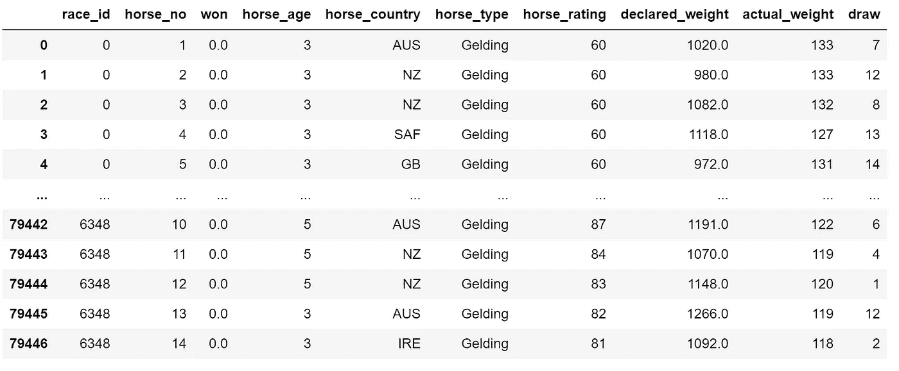
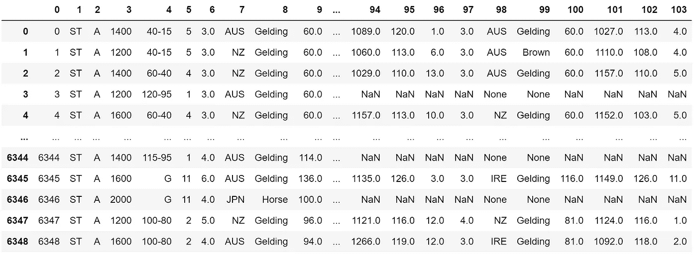

# 用深度学习预测赛马结果

> 原文：<https://towardsdatascience.com/predicting-horse-racing-results-with-deep-learning-7942846287bf?source=collection_archive---------21----------------------->

## 只是为了好玩！


彼得罗·马蒂亚在 [Unsplash](https://unsplash.com/s/photos/horse-racing?utm_source=unsplash&utm_medium=referral&utm_content=creditCopyText) 上拍摄的照片

我对机器学习在不同领域的应用感兴趣，在这些领域，分析大量数据是得出准确结论的必要条件。一个这样的领域是体育分析。与其他形式的赌博不同，环境和其中的参与者肯定会对结果产生影响，这使得它成为一个可以通过机器学习解决的问题。

我想尝试在这个领域实现深度学习，所以我在网上寻找关于体育的数据集。最终，我找到了一个关于香港赛马的数据集，包含 6000+场比赛。不像篮球和足球等其他更复杂的游戏，赛马只是 14 匹马之间的比赛。这意味着要考虑的变量要少得多。

该模型应该能够预测哪匹马会赢，当给定比赛和马的数据(性别，年龄，类型)。

记住理论概念，这是我使用的代码:

# 数据预处理:

```
import os
os.getcwd()
```

这个脚本获取程序运行的当前工作目录。我运行这个函数，这样我就可以复制一个路径的模板，以便于描述数据集的路径。

```
os.chdir('Desktop\\Files\\Data')
```

之后，我移动到存储文件的目录。

```
import pandas as pd
df = pd.read_csv('races.csv')
```

数据集由两个 csv 文件组成，即 races 和 runs csv。比赛 csv 包含关于每场比赛的信息，跑步 csv 包含关于参加每场比赛的每匹马的信息。目标是编码所有非数字数据，并将这两个 csv 文件连接成一个大的数据帧。这样会更容易让模型去训练模型。

```
df = pd.read_csv('races.csv')
df = df.drop('date',axis = 1)
df = df.drop('going',axis = 1)
df = df.drop('surface',axis = 1)
df = df.drop('prize',axis = 1)
df = df.drop('race_no',axis = 1)
for column in df.columns:
    if 'sec' in column or 'time' in column or 'place' in column or 'win' in column:
        df = df.drop(column,axis = 1)
df
```

这个脚本从数据集中删除了所有不必要的信息。以下是删除所有不必要信息后的数据集:



```
df2 = pd.read_csv('runs.csv')
```

这个脚本打开第二个 csv 文件，该文件包含参加比赛的马的所有信息。

```
df2 = pd.read_csv('runs.csv')
df2 = df2.drop('horse_id',axis = 1)
df2 = df2.drop('result',axis = 1)
df2 = df2.drop('horse_gear',axis = 1)
df2 = df2.drop('win_odds',axis = 1)
df2 = df2.drop('place_odds',axis = 1)
df2 = df2.drop('trainer_id',axis = 1)
df2 = df2.drop('jockey_id',axis = 1)
df2['race_id'] = df2['race_id'] 
for column in df2.columns:
    if 'time' in column or 'behind' in column or 'position' in column:
        df2 = df2.drop(column,axis = 1)

df2
```

这个脚本从 csv 文件中删除所有不必要的数据。这是之后的数据集:



```
import warnings
warnings.filterwarnings('ignore')
import numpy as np
true_df = []
for i in range(len(df['race_id'])):
    matches = list(df2[df2['race_id']==i].drop(['race_id'],axis=1).drop(['horse_no'],axis=1).drop(['won'],axis=1).values)
    horse_no = len(matches)
    matches.insert(0,df[df['race_id']==i].values[0])
    matches = flatten(matches)
    true_df.append(matches)
```

这个脚本将两个 CSV 文件连接在一起:对于每场比赛，它会找到所有参加比赛的马。该数据被展平并添加到关于比赛的信息中。这样做的结果是，您最终得到一个数据帧，每一行都是一场比赛。每行有 104 个值，包含关于比赛和比赛中每匹马的信息。

```
true_df = pd.DataFrame(true_df)
true_df
```

之后，我们可以将列表转换成数据帧。以下是完整的数据框架:



所有的 NaN 值都在那里，因为有些比赛有 14 匹马，而其他比赛只有 12 匹马。对于这 12 场赛马，其他值用零填充。

```
winners = []
for i in range(len(df['race_id'])):
    try:
        winner = df2[df2['race_id']==i][df2['won']==1]['horse_no'].values[0]
    except:
        print(df2[df2['race_id']==i][df2['won']==1])
        winner = 1
    winners.append(winner)
```

然后我收集每场比赛的所有结果，并将这些数据添加到每一行的末尾。

```
true_df['winners'] = winners
true_df = pd.DataFrame(true_df).fillna(0)
true_df.to_csv('Desktop\\Files\\Data\\insert_data.csv',index=False)
```

然后，我用 0 替换 NaN 和 None 的所有实例，因此它不会影响模型的定型。然后，数据框被保存为 csv 文件。

# 训练模型:

```
import os
os.chdir('C:\\Users\\v_sim\\Desktop\\Files\\Data')import pandas as pd
df = pd.read_csv('insert_data.csv')
winners = df['winners'].values
df = df.drop('winners',axis=1).fillna(0)
df = df.drop('0',axis = 1)
```

将数据帧保存为 csv 文件后，此脚本打开 csv 文件，记录每场比赛的获胜者，然后将他们从数据帧中移除。这是为了让其余的数据可以直接转换为 X 值。

```
def create_dict(array):
    array = array.astype(str)
    unique = np.unique(array)
    encode_dictionary = dict()
    decode_dictionary = dict()
    for i in range(len(unique)):
        encode_dictionary[unique[i]] = i
        decode_dictionary[i] = unique[i]
    return encode_dictionary,decode_dictionarydef encode_df(df):
    columns = df.columns
    dtypes = df.dtypes
    for i in range(len(columns)):
        if dtypes[i] == 'object':
            encode,decode = create_dict(df[columns[i]].values)
            df[columns[i]] = df[columns[i]].map(encode)
    return dfdf = encode_df(df)
df = df.fillna(0)
```

这个脚本包含两个函数:一个对列表中的信息进行编码，另一个对 dataframe 中的列应用该函数，其中的数据是非数字的。

```
X = df.values.reshape(len(X),103,1)
y = np.array(y)
```

该函数根据应用于初始数据集的操作定义 X 和 y 值。

```
from keras.models import Sequential
from keras.layers import Dense
from keras.layers import Flatten,BatchNormalization
from keras.layers import Dropout
from keras.layers.convolutional import Conv1D
from keras.layers.convolutional import MaxPooling1D
from keras.optimizers import Adam
import kerasmodel = Sequential()
model.add(Conv1D(filters=256, kernel_size=2, activation='relu', input_shape=(103,1)))
model.add(MaxPooling1D(pool_size=2))
model.add(BatchNormalization())
model.add(Conv1D(filters=512, kernel_size=2, activation='relu'))
model.add(MaxPooling1D(pool_size=2))
model.add(BatchNormalization())
model.add(Conv1D(filters=1024, kernel_size=2, activation='relu'))
model.add(MaxPooling1D(pool_size=2))
model.add(BatchNormalization())
model.add(Flatten())
model.add(Dense(64,activation = 'relu'))
model.add(Dense(128,activation = 'relu'))
model.add(Dense(256,activation = 'relu'))
model.add(BatchNormalization())
model.add(Dense(14, activation='softmax'))model.compile(loss='categorical_crossentropy', optimizer='adam',metrics = ['accuracy'])
```

这是我最终选择的型号。这是一个典型的卷积网络，用于图像分类。我把它用于一维数组和多类分类。

```
from keras.models import Sequential, load_model, model_from_json
from keras import callbacks, optimizers
symbol = 'horse_racing'
h5 = symbol + '_best_model' + '.h5'
checkpoint = callbacks.ModelCheckpoint(h5,
                                       monitor='loss',
                                       verbose=0,
                                       save_best_only=True,
                                       save_weights_only=True,
                                       mode='auto',
                                       period=1)
callback = [checkpoint]
json = symbol + '_best_model' + '.json'
model_json = model.to_json()
with open(json, "w") as json_file:
    json_file.write(model_json)
model.fit(X,y,epochs = 5000,callbacks = callback,validation_split = 0.1)
```

这个脚本使用检查点回调来训练模型，以便可以保存和重新加载模型的最佳迭代的权重。这防止了计算资源的浪费。

在对模型进行一段时间的训练后，我发现该模型对训练数据有 92%的准确性，但对验证数据的准确性相对较差。

```
from keras.models import Sequential
from keras.layers import Dense
from keras.layers import Flatten,BatchNormalization
from keras.layers import Dropout
from keras.layers.convolutional import Conv1D
from keras.layers.convolutional import MaxPooling1D
from keras.optimizers import Adam
import kerasmodel = Sequential()
model.add(Conv1D(filters=64, kernel_size=2, activation='relu', input_shape=(103,1)))
model.add(MaxPooling1D(pool_size=2))
model.add(BatchNormalization())
model.add(Dropout(0.3))
model.add(Conv1D(filters=128, kernel_size=2, activation='relu'))
model.add(MaxPooling1D(pool_size=2))
model.add(BatchNormalization())
model.add(Dropout(0.3))
model.add(Conv1D(filters=256, kernel_size=2, activation='relu'))
model.add(MaxPooling1D(pool_size=2))
model.add(BatchNormalization())
model.add(Dropout(0.3))
model.add(Conv1D(filters=512, kernel_size=2, activation='relu', input_shape=(103,1)))
model.add(MaxPooling1D(pool_size=2))
model.add(BatchNormalization())
model.add(Dropout(0.3))
model.add(Conv1D(filters=1024, kernel_size=2, activation='relu'))
model.add(MaxPooling1D(pool_size=2))
model.add(BatchNormalization())
model.add(Dropout(0.3))
model.add(Conv1D(filters=2048, kernel_size=2, activation='relu'))
model.add(BatchNormalization())
model.add(Dropout(0.3))
model.add(Flatten())
model.add(Dense(64,activation = 'relu'))
model.add(Dense(128,activation = 'relu'))
model.add(Dense(256,activation = 'relu'))
model.add(Dropout(0.3))
model.add(BatchNormalization())
model.add(Dense(14, activation='softmax'))model.compile(loss='categorical_crossentropy', optimizer='adam',metrics = ['accuracy'])
```

这个模型是我用来解决这个问题的模型:这个模型更深也更广。该模型更深，以便可以发现更复杂的模式，它更宽，以便更好地处理辍学问题。

# 结论:

这个项目只是体育分析的机器学习的一个基本实现，只是为了好玩。我认为这是相当成功的，但是对数据的过度拟合仍然是一个问题。

# 我的链接:

如果你想看更多我的内容，点击这个 [**链接**](https://linktr.ee/victorsi) 。