# 新冠肺炎患者住院时间的预测

> 原文：<https://towardsdatascience.com/predicting-hospitalized-time-of-covid-19-patients-f4e70456db9b?source=collection_archive---------19----------------------->

## 医疗保健中的监督机器学习


作者照片

2020 年新冠肺炎疫情的爆发导致美国医疗保健系统出现巨大的设备、材料短缺和床位短缺问题[1]。医院不仅需要照顾常规病人，还需要照顾突然增加的新冠肺炎病人。医院系统的良好规划和管理变得非常重要。

本文介绍了如何使用机器学习来预测新冠肺炎患者在入院时需要住院多长时间(以天为单位)的新方法。这可以帮助医院专业人员对患者治疗和资源(例如，房间、床位等)进行优化规划。)分配。这也可以减少医院访客的数量，从而减少工作人员和访客感染的机会。

本文其余部分安排如下:

*   数据理解
*   数据准备
*   建模
*   模型评估
*   部署考虑

# 1.数据理解

数据集从 [Kaggle 的网站](https://www.kaggle.com/nehaprabhavalkar/av-healthcare-analytics-ii)【1】获得。本文中使用了三个文件:

*   *train_data.csv* :包含与患者、医院和住院时间相关的特征(标签)
*   *test_data.csv* :包含与患者、医院相关的特征。需要预测每个病例 id 的“住院时间”
*   *train _ data _ dictionary . CSV*:包含训练和测试文件中的特征信息。

如图 1 所示，该数据集中有 318，438 个数据样本，总共 17 个特征和 1 个标签列( *Stay* )。

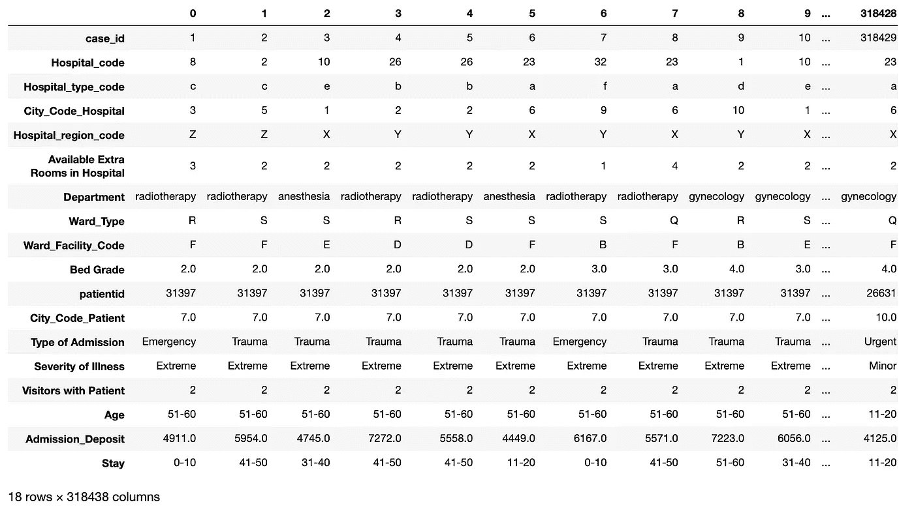

**图 1:** 训练数据集的转置视图。

图 2a 显示了数据集中以下数字特征的统计摘要:

*   案例 id
*   医院代码
*   城市代码医院
*   医院提供额外房间
*   河床坡度
*   patientid
*   城市代码患者
*   有病人的来访者
*   入场 _ 存款

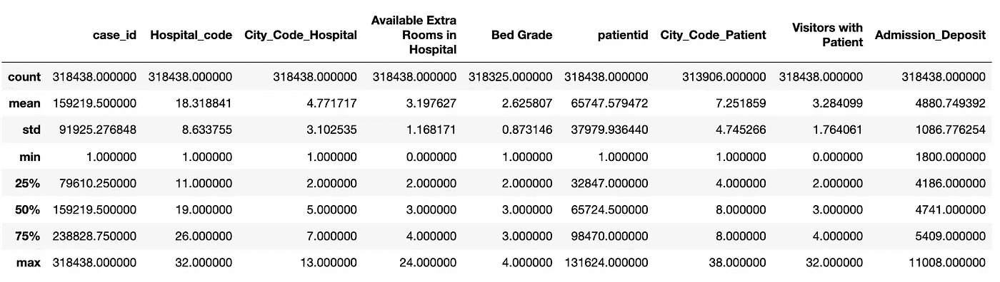

**图 2a:** 数据集中数值特征的统计汇总。

上述数字特征分布的可视化如图 2b 所示。

可以看出， *case_id* 特征值均匀分布在仓上，因为它们是唯一的序列号。由于缺乏预测能力，此功能可能会被删除。

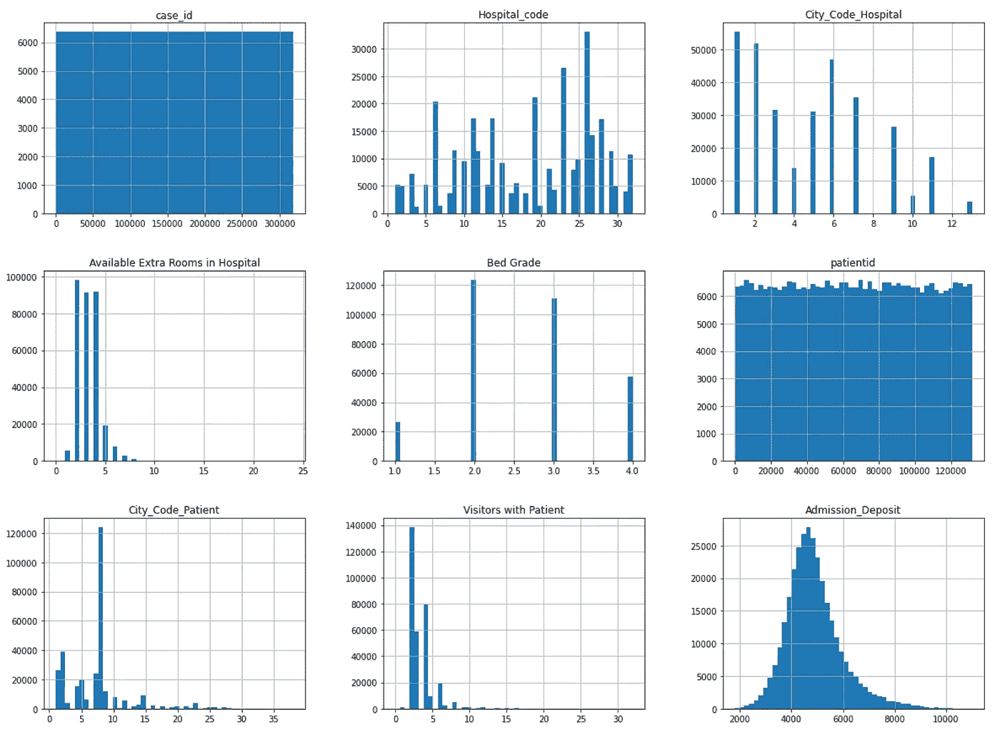

**图 2b:** 数字特征分布。

图 3 显示了患者就诊分布。我们可以看到许多患者多次(从 10 次到 50 次)重访医院。所以病人身份在预测中很重要。

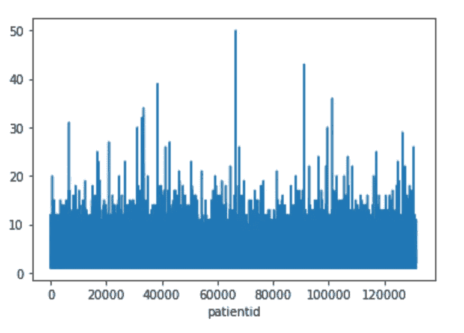

**图 3:** 患者就诊分布。

图 4a 显示了分类特征和标签列的分布:

*   医院类型代码
*   医院区域代码
*   部门
*   病房类型
*   病房设施代码
*   录取类型
*   疾病的严重程度
*   年龄
*   停留(标签)

我们可以看到标签的分布明显向右倾斜。换句话说，数据是不平衡的。从“41–50”到“61–70”的数据样本非常少。这将对预测能力产生显著的负面影响。

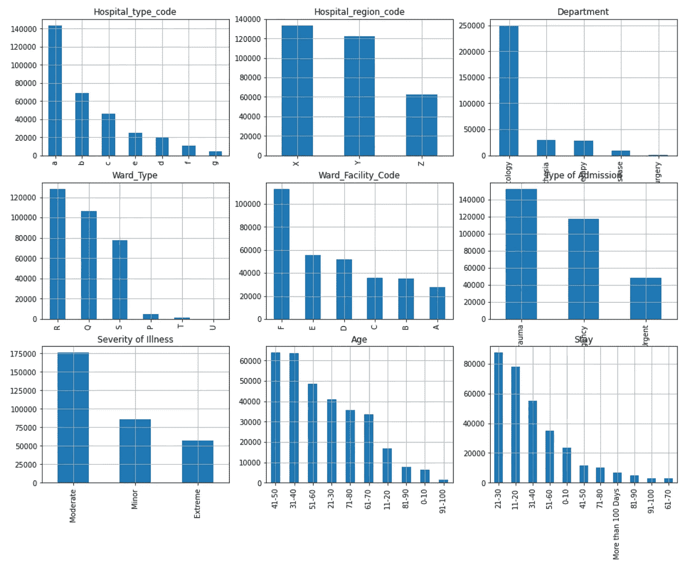

**图 4a:** 分类特征分布。

图 4b 显示了每个标签类中的数据样本数量。

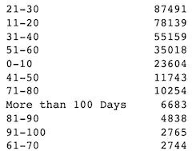

**图 4b:** 标签类计数。

# 2.数据准备

有了数据理解，下一步是探索、清理收集的原始数据集并将其转换为适当的格式，以便转换后的数据可以被目标机器学习模型有效地使用。

## 2.1.处理缺失数据

如图 5 所示，*床级*特征列有 113 个缺失数据，*城市 _ 代码 _ 患者*特征列有 4532 个缺失数据。与 318，438 行的数据集相比，缺失数据的总数相对较少(总共 4，645 行)。在这种情况下，我们可以删除缺少数据的行，或者用 0 替换缺少的数据。我选择用 0 替换丢失的数据，以便能够预测部署中带有丢失特征值的 *test_data* 数据集的结果。详见`data_preprocessing.py`中的`DataCleaning`类【6】。

```
train_data.isnull().sum()
```

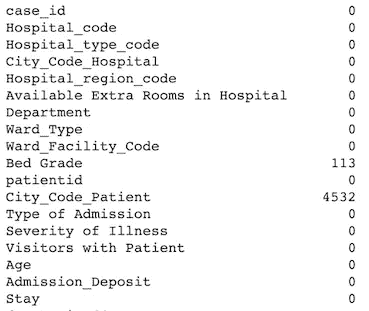

**图 5:** 缺失数据计数。

## 2.2 删除没有预测能力的要素(列)

如前所述， *case_id* 特性不具备预测能力，因此在本项目中被丢弃(参见`data_preprocessing.py` [6]中的`DataCleaning`类)。

## 2.3 分类编码

**2.3.1。分类标签编码**

标签列*在这个数据集中停留*是分类的。必须转化为数字，用于分类特征目标编码[7]和深度学习模型。LabelEncoder 算法[8]用于转换(参见`data_preprocessing.py` [6]中的`TargetEncoding`和`OneHotEncoding`类)。

**2.3.2 分类特征目标编码**

目标编码[7]的优势在于它不会增加数据集的维度。它已经在这个项目中用于将分类特征转换为集成机器学习模型`XGBoost`【2】和`Random Forest`【3】的数字，因为这些模型由于高维度而不能很好地与一键编码一起工作。参见`data_preprocessing.py`【6】中的`TargetEncoding`类。

**2.3.3。分类特征一键编码**

作为比较，流行的 one-hot 编码方法用于转换分类特征，也用于深度学习模型(参见`data_preprocessing.py` [6]中的`OneHotEncoding`类)。

**2.3.4。其他分类特征转换**

我注意到分类年龄特征(例如“21–30”)一旦转换成数字就有了更强的预测能力，因为年龄的顺序有所不同。在这个项目中，每个年龄范围(例如，“21-30”)都被转换成一个平均数，比如(21+30)/2 = 25.5(参见`data_preprocessing.py` [6]中的`OneHotEncoding`类)。

## 2.4.特征标准化

数字特征归一化到深度学习的`[-1, 1]`范围内(见`data_preprocessing.py`【6】中的`FeatureNormorlization`类)。

## 2.5.数据分割

最后，预处理后的数据集被分成两个子集:一个用于模型训练，另一个用于模型评估。

## 2.6.数据预处理管道

为方便起见，数据准备步骤 2.1–2.5 已合并到数据预处理管道中:

*   目标 _ 编码 _ 预处理
*   预测的目标编码预处理
*   onehot _ encoding _ 预处理
*   one hot _ encoding _ preprocessing _ for _ prediction

详见`data_preprocessing.py`【6】。

# 3.建模

数据准备好后，我们就可以开始建模了。建模的主要目标包括:

*   识别潜在的机器学习模型
*   训练模型并调整模型的超参数

## 3.1.型号选择

这个项目解决了一个分类问题，因为标签是分类的。这适用于*XGBoost*【2】、*随机森林*【3】、深度学习多层感知器([](https://en.wikipedia.org/wiki/Multilayer_perceptron)**)*分类器等有监督的机器学习分类模型【4】。*

*由于数据是表格形式，特征数量相对较少，所以相比深度学习模型，一般首选 *XGBoost* 和*随机森林*。*

*本项目选择 *XGBoost* 、*随机森林、*、 *MLP* 、分类器进行实验。*

## *3.2.模型训练和超参数调整*

**XGBoost* 和*随机森林*模型训练均采用 10 文件夹交叉验证。*网格搜索*用于选择超参数的最佳组合。交叉验证也用于训练深度学习模型。参见`train_test_classifier.py`中的以下功能:*

*   **build_xgboost_model**
*   **构建 _ 射频 _ 模型**
*   **构建 _ 深度学习 _ 模型**

# *4.模型评估*

*一旦训练了不同的机器学习模型，就需要评估这些模型的性能，以便我们可以选择最佳的模型进行部署。*

*分类准确度、F1 分数和混淆矩阵被用作该项目的主要评估指标。详见`train_test_classifier.py`中的以下功能:*

*   **evaluate_xgboost_model**
*   **evaluate_rf_model**
*   **evaluate_dl_model**

*通常，在具有不平衡数据的二进制分类的情况下，准确度不是一个好的度量，因为它可以通过简单地预测多数类来容易地实现高百分比的准确度。然而，在多类分类中这不是必须的。例如，在这个项目的数据集中，大多数类别 21-30 只有 87，491 个数据样本。数据样本的总数是 318，438。如果一个模型总是预测多数类，精度将是大约 27.5%。因此，在多类分类的情况下，精度仍然可以是良好的模型性能测量，因为它表示不同标签类的分类的平均精度。*

*除了准确性之外，F1 分数还用于测量 XGBoost 和随机森林模型性能，因为它可以测量准确性和召回率的平衡，这适用于不平衡的数据。*

*使用混淆矩阵是因为它可以清楚地告诉我们模型犯了什么预测错误。*

## *4.1.MLflow*

*为了有效地跟踪模型超参数和性能指标，使用了 *MLflow* 工具【5】。特别是，我开发了`train_test_classifier.py`中的`mlFlow()`功能，将以下活动合并到一个过程中:*

*   *加载训练数据*
*   *预处理数据*
*   *培训模式*
*   *评估模型*

*例如，下面的 *mlFlow* ()函数调用为 XGBoost 模型产生结果(例如，图 6 中的混淆矩阵)。*

```
*target_encoders, label_encoder = mlFlow()*
```

**

***图 6:** XGBoost 混淆矩阵。*

*图 6 中的混淆矩阵表明，数据越多，预测结果越好。例如，真阳性的最大数量 14，429 在 21–30 的类别中。*

*图 7 显示了四个模型评估的结果:*

*   **XGBoost* 带目标编码*
*   **随机森林*带目标编码*
*   **MLP* 用目标编码*
*   **MLP* 采用一键编码*

*我们可以看到 *XGBoost* 在给定数据集的准确性和 F1 分数方面都具有最佳性能，因此如果其性能满足业务需求，我们可以选择它进行部署。*

*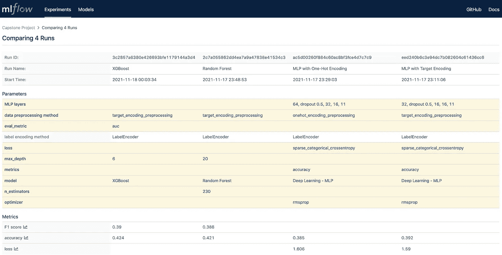*

*如图 7 所示，最好的准确率分数只有 42.4%左右。这是因为在大多数标记的类别中数据太少，例如以下范围:`41-50`，从`61-70`一直到`more than 100`。*

*如果可以收集更多的数据来平衡数据集，准确性得分将会增加。作为实验，我只选择了类别为`11-20`和`21-30`的数据样本，并注意到准确率提高到了大约 63%。图 8 显示了来自经过训练的随机森林模型的相应混淆矩阵。*

*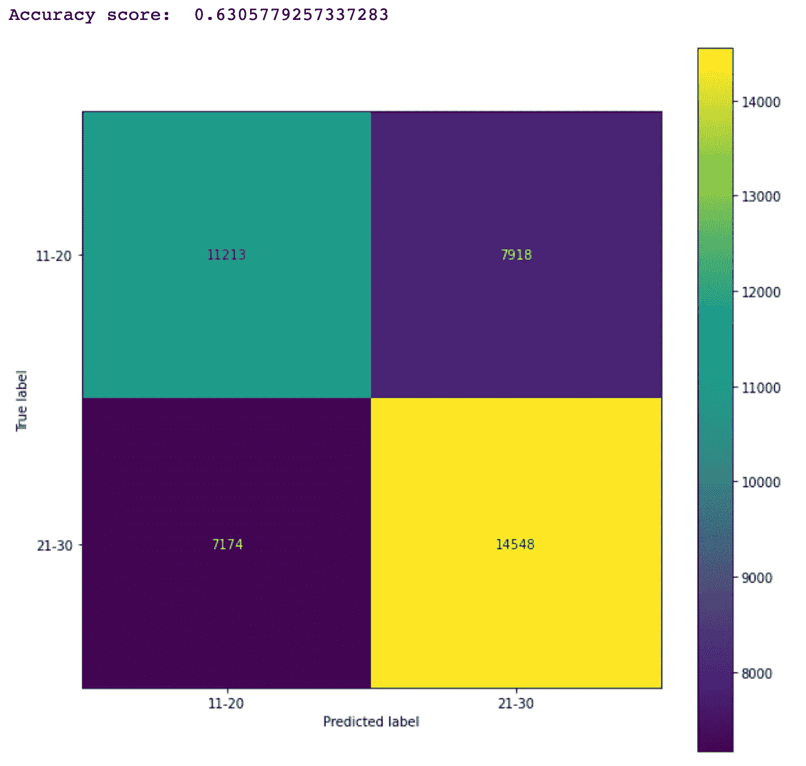*

***图 8:** 带有两个标签类别的随机森林模型的混淆矩阵。*

*为了理解不同的特征如何影响预测，图 9 显示了由训练的随机森林模型产生的特征重要性。*

*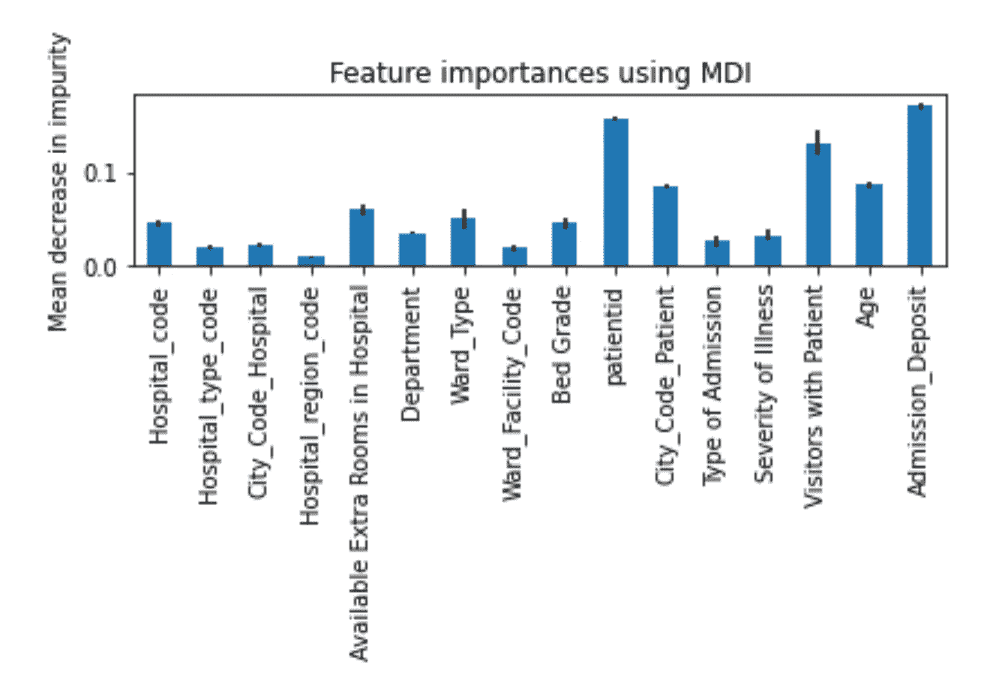*

***图 9:** 随机森林模型产生的特征重要性。*

*我还研究了特性和目标标签之间的相关性，如图 10 所示。*

*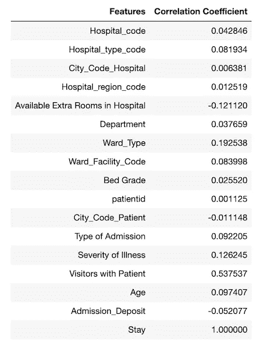*

***图 10:** 特征和目标标签(Stay)相关系数。*

*使用相关系数来确定特征和目标之间的关系的强度是棘手的，因为相关系数仅指示线性关系。具有非常低的相关系数的特征(例如 *patientid* )不一定表示该特征和目标之间没有关系。例如，`patient id`具有非常小的相关系数，但是其特征重要性很高。*

*我尝试删除一些功能重要性较低的功能(例如，医院 _ 地区 _ 代码、城市 _ 代码 _ 医院等)。)和具有非常小的相关系数的特征(例如，City_Code_Hospital ),并且观察到这无助于提高准确度分数。*

# *5.部署*

*一旦在模型评估中确定了部署的最佳模型，我们就可以进入最后一步，将确定的模型部署到生产环境中。一种常见的部署方法是将模型作为 Web 服务部署在服务器上，目标生产系统中的其他组件可以调用它来预测结果。*

*为了支持部署，在模型训练后，所选择的训练模型(如 *XGBoost* 和相关的编码对象(如 *LabelEncoder* 对象、 *TargetEncoder* 对象)都被保存到 Python pickle 文件中。这些保存的编码对象和模型将被加载回来，以便在部署中进行预测。*

*例如，以下代码加载到`test_data.csv`中，用于部署中的预测。图 11 显示了加载的测试数据集的转置视图。注意，这个数据集没有标签列 *Stay* 。*

```
*test_data = load_data('test_data.csv')
print(test_data.shape)
test_data.transpose().head(100)*
```

*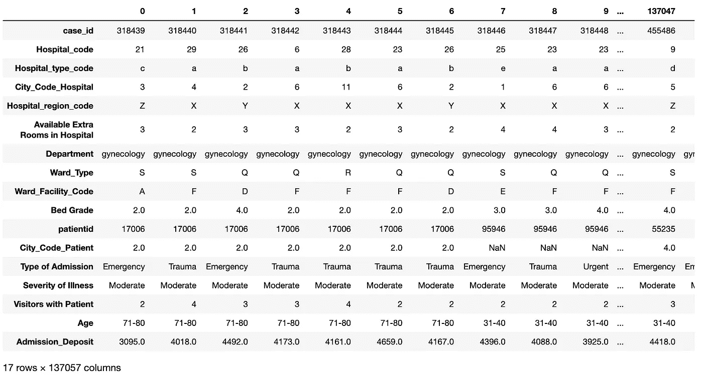*

***图 11:** 预测前的测试数据。*

*下面的代码执行以下操作:*

*   *加载保存的模型并编码对象*
*   *使用它们来预测测试数据集中每个患者的住院天数*
*   *显示结果数据帧中的前 100 条记录，带有特性和预测标签(*保持*列)(参见图 12)*
*   *显示预测标签的分布。*

*我们可以从图 4 和图 13 中看到，图 13 中预测标签的分布模式与图 4 中标签的分布模式非常相似。*

```
*label_encoder, target_encoders = load_encoders()
result_df = predict(label_encoder, target_encoders, test_data_file='test_data.csv')
result_df['Stay'].value_counts().plot(kind='bar')
result_df.transpose().head(100)*
```

*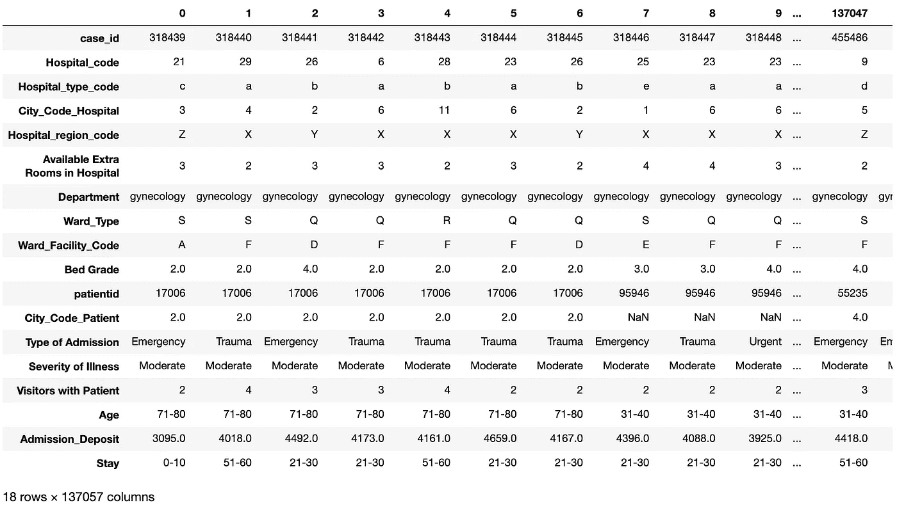*

***图 12:** 带预测标签的测试数据。*

**

***图 13:** 预测标签分布。*

# *改进*

*如第 4.1 节所示，所选的最佳模型 XGBoost 仅实现了约 42.4%的准确性和 0.39 的 F1 分数。一个主要问题是数据严重失真，如图 4a 和 4b 所示。一个可能的改进是尽可能收集更多数据和/或使用[数据论证](https://en.wikipedia.org/wiki/Data_augmentation)技术生成更多数据样本以平衡数据集。*

# *结论*

*本文介绍了如何使用不同的机器学习模型来预测新冠肺炎患者的住院时间，使用的数据集来自 Kaggle [1]。这个数据集是困难的，因为它是一个多类单标签的情况，并且数据集是显著偏斜的。*

*实验结果表明，使用具有目标编码和特征工程(例如，年龄特征的转换)的 *XGBoost* 在预测准确度(42.4%)和 F1 分数 0.39 方面实现了最佳性能。这一结果与 Kaggle [1]中描述的结果具有竞争性。*

# *参考*

1.  *[ka ggle 中的新冠肺炎数据集](https://www.kaggle.com/nehaprabhavalkar/av-healthcare-analytics-ii)*
2.  *[XGBoost](https://xgboost.readthedocs.io/en/latest/)*
3.  *[随机森林分类器](https://scikit-learn.org/stable/modules/generated/sklearn.ensemble.RandomForestClassifier.html)*
4.  *[Keras 顺序模型](https://keras.io/guides/sequential_model/)*
5.  *[MLflow](https://mlflow.org/docs/latest/index.html)*
6.  *[Github 中的源代码](https://github.com/yuhuang3/machine-learning/tree/master/Udacity/capstone_project)*
7.  *[目标编码器](https://contrib.scikit-learn.org/category_encoders/targetencoder.html)*
8.  *[标签编码器](https://scikit-learn.org/stable/modules/generated/sklearn.preprocessing.LabelEncoder.html)*

*鸣谢:我要感谢 Udacity reviewer 的指导性评论和 Kaggle 的数据集。*