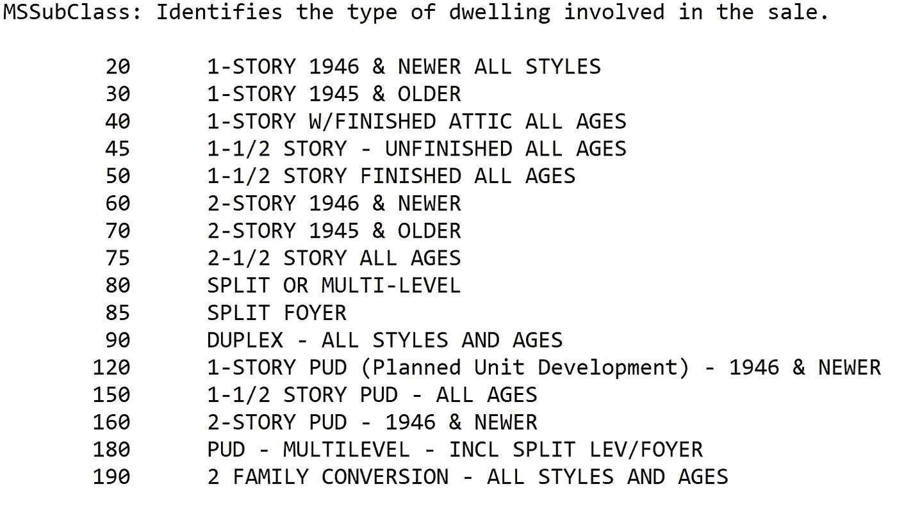
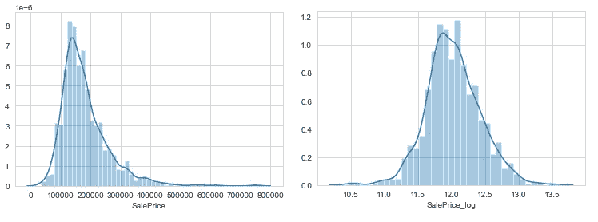
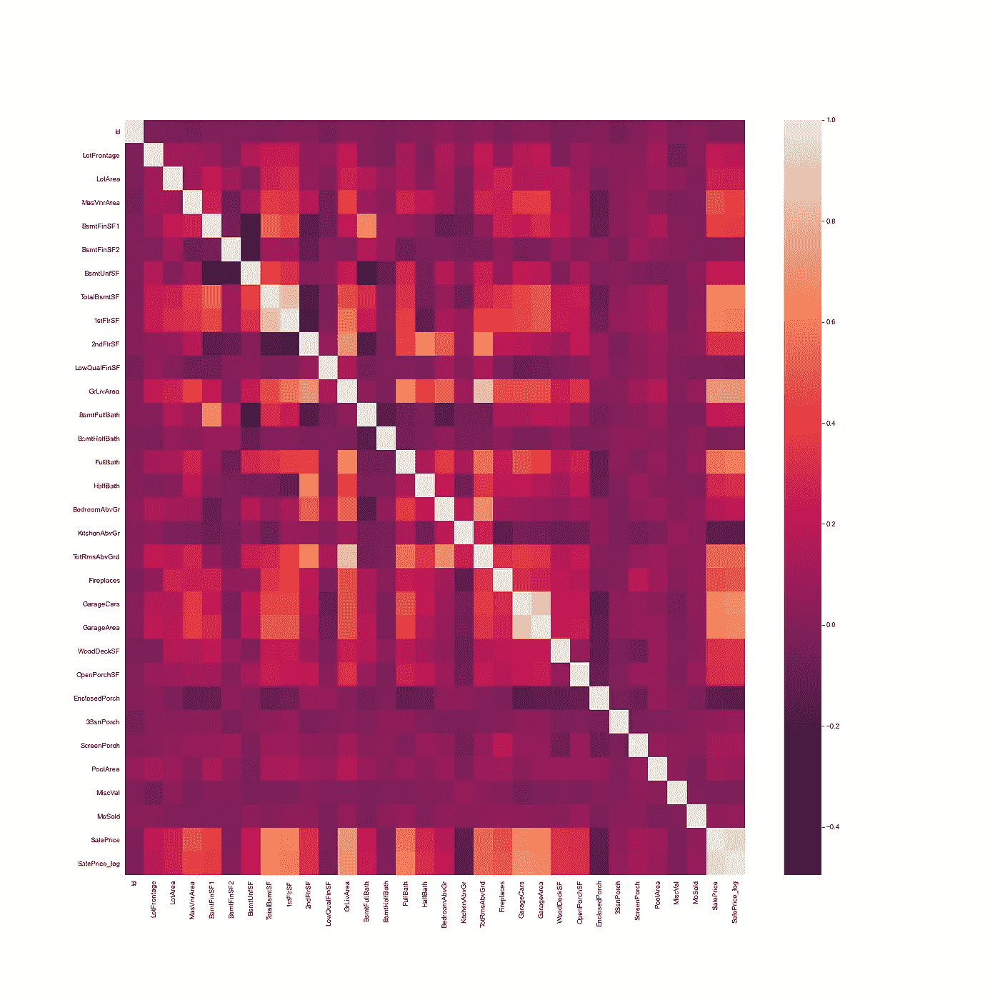
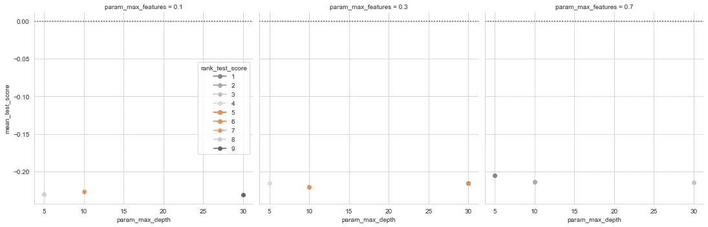
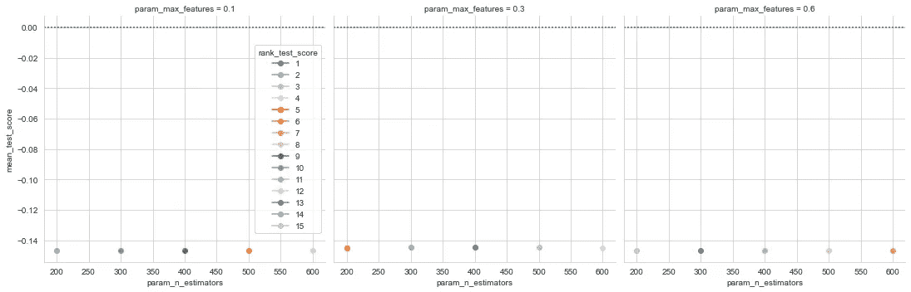
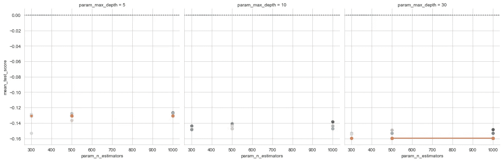

# 用机器学习预测房价

> 原文：<https://towardsdatascience.com/predicting-house-prices-with-machine-learning-62d5bcd0d68f?source=collection_archive---------1----------------------->

## 高级回归技术

## Kaggle 高级回归技术竞赛的端到端项目

美国宇航局在 [Unsplash](https://unsplash.com?utm_source=medium&utm_medium=referral) 拍摄的照片

# **简介**

我想我应该在 Kaggle 的高级回归技术竞赛[中一试身手](https://www.kaggle.com/c/house-prices-advanced-regression-techniques/overview)带你一起踏上旅程。如果你正在进入机器学习领域，并希望看到一个完整的项目，请留下来。我将向您介绍我所采取的步骤，同时尝试提供机器学习的速成课程。

## 目标和数据

比赛的目标是预测爱荷华州埃姆斯的房屋销售价格。您会得到一个 csv 格式的训练和测试数据集以及一个数据字典。

**训练**:我们的训练数据包括 1460 个房屋示例，其中 79 个特征描述了房屋的各个方面。我们得到了每栋房子的销售价格(标签)。训练数据是我们用来“教授”我们的模型的。

**测试**:测试数据集由 1459 个样本组成，特征数量与训练数据相同。我们的测试数据集不包括销售价格，因为这是我们试图预测的。一旦我们的模型已经建立，我们将运行最好的一个测试数据，并提交给 Kaggle 排行榜。

你可以在[比赛页面](https://www.kaggle.com/c/house-prices-advanced-regression-techniques/overview)熟悉数据。

**任务**:机器学习任务通常分为三类；有监督，无监督和强化。对于这次比赛，我们的任务是监督学习。

> 监督学习使用例子和标签来发现数据中的模式

从你拥有的数据和你的目标中，很容易识别你面前的机器学习任务的类型。我们获得了由要素和标签组成的房屋数据，我们的任务是预测训练数据之外的房屋标签。

## **工具**

比赛用的 Python 和 Jupyter 笔记本。Jupyter 笔记本在数据科学家中很受欢迎，因为它们易于跟踪并显示您的工作步骤。

请注意，此代码不是用于生产目的，它不遵循软件工程最佳实践。为了便于解释，我牺牲了一些。

**库**:这些是 python 中处理常见任务的框架。我恳请任何初露头角的数据科学家熟悉这些库:

[*熊猫*](https://pandas.pydata.org/) *—用于处理结构化数据*

[*Scikit Learn*](https://scikit-learn.org/stable/)*—用于机器学习*

[*NumPy*](https://numpy.org/) *—用于线性代数与数学*

[*Seaborn*](https://seaborn.pydata.org/)*—用于数据可视化*

## **项目管线**

一般来说，机器学习项目遵循相同的流程。数据摄取、数据清洗、探索性数据分析、特征工程以及最终的机器学习。

流水线不是线性的，你可能会发现你必须在不同的阶段之间来回跳跃。我提到这一点很重要，因为教程经常让你相信这个过程比现实中要干净得多。所以请记住这一点，你的第一个机器学习项目可能会一团糟。

在我们开始之前，我要重申，机器学习是一个迭代的过程，很少是简单明了的！如果你发现自己迷失在一个 ML 项目中，请不要气馁。坚持阅读，坚持实验，坚持提问，总有一天会成功的。

本文的其余部分将讨论项目管道的各个阶段。在有用的地方，我会加入来自 python 的代码示例。[完整的端到端项目可以在这里使用和发挥](https://mybinder.org/v2/gh/john-adeojo/AdvancedRegression/bc005403eba5e1a12f2e2560493f48b635875d25?filepath=Kaggle%20Advanced%20House%20Price%20v9.ipynb)。我会在文末分享这个的链接。

# **数据清理**

Kaggle 尽力为用户提供干净的数据。但是，一定不能变懒，数据总有惊喜。

**警告！不要跳过数据清理阶段，这很无聊，但会帮你省下几个小时的头痛时间。**

**重复&NaN**:我从删除数据中的重复开始，检查是否有缺失或 NaN(非数字)值。检查 nan 很重要(不仅仅是因为这是社会道德)，因为它们会导致机器学习模型中的错误。

**分类特征**:当房屋的某个特征不存在时，有很多分类变量被标记为 N/A。例如，当没有小巷存在时。我确定了在训练和测试数据中发生这种情况的所有案例，并用更具描述性的内容替换了 N/a。n/a 会导致机器学习出错，所以把它们去掉吧。

**日期特性**:在这个练习中，日期最好作为类别而不是整数来使用。毕竟，我们关心的不是数量级，而是日期代表不同的年份。解决这个问题很简单，只需将数字日期转换成字符串。

**解码变量**:一些分类变量已经被数字编码。请参见下面的示例。

作者生成的图像

这里的问题是，机器学习算法可以将数字的大小解释为重要的，而不仅仅是将其解释为不同类别的特征。为了解决这个问题，我逆向工程的类别，并重新编码。

# **探索性数据分析(EDA)**

这是我们的数据可视化之旅经常开始的地方。机器学习中 EDA 的目的是探索我们数据的质量。需要记住的一个问题是:有没有什么奇怪的模式让我们挠头？

标签:我在柱状图上绘制了销售价格。销售价格的分布是右偏的，这是意料之中的。在你家附近，看到一些相对昂贵的房子可能并不罕见。

在这里，我执行了我的第一个功能工程(告诉过你这个过程是混乱的)。我将对销售价格应用对数变换来压缩异常值，使分布正常。

离群值会对使用最小化平方误差的损失函数的模型产生毁灭性的影响。尝试应用变换，而不是删除异常值。

用 Python 绘制直方图

由作者生成的图像—对数变换前后的销售价格直方图

**相关性**:绘制一个相关性矩阵通常有助于了解数据中存在的关系。也可以指导你的模型建立。例如，如果您看到许多要素相互关联，您可能希望避免线性回归。

用 Python 绘制皮尔逊相关图

图片由作者生成:数值变量之间皮尔森相关性的热图

这里使用的相关性度量是皮尔逊相关性。在我们的例子中，正方形越亮，两个变量之间的相关性越强。

与空间相关的特征，如地段临街面、车库面积、地面居住面积，都与销售价格正相关，正如人们所料。逻辑是越大的房产越贵。这里没有可疑的关联。

**类别关系:**销售价格在每个类别的每个级别内近似呈正态分布。没有观察出现，不幸的。一些类别包含很少或没有数据，而其他类别显示很少或没有区分销售类别的能力。查看 GitHub 上的完整项目，了解数据可视化。

# **特色工程**

机器学习模型无法理解分类数据。因此，我们需要应用转换将类别转换成数字。这样做的最佳实践是通过一个热编码。

**亲提示！** —确保使用 Sci Kit Learn 的 OneHotEncoder 和**避免** panda 的 get_dummies。使用 get_dummies 时，如果训练和测试数据集中的类别级别不同，您将会遇到一大堆问题。

OneHotEncoder 通过可以设置类别和处理未知数的选项解决了这个问题。它有点难用，但对机器学习来说绝对是必要的。

这里有一篇关于 one hoten coder[的精彩文章和 python 示例。](/categorical-encoding-using-label-encoding-and-one-hot-encoder-911ef77fb5bd)

# **机器学习**

我遵循机器学习的标准开发周期。作为一个初学者，甚至是一个专业人士，在你能够让你的模型工作在一个高标准之前，你可能不得不经历许多循环的迭代。随着你获得更多的经验，迭代的次数会减少(我保证！).

图片作者:机器学习模型开发周期

## **型号选择**

正如本文开头提到的，任务是监督机器学习。我们知道这是一个回归任务，因为我们被要求预测一个数字结果(销售价格)。

因此，我用三种机器学习模型来处理这个问题。决策树、随机森林和梯度推进机器。我使用决策树作为我的基线模型，然后基于这个经验来调整我的候选模型。这种方法节省了大量时间，因为决策树可以快速训练，并且可以让您了解如何为我的候选模型调整超参数。

**模型机制**:在这里我不会过多的讨论每个模型是如何工作的。相反，我会使用一行程序，将你链接到描述他们在“幕后”做什么的文章。

> [决策树](/https-medium-com-lorrli-classification-and-regression-analysis-with-decision-trees-c43cdbc58054) —机器学习中使用的一种树形算法，通过学习决策规则来发现数据中的模式。
> 
> [随机森林](https://medium.com/swlh/random-forest-and-its-implementation-71824ced454f) —一种利用“群体智慧”效应的装袋方法。它并行使用多个独立的决策树从数据中学习，并聚合它们对结果的预测。
> 
> [梯度推进机器](/understanding-gradient-boosting-machines-9be756fe76ab) —一种串联使用决策树组合的推进方法。每棵树都被用来预测和修正前一棵树的误差。

随机森林和梯度推进可以将单个弱决策树变成强预测模型。如果你有像我们这样的小训练数据集，它们是很好的算法。

## **训练**

在机器学习中，训练是指使用训练数据集中的示例来教授模型的过程。在训练阶段，您将调整您的模型超参数。

在我们深入讨论细节之前，我想简单介绍一下偏差-方差权衡。

> 模型偏差—模型对训练数据的拟合不足，导致对未知数据的预测能力较差。一般来说，模型越简单，偏差越大。
> 
> 模型差异-模型过度拟合训练数据，导致对未知数据的预测能力较差。一般来说，模型越复杂，方差就越高。

复杂性可以被认为是模型中特征的数量。模型方差和模型偏差具有导致折衷的相反关系。模型复杂度存在一个最佳点，使误差最小。我们试图通过调整我们的超参数来确定这一点。

这里有一篇很好的[文章](/understanding-the-bias-variance-tradeoff-165e6942b229)可以帮助你更详细地探索这个东西。

**超参数**:超参数帮助我们调整模型的复杂性。对于每个模型应该调优哪些超参数，有一些最佳实践。我将首先详述超参数，然后告诉您我为每个模型选择了哪些参数进行优化。

max_depth —给定决策树的最大节点数。

max _ features 考虑在结点处进行分割的要素子集的大小。

n _ estimators 用于提升或聚合的树的数量。该超参数仅适用于随机森林和梯度增强机器。

learning _ rate 学习率用于减少每棵树的贡献。这只适用于梯度增压机。

> 决策树-调整的超参数是最大深度和最大特征
> 
> 随机森林-要调整的最重要的超参数是 n 估计量和最大特征[1]。
> 
> 梯度推进机器——要调整的最重要的超参数是 n_estimators、max_depth 和 learning_rate [1]。

**网格搜索**:选择超参数的范围是一个迭代过程。有了更多的经验，你会开始对设置什么样的范围有所感觉。好消息是，一旦你选择了可能的超参数范围，网格搜索允许你在这些范围的每个组合上测试模型。我将在下一节详细讨论这一点。

**交叉验证**:模型经过 5 重交叉验证训练。这是一种技术，它采用您的全部训练数据，在 5 次迭代中将其随机分成训练和验证数据集。

您最终会得到 5 个不同的训练和验证数据集来构建和测试您的模型。这是对抗过度合身的好方法。

更一般地，这种交叉验证被称为 k 重交叉验证。更多关于 k 倍交叉验证[点击这里](/why-and-how-to-cross-validate-a-model-d6424b45261f)。

**实现** : SciKit Learn 帮助我们在使用 GridSearchCv 时轻松地将超参数调整和交叉验证结合在一起。它为您提供了查看每次训练结果的选项。

下面是构建随机森林模型的代码。

# **评估**

这是流程的最后一步。在这里，我们要么高兴地跳起来，要么沮丧地揪自己的头发(开玩笑，我们不会那样做……永远不会)。我们可以使用数据可视化来查看每个候选模型的结果。如果我们对我们的结果不满意，我们可能不得不在从数据清理到机器学习的任何阶段重新审视我们的过程。

我们的性能指标将是负均方根误差(NRMSE)。我用这个是因为它是我在 SciKit Learn 中能得到的最接近 Kaggle 的评分标准。

## **决策树**

可以预见，这是我们表现最差的方法。我们最好的决策树得分-0.205 NRMSE。调整超参数似乎并没有对模型产生太大的影响，但它在 2 秒内完成了训练。肯定有一些范围来评估更广泛的超参数。

作者图片:决策树的 NRMSE 图

## **随机森林**

我们的随机森林模型是对决策树的显著改进，NRMSE 为-0.144。这个模型花了大约 75 秒来训练。

作者图片:随机森林的 NRMSE 情节

## **梯度推进机**

这是我们表现最好的一次，NRMSE 为-0.126。超参数显著影响结果，说明我们在如何调整这些更复杂的模型时必须非常小心。该模型的训练时间约为 196 秒。

图片由作者提供:GitHub 中的梯度推进机器完整版的 NRMSE 图

# **比赛结果**

我在 Kaggle 测试数据上测试了性能最好的模型。我的模型把我放在了前 39%的进入者中(在我写作的时候)。这不是一个坏的结果，但它肯定可以得到改善。以下是我们可以做到的一些方法:

**分类变量**:数据中的一些分类特征具有很高的基数。因此，树模型可能偏向于这些特征。我们也许可以通过将这些高维特征重新归类到较低的维度来提高模型性能。

**超参数调整**:我们可以扩大超参数的解空间，希望找到一个更好的位置。请注意，如果你只是在笔记本电脑上工作，这将需要强大的计算能力。

希望这篇文章对你了解机器学习有所帮助。一如既往，请不要气馁，一切都是实践和耐心。

🚀[这里有一个包含代码的 Jupyter 笔记本的链接。可以自己试试](https://mybinder.org/v2/gh/john-adeojo/AdvancedRegression/bc005403eba5e1a12f2e2560493f48b635875d25?filepath=Kaggle%20Advanced%20House%20Price%20v9.ipynb)

 [## John Ade-Ojo -数据科学|技术|银行和金融| LinkedIn

### 查看 John Ade-Ojo 在全球最大的职业社区 LinkedIn 上的个人资料。约翰的工作列表上有 6 份工作…

www.linkedin.com](https://www.linkedin.com/in/john-adeojo/) 

# 参考

[1]布尔科夫，A (2019)。一百页的机器学习书籍，第 84–85 页