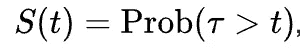
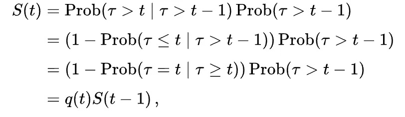
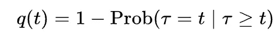
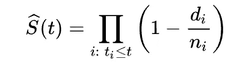
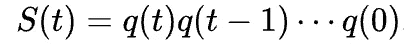

# 用 Keras 预测个体生存曲线

> 原文：<https://towardsdatascience.com/predicting-individual-survival-curves-with-keras-abb1f1f051f?source=collection_archive---------27----------------------->

## 用于客户终身价值模型的 Kaplan-Meier 估计量的深度学习适应


迈克尔·朗米尔在 [Unsplash](https://unsplash.com?utm_source=medium&utm_medium=referral) 上的照片

TL；灾难恢复生存分析模型广泛应用于从医学到电子商务的不同领域。人们越来越关注如何开发个体生存函数，而不是群体生存函数，主要是通过使用深度学习框架。这篇文章介绍了对人口生存分析最常见的非参数方法之一的深度学习改编，[卡普兰-迈耶估计器](https://en.wikipedia.org/wiki/Kaplan%E2%80%93Meier_estimator)。

## **简介**

在研究和工业中，对预测个体生存函数，即任何给定时间的生存概率函数的兴趣越来越大。这项任务的大多数现有方法要么是参数化的，要么是半参数化的，而很少是严格非参数化的。

一些基于深度学习的最流行模型的 [PyTorch](https://github.com/pytorch/pytorch) 实现可以在 [pycox](https://github.com/havakv/pycox) 库中找到，而 [scikit-survival](https://github.com/sebp/scikit-survival) 和 [XGBoost](https://github.com/dmlc/xgboost) 为 Survival regression 提供了其他机器学习替代方案，如随机森林和梯度增强。

我们介绍了一种最广为人知的非参数生存分析方法的改进，即 [Kaplan-Meier 估计量](https://en.wikipedia.org/wiki/Kaplan%E2%80%93Meier_estimator)，用于预测个体生存函数。我们通过深度学习变异的[多任务逻辑回归](https://papers.nips.cc/paper/2011/file/1019c8091693ef5c5f55970346633f92-Paper.pdf) (MTLR)和 [N-MTLR](https://arxiv.org/pdf/1801.05512.pdf) 来实现这一点。我们的模型的主要区别在于，使用样本权重处理删失数据，并且模型在每个时间段的输出是前一个时间段的输出和 sigmoid 层的乘积。

## **卡普兰-迈耶估计值**

设 S(t)是生存**至少** t 个时间单位的概率，即生存函数:



[https://en . Wikipedia . org/wiki/Kaplan % E2 % 80% 93 Meier _ estimator](https://en.wikipedia.org/wiki/Kaplan%E2%80%93Meier_estimator)

根据条件概率，它也是:



[https://en . Wikipedia . org/wiki/Kaplan % E2 % 80% 93 Meier _ estimator](https://en.wikipedia.org/wiki/Kaplan%E2%80%93Meier_estimator)

在哪里



[https://en . Wikipedia . org/wiki/Kaplan % E2 % 80% 93 Meier _ estimator](https://en.wikipedia.org/wiki/Kaplan%E2%80%93Meier_estimator)

其估计量由下式给出:



[https://en . Wikipedia . org/wiki/Kaplan % E2 % 80% 93 Meier _ estimator](https://en.wikipedia.org/wiki/Kaplan%E2%80%93Meier_estimator)

换句话说，t 时刻的 KM 估计量等于 t-1 时刻的 KM 估计量乘以 t 时刻未死亡的个体在已知存活到 t 时刻的个体中所占的比例。

## 深度学习适应

我们的方法很简单:



[https://en . Wikipedia . org/wiki/Kaplan % E2 % 80% 93 Meier _ estimator](https://en.wikipedia.org/wiki/Kaplan%E2%80%93Meier_estimator)

1.  我们用多输出前馈神经网络来表示上述递归，其中每个输出是前一个输出乘以表示概率 q(t)的 sigmoid 层。
2.  使用样本权重处理删失数据:对于每个输出 t，如果个体的开始日期至少在 t 个时间段之前，则样本权重为 1，否则为 0。

代码看起来怎么样？

```
def build_model(
    self,
    input_shape: int,
    hidden_units: List[int],
    dropout: Optional[float] = None,
    activation: Optional[str] = None,
    kernel_regularizer: Optional[str] = None,
    kernel_constraint: bool = False,
    noise: Optional[float] = None,
    normalization: bool = False,
):
    K.clear_session()
    inputs = Input(shape=(input_shape,))
    x = inputs
    for units in hidden_units:
        x = Dense(
            units,
            activation=activation,
            kernel_regularizer=kernel_regularizer,
            kernel_constraint=UnitNorm() if kernel_constraint else None,
        )(x)
        x = GaussianNoise(noise)(x) if noise else x
        x = BatchNormalization()(x) if normalization else x
        x = Dropout(dropout)(x) if dropout else x
    outputs = []
    for period in range(self._periods):
        if period == 0:
            o = Dense(
                1,
                activation="sigmoid",
                kernel_regularizer=kernel_regularizer,
                kernel_constraint=UnitNorm() if kernel_constraint else None,
            )(x)
            outputs.append(o)
            continue
        o = Dense(
            1,
            activation="sigmoid",
            kernel_regularizer=kernel_regularizer,
            kernel_constraint=UnitNorm() if kernel_constraint else None,
        )(x)
        o = Multiply()([o, outputs[period - 1]])
        outputs.append(o)
    self.model = tf.keras.Model(inputs=inputs, outputs=outputs)def fit(
    self,
    X_train: np.ndarray,
    y_train: List[np.ndarray],
    w_train: List[np.ndarray],
    validation_data: Tuple[np.ndarray, List[np.ndarray], List[np.ndarray]],
    epochs: Optional[int] = 100,
    batch_size: Optional[int] = 256,
    patience: Optional[int] = 10,
):
    self.model.compile(optimizer="Adam", loss="binary_crossentropy")
    callback = tf.keras.callbacks.EarlyStopping(
        monitor="val_loss", patience=patience
    )
    self.model.fit(
        X_train,
        y_train,
        sample_weight=w_train,
        epochs=epochs,
        batch_size=batch_size,
        validation_data=validation_data,
        callbacks=[callback],
    )
```

当然，架构只是一个参考。如上所述，应将 X 连同 shape (n_samples，n_features)、y (n_samples，periods)和 w (n_samples，periods)传递给此模型的拟合方法。

## 摘要

有几种方法来拟合生存回归模型，每种方法都有其优点和缺点。在这篇文章中，我提出了一个非常简单的方法，利用 [Tensorflow](https://github.com/tensorflow/tensorflow) 的灵活性，使用前馈神经网络来生成个体生存曲线，而不依赖于强假设，这在概念上是对最常见的生存分析模型之一的改编:Kaplan-Meier 估计量。