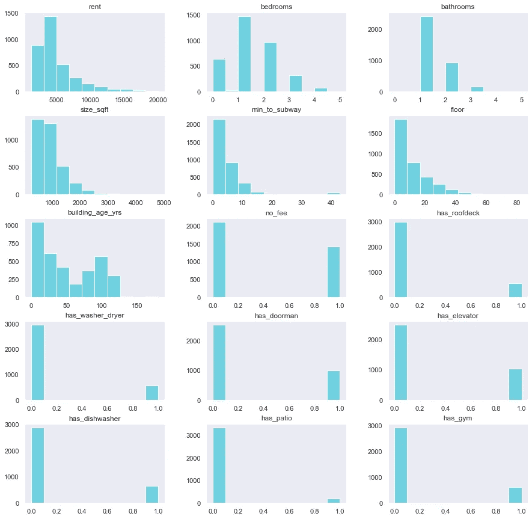
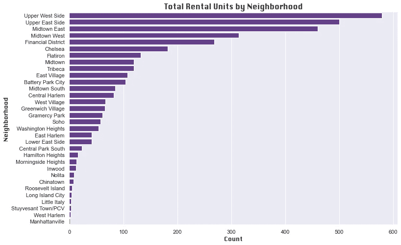
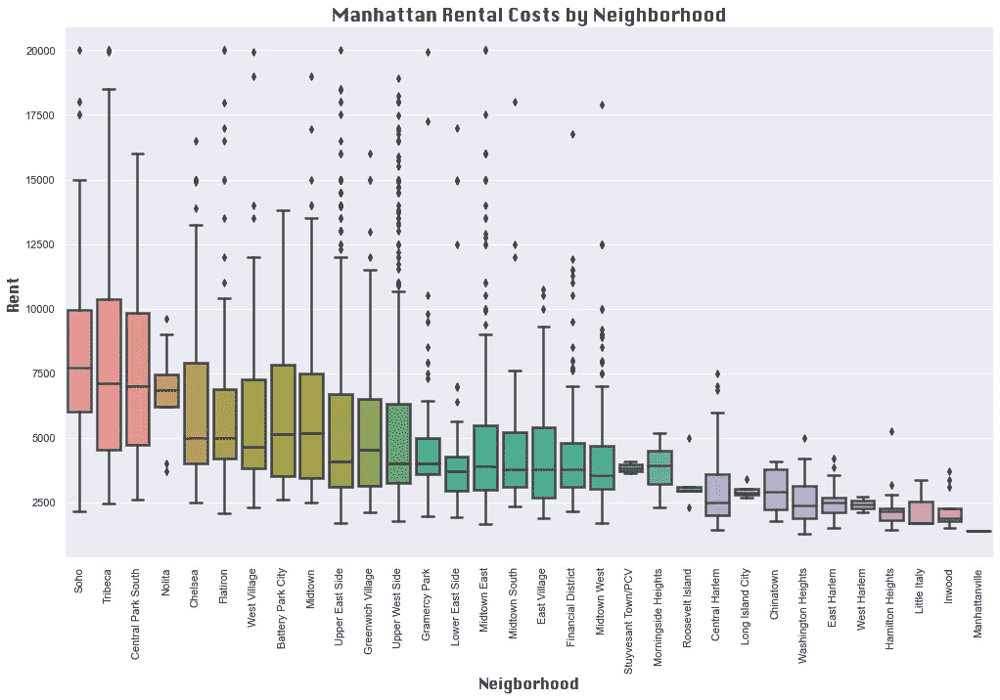
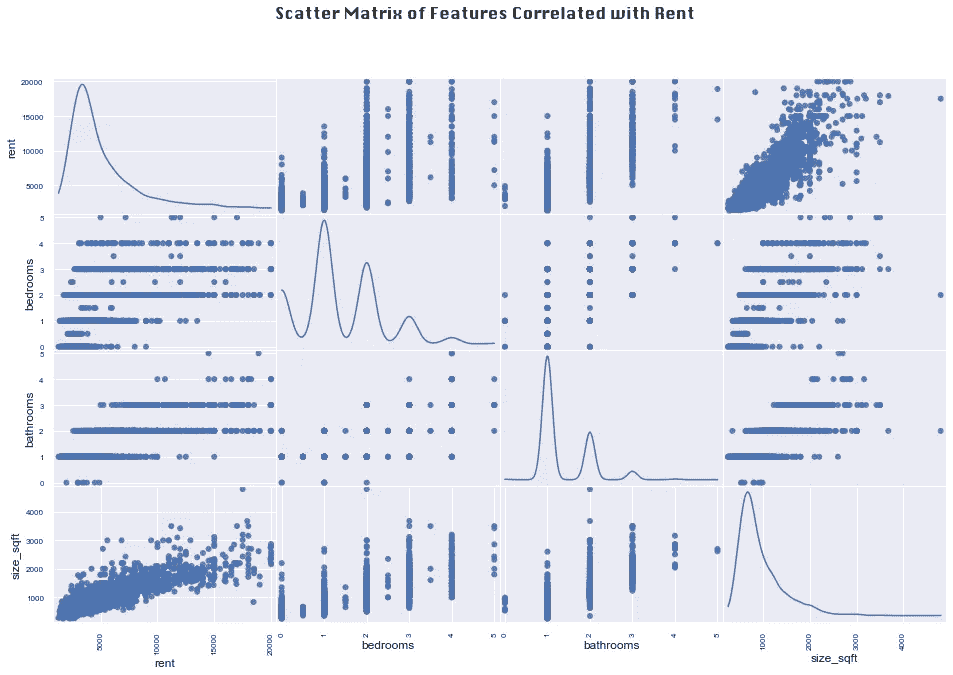
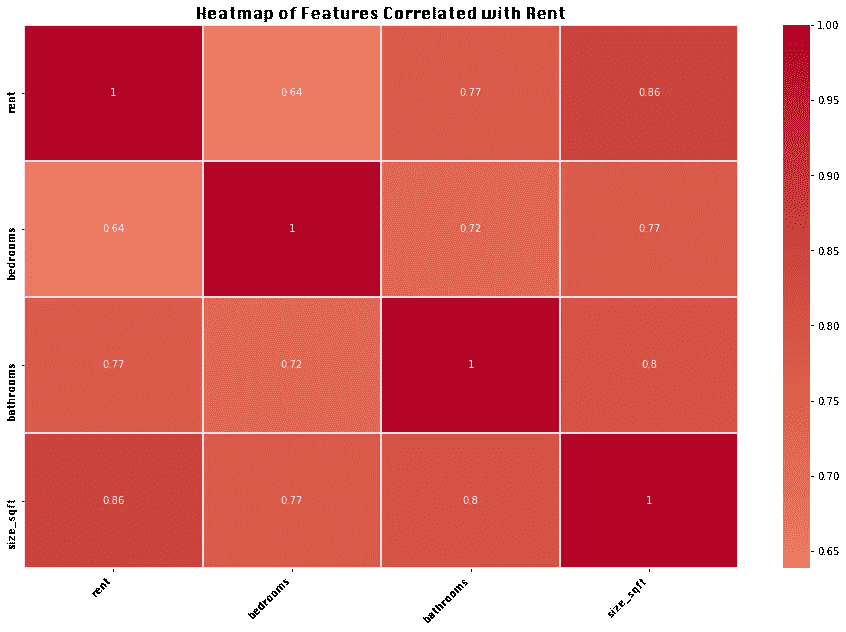
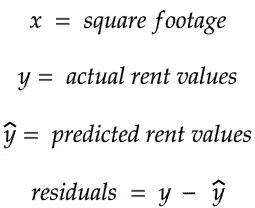
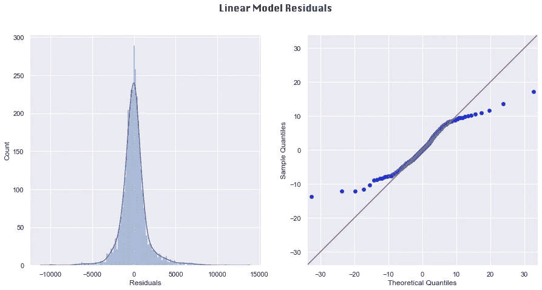
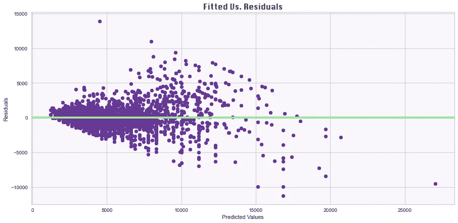
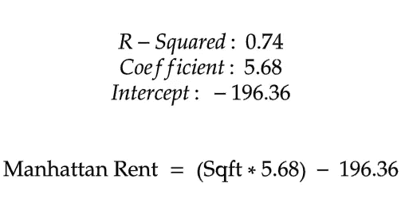

# 用线性回归预测曼哈顿租金

> 原文：<https://towardsdatascience.com/predicting-manhattan-rent-with-linear-regression-27766041d2d9?source=collection_archive---------15----------------------->

## 对 StreetEasy 出租清单的分析

由[弗洛里安·韦德](https://unsplash.com/@florianwehde?utm_source=unsplash&utm_medium=referral&utm_content=creditCopyText)在 [Unsplash](https://unsplash.com/s/photos/times-square?utm_source=unsplash&utm_medium=referral&utm_content=creditCopyText) 上拍摄的照片

## 介绍

当我想到纽约市不断上涨的房租时，我深感遗憾的是,[房租太他妈的贵了,](http://www.rentistoodamnhigh.org/index.html)没能让吉米·麦克米兰当选州长。毫无疑问，纽约人需要他上任——但在那一天到来之前，你可以依靠这份分析来了解如何估算纽约的租金成本。

具体来说，我们将使用曼哈顿 3500 个 StreetEasy 租赁房源的数据集。在预测连续因变量(如租金)的值时，线性回归是一种合适的模型。在本文中，我们将研究这些数据，并逐步完成开发回归模型来预测租金价值的步骤。

## 探索性分析

我首先将清单加载到 pandas 数据框中，并查看数据类型。除了 borough 和 neighborhood 列，所有变量都是数字，幸运的是，没有丢失值。因为曼哈顿区对于所有行都是一样的，所以我删除了区列，并研究了其他列的分布。我对数据调用了`**pandas.DataFrame.hist()**`方法来查看数值变量的分布:

数字变量直方图。由作者策划。

我们可以看到，租金、浴室、楼龄和楼层都具有右偏分布。租金从 1300 美元到 20000 美元不等，平均每月 5138 美元(哎呀！).单卧室公寓比工作室或多卧室公寓更常见，大多数公寓都没有健身房、门卫、屋顶平台和露台等花哨功能。对于这些变量，0 表示“否”，1 表示“是”

为了我的邻居，我真诚地希望所有 40 层以上的房源都属于拥有电梯的少数公寓。

接下来，我对唯一剩下的分类变量(邻域)调用了`**pandas.Series.value_counts()**`方法，并在水平条形图中绘制了计数:

邻域列值计数的条形图。由作者策划。

该数据集中的大多数可用公寓位于上西区和上东区。然而，邻域数据是有缺陷的，因为在一般和特定邻域类别之间存在一些重叠。例如，Morningside Heights 位于上西区，但在数据集中它们是不同的值。未来清理该数据的一个可能步骤是更新邻域列，使其唯一值之间没有重叠。

我还想知道哪些街区的平均租金最高和最低。为此，我按邻域对值进行分组，计算每列的平均值，并将“邻域”和“租金”列分配给单独的数据框。我将租金四舍五入，从高到低排序:

然后，我使用租金平均值列中的值来设置 Seaborn box 图中的邻域顺序:

邻里租房分配。由作者策划。

索霍区、翠贝卡区和中央公园南区的平均租金最高，而小意大利区、因伍德区和曼哈顿维尔区的平均租金最低。正如我们在上面的条形图中看到的，一些邻域在数据集中比其他邻域表现得更好。对于那些拥有更多数据点的社区，如上西区和上东区，样本均值预计会更接近真实的人口均值。

## 检查线性回归假设

线性回归分析需要检查关于数据的四个假设:线性、不存在多重共线性、残差正态性和同方差性。我们将在回归模型的开发和解释中考虑这些假设。

1.  **线性关系**

线性回归假设解释变量和响应变量之间存在线性关系，无论是正的还是负的。检查线性关系最简单的方法是在散点图上绘制变量之间的关系:如果这些点落在一条大致直的对角线上，那么变量之间的关系就是线性的。为了将所有变量相互对应起来，我在数据上调用了`**pandas.plotting.scatter_matrix()**` 方法。如果有很多变量，这种方法会产生一个很难阅读的微小散点图矩阵。我对邻域变量进行了哑编码，得到了总共有 46 列的最终数据帧。在确定了与租金可能存在线性关系的变量后，我将它们绘制在一个易于阅读的散点图上，并排除了其他变量:

相关变量的散布矩阵。由作者策划。

惊喜，惊喜:随着公寓面积的增加，租金也在增加。对于具有离散值的变量，如卧室和浴室，与租金的线性关系不那么明显。例如，有五个卫生间的公寓的租金低于有四个、三个甚至两个卫生间的公寓的最高租金。

**2。无多重共线性**

无多重共线性的假设要求自变量之间的相关性不高。“高度相关”的分界点并不固定，但我倾向于将我的分界点设为 0.7 的绝对值。下面的关联热图显示了与租金相关的值之间的关联:

关联热图。由作者策划。

卧室的数量与租金的相关性相对较弱，与浴室的数量一样，也与平方英尺高度相关。这表明，预测租金最好作为一个简单的线性回归问题来处理，以平方英尺作为唯一的预测因素。

## **建造模型**

线性回归的其余假设指的是模型的残差，因此需要先建立模型，然后才能检查它们。模型的残差是预测 y 值和实际 y 值之间的距离。在我们的案例中:

为了构建模型，我们将使用来自 [Scikit-Learn](https://scikit-learn.org/stable/modules/generated/sklearn.linear_model.LinearRegression.html) 库中的`**LinearRegression()**`。该模型期望 x 是一个二维数组，因此 size_sqft 列被转换为一个数组，并用`**arrray.reshape(1, -1)**`进行了整形。模型与数据拟合，并用于计算残差:

**3。残差的正态性**

下面，我们可以在左侧看到残差的分布，在右侧看到分位数-分位数(QQ)图:

如果残差满足正态假设，QQ 图上的点将沿着红色对角线紧密分布。但是，点有轻微的 s 形曲线。这些图表明，与正态分布相比，在分布的尾部(即极端)有更多的数据。虽然在这种情况下不完全符合正态假设，但残差的分布足够接近正态，因此模型的预测仍然有价值。

**4。同质性**

如果残差在所有预测的 y 值上具有相对恒定的方差，则认为残差是同方差的。通过绘制预测值与残差的关系图，可以直观地检查这一假设:

在显示同质性的图中，这些点会以更加对称的矩形形状分布在绿线上。相反，我们看到残差在更高的预测值处远离直线展开。15k 以上的大多数预测值对应于特别低的残差，其中一个残差低于-10，000。该图表明，该模型可能是一个极端租赁成本的糟糕预测。

## 解释模型

对 x 和 y 数据调用`**model.score()**`会返回模型的 R 平方值。`**model.coef_**`和`**model.intercept_**`属性分别返回系数和截距值。以下数值四舍五入到小数点后两位，并代入一个线性方程来预测租金:

R 平方值告诉我们，仅平方英尺就占租赁成本变化的 74%。用语言来表达这个等式:租金大约是一套公寓平方英尺的 5.7 倍减去几百美元。根据这种模式，一个 250 平方英尺的工作室每月租金约为 1223 美元。一套两倍于这个面积的一居室公寓预计售价约为 2642 美元。

有了这样的数字，难怪如此多的纽约人坚持把自己塞进壁橱大小的住所。

如果你有兴趣看到这个分析的完整代码，请随意访问它的 [GitHub 库](https://github.com/AvonleaFisher/Predicting-Manhattan-Rent-with-Linear-Regression)！