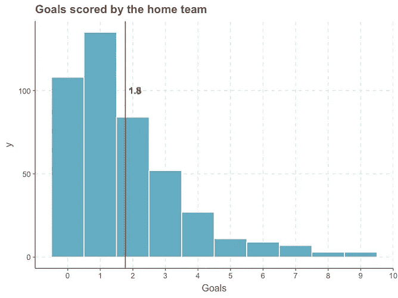
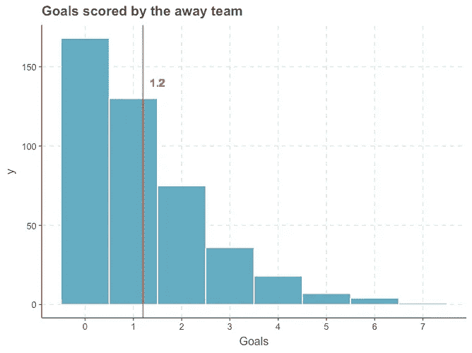
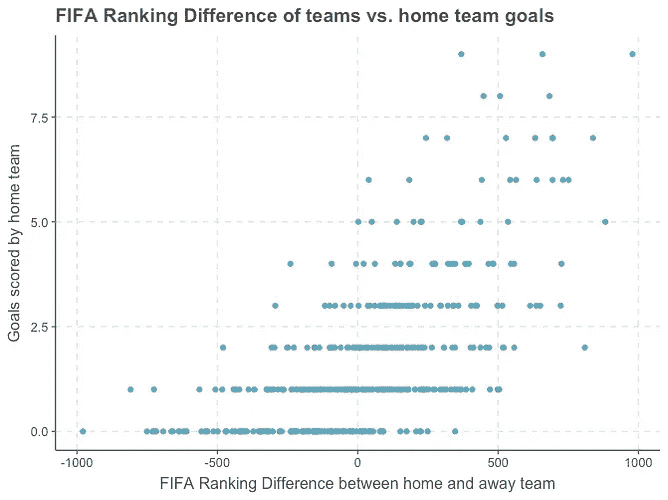
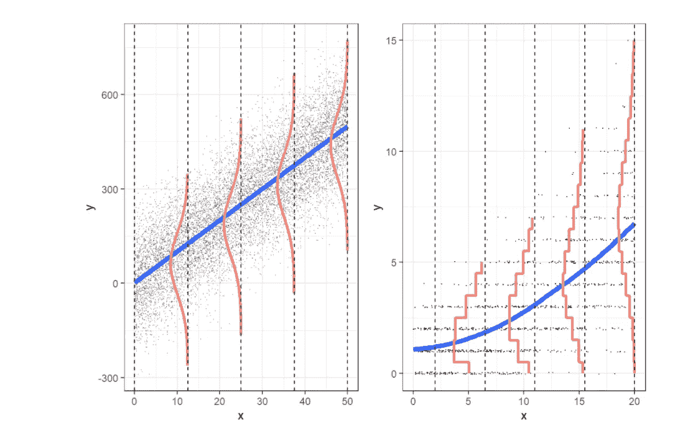
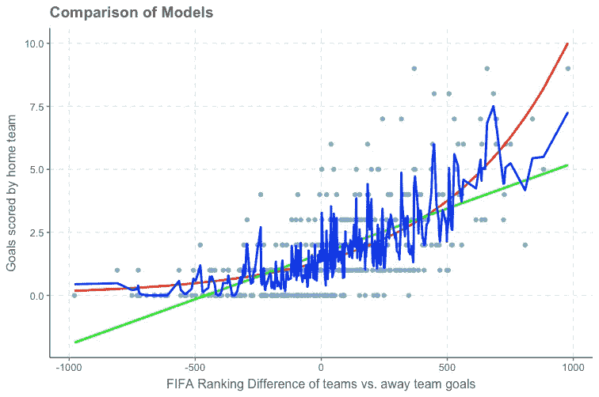
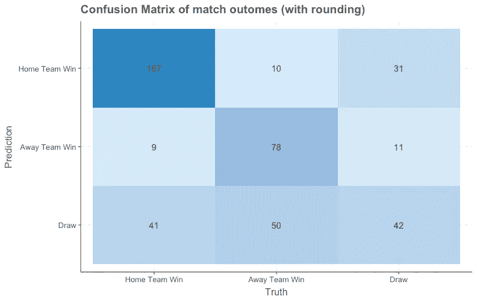
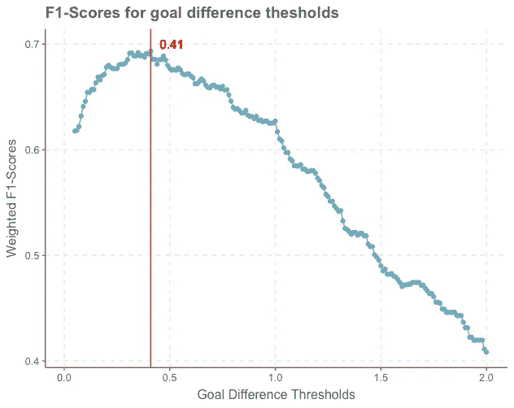
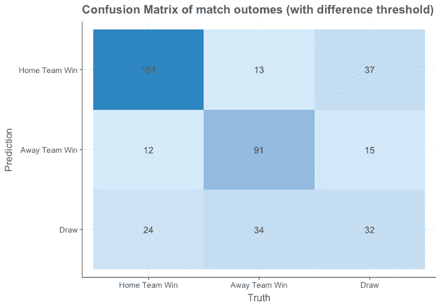
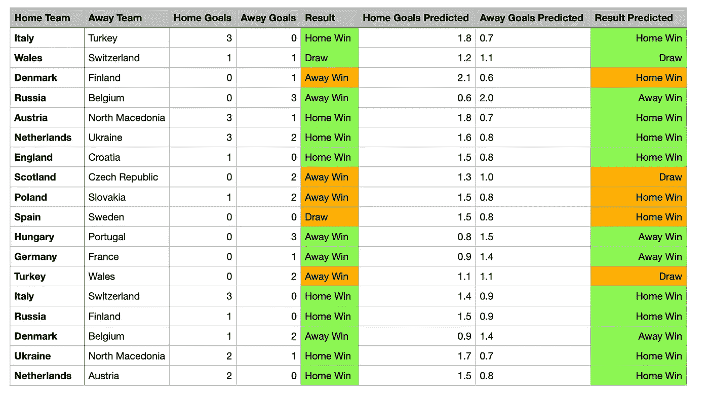

# 预测 2020 年欧锦赛的比赛

> 原文：<https://towardsdatascience.com/predicting-matches-for-the-uefa-euro-2020-championship-7dcfa449c8ee?source=collection_archive---------17----------------------->

## 预测足球比赛结果的简单泊松回归方法，准确率为 70%。


威利安·贾斯登·德·瓦斯康塞洛斯在 [Unsplash](https://unsplash.com?utm_source=medium&utm_medium=referral) 上拍摄的照片

# 期待什么？

*   在本文中，我将带您了解如何使用两个泊松回归来预测足球比赛的比分，只有一个预测变量，准确率超过 70%。如果我们记住我们使用的是一个非常简单的模型，并且只有**一个**预测变量(国际足联球队排名)，这是相当令人印象深刻的。
*   泊松回归将以基本线性回归和随机森林回归为基准。
*   您将了解为什么泊松回归是完成这项任务的好工具。
*   我们将研究如何通过专门的后处理步骤来提高预测结果的准确性/ f1 分数。

# 数据

该方法使用两个数据集，这两个数据集都可以在 Kaggle 上找到:

*   【2020 年欧锦赛参赛球队的历史比赛:[https://www . ka ggle . com/martj 42/international-football-results-from-1872-to-2017](https://www.kaggle.com/martj42/international-football-results-from-1872-to-2017)
*   **国际足联排名各队得分:*“****足球的世界管理机构国际足联的男子成员国球队根据他们的比赛成绩进行排名，最成功的球队排名最高。”*(维基百科)**[https://www.kaggle.com/cashncarry/fifaworldranking?select = FIFA _ ranking-2021-05-27 . CSV](https://www.kaggle.com/cashncarry/fifaworldranking?select=fifa_ranking-2021-05-27.csv)**

## ****训练测试数据分割和特征工程****

**为了创建我们的**训练数据**，我只考虑了 2019 年之后的比赛(因为旧的比赛可能不再代表当前球队的表现)，并随后将比赛结果与每个球队的国际足联排名结合起来。**

**最后但并非最不重要的是，我创建了一个新变量**“ranking _ diff”**，这是主客场球队之间的 FIFA 排名**的差异**。这个变量将是我们以后模型的唯一预测变量。**

**我的**测试数据**包括到目前为止 2020 年欧锦赛小组赛的所有比赛。**

> **请注意:为了让这篇文章更具可读性，我跳过了大部分代码。但是，如果你对端到端的管道感兴趣，请访问我的 [GitHub](https://github.com/sikli/simple_poissoin_soccer) 。**

**这是经过短暂预处理后的训练数据的样子(注意加入的 FIFA 得分排名列和新创建的 ranking_diff 列):**

```
date home_team away_team home_score away_score tournament home_team_ranking away_team_ranking ranking_diff

2019–01–08 Finland Sweden 1 0 Friendly 1410 1569 -159
2019–01–11 Estonia Finland 2 1 Friendly 1161 1410 -249
2019–01–11 Iceland Sweden 2 2 Friendly 1415 1569 -154
2019–03–20 Germany Serbia 1 1 Friendly 1609 1512 97
2019–03–20 Wales Trinidad and Tobago 1 0 Friendly 1570 1201 369
2019–03–21 Kosovo Denmark 2 2 Friendly 1151 1631 -480
...
```

# **探索性数据分析**

**让我们研究一下 Kaggle 的数据，看看进球的情况:**

************

****图 1:** 主客场球队进球(左)和(中)的探索性数据分析，以及参赛球队 FIFA 排名差异与主队进球(右)的关系。—作者图片**

**上面图 1 中的图表提供了一些对数据的洞察:**

*   **在左边，我们可以看到一个图表，显示了一个主队每场比赛的进球数。每场比赛的平均值是 **1.8 个进球**(红线)，主队进球最多的是 9 个！**
*   **在中间，我们可以看到同样的客队形象化。我们可以看到客场球队的平均进球数更低，每场比赛只有 **1.2 球**。每场比赛的最大进球数是 7 个(与主队的 9 个进球相比，这一数字再次下降)。**因此，我们可以清楚地看到，一支球队是在主场还是在客场比赛，进球数量会有相当大的差异。****
*   **在右侧，我们可以看到主队进球(y 轴)与竞争球队在国际足联排名中的差异(x 轴)之间的关系。在图的左下方，我们可以看到，如果国际足联排名差异非常大(主队的国际足联排名比客队低得多)，主队的进球数非常低(0-1 球)。如果一支球队是一个真正的局外人(以国际足联的得分来衡量)，它很少会进超过 2 个球！另一方面，如果两支球队的国际足联排名差异具有高正值(主队的国际足联排名比客队高得多)，则平均进球数非常高。强大得多的主队实际上从未少于 2 个进球，并且可能得分超过 7+(例如西班牙对圣马力诺)。**

# ****方法****

**从上面图 1 的图表中，我们可以从数据中获得两个重要信息:**

1.  **两支参赛球队在国际足联排名上的差距和进球数有实质性的关系！**
2.  **事实上，球队是在主场还是客场比赛对进球数量有很大的影响。主队平均进 1.8 球，客场平均只进 1.2 球。**

**为此，我训练了两个独立的回归模型:一个预测**主队**的**分数**，另一个预测**客场队**的分数。(请注意，您也可以简单地训练一个组合模型，并将球队是主场还是客场的信息作为附加因素变量包含在内)。我想让我的模型在最初的尝试中尽可能简单，并且(为了可视化的目的)选择用一个预测变量(FIFA 排名差异)训练单独的模型。**

# **什么时候用泊松？**

**文献表明，为此目的使用泊松回归是最好的方法。但是，究竟什么是泊松回归，为什么不简单地使用线性回归或其他方法，如随机森林回归方法？**

*   **嗯，一般来说，当我们预测每单位时间或空间的**计数**时，会用到泊松回归。比如每场比赛的进球数！由于计数不能为负，泊松模型的最小值是**零**(不可能得分低于零！)，理论上最大值是**无界**——虽然一个球队进球超过 5 个的情况很少发生:)**
*   **让我们再看一下图 1(左)。像许多泊松分布一样，这个分布是右偏的。很明显，这并不意味着每场比赛的进球数是正态分布的。然而，正态分布假设是线性回归的关键假设！**

## ****线性回归的问题****

*   **一个简单的线性回归模型用一条直线来表示，对于某些变量组合(如负目标数)，这肯定会产生负值。例如，在我们的使用案例中，当我们有一支非常弱的球队(国际足联排名低)与一支非常强的球队(国际足联排名高)比赛时，可能会发生线性回归模型预测较弱球队得分为负数的情况(例如-2.4 球)。这绝对是我们想要避免的。**
*   **此外，我们的数据违反了线性回归的等方差假设(正态分布)!你可以在上面的右图中看到，当国际足联排名差异获得更高的正值时，进球的方差也增加了！随后的图像再次以图形方式总结了这一点:**

****

****图 2:** 回归模型:线性回归(左)和泊松回归(右)。—图片来自 *Paul Roback 和 Julie Legler，来自* [*超越多元线性回归*](https://bookdown.org/roback/bookdown-BeyondMLR/)**

> **1.图 2 中显示线性模型的图形显示在左侧。它表明，对于 X 的每个值，响应 y 近似正态分布。右图显示了泊松模型的样子。对于 X 的每个值，响应 y 遵循泊松分布:对于泊松回归，X 的小值与一个分布相关联，该分布与许多小值和仅仅几个较大值显著偏斜。随着 X 的增加，响应的分布开始越来越像正态分布。**
> 
> **2.在线性模型(左)中，每个 X 值处 Y 的变化是相同的。对于泊松回归，随着均值的增加，X 的每个水平上的响应变得更加多变。**
> 
> **3.在线性回归的情况下，每个 X 值的平均响应落在一条线上。在泊松回归的情况下，每个 X 值处 Y 的平均值落在曲线上，而不是直线上。**

***改编自保罗·罗巴克和朱莉·勒格勒*的《 [*超越多元线性回归*](https://bookdown.org/roback/bookdown-BeyondMLR/)**

# ***比较模型***

***在本节中，我们将更深入地了解预测的建模部分，并将泊松模型与线性模型和更强大的随机森林回归进行比较。***

## ***设置模型***

***现在我们已经准备好设置模型了。在本练习中，我使用了新的 **tidymodels** 包，并使用 30 折交叉验证进行比较:***

```
*library(tidymodels)
library(parsnip)
library(poissonreg)pois_mod <-  poisson_reg() %>%  set_engine("glm")
lin_mod  <-  linear_reg() %>% set_engine("lm")
rf_mod   <-  rand_forest(trees=100) %>% 
             set_engine("randomForest") %>% 
             set_mode("regression")folds <- vfold_cv(data, v = 30)*
```

***如上所述，我们将训练两个模型，每个模型有一个预测变量(参赛球队的 FIFA 排名差异)。一个模型被训练用于预测主队的得分，一个被训练用于预测客场队的得分:***

```
*home_score_formula <- formula(“home_score ~ ranking_diff”)
away_score_formula <- formula(“away_score ~ ranking_diff”)*
```

***以下是泊松回归的示例代码:***

```
*#poisson model workflow set up for predicting home scores
pois_mod_hs_wf <- 
  workflow() %>%
  add_model(pois_mod) %>%
  add_formula(home_score_formula)#perform cross validation
pois_mod_hs_rs <- 
  pois_mod_hs_wf %>% 
  fit_resamples(folds)
...#collect cv scores
collect_metrics(pois_mod_hs_rs)
collect_metrics(lin_mod_hs_rs)
collect_metrics(rf_mod_hs_rs)*
```

## ***交叉验证结果***

***交叉验证的结果很有趣，并且表明(通过比较均方根误差(RMSE))随机森林回归优于线性回归和所讨论的泊松回归！！***

```
*CV-RMSE Poisson Regression 1.30
CV-RMSE Linear Regression 1.34
CV-RMSE Random Forest Regression 1.17*
```

## ***视觉比较模型***

***但是，等等，RMSE 真的是比较这些模型的最佳标准吗？在[这个](https://stats.stackexchange.com/questions/71720/error-metrics-for-cross-validating-poisson-models)交叉验证的线程中，有一个关于如何为泊松回归选择**性能指标的很好很长的答案，它将更详细地阐述这个主题。由于这有点过于详细，我决定在散点图中目测模型，并检查模型的所谓“外观和感觉”:*****

******

*****图 3:** 模型对比:线性回归(绿色)、泊松回归(红色)、随机森林回归(蓝色)——图片作者***

***从视觉上观察模型时，我们可以看到线性模型(绿色)明显不符合数据，根本无法捕捉曲率。然而，随机森林模型(蓝色)显示了一条忙乱的之字形线，它过度拟合了我们的数据，可能不会对新数据进行很好的概括。最后，泊松模型(红色)似乎以非常令人满意的方式捕捉到了数据的趋势和曲率！因此,“外观和感觉”清楚地表明:“使用泊松模型！”。***

******

***在 [Unsplash](https://unsplash.com?utm_source=medium&utm_medium=referral) 上[混沌足球齿轮](https://unsplash.com/@chaossoccergear?utm_source=medium&utm_medium=referral)拍摄***

# ***从估计目标到预测结果(赢、输、平)***

***让我们回顾一下我们所拥有的:两个预测主客场球队目标的回归模型。***

***但是我们实际上如何“预测”哪一队赢得了决斗呢？***

***我们不能简单地比较主客场球队的进球，把胜者定为数字较高的球队。为什么？因为由于我们的预测是浮点数，我们基本上不会以预测平局结束:想象一下，A 队的目标预测是 1.1，B 队的目标预测是 1.09。用上面描述的这个简单方法，我们将把 A 队指定为获胜者，即使两个队有非常相似的预测！***

## ***1.最简单的方法——比较每场比赛的预测目标***

***最简单的方法是简单地将分数四舍五入到最接近的整数值，然后比较这些整数。在 R 中，这可以如下进行:***

```
*pred_result <- rep(0, length(nrow(data)))#home_score_pred contains the poisson home goal predictions for each match
#away_score_pred contains the poisson away goal predictions for each match#assign home team win 0
pred_result[round(home_score_pred) > round(away_score_pred)]  <- 0 #assign away team win 1 
pred_result[round(home_score_pred) < round(away_score_pred)]  <- 1#assign draw 2
pred_result[round(home_score_pred) == round(away_score_pred)] <- 2*
```

***如果我们考虑上面的例子，用这种方法，A 队(1.1)和 B 队(1.09)都将被分配 1 个进球，因此这场比赛将被归类为平局，这似乎更合理。***

***下面是通过使用这种简单的舍入和比较方法得出的训练数据的混淆矩阵:***

******

*****图 4:** 比赛结果(主队获胜、客场获胜、平局)的混淆矩阵，用于比较全面的预测比赛分数——图片由作者提供***

***我们可以在图 4 中看到，主队获胜的预测相当不错:217 (167+9+41)中有 167 被正确预测。预测客队获胜的准确性仍然相当好，然而我们的模型结合我们的舍入方法似乎真的很难正确预测平局。***

***总的来说，训练集上的**准确度**为 **65%** ，加权 F-1 分数**为 67%** 。***

## ***2.关于如何更好地分类匹配结果的更复杂的方法***

***从上面我们可以看到，对预测的团队分数进行舍入，然后简单地进行比较，可以得到 65%的准确率。但是用不同的方法有可能得到更好的结果吗？让我们看另一个例子:***

> ***假设 A 队的预测目标是 1.49，B 队的预测目标是 1.51。在上面的舍入示例中，团队 A 的分数将被舍入为 1，团队 B 的分数将被舍入为 2，因此团队 B 将被宣布为获胜者。但是在这种情况下预测平局不是更好吗，因为两个队的目标预测都非常接近？嗯，是的！但是，我们如何为目标预测之间的差异选择正确的阈值，以便一个团队可以被宣布为赢家或输家？***

***因此，游戏结果的分类(赢、输、平)变为如下:***

```
*predicted_result <- rep(NA, length(pois_hs_res))#home_score_pred contains the poisson home goal predictions for each match
#away_score_pred contains the poisson away goal predictions for each match#assign home team win 0
predicted_result[home_score_pred > away_score_pred+diff] <- 0#assign home away win 1
predicted_result[home_score_pred < awy_score_pred-diff] <- 1#assign draw 2
predicted_result[!(home_score_pred > away_score_pred+diff) & !(home_score_pred < away_score_pred-diff)] <- 2*
```

***因此，本质上，我们正在寻找一种方法，如何最大限度地提高基于进球差异阈值的比赛结果分类的准确性:***

***一旦我们选择了一个指标，比如说“加权 F1 得分”或“准确性”，我们可以简单地对一系列净胜球阈值运行上面的结果分配，看看哪个阈值产生最好的 F1 得分。让我们做吧！***

******

*****图 5:** 一组净胜球阈值的比赛结果分类(赢、输、平)的加权 F1 分数。—作者图片***

***上面的图 5 显示了我们的比赛分类(赢、输、平)的 F1 分数根据我们选择的差异阈值而变化很大。最初，F1 分数开始增加到几乎 70%,差异阈值为 0.41。之后，F1 分数开始再次稳定下降，并在图表右侧达到最小值。***

***从上图中选择检测到的“最佳”差异阈值后，我们运行上面的游戏结果分配，并获得以下混淆矩阵和准确度:***

******

*****图 6:** 带有自定义差异阈值的比赛结果(主队获胜、客场获胜、平局)的混淆矩阵—图片由作者提供***

***我们可以看到，与之前的方法相比，主队获胜和客场获胜的预测都增加了！不幸的是，我们的方法仍然难以正确检测和局。一个潜在的改进是使用另一个单独的差异阈值来分配和局。然而，这将使文章比现在更长:)***

***总的来说，**准确率和 F1 得分**都从大约 65%跃升到现在的 **69%！*****

# ***预测 2020 年欧锦赛***

***受够了无聊的数据争论和建模！让我们最后使用我们的方法来预测 2020 年欧锦赛小组赛的第一场比赛的结果:***

******

***你可以看到，通过这个简单的方法，我们在测试集上达到了 72% 的**准确率和 71%** 的加权 **F1 得分。18 场比赛中有 13 场预测正确！大多数决斗都预测正确，老实说，谁能想到丹麦会在本届锦标赛中表现如此出色，而西班牙只会与瑞典打成平局？:)*****

> ***请注意以下几点:主客场球队对进球的依赖只有在比赛场地是**而不是** **中立**时才有意义。然而，在欧洲锦标赛期间，大多数比赛场地都是中立的，因此，通过一个不考虑主客场球队的单一模型来预测两支球队的结果会更合适。***

## ***摘要***

***这是一个关于如何通过简单的泊松回归预测足球比分和结果的详细演练，只使用一个预测变量(国际足联在参赛球队之间的排名差异)。总的来说，我们达到了 72%的准确率。但是，还有很大的提升空间！例如，我们可以使用更多的特征作为模型的输入，例如在最近几场比赛中每支球队的进球数作为最新表现的指标！***

***如果你有兴趣阅读更多关于这个话题的内容，或者想让你的朋友对即将到来的游戏印象深刻，请给我写一篇评论！:)***

***如果你对完整代码感兴趣，请访问我的 [GitHub](https://github.com/sikli/simple_poissoin_soccer) 。***

******

***照片由[桑德罗·舒赫](https://unsplash.com/@schuh?utm_source=medium&utm_medium=referral)在 [Unsplash](https://unsplash.com?utm_source=medium&utm_medium=referral) 上拍摄***