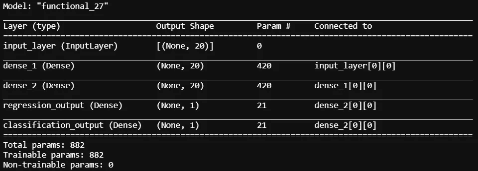
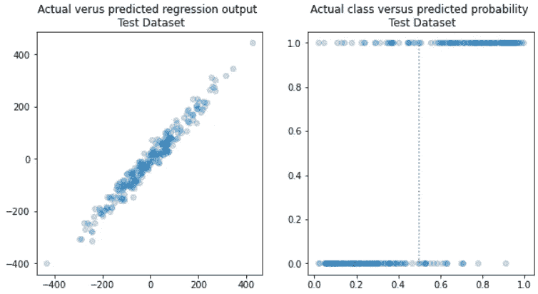
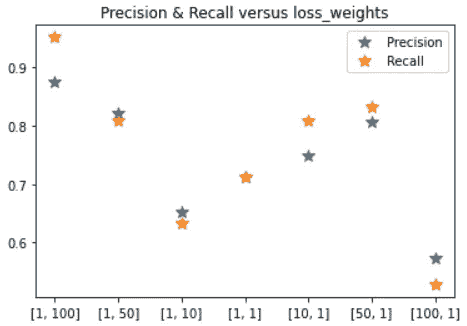
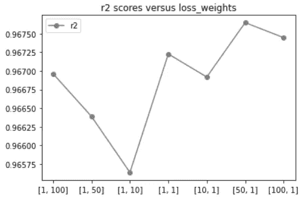

# 用神经网络和 Keras 预测混合目标

> 原文：<https://towardsdatascience.com/predicting-mixed-targets-with-neural-networks-and-keras-1dc754ce0c98?source=collection_archive---------16----------------------->

## 训练神经网络同时预测两个不同的目标。

桑哈迪普酒吧招待在 [Unsplash](https://unsplash.com?utm_source=medium&utm_medium=referral) 上拍摄的照片

使用节点网络，您可以训练考虑多个目标甚至不同类型目标的模型。当我第一次在实际项目中尝试时，我认为这太棒了，它打开了我对神经网络所能做的事情的认识。在本文中，我将讨论如何训练一个神经网络来同时预测两个不同的目标。如果你是一名数据科学家或机器学习工程师，那么你应该考虑神经网络，因为它们提供了其他开箱即用的 ML 算法所不具备的大量能力和灵活性。

## 多目标训练和预测

如果使用相同的特征对多个目标进行预测，则可以使用相同的特征对这些目标训练网络。数据集中的某些要素可能更适合其中一个目标，而不适合另一个目标。如果您愿意，还可以将模型架构设置为适应两个不同的训练数据集，但这里我们将两个特征集连接在一起。我这样做是为了让我们可以在单个训练数据集上看到改变损失权重对模型性能的影响。

下面是使用 Keras 模型 API 定义网络的代码。请注意，模型中有两个输出层和两个输出:一个用于回归，一个用于分类。在这个问题中，我们希望同时预测这两个目标。

作者图片

参见*性能使用损失权重*部分的代码要点，了解模型训练的语法。

## 模型架构

对于这个例子，层的实际网络只有两个深度且密集连接。通常，使用单个输出层，并且根据目标类型，选择单个激活类型。这里使用了回归和分类目标，因此使用了两个输出图层:

作者图片:具有两个输出层的神经网络的模型架构，一个用于回归目标，一个用于分类目标

对于*回归 _ 输出*层，具有线性激活的单个节点，对于*分类 _ 输出*层，我们只需要具有 sigmoid 层的单个节点。这确保了来自模型的预测与它们想要预测的目标类型相匹配。

## 网络预测

在左侧，显示了来自*回归输出*的测试数据集预测与实际测试数据集值的对比。在右侧，显示了来自*分类 _ 输出*的测试数据集概率预测与测试数据集中的实际类的对比。

作者提供的图像:对模型同时在两个目标上生成的预测的描述

两者都可以从训练好的模型的*预测*方法中获得。请参考 Keras 文档或查看文章底部的链接，以查看 github 上的完整笔记本。基本上，predict 方法将返回每个目标的预测列表，在这种情况下，将有两个预测列表。

## 使用不同损失权重的性能

除了训练一个模型来预测多个目标之外，我们还可以选择我们想要从哪个目标学习更多。我这样说的意思是，我们可以给目标指定权重，以指定哪个更重要(如果是这样的话)。

根据 Keras 文档中关于此参数的信息:

> **loss_weights** :指定标量系数(Python floats)的可选列表或字典，用于对不同模型输出的损失贡献进行加权。**由模型最小化的损失值将是所有单个损失的*加权和*，由** `***loss_weights***` **系数加权。**如果是一个列表，它应该与模型的输出有 1:1 的映射。如果是 dict，它应该将输出名称(字符串)映射到标量系数。

这里的要点是，我们可以通过增加 *loss_weights* 参数中的权重来增加其中一个输出层对模型损耗的贡献。在下面的代码片段中，我在每个训练循环中选择不同的 *loss_weights* 参数。我们将看到改变这个参数是如何影响性能的。

作者图片

**精度&召回性能**

作者图片

从左到右，与每个目标的损失相关联的权重被改变。例如，第一个值[1，100]会将分类损失度量(最像对数损失，但标记为二进制交叉熵)加权为回归损失度量(均方误差)的 100 倍。这里的意图是通过在分类度量上制造更多的错误来惩罚模型，并且有希望为分类目标返回更好的预测模型。

请注意，在更改损失权重以支持分类而非回归之后，测试数据集的性能会发生怎样的变化，反之亦然。

**R 平方性能**

作者图片

类似地，对于回归性能，当回归的权重大于分类损失度量时，存在性能增加的一般趋势。回归目标已经由特性集(基本上是一个函数关系)很好地定义了，所以性能接近完美，但是思想仍然是相同的。

## 结论

使用节点网络，您可以训练考虑多个目标甚至不同类型目标的模型。还可以衡量哪个目标的损失对整体模型损失的贡献更大，这是一种说明哪个目标需要更多学习的方式。与神经网络一样，您可以通过定义模型架构做更多的事情。虽然我们在这个示例中使用了单个输入层和多个目标，但是也可以使用单独的输入层和单独的输出层来定义模型。如果你是一名数据科学家或机器学习工程师，那么你应该关注神经网络，因为它们提供了其他 ML 算法所不具备的大量能力和灵活性。

## 参考

 [## GitHub-Casey Horton/medium-blog-code

### 在 GitHub 上创建一个帐户，为 Casey Horton/medium-blog-code 开发做贡献。

github.com](https://github.com/caseywhorton/medium-blog-code)  [## Keras 文档:模型训练 API

### 为训练配置模型。参数优化器:字符串(优化器的名称)或优化器实例…

keras.io](https://keras.io/api/models/model_training_apis/)