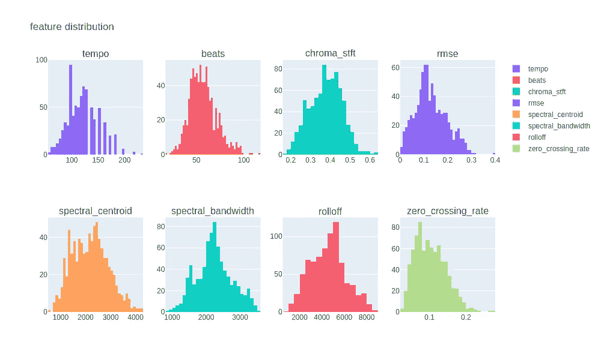
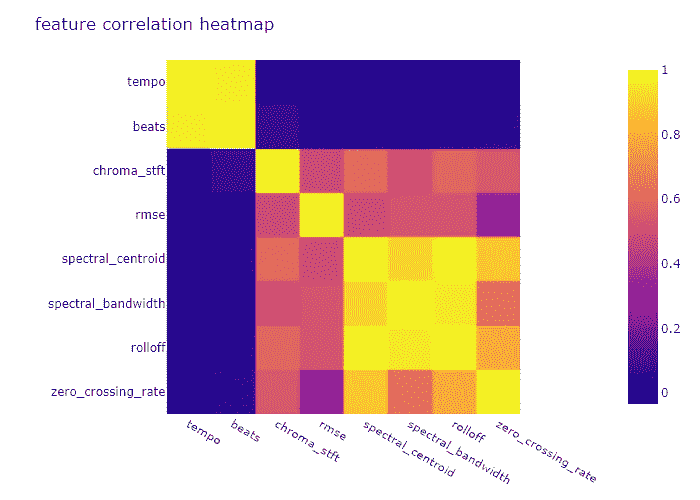
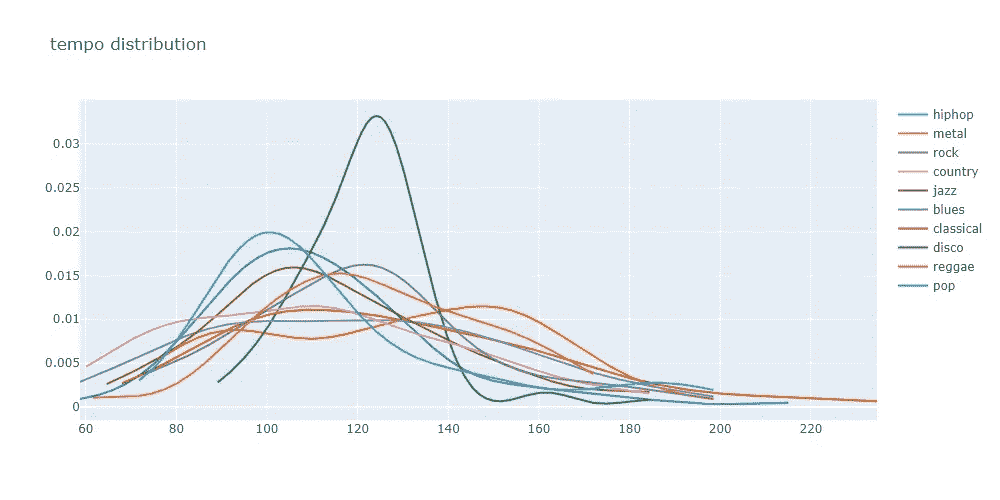
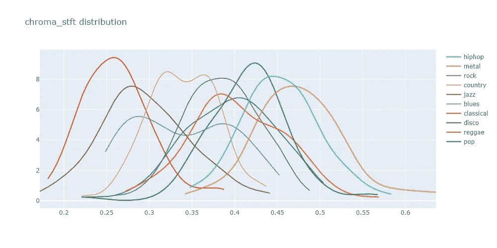
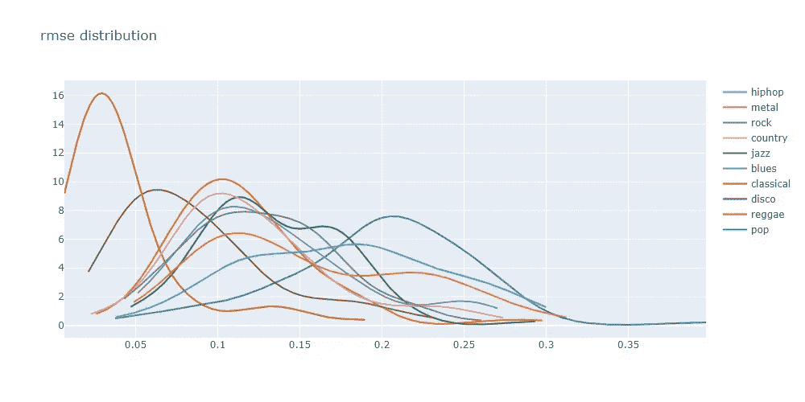
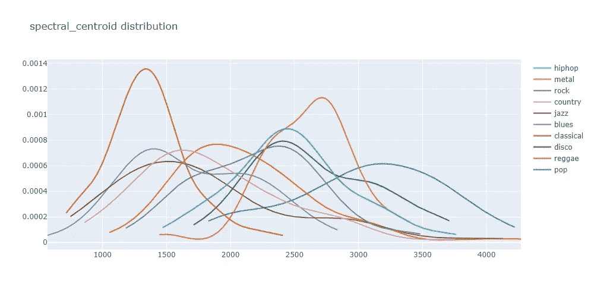
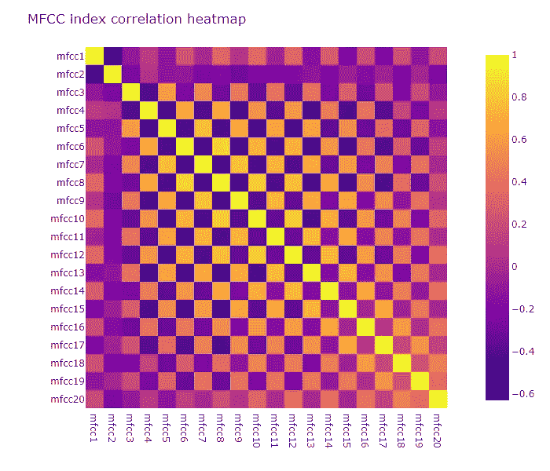
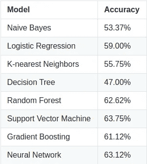
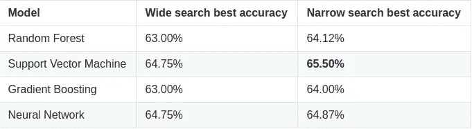

# 利用波形特征预测音乐类型

> 原文：<https://towardsdatascience.com/predicting-music-genres-using-waveform-features-5080e788eb64?source=collection_archive---------29----------------------->

## 什么样的节拍让你想动起来？那种光谱质心呢？

我们能利用从音乐波形中提取的特征来预测音乐类型吗？为了回答这个问题，我使用了我在 Kaggle 上找到的这个数据集。目标是使用数据集中呈现的量化特征对音乐进行分类，如*节拍*、*频谱重心、*以及歌曲的其他数学分层。所以，事不宜迟，让我们完成这个项目吧！

# 资料组

数据集由从 1000 首每首 30 秒的音轨中提取的波形特征组成，根据它们所属的音乐流派进行标记，共有 10 个不同的类别:**布鲁斯**，**古典**，**乡村**，**迪斯科**，**嘻哈**，**爵士**，**金属**，**流行**，**雷鬼**

**通过使用音乐信息检索技术，利用 [libROSA](https://librosa.org/doc/latest/index.html) 库提取特征集。这个数据集的功劳归于 [MARSYAS](http://marsyas.info/) 。**

# **取得的成果**

**最佳模型能够在从数据集获取的看不见的数据上实现 68.5%的精确度。考虑到样本数量少而类别数量多(每个音乐流派只有 100 个样本)，这可以被认为是一个好的结果。**

# **要求和设置**

**要复制这个项目，您需要下载这个 [GitHub repo](https://github.com/Pedrohgv/Music_Genre_Classification) 中的文件，并运行 [jupyter notebook](https://github.com/Pedrohgv/Music_Genre_Classification/blob/master/notebook.ipynb) (如果您想检查它，它包含所有代码)，但不是在安装所需的包之前(建议创建一个新的虚拟环境，以避免依赖冲突)。因为我通常同时在 Linux 和 Windows 上开发我的项目，你可以选择哪一个最适合你。如果您使用的是 Linux，请打开终端并键入:**

```
pip install -r requirements-linux.txt
```

**或者，如果您喜欢 Windows，请使用:**

```
pip install -r requirements-windows.txt
```

# **特征探索和工程**

**数据集分为训练集和测试集，因此我们可以在以后对训练过程中未使用的数据进行预测。所有的数据探索都将使用训练数据来完成，因为我们将测试集保持为*不可见数据*。**

**现在，我们将进一步了解数据集的特征。总共有 8 个不同的数字特征，加上编号从 1 到 20 的*梅尔频率倒谱系数*。我们将首先探索前 8 个特征，然后分析 *MFCC* 系数。**

**功能的分布如下所示:**

****

**作者图片**

**正如我们从上面的图中看到的，这些特征以一种相当正常的方式分布，有一些小的偏差；为了让我们的一些模型更容易消化数据，标准化过程将受到欢迎。现在，让我们看看我们的特征之间的相关性:**

****

**作者图片**

**这可以让我们对我们的一些专栏有一些有趣的了解；`spectral_bandwidth`、`rolloff`、`zero_crossing_rate`均与`spectral_centroid`高度相关，`beats`与`tempo`高度相关。因此，我们将只在数据集中保留`tempo`、`chroma_stft`、`rmse`和`spectral_centroid`，将此步骤中的特征数量从 8 个减少到 4 个。**

**现在，我们将研究我们将要使用的功能。为此，我们将绘制不同目标类的核密度估计，并给出每个特性的简要描述。值得注意的是，图中的纵轴代表所绘制变量的密度；这意味着规模将受到每个变量范围的影响。**

## **拍子**

**`tempo`功能告诉我们一首歌的节奏。该值越高，歌曲播放速度越快。**

****

**作者图片**

## **`chroma_stft`**

**`chroma_stft`特征代表每首歌曲的[短时傅立叶变换](https://en.wikipedia.org/wiki/Short-time_Fourier_transform)。然而，该特征被减少为单个值，并且数据集不包括对它所表示的内容的解释(完整的傅立叶变换对于每个频率将具有单个值，表示该频率对歌曲整体的贡献)。给定数据集中存在的值的范围，我们可以假设它们对应于每首歌曲中主导频率的比例。**

****

**作者图片**

## **均方根误差(root-mean-square error)**

**`rmse`代表[均方根能量](https://musicinformationretrieval.com/energy.html#:~:text=The%20root%2Dmean%2Dsquare%20energy,x%2C%20sr%20%3D%20librosa)，代表给定信号的总能量。**

****

**作者图片**

## **`spectral_centroid`**

**`spectral_centroid` [属性](https://en.wikipedia.org/wiki/Spectral_centroid)表示对应于信号质心的频率。**

****

**作者图片**

**上面的图表向我们展示了所有特征在不同目标类别中的分布有显著差异；因此，它们将有助于我们建立预测音乐流派的模型。**

## **MFCC 系数**

**MFCCs 代表[梅尔频率倒谱系数](https://en.wikipedia.org/wiki/Mel-frequency_cepstrum)，共同组成 MFC(梅尔频率倒谱)。在我们的数据集中有 20 个 MFCC 氏症。**

**在检查了一维特征之后，我们现在可以通过验证它们如何相互关联来类似地分析 MFCC 系数。**

****

**作者图片**

**通过观察上面的图，我们可以看到奇数和偶数系数组的高相关性，不包括第一和第二 MFCC 系数。为了降低该特征的维数，我们将应用 PCA 方法来减少奇数和偶数 MFCC 的数量。通过分解两组奇数和偶数索引，我们可以看到有多少冗余信息；为了测量这一点，我们将使用由 PCA 变换产生的每个分量的解释方差:**

```
Explained variance (on tranining set) of reduced odd MFCC's: [0.68552199 0.1823339 
0.04741692 0.02504977 0.01711308 0.01659338 0.01124799 0.00869031 0.00603266]Explained variance (on tranining set) of reduced even MFCC's: [0.71564189 0.13864236 
0.05718861 0.02319806 0.01853898 0.0147636 0.01390881 0.00991512 0.00820257]
```

**根据上述结果，我们可以得出结论，在奇数和偶数系数组中发现的大多数信息(大约 97%)可以在前 3 个分量中合成；但是，我们将保留每组中的 7 个组件，将维度总数从 18 个减少到 14 个，以便保留特征中 99%的信息。**

**下一步是标准化数据集的列，这样它们可以更容易地被我们的一些模型消化。在这之后，我们终于准备好开始训练一些模型。**

# **模型训练和优化**

**我们将使用默认参数化来训练一些机器学习模型，在 5 重交叉验证方法中根据它们在验证折叠中的平均准确度来对模型评分。朴素贝叶斯模型将被用作我们的基线。一旦我们完成了这些，最好的模型将被挑选出来并进行微调，这样我们就能达到最好的结果。以下是各型号达到的精度:**

****

**作者图片**

**在上面显示的模型中，我们将只选择 4 个模型进行进一步调整:取得最佳结果的**随机森林**、**支持向量**、**梯度提升**和**神经网络**。策略是首先使用`RandomizedSeacrhCV`函数对参数进行广泛的随机搜索，然后使用`GridSearchCV`函数对最佳超参数进行更窄的搜索。这一过程的结果如下所示:**

****

**作者图片**

**根据上述结果，超参数调整后达到最高准确度的模型是**支持向量分类器**，它将被选为我们问题的最佳模型。我们最终可以使用我们的测试集来验证它对音乐流派的预测有多好。在我们的测试集上对模型进行评分后，分类器获得了 **68.5%** 的分数。**

# **最终结论**

**尽管最好的评分模型实现了低于 70%的准确性，但仍然值得注意的是，这样一个每类只有 100 个样本并且总共有 10 个不同类的小数据集(仅包含波形信息)足以允许分类模型在超过 65%的时间内正确预测音乐流派。也许如果我们有更多的样本或者更多的特征，我们可以获得更好的结果。**