# 预测网络新闻流行度(上)

> 原文：<https://towardsdatascience.com/predicting-online-news-popularity-part-1-aae9a4f7f1a4?source=collection_archive---------22----------------------->

## 《纽约时报》16K 篇文章的探索性数据分析

斯蒂芬·瓦伦丁在 [Unsplash](https://unsplash.com/s/photos/new-york-times?utm_source=unsplash&utm_medium=referral&utm_content=creditCopyText) 上拍摄的照片

# 介绍

新闻机构越来越依赖媒体分析来吸引和留住读者。由于新冠肺炎和其他疫情危机前的趋势，今年[的广告收入大幅下降](https://www.niemanlab.org/2020/05/the-new-york-times-success-with-digital-subscriptions-is-accelerating-not-slowing-down/)，这一点变得尤其真实。

对于媒体公司来说，知道哪些新闻文章能引起读者的共鸣，哪些文章不能，变得至关重要。考虑到这一点，我想找出是什么让一篇新闻文章受欢迎或不受欢迎。我决定看看《纽约时报》的在线新闻文章，并根据包括字数和标题摘要长度在内的各种特征来预测新闻受欢迎程度。

在这篇文章中，我将主要关注探索性数据分析，在这里我将挑选出趋势和模式，同时找出可能是机器学习模型最重要的预测因素。

# 数据

对于这个项目，我访问了纽约时报 API，并检索了 2020 年 1 月 1 日至 12 月 31 日之间的文章和评论的元数据。你可以按照[这里的](/collecting-data-from-the-new-york-times-over-any-period-of-time-3e365504004)的步骤来获得关于如何做到这一点的教程。

总的来说，我设法获得了超过 **16，000 篇具有 **11 个特征**的文章**，以及近 **5，000，000 条具有 **23 个特征**的评论**。我已经在 Kaggle 上上传了完整的数据集，供任何想尝试的人使用。

让我们看看我们的目标变量:

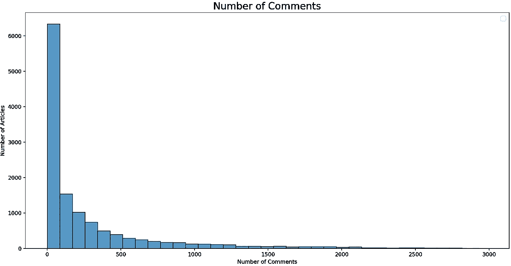

评论在所有文章中的分布

我们的评论在我们的文章中分布很不均匀。特别是我们 50%的文章评论都不到 90 条。在这里，你可以把它作为一个回归项目或者一个分类项目来进行。

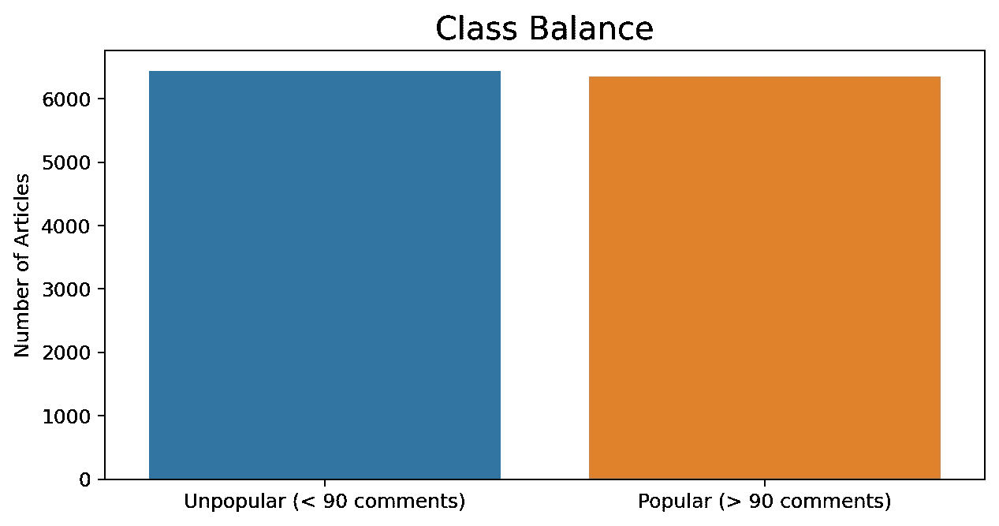

对于我的项目，我创建了一个二进制分类变量，其中我选择将评论超过 90 条的文章分类为受欢迎，将评论少于 90 条的文章分类为不受欢迎。正如你所看到的，我们的数据在积极类和消极类之间几乎平分秋色。

# 探索性数据分析

那么文章人气最重要的因素是什么呢？让我们找出答案。

## 字数

你可能会直觉地猜到，文章受欢迎程度的最重要的预测指标之一是字数，它实际上与我们的目标类别有相当大的正相关性。这里唯一的问题是，我们的字数统计变量是相当倾斜的。

一般来说，当变量的分布为正态时，机器学习算法往往表现更好——换句话说，对于具有标准分布的变量，性能往往会提高。下面，我尝试了各种变换方法，试图实现一个正态分布。

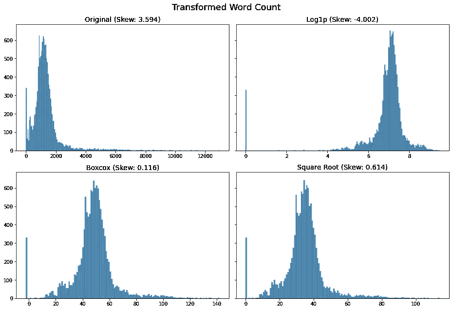

你会注意到一组文章的字数为 0。这些是不含文字的互动文章。这个数据并不完全是“随机缺失”(MAR)，所以我决定不在这里进行任何类型的插补。

为了证明评论数量和字数之间的正相关关系，我做了一个散点图，比较了前五名报纸的字数和评论数量。

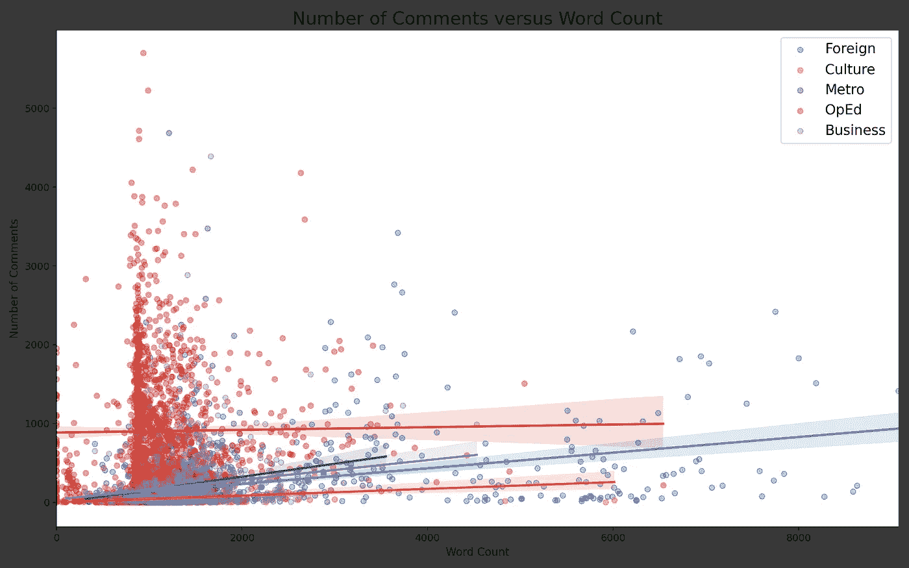

有趣的是，新闻专栏文章的字数与每篇文章的评论数没有正相关关系。

## 新闻部

以下是我的数据集中最大的新闻栏目。这些新闻服务台代表了我的数据集的 50%以上。不出所料，专栏新闻部的文章平均受欢迎程度最高，其次是外国和商业新闻部。2017 年，NYT 实施了[新评论系统](https://www.nytimes.com/2017/06/13/insider/have-a-comment-leave-a-comment.html)，24 小时开放专栏文章和其他精选新闻文章。这可能是为什么专栏文章似乎吸引了更高频率的评论的部分原因。

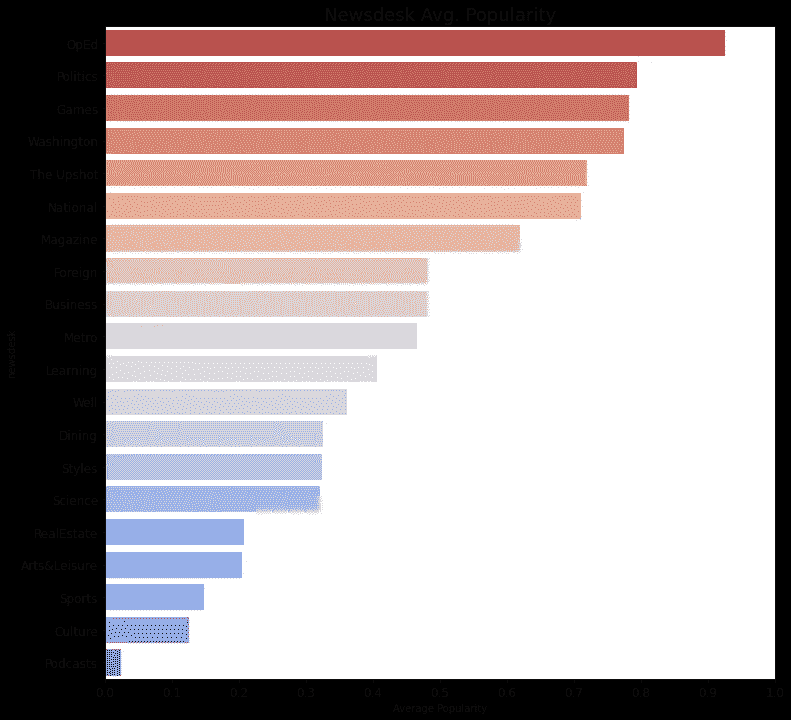

## 标题和摘要长度

文章标题和摘要的长度也与受欢迎程度有一定关系。下面，你可以看到有点 U 型分布。标题和摘要不太罗嗦的文章往往比标题和摘要更罗嗦的文章更受欢迎。

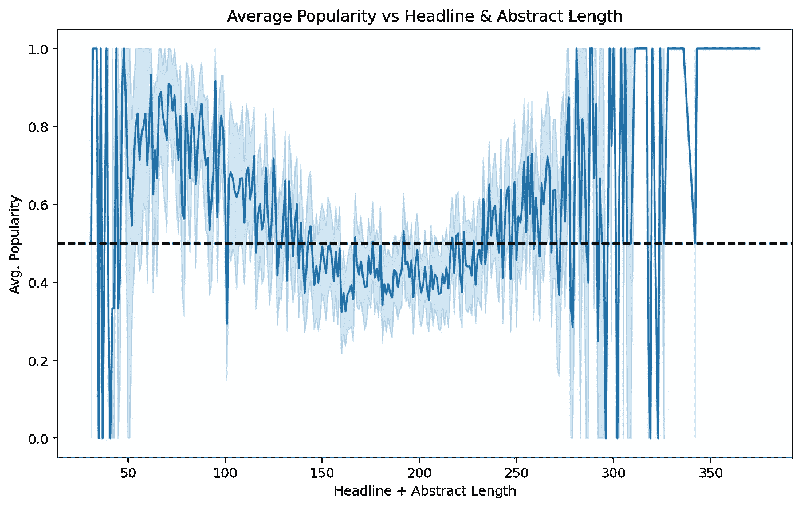

然而，也有一点相反的趋势，标题和摘要很长的文章往往表现良好。我们看到，在极端的上端和下端，文章的受欢迎程度是相当不可预测的，往往波动很大。

## 材料类型

我们可以看到社论和专栏文章往往做得非常好。新闻分析和互动功能往往更受欢迎，而常规新闻往往不太受欢迎。评论、讣告和新闻简报通常做得不好。

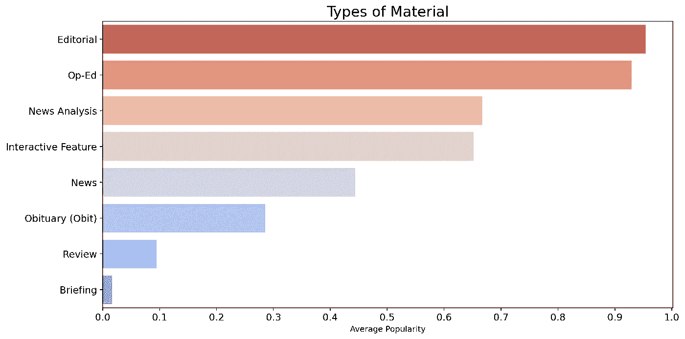

## 星期几

事实证明，周末发表的文章实际上做得更好——我们可以推断，这是因为一天发表的文章数量与平均受欢迎程度成反比。换句话说，文章往往在周末表现更好，因为文章之间的“竞争”更少。

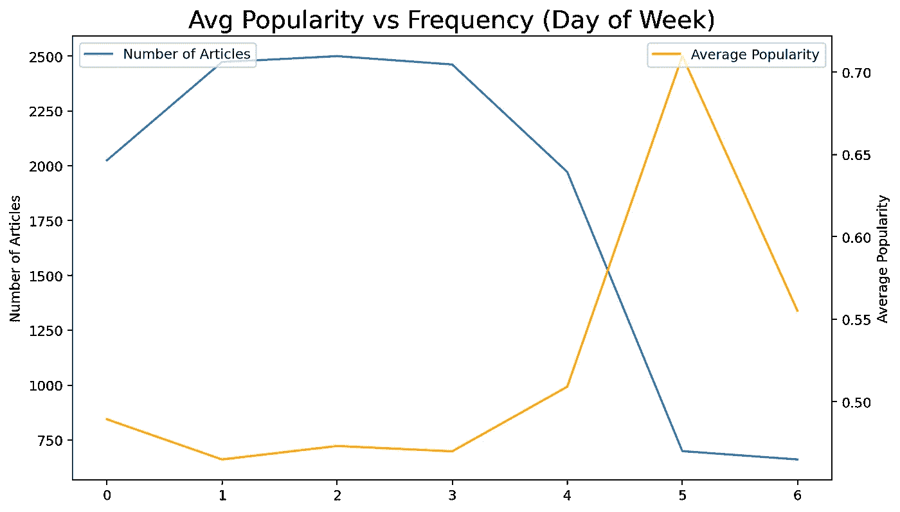

## **一天中的时间**

最后，一天中的时间也对受欢迎程度有影响。与白天发表的文章相比，晚上发表的文章似乎更容易受欢迎——除了上午 9 点。

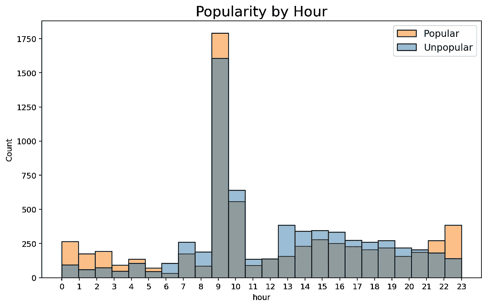

## 关键词/主题

任何人都不会对此感到惊讶，但是某些主题比其他主题做得更好。使用我们的文章关键字作为我们文章中主题的代理，我们可以比较不同时期主题的受欢迎程度。

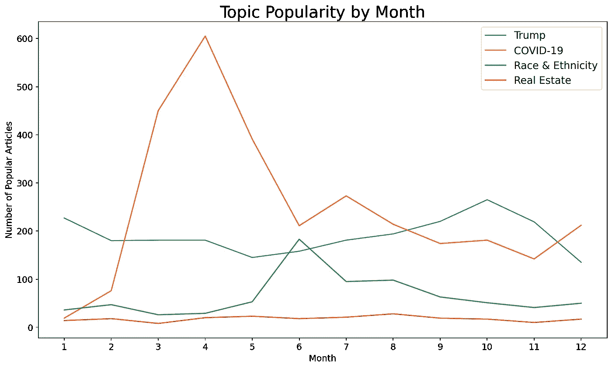

我先从房间里的(橙色)大象说起——自 2016 年以来，唐纳德·特朗普一直是《纽约时报》的热门话题。这在 2020 年没有什么不同，尽管我们可以看到新闻周期在 10 月份达到高潮，并随着总统选举的失败而在 12 月份开始略有下降。

从每月热门文章的频率来看，我们可以清楚地看到，新冠肺炎新闻在 4 月份达到了顶峰，然后在年底逐渐减少。

随着乔治·弗洛伊德在五月和六月的抗议，种族和民族成为今年的热门话题。

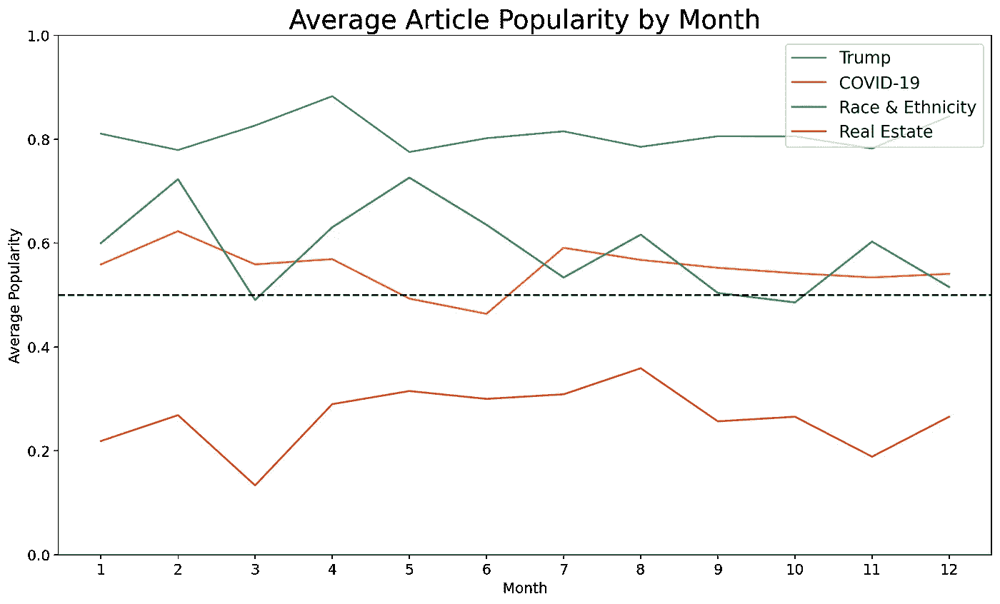

如果我们再深入一点，看看平均受欢迎程度，就会发现不同主题之间的受欢迎程度形成了鲜明的对比。约 80%提到唐纳德·特朗普的文章很受欢迎，而只有约 30%提到房地产的文章很受欢迎。

# 结论

这里有几个值得关注的关键趋势:

*   较长的文章总体上会更好(除了专栏文章)
*   来自专栏、政治、游戏和华盛顿新闻台的文章可能受欢迎，而来自体育、文化和播客新闻台的文章可能不受欢迎。
*   标题和摘要较短(50-130 字)的文章更有可能受欢迎。
*   新闻分析和互动文章往往比讣告和常规新闻报道更受欢迎。
*   发表的日期和时间会影响文章的受欢迎程度——文章在周末或晚上 11 点到凌晨 2 点之间发表似乎更好。
*   某些主题在全年的表现都比其他主题好得多(例如唐纳德·特朗普)，而其他主题只在一年中的特定时间表现良好。

# 感谢阅读！

这就是这篇文章的全部内容——希望你喜欢！稍后我可能会再发一篇关于特征工程和建模的文章，但是如果你有兴趣看这个项目的源代码，你可以在这里找到它。你也可以在我的[网站](https://www.benjamindornel.com/nyt-article-popularity.html)上找到一篇更具技术性的文章。

也可以在 LinkedIn 上与我联系。