# Airbnb 房源的最优定价

> 原文：<https://towardsdatascience.com/predicting-optimum-airbnb-listing-prices-in-singapore-8a00839c5aa8?source=collection_archive---------30----------------------->

## 利用 XGBoost 和 SHAP 预测 Airbnb 在新加坡的最优挂牌价格


[丽塔·塞尔玛](https://unsplash.com/@turutututuu?utm_source=medium&utm_medium=referral)在 [Unsplash](https://unsplash.com?utm_source=medium&utm_medium=referral) 上的照片

# 1.介绍

Airbnb 房东应该如何给自己的房产定价**实现利润最大化**？他们是应该给房产 ***定价过高*** 以试图以牺牲销售额为代价获得更高的利润率，还是应该更有竞争力*以产生更多的销售额？许多 Airbnb 房东都在纠结这个定价问题:他们不知道自己是否通过次优定价削减了潜在利润。*

*这个项目的目标是使用人工智能模型提出最优价格，同时清晰地**解释**这些价格的推导，以便主机在做出各种定价决策时更加客观。*

# *2.数据*

## *2.1 获取数据*

*Airbnb 已经开源了它的数据，但是 Airbnb 内部的[进行了进一步的清理和聚合。我们将在 Airbnb 内部仅使用**新加坡**数据集。](http://insideairbnb.com/get-the-data.html)*

*对于任何一个不同的日期，都有多个文件可供下载。由于可用的日期彼此之间似乎没有一致的模式(上传/处理可能是 Airbnb 或 Airbnb 内部的手动过程)，我们可以整理日期列表，并尝试使用 Colab 迭代下载每个文件。*

*首先，将所有可用的日期存储到一个列表中:*

```
*# All archive dates for Singapore
date_archive = ["2020-10-26", "2020-06-22", "2020-05-27", "2020-04-26", "2020-03-21", "2020-02-27", "2020-01-26", "2019-12-28", "2019-11-26",
                "2019-10-25", "2019-09-25", "2019-08-28", "2019-07-21", "2019-06-25", "2019-05-23", "2019-04-20", "2019-03-18"]*
```

*其次，由于每个文件的 URL 都是通过日期来区分的，所以我们可以使用 list comprehension 来创建下载 URL 的列表:*

```
*# Download URL List
listingUrl = ["<http://data.insideairbnb.com/singapore/sg/singapore/{}/visualisations/listings.csv>".format(i) for i in date_archive]*
```

*由于我们不能简单地在 Python 的“for-loop”中使用终端命令`!wget`，我们可以在*中存储之前的链接列表。txt* 文件，然后使用`!wget -i`下载所有可用文件。*

```
*# Write to .txt file
with open('listingUrl.txt', 'w') as f:
    for item in listingUrl:
        f.write("%s\\n" % item)# Download all dataset from txt file
! wget -i /content/listingUrl.txt*
```

*最后，我们可以将所有单独的文件连接成一个主文件，并反复清理子文件。*

```
*# Concat all available files
df_listing_summary = pd.concat([pd.read_csv("/content/listings.csv.{}".format(i)) for i in range(1, 17)])
df_listing_summary = df_listing_summary.drop_duplicates()# Delete sub-parts after merging
for i in range(1, 18):
  os.remove("/content/listings.csv.{}".format(i))*
```

## *2.2 列表和审查数据*

*列表数据集包含关于房东准备出租的每处房产的信息。因此，属性在列表数据集中是唯一的。我们可以通过获得 Airbnb 内部可用的另一个**评论**维度来进一步扩展数据集。*

*由于每个属性可以有多个评论(1:M 关系)，属性数据集应该左连接到“listing_id”上的评论，以形成最终的数据集。*

```
*df = df_listing.merge(df_review, how = 'left', on = 'listing_id')*
```

# *3.电子设计自动化(Electronic Design Automation)*

## *3.1 房间类型*

*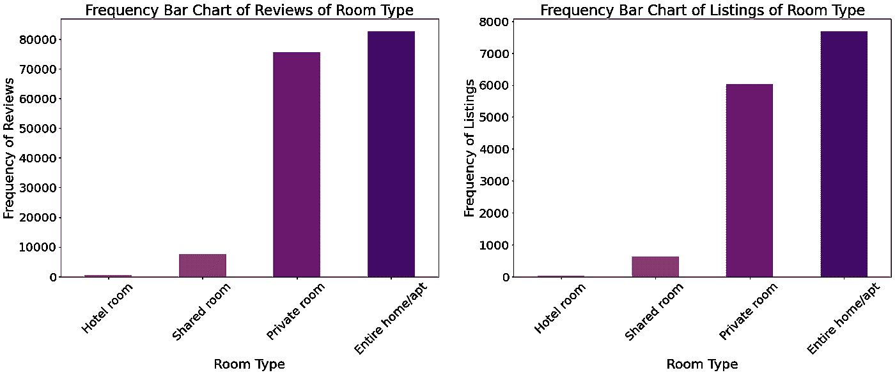*

*作者图片|点评和列表的房间类型条形图*

*我们可以明显地看到，**评论**和**列表**在每个给定的级别上都有几乎相同的分布。从每个 y 轴的刻度可以看出，评论大约比列表多 10 倍。新加坡的 Airbnb 房东倾向于提供*整个家庭*或*私人房间*，而不是*合租*房间。相反，这可能是一个需求问题，因为 Airbnb 的客人会做短暂的临时住宿，而*合租房间*通常意味着长期住宿(愿意牺牲隐私以降低成本)。*

## *3.2 邻里和邻里团体*

**中部地区似乎严重过剩。**

*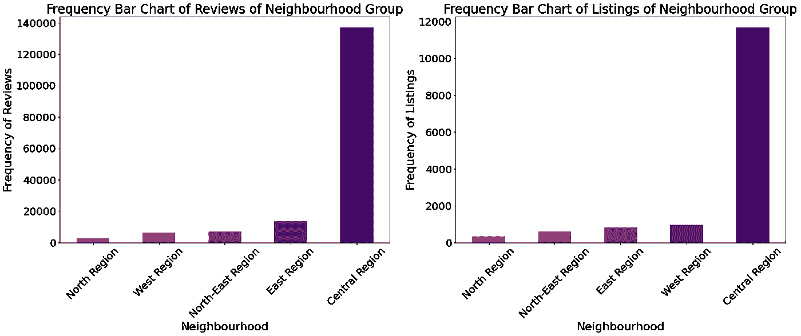*

*图片由作者提供|邻里小组评论和列表的条形图*

*提供更精细地理位置点的类似属性显示，大多数 Airbnb 主机来自少数*邻居*，这可能在*中心区域*。*

*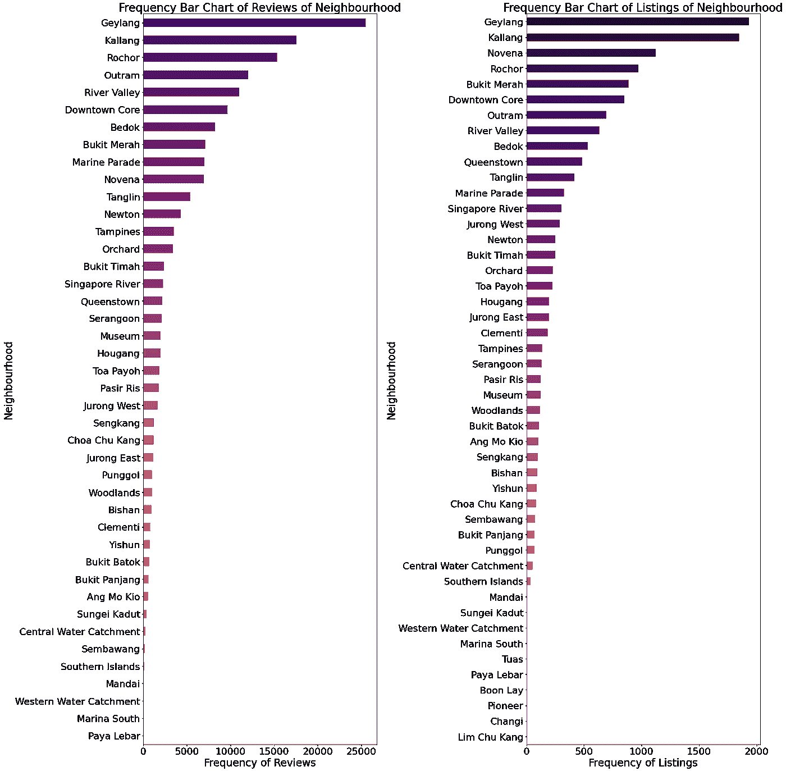*

*作者图片|邻居评论和列表的条形图*

**纬度和经度*属性进一步精确定位每个列表的位置。使用`folium`的列表频率热图证实了一个事实，即大多数列表都聚集在*中心区域*，其余区域看起来相对较暗。*

*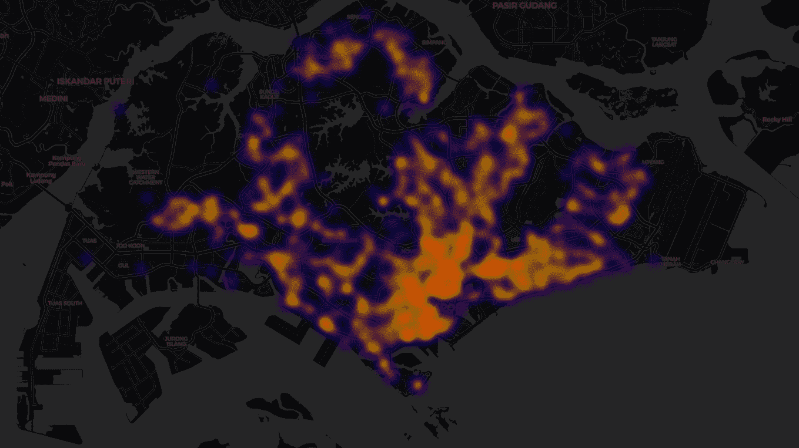*

*作者图片|列表频率热图*

## *3.4 价格*

*价格是这个项目的目标变量 y，绘图有助于我们理解它的潜在价值。*

*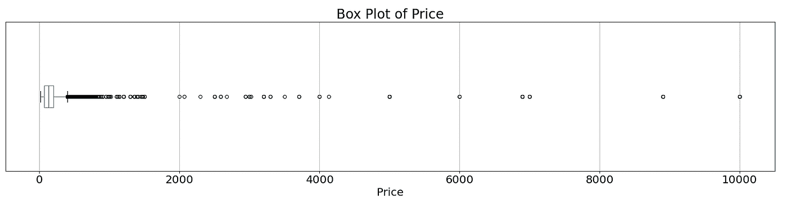*

*图片由作者提供|价格的方框图*

*箱线图可用于识别数值/连续变量的分布，以及异常值的出现。*‘点’*代表价格高于四分位数 3 (Q3)加 1.5 倍四分位数(IQR)范围的情况，其中 IQR 是 Q3-Q1。*

**

*作者图片|异常值(点)*

*许多这些“*点“*”似乎紧密聚集在箱线图附近的 2，000 美元以下，但也有许多情况超出了似乎均匀分布在 2，000 美元和 4，000 美元之间的范围。也存在超过 4000 美元甚至高达 10000 美元的极端异常值。*

*由于我们的人工智能模型将预测这一变量，这些有影响的离群值将对我们的模型概括为“正常”情景的能力产生负面影响。因此，从现在开始，我选择只过滤价格在 2，000 美元及以下的实例。*

*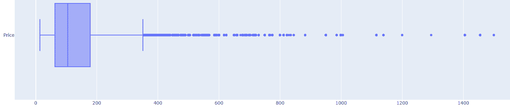*

*图片由作者提供|价格低于 2000 美元的过滤数据集的箱线图*

## *3.5 名称、注释*

*名称和注释属性都是自由格式的文本。名字是主人提供的物业名称，而评论是住在里面的客人留下的。*

*对两个色谱柱执行以下清洗方法:*

```
*df_listing_summary["name"] = df_listing_summary["name"].str.lower() # Lower case
df_listing_summary["name"] = df_listing_summary["name"].str.replace('nan', ' ') # Remove punctuations
df_listing_summary["name"] = df_listing_summary["name"].str.replace('[^\\w\\s]', ' ') # Remove punctuations
df_listing_summary["name"] = df_listing_summary["name"].str.replace('\\n', '') # Remove line break
df_listing_summary["name"] = df_listing_summary["name"].str.replace("([^\\x00-\\x7F])+", ' ') # Remove symbols + chinese characters
df_listing_summary["name"] = df_listing_summary["name"].str.replace("[\\u4e00-\\u9fff]+", ' ')
df_listing_summary["name"].str.encode('ascii', 'ignore').str.decode('ascii') # Retain ascii characters, removing foreign characters and emojis
df_listing_summary["name"] = df_listing_summary["name"].dropna().apply(lambda x: ' '.join(x.split())) # Replace multiple whitespaces with 1 whitespace*
```

*此后，我们可以绘制频繁出现的单词云。*

**

*图片由作者|字云供评论*

*   *似乎有更多积极情绪的表征，如“棒极了”、“爱”、“方便”等。*
*   *然而，很难确定每个评论的实际上下文，因为它可能带有否定标记，如“不”，如“不太好”，“不爱”，“不方便”*

## *3.5 其他变量*

*帕累托分布或普赖斯定律都有类似的想法，即 80%的结果是由 20%的原因造成的或 **50%的工作是由员工人数的平方根完成的**。这在大多数情况下都很普遍，因为这种现象在多个变量中都能观察到:*

**

*按作者分类的图片|每个唯一 host_id 的评论和列表的前 1000 个频率*

*例如，我们可以看到前几个主机的一小部分收到了大部分的总评论，并列出了 Airbnb 新加坡的大部分可用房产。*

## *3.6 相关性*

*相关性是一种简单的统计度量，它表明两个随机变量之间的线性关系的程度。检查变量之间的相关性总是很方便的。*

**

*图片由作者提供|数值变量之间的相关矩阵*

*仔细观察第一行，我们可以看到所有连续变量与目标变量 price 的相关性可以忽略不计。*

# *4.特征工程*

*凭借一些创造力和领域知识，我们可以尝试创建变量来帮助我们解释可变价格。*

## *4.1 捷运*

*大众捷运(MRT)和轻轨捷运(LRT)构成了新加坡的公共列车系统。我经常乘火车上下班，因为它又快又方便(不是 SMRT 的付费广告)🚆).*

*我相信大多数新加坡人和游客都同意我的观点。只要有可能，房地产开发商就会做广告，说他们的房产离火车站只有几步之遥。有鉴于此，可以合理地推断，在所有其他变量保持不变的情况下，火车站附近的房源可以获得高于平均水平的价格。*

*通过最少的搜索，可以找到新加坡火车站纬度和经度坐标的公开可用的[数据集](https://www.kaggle.com/yxlee245/singapore-train-station-coordinates)。*

*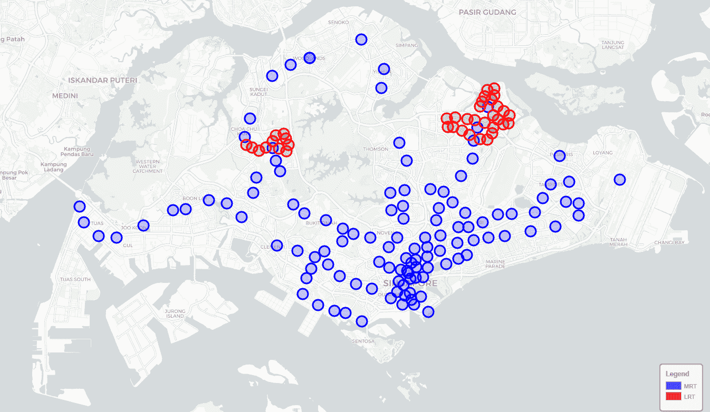*

*图片作者|新加坡的捷运和 LRT*

*根据勾股定理，我们可以用以下公式计算两个坐标之间的位移:*

*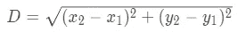*

*图片由作者|用勾股定理置换*

*此后，利用所有站点中的**最小位移**，我们可以设计最接近列表 nearestMRT 和位移值 mrtDisp 的 MRT 变量。*

*例如，我们可以通过位移检查与最近 MRT 匹配的第一个列表*的*。*

*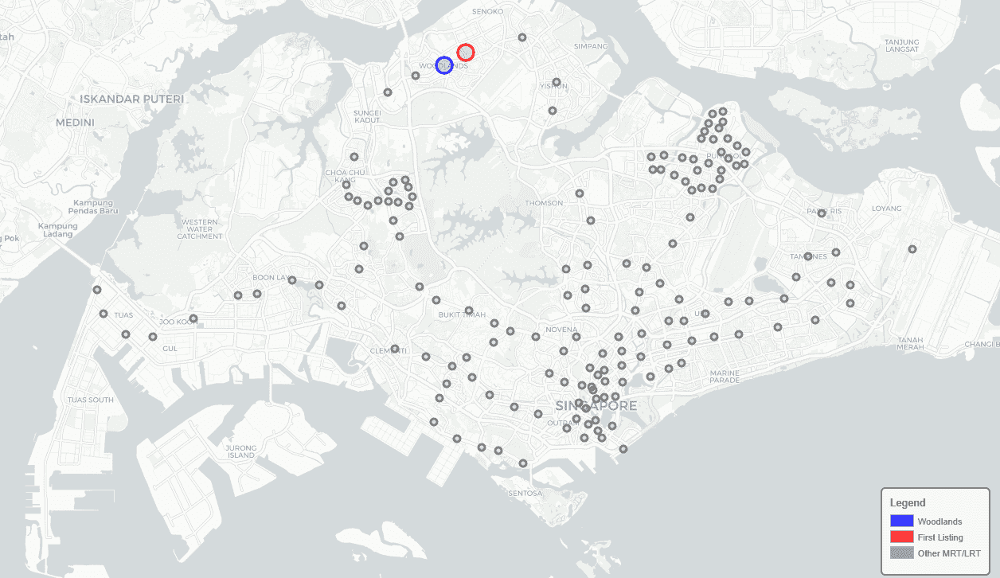*

*图片由作者提供|第一个与其最近的 MRT 列表*

*   *计算所有捷运站之间的第一个列表(红圈)位移*
*   *最小位移捷运是林地捷运(蓝圈)*

*我们还可以为最近的前 10 个火车站绘制列表。*

**

*作者图片|最近的 10 个火车站*

## *4.2 公共假日*

*度假、酒店和其他住宿的需求和价格在高峰期或临近假期时可能会更高。同样，Airbnb 的挂牌价格在公共假日期间飙升也是合乎逻辑的。相反，如果房产长期空置，离公共假日较远的日期可能会打折出售。*

*由于没有可用的停留日期，我们可以使用 *review_date* 作为客人到达日期的下一个最佳代理。有了这个，我们可以设计离最近的公共假日 *holidayDateDiff* 和各自的假日 *holidayName* 的天数。*

*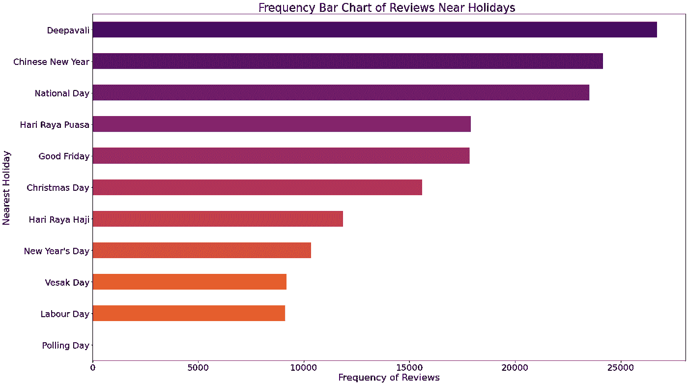*

*图片由作者提供|临近审查日期的最佳假期*

## *4.3 评论情绪*

*如前所述,*名称*和*注释*是自由格式的文本列，在某些情况下，这些值并不完全是英文的。例如，我们可以用下面的 RegEx 表达式查找包含一个或多个中文字符的行:`'[\\u4e00-\\u9fff]+`。清单*名称*的一些示例如下:*

*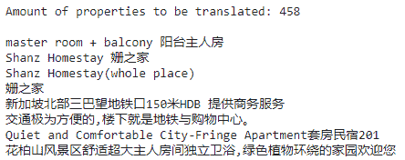*

*图片由作者提供|包含中文字符的名称示例*

*为了实现标准化，Python 中的 **googletrans** 包允许通过自动语言检测和无限制的 Google Translate 翻译将这些行翻译成英语。已经对*名称*和*注释*进行了翻译。*

***nltk** (自然语言工具包)是 Python 中的一个常用包，用于获取任何给定英语文本的正面、负面和复合(组合)的数字情感值。例如，以下文本具有:*

*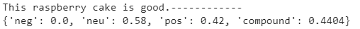*

*作者图片|使用 NLTK 的情感值*

*已经应用了以下方法，并且已经计算了所有列表评论的平均情感值。从所有列表的所有评论的情感的方框图中，我们可以看到，考虑到 IQR 值高于 0，大多数评论通常是正面的。*

*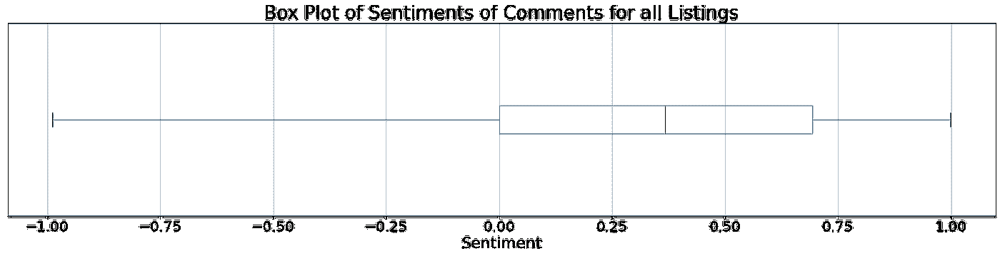*

*图片由作者提供|所有列表的评论意见方框图*

## *4.4 使用正则表达式的其他变量*

*我们还没有完成对*名字*和*评论*的‘榨汁’。由于它们是自由形式的文本列，即使在解析其情感值以创建进一步的可训练列之后，仍然可以使用 RegEx 提取有价值的信息。*

*   ***派克斯***

*使用的表达式是 *(\d+) paxes* 或 ***(\d+) people*** ，它匹配关键字“paxes”或“people”前的一个或多个数字。例如:*

*   ***卧室数量***

*使用了【T2(\ d+)床、(\d+) bd、或【T4(\ d+)卧室的表达，其中它匹配其各自关键字之前的一个或多个数字。*

*   ***属性类型***

*主机通常在其列表名称中显式地写入属性的*类型*。例如，尝试匹配属性类型:*

*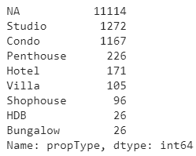*

*作者提供的图片|捕获的属性类型的值计数*

*   ***女性偏好***

*通过人工目测，我注意到了几个带有“女性”关键字的值。这可能是主机的偏好和要求。因此，可以对关键字**女性**进行不区分大小写的搜索，在 14000 个列表中只找到 80 个。*

# *5.特征选择*

*在特征工程之后和建模之前，我们应该执行特征选择，以去除可能对解释输出变量价格的唯一原因无用的变量。这样做的一个健壮方法是使用`SelectFromModel`方法，通过使用一个树集合方法(如极度随机化(额外)树)找到变量重要性。*

*以下是根据`ExtraTreesRegressor`确定的变量重要性列出的前 10 个变量。*

```
*Index(['minimum_nights', 'number_of_reviews', 'reviews_per_month',
       'calculated_host_listings_count', 'availability_365', 'mrtDisp',
       'roomPax', 'amtBedroom', 'commentsSentiment', 'room_type_Private room'],
      dtype='object')*
```

# *6.模型*

*这一部分是整个项目的关键。*

**

*凯文·Ku 在 [Unsplash](https://unsplash.com?utm_source=medium&utm_medium=referral) 上拍摄的照片*

*我将跳过讨论**神经网络**，因为它是在 Colab 中作为这个项目的反面例子完成的。关键点是神经网络通常被称为“黑箱”,无法完全解释其预测结果。例如，我们可以告诉一个申请贷款的人，他被我们的神经网络模型任意拒绝，但我们无法解释和告诉他/她最终决定的原因。在这种情况下，这种方法将与我们的项目无关，因为我们希望我们的最终结果对 Airbnb 主机具有高度的可解释性和可解释性，这样他们也可以在最终定价决策中得到通知。然而，人工神经网络的代码仍然存在于笔记本中。*

*同样值得讨论的是**训练测试分割** (TTS)策略，因为这个项目相对于其他机器学习项目来说有点独特。最常见的情况是，随机地对数据集执行 TTS(除了时间序列)。然而，在我们的项目中，在用该实例训练相应的模型之前，确定目标可变价格首先是**最优**是很重要的。因此，执行“盲 TTS”的含义是导出“垃圾入垃圾出”的最终模型。因此，我们需要对我们的**训练集**进行某种形式的审查和过滤，在那里模型推导出最优定价策略的基本规则。*

*根据上面的解释，未过滤的数据集应该混合了**最优**和**次优**价格。在我们的数据集中，没有任何客观的指标来确定一个与另一个的区别，这是一个障碍。唯一看似可信的变量是上市审查的数量。理由是，假设自由市场是有效的，更高的顾客停留计数将意味着更高的总体需求或参与度，因此最优定价的合理性更高，尽管不知道潜在审查的性质或情绪，因为各方在开始时愿意参与自愿交易。因为审核者的先决条件是成为现有的顾客，所以审核的数量是对要参与的列表的偏好以及最优价格的间接指示。因此，我们应该用评论数最多的 80%数据集来训练我们的模型。*

# *6.1 未调整的模型*

*机器学习实际上并不像其他非从业者可能认为的那样困难。在实践层面上，你不需要理解一个给定模型背后的每一个复杂的计算细节，并把它编码出来以供使用。此外，当其他人已经可以使用“重新发明轮子”时，这可能不是一个好的编码实践。例如，我可以从 scikit-learn(和 XGBoost)测试出 9 种不同的未调优模型，只需要几行代码:*

***代码:***

```
*%%time
nameList = []
cvMeanList = []
cvStdList = []
for Model in [LinearRegression, Ridge, Lasso, 
              DecisionTreeRegressor, RandomForestRegressor, ExtraTreesRegressor, 
              AdaBoostRegressor, GradientBoostingRegressor, XGBRegressor]:
    if Model == XGBRegressor: cv_res = rmse_cv(XGBRegressor(objective='reg:squarederror', eval_metric = 'mae'))
    else: cv_res = rmse_cv(Model())
    print('{}: {:.5f} +/- {:5f}'.format(Model.__name__, -cv_res.mean(), cv_res.std()))
    nameList.append(Model.__name__)
    cvMeanList.append(-cv_res.mean())
    cvStdList.append(cv_res.std())*
```

***输出:***

```
*LinearRegression: 79.72456 +/- 10.095378
Ridge: 79.75446 +/- 10.114177
Lasso: 81.44520 +/- 8.418724
DecisionTreeRegressor: 103.70623 +/- 13.965223
RandomForestRegressor: 77.86522 +/- 13.281151
ExtraTreesRegressor: 78.39075 +/- 14.291264
AdaBoostRegressor: 120.35514 +/- 23.933491
GradientBoostingRegressor: 76.78751 +/- 11.726186
XGBRegressor: 76.69236 +/- 11.640701
CPU times: user 1min 38s, sys: 614 ms, total: 1min 38s
Wall time: 1min 38s*
```

*在每个模型旁边，第一个数字代表 10 倍交叉验证误差的平均值(平方误差)，第二个数字代表交叉验证误差的标准差(平方误差)。*

*   *我们可以看到，像 **DecisionTreeRegressor** 和 **AdaBoostRegressor** 这样的模型都无法超越线性回归的简单基线模型。*
*   *然而，**GradientBoostingRegressor**和 **XGBRegressor** 相对于模型列表具有较低的 CV 误差值。我们可以尝试在我们的解决方案中进一步调整这两种模型*

# *6.2 梯度增强*

*当目标变量是连续的时，可以使用梯度推进(GB)回归器，当目标变量是分类的时，可以使用 GB 分类器。AdaBoost、GB 和 XGBoost 都使用类似的**增强**的方法，这提高了模型的性能。一个来自 [Analytics Vidhya](https://www.analyticsvidhya.com/blog/2015/11/quick-introduction-boosting-algorithms-machine-learning/) 的简短解释，一个垃圾邮件检测模型只能识别链接的存在或来自未知来源的电子邮件，这两个模型都是单独的弱模型。然而，通过组合来自训练的两个规则，该模型是最健壮的，并且因此将具有更好的总体概括能力。因此，GB 是多个决策树模型的集合，具有不错的预测结果。*

*然而，调优一个模型需要反复试验。例如，我可以尝试通过在估计数(n_estimators)的一个假定的大参数空间中测试几个点来找到最小平均绝对误差(MAE)。通过测试 7 个点获得了以下图:*

```
*n_estimators = [5, 25, 50, 100, 250, 500, 1000]*
```

*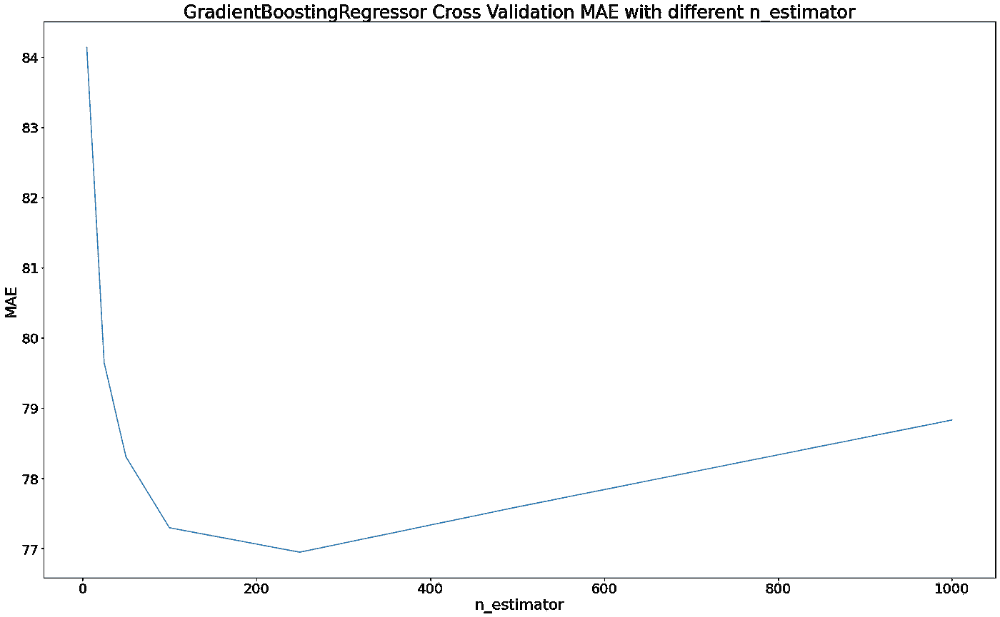*

*图片由作者提供|使用 MAE 绘制的 GB n_estimators 图*

*局部最小值应该接近 220 个 n 估计量。*

*与神经网络不同，GB 和 XGBoost 都可以高度解释。例如，我们可以知道哪些变量在解释价格预测结果时很重要。一般来说，使用基于树的模型有两种不同的方法来判断特征的重要性:*

1.  *杂质平均减少(MDI)的特征重要性*

*   *通过决策树的分裂标准(基尼系数、熵或均方误差)来量化杂质。*
*   *但是，当模型过度拟合时，这种方法可以赋予那些在看不见的数据上可能没有预测性的特征很高的重要性。*

*2.排列重要性*

*   *另一方面，基于排列的特征重要性避免了这个问题，因为它可以在看不见的数据上计算。*

*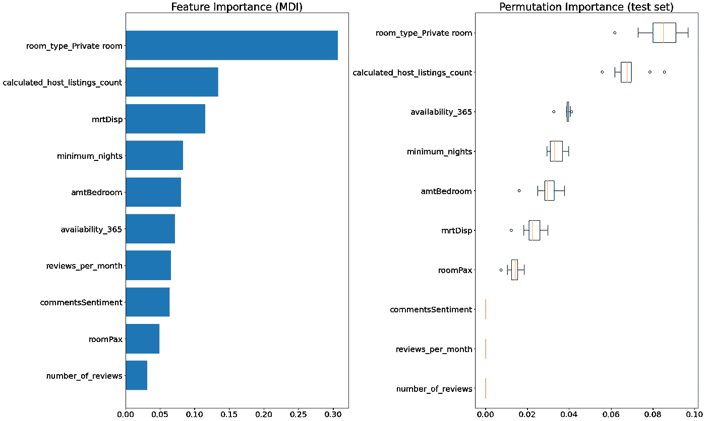*

*作者图片|对 GB 模型的可变重要性*

*由此，我们可以看到**房间 _ 类型 _ 私人房间**和**计算 _ 主机 _ 列表 _ 计数**在解释可变价格时始终被排在最前面。*

## *6.3 极限梯度提升*

*极端梯度推进(XGBoost)是一种相当新的机器学习方法(考虑到神经网络是在 20 世纪 40 年代概念化的，SVM 是由 Vapnik 和 Chervonenkis 在 20 世纪 60 年代引入的)，它不仅快速有效，而且是目前性能最好的模型之一。*

*`xgboost`是 Colab 中可用于导入的包。此外，XGB 模型还可以利用 Colab 的免费 GPU 进行更高效的调优。*

*与之前 GB 中的 n_estimators 一样，对学习率**的相同参数搜索**被应用于 XGB 模型。*

*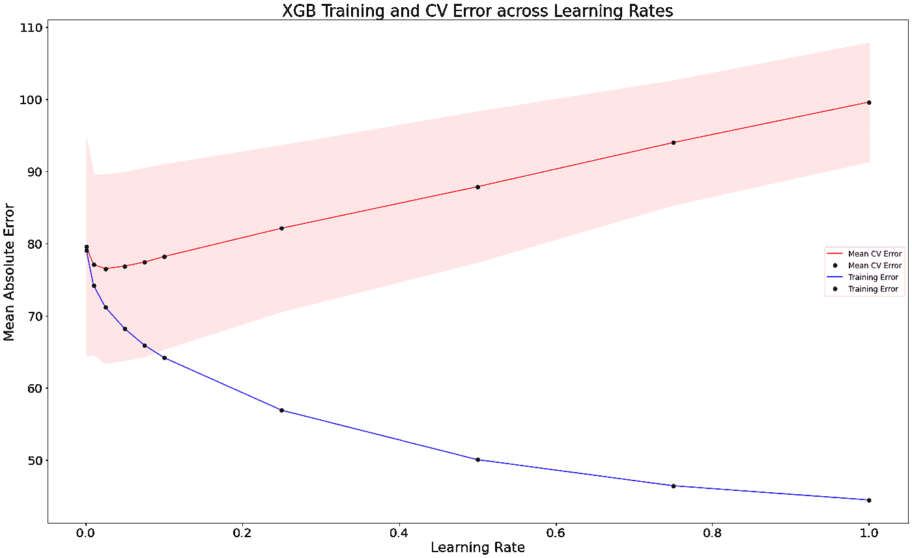*

*图片由作者提供| XG boost 学习率与 MAE 的关系图*

*虽然搜索 1 个参数可以通过简单的 for 循环轻松完成，但更全面的搜索应该是指定一组参数网格，并使用 **GridSearchCV** 或**randomsearccv**。*

*   *GridSearchCV 遍历所有可能组合的乘积(优点:非常彻底的参数搜索，缺点:潜在的非常长的运行时间，例如 5 个超参数对应 5 个参数= 5*5*5*5*5=5⁵=3125 模型。*
*   *RandomSearchCV 运行时间由`n_iter`决定，可以反过来指定。*

*在这种情况下，为以下参数网格指定了`n_iter=50`的 RandomSearchCV:*

```
*param_grid = {
    "learning_rate": [0.032, 0.033, 0.034],
    "colsample_bytree": [0.6, 0.8, 1.0],
    "subsample": [0.6, 0.8, 1.0],
    "max_depth": [2, 3, 4],
    "n_estimators": [100, 500, 1000, 2000],
    "reg_lambda": [1, 1.5, 2],
    "gamma": [0, 0.1, 0.3],
}*
```

# *7.解释*

*从前面提到的 TTS 来看，测试集结果不应该是我们关注的焦点，因为我们很可能是在具有**最优**价格的行上进行训练，因此我们不应该期望它能很好地推广到具有**次优**价格的测试集。然而，该项目的更重要的目的是解释每个预测结果背后的数值。*

*我们可以使用 [SHapley 附加解释(SHAP)库](https://github.com/slundberg/shap)对 GB 和 XGBoost 模型进行详细的可视化预测。在这种情况下，由于冗余，我将只讨论 XGBoost。将预测'推高'和推低变量分别用红色和蓝色显示。*

*例如，使用 SHAP 来解释第一行预测值。首先，基础值 135.5 是所有价格值的平均值，在所有情况下都相同。然而，红色的变量增加了预测价格，而唯一的变量 room_type_Private room 减少了，这确定了最终的预测值为 146.52。从这张图表中，我们可以理解为，与私人房间相比，共用房间不能证明比私人房间的价格更高。*

*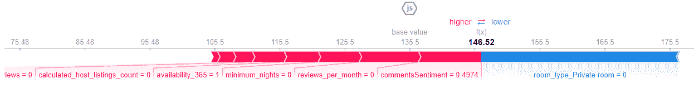*

*图片作者| SHAP 对 XGBoost 预测的首次解释*

*此外，如果我们将上面的数字逆时针旋转 90 度，其中第一行将位于 X 轴的起点，我们可以将剩余的预测并排堆叠到右侧，并获得下图。我们可以看到，从大约指数 0 到 1600，大多数预测值都在 135 附近徘徊，其中向上和向下的推力是均匀匹配的。此后，有几个变量改变了立场，将预测从 1600 点下调至 2800 点。蓝色变量对最终切片的阻力很小，导致预测值下降。*

*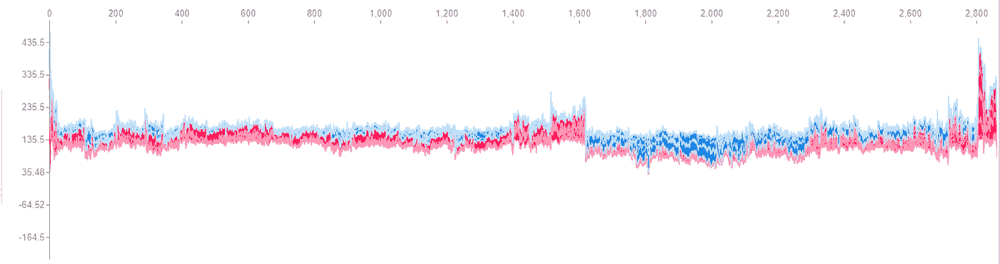*

*图片作者| SHAP 对测试集 XGBoost 预测的解释*

*对于 SHAP 变量的重要性，它不是由 GB 中讨论的杂质值决定的，而是由一个变量在所有预测中的总体解释(或推动)程度决定的。我们可以看到**房间 _ 类型 _ 私人房间**在预测价格值中一直是最重要的(与 GB MDI 和排列重要性相同)，其中 0 或 1 分别向下和向上推动预测。*

*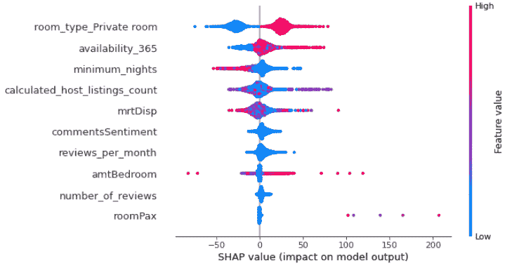*

*图片作者| SHAP 测试集上 XGBoost 的变量重要性*

*如果您对每个变量的推动方向不感兴趣，而是对总体变量的重要性不感兴趣，那么绘制绝对 SHAP 值会更有帮助。*

*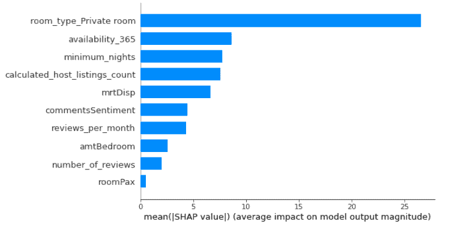*

*图片由作者提供|测试集上 XGBoost 的绝对 SHAP 变量重要性*

# *8.Web 应用程序*

*我们可以使用`streamlit`轻松创建一个 web 应用程序(app ),并使用 PaaS 提供商`Heroku`进行部署，以共享我们的 SHAP 结果。我们可以使用 Heroku-CLI 创建应用程序:*

```
*heroku login
git init
heroku create airbnb-sg
git remote add heroku git@heroku.com:airbnb-sg.git
heroku git:remote -a airbnb-sg
git add .
git commit -m "Add changes to both Heroku and Github"
git push heroku HEAD:master*
```

*链接到:*

*   *[Colab 笔记本](https://colab.research.google.com/drive/1tU6vwQgTzt8lskdEqmi-Kb_BWjiswsF8?usp=sharing)*
*   *[网络应用](https://airbnb-sg.herokuapp.com/)*
*   *[观念页](https://www.notion.so/goldknees/Predicting-Optimum-Airbnb-Listing-Prices-in-Singapore-37143596fe9e4bac8fe59168c1c2e9d0)*

*请注意，该应用程序使用缓存预测，因为 Heroku dynos 对自由层的预测极其有限。*

# *感谢您滚动浏览！😀*