# 预测 Spotify 的受欢迎程度——当数据比文化更需要数据时

> 原文：<https://towardsdatascience.com/predicting-popularity-on-spotify-when-data-needs-culture-more-than-culture-needs-data-2ed3661f75f1?source=collection_archive---------8----------------------->

## 使用 Spotify 数据简短、逐步地浏览一个介绍性的机器学习项目。


图片来源:[米克·豪普特](https://unsplash.com/@rocinante_11) /Unsplash

回到 2016 年我在[黄油](https://www.gimmebutter.com/)音乐做原创音乐实习生的时候，我们团队想了很多如何参数化音频的问题。首先，我们正在为一个专有的音乐同步库奠定基础，我们需要一个新的分类法来分类所有将要组成这个库的不同声音。我们的目标是让我们当前和未来的客户能够通过情绪、流派、乐器或其他关键字进行搜索。

与此同时，我们也继续为客户的广告创作原创音乐。虽然这个工作流程更加定制和服务驱动，但我们仍然必须想出如何不断地将客户的反馈(如“让我们让曲目更加好奇和平易近人，但不那么多愁善感”)转化为实际的旋律、编曲、音色和氛围。

对于这两项任务，我们感觉在口语和音乐语言之间缺少了一个翻译层。这个问题并不新鲜。如果你是一个像这样的音乐迷，我敢肯定你有时会苦于找不到合适的词来解释你为什么如此喜欢一首歌。“我不知道，它只是如此时髦和流畅”通常是我在描述新的情感橙子或 SiR track 时脱口而出的话，我无法停止告诉我的朋友。

许多组织和团队已经开始大规模量化音乐的旅程，但没有一个像 Spotify 这样激进。根据 [Counterpoint Research](https://www.counterpointresearch.com/global-online-music-streaming-growth-slowed-down-in-q2-2020/) 的调查，与该领域的所有其他竞争对手相比，他们在全球付费订阅市场中占有 34%的市场份额。应用音乐以 21%的市场份额位居第二。

因此，这也意味着他们的数据仓库的大小和规模是首屈一指的。Spotify 在他们的数据工程团队和产品销售团队之间找到了一种奇妙的和谐。他们相互支持，推动公司不断发展。

Spotify 对音乐的量化越好，他们就能越好地调整自己的系统和算法，为自己和利益相关者创造更多收入。

我被 Spotify 独特的商业目标迷住了，那就是对音乐进行量化。如此着迷，以至于它推动我走出舒适区，开始我的个人数据科学之旅，以更好地理解音乐和数据之间的相互作用。

在这篇文章中，我邀请你来走我的第一个机器学习项目的道路，使用 Spotify 跟踪数据作为焦点。

在继续之前，我想澄清几件事——这篇文章详细描述了我从 0 到 1 而不是从 1 到‘n’的旅程。我的方法既不是详尽的，也不是完美的，事实上，可能包含许多错过的技术机会，其中一些我会在文章的结尾提到。我很高兴能继续迭代和学习，所以这个项目不是最后一站，而仅仅是第一步。

我想留下的是更宏观的发现，它帮助我理解了量化和参数化音乐的问题的形状和大小。我并不打算在这里解决任何问题，而是从一个新的角度，对一个古老的问题进行新的阐释，这个问题只会随着我们对音乐的收听和播放越来越多而变得更加复杂。

好了，开场白说够了，我们开始吧。

# 音乐流行到底是什么，我如何成名，以及其他令人痛苦的生存困境。

对于我的数据科学顶点项目(在[大会](https://medium.com/u/ade87cdd122e?source=post_page-----2ed3661f75f1--------------------------------)上大声喊出来)，我有兴趣了解 Spotify 如何理解“流行度”。对我来说，最重要的问题是:**我们可以用一首歌的属性来预测一首歌的‘受欢迎程度’吗？**

从一开始，我就盯上了一个 Kaggle [数据集](https://www.kaggle.com/yamaerenay/spotify-dataset-19212020-160k-tracks?select=tracks.csv)，它是基于 Spotify 的 [Web API](https://developer.spotify.com/documentation/web-api/) 组合在一起的。对于那些不熟悉 Spotify Web API 的人来说，下面是一些可调用参数的截图，这些参数可用于分析 Spotify 上的曲目:

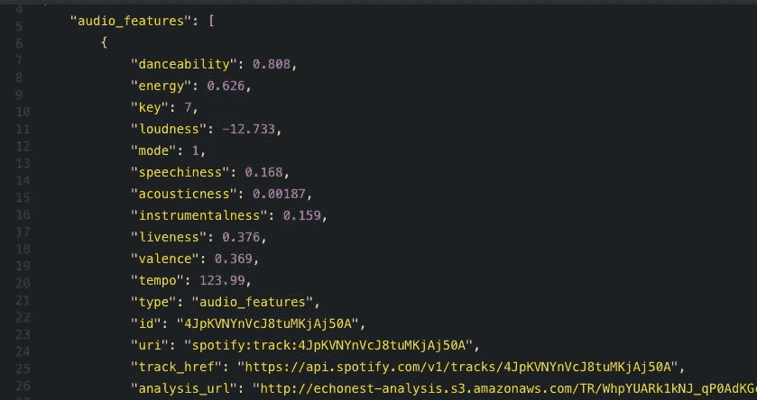

作者图片

根据 Spotify 的说法，“流行度是由算法计算出来的，在很大程度上是基于该曲目的总播放次数以及这些播放的最近时间。一般来说，现在被大量播放的歌曲会比过去被大量播放的歌曲有更高的人气。”

对我来说，首要任务是查看数据源，并开始一些探索性的数据分析。

# EDA——一点点的观察、清理和可视化

数据集有 586，672 行，20 列。

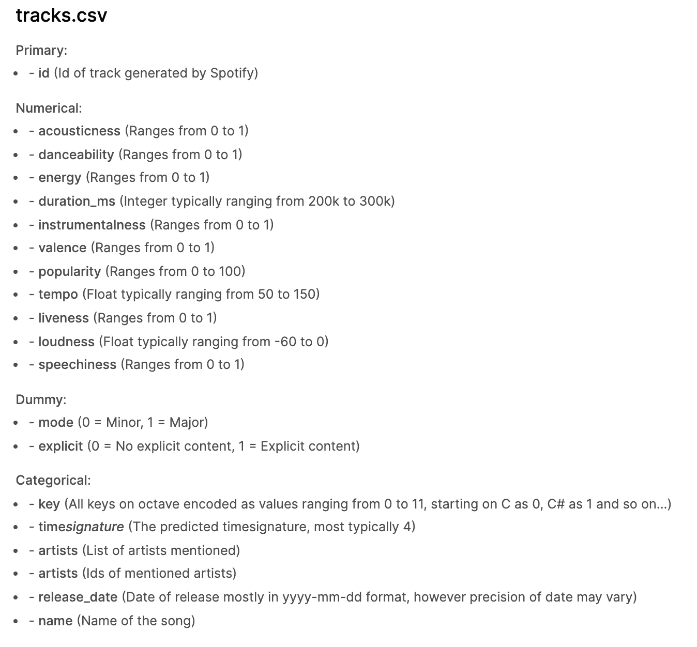

作者图片

我立刻注意到数据中有三个我应该注意的地方:

*   两个变量已经被虚拟化(“模式”和“显式”)
*   某些分类变量，如“key”，是值编码的，但它们的相对值是无意义的。如果 0 是 C 的密钥，1 是 C#的密钥，这并不意味着 C#的密钥本质上比 C 的密钥大 1 点
*   “时间签名”已经是一个预测值

让我们看一下原始数据，以确保它是最好的格式。

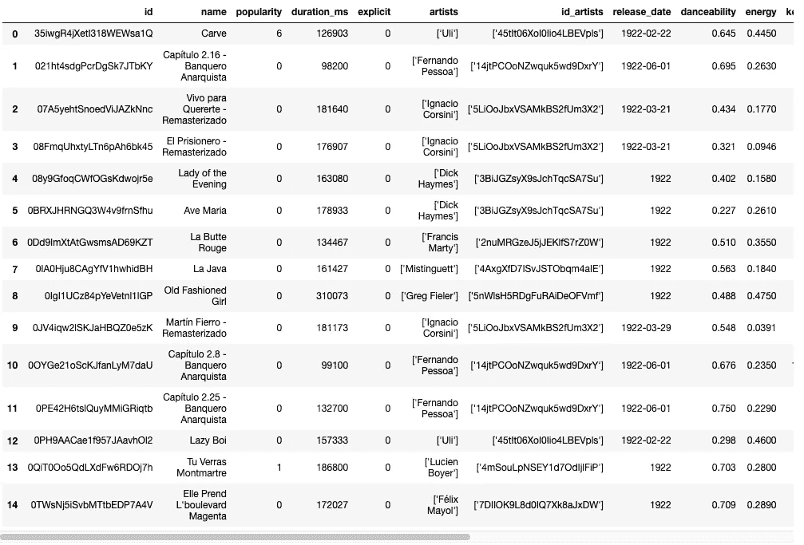

作者图片

我们删除了一些空值，并对“duration_ms”列进行了一次修饰。持续时间以毫秒表示，这在歌曲持续时间的上下文中没有什么意义，所以我们转换为分钟。

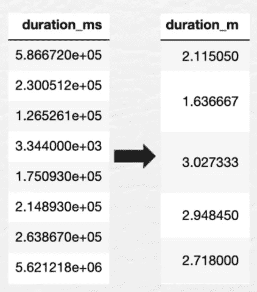

作者图片

对数据框架中的三个分类变量进行虚拟化也是有用的，所以我们现在就这么做吧。

```
data = pd.get_dummies(data, columns=['time_signature', 'key', 'mode'], drop_first=True)
```

有了这些，我们应该可以开始一些可视化了。

## 可视化:

首先，我们生成一些跨越几个变量的 Seaborn 对图:

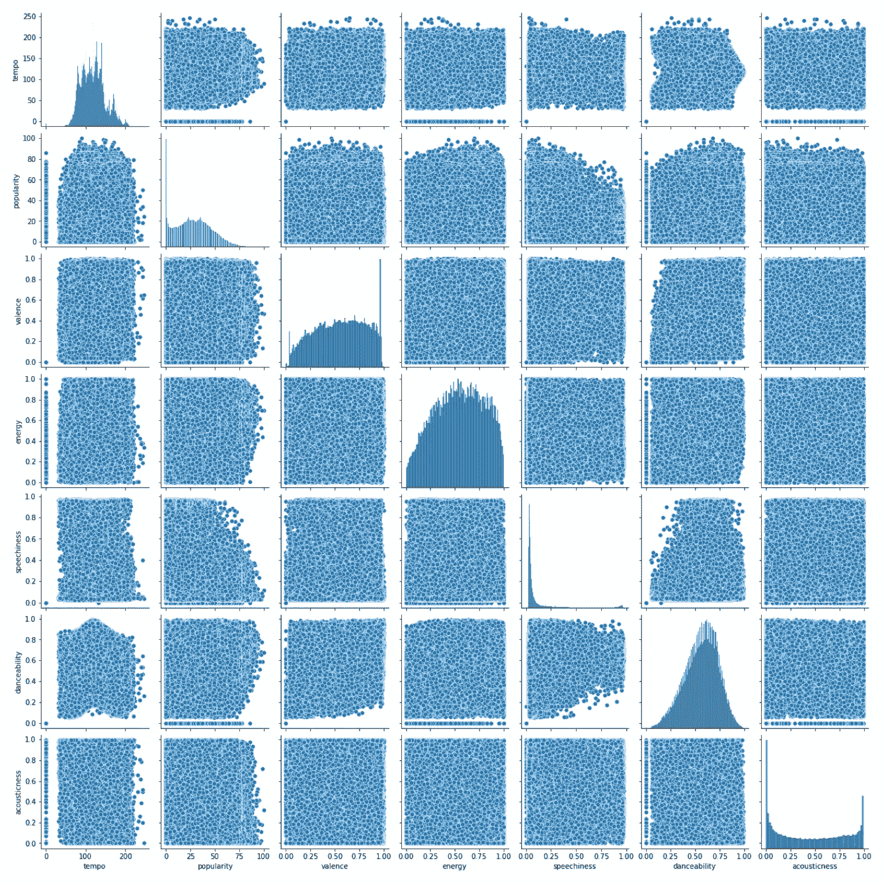

作者图片

令人震惊的是，很少甚至没有简单的线性关系跳出来。让我们继续一些更细粒度的可视化，看看到底发生了什么。

因为预测流行度是我们的北极星，所以我很想看看流行度在整个数据集上的分布情况。

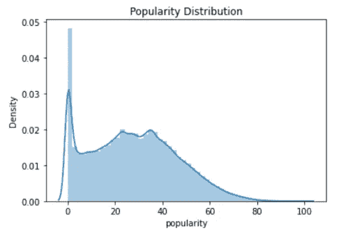

作者图片

帕累托原则在这里完全有效，右偏分布向我们展示了一首流行歌曲是多么难得。

我还想在数据中发现一些特定领域的细微差别。在几个有趣的可视化中，键/模式与流行度的双条形图突出了一些有趣的点。

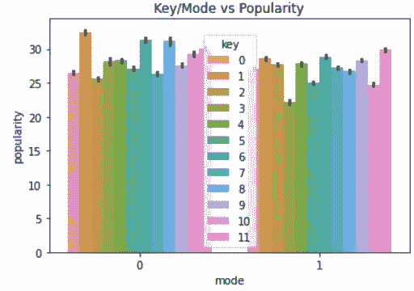

作者图片

在西方音乐中，有 12 个可能的调。然而，每个调都可以处于一个小调或一个大调中。从全音阶来说，有三个主要调式和四个次要调式。这个柱状图描述了同一调在不同调性下的受欢迎程度(0 代表小调，1 代表大调)。例如，C#小调的曲目往往比 C#大调的曲目更受欢迎。

当然，这里的一个混淆变量可能是歌手喜欢的调，假设一首歌曲越受欢迎，它就越可能包含人声，根据下面的第三点，这似乎是一个公平的假设(即“声音度”与“受欢迎度”呈负相关)。

让我们看一个相关表，以确定我们的许多 X 变量之间的一些基线相关性。

```
plt.figure(figsize=(20, 10))
sns.heatmap(data.corr(),annot = True)
```

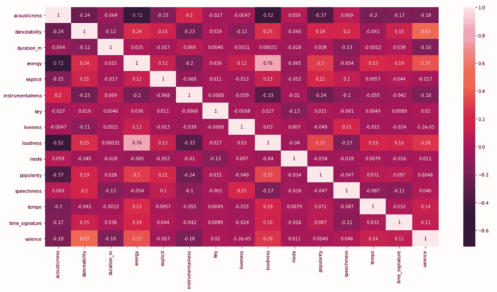

作者图片

一些观察结果:

*   “能量”和“响度”的相关性最高，而且是正相关，这并不奇怪
*   “能量”和“声音”有着高度相关的反比关系，这也是完全有道理的。一首歌越倾向于声学，它的能量就越少
*   不幸的是，由于我们的因变量是“受欢迎程度”，我们注意到自变量之间的相关值非常差。我们得到的最好结果是“声音”和“受欢迎程度”之间的 0.37
*   从这个相关矩阵中，我挑选了四个最好的特性(具有最高相关性的特性)用于以后的特性工程。这四个是:**‘声音’，‘乐器’，‘音量’，和‘能量’**

通过平方我们的最高相关系数 R，我们得到需要清除的决定系数(R):**. 136。**门槛很低，但让我们探索一下我们能在多大程度上超越它。

# "嗨，我是来参加模特表演的？我来对地方了吗？”

## 模型 1:线性回归

为了预热烤箱，让我们看看从一个简单的线性回归模型中可以获得什么样的成功。

1.  **设置变量:**

```
X = data[features]
y = data['popularity']
```

目前[特征]包括我们数据框架中的每一个独立变量。

2.**拆分我们的数据**

```
from sklearn.model_selection import train_test_split
from sklearn.linear_model import LinearRegressionX_train, X_test, y_train, y_test = train_test_split(X[features], y, train_size=0.5, random_state=8)
```

3.**训练我们的模型**

```
lr = LinearRegression()
lr.fit(X_train, y_train)
lr.score(X_test, y_test)
```

这将打印出我们的决定系数 R，为. 213。虽然我们已经超过了我们的基线，但总的来说，这是一个危险的低 R。

4.**做出预测**

现在让我们将预测方法传递给我们的测试数据。

```
y_pred = lr.predict(X_test)
```

5.**指标评估**

最后，我们可以打印出三个关键指标来确定模型的适合度。

```
print(metrics.mean_absolute_error(y_test, y_pred))
print(metrics.mean_squared_error(y_test, y_pred))
print(np.sqrt(metrics.mean_squared_error(y_test, y_pred)))
```

MAE = 13.24

MSE = 266.19

RMSE = 16.32

6.**结论**

作为标准协议，我们使用 RMSE 作为主要指标来评估我们的线性回归模型。在预测模型中，从 0 到 100 的“受欢迎程度”范围内，我们的残差平均有 16.32 的差距，这是非常大的。

R 值为 0.213，我们甚至还没有超过我们的基本相关性。

我再次运行这个模型，但是现在只有上面提到的四个最好的特性。该模型实际上恶化了，R 为 0.181，RMSE 为 16.64。

因此，让我们看看是否可以用一些其他的回归技术将这些推向积极的方向。

**模型 2:决策树**

```
from sklearn.tree import DecisionTreeRegressormax_depth_range = range(1, 15)RMSE_scores = []from sklearn.model_selection import cross_val_score
for depth in max_depth_range:
    treereg = DecisionTreeRegressor(max_depth=depth, random_state=1)
    MSE_scores = cross_val_score(treereg, X, y, cv=5, scoring='neg_mean_squared_error')
    RMSE_scores.append(np.mean(np.sqrt(-MSE_scores)))plt.plot(max_depth_range, RMSE_scores);
plt.xlabel('max_depth');
plt.ylabel('RMSE (lower is better)');
```

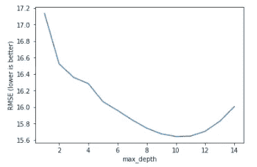

作者图片

即使只有一个很小的范围(1，15)，我们也设法使用 max _ depth _ range 10 获得了 15.64 的更好的 RMSE。更好，但是考虑到决策树的性质，我们很自然地为了预测误差的标准偏差的一点点增加而进行了大量的过度拟合。

**模型 3:随机森林**

另一个尝试和抑制过度拟合和提高准确性的延伸。我们将上述相同的方法应用于随机树回归模型，并看到以下指标:

RMSE : 14.80

**出袋得分:** .38

*提醒:袋外得分是示例𝑥ᵢ使用随机森林集合中所有树木的准确性，在训练过程中忽略了这些树木。

我们看到，我们的 OOB 分数现在大大超过了我们的基线 R。就回归模型测试而言，徒步穿越随机森林让我们到达了一个更快乐的目的地。我们越来越接近一个具有更强泛化能力的模型，这也是我们最终的目标。

说了这么多，我对我们用回归方法得到的结果肯定不感到兴奋，所以也许是时候看看分类世界能给我们提供什么了。我们走吧。

## 分类

为了建立任何种类的分类模型，我们需要从试图预测我们的输出“流行度”的连续整数值，转而预测它的类别/标签。因此，让我们为“流行度”创建一些箱。我们将使用 pd.cut 将我们的值分为“低”、“中”和“高”三个受欢迎程度。

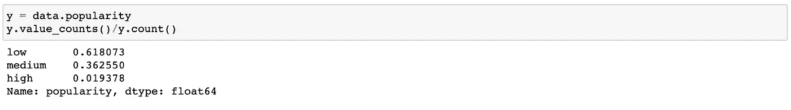

作者图片

我们的宁滨中突出的一个因素是三个箱中不均匀的计数分布。我知道一些分类模型很容易受到不平衡数据的影响，所以我使用不平衡学习包中的 RandomOverSampler 对这些类进行了重新采样:

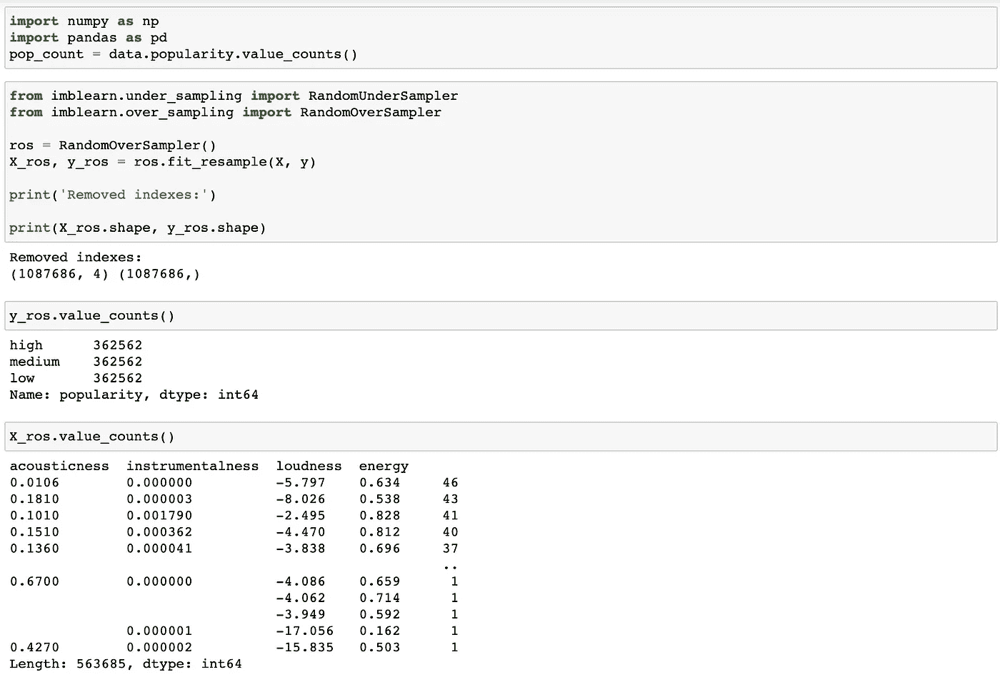

作者图片

现在我们的类是偶数，我们可以设置和实例化我们的分类模型；这一次，我们将尝试 KNN 分类器。

让我们重新输入我们的四大特性来建立我们的设计矩阵:

```
feature_cols = ['acousticness', 'instrumentalness', 'loudness', 'energy']
X = data[feature_cols]
```

接下来，我们可以使用我们的过采样类执行训练测试分割:

```
X_train, X_test, y_train, y_test = train_test_split(X_ros, y_ros, random_state=99, test_size=0.3)knn = KNeighborsClassifier(n_neighbors=1)
knn.fit(X_train, y_train)y_pred_class = knn.predict(X_test)
print(metrics.accuracy_score(y_test, y_pred_class))
```

弹出的**准确度分数**为:. 807

天哪，真是个进步。虽然闻起来像是严重的过度拟合，所以让我们实现一些超参数调整，并搜索一个最佳的“k”。

由于使用 for-loops 和 GridSearch 的手动最近邻搜索对于我简陋的计算机来说计算量非常大，所以我选择使用 RandomizedSearchCV。这个包仍然实现了一个“fit”和“score”方法，但是不像 GridSearch 那样尝试所有的参数值。相反，从指定的分布中采样固定数量的参数设置。

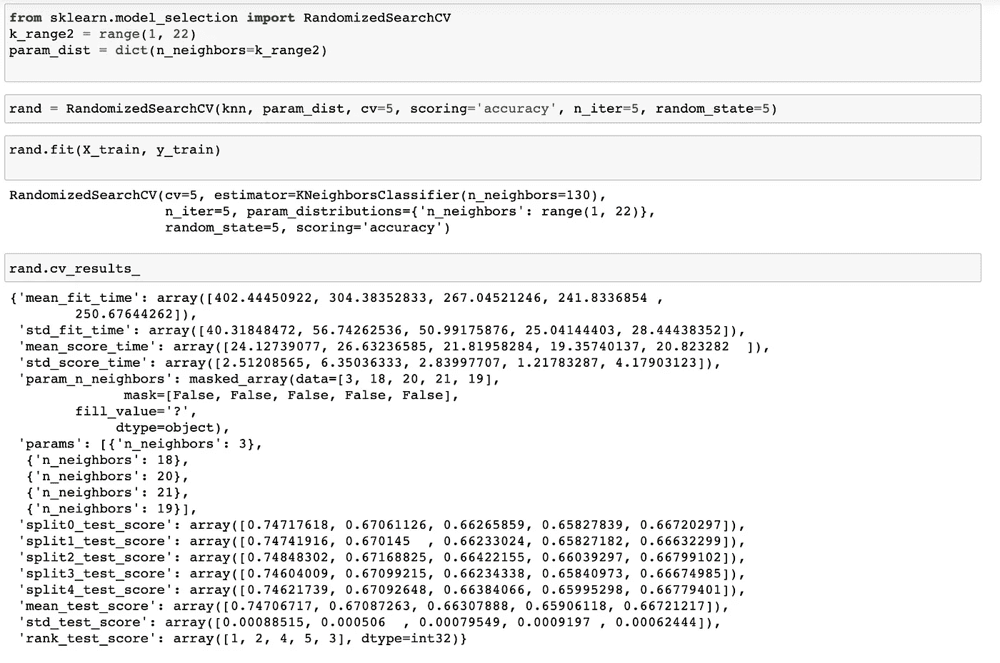

作者图片

# 结果

我们表现如何？

首先，我们可以打印出一个混淆矩阵。

```
from sklearn.metrics import confusion_matrixcmat = confusion_matrix(y_test, y_pred_class)
#print(cmat)
print('TP - True Negative {}'.format(cmat[0,0]))
print('FP - Flase Positive {}'.format(cmat[0,1]))
print('FN - False Negative {}'.format(cmat[1,0]))
print('TP - True Positive {}'.format(cmat[1,1]))
print('Accuracy Score: {}'.format(np.divide(np.sum([cmat[0,0], cmat[1,1], cmat[2,2]]), np.sum(cmat)))) 
print('Misclassification Rate: {}'.format(np.divide(np.sum([cmat[1,0], cmat[0,1], cmat[0,2], cmat[2,0], cmat[1,2], cmat[2,1]]), np.sum(cmat))))
```

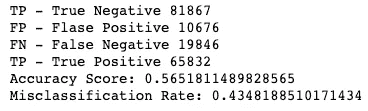

作者图片

56.52%的准确率是我们迄今为止取得的最好成绩，我对这个分数的准确性相当有信心。对于我们的 KNN 模型，我们平衡了我们的类，我们设计了特性，我们执行了一些超参数调整，我们从回归世界一路走到了启动！但对于我们所有的工作，当我们缩小范围时，56.52%的准确率也意味着用我们的模型预测的平均错误率为 43.48%。

# 结论:限制、期望和反响

我们表现最好的模型是 KNN 分类模型，但是这个带有一个大星号。将我们的数据变形为离散的分类方法，而不是连续的回归方法，这意味着模型中的预测稳健性在很大程度上被掩盖了。对于一个模型来说，预测三个受欢迎程度等级(“低”、“中”或“高”)中的一个要容易得多，而不是从 0 到 100 的受欢迎程度的离散数字分数。因此，虽然我们对模型本身的准确性感到更加乐观，但从我们迄今为止的工作来看，我们还远远不能将它生产出来，并实现令人满意的最终用户预测体验。

我也非常清楚我一直面临的其他限制:

*   机器学习在计算上变得很昂贵，很快，我不得不做出让步，以便我甚至可以运行某些代码块。这在一定程度上损害了健壮性和深度，无论是我们的交叉验证器只使用了五个折叠，还是我们的行业标准 cv=10，或者只运行了 k_range 为(1，22)的随机搜索
*   将来，我可以试着测试一个加权 KNN(加权投票)模型来缓和我们对完美 k 的不完美搜索的影响
*   我是否正确地处理了数据平衡问题？虽然我们标记了它并进行过采样，但我没有尝试过欠采样，这可能会产生不同的结果。是的，它会减少计数，但也会减少合成、重复的行

当我爬出 ML 洞穴时，我想知道就数据集哲学本身而言，这里是否有一个更大的问题，以及这是否是一个本体论的限制。

为什么对于一个精心修剪和组织的数据集，并且不缺少行，其内部的关系却是紧张的？有人会认为，人气是艺术家、唱片公司、管理公司、A&R 和 Spotify 自己希望能够上下拉动的杠杆。显而易见的答案是，还有成千上万的其他变量会增加噪声。而且，也许在我的项目中选择流行度作为因变量意味着我注定会失望，因为它凸显了我被给予的自变量有多窄，以及我们对计算“流行度”的 Spotify 算法的真正了解有多少。

该数据集及其 Web API 父级本质上是描述性的，而不是预测性的。奥利维亚·罗德里戈的《good 4 u》并不流行，因为它的响度、能量和乐器演奏得分很高(尽管它们可能很高，但不幸的是，这首歌不在这个有点过时的数据集中)。它之所以受欢迎是因为*奥利维亚是谁*，她怀旧的老(嗨@帕拉摩尔)和闪亮的新的融合，以及奥利维亚在《驾照》之后对任何事情的期待。*这些参数在我们的数据集中的什么地方？！*

鉴于现代音乐的现状及其消费方式，谨慎的做法是研究一些变量，比如，我们在这里只是触及了表面:

*   社交媒体关注
*   一位艺术家是否与唱片公司签约，如果是，是哪一家？
*   一个代表艺术家网络价值的指标(一个"*你在这里认识谁？"*评分)
*   “怀旧”配乐
*   那个艺术家的历史资料

我们还可以根据以下因素将“流行度”分解成子集:

*   地区
*   人口统计数据
*   它在哪个设备上播放
*   共享的 Spotify 帐户数量

…还有更多切片。

将这些新功能添加到我们的数据框架后，看看我们的模型准确性是否有所提高，如果有，提高了多少，这将是一件有趣的事情。

然而，像所有银河守护者一样，Spotify 谨慎地隐藏这类数据。无论是出于涉及 PII 的原因，还是利益相关方合同和主服务协议，或者任何超出我们权限的原因，那些通过 API 访问 Spotify 数据的人最终访问的只是数据冰山的一角。

显然，数据科学和人工智能的世界远远超出了这里所尝试的。展望未来，我很想深入研究无监督学习和深度学习技术，看看我们能在这些道路上找到什么乐趣。

总而言之，我很高兴看到音乐分析垂直市场的增长。从这个项目中，我有了新的希望，即使在我们的算法，看似铁板一块的流媒体世界中，我们仍然可以有狂野，柔滑，丰富多彩，复杂，情绪化的听觉异常值，这些异常值击中了我们的内脏，唤醒了我们。

谢谢你一直读到最后(见鬼，我写这篇文章的时候差点没看完)。我个人仍然在理解所有这些新事物，并希望听到你对我的想法的想法，无论你是数据科学家，音乐家，Spotify 爱好者，文化见解的粉丝，还是任何人。

直到下次🎶

*如果你想查看这个顶点项目的完整 Jupyter 笔记本和高级 powerpoint，这里有 Github:*[*【https://github.com/philinyouin/SpotifyPopularityPrediction】*](https://github.com/philinyouin/SpotifyPopularityPrediction)