# 预测脉冲星:一个不平衡的分类任务:比较 Bootstrap 重采样和 SMOTE

> 原文：<https://towardsdatascience.com/predicting-pulsar-stars-an-imbalanced-classification-task-comparing-bootstrap-resampling-to-smote-8cfbe037b807?source=collection_archive---------15----------------------->

瑞安·赫顿在 [Unsplash](https://unsplash.com?utm_source=medium&utm_medium=referral) 上的照片

对不平衡数据集进行分类是一项非常常见的数据科学任务，有大量的文章解释了不同的方法。

正如这些文章将向读者解释的那样，如果机器学习模型是在不平衡数据上训练的，它们通常会发现很难很好地学习和概括，即一个或多个类别被不成比例地代表(通常代表不足)的数据。因此，我们需要采取一些措施来解决这个问题；通常这是通过对学习数据的一些调整来完成的。

现在，我是一个比较事物的爱好者，我经常喜欢比较非常简单的方法和更复杂的方法。

这一次，我将用脉冲星的数据来比较随机重采样技术和 SMOTE。

# **背景**

Kaggle 用户 **Pavan Raj** 最好地描述了任务的背景(他也将数据上传到了[ka ggle](https://www.kaggle.com/colearninglounge/predicting-pulsar-starintermediate)——我是从那里获得的):

“HTRU2 是一个数据集，描述了在高时间分辨率宇宙调查期间收集的脉冲星候选样本。

脉冲星是一种罕见的中子星，它产生的无线电辐射在地球上可以探测到。作为时空、星际介质和物质状态的探测器，它们具有相当大的科学价值。

随着脉冲星的旋转，它们的发射光束扫过天空，当光束穿过我们的视线时，会产生一种可检测的宽带无线电发射模式。随着脉冲星快速旋转，这种模式周期性重复。因此，脉冲星搜索包括用大型射电望远镜寻找周期性的无线电信号。

每颗脉冲星产生的发射模式略有不同，每次旋转都会略有不同。因此，被称为“候选者”的潜在信号探测在脉冲星的多次旋转中被平均化，这由观测的长度决定。在缺乏额外信息的情况下，每个候选者都有可能描述一颗真正的脉冲星。然而，在实践中，几乎所有的检测都是由射频干扰(RFI)和噪声引起的，使得合法信号很难找到。

机器学习工具现在正被用来自动标记脉冲星候选体，以促进快速分析。分类系统尤其被广泛采用，它将候选数据集视为二元分类问题。在这里，合法的脉冲星例子是少数正类，而虚假的例子是多数负类。这里分享的数据集包含了 RFI 和/或噪声引起的乱真例子，以及真实的脉冲星例子。这些例子都已经被人类注释者检查过了。

每行首先列出变量，类标签是最后一项。使用的类别标签是 0(负)和 1(正)。

每个候选项由 8 个连续变量和一个单一类别变量描述。前四个是从综合脉冲轮廓(折叠轮廓)获得的简单统计。这是一个连续变量数组，用于描述信号的经度解析版本，该信号在时间和频率上都进行了平均。其余四个变量类似地从 DM-SNR 曲线中获得。这些总结如下:

1.  积分轮廓的平均值。
2.  集成剖面的标准偏差。
3.  积分轮廓的过度峰度。
4.  集成轮廓的偏斜度。
5.  DM-SNR 曲线的平均值。
6.  DM-SNR 曲线的标准偏差。
7.  DM-SNR 曲线的过度峰度。
8.  DM-SNR 曲线的偏斜度。
9.  班级

# 假设

*在样本外数据上，基于 SMOTE 数据重采样数据构建的模型将优于基于 bootstrap 数据重采样构建的模型。*

**为什么？**考虑两颗具有“相似”特征的脉冲星。在我看来，我们可以认为这些信号在边界之外，我们可以预期任何信号在边界之内的候选星也将是脉冲星。由于 SMOTE 在现有观察“之间”创建合成观察，因此模型将能够学习这种关系..

# 建立

让我们导入我们将在分析中使用的包。

# 数据

导入数据并评估我们正在处理的内容。

前几行:

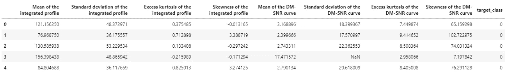

作者图片

总结:

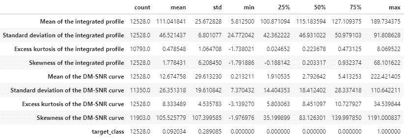

作者图片

检查缺失值:

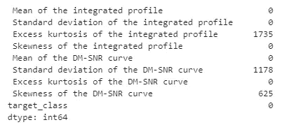

作者图片

我们的原始数据集包含大约 12.5k 个观测值，其中一些包含缺失值。我们必须以某种方式处理这些价值观；现在，让我们将它们从数据中删除。

得到的数据集大约有 9.2k 个观察值，损失了大约 25%的行！

也许我们应该估算这些…一篇关于估算的有用文章(如果我自己这么说的话)可以在这里找到[填补空白:估算 3 种方法| Bradley Stephen Shaw |走向数据科学](/filling-in-the-gaps-imputation-3-ways-6056c09b6417)。

**让我们快速看一下我们的目标变量，也就是我们试图预测的。**

这本质上是一个指示变量:0 表示候选星不是脉冲星启动，1 表示相反。至关重要的是，目标中不存在遗漏的观察值。

数据到底有多不平衡？我们看到在 9.2k 的候选者中，只有 9.2%是脉冲星。因此，事实证明，数据非常不平衡。

**我们应该已经到了可以探索输入变量的时候了。**

在此之前，让我们重命名这些列。

对某些人来说，这似乎有些迂腐，但是我的敏锐感觉告诉我，使用包含混合大小写、空格和标点符号的列名将是一场噩梦，我宁愿避免。

至此，我们可以看看输入要素的分布了。

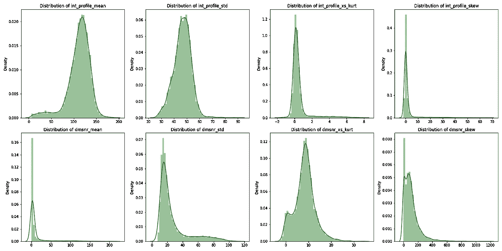

作者图片

这些特征看起来都像预期的那样连续。大多数特征似乎都有一定程度的偏斜，有些特征包含大量异常值。

同样重要的是要注意变量在不同的尺度上——如果我们要使用正则化技术，要记住这一点(提示:我们不打算这样做)。

还值得注意的是，一些特征是相互关联的-记住，峰度和偏度都是分布的均值和方差的函数，并且具有非常相似的函数定义。让我们直观地探索一下:

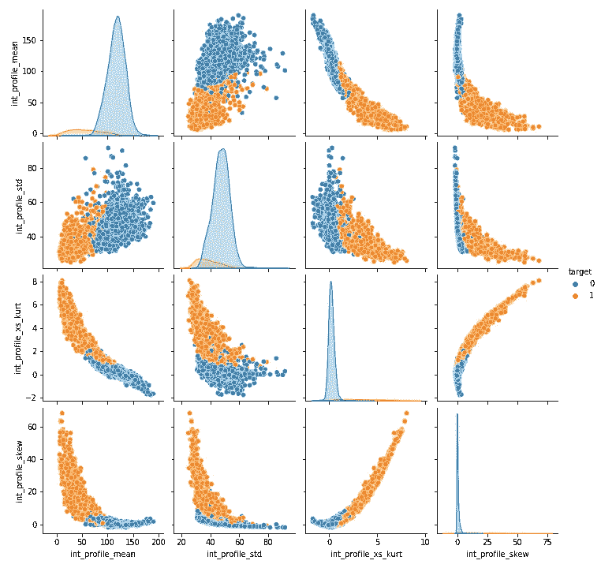

作者图片

这里我们有一个集成轮廓特征的配对图。

*   我们可以看到均值和峰度以及均值和偏度之间的非线性关系在减小…
*   我们可以说标准差和峰度以及标准差和偏度之间的关系也是如此，尽管趋势稍微有些混乱…
*   并且在偏斜度和峰度之间有明显的关系。

现在探索性的数据分析已经足够了，让我们继续为建模准备数据。

# 为建模准备数据

更具体地说，我们将:

1.  将数据分成训练样本和测试样本
2.  在我们建模之前平衡数据。我们将研究两种技术来做到这一点——随机重采样和合成少数过采样技术(SMOTE 下面会有更多的介绍)。

让我们将数据分成训练样本和测试样本。我将使用标准的 80:20 训练:测试分割，使用`sklearn`来完成繁重的工作。

让我们快速看一下我们的训练数据，区分脉冲星恒星的积极和消极识别。

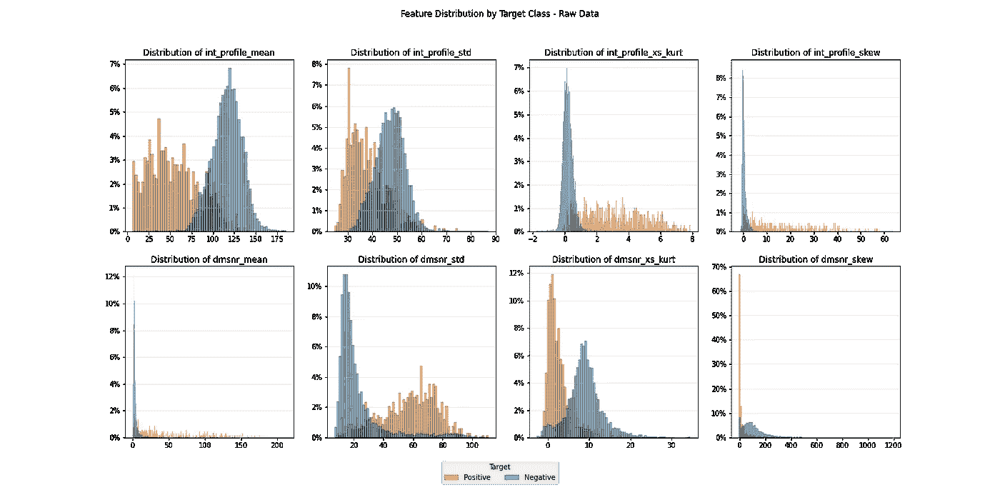

作者图片

对于大多数特征来说，在大多数特征中，正面和负面的情况似乎有明显的区别。

我们现在可以重新采样我们的训练数据。

正如我们所知，这个数据集是高度不平衡的，也就是说，负面事例比正面事例多得多。这在现实世界中并不是一个完全陌生的概念，任何试图对高超额(再)保险层的欺诈行为或损失建模的人都会证明这一点。

为什么我们需要平衡数据？建立在不平衡数据上的机器学习模型将高度偏向主导阶级，因为该模型没有足够的信息来学习如何识别少数阶级。

有几种方法可以解决这个问题——我们可以对数据进行采样，以*充分增加*少数阶级的比例(“上采样”)，或者对数据进行采样，以*充分减少*多数阶级的比例(“下采样”)。如果有必要，我们甚至可以两种方法都用！

我们将考虑的两种技术——随机重采样和 SMOTE——都是“上采样”数据的方法。

**随机重采样(bootstrap)** 大多数从业者都会很熟悉。它包括多次随机抽样数据替换。bootstrap 实现起来相当简单，并且被广泛理解。

然而，用户应该注意过度的自举——对现有信息的过多“回收”会导致偏见。如果需要不相称的上采样量来平衡数据集，更好的办法可能是在将自举应用于上采样之前，先对多数类进行下采样。

**合成少数过采样技术(SMOTE)** 是一种执行上采样的新方法。SMOTE 不是重新创建现有数据，而是一种“最近邻”技术，它应用插值来合成现有少数实例之间的新少数实例*。*

像 bootstrap 一样，在应用 SMOTE 之前，我们需要考虑数据的适当性。例如，将 SMOTE 应用于已经以某种方式有偏差的数据提取将导致另一个数据也有偏差。

例如，想象我们正在模拟信用违约。不为我们所知的是，我们的数据提取出了问题，我们对年轻的信贷申请人产生了偏见——比如说，18 至 25 岁之间的人信贷违约的比例更高。将 SMOTE 应用于此将创建新的违约者实例，但这些新实例也将在 18 至 25 岁之间，从而使偏见永久化。

创建像上面这样的图表有助于我们理解我们的数据是否代表现实。没有太多关于脉冲星的知识，我将假设它是，并应用`imbalanced-learn`中可用的 SMOTE 实现。

让我们创建两组平衡的数据—一组由 bootstrap 平衡，另一组由 SMOTE 平衡。我们将分别用`resample`和`smote`作为后缀。

请注意 SMOTE 重采样需要最少的代码。

让我们检查结果分布*(注意:我已经检查了结果数据集是相同大小的)。*

首先随机上采样数据:

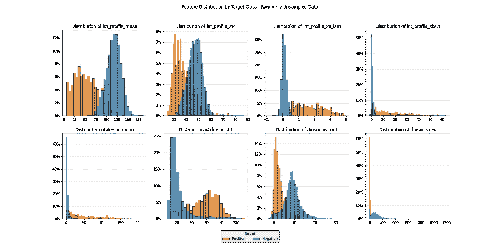

作者图片

现在是 SMOTE 样本:

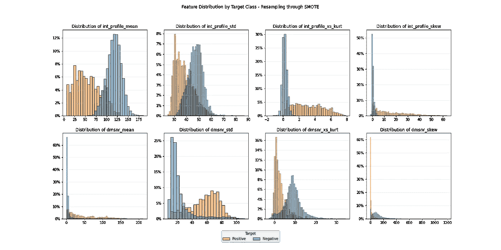

作者图片

两个样本现在都是平衡的(50%负实例，50%正实例)，更令人放心的是，特征分布保留了我们最初在不平衡数据中看到的形状和模式。

# 系统模型化

这一次我们将使用随机森林模型来预测脉冲星。为了能够比较不同采样方法的影响，我们将构建并评估两个模型。

一个模型将根据随机重采样的数据进行训练，另一个模型将根据 SMOTE 数据进行训练。然后，我们将根据不平衡的测试数据评估这两个模型。

使用`sklearn`构建模型，然后使用 F1 分数评估其性能，这相当简单。

*关于模型验证指标的快速说明…F1 分数是对测试准确性的衡量，同时考虑了* ***精度*** *和* ***召回*** *。F1 取[0，1]中的值，其中 0 代表最差的可能结果，1 代表最好的可能结果。F1 在机器学习中广泛用于二进制分类问题。*

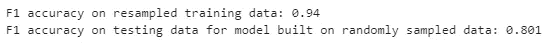

作者图片

在训练集上有相当高的性能，在样本外测试集上的性能不容小觑。

让我们看看在 SMOTE 数据上训练的模型是如何做的:

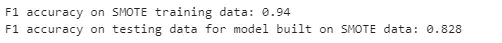

作者图片

虽然我们在平衡训练数据上看到类似的性能，但在 SMOTE 数据上训练的随机森林模型在样本外测试数据上表现更好。我想这意味着我的假设可能是正确的！

然而，使用多个度量来评估模型性能总是好的。让我们用测试集来看看这两个模型的标准化混淆矩阵。

标准化的混淆矩阵是评估以下比例的好方法:

*   **真阳性:**实际目标为阳性且模型预测为阳性的情况。
*   **真否定:**实际目标为否定，模型预测为否定的情况。
*   **假阳性:**实际目标为阴性，模型预测为阳性的情况。
*   **假阴性:**实际目标为阳性而模型预测为阴性的情况。

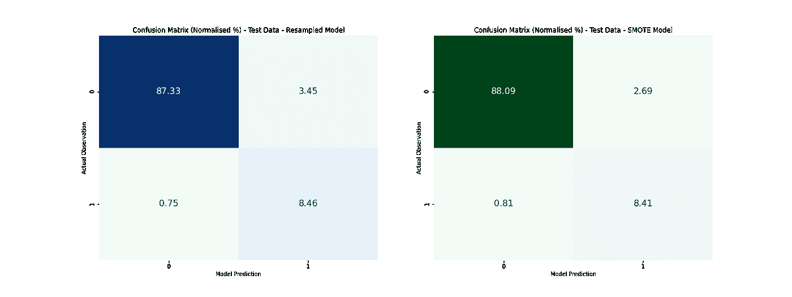

作者图片

有意思！相对于 SMOTE 模型，重采样模型

1.  不善于识别负面事例(应该有大约 92%的负面事例)…
2.  *是否比*更善于识别正面事例(应该有大约 9%的正面事例)…
3.  具有更少的假阴性(0.75%比 0.81%，尽管从绝对值来看，这种差异可能可以忽略不计)…
4.  误报率更高(3.45%比 2.69%)…
5.  准确率较低(95.8%对 96.5%)。

因此，值得思考的是，看起来模型性能有点微妙。

这就足够了，让我们总结一下。

# 结束语

…此外还夹杂着一些漫无边际的话。

我们已经做了很多了！大家讨论一下。

1.  直方图和配对图使我们能够**可视化特征的分布以及它们之间的关系**。我非常喜欢用这种方式绘制信息图表，因为我发现直观地发现关系比通过描述性统计更容易。
2.  我们已经**处理了丢失的值，尽管相当粗糙**。删除有缺失值的观察值实际上意味着我们正在丢失建模数据中的信息。对此有更好的方法，一个**未来的改进可能是估算任何丢失的信息**。
3.  我们已经**平衡并检查了两种不同平衡技术产生的数据，注意到特性的分布和类之间的分离被保留。**我们没有探索上采样的其他方法——未来的改进可能是探索 ADASYN 等技术。
4.  我们在两个平衡的训练集上建立了一个随机森林模型。我随机选择了这个模型，其他模型可能比我们的随机森林要好。在更广泛的建模实践中，可以使用交叉验证方法选择**表现最佳的模型。我们当然需要考虑其他模型在数据缩放和转换方面的要求。**
5.  继续随机森林的主题…没有**保证用于训练模型的超参数接近最优**，我们没有执行任何超参数优化。我们对参数的选择很可能会影响我们比较的结果；让我们将这一点添加到我们的改进列表中。
6.  我们看到，仅基于 F1 度量，基于 SMOTE 数据训练的模型优于基于随机采样数据训练的模型。然而，对混淆矩阵的检查表明，模型性能有一点细微的差别。这也是为什么**我们应该使用多个模型性能指标来评估模型的另一个例子。**
7.  虽然我会说 SMOTE 模型优于随机样本模型，但我不能说这是一个全垒打性能。**通常不正确的分类会带来某种代价**——在这种情况下，可能是花费时间调查我们认为是脉冲星的候选星，却发现它实际上不是(假阳性的一个例子)。考虑到不正确预测的相关成本，或许可以让我们找到决定性的更好的抽样技术。
8.  我们使用一个简单的训练测试数据分割来执行这个比较。通过**将工作流程实现为流水线并通过交叉验证运行**，可以实现更可靠的评估。这将最大限度地利用我们的数据，并提高我们的样本外性能估计的可靠性。