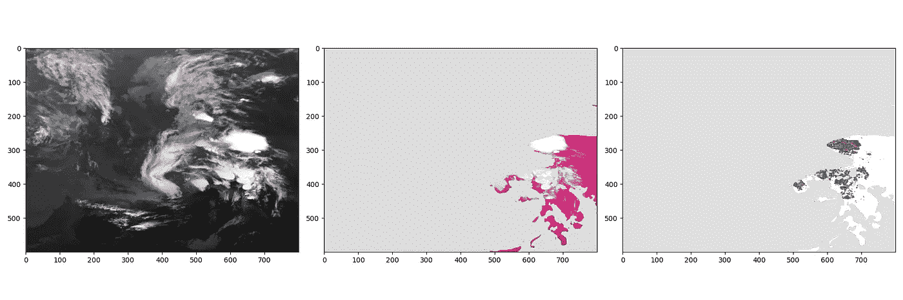
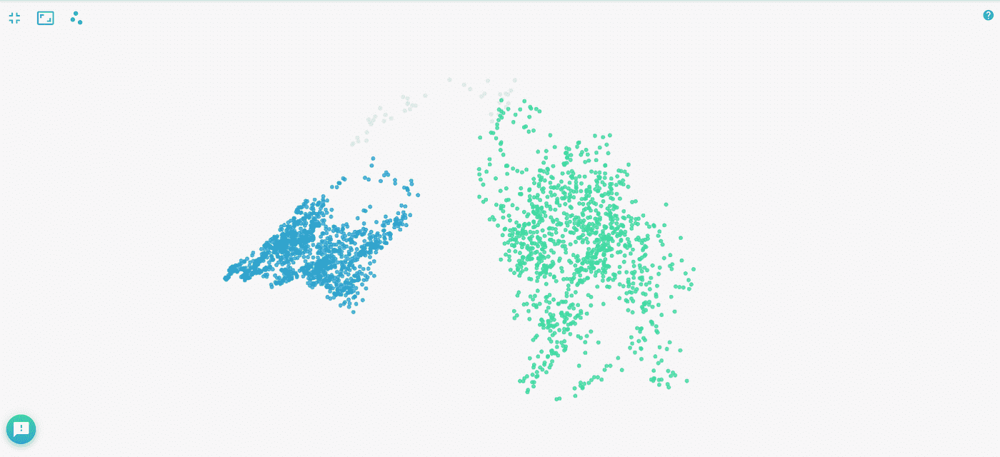
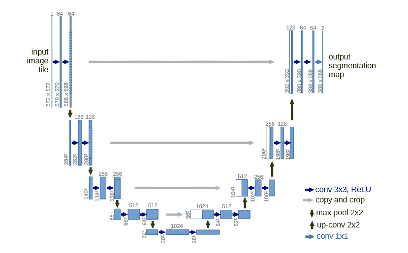
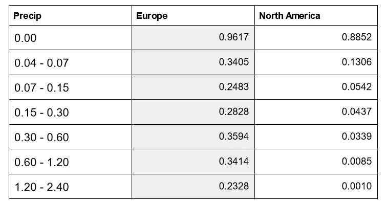
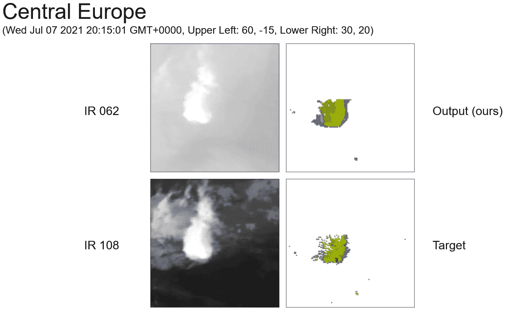
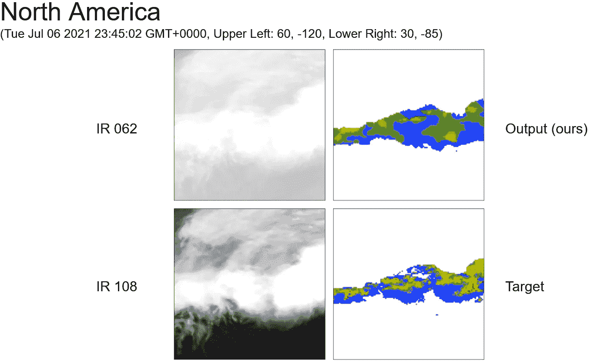
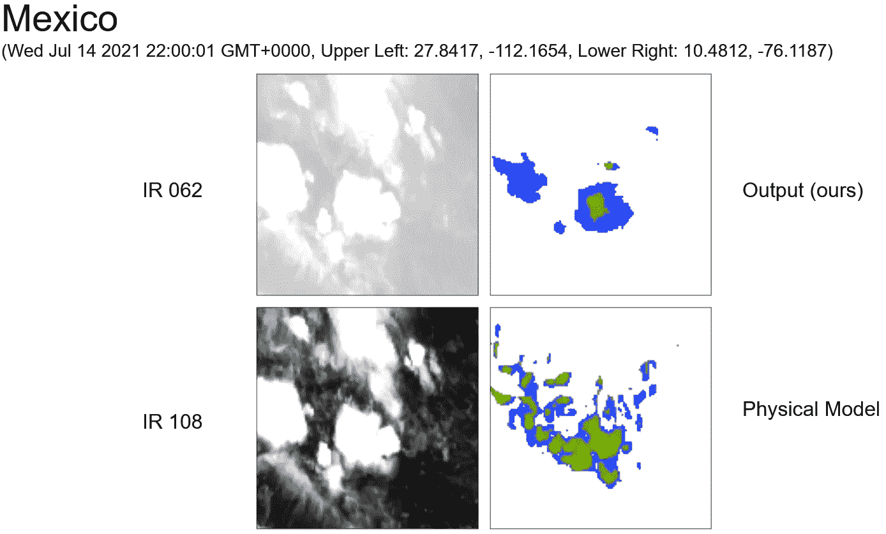

# 从卫星图像预测降雨

> 原文：<https://towardsdatascience.com/predicting-rain-from-satellite-images-c9fec24c3dd1?source=collection_archive---------7----------------------->

## 如何训练神经网络以根据从气象 API 提取的卫星图像来预测降水

# 介绍

预测和了解天气在许多行业都变得至关重要，包括农业、自动驾驶、航空或能源部门。例如，天气条件在航空和物流公司规划最快和最安全的路线时起着重要作用。类似地，可再生能源公司需要能够预测他们在某一天生产的能源数量。因此，各种各样的天气模型被开发出来，并在世界各地得到应用。不幸的是，这些模型通常需要关于大气和确切条件的非常具体的信息。

出于这个原因， [Meteomatics](https://www.meteomatics.com) ，一个提供快速、直接和简单访问大范围全球天气、气候预测和环境数据的天气 API，向我们寻求帮助。**他们的目标是:在数据稀少的地区准确预测降水，他们不得不依靠卫星图像**。在这篇博文中，我们展示了我们如何开发一个神经网络来根据红外卫星数据预测给定区域的降雨量。

# 数据收集和分析

如果你曾经和神经网络一起工作过，你就会知道它们可能是数据饥渴的。因此，建立一个允许您收集、管理和理解汇总数据的数据管道至关重要。我们的合作伙伴 [Meteomatics](https://www.meteomatics.com) 提供了一个易于使用的 API，使我们能够快速收集培训和实际数据。例如，要获得 2021 年 7 月 7 日欧洲的红外图片(坐标从 65，-15 到 35，20)，分辨率为 800x600 像素，我们只需执行以下查询:

从 meteomatics.com 获取红外卫星图像的查询示例。下载的图像可以在下面左侧的示例图中看到。

我们连续几天每隔一刻钟运行一个 Python 脚本，收集欧洲、北美和墨西哥不同波长的红外图像。然后，我们在本地将每个时间戳的不同图像组合成一个 RGB 图像。为了使任务更容易，我们在第一步中掩蔽了[层状降水](https://en.wikipedia.org/wiki/Precipitation_types)。然而，正如我们将在后面看到的，这对模型的准确性只有很小的影响。我们还收集了基础数据，用于训练和评估我们模型的准确性。请注意，地面实况数据仅适用于欧洲和北美。下面你可以看到欧洲上空的一对输入和地面实况数据:

卫星图像(左)、神经网络输入(中)和地面实况数据(右)的示例。基于[提升指数](https://www.meteomatics.com/en/api/available-parameters/standard-weather-parameter/atmospheric-stability/#li)，屏蔽掉输入和地面实况图像上的浅灰色区域。这些数据是 13 年星期二在欧洲上空收集的。2021 年 7 月 20 日 15 时 02 分。

遵循臭名昭著的“垃圾进垃圾出”的咒语，我们希望在训练机器学习算法之前，理解和整理收集的数据。为此，我们轻而易举地使用了免费的探索工具[。Lightly 支持快速简单的方法来分析数据集，以及更深入的算法来挑选最相关的训练点。将我们的数据集上传到 Lightly 后，我们立即注意到所收集数据的一个重要属性:欧洲、北美和墨西哥的图像在视觉上和语义上都是分离的。这导致了一个简单的策略来测试算法的泛化能力:如果我们在欧洲的数据上训练它，并且它在北美和墨西哥的看不见的数据上表现良好，那么该算法将泛化得很好。请注意，如果我们选择了非常相似的训练数据集和测试数据集，那么我们将测试的只是神经网络的记忆。](https://app.lightly.ai/)

来自欧洲(蓝色)、北美(绿色)和墨西哥(灰色)的输入图像的嵌入，如数据策展应用 [Lightly.ai](https://app.lightly.ai/) 所示。图像在嵌入空间中被很好地分离。

我们获得的另一个关键见解是，有许多非常相似的图像小集群。这是因为我们在相对较短的时间内收集了数据。正因为如此，数据集中有大量相似的影像，这使得模型更难很好地泛化。Lightly 帮助我们通过一种叫做“核心集采样”的方法来消除这些冗余，这种方法旨在最大化数据集的多样性。

在用[轻微地](https://app.lightly.ai)管理数据集之前，我们的训练数据集(欧洲)中有 1158 张图像。经过数据整理，我们剩下 578 张图片。验证数据集(北美)由 1107 幅图像组成，而测试数据集(墨西哥)仅由 43 幅图像组成，因为我们后来开始收集数据。

我们轻松地从[下载图片](https://app.lightly.ai)，现在我们准备做一些机器学习。

# 神经网络和语义分割

**卷积神经网络**是一类应用于计算机视觉的人工神经网络。它们的共享权重架构允许它们高效地处理图像数据，并容易地检测相关特征。卫星图像非常适合机器学习。可能的输入图像的范围相当有限，因为卫星总是处于大致相同的高度，因此物体将总是以类似的比例出现。

**语义分割**是给图像的每个像素分配一个标签的任务。例如，在自动驾驶中，算法通常需要学习图像中的哪些像素代表汽车、行人、骑自行车的人、停车标志等。你可以在这里阅读更多关于这个[的内容。为语义分割设计的神经网络的典型架构是 UNet(见下图)。在这里，输入图像被卷积层的金字塔转换成密集矢量，然后通过一系列去卷积层再次扩展成图像的原始形状。此外，来自卷积层和反卷积层的特征被共享，以便获得输入图像的全局视图。](https://medium.com/analytics-vidhya/introduction-to-semantic-image-segmentation-856cda5e5de8)

摘自他们[论文](https://arxiv.org/abs/1505.04597)的 UNet 架构图解。输入图像被压缩，然后通过卷积层的金字塔来解压缩。

为了完成这项任务，我们使用了一种称为高效神经网络(或 ENet)的神经网络。具体来说，我们使用了[这个](https://github.com/davidtvs/PyTorch-ENet) PyTorch 实现。它是 UNet 的一个变种，专门用于移动应用，因此需要更少的浮点运算和参数。这导致更短的训练和推理时间。

为了将预测降雨量的任务构建为语义分割问题，我们根据五分钟时间跨度内的降雨量(以毫米为单位)将输出空间划分为以下类别:

*   未标记(屏蔽掉图像的一部分，如果有的话)
*   0.00 毫米(无雨)
*   0.04 毫米—0.07 毫米
*   0.07 毫米—0.15 毫米
*   0.15 毫米—0.30 毫米
*   0.30 毫米—0.60 毫米
*   0.60 毫米—1.20 毫米
*   1.20 毫米—2.40 毫米
*   2.40 毫米—4.80 毫米
*   > 4.80 毫米

# 结果

除了更改输入的高度和宽度以匹配图像的分辨率(600x800)之外，我们使用引用的存储库中的默认设置来训练神经网络。在 NVIDIA Tesla P100 上的完整数据集上训练 100 个纪元花费了大约 1.6 小时。当在上述精选数据集上进行训练时，我们能够将训练时间减少 50%以上。

我们将首先报告预测对流降水的简单情况的结果，然后评论更一般的情况。下面的表 1 示出了在训练数据集(欧洲)和测试数据集(北美)上不同类别的预测的 IoU(交集/并集),其带有地面实况注释。

表 1:训练集(欧洲)和测试集(北美)上不同预测类的交集(IoU)。请注意，IoU 对于这种分段任务来说是一个次优指标。

正如数字所示，该模型学会了以非常高的准确度区分“下雨”和“不下雨”。不幸的是，随着降水量的增加，精确度会迅速下降。这可以用降雨量大的地区的可用数据稀少来解释。表中的数字可能表明该模型表现不佳。然而，事实并非如此。我们请了一位来自[气象科学](https://www.meteomatics.com)的专家来目测我们的模型做出的预测，他们的结论是该模型非常准确——尤其是考虑到它需要的数据量很少。为了让您更好地理解算法做出的预测，我们将带您浏览一些[气象科学](https://www.meteomatics.com)用来进行视觉检测的例子。

图 1 显示了红外图像，地面实况，以及我们的算法对欧洲天气情况的预测(训练集)。我们可以立即看到预测的形状是非常准确的。然而，我们也观察到模型预测高降水的像素数量(显示为红色)相当低。这是不平衡数据集的一个典型例子，收集更多的高降雨量数据可能会解决这个问题。同样值得注意的是，该模型未能准确预测真实数据的细粒度细节。这可以通过提高分辨率来解决。

图 1:不同波长的输入红外图像(左)，模型输出(右上)和来自训练数据集的放大示例的地面实况(右下)。

图 2 显示了红外图像，地面实况，以及我们的算法对北美天气情况的预测(测试集)。与训练集中的情况类似，我们可以看到对高降雨量地区的预测不太准确。然而，该模型正确地预测了地面实况的形状，并且倾向于精确地预测有更多降水的区域。

图 2:不同波长的输入红外图像(左)，模型输出(右上)和来自测试数据集(北美)的放大示例的地面实况(右下)。

最后，我们希望将我们的算法与已经投入生产的算法进行比较。图 3 再次显示了红外图像和我们的算法做出的预测，这次是在墨西哥上空。然而，它显示的不是地面实况，而是由云和大气的物理模型所做出的预测。很明显，输出差异很大，并且基于输入图像，我们的算法似乎至少在精度方面优于物理模型。事实上，用我们的(轻度)算法观察到的假阳性更少，因为没有云的地方不会预测降水。

图 3:不同波长的输入红外图像(左)，模型输出(右上)和来自测试数据集(墨西哥)的放大示例的物理预测模型输出(右下)。

# 结论

在这一系列中，我们开发了一个语义分割模型，该模型基于卫星图像以良好的准确性预测给定位置的降雨量。我们卷积神经网络的实际应用可以在改善或补充现有天气模型方面发挥至关重要的作用，从而帮助我们的合作伙伴 [Meteomatics](https://www.meteomatics.com) 准确预测难以获得数据的地区的降雨量。

我们可以得出结论，当试图从只有 500 张图像的红外卫星图像中预测降水时，有可能获得合理的结果。即使对于考虑层状降水的更困难的情况，性能也只是略微下降(IoU 平均下降大约 0.04)。这种设置的一个关键问题是数据集严重失衡。为了缓解这种情况，可以在更长的时间内收集更多的训练样本，以确保多样化的数据集。为了获得更精细的结果，最好以更高的分辨率收集图像，并将其切割成更小的块，以保持较低的内存占用。

最后，我们注意到用[稍微多样化数据集](https://app.lightly.ai/)的 coreset 算法稍微提高了验证准确性，同时减少了大约 50%的训练时间。这进一步证实了该数据集中的不平衡和冗余会给模型训练带来问题。

希望这篇博文提供了一个例子，说明数据管理的重要性和神经网络在天气模型中的力量，并将激励读者尝试在 [Lightly](https://app.lightly.ai/) 和 [Meteomatics](https://www.meteomatics.com) 的帮助下构建自己的模型。

— — — — — — — — — — — — — — — — — — — — — — — — — — — — — —

菲利普·沃思
机器学习工程师
lightly.ai