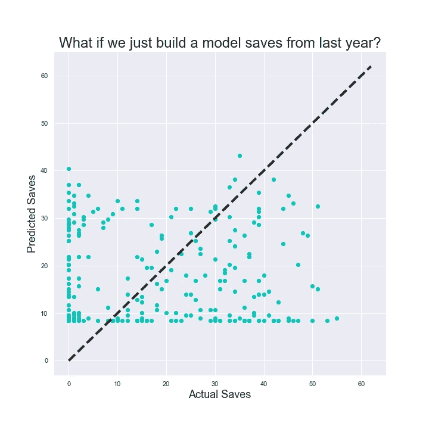
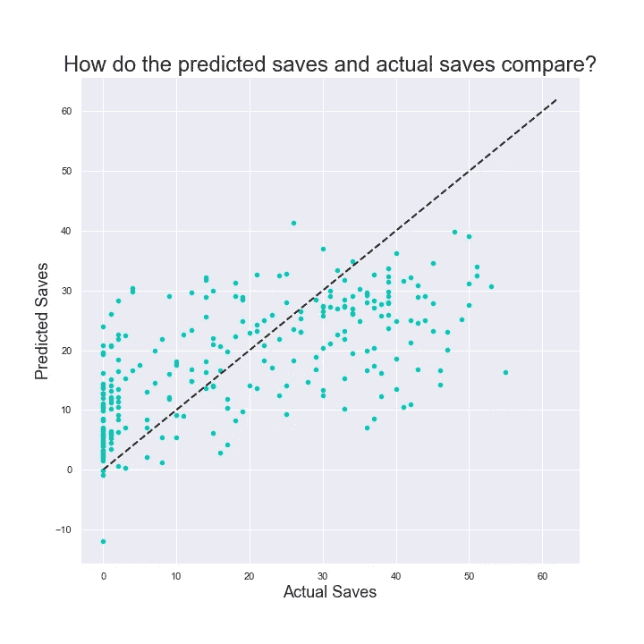
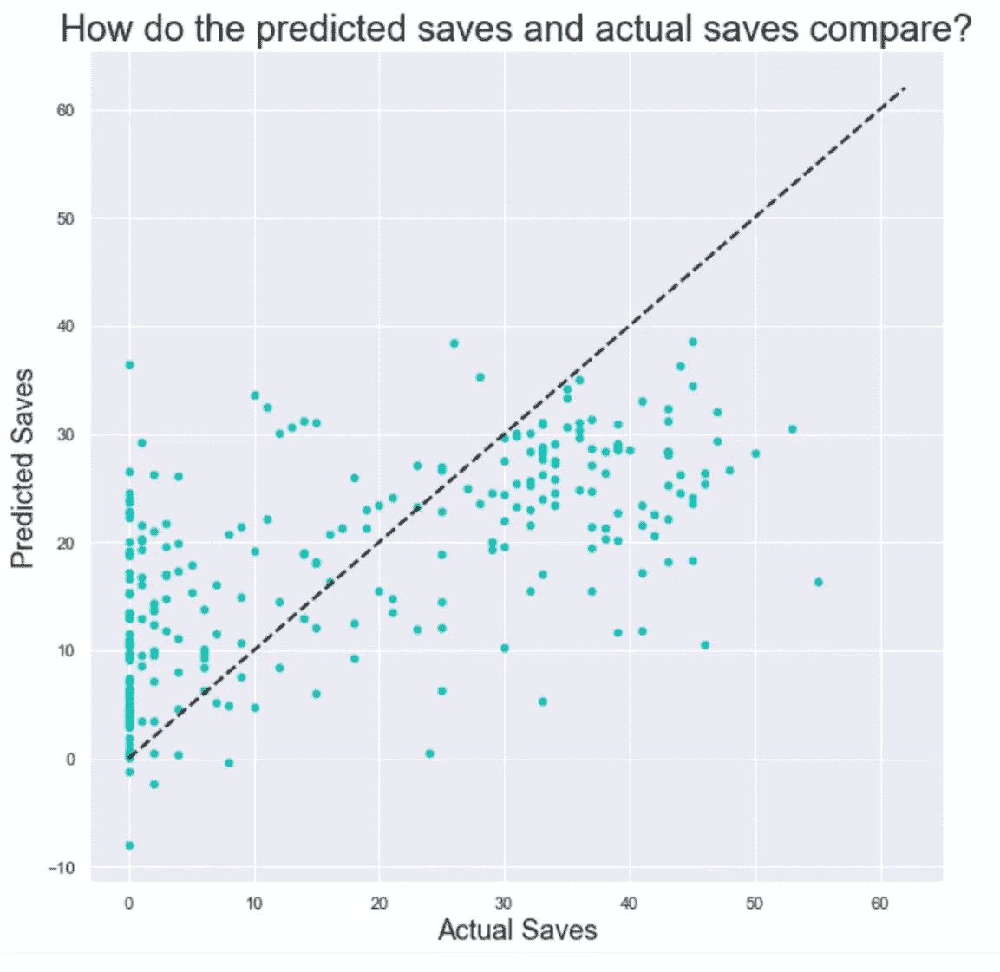
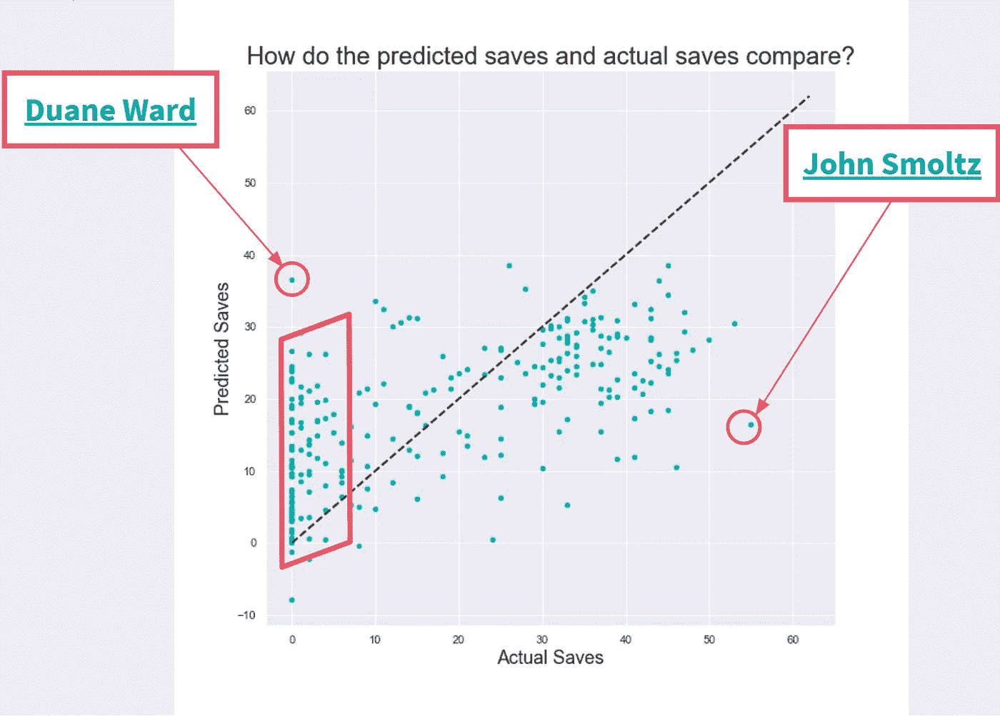
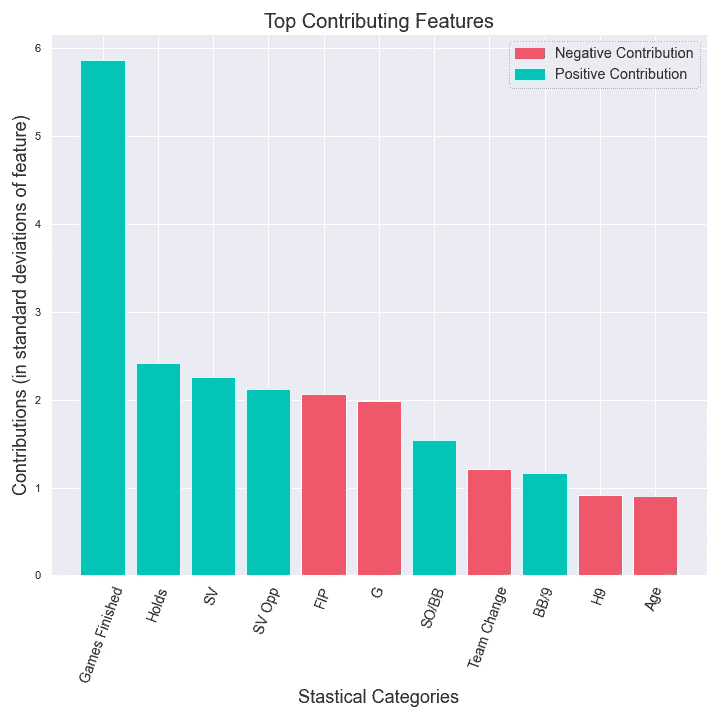
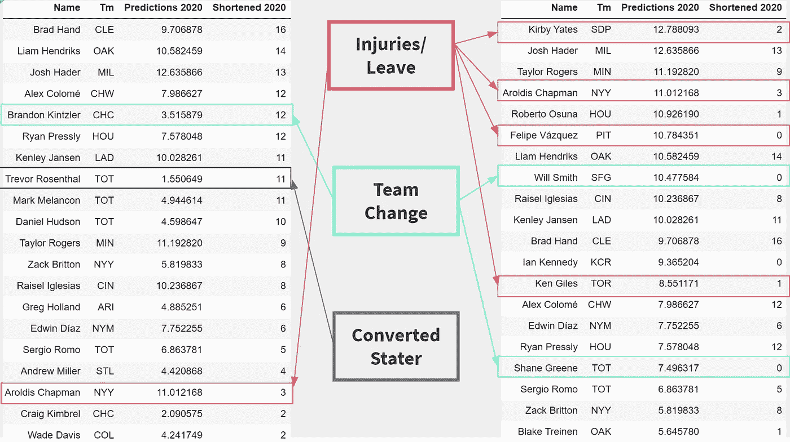

# 探索预测 MLB 投手的救球

> 原文：<https://towardsdatascience.com/predicting-saves-for-pitchers-in-mlb-cbbf73b9b3df?source=collection_archive---------32----------------------->

一月的芝加哥，一个寒冷的早晨，我醒来时听到一个激动人心的消息:白袜队最近签下了一名新球员，利亚姆·亨德里克斯。对于一个崭露头角的球队来说，增加一个全明星来支撑他们的牛棚是一个令人兴奋的前景，也是球队投资在 2021 年实现竞争力飞跃的标志。我看亨德里克打球的大部分经历是在几个月前，当时他的奥克兰运动家队在季后赛首轮击败了白袜队。在短系列赛中，他是一个真正的主导力量，我在过去几年中听到过他的名字，所以我认为他在这个角色上已经有一段时间了。

当我打开他的[棒球参考](https://www.baseball-reference.com/players/h/hendrli01.shtml)页面时，我惊讶地得知，他不仅只做了两年的棒球投手，而且事实上他还是近十年前为明尼苏达双城队效力的那个低于平均水平的首发投手！我知道这种从先发到后发的转变并非闻所未闻，但我被他职业生涯早期和后期成功的鲜明对比吓了一跳。我被两个相关的问题打动了。首先，利用这一页上的统计数据，我能预测他在即将到来的赛季在白袜队的表现吗？第二，有没有一种方法可以普遍预测近距离投球手的救球，甚至是像亨德里克斯那样职业生涯轨迹变化很大的投手？

> 有没有一种方法可以预测近距离投球手的救球，甚至是像亨德里克斯那样职业生涯轨迹变化很大的投手？

**收集数据**

我决定继续使用我和许多其他球迷的网站，作为统计数据的第一站，棒球参考。我特别感兴趣的是获得关于投手的信息。为了清楚起见，closer 是球队在比赛后期高杠杆情况下用来帮助“结束”比赛的投手[。如果他们在这种情况下进入，保持领先，并且他们的球队获胜，他们将被记为救球](http://m.mlb.com/glossary/standard-stats/save)。Baseball-Reference 有一个[漂亮的页面](https://www.baseball-reference.com/leaders/SV_top_ten.shtml),上面有从 1871 年以来每年救球次数最多的前十名投手，所以我用它来决定我应该把哪些投手放入一个数据集中。我用 BeautifulSoup 收集了从 1990 年到现在，每个赛季出现在前十名名单上的投手的职业统计数据。1990 年的截止日期让我们停留在牛棚使用的现代时代，因为中继投手的配置方式在 1970 年代中后期开始大幅改变。

**清洁和工程数据**

一旦我把 HTML 文件刮到 Jupyter 笔记本上，我就解析它并把它加载到熊猫数据框中。我的目标是下一年的储蓄，所以我必须通过移动行来为下一季度提供储蓄，从而对时间序列数据进行一点工程处理。例如，一名投手的 2015 年数据将添加一个条目，用于 2016 年的救球。这样，我可以使用 2015 年的数据，在监督下进行训练、验证和测试。我也做了同样的事情，回顾过去，看看跟踪记录的统计数据是否会影响未来的表现。因此，这些 2015 年的统计数据还包括 2014 年的存储类别、前两年的总和以及连续三年的总计。

这个决定也意味着需要从训练数据集中删除一些观察值。投手在他们职业生涯的最后一年没有任何有意义的预测。在他们的最后一个赛季保存计数被用于前一年的目标后，他们的最后一个赛季被删除。同样，由于新冠肺炎，2020 赛季是不正常的，所以它不会用作 2019 赛季的真正目标，所以这些都被搁置起来供未来考虑。

除了保存统计数据之外，还有大量其他统计数据可用作模型中的潜在特征。这些指标包括但不限于:比赛次数、安打次数、跑垒次数、三振次数、ERA、救球机会、持球次数、年龄以及更复杂的指标，如 WHIP、FIP、ERA+、SO/BB 和 S0/9。

**MVP 和基线**

为了了解如何开始预测储蓄，我从一个简单的回归模型作为最小可行产品开始。最初的模型是一个简单的线性回归，将去年的存栏数作为预测下赛季的唯一特征。这个模型只能解释来年储蓄变化的 30%。这意味着一年的救球总数可以解释投手在下一个赛季的表现，也不能解释救球的大部分可变性。平均而言，该模型的预测具有大约 14 次保存的平均绝对误差。

MVP 模型中的可视化误差

在上图中，准确的预测落在虚线上，而远离该线的点表示超出或低于预测。该模型有一个下限，给出了它将预测的最小值，这是一个很好的例子，说明该模型如何未能捕捉到储蓄中的一些可变性。

我把这个模型作为基线。未来的模型可能会解释更多的可变性，这将是一个成功的故事。有可能准确预测节省吗？如果有的话，什么统计数据可以解释这种能力？

**改进型**

出于这个项目的目的，我想坚持线性回归，以满足 [Metis 数据科学密集训练营](https://www.thisismetis.com/bootcamps/online-machine-learning-bootcamp)的任务要求。在新模型中，有几个改进方向需要考虑。最大的机会来自已经讨论过的内容，即添加更多的功能。通过分析配对图来避免要素之间的共线性，使用领域知识来确认这些要素是否相关，并考虑要素与目标变量的相关系数的热图，我使用剩余的要素创建了一个新模型。

然后，这个更新的回归模型被训练并通过五重交叉验证运行，这看到了可以解释目标节省的可变性百分比的增加，平均跃升至 35%。此外，预测的平均误差有所下降，下降到每次预测 10 次左右。

在与以前相同的视觉样式中，新模型创建的预测更接近实际值，因为点更接近真实预测的虚线。此外，输出的最小值不再出现，这有助于模型考虑未来储蓄的额外可变性。

**微调**

对改进的最后一次尝试来自于考虑特性的相互作用，并确定哪些特性对最终的模型贡献最大。在这两种情况下，我都依赖于使用交叉验证的套索模型来惩罚大的系数和帮助特征选择。我创建了所有的二次相互作用项，并通过一个套索模型运行，但后来没有非零系数，所以我没有在我的模型中保留这些相互作用项。然而，我确实从我自己的工程中发现了几个增加价值的特征，在每场比赛的失误(障碍，被投球击中，和根据外观相加和划分的野球)和每场比赛面对的击球手方面。

使用具有所选特征的套索模型，最终模型适合预测。根据维持测试数据集对其进行测试，最终得出了实际节省量与预测值的对比图。

虽然该图看起来与之前的回归模型的预测非常相似，但根据测试数据，最终模型能够解释目标存储中约 41%的可变性，并且每次预测的平均误差约为 10 次存储。

**误差来源**

在这个过程中，虽然模型解释储蓄变化的能力有所提高，但我不认为它们是预测储蓄的完全可靠的方法。有很多玩家有很大的误差，考虑他们有助于理解为什么模型会有问题。

预测误差的主要来源

有几个要点与约翰·斯莫茨和杜安·沃德这样的球员有关。斯莫茨看到了像亨德里克斯一样的职业轨迹。但他并没有从先发到中继再到近传，而是直接从先发跳到近传。像斯莫茨这样的投手没有任何中间赛季可以预测他们在救球方面的成功，这个模型无法捕捉到这种跳跃。另一方面，杜恩·沃德非常成功，但他受伤了，再也没有真正上场比赛。在他上一个成功的赛季后，这个模型预期会有更多的成功，但无法解释他的下降。封闭者的高波动性的负面影响在许多预测赢得救球的投手中可以看到，但最终几乎赚不到钱。

**外卖**

尽管存在这些误差来源，但该模型确实有能力解释未来储蓄的一些可变性，而不仅仅是简单地使用去年的储蓄。为了更好地理解哪些要素的贡献最大，让我们考虑一下 LASSO 模型中要素的系数。由于统计数据已经标准化，因此这些值仅用于解释价值，并不代表相关要素的价值。

LASSO 模型标准化特征的系数

在我看来，贡献最大的特征分为两类:机遇和优势。机会可以归结为运气、管理选择、绩效和其他因素的组合，但在这里可以在统计数据中看到，如完成的游戏数量、持有(另一个高杠杆机会，但不是完成游戏)、保存、保存机会和游戏。统治力是一个类别，说明投手在多大程度上控制了比赛，而不是依靠他的防守来支持他。这在统计数据中是显而易见的，如 FIP(这是一种描述投手独立于外野手的成功的指标)，每次保送的三振数，以及允许较少安打和增加保送的组合。

> 在我看来，贡献最大的特征分为两类:机遇和优势。

**未来工作**

我将引导未来的努力去发现更多关于这两个对最终模型影响最大的类别的信息。特别是，我会根据速度、旋转速度、挥杆和失误百分比以及其他新的学校统计数据，转向其他高级指标，以更好地定义主导投手。我还认为，引入更多与球队相关的统计数据，如管理行为和关于球队进攻和防守之间平衡的指标，可能会预测比赛的接近程度，从而预测扑救机会的数量。总而言之，很明显，救球是高度不稳定的，很难预测，所以依靠这些代理值可以帮助我们更好地了解未来潜在的成功，除非受伤。

**为了好玩:预测 2020 年**

作为最后的总结，这是最终模型在 2019 年的基础上对 2020 年的预测，然后缩小到 60 场比赛的赛季。

根据 2019 年预测 2020 年

在左侧，投手按实际的 2020 保存排序，而右侧则按模型中的项目保存排序。总的来说，这个模型在预测储蓄方面做得不错，除非它失败了。然而，这些大的错误似乎都属于之前讨论过的角色/团队变化和伤害的范畴。没有准确的 2020 年 162 场比赛数据或 2019 年两年后的数据，没有一个数据集似乎与预测 2021 年有关，但我期待使用 2021 年的数据来看看我对 2022 年的预期！

更多细节、代码、连接和其他信息，请访问我的 [Github 知识库](https://github.com/ejfeldman7/Predicting_Saves)、[网站](http://www.ejfeldman.com/)或 [LinkedIn](https://www.linkedin.com/in/feldmanethan/) 。