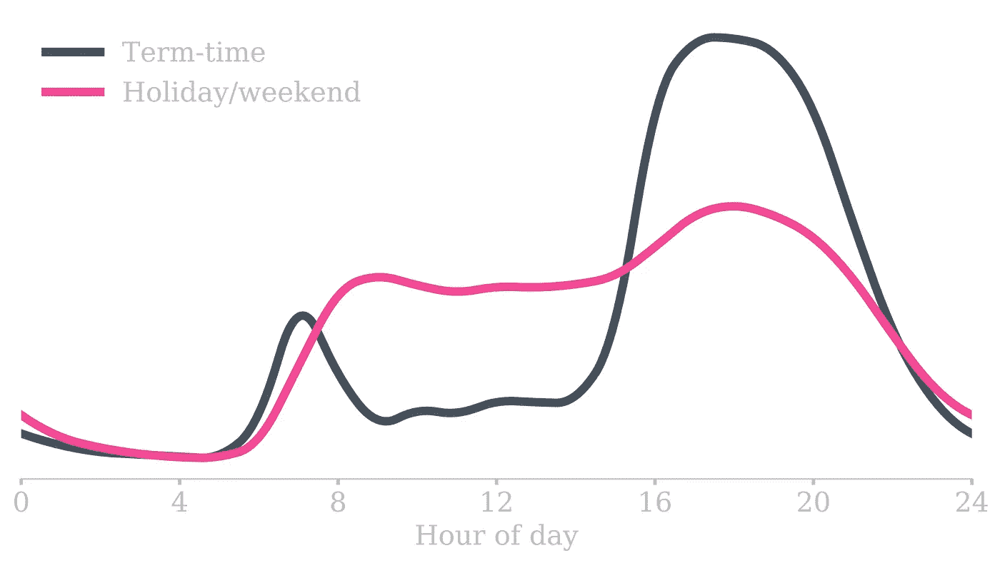
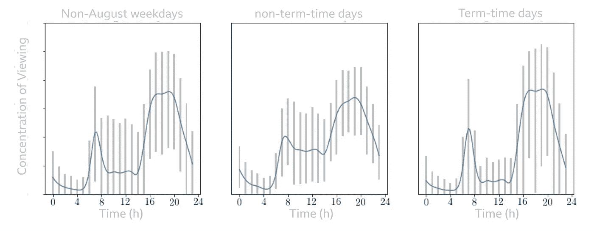
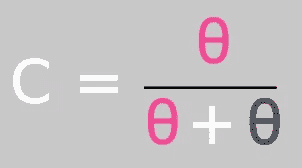
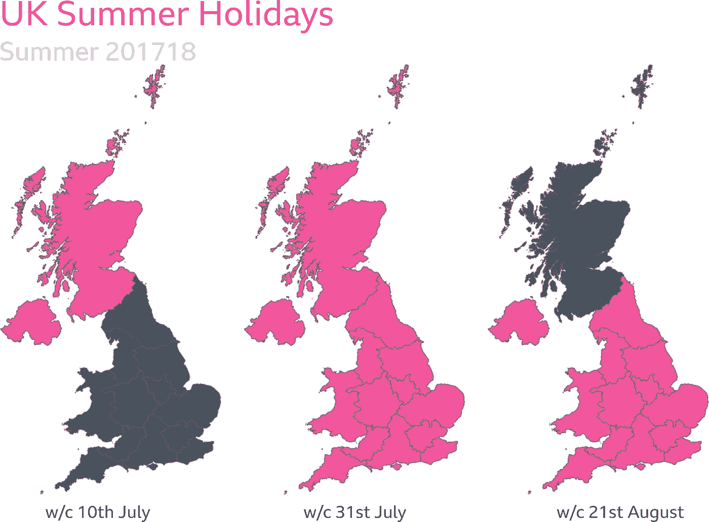
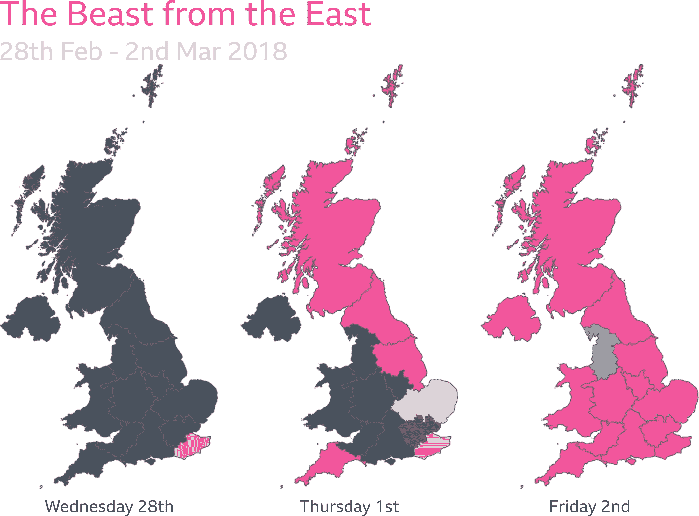
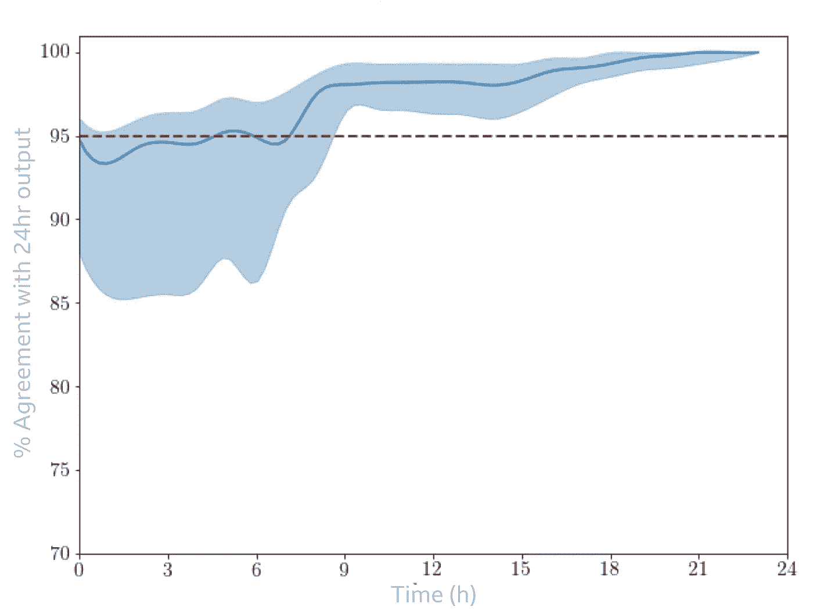

# 从 BBC iPlayer 观看预测学校假期

> 原文：<https://towardsdatascience.com/predicting-school-holidays-from-bbc-iplayer-viewing-df4e211b02c?source=collection_archive---------39----------------------->


[图像来源](https://unsplash.com/photos/lUaaKCUANVI)

*我们能从 BBC iPlayer 上观看的某些电视节目中辨别出孩子是否在上学吗？剧透——是的！我们还可以识别学校何时因下雪而关闭！*

> 这是我在 BBC 工作的第一个项目，也是最有趣的项目之一。

虽然关于学校假期的信息可以在互联网上获得，但它出现在地方政府网站上，这些网站的格式因委员会而异，这使得网络搜集不切实际。

# 用例

BBC 为儿童制作了大量内容，能够有效且恰当地传递这些内容至关重要。我们当前的使用案例包括:

*   报告
*   及时输出儿童内容
*   推荐适合儿童的内容
*   评估营销活动的有效性
*   受众细分

# 实时结果

*当学校放假时，用儿童友好的版本自动个性化 BBC iPlayer 主页不是很棒吗？*

虽然我们的一些用例，如观众细分，可以用学校假期的历史数据来执行，但最有用的应用来自于在足够的时间内了解学校假期，以便能够对 BBC 的输出做出积极的决策。

我们非常聪明地构建了这个模型，使得我们能够在同一天的上午 9 点之前识别出学校假期。请继续阅读，了解如何…

# 数据

我们使用了 2 个数据集来构建这个模型:

*   BBC 事件数据，用于 BBC iPlayer 上的儿童内容流
*   [代码点打开](https://www.ordnancesurvey.co.uk/business-government/products/code-point-open)来自地形测量局的数据集，用于邮政编码位置数据

# 观看模式

我们的目的是纯粹根据儿童一整天对 iPlayer 内容的查看模式来确定某一天是否是学校假期。下面的图 1 显示了学期日和学校假期/周末的平均观看模式。



图一。全天的收视分布。对每天的观看进行标准化，以便在对每个班级进行平均之前，每天有效地有一个观看者。(图片作者本人)

这两个班级的观看行为没有什么令人惊讶的地方:

*   *学期-时间*的特点是流量出现两个高峰；一个在早上，一个在下午。上学期间很少看电视。
*   学校放假观赏开始稍晚，一天中的大部分时间都处于平稳状态。

虽然在上面的图中很明显，这两种类型的日子的观看模式是不同的，但我没有讨论的是，我们如何标记什么是学期日，什么是假日，这是一个挑战！

# 半监督学习

这变成了对半监督学习的研究——数据科学中一个鲜为人知的领域。

我们都听说过监督和非监督学习，但是什么是*半监督*学习呢？

*   *监督学习—* 训练集中的每个数据点都有特征和标签，我们可以根据特征识别标签
*   *无监督学习—* 我们没有标签，但希望根据它们的特征来识别“相似”的数据点并将其分组到*簇*中。虽然我们可能试图解释每个集群的定义特征，但它们在很大程度上是抽象的。
*   *半监督学习—* 我们有大量未标记的数据，但希望我们的聚类有特定的含义。

我们有一点矛盾——我们想要一个模型来分配标签，但是我们需要标签来构建模型。有点先有鸡还是先有蛋的情况，或者更有趣的是:

> 我最近发现士力架里的牛轧糖是用融化的士力架棒调味的。KitKat 中薄饼之间的巧克力层含有融化的 kit kat！

**其他基于巧克力的零食也有*


[图像来源](https://unsplash.com/photos/giE4qXNX0n8)

半监督学习确实是两个世界中最糟糕的，但是有一些方法可以使用标准的监督和非监督技术来帮助解决这些问题。

## 无监督学习方法

先简单讨论一下我们没做的事。

> 可能影响人们流媒体行为的最大因素是天气——如果下雨，人们就会呆在家里看电视。

下雨时，我们在 iPlayer 上看到三倍于 CBBC 的流量——这表明当天气晴朗温暖时，孩子们都在外面。应用无监督学习可以很好地产生代表下雨/不下雨而不是假期/学期时间的两个聚类。

## 监督学习方法

我们这样做的出发点是，我们可以标记我们的一些数据:

*   *假期*:周末和假期差不多，常见的学校假期如八月初和包含圣诞节的一周在全国范围内是统一的。
*   *期限-时间:*没有已知节假日的时期，如 12 月初和 6 月。

然而，不能保证 BBC iPlayer 在假日期间的周三观看与学期期间的周六观看相似；如果我们坚持只将部分标记的数据集作为训练数据，我们就有模型不能很好概括的风险。

解决方案是使用离群点检测算法来概括我们部分标记的数据集…

# 离群点检测

*异常值检测的目的是在未标记的数据中识别额外的日期，我们可以合理地将其标记为假期或学期时间。*

[*1 类支持向量机*](https://scikit-learn.org/stable/auto_examples/applications/plot_outlier_detection_wine.html#sphx-glr-auto-examples-applications-plot-outlier-detection-wine-py) 可以执行离群点检测，尽管它们对于不规则形状的聚类/类可能不会最优地执行。在这种情况下， *DBScan* 将是一个很好的选择。

我们可以使用部分标记的数据来定义我们的每一个类，然后使用 1 类 SVM 来识别其他不是该类异常值的日子。这有助于从我们最初的部分标记数据集进行归纳。就像雀巢公司的士力架和 KitKat 一样，我们可以结合原始的部分标记数据和新的模型输出来重新训练模型，并预测一组更一般化的类示例。重复应用应该收敛于一组一致的非异常值。

在下面的图 2 中，我们显示了将学期-时间 1 级 SVM 应用于不在八月的工作日的结果。1 级 SVM 通过选择白天观看率明显下降的日子来从所有非八月工作日中识别额外的学期日。



图二。查看所有非八月工作日的数字(左)，按新标记的“期限-时间”日期(右)和该类中的异常值(中)划分。蓝线表示中间值，灰条表示第 5 和第 95 个百分点。(图片作者本人)

当然，一个数据点是一个类的异常值并不意味着它属于另一个类！我们仍然需要一个更强大的分类器，但现在我们可以对每个类别中的所有数据点进行平均，以定义每个类别的特征行为，如图 1 所示。

# 分类度量

现在我们已经有了每个班级的特征行为，我们可以开始分析某一天看起来更像是假期还是学期了。

如果我们将一天的观看表示为 24 维空间中的向量，我们可以通过计算两个向量之间的角度来评估特定一天的观看和学期-时间/假期观看之间的相似性。我们使用[欧几里得点积](https://en.wikipedia.org/wiki/Euclidean_vector#Dot_product)的定义来做这件事，这与更常见的度量[余弦相似度](https://en.wikipedia.org/wiki/Cosine_similarity)非常相关。


图 3。将数据表示为向量的简单二维版本。在这里，为了演示的目的，我们将 24 个维度简化为 2 个:“白天”和“晚上”。(图片作者本人)

然后，我们可以将 24 小时的查看数据组合成一个单一的指标，我们称之为*分类指标:*



图片作者自己的

分类可以由下面的简单关系来定义:

*   c ≥ 1/2:期限-时间
*   你可能想知道为什么我们不使用 24 小时特征集来训练一个 ML 模型？

使用分类指标的优势在于，它可以在一天中的任何时间进行评估，比如说，我们可以在某一天的前 9 个小时进行观看，计算出与我们的特征行为的前 9 个小时相关的余弦相似性，然后使用相同的 1/2 截止值计算分类指标。该属性使我们能够使用实时查看数据来识别上午 9 点前的学校假期(稍后将详细介绍！).

## 此外，分类标准将 24 个维度(每小时观看一个维度)减少到 1 个。这提供了大规模的维度缩减，使我们能够聚合不同地理区域的多个分类指标。否则每个地理区域将有 24 个维度，你可以很容易地看到维度的数量可能会增长得相当快。它还简化和改进了前面讨论的异常值检测算法。

地理可变性

这个项目的主要理由之一是不同的学校有不同的假期。北爱尔兰和苏格兰的暑假尤其如此。即使在英格兰，不同的地区也有不同的学期、复活节和圣诞节假期。

我们开始把观看分成越来越小的地理区域。在 [outcode](https://en.wikipedia.org/wiki/Postcodes_in_the_United_Kingdom#Outward_code) 水平，我们得到非常具体的预测，但在农村地区，我们缺乏足够的数据来可靠地分类。在区域层面上，我们得到了大量的数据，但丢失了许多地理细节。

# 对于每一天，通过查看以下地理区域的汇总数据来评估分类指标:

输出代码

10 个最近的输出码(基于每个输出码中心之间的欧几里德距离，根据地形测量定义的纬度和经度)

城镇

*   地区
*   一个随机森林分类器根据这 4 个分类度量作为特征，以及来自前一天和一周中某一天的相同度量进行训练。在这里，前一天的数据很重要，因为假期通常发生在整周，所以如果周二是假期，那么周三也很可能是假期。然而，银行假日通常是周一，并不能告诉我们周二是否是假日。
*   结果
*   我们对模型进行的第一次定性评估是在暑假。给予或采取教师培训日，可能适用于不同地区，核心暑假在英国不同国家是一致的。没有向模型提供关于一年中的时间(只有一周中的某一天)或不同国家何时放暑假的信息。下图显示了模型的结果。

图 4。英国不同国家暑假的差异。显示的数据是每个地区的周一至周五 Fri 的平均值。(图片作者本人)

# 该模型已正确识别出北爱尔兰有 8 周长的暑假，而其他国家有 6 周。苏格兰的暑假也比英格兰和威尔士早两周。

[图像来源](https://unsplash.com/photos/IWenq-4JHqo)



在检查结果时，我注意到 2017 年 12 月的一个流氓日显示格洛斯特郡在度假(未显示)。在最初的恐慌之后，我决定在谷歌上搜索当天的新闻事件，并发现一场大暴风雪在那一天关闭了格洛斯特郡的许多学校——这一事件是模型正确识别的！

最终成为一个更有趣的事件的是昵称为“来自东方的野兽”的冬季天气事件，它于 2018 年 2 月底抵达英国。下图显示了该模型在此期间的输出。


图 5:2018 年冬天，英国遭遇了一场绰号为“东方野兽”的冬季风暴。肯特郡在 2 月 28 日星期三第一次受到袭击，到 3 月 2 日星期五，英国大部分地区被埋在几英寸厚的雪下，英国大部分学校关闭。(图片作者本人)

> 2 月 28 日星期三，来自东部的野兽第一次成为头条新闻，当时它袭击了肯特郡，并关闭了那里的学校。随着一周时间的推移，风暴在全国范围内向上和向西移动，导致越来越多的学校关闭——所有这些我们的模型都能够识别。3 月 2 日星期五，只有英格兰西北部的孩子在大量上学。

清晨会聚



*Hindcast 数据对我们的很多应用都很有用，比如受众细分、报告、营销效果。然而，我们理想地希望能够基于模型输出做出主动的决策。*

我在上面简单提到过，我们可以在一天中的任何时间点应用余弦相似性，只需要使用我们有数据的维度。我们还使用分类度量来训练我们的随机森林，我们可以根据余弦相似度来计算分类度量。因此，我们不需要等待一整天的数据，就可以开始将这一天归类为学校假期或学期时间。

# 但是仅仅因为我们*能够*做出预测并不意味着我们应该——这个模型有多准确？

我们可以分析当我们添加更多小时的数据时，模型收敛到稳定预测的速度。假设模型在一天结束时是正确的，如果模型在上午 10 点做出同样的预测，那么我们做得很好！下图显示了一天结束时预测与数字相符的比例。这是英国所有日期和地点的汇总数据。

图 6。全天模型的收敛。蓝线表示中间值，蓝色阴影区域表示第 5 到第 95 个百分点。(图片作者本人)

> 在早晨的早些时候，我们在模型中得到大量的可变性(大的蓝色阴影区域)。在上午 9 点左右，模型性能有一个显著的提高—在大多数情况下，模型在上午 9 点以后不会改变它的分类。回到图 1，我们可以看到学期日的早上高峰在这个时候下降，这似乎是模型能够工作的所有需要。

在工作日开始时，我们可以以 95%以上的准确率识别出是学校假期还是学期时间。



能够在一天的早些时候做出预测意味着我们能够根据是否是学校日或者*和*对 BBC 的输出做出积极的决定，我们可以在地区层面上这样做！

结论

> 使用来自 BBC iPlayer 的用户行为数据，我们能够准确预测一天是学校假期还是学期时间。我们可以对历史数据进行这种分析，以分析营销效果，而且通过使用分类指标训练模型，我们能够使用相同的模型进行实时预测。我们还使用了英国国家测绘局的数据来汇总地区数据，进行局部预测。

密码

# 下面是计算分类指标的代码。主要的函数调用是*calculate _ classification _ metric()。*

Using user behavioural data from BBC iPlayer we are able to accurately predict whether a day is a school holiday or term-time. We can perform this both on historical data to analyse marketing effectiveness but also, by training a model using the classification metric, we’re able to use the same model to predict in real-time. We’ve also used Ordnance Survey data to allow us to aggregate regional data to make localised predictions.

# Code

Below is the code to calculate our classification metric. The main function call is *calculate_classification _metric().*

```
def magnitude_of_vector(vector):
    """
    Function to calculate the magnitude of a vector

    Parameters
    ----------
    vector: 1-d numpy array
        vector we want to find the magnitude of

    Returns
    -------
    Magnitude of vector as float
    """
    return np.sqrt(np.sum(vector ** 2))

def dot_product(vector1, vector2):
    """
    Function to calculate the dot product between 2 vectors.
    The dot product is independent of the order of the input vectors.

    Parameters
    ----------
    vector1: 1-d numpy array
        one of the vectors
    vector2: 1-d numpy array
        the other vector

    Returns
    -------
    Dot product of the two input vectors as a float
    """
    return np.sum(vector1 * vector2)

def angles_in_radians(vector1, vector2):
    """
    Function to calculate the angle between 2 vectors.
    The angle is independent of the order of the input vectors and 
    is returned in radians.

    Parameters
    ----------
    vector1: 1-d numpy array
        one of the vectors
    vector2: 1-d numpy array
        the other vectors

    Returns
    -------
    Angle between the two input vectors measured in radians
    """

    magnitude_x = magnitude_of_vector(vector1)
    magnitude_y = magnitude_of_vector(vector2)
    dot_product_x_and_y = dot_product(vector1, vector2)
    angle_in_radians = np.arccos(dot_product_x_and_y / (magnitude_x * magnitude_y))
    return angle_in_radians

def convert_radians_to_degrees(angle_in_radians):
    """
    Function to convert an angle measured in radians into degrees.
    360 degrees is equivalent to 2pi radians

    Parameters
    ----------
    angle_in_radians: float
        angle measured in radians

    Returns
    -------
    Angle measure in degrees between 0 and 360.
    """
    angle_in_degrees = angle_in_radians / np.math.pi * 180
    return angle_in_degrees

def calculate_acute_angle(angle):
    """
    Function to convert an angle measured in degrees to an acute angle 
    (0 < angle < 90 degrees)
    For example, 2 vectors that form an angle 135 degrees will be converted
    to the acute angle 45 degrees.

    Parameters
    ----------
    angle: float
        angle measured in degrees

    Returns
    -------
    Equivalent acute angle measured in degrees 
    """
    acute_angle = (angle > 90) * (180 - angle) + (angle <= 90) * angle
    return acute_angle

def calculate_acute_angle(vector1, vector2):
    """
    Function to calculate the acute angle between 2 vectors 
    (0 < angle < 90 degrees). 

    Taking the acute angle means that we ignore the direction of the vectors
    eg. Walking due north is equivalent to heading due south - all we care 
    about is that your longitude remains constant

    Parameters
    ----------
    vector1: 1-d numpy array
        one of the vectors
    vector2: 1-d numpy array
        the other vectors

    Returns
    -------
    Acute angle between the two input vectors measured in radians
    """
    angle_in_radians = angles_in_radians(vector1, vector2)
    angle_in_degrees = convert_radians_to_degrees(angle_in_radians)
    acute_angle = calculate_acute_angle(angle_in_degrees)
    return acute_angle

def calculate_classification_metric(
    holiday_vector,
    termtime_vector,
    viewing_vector
):
    """
    Function to calculate our classification metric. This is based on the
    acute angle that a day's viewing makes with each of our two class-defining 
    vectors. 

    If classification_metric < 1/2 -> Holiday
    If classification_metric > 1/2 -> Term time

    Parameters
    ----------
    holiday_vector: 1-d numpy array
        Average viewing during a school holiday
    termtime_vector: 1-d numpy array
        Average viewing during a school day
    viewing_vector: 1-d numpy array
        Viewing for the day that we want to classify

    Returns
    -------
    Float between 0 and 1
    """
    holiday_angle = calculate_acute_angle(viewing_vector, holiday_vector)
    termtime_angle = calculate_acute_angle(viewing_vector, termtime_vector)
    classification_metric = holiday_angle / (holiday_angle + termtime_angle)
    return classification_metric
```