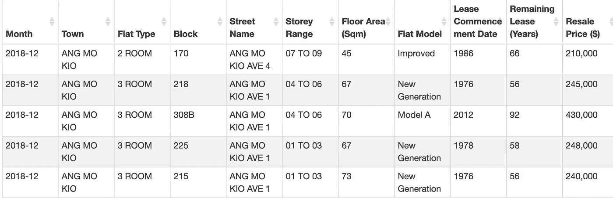
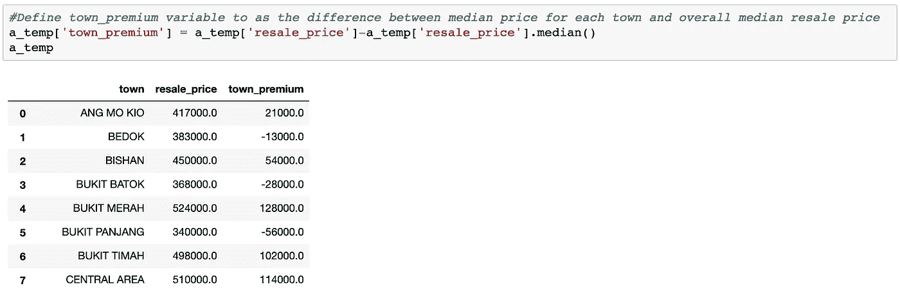
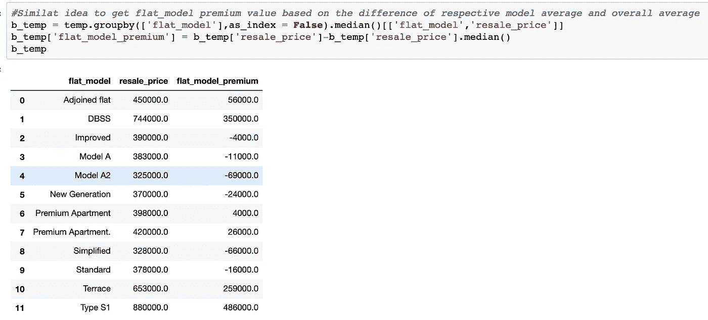
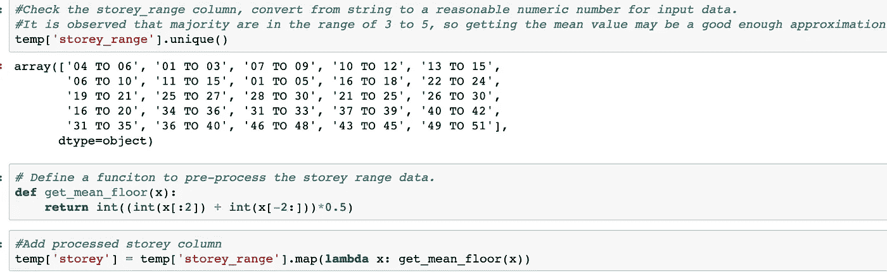
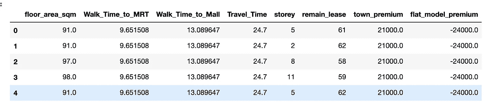

# 预测新加坡 HDB 转售价格:数据准备

> 原文：<https://towardsdatascience.com/predicting-singapore-hdb-resale-price-data-preparation-be39152b8c69?source=collection_archive---------27----------------------->

## 如何通过必要的特征工程工作来操纵数据集，以便为进一步的分析和建模做准备


由 [Unsplash](https://unsplash.com/s/photos/hdb?utm_source=unsplash&utm_medium=referral&utm_content=creditCopyText) 上的 [Muhd Asyraaf](https://unsplash.com/@minimxlist_?utm_source=unsplash&utm_medium=referral&utm_content=creditCopyText) 拍摄

在新加坡，对于即将成家立业的年轻上班族来说，当他们的预算有限时，HDB(新加坡公共住房)将是他们的首选。然而，对于那些正在考虑选择哪套 HDB 公寓的人来说，这可能会成为一个真正令人头疼的问题:城镇地区、附近的设施(如学校、购物中心)、公寓类型等。为了让人们在面临如此重大的选择时更轻松，我决定对新加坡 HDB 转售价格进行研究，探索影响 HDB 转售价格的关键因素，并为打算在不久的将来购买 HDB 的人提供一些建议。

# 了解数据集

可以从 data.gov.sg 的[检索到 HDB 的转售数据。以下是原始数据集中可用列的示例:](https://data.gov.sg/dataset/resale-flat-prices)



来自 HDB 转售价格数据集的样本数据(图片由作者提供)

以下是我第一次看这些专栏时的一些第一印象:

**月**:以年月的格式给出。我们可以从这一栏中检索年数据，这在分析 HDB 转售价格的时间趋势时可能是有用的。

**城镇**:城镇位置应该是影响 HDB 转售价格的关键因素之一——我们通常认为，在相同户型的情况下，HDB 果园公寓的转售价格要比怡顺公寓高得多。

**户型**:有 7 种不同的户型:1 室、2 室、3 室、4 室、5 室、EC、多代。其中四房 HDB 公寓是新加坡最受欢迎的公寓。我们可以考虑使用 4 个房间数据样本来构建模型。

**楼层范围**:该列以字符串而非数字的形式给出，如果我们想用它来建立模型，可能需要做一些相应的数据处理。

**平板模型**:同样，也有大量不同的平板模型(35 种不同类型)。这一因素将在整体统一价格中发挥重要作用。例如，DBSS(设计、建造和销售方案)公寓会有更高的转售价格，因为它允许买家根据自己的风格设计 HDB。

剩余租期:新加坡 HDB 租期 99 年。此列数据有相当多的空值，并且是根据不同的年份计算的。在构建模型时，我们可能需要相应地调整该列数据。

# 特征工程

在对数据集有了一些粗略的想法后，我们可能会开始进行数据争论。以下是我为预处理相应的数据列所做的一些特征工程工作:

**城镇:**为了使用这个数据列作为回归模型的输入，我已经按城镇聚集了数据集，并采用每个城镇的中间转售价格来减去总的中间转售价格。结果(“town_premium”列)可以解释为当他们选择这个位置时需要额外支付的金额。例如，在武吉梅拉赫购买 HDB 公寓平均需要多付 12.8 万英镑，而如果选择武吉潘江地区的 HDB 公寓，则可以少付 5.6 万英镑。



预处理“城镇”列(图片由作者提供)

**Flat_Model** :对“Flat_Model”栏也做了类似的预处理。如前所述，我们确实看到 DBSS HDB 公寓的转售价格高于平均水平，人们可能需要为这种类型的公寓平均支付约 35K。



我只是简单地从给定字符串中的两个数字中取平均值。例如，对于“04 到 06”的范围，我将只指定楼层为 5。这应该是一个足够好的近似值，因为对于每个类别来说，楼层范围跨度并不是真的更大(3 或 5 层的差异)。



**剩余租赁**:原始剩余租赁列包含空值，根据取数日期的年份不同，引用到不同的年份。我用以下公式重新计算了转售日的剩余租赁价值:

**公式**:remain _ lease = lease _ start _ date+99–转售 _ 年

# 我们能从“街道名”中得到什么？

现在，我们已经预处理了原始数据集中的大多数列。看起来都不错……等等，“街道名称”一栏怎么样？

如前所述，这一栏实际上显示了每个 HDB 公寓的地理位置数据。这实际上是 HDB 转售价格的一个关键因素，因为它会表明 HDB 是否靠近任何捷运站，或者附近是否有任何购物中心。根据我在 HDB 租房的经验，这个信息应该很重要，我相信它也适用于 HDB 的转售价格。

我们可以尝试使用 GoogleMap 或其他可用的地图 API 来提取不同街道名称、捷运站和主要购物中心的经度和纬度。然后我们可以获得从这些街道名称到最近的捷运和购物中心的相对距离，作为转售价格预测的指标。

在做了一些研究后，我注意到 [Onemap.sg](https://docs.onemap.sg/) 提供了一个 API，使用户能够方便地查询给定特定地址的经度和纬度。我编写了一个简单的 python 脚本来使用一个地图 API 查询位置信息。

我们可以做同样的事情来检索新加坡捷运/购物中心的经度/纬度信息。新加坡捷运站列表可在[这里](https://en.wikipedia.org/wiki/List_of_Singapore_MRT_stations)找到，新加坡主要商场列表可从[这里](https://en.wikipedia.org/wiki/List_of_shopping_malls_in_Singapore)提取。

我们需要获取的另一条信息是，给定街道名称，哪一个是最近的购物中心/捷运站。我们可以用 for 循环来计算街道名称与每个购物中心/MRT 的相对距离，然后相应地获得最小距离目标。附上示例代码以供参考:

```
*##Sample Script to obtain the closest shopping mall name given street name*import openpyxl
import numpy as npdef calculate_distance(x,y):
    return np.sqrt(((x[0]-y[0])*110.574)**2 + ((x[1]-y[1])*111.32)**2)wb = openpyxl.load_workbook('Street_Name_List.xlsx')
wb2 = openpyxl.load_workbook('Shopping_Mall_List.xlsx')
sheet = wb['Sheet1']
sheet2 = wb2['Sheet1']
for row in range (2, sheet.max_row +1):
   Distance = 200
   MRT = 0
   if sheet['B'+str(row)].value is not None:
      for k in range (2, sheet2.max_row + 1):
         x1 = sheet['B'+str(row)].value
         x2 = float(sheet2['B'+str(k)].value)
         y1 = sheet['C'+str(row)].value
         y2 = float(sheet2['C'+str(k)].value)
         #print (type(x1),type(x2),y1,y2)
         Dis_Temp = calculate_distance([x1,y1],[x2,y2])
         if Dis_Temp < Distance:
            Distance = Dis_Temp
            MRT = k
         else:
            continue
   else:
      continue
   print(MRT)
   print(sheet2['A'+str(MRT)].value)
   sheet['F'+str(row)].value = sheet2['A'+str(MRT)].valuewb.save('Street_Name_List.xlsx')
print('Job Done.')
```

如果您一直这样做，现在您应该已经获得了数据集中每个街道名称的封闭 MRT/购物中心名称。有了从 API 查询的所有经度/纬度数据，我们可以很容易地计算出从每条街道到最近的捷运/购物中心的相对距离。为了便于可视化，我将相对距离(公里)转换为从相应街道步行所需的时间(分钟)(1 分钟步行被映射为平均 80 米的距离)。

我能想到的另一个有趣的指标是从最近的捷运站到中央商务区的公共交通出行时间(例如，莱佛士广场捷运站)。这可能是年轻的工作成年人使用捷运作为主要交通工具的一个重要指标，因为在新加坡买车并不是每个人都能负担得起的。

我们可以使用 OneMap API 路由服务来查询公共交通的行驶时间，而不是根据我们自己的估计来计算时间。关于 API 使用的更多细节可以在[这里](https://docs.onemap.sg/#route)找到。

通过上面提到的所有特征工程工作，我们最终获得了具有以下期望特征的数据集:

(注:步行时间到捷运，步行时间到购物中心和旅行时间到来福士都是以分钟为单位。town_premium 和 flat_model_premium 均以新加坡元为单位)



用于转售价格预测模型的最终数据集(图片由作者提供)

在我们继续建模之前，我们将首先探索更多关于数据集的内容，并从中发现一些有趣的模式。这将在下一篇文章中讨论(见下文)。感谢阅读！

<https://medium.com/@tianjie1112/predicting-singapore-hdb-resale-price-eda-and-modeling-94af7d26798d> 