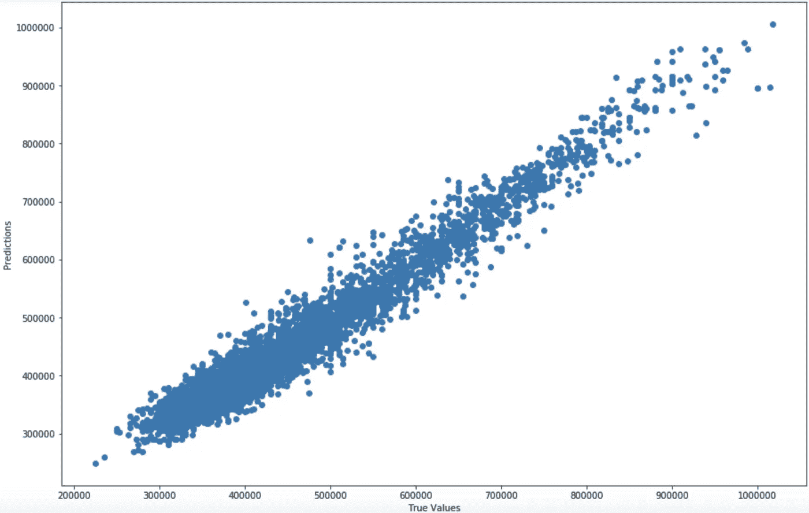

# 预测新加坡 HDB 转售价格:EDA 和建模

> 原文：<https://towardsdatascience.com/predicting-singapore-hdb-resale-price-eda-and-modeling-94af7d26798d?source=collection_archive---------18----------------------->

## 进行 EDA 并尝试不同的 ML 模型来预测转售价格

在 [Unsplash](https://unsplash.com/s/photos/hdb?utm_source=unsplash&utm_medium=referral&utm_content=creditCopyText) 上由[迈克·埃尼奥](https://unsplash.com/@mikeenerio?utm_source=unsplash&utm_medium=referral&utm_content=creditCopyText)拍摄的照片

在上一篇文章中，我们对[新加坡 HDB 转售价格](https://data.gov.sg/dataset/resale-flat-prices)数据集进行了数据辩论，并确定了一些对以后构建模型有用的特征。在继续建模之前，让我们更深入地研究一下数据集，看看是否能找到一些有趣的模式。

对于这个项目，我使用 SAS JMP 软件做数据可视化。对于简单的数据可视化任务，JMP 非常方便，它有一个用户友好的用户界面。你可能想参考他们的官方[网站](https://www.jmp.com/en_sg/software.html)了解更多详情。

# HDB 转售价格多年来的总体趋势是什么？

从网站上，我们可以获得从 1990 年到 2018 年的 HDB 转售价格数据。让我们看看中间转售价格的总体趋势是什么:

1990 年至 2018 年新加坡 HDB 中间价(图片由作者提供)

从该图可以看出，HDB 转售价格有两个峰值。第一个高峰出现在 1997 年，随后主要受亚洲金融危机的影响，出现了大幅下降。此后，HDB 转售价格从 2006 年开始再次上涨，并在 2013 年达到新的峰值。随后，HDB 转售公寓的价格再次下降，这与公共住房市场的一系列冷却措施相吻合，如 [ABSD 框架](https://www.mof.gov.sg/Newsroom/Press-Releases/Additional-Buyer%27s-Stamp-Duty-for-a-Stable-and-Sustainable-Property-Market)。从 2014 年至今，从中间值来看，HDB 的整体转售价格相当稳定。

通过这一分析，我们大致了解了过去 20 年 HDB 转售价格的总体趋势。我们可以观察到，新加坡 HDB 价格可能受政府政策和整体经济趋势的影响很大。

# 不同的城镇地区有相似的价格趋势吗？

从第一幅图中，我们了解到，从 2014 年到现在，HDB 房价中位数看起来很稳定。这适用于新加坡所有的城镇地区吗？我带着这些疑问，因为我确实注意到一些[新闻](https://sbr.com.sg/residential-property/in-focus/million-dollar-hdb-resale-flats-rise)说中心地区的 HDB 价格达到了近年来的历史最高水平。

按城镇区域划分的 4 室 HDB 公寓转售价格中位数(图片由作者提供)

该图显示了按城镇区域划分的 HDB 4 居室公寓价格中值。可以清楚地看到，2013 年后，HDB 中心区的房价突然上涨，其斜率甚至高于前几年。对于皇后镇、武吉提马、武吉梅拉赫等其他中心地区，转售价格也偏高。对于远离 CBD 的城镇地区(如蔡珠港、三巴旺等)，观察到转售价格自 2013 年以来持续下降。

从这个图表中，我们可以看到，即使采取了所有的降温措施，HDB 中心区的转售价格仍然上涨。人们愿意花更多的钱为 HDB 中心区享受它带来的便利。此外，在中心地区建造新的组屋的可用空间非常有限，这也使得中心地区的转售市场比其他地区热得多。对于远离城市的城镇，通常有更多的空间用于新 HDB 公寓，所以人们有更高的机会获得 BTO 公寓，而不是购买转售的 HDB。因此，在采取降温措施后，转售价格往往会下降。

# 到中央商务区的旅行时间很重要

从前面的分析中，我们可以看出，中心区域具有较高的 HDB 转售价格。一般来说，中心区域意味着更容易到达购物中心和其他设施，更方便的交通等。从不同地点到中心区域的旅行时间如何影响 HDB 转售价格？

4 房间 HDB 从 2010 年至 2018 年，中间转售价格与前往莱佛士广场捷运的旅行时间(图片由作者提供)

从这个图中，我们可以看到 HDB 转售价格和去捷运莱佛士广场的旅行时间之间良好的线性相关性，这也符合我们的预期。如果只考虑到 CBD 地区的旅行时间，有没有什么被低估的城镇位置可以让买家更加关注？

转售价格中值与前往莱佛士广场地铁站的行车时间(图片由作者提供)

这张图表可以让我们了解城镇位置和转售价格之间的关系。对于位于中心区、皇后镇和武吉提马的组屋来说，它们的转售价格通常高于其他旅行时间相似的城镇。换句话说，如果只谈与市中心的相对距离，这些组屋可能定价过高。另一方面，对于那些希望住得离 CBD 更近且预算有限的潜在买家来说，HDB 在 Geylang/Kallang、Serangoon 和 Ang Mo Kio 等地区的公寓可能是一笔不错的交易。这些城镇地区更具成本效益，因为与其他城镇相比，它们的价格更低，与市中心的旅行时间相似(可能高达 20 万英镑)。

# 为建模选择平面类型

最后但同样重要的是，我绘制了 HDB 转售价格随年份的变化图，按不同的公寓类型划分。

HDB 转售价格与销售年份，按户型划分(图片由作者提供)

毫不奇怪，这一次，我们可以看到，一般转售价格趋势不同的单位类型是相似的。由于我们有足够的数据样本(总共超过 850，000 行数据)，我决定选择 4 种房间公寓类型进行建模，因为这是新加坡最受欢迎的公寓类型。此外，我只使用了 2005 年以后的数据样本，因为更新的数据对未来 HDB 转售价格的预测更具代表性和相关性。

# 建模时间到了！

终于到了激动人心的部分:建模！我们将试用几个模型，并比较每个模型的准确性，更重要的是，讨论为什么某些模型具有更好的性能。

如前所述，我为最终建模选择了 8 个特征。自 2005 年以来的 4 室公寓型 HDB 转售交易数据被用作模型训练和测试的输入数据。

用于转售价格预测模型的最终数据集(图片由作者提供)

# 线性回归模型

我从线性回归模型开始。线性回归模型的主要优点是需要调整的参数较少，并且结果相对容易解释。对于这个项目，我使用了 sklearn 库，这是当今最流行的数据科学项目工具包。

构建这个模型的代码非常简单，我不会在这里详述太多的细节。所有的源代码都可以在这个[链接](https://github.com/YooTimmy/HDB_Resale_Price_Study)获得。

线性回归模型(图片作者提供)

这里需要强调的一点是，线性回归函数使用了 *R* (决定系数)回归评分函数。这使我们能够以百分比的形式直观地显示测试结果。

*R 定义为(1 — u/v)，其中 u 为残差平方和((y_true — y_pred) ** 2)。sum()和 v 是平方和的总和((y_true — y_true.mean()) ** 2)。sum()。最好的可能得分是 1.0，也可以是负的(因为模型可以任意地更差)。*

使用线性回归模型，我从测试数据集中获得了大约 79.7%的准确性，没有任何额外的参数调整。一个很好的开始！

线性回归模型预测值与实际值(图片由作者提供)

这是显示线性回归模型中真实值和预测值的相关性的图表。我们可以看到它们通常遵循线性趋势。我们还可以注意到，30K 到 55K 范围内的点密度更高，从某种意义上说，转售价格数据集也不平衡，更多的交易在 30K 到 55K 转售价格范围内结束。

# 梯度推进回归模型

虽然 79.7%的准确度是一个好的开始，但是我们能够达到更高的准确度吗？线性回归模型似乎没有太多进一步改进的空间。鉴于我们的数据集本质上是不平衡的，通过进一步的研究，我想起梯度推进回归模型在我们的情况下可能是一个不错的选择。

梯度推进树算法是一种集成学习方法，一次构建一棵树，其中每个新树将对具有较高分类/回归误差的数据样本赋予更多权重。它适用于处理不平衡数据集，在这种情况下，该算法可以将更多的权重放在更难预测的数据样本上。

同样，在 sklearn toolkit 中有一个可用的库，我们可以直接使用。要调整的主要参数如下:

n_estimator —要执行的升压阶段的数量。我们不应该把它定得太高，那会使我们的模型过拟合。

max _ depth 树节点的最大深度。太高会导致过度拟合问题。

learning _ rate 学习数据的速率。

损失—要优化的损失函数。ls '指的是最小二乘回归，类似于我们之前的线性回归模型。

梯度推进回归模型(图片由作者提供)

在训练模型之后，我们使用相同的测试数据集来检查准确性。我们达到了 95.5%的准确率——相当惊人！我绘制了与线性回归模型相同的相关图，很明显，结果有了显著的改善。

梯度推进模型预测与实际(图片由作者提供)

***feature _ importances***指标表示决定最终 HDB 转售价格的各个特性的权重。据观察，**占地面积**、**距离最近的**商场**、&、**捷运站、**和**剩余租期**对 HDB 转售价格的影响最大(权重均≥ 15%)。**到 CBD** 、**楼层**和**城镇位置**的出行时间对最终转售价格各有约 10%的影响。最不重要的特征是**平板模型**类型，它占总转售价格预测值的 5%。**

# 线性回归与梯度推进回归

我们看到，与线性回归模型相比，梯度推进模型具有非常好的结果，精度提高了约 15%。为什么梯度推进回归模型跑赢线性回归模型那么多？

这表明，从给定的特征来看，应该存在简单线性回归模型不能捕捉的非线性元素。梯度推进树模型使用决策树作为弱学习器。在计算损失后，模型将在每次迭代后选择最小化剩余损失的决策树，以不断提高预测精度。这是纯线性回归模型无法实现的。

虽然 GBR 可以实现更高的预测精度，但它也有比线性回归模型更难解释的缺点。我们只能从上面提到的*feature _ importance*metrics*中大致了解不同特性的权重。*

# 结论和建议

在这个项目中，我们对新加坡 HDB 转售价格数据集进行了全面的研究。我们已经经历了数据科学项目的数据集预处理、特征工程、数据探索和可视化以及建模阶段。影响 HDB 转售价格的关键因素已经确定。最后，构建了转售价格预测模型的梯度推进模型，预测准确率> 95%。

虽然我们已经达到了很高的预测精度，但也应该注意到，真实的 HDB 转售价格比我们在模型中讨论的要复杂得多。还有许多其他因素，如整体经济状况、政府法规，以及各城镇年轻工作成年人的比例，都可能对最终转售价格产生影响。这些因素可以添加到未来的工作，以进一步改善。

当人们真正考虑购买 HDB 时，他们的优先考虑也因情况而异。例如，对于一对在美光(位于新加坡北海岸)工作的夫妇来说，他们可能会选择在林地或义顺区购买一辆 HDB，离他们的工作地点很近。对他们来说，从家到 CBD 的旅行时间可能不是最重要的，因为大多数时间他们只会呆在北部的邻近地区。

我们还确定了几个城镇位置，如 Kallang，Ang Mo Kio 和 Serangoon，这可能是人们在 CBD 附近寻找低价位的好地方。

再次感谢你关注我的帖子！请在下面留下您的意见和建议。如果你错过了我之前关于数据准备部分的帖子，你可以在下面看看！

[https://medium . com/@ tiajie 1112/predicting-Singapore-hdb-转售-价格-数据-准备-be39152b8c69](https://medium.com/@tianjie1112/predicting-singapore-hdb-resale-price-data-preparation-be39152b8c69)