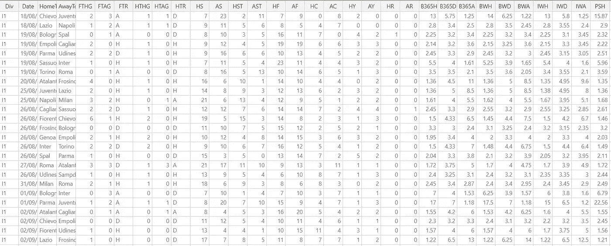
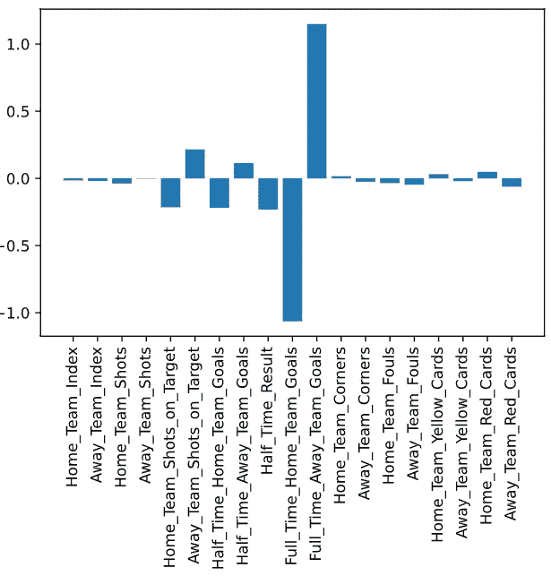
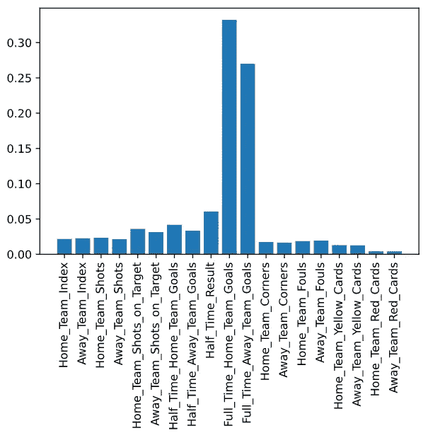
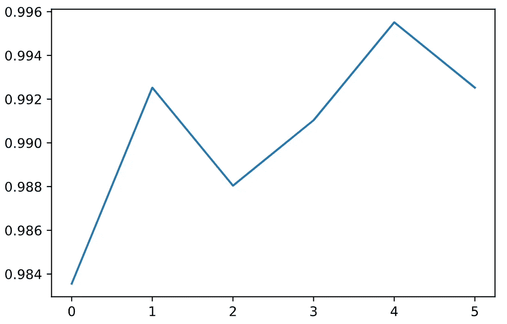
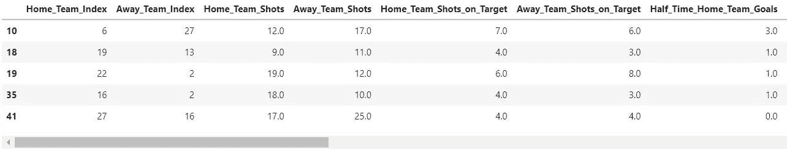
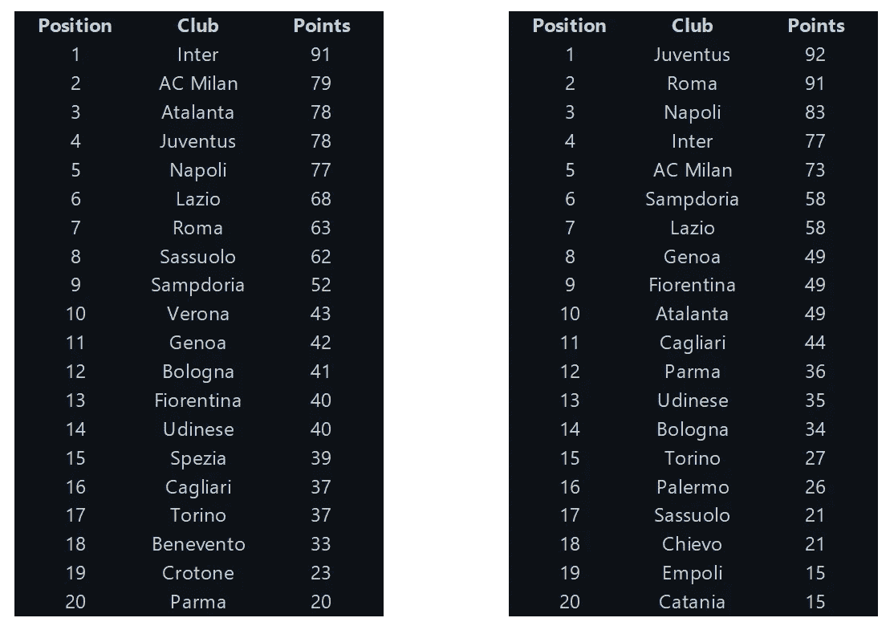

# 预测足球排行榜——历史数据是正确的方法吗？

> 原文：<https://towardsdatascience.com/predicting-soccer-league-tables-is-historical-data-the-way-to-go-840e4272f1c4?source=collection_archive---------16----------------------->

## 对意大利足球联赛(众所周知的意甲联赛)的分析揭示了很多关于体育如何快速变化的事情


利亚姆·麦凯在 [Unsplash](https://unsplash.com?utm_source=medium&utm_medium=referral) 上的照片

*本文是对 2020-21 赛季意大利甲级联赛的简单预测，从 2021 年 2 月开始。虽然赛季已经结束了，但是我们可以比较一下实际的联赛结果，看看它们和我所做的预测相比如何。用于预测的方法是逻辑回归和随机森林的组合，以及交叉验证数据的 K 倍。作为初学者，我会在整篇文章中强调我犯的一些错误。分析的主要思想是看历史数据为什么不应该是用于体育预测的唯一工具。*

我从高中起就喜欢足球，在接触到数据科学世界后，我想知道是否有一种方法可以预测它。当然，俱乐部足球队一直在更换球员和教练，但应该有一些历史因素让我们看到一种趋势，对吗？

足球在一些联赛中竞争非常激烈，而在另一些联赛中却很容易预测。例如，在德国，俱乐部球队拜仁慕尼黑已经[连续赢得 9 个联赛冠军](https://www.espn.com/soccer/bayern-munich-gerbayern_munich/story/4368301/bayern-munich-win-historic-ninth-straight-bundesliga-title-as-leipzig-lose-at-dortmund)，而在英格兰超级联赛中，5 个不同的球队在过去十年中赢得了联赛冠军。我选择分析意甲，因为尽管他们与德国联赛相似(尤文图斯俱乐部队也赢得了 9 个联赛冠军)，但 2020-21 赛季正在改变这种君主制。

数据的预查看[:](https://datahub.io/sports-data/italian-serie-a)



作者图片

我首先做的是，获取从 2010 年到 2021 年的所有 CSV 文件，并将它们合并到一个 CSV 文件中，同时将文件名设为季节年:

```
***# combine all season files into 1* if** (os**.**path**.**isfile('data.csv')):
    os**.**remove('data.csv')
extension **=** 'csv'
all_filenames **=** [i **for** i **in** glob**.**glob('*.{}'**.**format(extension))]***# add a "season" column to distinguish year, and combine all files in the list*** combined_csv **=** pd**.**concat([pd**.**read_csv(f)**.**assign(Season**=**os**.**path**.**basename(f)**.**split('.')[0]) **for** f **in** all_filenames])
*#export to csv*
combined_csv**.**to_csv("../data.csv", index**=**False, mode**=**'w+', encoding**=**'utf-8-sig')
```

您在互联网上找到的大多数足球数据都有与此数据相同的列。我们将首先删除“AR”之后的所有列，因为这些都是“投注列”，这意味着它们是来自不同流行投注公司的获胜概率。

为了增加数据清理，我还为半职和全职结果列创建了虚拟变量。为了让它代表一个真实的足球联赛表，我将输转换为 0，平转换为 1，赢转换为 3。这与实际的排名表以这种方式表示一样，因为游戏结果准确地反映了一支球队得到的分数:

```
***# create dummies for half-time and full-time scoreline details*** cleanup_TR **=** {"HTR":    {"H": 3, "D": 1, "A": 0},
              "FTR":    {"H": 3, "D": 1, "A": 0}
              }
```

在此之后，以下是其余各列及其描述(我们将使用全职结果作为此分析的*相关*变量):

我做的下一件事是通过绘制一些直方图找到相关性。我在这里没有发现太多，除了主场命中率相当稳定，而客场命中率变化更大。这意味着，如果一个主队和一个他们知道不会击败他们的队比赛，他们会感到更舒服，他们应该有机会赢得比赛。如果他们在同样的情况下，但是在客场比赛，他们可能不会投出他们想要的那么多。

在这之后，我给了每个主场球队一个数字指数，这样我们就可以在最后调整预测，给正确的球队分配分数。请注意，这里有 35 支球队，因为在欧洲足球队中，如果他们是当年联赛中最差的三支球队之一，就会被降级。这是索引:

现在到了有趣的部分，建模！


由[维也纳雷耶斯](https://unsplash.com/@viennachanges?utm_source=medium&utm_medium=referral)在 [Unsplash](https://unsplash.com?utm_source=medium&utm_medium=referral) 上拍摄的照片

```
**import** os
**import** glob
**import** pandas **as** pd
**import** pandasql **as** psql
**import** numpy **as** np
**import** matplotlib.pyplot **as** plt
**import** seaborn **as** sn
**from** sklearn.preprocessing **import** OrdinalEncoder
**from** sklearn.model_selection **import** train_test_split
**from** sklearn.model_selection **import** KFold
**from** sklearn.model_selection **import** GridSearchCV
**from** sklearn.linear_model **import** LogisticRegression
**from** sklearn.metrics **import** accuracy_score
**from** sklearn.metrics **import** cohen_kappa_score
**from** sklearn.metrics **import** make_scorer
**from** sklearn.ensemble **import** RandomForestClassifier
**from** sklearn **import** preprocessing
```

在使用 python 时，我首先尝试了一种逻辑回归，并使用了多项式逻辑回归(在 Python 中也称为 softmax 回归)，因为这种变体可以有两个以上的类。

```
***# declare independent and dependent variables, and remove categoric variables***
y **=** df["Full_Time_Result"]
X **=** df**.**drop(["Season", "Match_Date", "Home_Team", "Away_Team", "Full_Time_Result"], axis**=**1)

***# declare training splits***
X_train, X_test, y_train, y_test **=** train_test_split(X, y, test_size**=**0.4, random_state**=**9)

***# standardize the variables using regularization*** scaler **=** preprocessing**.**StandardScaler()**.**fit(X_train)
X_train **=** scaler**.**transform(X_train)
X_test **=** scaler**.**transform(X_test)

***# data/use softmax regression with ridge regression instead of lasso (because dependent variable has 3 possibilities)*** softmax_reg **=** LogisticRegression(random_state**=**0, multi_class**=**"multinomial", solver**=**"saga", penalty **=** 'l2', C **=** 0.01)
softmax_reg**.**fit(X_train, y_train)
```

然后我做了一个预测:

```
***# create a prediction of y values based on model*** y_pred **=** softmax_reg**.**predict(X_test)
```

我用了三种不同的方法来看我的预测结果

*   准确性得分-这衡量预测值与实际值之间的差距
*   基线精度-这种测量找到最差的可能精度
*   Cohen 得分-这是针对预测值来衡量数据集中的随机性

```
***#find model accuracy from test data*** acc_score **=** accuracy_score(y_test, y_pred)
print(acc_score)***#find the worst possible accuracy*** baseline_acc **=** len(y[y **==** 0]) **/** len(y) 
print(baseline_acc)***#find cohens score; higher score represents less randomness in dataset out of 1*** cohens_score **=** cohen_kappa_score(y_test, y_pred)
print(cohens_score)
```

准确度= 0.900373599003736

基线= 0.2999501743896363

科恩的= 0.84888888881

这些值表明 softmax 回归相对准确，基线准确性相对较低，并且我们的预测值与实际值相比随机性较低。

在此之后，我制作了一个直方图，以查看每个类别的特征重要性，用于 softmax 回归:



作者图片

正如我们所见，根据 softmax 回归，最重要的变量是全职主客场目标。出于分析的目的，我们可以选择忽略这一点，并看到半场结果与全职结果密切相关，主客场射门也是如此，客场球队的红牌和犯规也是影响结果的少数因素。似乎有一种对主队类别的偏见，因为大多数客场类别被视为不太重要。

我继续在随机森林中运行预测，看看它与 softmax 回归相比如何:

```
***#use random forest now to do the same thing as logistic regressionl, see if there are any imporvements*** rand_forest **=** RandomForestClassifier()
rand_forest**.**fit(X_train, y_train)
y_pred **=** rand_forest**.**predict(X_test)

acc_score **=** accuracy_score(y_test, y_pred)
baseline_acc **=** len(y[y **==** 0]) **/** len(y) 
cohens_score **=** cohen_kappa_score(y_test, y_pred)
print(acc_score, baseline_acc, cohens_score)
```

准确度= 0.9906600249066002

基线= 0.2999501743896363

科恩的= 0.98083868686

就准确性而言，随机森林的结果更好，科恩的分数似乎显示出更少的随机性。让我们看看特性的重要性:



作者图片

根据随机森林模型，大多数特征都是相同的，但对客场球队类别的偏见较少。由于这种偏差的减少和更好的准确性，我使用这个模型向前发展。

该模型的最后一步是使用 K-folds 技术交叉验证随机森林模型。这种交叉验证方法通常用于较小的数据集，它基本上多次运行模型，每次使用不同的数据拼接，并取这些伪模型的平均值。代码如下:

```
***#use K-folds for cross-validation on the random forest model*** fold_perf **=** []

kf **=** KFold(n_splits**=**6, shuffle**=True**)
**for** train_index, test_index **in** kf**.**split(X):
    X_train, X_test **=** X**.**iloc[train_index], X**.**iloc[test_index]
    y_train, y_test **=** y**.**iloc[train_index], y**.**iloc[test_index]

    rand_forest **=** RandomForestClassifier()
    rand_forest**.**fit(X_train, y_train)
    y_pred **=** rand_forest**.**predict(X_test)

    acc_score **=** accuracy_score(y_test, y_pred)
    fold_perf**.**append(acc_score)

plt**.**plot(fold_perf)
```

为了查看这是如何工作的，我们可以绘制这 5 个伪模型的准确度分数:



作者图片

我们的最后一步是调整超参数。我使用了一个标准的超参数网格来寻找随机森林模型的最佳“树”数量和深度:

```
***#create hyperparameters in order to cross-validate the model*** hyperparam_grid **=** {'n_estimators': [3, 100, 1000],
                   'max_features': [0.05, 0.5, 0.95],
                   'max_depth': [10, 50, 100, **None**]}

grid_scorer **=** make_scorer(cohen_kappa_score)
rand_forest **=** GridSearchCV(RandomForestClassifier(), hyperparam_grid, cv**=**kf, scoring**=**grid_scorer)
rand_forest**.**fit(X, y)
```

结果是:

```
{'max_depth': 100, 'max_features': 0.5, 'n_estimators': 100}
```

最后，我运行新拟合的随机森林来获得我的预测，并附加 x_pred 和 y_pred(也称为“点”)来获得新的预测数据集。它看起来像这样:



作者图片

最后是结果！



左:实际的 2020–21 意甲联赛排名表| … |右:预测的 2020–21 意甲联赛排名表(图片由作者提供)

正如你所看到的，排行榜看起来非常不同…那么，我的预测是错误的吗？

事实上，体育在不断变化，没有人能预测到国际米兰会仅凭数据赢得今年的联赛冠军。这是一支自 2009-10 赛季以来从未赢得过联赛冠军的球队([尽管那一年相当传奇](https://www.internationalchampionscup.com/legendary-teams-mourinhos-treble-winning-inter-milan))，甚至直到最近才进入前四。

这向我们表明，对足球的纯粹历史观点可能不会产生最好的结果，我们可能需要更多地基于形式(一支球队目前的表现)来分析这个问题，并可能纳入花在球员身上的钱，或俱乐部经理的胜率，以获得更好的预测。

我使用了两种相对简单的方法来预测联盟排名，但是我也询问其他人来尝试一下。我很想知道你会选择包括哪些其他数据，或者你会选择使用哪些其他模型。

来源:

<https://github.com/kingazaan/serie_a_analysis>   