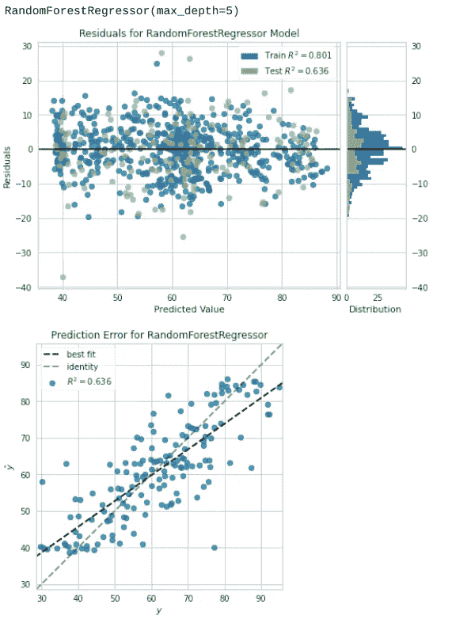
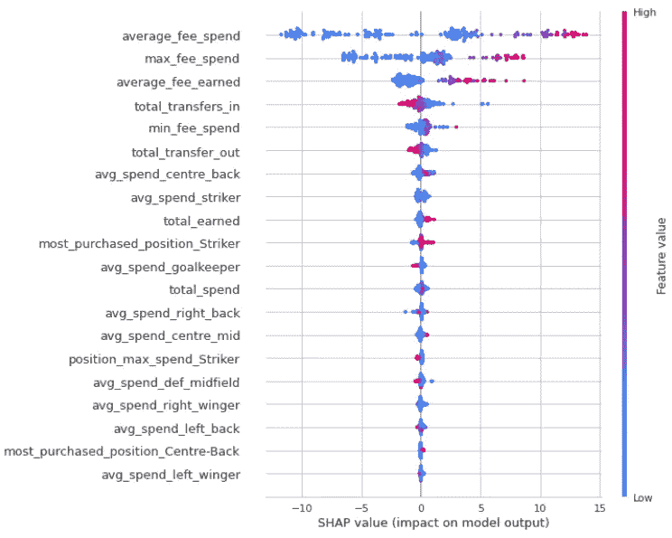
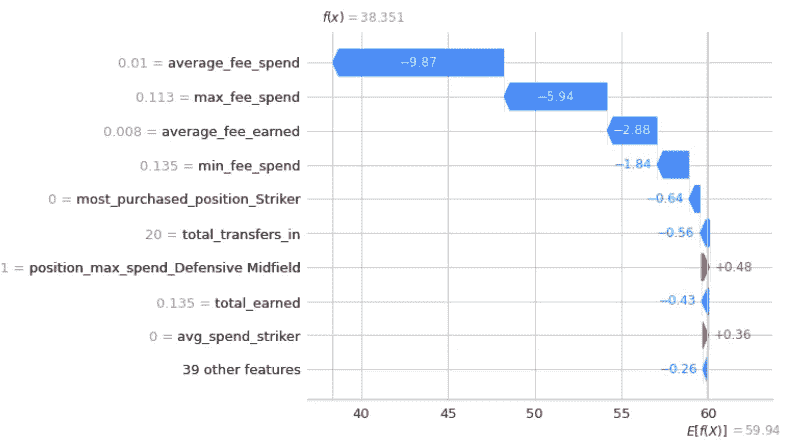
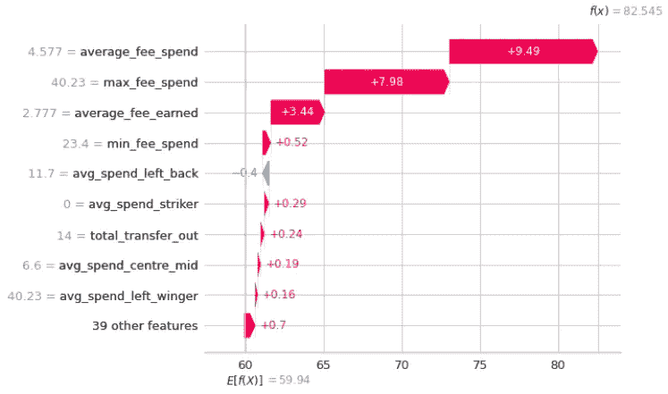

# 预测足球队实力-第二版

> 原文：<https://towardsdatascience.com/predicting-soccer-team-strength-version-ii-11b5c66cf9d8?source=collection_archive---------21----------------------->

## 最好的足球队花费最多的钱(并且平衡他们的账目！)在转会窗口期间


蒂姆·贝彻维斯在 [Unsplash](https://unsplash.com/?utm_source=medium&utm_medium=referral) 上的照片

# 目录

[*简介——亿万富翁的运动*](#2abd)

[*曼城的转会支出*](#d116)

[*SPI 得分&数据来源*](#e435)

[*我的第二次，也是更好的一次，尝试*](#ea08)

[*FuzzyWuzzy &团队名称*](#86c0)

[*黄砖可视化算法*](#8cee)

[*沙普利值为可交代值*](#ae36)

[*结论*](#db7f)

# 介绍

## 如果国际象棋是国王的游戏，足球就是亿万富翁的运动。

2021 年 2 月，年轻的亿万富翁凯里尔·路易斯-德雷福斯购买了桑德兰亚足联的控股权。

桑德兰是英格兰足球中最富传奇色彩的球队之一，拥有 142 年的历史，其球迷群体充满了浪漫的激情，这在纪录片系列*桑德兰直到我死*中得到了最好的体现。他们有多个顶级联赛冠军，但自 20 世纪 30 年代以来没有一个；他们赢得了英格兰足球协会的冠军，但自 20 世纪 70 年代以来还没有。尽管过去几十年很艰难，桑德兰亚足联目前拥有英格兰足球历史上第六多的冠军，仅次于英超联赛中一些最好的球队。

如果他们的早期历史是“光辉岁月”的定义，那么最近几年就是“磨砺”的缩影，一季又一季，除了看守经理的旋转栅门之外，没有什么可展示的。自 2015 年以来，桑德兰亚足联已经有了八位不同的经理，不包括在管理层变动期间介入的助理，他们平均每场执教 36 场比赛。英甲赛季有 46 场比赛。

一个亿万富翁究竟为什么要收购一家在过去几个赛季经历了如此多动荡的俱乐部？因为足球，尽管有着浪漫主义和后来居上的冠军联赛决赛，却是一场资产游戏。有一家俱乐部目前比所有其他俱乐部都“升值”得更好，而且做得很有风格。

# 曼城的转会支出

曼城由阿联酋王室经营的企业集团所有，是全球范围内的顶级俱乐部。在谢赫曼苏尔于 2008 年收购这家俱乐部之前，它并不总是如此，而是一家中游球队。谢赫曼苏尔作为新老板的第一个关键决定是指定资金从其他顶级俱乐部引进高质量的球员，不管俱乐部的收入如何。在前两个赛季，曼城在新球员上花费了近 3.77 亿€。仅在 2010 年，俱乐部就花费了近 1.2 亿€；他们还将球员分流到其他球队，使他们的下一步支出降低到只有€8500 万英镑。

这种在转会窗口投入巨资引进球员的策略已经在价值和奖杯的显著增长上取得了回报。2008 年之前，这家俱乐部每年从€带来 9000 万英镑到€1 亿英镑的收入。仅仅六个赛季，€的收入翻了两番，达到 4 亿多英镑。自 2008 年以来，该队已经赢得了五次英超联赛冠军，两次足总杯冠军，六次 EFL 杯冠军，三次足总社区盾杯冠军。尽管他们在 2020-2021 年进入决赛，但俱乐部唯一没有获得的主要冠军是欧洲冠军联赛冠军。

曼城现在身价 11 亿€，通过在设施、体育场和管理上的投资，尤其是在球员上的投资，已经经历了一次彻底的转变。火车没有减速的迹象。就在上周，俱乐部完成了引进杰克·格里利什的交易，他是维拉队的顶级前锋。费用？近€1.2 亿英镑，这是为英国球员支付的最高金额。

这就引出了我的问题——转会活动对一个团队的实力有多大影响？如果曼城花钱引进球员，并且看到了回报，那么这笔转会支出的哪些方面对他们作为俱乐部的实力最有影响。虽然有很多因素会影响一个球队在球场上的表现，但一个俱乐部的球员肯定有更大的影响。

我以前回答过这个问题，在早期的一个项目中，我在[跳板数据科学](https://www.springboard.com/)赛道上用它作为顶石。点击可查看[中帖原文。](https://medium.com/analytics-vidhya/transfer-windows-predicting-english-premier-league-club-ratings-779b37008353)

# 数据源和 SPI 分数

在第二次尝试中，我使用了相同的数据来源；从 [Ewenme 的仓库](https://github.com/ewenme/transfers) &传送数据，从 [FiveThirtyEight](https://github.com/fivethirtyeight/data/tree/master/soccer-spi) 传送 SPI 团队实力数据。

转会库包括世界各地俱乐部之间的每一次转会，其中有大量关于所涉球员的重要信息——年龄、费用和位置，等等。我选择了从 2016 年到 2020 年的 9 个欧洲顶级联赛。

FiveThirtyEight 的 SPI 得分是使用涉及进球得分和进球对抗的比赛时间数据计算的，可以追溯到 2016 年。这些数据点然后被加权并给出一个分数，该分数用于根据整体实力对团队进行排名。点击阅读更多关于 SPI 分数[的信息。](https://fivethirtyeight.com/methodology/how-our-club-soccer-predictions-work/)

# 足球队实力建模，第二版

在我第一次尝试模拟足球队实力时，我将我的数据局限于过去五个赛季的英超球队。这是我的第一个项目，我很紧张。但在第一次尝试后的几个月里，我对算法有了更多的了解，知道如何解释它们的可预测性，我已经准备好再次尝试了！

对于这个项目的第二个版本，我致力于回到我最初的工作并扩展我的视野。我做了以下事情:

*   我使用了一个更大的数据集，涵盖了欧洲九个职业联赛的五个赛季。这使我的最终数据集从 100 行增加到 700 多行。
*   我使用 FuzzyWuzzy 包来标准化球队和联盟的名字。在我看来，这是一个有意义的改进，我将在下面详细解释。
*   虽然我探索了许多我在第一个版本中使用的相同算法，但我使用了 [Yellowbrick](https://www.scikit-yb.org/en/latest/) 来更好地理解算法显示了什么。
*   我超调了最佳随机森林回归的参数，将我的 R 分数提高了 50%以上，从 0.41 提高到 0.65。
*   我使用 SHAP 值来解释数据集特性对模型的影响，并确定各级团队在制定转移策略时要考虑的重点领域。

我想快速指出的是:我的结论并不完全是革命性的。他们可能已经是每个顶级俱乐部战略的重要组成部分。对于那些试图改善他们的战略，或者试图了解他们在每个赛季的转会窗口中哪里出了问题的俱乐部来说，这里可能有一两个有用的分析。

# 使用 FuzzyWuzzy 来标准化团队名称

当我把其他联赛加入到数据集中时，我害怕这个项目的这一部分。我有两个数据集，每个都有不同的球队命名规则，但是在这个版本的项目中，我有九个联赛的名字，而不仅仅是英超联赛。在版本 I 中，我分别获取每个数据集，根据它们的唯一值创建了一个团队名称字典，并向数据集添加了一个新列，其中包含我在两个数据集上使用的名称的缩写。

**甚至打出解释也比它应该做的要多。**

在版本 II 中，我使用 FuzzyWuzzy 库来标准化名称。我仍然单独处理每个数据集，但是使用这个对我来说新的库比为每个数据集的每个联盟创建单独的字典(或者两个巨大的字典)要容易得多。

对于那些对 FuzzyWuzzy [(文档)](https://pypi.org/project/fuzzywuzzy/)不熟悉的人来说——它接受两个字符串，将它们匹配，并提供一个相似性得分。

例如:

```
Str_A = 'FuzzyWuzzy' solves problems!'
Str_B = 'fuzzy wuzzy solves PROBLEMS.'ratio = fuzz.ratio(Str_A.lower(), Str_B.lower())
print('Similarity score: {}'.format(ratio))
```

这将返回 95 的相似性分数。

除了使用`ratio()`函数之外，FuzzyWuzzy 还使用函数来标记字符串并在运行之前操作它们。使用 FuzzyWuzzy ，我创建了一个函数来比较我的每个数据集中的团队名称，使用其中一个作为基本名称，另一个作为比较，并根据比率分数来标准化它们。它返回了一个字典，我用它来替换两个数据集中的团队名称，而且比我解决这个问题的版本 1 快得多！

# 使用黄砖来可视化算法

在每个项目的 EDA 步骤中，我都有用于可视化数据的自定义函数，但是我真的很想看看这个模型告诉我关于测试算法的什么信息。YellowBrick 为用户提供了一系列看似无穷无尽的可视化效果，我建议查看该项目的[文档](https://www.scikit-yb.org/en/latest/)。

我保持事情相当简单，并使用残差图和预测误差图来可视化每个算法。



使用黄砖绘制残差图和精度误差图——来自我的 Jupyter 笔记本

# 解释可预测性的 Shapley 值

我以前用过沙普利值，SHAP 项目是我探索过的最有趣的项目之一。构建`shap`库的优秀人员非常聪明，他们开发了代码，使用博弈论概念以清晰、有意义的方式解释特性的重要性。

几个例子向您展示 shap 库可以做什么。

首先，看一下蜂群图，它显示了每个特性的值对模型的影响。在我的项目中，最有影响力的特征是`average_fee_spend`，一个足球队在每个转会窗口花费在俱乐部转会上的平均金额。蜜蜂群显示的是，虽然平均费用支出具有很高的影响力，但当他们的平均费用支出非常高时，这是最积极的影响，可以提高团队的实力。



SHAP 重视蜂群图——来自我的笔记本

**有趣的是**，如果你向下看图表中`total_transfers_in`和`total_transfer_out`处的一些特征，你会发现这些特征的高值对团队的实力有更负面的影响。大量的转会活动，无论是进是出，对俱乐部都没有好处。将他们的努力集中在每个赛季内外人数较少的球员身上，对他们的赛季实力有更有利的影响。我想不出比这更清楚的图表了，对于机器学习和预测分析的新手来说，`shap`蜂群图非常有帮助。

这里有两个非常酷的 shap 可视化，显示了每个特性的价值对特定团队实力的影响。



从我的 Jupyter 笔记本来看，在转会窗口期间花费的非常低的平均费用对这支球队的实力产生了显著的负面影响

**要了解这个瀑布**，先看看右下角。根据最终的随机森林模型，`E[f(x)]`是数据集的基准强度得分。在图表的左侧，您可以看到该特定团队在特定赛季中各项功能的价值。在这种情况下，俱乐部在转会上花费的极低的平均费用产生了巨大的负面影响，从基线实力得分降低了近 10 分。他们也没有在任何一个球员身上花费太多，这对他们的实力有另一个很大的负面影响。

这是一支更强的队伍。



更高的平均费用支出，大约 450 万欧元，导致这支球队的实力增加了近 10 个百分点——从我的 Jupyter 笔记本上看

很容易看到平均花费很多和在单个球员身上花费很多对球队整体实力的积极影响。仅这两个特征值就让这支队伍的实力提高了 17 分以上！

# 结论

*   首先，返工以前的项目是非常有趣的，尤其是在尝试新的库、新的算法和新的技术的时候。
*   第二，球队每个赛季都可以通过平均多花钱，单个球员多花钱来提升实力。
*   第三，总的来说，虽然花钱对球队的实力有很大的增加，但通过交易球员来赚钱也是如此。如果一个俱乐部不能花很多钱，他们应该努力赚很多钱。这在很大程度上是南安普顿留在英超联赛的原因。
*   第四，如果我再次尝试这个项目(我会的，因为我喜欢它)，我会选择一些影响较小的功能，看看我是否能消除一些噪音。
*   第五，Kyril Louis-Dreyfus 正在执掌一家需要重新启动的传奇俱乐部，如果他能够用足够的自有资金进行转会，他可能会看到这家俱乐部重返荣耀，并提高其整体价值。

如果你做到了这一步，非常感谢你的阅读。检查一下[整个库](https://github.com/tdraths/spi_transfers_global)，看看[我的网站](https://tdraths.github.io/)上我参与的其他项目。如果你对这个分析有任何补充，或者注意到我犯的任何错误，请告诉我。如果你拥有一支足球队，准备好在夏季转会窗口上花大钱吧！

[汤姆的 Github](https://github.com/tdraths)