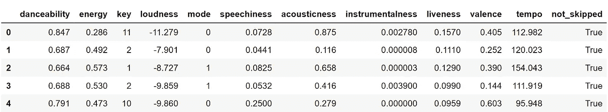
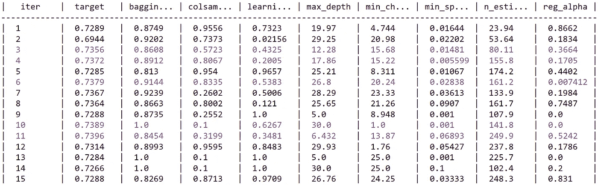

# 预测 Spotify 上的歌曲跳过

> 原文：<https://towardsdatascience.com/predicting-song-skipping-on-spotify-eb5bfbae4c0b?source=collection_archive---------52----------------------->

## 使用 LightGMB 仅基于音频特征来预测我的歌曲跳过习惯

图片由 https://unsplash.com/@omidarmin**奥米德阿明**T2 拍摄

# 介绍

2019 年初，Spotify 分享了关于他们平台的有趣统计数据。在该服务的 3500 多万首歌曲中，Spotify 用户创建了超过 20 亿个播放列表(Oskar Stå，2019)。我想到了一个类比，我们的音乐品味就像我们的 DNA，在 70 亿人中非常不同，但构建模块(核苷酸/歌曲)是相同的。因此，推断用户的音乐品味颇具挑战性，主要是因为 Spotify 的商业模式依赖于其推荐新歌的能力。

# 问题陈述

Spotify 没有不喜欢按钮，所以跳过歌曲是我们需要从中学习来推断音乐品味的微妙线索。在这个项目中，我使用我在 2019 年的 Spotify 流媒体历史来建立一个预测模型，该模型可以预测我是否会仅根据他们的音频特征跳过一首歌。

[*您可以按照以下步骤请求自己的 Spotify 流媒体历史记录*](https://support.spotify.com/us/article/data-rights-and-privacy-settings/)

# 数据描述

在请求我的 Spotify 数据后，我收到了一封电子邮件，其中有一个 ZIP 文件，包含我在 2019 年听的每首歌，艺术家的名字和流媒体时长。数据处理如下:

1.  我过滤掉播客，只分析歌曲。
2.  我使用 Spotify API 提取歌曲的唯一 id 及其音频特征。
3.  我计算了我播放歌曲的时长和歌曲长度之间的差距。如果间隔超过 60 秒，那么我将推断该歌曲已经被跳过。

下面是这些步骤的详细 python 实现

因为声明是为了寻找是否只有音频特征可以通知我们跳过歌曲，所以我删除了包含歌曲标题和艺术家的列。

最终数据集包含以下各列:

# 假设

建模的一个关键步骤是列出所有的假设和限制，以便正确地解释结果。一些假设源于数据收集过程，另一些则是建模过程的一部分:

*   用户的音乐品味是同质的，即，引导用户跳过歌曲的机制在时间上是静态的。
*   歌曲被分解成音频特征，因此歌词不被解释为自然语言文本。考虑这种限制是很重要的，因为歌词的含义可能是跳过歌曲的一个强有力的预测因素。

# 建模

我使用 LightGBM 二进制分类，仅基于音频特征来推断我的跳歌习惯。

混淆矩阵

# 贝叶斯优化

LightGBM 包含许多参数，因此，我没有遍历所有可能的值，而是使用贝叶斯优化进行超参数调优

# 结果和讨论

该模型对个性化数据的性能更好，准确率为 74.17%(贝叶斯优化的第 28 次迭代)。Spotify 用户同质的假设是一个强有力的假设，如果我们收集更多的用户级细节，性能可以得到改善。

总的来说，推荐引擎既需要对用户的个性化学习，也需要对歌曲的一般性学习。在这个项目中，我实验了仅使用音频特征、音频和用户特征以及我个人的收听历史的机器学习分类。进一步的调查可能包括协变量之间的因果关系，因为理解数据生成的机制可能比曲线拟合更能提供信息。

 [## Taha ha7/Spotify _ Skip _ Prediction

### 使用 LightGMB 预测我的歌曲预测习惯仅基于音频功能 Permalink 无法加载最新…

github.com](https://github.com/Tahahaha7/Spotify_Skip_Prediction) 

# 参考

*   奥斯卡·斯托尔(2019 年)。Spotify 上的音乐推荐。北欧数据科学和机器学习峰会。检索自:[https://youtu.be/2VvM98flwq0](https://youtu.be/2VvM98flwq0)
*   布莱恩·布鲁斯特、里沙布·梅赫罗特拉和特里斯坦·杰汉。2019.音乐流会话数据集。在 2019 年 5 月 13 日至 17 日在美国加利福尼亚州旧金山举行的 2019 年万维网大会(WWW '19)的会议录中。美国纽约州纽约市 ACM，7 页。https://doi.org/10.1145/3308558.3313641