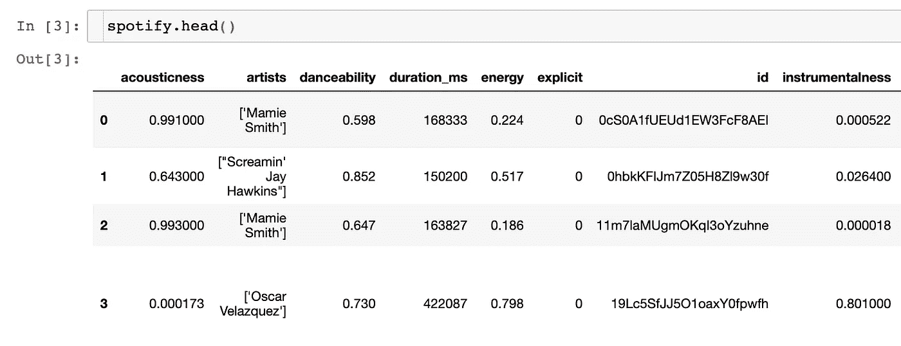
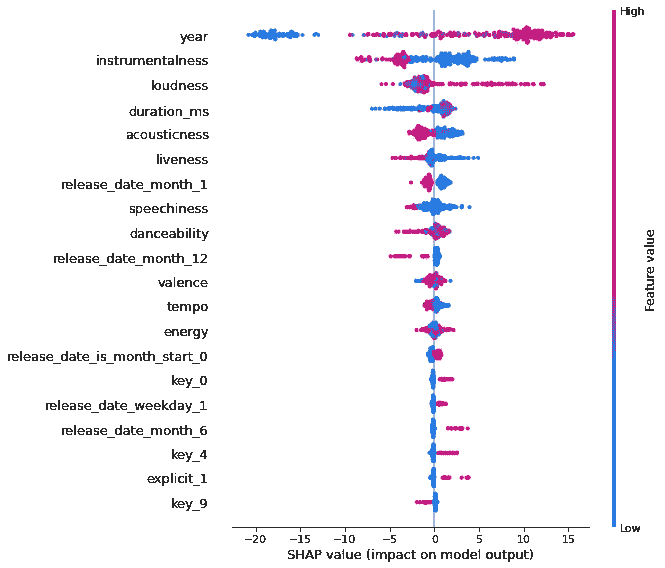
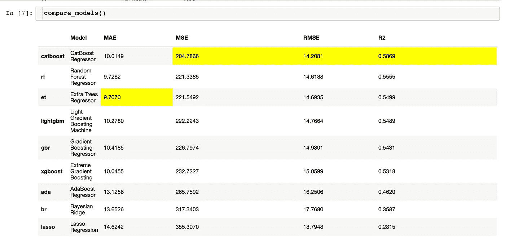
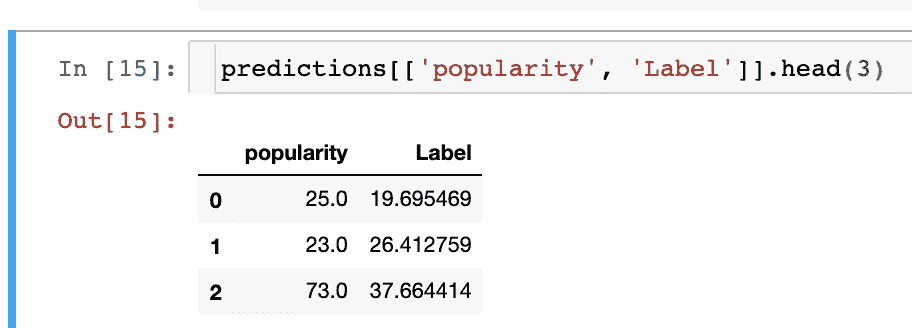

# 预测 Spotify 歌曲的受欢迎程度

> 原文：<https://towardsdatascience.com/predicting-spotify-song-popularity-49d000f254c7?source=collection_archive---------16----------------------->

## 意见

## 使用 PyCaret 对每个机器学习算法进行排序，以建立最佳数据科学模型。


Cezar Sampaio 在[Unsplash](https://unsplash.com/s/photos/spotify?utm_source=unsplash&utm_medium=referral&utm_content=creditCopyText)【1】上拍摄的照片。

# 目录

1.  介绍
2.  模型比较
3.  摘要
4.  参考

# 介绍

因为 Spotify 和其他音乐流媒体服务非常受欢迎，并且被广泛使用，所以我想将数据科学技术和机器学习算法应用到该产品中，以预测歌曲的受欢迎程度。我个人使用这个产品，我在这里应用的也可以应用于其他服务。我将检查每一种流行的机器学习算法，并根据成功的衡量标准或标准选择最佳算法——通常，这是某种计算误差。所开发的最佳模型的目标是基于各种特征当前和历史特征来预测歌曲的流行度。如果你想学习如何使用数据科学来预测一首歌曲的流行程度，请继续阅读。

# 模型比较


照片由[马库斯·斯皮斯克](https://unsplash.com/@markusspiske?utm_source=unsplash&utm_medium=referral&utm_content=creditCopyText)在[Unsplash](https://unsplash.com/s/photos/carrot?utm_source=unsplash&utm_medium=referral&utm_content=creditCopyText)【2】上拍摄。

我将讨论我使用的 Python 库，以及下面的数据、参数、比较的模型、结果和代码。

# 图书馆

使用[py caret](https://pycaret.org/)【3】的力量，你现在可以测试每一个流行的机器学习算法彼此之间的对比(至少*或更多)。对于这个问题，我将比较 MAE、MSE、RMSE、R2、RMSLE、MAPE 和 TT(Sec)——完成模型所需的时间。正如开发人员所说，总体来说，使用 PyCaret 的一些好处是提高了生产率、易用性和业务就绪性——所有这些我都可以亲自证明。*

# 数据

我正在使用的数据集[来自 Kaggle。可以方便快捷的下载。它由 17MB 和 Spotify 从 1921 年到 2020 年的数据组成，包括 16 万多首歌曲。它由`174,389`行和`19`列组成。下面是前几行和前几列的屏幕截图:](https://www.kaggle.com/yamaerenay/spotify-dataset-19212020-160k-tracks)



数据样本。作者截图[5]。

> *列:*

在我们最终选择了最佳模型之后，我们可以看看最重要的特性。我正在使用 PyCaret 的`interpret_model()`功能，它基于流行的 SHAP 库。以下是所有可能的功能:

```
['acousticness',
 'artists',
 'danceability',
 'duration_ms',
 'energy',
 'explicit',
 'id',
 'instrumentalness',
 'key',
 'liveness',
 'loudness',
 'mode',
 'name',
 'popularity',
 'release_date',
 'speechiness',
 'tempo',
 'valence',
 'year']
```

> 以下是使用 SHAP 最重要的功能:



SHAP 很重要。作者截图[6]。

所有的列都被用作特性，除了目标变量，它是列`popularity`。如你所见，前三个特征是年份、乐器性和音量。作为未来的改进，最好是将分类特征分成一列，而不是几十列，然后作为下一步，将分类特征输入到 CatBoost 模型中，以便可以应用目标编码而不是一热编码——为了执行此操作，我们将确认或更改`key`列为分类列，并用于任何其他类似的列。

# 因素

这些是我在 PyCaret 的`setup()`中使用的参数。机器学习问题是一个回归问题，包括来自 Spotify 的数据，其中`target`变量是`popularity`字段。为了重现性，可以建立一个`session_id`。还有很多参数，但这些是我使用的参数，PyCaret 在自动检测数据信息方面做得很好——比如挑选哪些特征是分类的，它会在`setup()`中与您确认这一点。

# 比较的型号

我将比较 19 种机器学习算法，有些非常流行，而有些我实际上没有听说过，所以看看哪个在这个数据集上胜出会很有趣。对于成功标准，我比较了 PyCaret 自动排名的所有指标 MAE、MSE、RMSE、R2、RMSLE、MAPE 和 TT (Sec)。

> *这里是我比较过的所有型号:*

*   线性回归
*   套索回归
*   里脊回归
*   弹性网
*   正交匹配追踪
*   贝叶斯岭
*   梯度推进回归器
*   极端梯度推进
*   随机森林回归量
*   决策树回归器
*   CatBoost 回归器
*   光梯度推进机
*   额外树回归量
*   AdaBoost 回归器
*   k 邻居回归量
*   拉索最小角度回归
*   胡伯回归量
*   消极进取回归者
*   最小角度回归

# 结果

需要注意的是，我只是使用了数据的一个样本，所以如果你自己测试这个代码，使用所有的数据，这些算法的顺序可能会重新排列。我只使用了`1,000`行，而不是全部的`~170,000`行。

可以看到，`CatBoost`名列第一，拥有最好的 RMSE、RMSE、R2。然而，它没有最好的 MAE、RMSLE 和 MAPE，也不是最快的。因此，您应该根据这些指标来确定成功的含义。例如，如果时间很重要，那么你会希望排名更高，或者如果 MAE 更高，你可能会选择`Extra Trees Regressor`来获胜。



车型对比。作者截图[7]。

总的来说，你可以看到，即使只有很小的数据集样本，我们也做得很好。`popularity`目标变量的范围是 0 到 91。因此，以 MAE 为例，我们的平均误差是 9.7 个流行度单位。考虑到我们平均最多只差 10 分，91 分中这还不算太坏。然而，训练算法的方式可能不会很好地推广，因为我们只是使用一个样本，所以你可以预期所有的误差指标会显著减少(*这是好的*)，但不幸的是，你会看到训练时间急剧增加。

PyCaret 的一个巧妙特性是，您可以在`compare_models()`训练中删除算法——我会从数据集的一个小样本开始，然后查看哪些算法通常需要更长时间，然后在您与所有原始数据进行比较时删除这些算法，因为其中一些可能需要几个小时来训练，这取决于数据集。

在下面的截图中，我打印了带有预测值和实际值的数据框。比如我们可以看到`popularity`或*原*与`Label`并排比较，就是*预测*。你可以看到一些预测比其他的更好。最后一个预测相当差，而前两个预测很棒。



预测。作者截图[8]。

# 密码

以下是 Python 代码，您可以尝试通过导入库、读入数据、对数据进行采样(*仅当您需要*时)、设置回归、比较模型、创建最终模型、进行预测以及可视化要素重要性来测试自己[9]:

```
# import libraries
from pycaret.regression import *
import pandas as pd# read in your stock data
spotify = pd.read_csv(‘file location of your data on your computer.csv’)# using a sample of the dataset (you can use any amount)
spotify_sample = spotify.sample(1000)# setup your regression parameters 
regression = setup(data = spotify_sample, 
 target = ‘popularity’,
 session_id = 100, 
 )# compare models
compare_models()# create a model
catboost = create_model('catboost')# predict on test set
predictions = predict_model(catboost)# interpreting model
interpret_model(catboost)
```

# 摘要


照片由[布鲁斯·马尔斯](https://unsplash.com/@brucemars?utm_source=unsplash&utm_medium=referral&utm_content=creditCopyText)在[Unsplash](https://unsplash.com/s/photos/song?utm_source=unsplash&utm_medium=referral&utm_content=creditCopyText)【10】上拍摄。

使用数据科学模型来预测一个变量可能会非常困难，但我们已经看到了如何通过几行代码来有效地比较几种机器学习算法。我们还展示了设置不同类型的数据是多么容易，包括数字和分类数据。在接下来的步骤中，我将把它应用到整个数据集，确认数据类型，确保删除不准确的模型，以及训练时间过长的模型。

> 总之，我们现在知道如何执行以下操作来确定歌曲流行度:

```
import librariesread in datasetup your modelcompare modelspick and create the best modelpredict using the best modelintepret feature importance
```

我要感谢和钦佩 [Moez Ali](https://medium.com/u/fba05660b60f?source=post_page-----49d000f254c7--------------------------------) 开发了这个令人敬畏的数据科学库。

我希望你觉得我的文章既有趣又有用。如果您将这个库应用于数据集或者使用了其他技术，请在下面随意评论。你更喜欢哪一个？你对自动数据科学有什么看法？

我与这些公司都没有关系。

> 请随时查看我的个人资料和其他文章，也可以通过 LinkedIn 联系我。

# 参考

[1]照片由 [Cezar Sampaio](https://unsplash.com/@cezarsmpio?utm_source=unsplash&utm_medium=referral&utm_content=creditCopyText) 在[Unsplash](https://unsplash.com/s/photos/spotify?utm_source=unsplash&utm_medium=referral&utm_content=creditCopyText)(2020)上拍摄

[2]马库斯·斯皮斯克在 Unsplash 上拍摄的照片(2020 年)

[3] [Moez Ali](https://medium.com/u/fba05660b60f?source=post_page-----f2ddc06a0d91--------------------------------) ，PyCaret，(2021)

[4] Yamac Eren Ay on Kaggle， [Spotify 数据集](https://www.kaggle.com/yamaerenay/spotify-dataset-19212020-160k-tracks)，(2021)

[5] M.Przybyla，数据框架截图，(2021 年)

[6] M.Przybyla，SHAP 特征重要性截图，(2021)

[7] M.Przybyla，模型对比截图，(2021 年)

[8] M.Przybyla，预测截图，(2021 年)

[9] M.Przybyla，Python 代码，(2021 年)

[10]布鲁斯·马斯在 [Unsplash](https://unsplash.com/s/photos/song?utm_source=unsplash&utm_medium=referral&utm_content=creditCopyText) 上拍摄的照片，(2018)