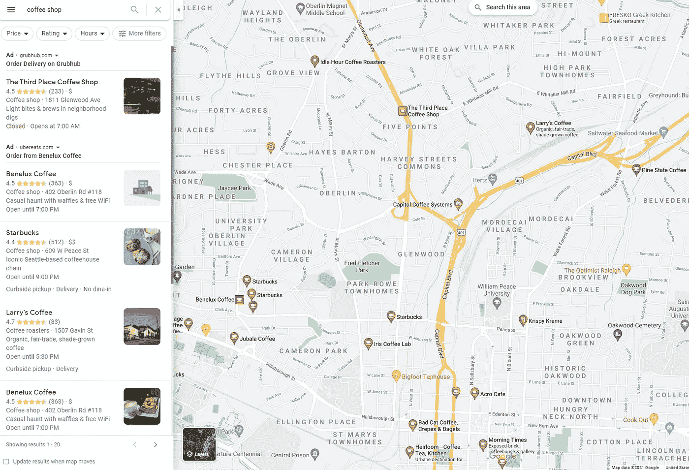
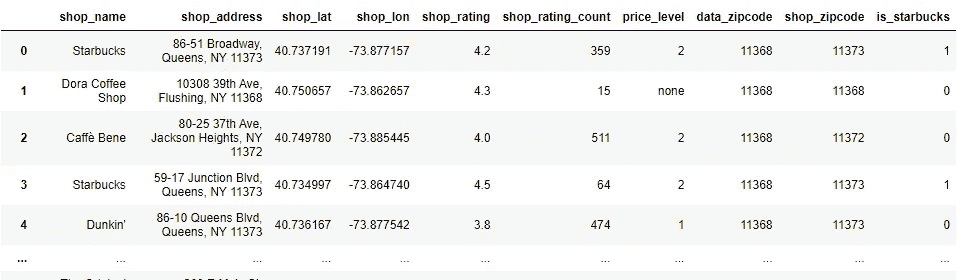
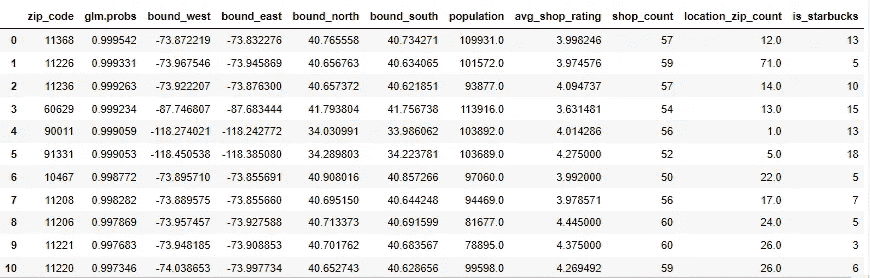
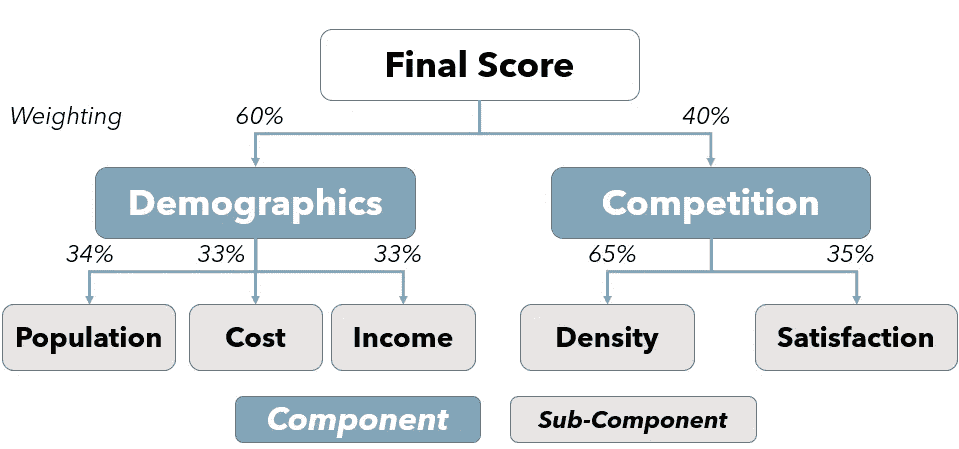
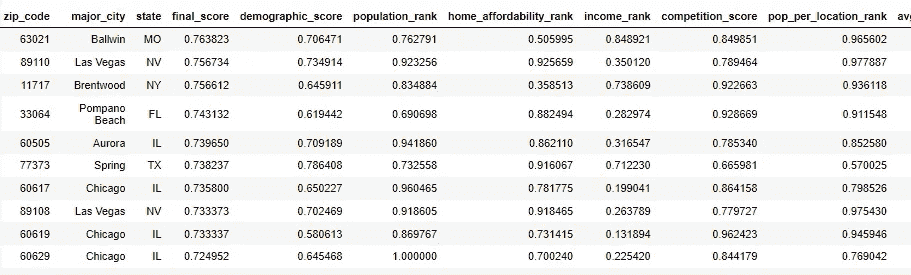
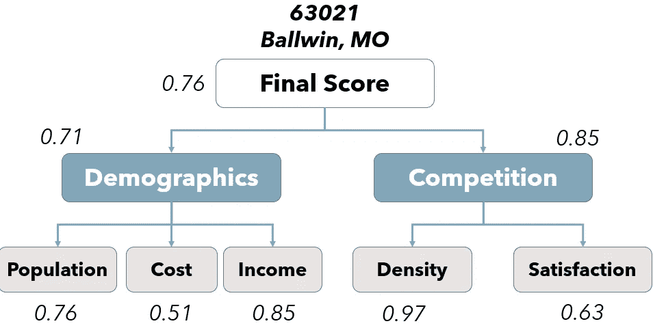
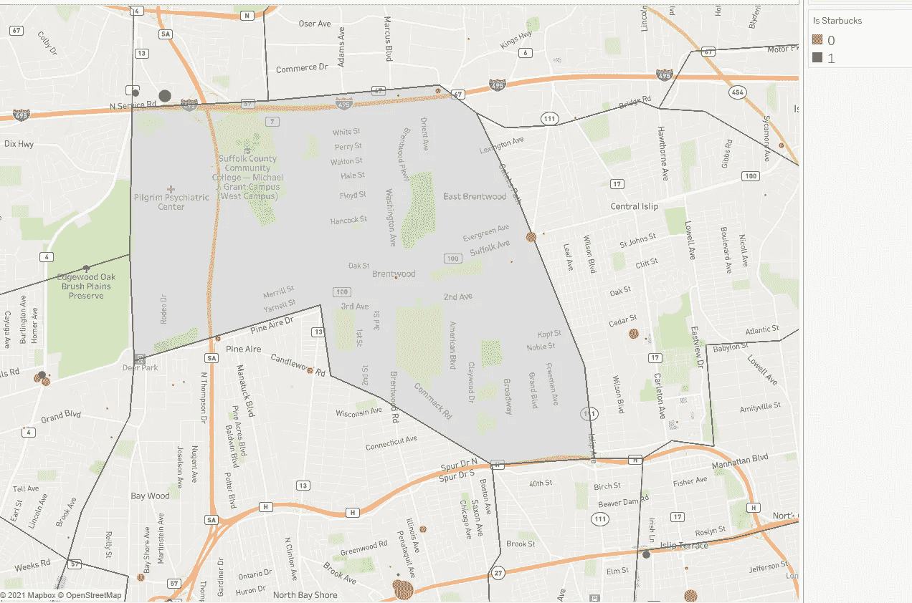
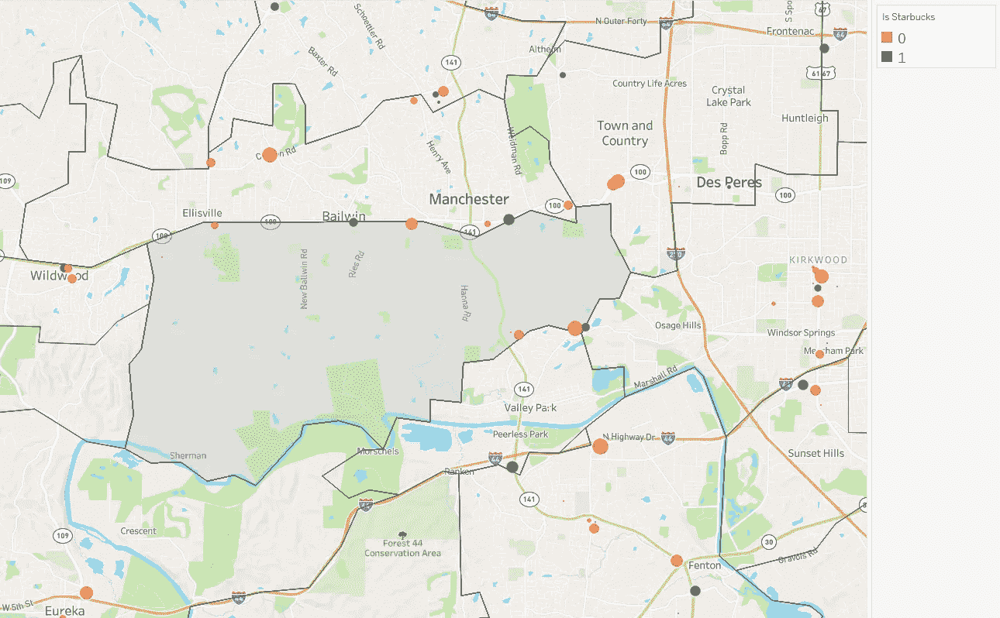

# 预测星巴克的选址策略:第二部分

> 原文：<https://towardsdatascience.com/predicting-starbucks-location-strategy-part-2-c8803008f42c?source=collection_archive---------19----------------------->

## 改进对完美星巴克位置的搜索

图片由作者提供；北卡罗来纳州夏洛特

在我写的所有文章中，最受欢迎的是一篇关于分析和预测星巴克选址策略的文章。在这篇文章中，我讨论了数据驱动框架选择新位置的两种可能方法。这篇文章的关键是确定企业目标市场的构成，并寻找与该构成相匹配的领域。我们可以使用来自业务相关人员的反馈进行定性分析(“我们希望目标人群大于…且收入大于…”或者当有足够的样本量进行分析时进行定量分析(例如找到与星巴克门店位置相关的人口统计数据)。

自从发表了这篇文章，我已经和一些企业家一起工作，并且改进了最初提出的方法。一种方法是从静态的 R 视觉过渡到交互式的动态 Tableau 仪表板。在本文中，我写了关于方法[的更多细节。](/creating-a-data-driven-retail-expansion-framework-2229fef33a17)

在这项工作的基础上，最近的另一项改进是引入了一种强有力的竞争观。在关于我如何在一家初创公司使用星巴克定位框架的对话中，我发现了如何有效地使用 [Google Places API](https://developers.google.com/maps/documentation/places/web-service/overview) 。我们可以像使用谷歌地图搜索一样使用 API。

例如，假设我们在北卡罗来纳州罗利市中心，想喝咖啡。我们可以去谷歌地图，移动地图到我们想要的地方，然后搜索“咖啡店”得到下面的结果。我们将看到所有当地的咖啡店以及一些关于它们的识别信息。

作者图片

有了 Google Places API，我们可以做同样的事情。我们可以通过纬度和经度来定义我们的搜索区域，输入一个搜索词，几个附加参数，然后根据这些参数得到一组结果。使用最初 Starbucks 分析的工作，我将在此基础上展示如何添加竞争组件来扩展和改进工作的第一个版本。

作为演示这种方法的一个例子，我选取了大约 500 个最有可能有星巴克的邮政编码——但在分析时没有——并提取这些邮政编码及其周围的竞争对手信息。本文的其余部分将详细说明我们可以检索哪些信息，以及如何将其用于位置扩展机会。

# 提高位置分析的竞争

请继续关注未来关于如何使用 Google API 的文章([现在可以在这里找到](https://jordanbean.medium.com/how-to-use-the-google-places-api-for-location-analysis-and-more-17e48f8f25b1)！)，但首先让我们讨论一下我们可以通过这种新方法收集的数据，以及我们如何使用它来改进我们的位置模型。

从上面提到的大约 500 个邮政编码开始，在只过滤了超过 10，000 个居民的邮政编码后，我使用 **uszipcode** Python 包收集了纬度/经度坐标边界。我使用这些边界实现了一个网格搜索，使用搜索词“咖啡店”从 Google API 系统地收集数据，并存储了名称、地址、坐标、价格水平、Google 星级和评论数量。

可以从 Google Places API 中提取的数据示例；作者图片

精细竞争信息的加入为位置分析工作增加了一个令人兴奋的维度。从这里开始，我们有几种方法可以使用这些数据来改进我们的位置分析。我们可以看到有多少家咖啡店在紧邻的邮政编码区内，也可以看到有多少家在周围的邮政编码区内(API 搜索的范围是距离邮政编码区边界约 1.25 英里的半径)，这是针对人口进行的归一化处理。

我们可以计算邮政编码中的平均商店评级，作为客户满意度的代表(越低=机会越多)，或者附近是否已经有星巴克。我们可以通过筛选具有相同价格水平的商店来考虑同类竞争。最后，我们可以将数据放到地图上，检查哪里可能有机会。

最终，对于这个项目，我制作了一个数据框，其中每个邮政编码占一行，还有几个与该邮政编码相关的特征，我们将在下一节讨论。

一个输出数据集的示例，用于按邮政编码进行的竞争；作者图片

# **创建计分算法**

汇集所有相关数据点的一种方法是建立一个自下而上的评分算法，其中每个组件都是下一个组件的构建块。为此，我们首先定义总体评分类别(组件)，如人口统计、竞争或经济活动。然后，我们找到可以组成该类别的子组件。我们将每个子组件列从其值转换为其百分位数，以将输出标准化到一个标度上。

作为子组件的一个例子，对于人口统计，我们可以考虑像人口规模或收入这样的信息。对于经济活动，我们可以寻找办公人员的数量或商业建筑的分区。对于竞争，我们可以考虑竞争密度或客户满意度。每个子组件成为该组件的加权输入，并且该组件成为最终分数的加权输入。

组件和子组件由业务和对其成功重要的因素来指导。咖啡店要取得成功，需要具备的条件与目标大不相同，这种方法可以灵活地适应每个用例。

考虑下面的例子，我们可以用在星巴克。我们有两个对一个地方的成功很重要的因素——人口统计和竞争。对于人口统计，我们有 3 个子成分(大致)权重相等。对于竞争，我们有两个重量不等的子组件。然后，对于我们的最终得分，我们给予人口统计比竞争更高的权重。

加权评分算法如何工作的示例；作者图片

权重的分配可以基于管理知识、直觉或其他适合情况的因素。这种方法的好处之一是，当我们获得更多信息时，我们可以调整权重。

实际上，上图所说的是，对一家星巴克店的成功来说，重要的是人口因素和竞争因素。人口因素是人口规模(高目标市场)、低生活成本(因此租金成本较低)和高收入(买得起高端产品)。在图表的另一边，保持低竞争密度和对当前产品的低满意度也很重要。

这种方法的另一个重要好处是它对外部受众来说是高度可解释的。最终得分在 0 到 1 之间，越高越好。我们可以参考组件分数来了解它们在分数上的差异，然后参考子组件分数来查看哪些是最高的影响。我们可以通过图表的每个分支来了解最终得分是如何计算的，它包含哪些组件，以及组成每个组件的子组件。

下面是一个基于这种方法的新得分表的示例，以及一个单独邮政编码及其组成部分得分的示例。我们可以看到组件/子组件细分如何向我们显示它具有比人口统计更有利的竞争分数，以及低密度(导致高/有利分数)是高竞争分数的驱动因素。

具有组件和子组件分数的最终数据集的示例；作者图片

排名靠前的邮政编码的评分组件示例；作者图片

# 采取下一步行动

我们可以将评分和位置映射结合起来，获得竞争对手所在位置(除了现有星巴克门店之外)的详细信息，以及这将如何影响我们的战略。

我们将考虑下面的两个例子，看看我们如何将这项工作付诸实践。首先，我们来看一个得分最高的邮政编码，11717，位于纽约市东部的长岛。

在下面的地图中，灰色阴影区域是邮政编码的边界，而其他边界表示附近的邮政编码。每个点都是由 Google Places API 标记的咖啡店。绿色点代表当前星巴克的位置，橙色/红色点代表所有其他咖啡店。气泡的大小代表评论的数量(即最受欢迎/最知名的商店)。

纽约市外邮政编码 11717 附近的咖啡店；作者图片

对我来说，有趣的是，在每个边界(左上、左下、右下)之外有多个星巴克位置，但中间没有。尽管另一个国家咖啡品牌 Dunkin 在邮政编码区或附近有多个地点。这可能代表在阴影区域右侧中间增加一个位置的潜在机会。

作为另一个例子，我们将看看排名第一的邮政编码，63021。这个地方是密苏里州圣路易斯的郊区。

密苏里州圣路易斯郊区 63021 附近的咖啡店活动；作者图片

在这里，我注意到的是，在邮政编码的尖端有多个星巴克的位置。然而，我们看到很少，如果有的话，位于邮政编码(任何咖啡店)，这表明该地区可能被划分为仅用于居住目的。因此，虽然它具有诱人的人口结构和竞争，但缺乏竞争可能是因为缺乏任何可用的商业房地产，这抑制了我们在那里的增长能力。

在这一点上，评估位置的过程变得更加手动，但是我们缩小到特定关注区域的能力将我们的时间集中在最有价值的区域。这种方法不能告诉企业具体的街道位置，但它可以告诉人们在哪里花时间寻找正确的位置。

# 结论

对我来说，一个有趣的发现是，虽然在最初的分析中，这个项目分析的邮政编码中没有星巴克，但是所有的邮政编码在大约 2 英里的范围内至少有*2 家星巴克。这表明，至少在某种程度上，这种方法正在产生与他们内部考虑位置选择的方式相似的结果。*

下一步，我们可以构建经济活动因素，如邮政编码中的工作/工人数量(可能会在早上上班的路上经过)或大学的存在。同样，我们可以搜索分区记录，以过滤出商业分区低或没有商业分区的位置，从而消除我们在法律上无法运营的区域。我们还可以做更多的工作来调查附近商店的存在以及从现有商店的销售中蚕食的可能性。

选址既是科学也是艺术。最终，分析可以帮助我们找到一个有限的位置，然后我们可以依靠当地的专业知识，在这些范围内找到手头业务的最佳位置。

*有兴趣了解这些主题的更多信息或联系讨论吗？在 jordan@jordanbean.com 给我发邮件或者在 LinkedIn* *上联系我* [*。*](https://www.linkedin.com/in/jordanbean/)