# 用球模拟模型预测 T20 板球比赛

> 原文：<https://towardsdatascience.com/predicting-t20-cricket-matches-with-a-ball-simulation-model-1e9cae5dea22?source=collection_archive---------18----------------------->

这是观看大量板球比赛的季节，我又一次不得不这样做了。没错，每年夏天我都会一头扎进休息室，观察大约 700 万个小时我最喜欢的运动，但去年我决定在休息时间花些时间研究一个预测模型。体育建模是我的激情所在，实际上是最初让我对数据科学感兴趣的入门药物。过去，我曾训练模型预测橄榄球比赛、网球比赛和赛马的结果，甚至在预测澳大利亚网球公开赛的数据科学竞赛中获得了一等奖。

我这个项目的主要目标不是构建有史以来最精确的算法(尽管那样会很好),而是用一种概率性的、自下而上的建模方法进行实验。我没有试图根据历史数据预测比赛结果，而是训练了一个神经网络模型来预测单个球的结果，然后建立了一个定制的蒙特卡洛模拟引擎来生成数万种可能的游戏。


图片由内森·萨阿德拍摄。

# 数据

在这个项目中，我使用了涉及 2255 名球员的 3651 场 T20 比赛中的 677291 个球的数据。比赛在 2003 年和 2020 年之间举行，来自以下 7 个联赛:

*   印度超级联赛
*   大狂欢联盟(澳大利亚)
*   加勒比超级联赛
*   T20 爆炸(英格兰)
*   Mzansi 超级联赛(南非)
*   巴基斯坦超级联赛
*   孟加拉超级联赛

不幸的是，我不能分享这个项目的数据源，因为我利用了我的个人体育数据库，但这种数据很容易公开找到。下面是我的起始表中的一些示例，用来说明我正在处理的数据类型(没有显示所有的列)。

***搭配***

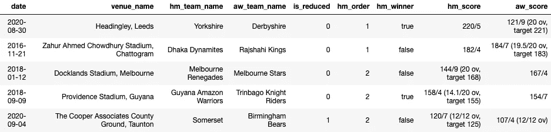

图片由 Andrew Kuo 提供。

***玩家***

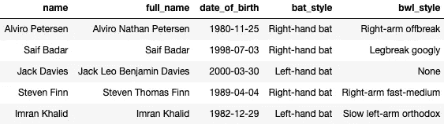

图片由 Andrew Kuo 提供。

***球员比赛统计***

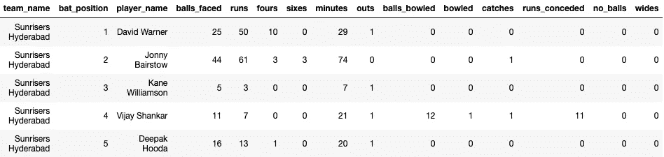

图片由 Andrew Kuo 提供。

***解说***

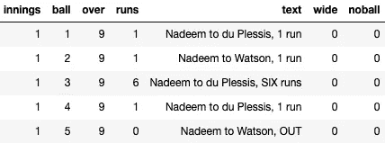

图片由 Andrew Kuo 提供。

# 方法

## 基本原理

对于这个项目，我决定使用自下而上的方法，通过训练一个模型来预测每个投球的结果(而不是整个比赛结果)。我的理由如下:

*   面对面的战斗是板球的关键部分，这种方法让我能够捕捉到击球手和投球手之间的比赛。
*   板球比赛往往由几个关键时刻决定，一个球的结果会对结果产生巨大影响。一个好球或坏球之间的差异可能只有几厘米(例如，在边界上接球与清理六分钟的绳子)，但通过模拟数千次比赛，我们可以从概率上接近这些事件。
*   它允许我们回答更复杂的问题(例如，谁可能在比赛中进最多的三柱门)。传统的自上而下模型只能对其接受训练的特定任务做出预测(例如，谁将赢得给定的比赛)。
*   我们可以得到结果的条件概率，例如钦奈超级国王队获胜的概率，假设他们首先击球并获得 167 分，或者如果克里斯·林恩得分少于 20 分，布里斯班热火队获胜的概率。

## 球预测模型

这个项目的核心是我的球预测模型，它是在我的数据集中的大约 700k 个球上训练的。这是一个多类别分类问题，为了简单起见，我将类别(一个球的可能结果)限制为 8 个选项(0，1，2，3，4，6，Wicket，Wide)。模型的输入是:

*   比赛状态(局数、结束、跑垒次数、三柱门数、相关的第一局得分)
*   投球手统计(投球手投出的所有球的历史得分分布)
*   击球手统计(击球手面对的所有球的历史分布)

该模型的输出是 8 个可能的球结果中每一个的预测概率。在模拟阶段，我们通过模型运行每个球的输入，然后从预测的概率分布中取样。

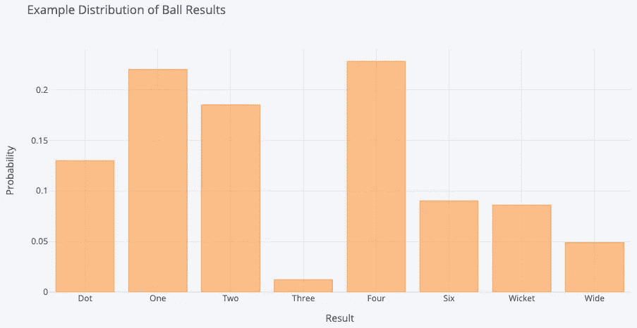

图片由 Andrew Kuo 提供。

我不会在这里过多地讨论模型选择和超参数优化的细节，因为这不是本文的重点，但是我已经在下面列出了我的最终模型的 Keras 总结。简而言之，我训练了一个前馈神经网络模型，它有两个 50 个节点的密集层，每个节点都有一个 ReLU 激活函数。我还应用了批量标准化和剔除。

```
Model: "sequential_4"
_________________________________________________________________
Layer (type)                 Output Shape              Param #
=================================================================
dense_12 (Dense)             (None, 50)                1150
_________________________________________________________________
batch_normalization_8 (Batch (None, 50)                200
_________________________________________________________________
re_lu_8 (ReLU)               (None, 50)                0
_________________________________________________________________
dropout_8 (Dropout)          (None, 50)                0
_________________________________________________________________
dense_13 (Dense)             (None, 50)                2550
_________________________________________________________________
batch_normalization_9 (Batch (None, 50)                200
_________________________________________________________________
re_lu_9 (ReLU)               (None, 50)                0
_________________________________________________________________
dropout_9 (Dropout)          (None, 50)                0
_________________________________________________________________
dense_14 (Dense)             (None, 8)                 408
=================================================================
Total params: 4,508
Trainable params: 4,308
Non-trainable params: 200
_________________________________________________________________
```

## 模拟引擎

下一步是用 Python 构建一个模拟引擎，可以使用球预测模型生成完整的比赛。概括来说，生成模拟的步骤如下:

1.  创建两个玩家 id 列表(每个团队一个)。
2.  使用步骤 1 中的团队列表实例化两个团队对象(定义如下)。此外，将每个团队的相关历史击球和保龄球统计数据传递给本课程。
3.  使用两个团队对象、球预测模型和场地信息实例化 MatchSimulator 对象(定义如下)。
4.  运行在步骤 3 中创建的 MatchSimulator 对象的 sim_match 模块。下面给出了模拟步骤。

5.返回模拟比赛和球员统计数据。

***模拟步骤***

1.  每场比赛都以模拟抛硬币开始，获胜队选择击球或投球。
2.  使用当前比赛状态和相关投球手和击球手统计数据作为输入，通过运行球预测模型来模拟每个球。从模型输出的分布中随机抽取一个样本，并根据需要更新 MatchSimulator 和球队状态(例如，如果球的结果是“3 ”,则在击球手的得分和他所在球队的得分上加 3 分，在投球手的统计数据上加 3 分，将好球轮换给其他击球手，并增加球计数器)。
3.  重复步骤 2，直到游戏结束。
4.  重复第二局。

这不是一个教程，但是我在下面包含了一些代码来说明这个模拟引擎的机制。

***团队类***

***匹配模拟类***

我还包含了在“详细”模式下运行模拟引擎的功能，该模式输出一场比赛进程的实时评论。在此模式下运行单一模拟的示例如下所示。

***运行模拟***

***示例输出***

```
The Brisbane Heat have won the toss!
Sydney Sixers will bat first. Brisbane Heat to bowl.

%%%%%%%%%%%%%%%%%%%%%%%%%%%%%%
1ST INNINGS
%%%%%%%%%%%%%%%%%%%%%%%%%%%%%%
MJ Swepson to bowl. 0/0 after 0.
	4 to JL Denly!
JK Lalor to bowl. 0/4 after 1.
	4 to J Avendano!
	4 to J Avendano!
Mujeeb Ur Rahman to bowl. 0/12 after 2.
	4 to JL Denly!
	6 to JL Denly!
JL Pattinson to bowl. 0/23 after 3.
	WICKET! JL Denly out, bowled JL Pattinson.
	WICKET! MC Henriques out, bowled JL Pattinson.
	6 to DP Hughes!
BCJ Cutting to bowl. 2/31 after 4.
	WICKET! J Avendano out, bowled BCJ Cutting.
MJ Swepson to bowl. 3/34 after 5.
JL Pattinson to bowl. 3/36 after 6.
Mujeeb Ur Rahman to bowl. 3/38 after 7.
	4 to JC Silk!
BCJ Cutting to bowl. 3/46 after 8.
Mujeeb Ur Rahman to bowl. 3/52 after 9.
	4 to JC Silk!
BCJ Cutting to bowl. 3/60 after 10.
	WICKET! JC Silk out, bowled BCJ Cutting.
JK Lalor to bowl. 4/63 after 11.
MJ Swepson to bowl. 4/68 after 12.
JK Lalor to bowl. 4/74 after 13.
	4 to DP Hughes!
JL Pattinson to bowl. 4/82 after 14.
	6 to JR Philippe!
	6 to JR Philippe!
MJ Swepson to bowl. 4/96 after 15.
	4 to JR Philippe!
JK Lalor to bowl. 4/106 after 16.
	4 to JR Philippe!
MJ Swepson to bowl. 4/114 after 17.
	WICKET! JR Philippe out, bowled MJ Swepson.
BCJ Cutting to bowl. 5/118 after 18.
	6 to DP Hughes!
	4 to TK Curran!
Mujeeb Ur Rahman to bowl. 5/132 after 19.
	6 to TK Curran!

Final Score: 5/144 off 20.
The Brisbane Heat are going in to bat. Sydney Sixers to bowl.

%%%%%%%%%%%%%%%%%%%%%%%%%%%%%%
2ND INNINGS
%%%%%%%%%%%%%%%%%%%%%%%%%%%%%%
BJ Dwarshuis to bowl. 0/0 after 0.
	4 to M Bryant!
	4 to M Bryant!
TK Curran to bowl. 0/8 after 1.
BAD Manenti to bowl. 0/9 after 2.
	WICKET! M Bryant out, bowled BAD Manenti.
BJ Dwarshuis to bowl. 1/13 after 3.
	4 to SD Heazlett!
	4 to SD Heazlett!
MC Henriques to bowl. 1/25 after 4.
	WICKET! SD Heazlett out, bowled MC Henriques.
	4 to BB McCullum!
	4 to BB McCullum!
	WICKET! BB McCullum out, bowled MC Henriques.
SA Abbott to bowl. 3/34 after 5.
	4 to JA Burns!
BAD Manenti to bowl. 3/41 after 6.
	4 to JA Burns!
TK Curran to bowl. 3/46 after 7.
	6 to JA Burns!
BJ Dwarshuis to bowl. 3/57 after 8.
	4 to CA Lynn!
	4 to CA Lynn!
	6 to CA Lynn!
	WICKET! JA Burns out, bowled BJ Dwarshuis.
SNJ O'Keefe to bowl. 4/72 after 9.
	WICKET! CA Lynn out, bowled SNJ O'Keefe.
BJ Dwarshuis to bowl. 5/76 after 10.
	4 to BCJ Cutting!
SA Abbott to bowl. 5/83 after 11.
	WICKET! BCJ Cutting out, bowled SA Abbott.
TK Curran to bowl. 6/87 after 12.
	6 to JL Pattinson!
	4 to JJ Peirson!
	6 to JL Pattinson!
BJ Dwarshuis to bowl. 6/105 after 13.
	6 to JL Pattinson!
	6 to JL Pattinson!
BAD Manenti to bowl. 6/123 after 14.
	4 to JL Pattinson!
TK Curran to bowl. 6/129 after 15.
	6 to JL Pattinson!
	WICKET! JJ Peirson out, bowled TK Curran.
MC Henriques to bowl. 7/137 after 16.
	4 to JL Pattinson!

Final Score: 7/145 off 17.

~~~~~~~~~~~~~~~~~~~~
Brisbane Heat WIN!
~~~~~~~~~~~~~~~~~~~~
```

为了进行预测，我们使用上面描述的模拟引擎。每个模拟代表一个可能的结果，但是使用蒙特卡罗方法，我们能够通过多次模拟来估计比赛结果的分布。要预测某个结果的概率，只需统计所有发生该结果的模拟，然后除以模拟总数。例如，如果您模拟悉尼六人队和墨尔本明星队之间的比赛 1000 次:

*   如果 76 人在 570 次模拟中获胜，那么 76 人获胜的预测概率是 0.57
*   如果史蒂夫·史密斯在 237 次模拟中得分最高，那么史蒂夫·史密斯在这场比赛中得分最高的预测概率是 0.237

# 结果

那么在这一切之后，我的模型真的好吗？为了回答这个问题，我从我的数据集中选取了 1126 个历史匹配，每个匹配模拟了 500 次。理想情况下，你会模拟每场比赛比这多得多的次数，但这是不切实际的计算这个项目。由于我的模型是自下而上的，实际上有许多评估模式，下面我将概述其中的一些。

## 模拟现实主义

第一个常识测试是看预测的比赛是否看起来真实，幸运的是它们看起来真实。请记住，比赛是使用球预测模型模拟的，因此我们不能保证输出是合理的。例如，如果球预测模型表现不佳，我们可能会看到击球队过于频繁地出局，或者球队获得天文数字的分数。

在现实生活中看了这么多板球比赛后，我能够很快看出我的模拟是对真实比赛的回忆，这令人欣慰，如果不是过于科学的话。为了进一步支持我的直觉，我采样了一些真实的比赛和模拟，并比较了许多比赛结果的分布。在下面的例子中，您可以清楚地看到，真实比赛和模拟比赛的结果分布非常相似。

***第一局总计***

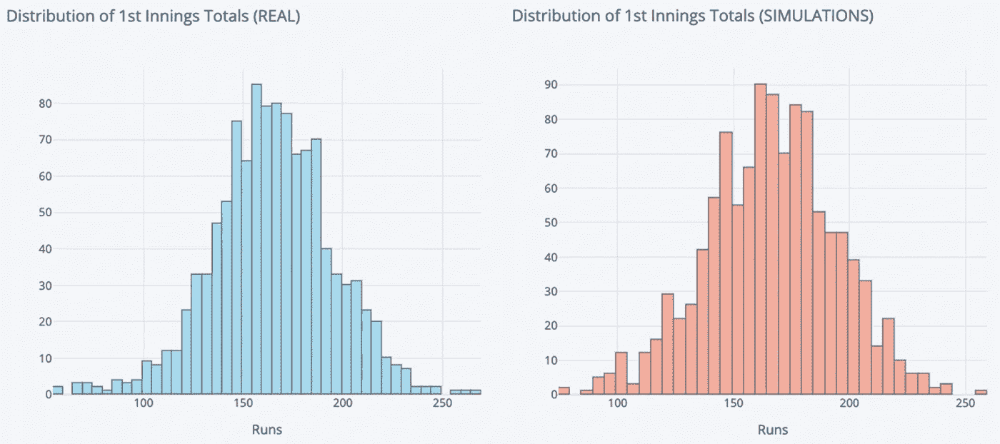

图片由 Andrew Kuo 提供。

***比赛检票口***

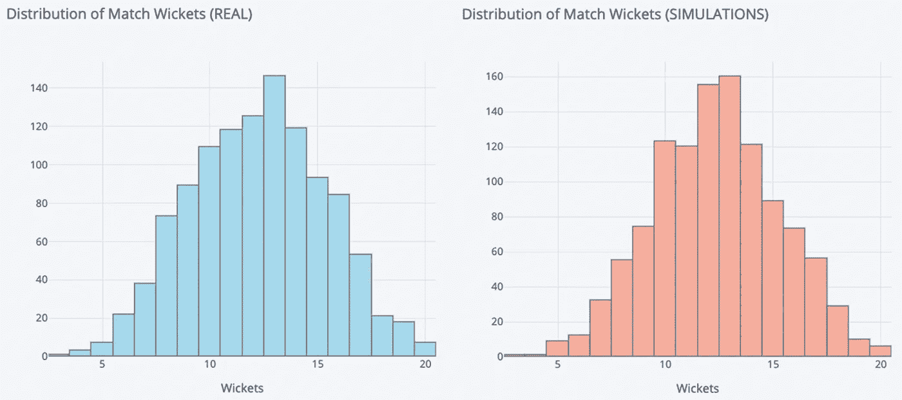

图片由 Andrew Kuo 提供。

***最高个人分数***

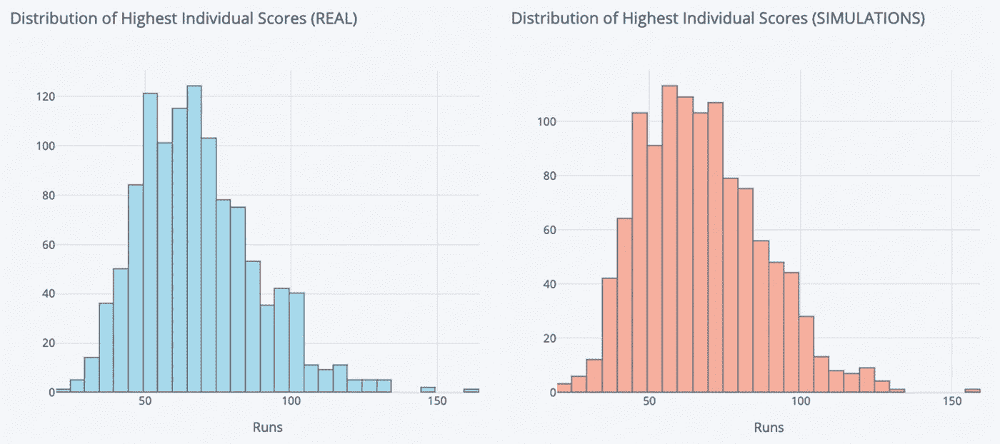

图片由 Andrew Kuo 提供。

## 匹配结果

我评估模型的第二个方法是预测比赛的获胜者。如前所述，要获得 A 队赢得比赛 X 的预测概率，只需将 A 队获胜的所有模拟相加，然后除以模拟总数。在模拟比赛中，我的模型能够以 **55.6%** 的准确度和 **0.687** 的对数损失来预测获胜者。

虽然我最初对这些结果印象不深，但使用 Bet365 的历史投注赔率进行的进一步分析使我受到鼓舞。当我将我的模型预测与 Bet365 的赔率暗示的预测进行比较时，我发现我的模型实际上表现更好。Bet365 以较低的准确度( **54.2%** )和较高的对数损失( **0.695** )选出了获胜者。从这个角度来看，一个基准模型预测每场比赛两队的概率为 0.5，对应的对数损失为 **0.693** ，这意味着 Bet365 的赔率比没有信息的模型更差！

现在，这里要说的不是我的模型在预测 T20 比赛结果方面令人惊讶，而是 T20 比赛结果本来就很难预测。我确实怀疑，通过每场比赛模拟 500 次以上，我会提高模型的性能，但我需要在将来测试这个假设。

## 其他预测

最后，我尝试预测比赛的其他一些特征。我再次遇到了这项运动固有的不可预测性，但我在下面列出了一些结果。

***第一局比分***

为了预测每场比赛的第一局分数，我使用了所有模拟中正确的球队首先击球的平均第一局分数。在下面的散点图中，我们可以看到预测分数和实际分数之间有关系，但这是相当嘈杂的。这里的相关性为 **0.305** ，p 值为 **1.18e-25** ，这表明模拟在模拟这一特征方面做得很好，但未知因素太多，无法做到准确。进一步的证据是所有模拟比赛中第一局得分的平均标准差，相当高，为 **28.6** 。

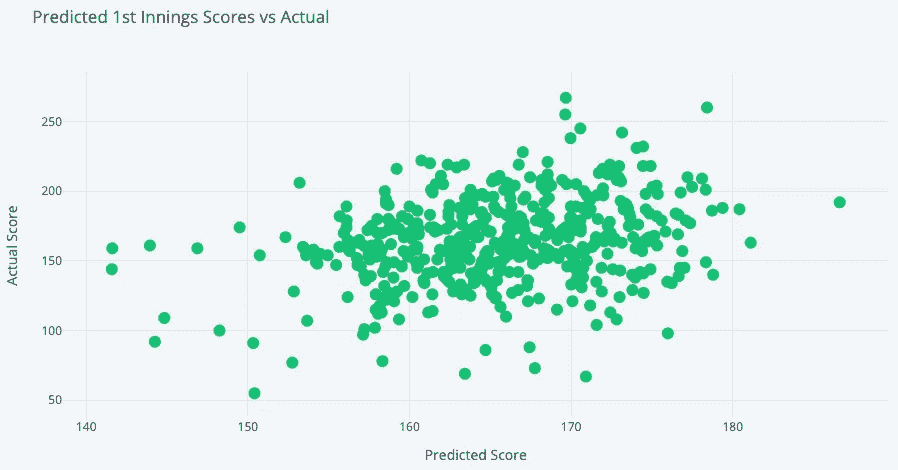

图片由 Andrew Kuo 提供。

***顶级跑分***

为了预测一场比赛中得分最高的球队，我选择了在大多数模拟中得分最高的球员。使用这种方法，我能够以大约 25%的准确率选出最高分。在下面的图中，我们可以看到当我们选择前 N 个最有可能得分最高的人(而不仅仅是前 1 个)时，准确性的不同水平。例如，在我模拟的 80%的比赛中，我在基于模拟的前 4 个预测中有真正的最高分。

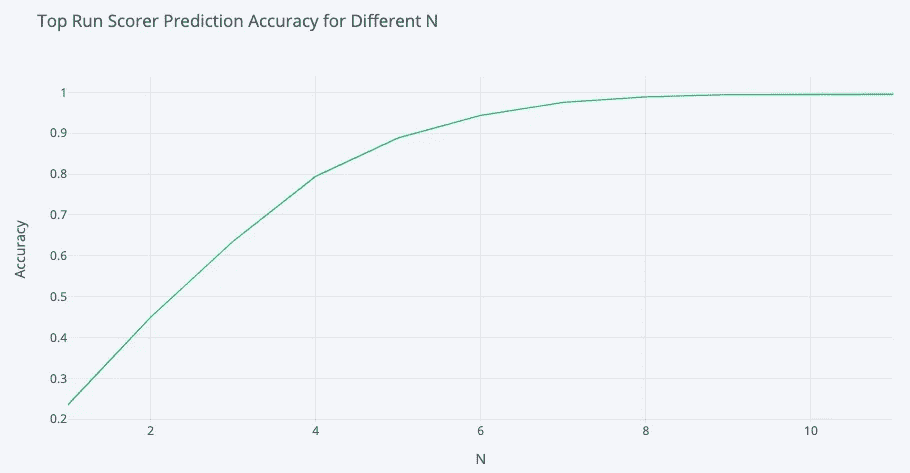

图片由 Andrew Kuo 提供。

***顶部检票员***

我在这里使用了与上面预测得分榜榜首相同的方法，但是这一次我试图为每支球队选出最佳射手。下图显示了我的最佳选择在大约 35%的比赛中是正确的，而真正的最佳人选在大约 75%的时间里出现在我的前 3 个预测中。

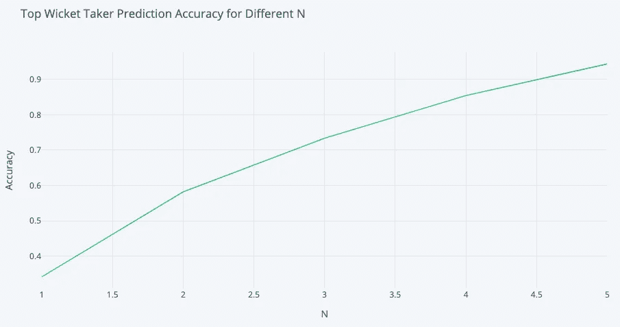

图片由 Andrew Kuo 提供。

# 结论

从一开始，这个项目的目标并不是真正世界级的预测准确性，而是看看我是否能以逐球的粒度模拟整个 T20 比赛，我做到了。该模型非常擅长生成 T20 比赛的真实模拟，但不幸的是，它很难充满信心地预测结果。我的直觉告诉我，这可能是因为这项运动总体上很难预测，这得到了我对博彩赔率的分析的支持。我发现，博彩公司的赔率不仅比我的模型更糟糕，甚至比没有任何信息的模型更糟糕。

虽然这是一个有趣的实验，但我发现在实践中使用它有一些限制。首先，运行模拟需要很长时间(在我的机器上大约每小时 10k 次模拟)。这不一定是个问题，除非球队名单通常在比赛开始前 10-15 分钟才公布。由于自下而上的建模风格的一个关键优势是它可以更好地捕捉到面对面的比赛，所以用不正确的阵容模拟游戏不太可能产生好的结果。

就后续步骤而言，我想尝试几件事:

1.  增加了球预测模型的复杂性。因为每个模拟都需要相对长的时间来运行，所以我决定保持我的球预测模型相当轻量级，但是我想尝试添加更多的功能。
2.  尝试增加每场比赛的模拟次数。我用这个做了一个小实验，看到了预测准确性的即时提升，所以我想尝试模拟每场比赛 10k+次。
3.  尝试为更可预测的运动建立一个类似的模型。这种建模的灵活性非常吸引人，所以我想用一种更容易建模的运动来尝试这种自下而上的方法。