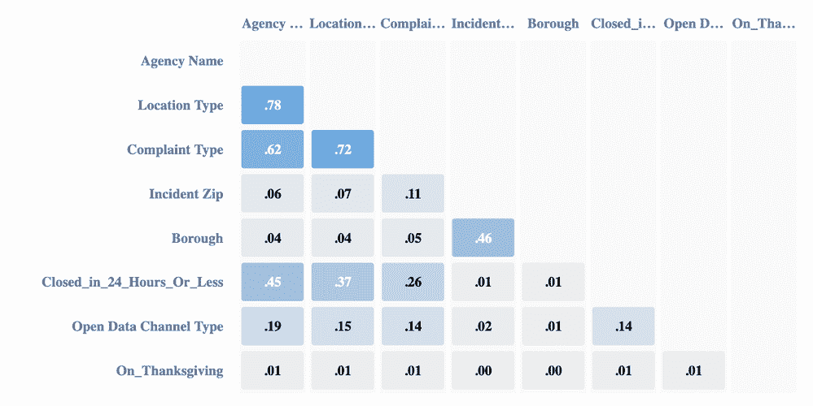
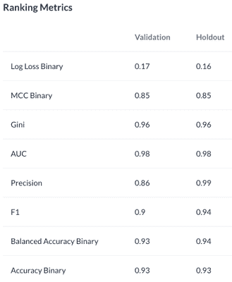
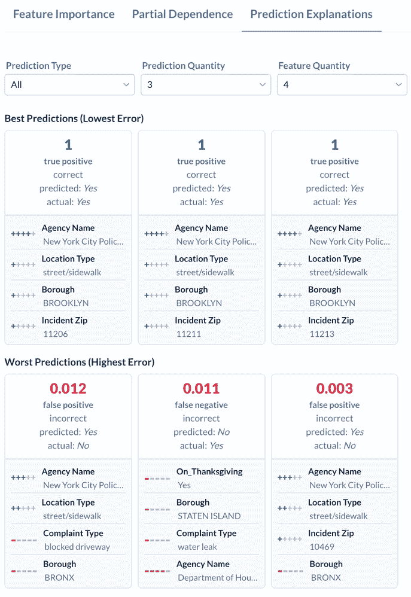
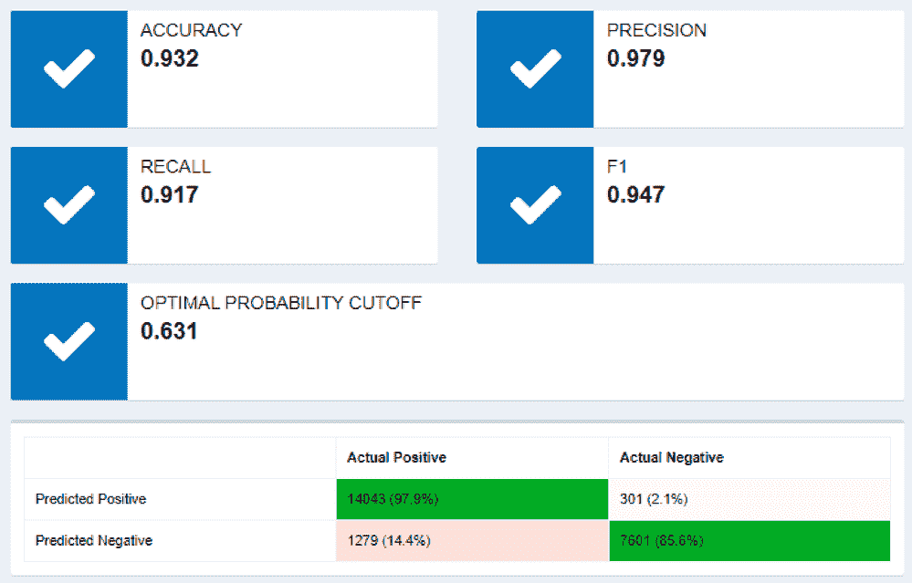
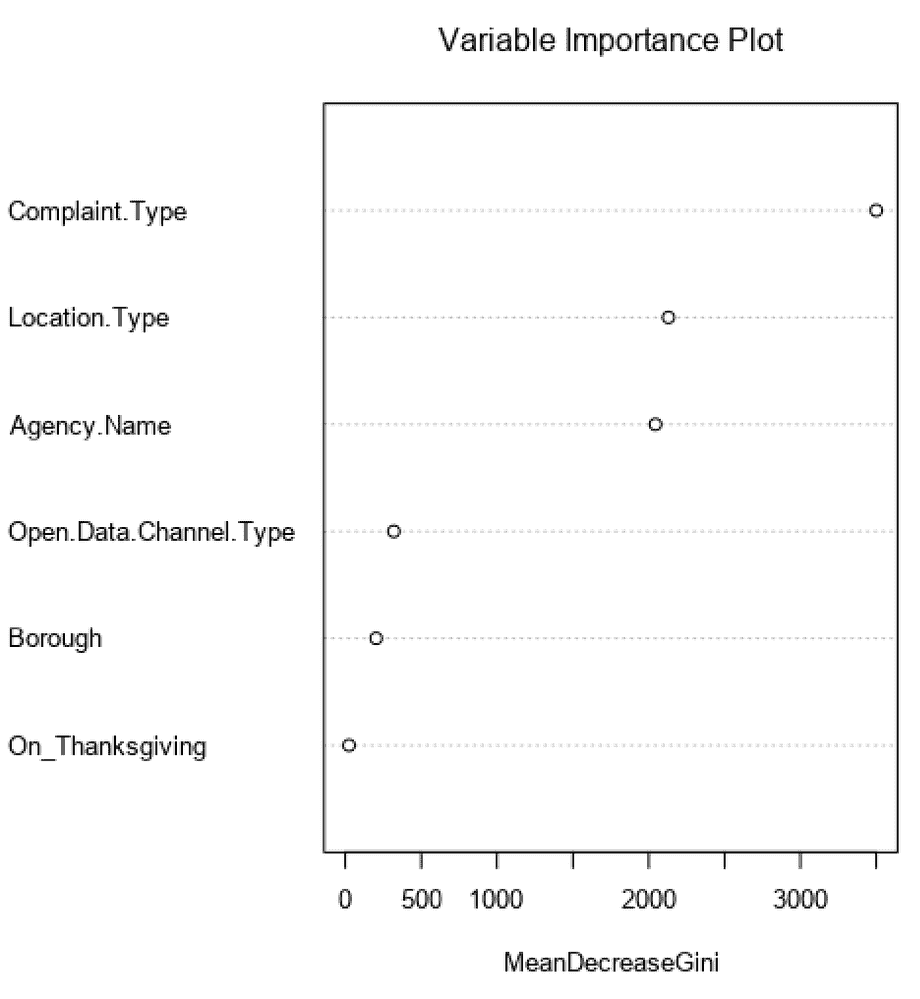

# 用数据科学预测节假日对服务的影响

> 原文：<https://towardsdatascience.com/predicting-the-effects-of-holidays-on-service-with-data-science-5adf8bddb974?source=collection_archive---------24----------------------->

## 分类模型可以帮助我们了解与服务延误相关的因素，评估假期的影响，并根据重要的标准预测未来的延误。

安德烈·本兹在 [Unsplash](https://unsplash.com?utm_source=medium&utm_medium=referral) 上拍摄的照片

当我们中的许多人在感恩节快乐地享受盛宴和放松时，其他人却在外面做着必要的事情来保持节日期间的社会运转。当地政府机构、执法机构和其他机构仍然接受帮助请求，并努力满足这些请求。

*图片 via* [*GIPHY*](https://media.giphy.com/media/TbQRqDo63qD7TEffT3/giphy-downsized.gif)

但是假期会影响处理公众提出的解决问题的请求的时间吗？是什么决定了一个请求能否在 24 小时内完成和关闭？(当然，需要快速周转和关闭与许多其他领域相关，例如交付时间、客户服务单、预约等待时间等等。)

让我们来看看模拟这类问题的一种方法。我们将查看纽约市 311 呼叫数据——具体来说，[一个数据集](https://data.cityofnewyork.us/Social-Services/311-Service-Requests-during-Thanksgiving-Week-2020/nkbi-zvx2)报告了 2020 年感恩节期间 311 的所有呼叫。我们将构建一个模型来预测特定的服务请求是否可能在 24 小时内关闭。鉴于案件的具体情况，能够预测这一点将有助于那些接受请求的人提供关于问题可能需要多长时间来解决的现实预测。我们的建模过程还会让我们知道哪些因素在不到一天的时间内结案最重要，包括今天是不是火鸡日。

*2020 年感恩节期间向纽约市 311 服务报告的问题。(注意左上方…呀！)图片由作者提供。*

# 准备我们模型的原料

来自纽约市网站的数据集非常干净，只需要进行一些必要的常规整理，以将日期转换为正确的格式，使文本小写以保持一致性，并创建一些功能:计算服务请求的创建和关闭之间的时间，加上一个基于日期的变量，该变量简单地标记请求是否是在感恩节发起的。

此外，在“投诉类型”的原始数据中有许多值(例如，“喧闹的聚会”、“看到老鼠”)😱)和“位置类型”(例如，“街道”、“空地”)。然而，Designer 中基于 R 的预测工具只能处理每个分类变量的 50 个或更少的值，因此我确定了前 50 个投诉和位置类型，并只保留了使用这些最常见类型的 311 个呼叫。尽管如此，我仍有 29060 个电话需要分析，而最初的 36846 个电话中，有 4060 个发生在感恩节。

令人印象深刻的是，其中 19，118 个电话在 24 小时内得到解决，其中 15，701 个电话被移交给纽约警察局处理，其他电话被转到其他城市机构，如卫生局和公园和娱乐局。

*图片经由* [*GIPHY*](https://media.giphy.com/media/xUA7bdAqaOEl6omLks/giphy-downsized.gif)

# 构建模型，第 1 部分:Alteryx 机器学习

我们需要一个二元分类模型来预测每个案例是否在 24 小时内得到解决。预测因素包括(处理问题的)机构名称、投诉类型、位置类型、行政区、用于联系 311 的方法(例如电话、在线)以及服务请求是发生在感恩节当天还是假日周的另一天。

我们可以使用 [Alteryx 机器学习](https://help.alteryx.com/machine-learning)来快速完成建模过程。它将利用要素分类选项充分利用该数据集，还将快速构建和评估多个模型，而我们只需付出最少的努力。

*图像通过* [*GIPHY*](https://media.giphy.com/media/qCEryXyjBsvdHOk607/giphy-downsized.gif)

像往常一样，第一步是导入数据并进行准备。此时，您可以确保为每个要素正确设置了数据类型，删除不需要的要素，并检查数据集的整体健康状况(即，是否已准备好进行建模)。

在这个阶段需要注意的一件很酷的事情是，您可以比在 Alteryx Designer 中更详细地描述您的数据类型。例如，我可以告诉 Alteryx 机器学习应该将“邮政编码”列评估为“邮政编码”类型。(那是因为是在 Alteryx 开源库之一的 [木工](http://github.com/alteryx/woodwork)上[绘图，处理数据类型化。)](https://woodwork.alteryx.com/en/stable/guides/logical_types_and_semantic_tags.html#PostalCode)

在下一步中，您将设置您的目标变量，确定您需要的模型的一般类型(分类或回归)。然后快速浏览数据集，揭示要素的一些基本细节，包括要素之间的相关性、异常值和目标变量的标注分布。

*数据集中变量的相关矩阵。图片作者。*

*我们的目标变量的是/否值的分布(请求是否在 24 小时内关闭)。图片作者。*

这个工具是用[处理不平衡数据集](https://community.alteryx.com/t5/Data-Science/Balancing-Act-Classification-with-Imbalanced-Data/ba-p/841878?utm_content=847820&utm_source=tds)的方法构建的，所以你不必担心你的结果是否有更多的特定标签。

Alteryx 机器学习将在自动建模步骤中使用各种算法和超参数建立一系列模型，然后为您提供可供选择的选项纲要，外加一个建议。

下一步，评估模型，可能是最有趣的！您可以查看所选模型在各种指标上的表现，查看混淆矩阵和要素的相对重要性，模拟修改数据的结果，甚至检查模型做出的好的和坏的预测的样本，以便您可以更好地了解它在幕后做了什么。

*为推荐的模型检查许多指标。图片作者。*

*推荐车型的混淆矩阵。图片作者。*

*模型提供的最佳和最差预测的预测解释。图片作者。*

在这一过程的各个步骤中，有很多东西需要仔细阅读。对模型满意后，您可以上传新数据，模型可以基于这些数据生成新预测，将建模过程中显示的视觉效果导出为图像或 PowerPoint 幻灯片，并导出模型以在设计人员工作流中使用。

# 构建模型，第 2 部分:Alteryx 设计器

如果你没有 Alteryx 机器学习，不要担心，我们仍然可以从我们的老朋友，基于 R 的预测工具开始这个节日派对。我使用这些工具在 Designer 中构建了一个逻辑回归模型和一个随机森林模型。(跟随附在这篇博文的[原始版本的工作流程！)](https://community.alteryx.com/t5/Data-Science/Predicting-the-Effects-of-Holidays-on-Service/ba-p/847820?utm_content=847820&utm_source=tds)

随机森林模型有 93.4%的准确率，在预测正面和负面结果时表现大致相同，如下面的混淆矩阵所示。

*Designer 中随机森林模型的混淆矩阵。图片作者。*

逻辑回归模型几乎做得一样好，准确率为 93.2%；然而，它的错误并不是平均分布的。

*Designer 中内置的逻辑回归模型的指标。图片作者。*

因此，让我们更仔细地观察随机森林模型，特别是检查各种特征如何影响预测。下面的可变重要性图告诉我们更多信息:

*在 Designer 中内置随机森林模型的可变重要性图。图片作者。*

Designer 中内置的随机森林分类器与 Alteryx Machine Learning 构建的 XGBoost 分类器的性能类似。这两种工具都完成了建模工作，但是都有不同的接口和解释性信息。

如果我们担心在感恩节收到的请求是否会影响该请求能否在 24 小时内得到解决，那么，事实证明这是预测结果的最不重要的因素。相反，投诉的类型、地点和机构在模型的预测中更为重要。

*图片 via* [*GIPHY*](https://media.giphy.com/media/6hjD4IpNpPqgXsrnpl/giphy-downsized.gif)

# 甜点:预测和更多

建模过程帮助我们更深入地了解了假期如何影响服务请求的结束时间(或者没有影响，在这种情况下，因为“在感恩节”功能与这些模型中使用的其他功能相比并不是非常重要)。将来，我们还可以使用我们最喜欢的模型来预测具有特定特征集的服务请求是否会在 24 小时内完成和关闭。这些信息有助于引导客户的期望和形成响应流程。

*原载于* [*Alteryx 社区数据科学博客*](https://community.alteryx.com/t5/Data-Science/Predicting-the-Effects-of-Holidays-on-Service/ba-p/847820?utm_content=847820&utm_source=tds) *。*