# 用高斯过程预测封锁的结束

> 原文：<https://towardsdatascience.com/predicting-the-end-of-lockdown-with-a-gaussian-process-84b253bc1a88?source=collection_archive---------47----------------------->

## 我们能使用高斯过程预测每日接种疫苗的数量吗？


新冠肺炎接种疫苗，图片由 [pixabay](https://pixabay.com/photos/vaccine-covid-19-vials-vaccination-5895477/)

截至本文撰写之时(2021 年 2 月 7 日)，英国正处于另一场全国封锁之中，看起来我们摆脱封锁的最佳机会是为弱势群体中的每一个人接种疫苗，这相当于大约 1500 万人。迄今为止，接种疫苗的总人数约为 1100 万，那么我们什么时候才能达到神奇的 15 人呢？在本文中，我们将尝试使用高斯过程来模拟每日剂量，并尝试估计封锁可能结束的时间…

## 数据

gov.uk 网站为我们提供每日更新的疫苗接种数据，他们将数据分为第一剂和第二剂。我们的模型将只关注第一剂，因为政府的政策是第二剂要等 12 周。

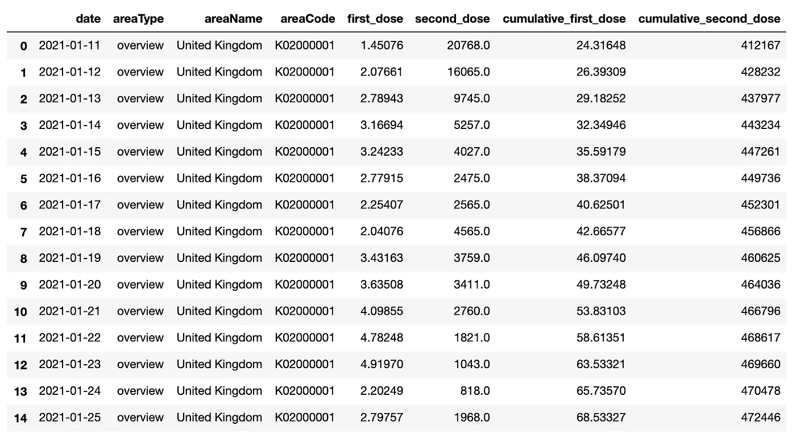

原始数据—按作者分类的图像

## 系统模型化

考虑到我们想用少量的数据对未来做出预测，在我们的预测中提供不确定性是特别重要的。高斯过程(GP)模型非常适合这种回归任务。

我不会在这里详细介绍 GPs 及其基本理论，因为这本身就是一整篇文章，但这里有一些我们将利用的模型的好处。

GPs 是一种非参数贝叶斯模型，可用于分类和回归任务(本例中为回归)。与贝叶斯参数模型不同，在贝叶斯参数模型中，我们在模型的参数上定义先验，GP 更进一步，在所有可能函数的无限空间上定义先验。它们变得易于处理，因为我们只关心函数在有限数量的点上的值(特别是训练点和测试点)。

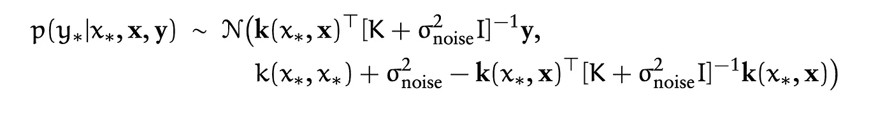

后验预测分布，作者图片

后验预测分布是噪声、数据和核函数的函数。我意识到我在这里跳过了很多理论，Bishop [1]对细节做了很好的解释。在本文中，我想探讨的主要问题是好的内核设计(`k(x_i,x_j)`)如何影响模型性能。

有许多不同的 Python 包可用于 GPs，但为了简单起见，我选择使用 sk learning 实现。

对于一个 GP 建模任务(或者实际上任何建模任务)，从简单开始，逐步发展到复杂是值得的。因此，让我们从一个如下所示的内核开始:

```
kernel = RBF(length_scale=5) + \ 
         WhiteKernel(noise_level=0.5) + \
         ConstantKernel()
```

具有 RBF 核的 GP 是一种通用函数逼近，允许任意曲线拟合数据。它由确定信号变化速度的长度比例参数控制。长度比例越大，曲线变化越慢。

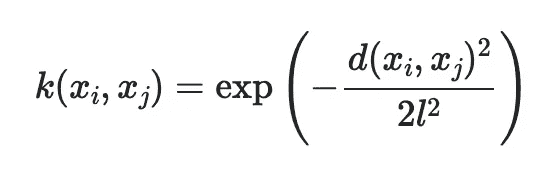

RBF 内核，图片来自 [Sklean](https://scikit-learn.org/stable/modules/generated/sklearn.gaussian_process.kernels.RBF.html)

白核允许对独立同分布(iid)噪声进行建模，而常数核允许非零均值。

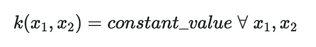

常量内核，图像来自 [Sklean](https://scikit-learn.org/stable/modules/generated/sklearn.gaussian_process.kernels.ConstantKernel.html)

如果我们符合这个模型，我们得到以下结果:

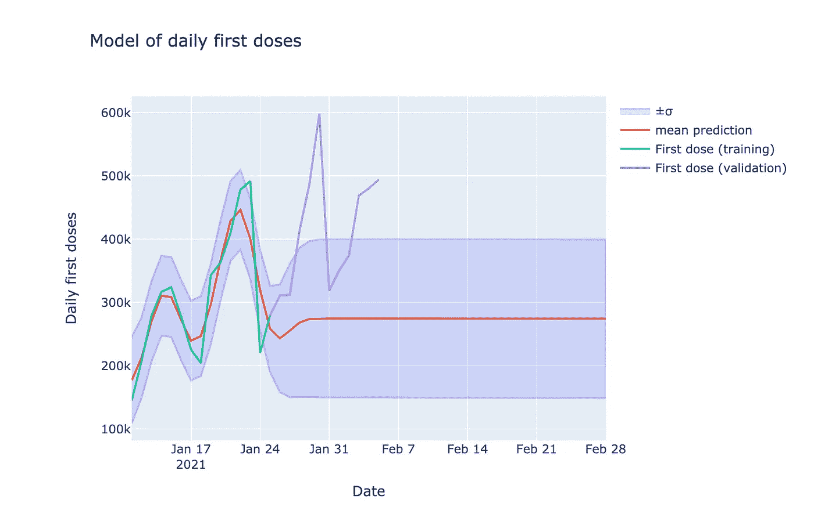

径向基函数，白色和常数核，作者图片

该内核显然能够在训练数据的支持下学习数据的趋势。在支持区域之外，内核所能做最好的事情就是估计训练均值。

我们可以做两件有用的内核设计。首先是注意数据的增长趋势，即我们每天的疫苗数量仍在增加。其次，数据存在明显的周期性。尚不清楚这是由于周末报告不佳还是疫苗数量实际上较少。无论哪种方式，都没有关系，我们仍然可以尝试并将其包含在我们的模型中。

首先，让我们试着解决疫苗的日常增长。这最好通过允许多项式趋势建模的`DotProduct`乘积内核来实现。

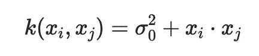

点积内核，图像由 [Sklearn](https://scikit-learn.org/stable/modules/generated/sklearn.gaussian_process.kernels.ConstantKernel.html)

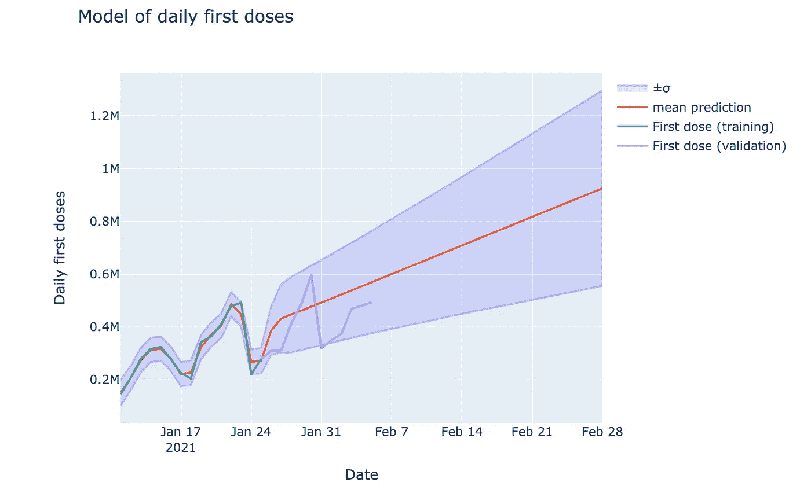

添加了线性点积内核的 GP，图片由作者提供

这看起来稍微好一点，但像这样的线性增长是非常乐观的…我发现我们不太可能在 2 月 28 日之后每天为 100 万人接种疫苗！所以我们可以通过使用`DotProduct() ** 0.5`来降低音量。

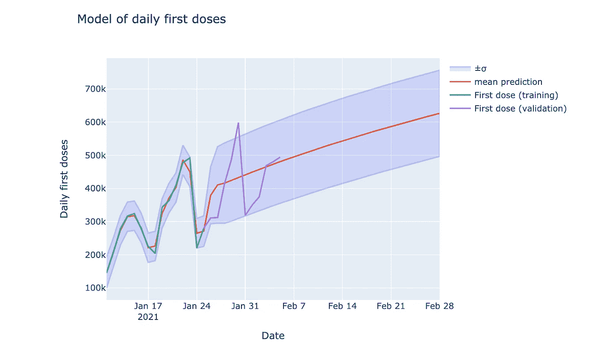

GP 带 DotProduct() ** 0.5 添加，图片由作者提供

我认为这似乎更合理。我们已经把增长率降低到一个平方根关系，这看起来更合理。

现在让我们试着解决函数的周期性质。我们可以通过增加`ExpSineSquared`来实现。

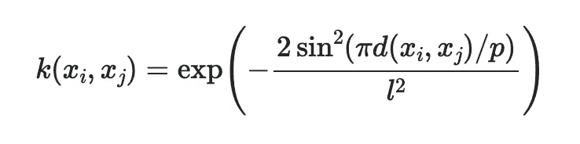

指数正弦内核，图像由 [Sklean](https://scikit-learn.org/stable/modules/generated/sklearn.gaussian_process.kernels.ExpSineSquared.html)

很容易看出，当`x_i`和`x_j`之间的距离为`0`或`Np`时，这个核函数被最小化。这使我们能够模拟像我们这样的周期函数！

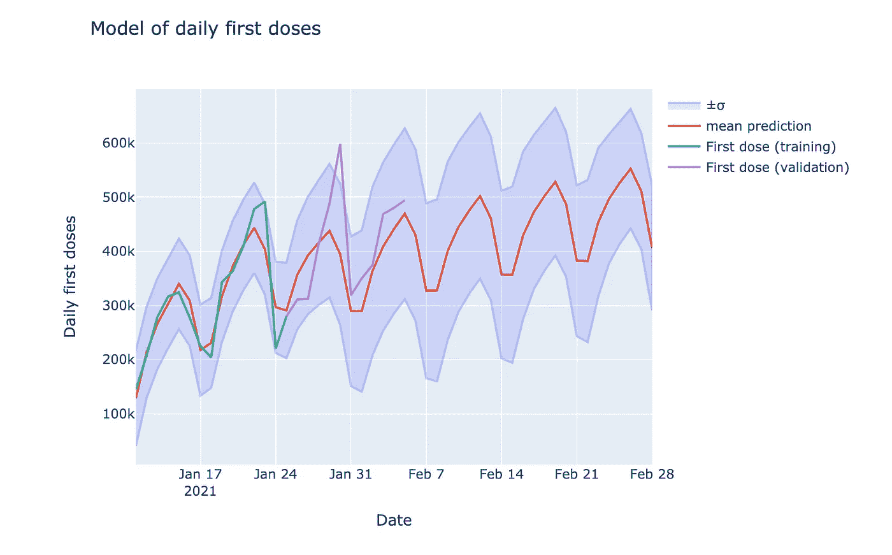

添加了 ExpSineSquared(句点=7)的 GP，图片由作者提供

现在我们能够很好地模拟周期性了！

## 模拟累积疫苗接种数量

所以，我们对每日疫苗模型相当满意。现在，我们可以从全科医生的后半部分获取样本时间序列，并对首剂的累积数量进行建模。

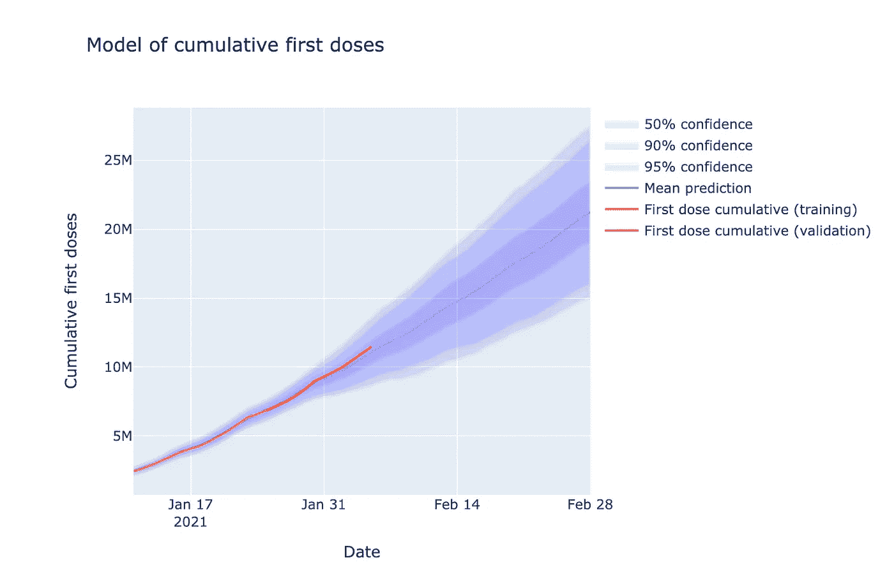

累积首剂，作者图片

回想一下，我们的模型是根据 14 天的数据(1 月 11 日到 1 月 25 日)训练的，我们预测的是未来一个月的值。如果我们看看 2 月 5 日的模型预测，它预测的疫苗总数平均为 1109 万支，而实际值为 11.47 支，在预测未来 10 天时，误差仅为 3%。如果你问我，那对几个小时的模型来说是不错的！

## 我们什么时候能达到神奇的 15 米？

我们在前 14 天训练的模型预测，我们将在 2 月 9 日至 26 日之间以 95%的置信度达到 1500 万次累积首剂。如果我们在所有可用数据上重新训练该模型，那么我们可以以 95%的置信度将不确定性降低一点，使其介于第 11 和第 19 之间。

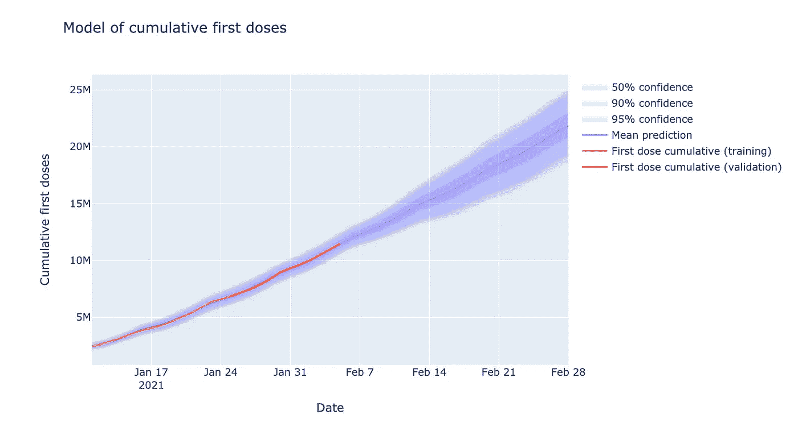

全科医生接受了所有可用数据的再培训，图片由作者提供

值得注意的是，并不是所有的 1500 万疫苗都将用于最易感染的 4 类人群，所以我们可以将这一预测推迟几天。

## 我们学到了什么？

希望本文已经展示了建立和运行一个 GP 模型是多么容易，如何通过使用关于问题的先验信息来调优/设计您的内核函数，以及如何使用该模型进行带有内置不确定性的预测！

不用说，随着 [COVID 病例下降](https://www.google.com/search?q=uk+covid+cases&oq=uk+covid+cases+&aqs=chrome..69i57j0i433i457j0i402j0l2j0i433j0l2j0i433j0.3404j0j7&sourceid=chrome&ie=UTF-8)和死亡人数超过高峰，疫苗接种仍在增加，如果我们继续朝着正确的方向前进，我们可以很快看到限制被取消…

声明:本文由亚历山大·贝利以个人身份撰写。本文中的观点和模型是作者自己的，并不反映我的雇主或英国政府的观点。

## 参考

[1]毕晓普，c .，2016。*模式识别与机器学习*。纽约斯普林格出版社，第 303 页