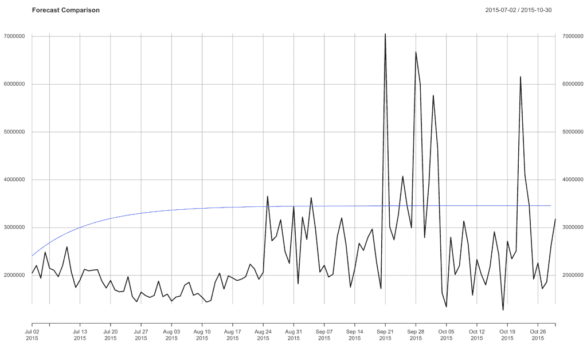

# 预测未来:学会用 Arima 模型预测

> 原文：<https://towardsdatascience.com/predicting-the-future-learn-to-forecast-with-arima-models-2c41eaa8b548?source=collection_archive---------29----------------------->

## 是什么让 Makes 天体对预测如此有用？


图片来自[pix abay](https://pixabay.com/?utm_source=link-attribution&utm_medium=referral&utm_campaign=image&utm_content=3973695)Alexas _ Fotos

# XTS 物体

如果您没有使用 XTS 对象来执行 R 中的预测，那么您很可能会错过！我们将从头到尾探讨的主要好处是，当涉及到建模、预测和可视化时，这些对象更容易使用。

# 让我们来看看细节

XTS 物体由两部分组成。第一个是日期索引，第二个是传统的数据矩阵。

不管你是想预测客户流失、销售、需求还是其他什么，让我们开始吧！

您需要做的第一件事是创建日期索引。我们使用`seq`函数来实现。非常简单，这个函数获取您的开始日期、您拥有的记录数量或长度，然后是时间间隔或`by`参数。对我们来说，数据集从以下内容开始。

```
days <- seq(as.Date("2014-01-01"), length = 668, by = "day")
```

现在我们有了索引，我们可以用它来创建我们的 XTS 对象。为此，我们将使用 xts 函数。

别忘了`install.packages('xts')`然后加载库！`library(xts)`

一旦我们完成了这些，我们将调用 xts 并传递我们的数据矩阵，然后对于日期索引，我们将把索引传递给`order.by`选项。

```
sales_xts <- xts(sales, order.by = days)
```

# 让我们用 Arima 创建一个预测

Arima 代表自回归综合移动平均线。一种非常流行的时间序列预测技术。我们可以花几个小时单独谈论 ARIMA，但对于这篇文章，我们将给出一个高层次的解释，然后直接进入应用程序。

# AR:自回归

这是我们使用前几个月的滞后值或数值来预测结果的地方。某个月的结果可能在一定程度上依赖于以前的值。

# I:集成

当谈到时间序列预测时，一个隐含的假设是，我们的模型在某种程度上依赖于时间。这似乎很明显，否则我们可能不会让我们的模型基于时间；).假设不存在了，我们需要理解时间相对于我们的模型在依赖谱上的位置。是的，我们的模型依赖于时间，但多少呢？这个的核心是**平稳性**的思想；这意味着时间的影响随着时间的推移而减少。

更深入地说，数据集的历史平均值往往是未来结果的最佳预测器…但肯定有不正确的时候..你能想到历史平均值不是最佳预测值的情况吗？

*   预测 12 月份的销售额怎么样？季节性趋势
*   高速增长的 saas 公司销售情况如何？持续的上升趋势

这里就介绍了**差分**的过程！差异用于消除趋势&季节性的影响。

# 马:移动平均线

移动平均线模型的存在是为了处理你的模型的误差。

# 让我们开始建模吧！

# 培训/验证分割

首先，让我们将数据分解成一个训练数据集，然后我们称之为验证数据集。

这与其他验证测试(如交叉验证测试)的不同之处在于，我们在这里按时间划分，将训练划分到给定的时间点，并对之后的所有内容进行验证。

```
train <- sales_xts[index(sales_xts) <= "2015-07-01"] 
validation <- sales_xts[index(sales_xts) > "2015-07-01"]
```

# 是时候建立一个模型了

`auto.arima`函数包含了我们刚刚谈到的逼近最佳`arima`模型的想法。我将在另一篇文章中详细介绍更实用的方法，但下面我将探索一个`auto.arima`模型的生成以及如何使用它进行预测。

```
model <- auto.arima(train)
```

现在让我们生成一个预测。与之前一样，我们将创建一个日期索引，然后用数据矩阵创建一个 xts 对象。

从这里开始，您将绘制验证数据，然后将预测放在绘图的顶部。

```
forecast <- forecast(model, h = 121) 
forecast_dates <- seq(as.Date("2015-09-01"), length = 121, by = "day")forecast_xts <- xts(forecast$mean, order.by = forecast_dates)plot(validation, main = 'Forecast Comparison')lines(forecast_xts, col = "blue")
```



# 结论

我希望这是一个对 ARIMA 预报有帮助的介绍。一定要让我知道什么是有帮助的，以及你想了解的任何其他细节。

如果你觉得这很有帮助，一定要看看我在[datasciencelessons.com](http://datasciencelessons.com)上的其他帖子。祝数据科学快乐！