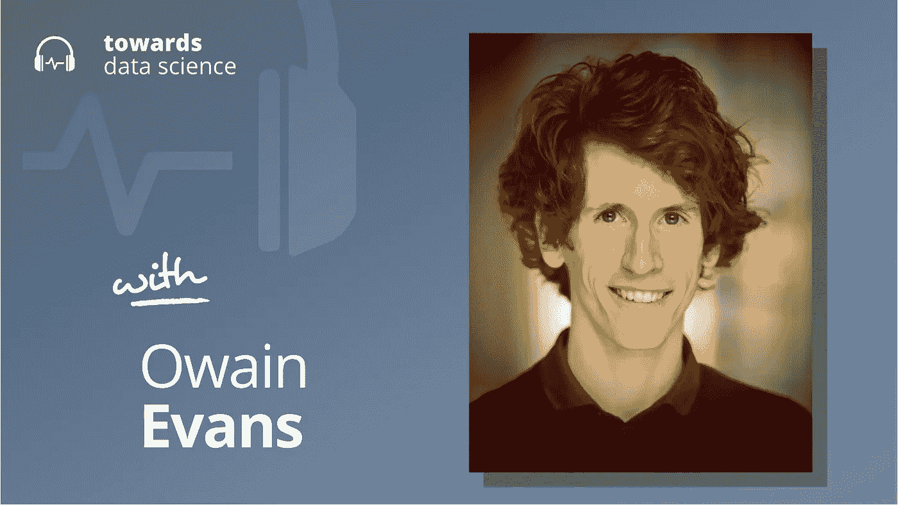

# 预测人工智能的未来

> 原文：<https://towardsdatascience.com/predicting-the-future-of-ai-98deb3c49fe8?source=collection_archive---------48----------------------->

## [苹果](https://podcasts.apple.com/ca/podcast/towards-data-science/id1470952338?mt=2) | [谷歌](https://www.google.com/podcasts?feed=aHR0cHM6Ly9hbmNob3IuZm0vcy8zNmI0ODQ0L3BvZGNhc3QvcnNz) | [SPOTIFY](https://open.spotify.com/show/63diy2DtpHzQfeNVxAPZgU) | [其他](https://anchor.fm/towardsdatascience)

## Owain Evans 在 [TDS 播客](https://towardsdatascience.com/podcast/home)

要选择章节，请访问 Youtube 视频[这里](https://youtu.be/dea1XQojRmw)。

*编者按:这一集是我们关于数据科学和机器学习新兴问题的播客系列的一部分*，*由 Jeremie Harris 主持。除了主持播客，Jeremie 还帮助运营一家名为*[*sharpes minds*](http://sharpestminds.com)*的数据科学导师初创公司。你可以听下面的播客:*

收听[苹果](https://podcasts.apple.com/ca/podcast/towards-data-science/id1470952338?mt=2)、[谷歌](https://www.google.com/podcasts?feed=aHR0cHM6Ly9hbmNob3IuZm0vcy8zNmI0ODQ0L3BvZGNhc3QvcnNz)、 [Spotify](https://open.spotify.com/show/63diy2DtpHzQfeNVxAPZgU)

大多数研究人员同意，我们最终将达到这样一个点，即我们的人工智能系统开始在几乎每一项有经济价值的任务上超过人类的表现，包括从他们所学到的东西中进行归纳的能力，以承担他们以前从未见过的新任务。这些人工智能(AGIs)很可能会对我们的经济、社会甚至人类产生变革性的影响。

没有人知道这些影响会是什么，或者什么时候 AGI 系统会发展到可以带来这些影响。但这并不意味着这些事情不值得预测或估计。我们对为重要的人工智能伦理、安全和政策问题开发强大解决方案的时间了解得越多，我们就越能清楚地思考今天哪些问题应该得到我们的时间和关注。

这就是激发大量人工智能预测工作的论点:试图预测人工智能发展的关键里程碑，通往 AGI 和超人人工智能的道路。这个领域还处于早期阶段，但它已经受到越来越多的人工智能安全和人工智能能力研究人员的关注。其中一名研究人员是 Owain Evans，他在牛津大学人类未来研究所的工作重点是通过观察人类行为或与人类互动来了解人类信仰、偏好和价值观的技术。Owain 和我一起参加了这一集的播客，谈论人工智能预测，推断人类价值的问题，以及支持这种类型研究的研究组织的生态系统。

以下是我在对话中最喜欢的一些观点:

*   试图预测 AGI 何时发展的最重要因素之一是神经网络和其他现有策略是否足以让我们到达那里。如果是这样的话，那么通往 AGI 的道路只不过是扩大现有技术，而不需要进一步的概念突破。这是强化学习先驱理查德·萨顿(Richard Sutton)在他 2019 年关于“痛苦的教训”的文章[中认可的一种可能性。他认为，我们应该从过去 70 年的人工智能研究中吸取教训:人工智能的大多数进展都来自规模扩大，而不是概念突破。然而，除了神经网络和反向传播之外，在一般任务上实现人类和超人的表现可能需要一些新的想法。如果这被证明是真的，那么 AGI 不仅是一个工程挑战，也是一个理论挑战——时间跨度可能更长。](http://www.incompleteideas.net/IncIdeas/BitterLesson.html)
*   人工智能预测的研究现在已经持续了几年——足够的时间让我们开始回顾过去的预测，以更好地理解我们在预测人工智能里程碑时往往会犯的错误类型。到目前为止，Owain 确定了一个共同的主题，即研究人员往往高估了在自然语言建模方面取得进展所需的时间，引用了机器翻译和高中水平的论文写作等具体例子，在这些领域，人类水平的表现可以说已经被一些当前的人工智能系统接近或达到。
*   预测 AGI 到来的挑战之一是我们目前缺乏可接受的概括能力的标准。结果，人们仍然不同意前沿模型(如 OpenAI 的 GPT-3)可以推广到什么程度，也不同意当前技术可能位于 AGI 能力曲线的哪个位置。现在有越来越多的努力致力于寻找良好的一般化度量，但时间会告诉我们哪些将被广泛采用，哪些在被接受为真正的一般智力指标之前必须进行修改。

你可以[在推特上关注欧文](https://twitter.com/OwainEvans_UK)，或者[在推特上关注我](https://twitter.com/jeremiecharris)。

## 播客中引用的链接:

*   [人类未来研究所的网站](https://www.fhi.ox.ac.uk/)。
*   Owain 的个人网站，在这里你可以读到更多关于他的研究。

## 章节:

*   0:00 介绍
*   4:42 人工智能政策和人工智能协调组织的现有生态系统
*   8:11 各组织正在研究的不同论题
*   13:30 概括的能力
*   17:35 时间线中的模式
*   21:07 反对强大的语言模型
*   27:49 反驳
*   30:03 解决技术一致性问题的挑战
*   39:49 什么是 IDA？
*   47:06 总结

## 请查看下面的文字记录:

杰里米·哈里斯(00:00):

大家好。欢迎来到播客。今天我们采访的是牛津人类未来研究所的欧文·埃文斯。Owain 对研究技术感兴趣，这种技术可以让机器在与人类互动的基础上了解人类的偏好和价值观。现在这项工作相当复杂，它整合了机器学习、认知科学甚至分析哲学的知识，这是 Owain 一直在研究的领域，甚至在深度学习普及之前。但是 Owain 做了大量工作的一个领域是 AGI 时间线的问题，我们将在这里讨论这个问题，预测人工智能道路上的关键里程碑。

**杰里米·哈里斯(00:35):**

现在，这显然是一个重要的领域，因为对 AGI 时间表的预测也告知我们今天采取什么样的行动来达到这些不同的里程碑。如果我们自信地知道人工通用智能就在眼前，这将立即意味着我们可能不会在政策和人工智能安全方面采取某些行动。同样，如果我们认为人工智能的时间表可能会更长，那么在这个阶段更多地投资于政策和能力研究，而不是过多地担心存在风险或任何其他可能伴随后期 AGI 情景的事情，可能是有意义的。因此，我们围绕人工智能时间表以及这些对人工智能安全政策研究的影响，深入探讨了许多问题。我真的很喜欢这次谈话，希望你也是。

耶雷米·哈里斯(01:22)

嗨，非常感谢你和我一起参加播客。

**欧文·埃文斯(01:25):**

很高兴来到这里。

耶雷米·哈里斯(01:27)

哦，真高兴有你。你是致力于人工智能安全、人工智能校准、人工智能政策的许多人之一，但你也是，我认为迄今为止我交谈过的唯一一个在人工智能校准和人工智能政策方面都做了大量工作的人。所以我认为，关于这两个空间的交集，我们可以探讨很多有趣的东西。我认为这里有很多有趣的互动，但在我们开始之前，我能不能问一下，你是如何开始发现这个空间的？

欧文·埃文斯(01:53):

是的，所以我走了一条弯路，我想。高中的时候对 AI 很感兴趣。我读了史蒂芬·平克的《思维是如何工作的》和道格拉斯·霍夫施塔特以及雷·库兹韦尔的一些这方面的著作，我认为人工智能在我有生之年将会是一件大事，基本上是因为思维是计算性的，而摩尔定律意味着将会有越来越多的计算。所以我想知道为什么人们没有更认真地对待这个问题，特别是在学术界，所以我想我会学习数学、心理学和哲学，这将帮助我对这个问题有更多的理解。所以我就这么做了。

**欧文·埃文斯(02:36):**

快进到研究生院。我当时在麻省理工学院，走进了乔希·特南鲍姆的一堂课，讲的是计算认知科学。这就是使用统计学和机器学习的技术来理解高等认知的想法，这看起来似乎是一个显而易见的想法，现在你可以使用人工智能来尝试和理解人类语言，但我认为这在当时肯定不太为人所知。

**杰瑞米·哈里斯(03:09):**

那会是哪一年？

欧文·埃文斯(03:12):

所以这就像 2010 年。

耶雷米·哈里斯(03:15)

哦，哇。好吧。

**欧文·埃文斯(03:16):**

所以我和特南鲍姆一起上了这门课，我发现这种结合，一方面是人类的认知，另一方面是人工智能，非常迷人。当学生们学习计算认知科学时，我和乔希·特南鲍姆一起完成了几篇论文。与此同时，我仍然对这些关于人工智能和人类水平人工智能的长期问题非常感兴趣。所以我从麻省理工学院抽出一段时间，去牛津大学人类未来研究所做了一次访问，当时尼克·博斯特罗姆正在研究超智能。所以写这本书也是一个学习和思考人工智能的好环境。当我回到麻省理工学院完成我的博士学位时，我决定更多地关注机器学习方面，而不是认知科学和人类思维，人类大脑方面。

**欧文·埃文斯(04:18):**

所以我在麻省理工学院完成学业，然后回到牛津大学人类未来研究所做博士后，我有机会研究对齐，特别是将超智能中提出的对齐问题与机器学习结合起来，所以尝试对齐机器学习系统。

杰里米·哈里斯(04:42):

有趣的是，人类未来研究所在这个领域的许多人的历史中发挥了多么重要的作用，尼克·博斯特罗姆的书当然是其中的一大部分，但从那以后，我们也看到了许多其他组织的出现，其中许多组织你也发挥了重要作用。那么你能提供一点概述吗？从人类未来研究所开始，目前存在的人工智能政策和人工智能联盟组织的生态系统是什么？

**欧文·埃文斯(05:09):**

是的，所以他们分散在不同的部门。所以你有学术界，非营利的，所以他们是独立的，然后是工业或公司。因此，在学术界，有人类未来研究所，我已经提到过，它既做技术调整，研究，机器学习风格和政策工作。还有一个叫柴的群聊，人工智能兼容中心，几年前我在那里做过访问学者。由斯图尔特·拉塞尔领导，总部设在加州大学伯克利分校。雅各布·斯坦哈特(Jacob Steinhardt)是一名研究人员，他在加州大学伯克利分校也有一个小组在做非常有趣的研究。因此，这是侧重于人工智能的技术方面，而不是政策。在学术界之外，但在非营利领域，有机器智能研究所，它也像人类未来研究所一样已经存在了一段时间，他们真的专注于人工智能的理论基础，也专注于联合人工智能。所以这是一个更数学化的方法。

**欧文·埃文斯(06:31):**

有一个开放慈善项目，它既资助这一领域的研究，因为他们实际上是非营利组织，资助这一领域的研究，也进行他们自己的内部研究，特别是在人工智能时间表的排序上，以及我们可能期待人工智能的不同里程碑有多长时间。所以有有趣的研究出来了。就工业和科技公司而言，有开放的人工智能，人们可能知道它正在进行像 GPT-3 这样令人兴奋的研究，但它也有一个关于安全性和一致性的相当大的倡议。因此，该小组致力于协调、透明度、安全强化学习，以及人工智能的政策和预测。

**欧文·埃文斯(07:35):**

然后是 DeepMind，它是做人工智能研究主流的另一个主要参与者，但他们也有一个团队致力于长期问题和安全，还有一些团队致力于机器学习安全以及政策和道德方面的工作。所以他们也有一个很好的…虽然一切都是新的，对，深入的参与了一段时间的安全研究，并与牛津大学合作。

耶雷米·哈里斯(08:11):

是啊。我发现这个领域非常有趣的一件事是，你对 AGI 时间表的看法将是决定你在短期人工智能政策方面、人工智能调整方面工作的一个重要因素，而倾向于拥有较短时间表的组织将倾向于更多地关注紧迫的安全和调整问题，组织的较长时间表，也许还有其他事情。这些组织中的每一个都在做他们正在做的事情，因为他们对 AGI 的时间表和 AGI 在未来 5 年、10 年、30 年出现的可能性有特定的看法。你对这些组织提出的不同论点了解多少？这些论点对他们的工作有何影响？

**欧文·埃文斯(08:49):**

是的，所以我认为…没错。我认为这些组织的论文在他们正在进行的关于一致性的研究中发挥了作用。我认为最基本的区别是，如果你认真看待当前的系统，如果你把它们放大到足够大，可能会导致 AGI，那么你会倾向于有更短的时间表，可能是因为你认为我们不需要一些根本性的概念突破。你也可能会…认为排列研究者更紧迫和更可行。我们可以研究我们目前的系统，你认为那种未来的 AGI 系统只是那些系统的放大版本。然而，如果你认为我们需要概念上的突破来实现 AGI，那么你会认为这可能要晚得多，因为我们需要先有那些突破。第二，今天可能很难研究调整，因为我们不知道我们需要什么样的系统来调整。我想我对将非常特殊的观点归因于包含许多个人的整个组织持谨慎态度。

**耶雷米·哈里斯(10:14):**

有这么多的差异是很有趣的。你对时间表有什么个人看法吗？

**欧文·埃文斯(10:22):**

我的意思是，我认为你应该有点忙和概率性，所以我认为在两端都有不确定性，对吗？也就是说，有些事情可能很快就会发生，有些事情可能真的需要很长时间，而目前的技术是渐近线。所以，是的，我不想给出一个数字，但我认为即使在未来 20 年内人工智能出现的可能性只有 5%，我认为这仍然是一件大事，仍然是你应该认真对待的事情。因此，当考虑要做多少一致性研究时，我再次认为即使很快实现 AGI 的概率相当低，也可能是一个很好的赌注，在这方面做更多的研究，只是让我们更好地了解一致性可能存在的问题以及我们如何开始解决它们。

耶雷米·哈里斯(11 时 32 分)

你感觉到有一种普遍的转变吗？也许我是错的，但我的感觉是随着 GPT-3 的出现，有一个普遍的转变，即把神经网络和反向传播作为一条通往 AGI 的道路更认真一点。GPT-3 有没有以任何方式改变你的视角，GPT-2 或者开放人工智能看到的任何缩放结果？

**欧文·伊文斯(11:58):**

是的，我认为 GPT-2 和 3 改变了我的看法。我认为，已经有很好的论据和证据表明，你真的可以通过扩大模型规模，通过创建更大的神经网络，在更大的数据集上训练它们更长时间，来实现很多目标。但是我认为 GPT 2 号和 GPT 3 号的表现比我预期的更令人印象深刻。我认为模特们更擅长掌握这一系列的技能。因此，有一种元学习方面或少量学习，然后能够做基本的数学，真正的基本算术，然后就是系统似乎吸收的知识广度，既有关于人类语言的知识，又有关于如何构造好句子的知识，还有关于事实的知识。

**欧文·伊文斯(13:07):**

所以，是的，我认为这不是一种完全的震惊，因为我非常密切地关注着这个领域，在 GPT-2 和 GPT-3 之前，语言模型已经做了非常令人印象深刻的事情，但我认为他们能做的事情确实令人惊讶。

耶雷米·哈里斯(13:30):

是的，实际上对我来说最大的惊喜之一是社区中不同的人对 GPT-3 的反应，这是一个多么两极分化的发展。有些人似乎在说，“哦，我们有 AGI，这是 AGI 原型。”其他人说，这是如此有限的能力。简直太合身了。人们似乎完全分为完全震惊或完全不惊讶和仍然只是怀疑。这里的部分挑战是，我们不一定有能力评估归纳能力。就模型评估而言，这就像是一个新的领域，因为我们已经在评估方面做了很多狭隘的人工智能工作，但不一定是更通用的系统。你对这方面有什么想法吗？比如我们如何定义这种归纳能力？换句话说，即使我们谈论 AGI，我们真正在辩论什么？

欧文·埃文斯(14:27):

是的，这些都是很好的问题。所以我认为，对，我们看到 GPT-3 在 NLP 任务的传统基准上做得非常好。因此，我们可以通过各种具体指标看到，它是对以前模型的改进。然后我们可以像他们那样发明新的任务，看看他们在这些任务上做得如何，看到令人印象深刻的表现，例如，在算术，类比和使用新词上。但这不同于一个真正系统的概括测试。所以这将是新研究的一个重要领域。Francoise Chollet 是开发[Caris 00:15:15]的人，他开发了一种基准，就像一套任务，试图获得这种更广泛的丰富的概念概括的概念，所以这些任务有点像瑞文矩阵或智商测试。这只是朝着这个方向迈出的第一步，但我认为尝试做更多的工作，这是具有挑战性的研究工作，但你在测试这种似乎很有前途的概括。

**欧文·伊文斯(15:52):**

而 GPT-3，你可以有一个版本，更侧重于语言或喜欢用语言表达事情。但是另一个衡量标准是经济的，对吗？因此，开放人工智能已经创建了这个 GPT-3 API，许多公司将探索他们是否可以使用 GPT-3。因此，在某种程度上，我认为我们将会看到这个系统是否足够灵活，能够应对现实世界的挑战，并真正提高公司的指标？因此，我认为这在学术论文中更难评估，但我认为这将是一个有趣的领域，可以发现，这是否具有导致性能真正大幅提高的鲁棒性？

**耶雷米·哈里斯(16:38):**

是的，这真的很有趣，因为我们很难预测我们已经有明确指标的事物的性能，现在预测概括能力，我们不知道…我们甚至不知道在这个阶段如何表达这意味着什么。这似乎是一个非常特别的挑战。在这种情况下，你实际上整理了一篇发表于 2018 年的作品，其中你对人工智能专家进行了一些民意调查。我想我们之前谈论的民意调查，你提到民意调查是在 2016 年进行的，但我只是想宣读一个快速摘录，其中的几个句子，因为我认为它们真的很有趣。所以这是抽象的，只是写研究人员预测 AI 将在未来 10 年内在许多活动中超过人类，例如到 2024 年翻译语言，到 2026 年写高中作文，到 2027 年开卡车，到 2031 年从事零售工作，到 2049 年写畅销书，到 2053 年做外科医生。

耶雷米·哈里斯(17:35):

我认为真正有趣的是回想起来，这是四年前完成的工作，有争议的是，我们已经开始触及或至少触及其中的一些里程碑。目前还不清楚语言翻译是否真的存在，比如卡车驾驶，但是你有没有注意到我们比预期完成得更快的事情的模式，或者人们一直在犯的预测性错误，即使他们是这个领域的专家？

**欧文·埃文斯(18:02):**

是啊，没错。在最初的调查完成四年半或五年后，我们就要开始了。所以，是的，我认为我们可以开始获得一些信息，这些类型的预测在哪些方面做得好，在哪些方面做得不好？如你所说，我认为翻译的进展比人们预期的要快。所以他们预测 AI 要达到业余翻译水平还需要 7 年半，所以不是专业翻译。

**耶雷米·哈里斯(18:37):**

哇哦。

**欧文·埃文斯(18:39):**

所以在四到五年后的今天，我认为我们已经达到了那个水平，即使是复杂的语言，更难翻译的语言。他们预测在所有雅达利游戏中击败人类需要九年时间，我认为我们也在那里，最多四年，四年或五年。然后写一篇高中论文，我认为 GPT-3 或者 GPT-4 会在那里，更像是五年或六年，而不是他们预测的 10 年。因此，在这些领域，他们对人工智能的发展有些悲观。值得注意的是，这些是中值估计，所以人们实际上给出了这种情况何时发生的概率。例如，当他们说高中作文需要 10 年时间时，他们实际上给出了 25%的概率可以实现，对吗？所以五年后有四分之一的可能性会发生，十年后有 50%的可能性会发生。

欧文·埃文斯(19:54):

所以你会预期四分之一的事件会发生。所以我觉得总的来说，他们的预测看起来还是比较合理的。他们说的事情真的不太可能，例如，艾写了一本纽约时报畅销书，艾赢得了普特南数学竞赛。这些事情都没有发生。他们说的事情真的很有可能，其中一些已经发生了。所以他们有些说对了。所以我认为涉及语言的任务进行得比预期的要快。一些机器人任务可能比预期的稍慢。如果说有什么教训的话，那部分是规模假说，或者说，如果你真的可以扩大你的模型，扩大数据来训练它们，那么你就可以相当快地取得进展。如果你没有这些，就像你没有…在机器人领域，你就没有同样廉价丰富的数据或训练样本。所以速度会慢一点。

**杰瑞米·哈里斯(21:07):**

是啊。看到这些不同的分歧真的很酷。你提到的一件事是，是的，所以纽约时报畅销书是一个真正困难的任务，还没有完成。这可能是一个不可能回答的问题，但这可能是一个有趣的小问题。你认为目前是什么阻碍了真正强大的语言模型的发展，这些语言模型可以完成各种归纳任务，翻译语言等等，在这和我们有一本由人工智能写的纽约时报畅销书之间有什么关系？

**欧文·伊文思(21:38):**

我的意思是，我认为最直接的方法可能就是提高我们现有的水平。是的，所以就如何实现这一目标而言，我认为最有希望的方法是致力于扩展，这意味着找到如何建立比 GPT-3 更大的模型，并为它们生成更大的数据集，同时更高质量的数据集也会有所帮助。探索架构，尤其是架构有助于利用计算的程度。因此，我认为在我们如何获得更好的性能方面，将会发生很多事情。就像 GPT-3 这样的系统可能做得不太好，或者看起来像当前的限制而言，我认为 GPT-3 和人类之间最大的差距可能基本上是依赖范围有多长，或者模型作用的持续时间有多长。

欧文·埃文斯(22:57):

因此，如果有人写了一本《纽约时报》畅销书，他们可能会花几年时间来写这本书，他们在这段时间里所做的所有工作都有助于这一产出。因此，他们可能会在某一天写下一些笔记，然后在六个月后重温这些笔记，并在此基础上进行扩展。没错。而 GPT-3 读取大约 500 个单词，然后产生一些输出，它所做的一切都依赖于这 500 个单词，而不是其他。没错。所以如果你试图用它来创作一部小说，在它创作了 5000 个单词之后，它只会关注它所写的最后 500 个单词。对吗？所以之前所有其他的东西可以说是完全脱离了它的思维。这是大多数真正复杂的人类工作之间的巨大差异，比如做数学和我们的机器学习模型，我们的机器学习模型今天运作的方式。

**欧文·埃文斯(24:03):**

因此，我认为，如果人们希望纵向扩展架构，我认为他们会考虑长期的、更长期的依赖关系，比如能够…当你产生下一个 100 个单词时，你不只是在看前面的 500 个，而是在某种意义上，你有一个像整本书的上下文的表示。

**耶雷米·哈里斯(24:25):**

有趣的是，你对这个问题的回答非常实用，就像《GPT 3》成为《纽约时报》畅销书的障碍一样。你可能会想，好吧，计算这个，那个，所有这些你能想象的在几年甚至几个月内被工业部署的东西，然后概念方面有点滞后，这几乎是从典型的科学发现发生的方式倒退。我的意思是，通常人们必须想出一个理论，他们必须明白他们在建造什么，然后他们制定一个计划来建造那个东西。

**杰里米·哈里斯(25:01):**

在这个领域中，似乎至少有一种在我们期望自己建造之前建造某物的前景，正在建造这些强大系统的人可能不知道他们正在建造的东西将会变得几乎和它一样强大。这在人工智能安全方面有风险吗？就像，有没有一个真正的前景，让一个团队建立一些他们可能做不到的东西…从他们组合在一起的角度来看，咬下比他们能够咀嚼的更多的东西？

欧文·埃文斯(25:31):

我认为这种进步仍然是相当渐进的。所以我认为记住这一点很重要，对吗？在 GPT-3 之前，显然有 GPT-2，但也有一系列比 GPT-2 更大的型号问世，它们也有相当令人印象深刻的性能。这些来自其他公司，如谷歌和微软。有一个很大的社区在生产人工智能系统，并制作一个比其他人的系统稍微好一点的系统，对吗？是有利的。所以我认为，当有重大发现或重大进展，如 GPT-3，让人们兴奋时，我认为你会有更多…你会有更多的团体进入那个领域，然后你会看到那个领域的这种渐进的进展。

**欧文·伊文斯(26:23):**

因此，我认为，那些真正关注该领域动态并跟踪最新发展的人，他们会看到一种更渐进的方式，因此对发展不会感到惊讶。与此同时，我认为试图预测某个特定体系结构可能具有什么样的功能，我认为还没有成功。所以有些人说，如果没有类似于变形金刚或 rnn 的复古模型，我们将无法进行元学习或少量学习。我认为那些预测只是有一个糟糕的记录。所以很多人都说了，看，深度学习还不够。你需要将它与符号人工智能结合起来，或者你需要更丰富的架构，包括可写存储器或基于神经网络，比如基于不确定性。我认为，非常简单的神经网络在适当的长时间训练和大量训练数据的支持下，已经显示出了一种能力，可以做一系列人们没有想到的事情……许多人说这是不可能的。

**欧文·伊文思(27:38):**

所以我认为在这个意义上你是对的，在非常简单的技术放大后实际上可以实现的东西中会有惊喜。

耶雷米·哈里斯(27:49):

我想有一个天真的论点是…我很想听听你对这个非常天真的观点最常见的反驳是什么，因为我认为会有说明，但神经网络是通用函数逼近器，所以当你这么说的时候，它们在原则上是不能逼近的函数，就认知甚至意识是一个函数而言，它们应该能够在某种规模上对某种配置进行模拟。有哪些主要的反驳观点认为这显然是深度学习的典型乐观案例？对，符号神经网络论点是什么，或者其他论点是什么？

欧文·埃文斯(28:28):

是啊。所以我认为普遍近似论点或普遍性论点，我的意思是，只是说它是可能的，存在于神经网络中，可以表示任何函数。我认为最初的构造，它们是如何证明这是可能的，是一种极其低效的编码，是一种不切实际的庞大的函数表示。所以理论上我们真正感兴趣的是是否有一个足够小的神经网络可以捕捉这个函数，小到我们可以实际上用一些实际数据训练这个神经网络，实际上适合我们的计算资源。所以如果你需要比宇宙中可能的更多的计算，或者在地球上可能的，对吗？理论上是否有这种可能性并不重要。

**欧文·埃文斯(29:35):**

我认为仅仅这些神经网络的存在和它们在其中所具有的灵活性并不能真正说明什么，这就是为什么这个领域，虽然机器学习领域的人知道这些普遍性的结果，但我认为在 80 年代末，90 年代初，并不是每个人都进入神经网络，因为他们不知道你是否能找到足够小的神经网络来拥有这种能力。

**杰瑞米·哈里斯(30:03):**

是啊。我是说，考虑约束总是很有趣的。我想问你的另一个领域是人工智能技术安全和人工智能校准研究，因为这也是你正在做的事情。经常听到人工智能安全研究人员说对齐是一个非常困难的问题，但他们经常提出不同的困难原因。您认为解决技术一致性问题最具挑战性的部分是什么？

**欧文·埃文斯(30:29):**

是的，所以我认为从某种意义上来说，我们不知道这个问题有多难，因为人们没有花那么长时间研究它，只是没有花那么多时间研究这个问题，如果你把它与计算机科学中已经解决的许多问题相比的话。所以我认为时间会证明这有多难。就最大的困难是什么而言，这是一个困难的问题。我认为在某种程度上，具有挑战性的事情是机器和研究是相当经验性的。因此，通常你取得进展的方式是通过进行实验，看看不同的模型在非常真实的世界任务中实际上做得如何，如对物体和图像进行分类或翻译语言，在纯理论的机器学习中很难做很多工作并取得很大进展。

欧文·埃文斯(31:26):

因此，当谈到调整时，我们真的不能做同样的事情，因为我们今天没有系统，我们调整它们是至关重要的，否则它们会造成很大的伤害。所以我们可以做一些小规模的实验来尝试阐明这个问题，或者我们可以做理论，但是我认为我们不知道这项研究将如何转化为实际解决我们需要解决的真正问题。因此，我认为在元层面上，这是困难的原因，也是为什么没有更多比对研究的部分原因，我认为这是因为，机器学习中最有利可图或最有用的方法是这种更客观的方法，在这种方法中，你实际上……就像如果你想证明你可以改善计算机视觉，那么你实际上可以改善像 image net 这样的真实世界视觉任务的结果。

**杰瑞米·哈里斯(32:29):**

是啊。我想其中一个原因也是当前的限制和一些人工智能系统的能力。就像你说的，他们就是做不到，他们不够强大，需要联合起来。最近我一直在想的一件事是，随着我们系统的能力增加，我们从这些人工智能系统中挤出更多价值的能力将开始取决于我们调整它们的能力。因此，在某种意义上，这几乎是一种经济激励，我们将更加有机地开发比对研究。你认为这是一种合理的方式吗？我们可以不需要有意识的努力去提前设置好环境，就可以得到安全的系统？我并不是提倡不要那样做，我只是有点好奇。

**欧文·伊文思(33:14):**

是啊。我认为这是很重要的一点。所以我认为校准的美好前景是，如果不面对校准问题，很难制造出一个经济上有用的系统。那会是一个很好的情况，对吧。这里没有不认真对待对齐的动机，因为你不能从你的人工智能中赚钱，除非你在对齐上认真工作。因此，我认为有一些合理的机会证明这是事实，在那个世界里，我认为，是的，我认为事情很可能会回到对齐。然后我认为也有一些可能性不是这样，这是一种更混乱的情况，我想象的场景是，有代理，有奖励功能或目标，你可以训练，使你的系统合理地对齐。

欧文·埃文斯(34:19):

在短期内，你可以通过使用这些代理运行人工智能系统来做得很好。只是，也许随着时间的推移，这种错位会变得更成问题，到那时，就很难改变系统了。也许，是的，在那个系统后面有很多…像很多动力，也许是金融动力。所以，是的，所以我认为我们今天可能有一些可能非常温和的形式，比如推荐算法，它们在某种程度上与用户保持一致。因此，他们通常会向用户展示有趣的内容，他们实际上是在优化某种参与度或人们在系统上花费的时间，这在某种程度上与用户不一致，因为用户希望沉迷于使用该服务或花费他们的时间，你知道，观看城市视频，所以也有一些问题，但该系统为公司赚了很多钱。

**欧文·伊文斯(35:31):**

所以当他们在想，哦，我们是不是应该抛弃我们的系统，建立一个更加一致的系统？坚持现行制度有经济利益。

**杰里米·哈里斯(35:42):**

是啊。我也听说过类似的关于社交媒体上政治极化的争论，如果算法可以改变用户，使他们更加极化，那么问题的维度就会减少，你就更有可能正确地预测下一个广告或下一篇帖子会被点击。哲学上有趣的一面是，特别是当从极化的角度来看时，我可以想象普通极化的人今天只是极化了，因为他们在过去的 10 年里一直在 Twitter 上，逐渐地他们有点绝热地移动到这个高度极化的位置。

耶雷米·哈里斯(36:20):

那个人今天很可能会说，看，你告诉我 Twitter，推荐算法是错位的。我在这里告诉你，我今天的信念感觉非常非常一致。换句话说，我很高兴我以这样的方式结束了极化。这是过去的我，有所有这些缺点，我很高兴我打破了它们。在某种程度上，就像一个邪教的普通成员会想的那样，谢天谢地，我遇到了邪教领袖，他们最终与我现在的样子，而不是过去的样子站在了一起。过去的自我和未来的自我之间的区别似乎很模糊，因为我们注定会改变，我们的道德规范注定会变得与过去的道德规范不可调和。也许那是无法解决的问题，但是你是如何看待这个问题的呢？

欧文·埃文斯(37:14):

是的，这是一个非常有趣的问题。首先，我认为还不清楚社交媒体能解释多少政治极化。我认为有更多的两极分化，比如老一代人较少使用社交媒体。所以我认为这是一个复杂的社会科学论点和故事，试图将社会的变化归因于技术，特别是人工智能技术，对吗？可能推特会有同样的效果，不管有没有人工智能的参与。所以我认为我们应该小心这些问题。但就人工智能系统而言，它会随着时间的推移改变人们的偏好，或者这些人对自己的结局感到满意，即使他们没有意识到这个过程。我想也许有这种可能性。

**欧文·伊文斯(38:13):**

我认为人们目前对使用这些技术的负面影响有相当多的认识。我认为总会有人不经常使用它们，对吗？谁置身事外，谁就会有一些不同的观点。我认为总的来说，人类对各种各样的新技术、新体验都非常敏感。所以人们非常担心广播、电视、电子游戏和电影。我认为，在许多方面，社会继续运行良好，甚至比以往任何时候都更好。因此，我认为将会有针对其中一些内容的防御机制，比如上瘾的内容或两极分化的内容，这些内容也使用人工智能来帮助人们筛选出实际上对他们更好的系统。

**欧文·伊文斯(39:15):**

从长远来看，重要的是要有这些，我猜是有一些外部视角的人。如果你认为人工智能系统真的会扭曲人们对世界的看法，而这些人很难真正保持意识，那么…我同意，这可能是一个重要的问题。是的，我认为我们离那个场景还有一段距离，但它值得思考和有趣。

耶雷米·哈里斯(39:49):

是啊。我想哲学、伦理学和这些东西之间有太多的交集，你几乎要比任何人知道的都多，才能理解这些。太好了。从技术角度看，我想问你的最后一件事是 IDA 的主题，这是一种调整策略，已经变得非常流行。我想问你这个问题，因为我知道你过去在这方面做过一些工作。我知道这不是目前的焦点，但你介意解释一下 IDA 是什么以及它是如何工作的吗？

**欧文·伊文斯(40:17):**

所以 Ida 代表迭代、提炼和放大。IDA 是一个人工智能训练的方案，它可以超越人类水平。这个想法很简单，首先你训练一个模型去模仿一个人，然后你训练第二个模型去模仿可以接触到第一个模型的人。所以能够调用第一个模型。然后你用第二个模型训练第三个模仿人类的模型，以此类推。对吗？因此，模型的下一代总是被训练来模仿与前一个模型有联系的人。所以关键的想法是，使用上一代的模型可以帮助人类更好地完成任务，这就是你如何随着时间的推移获得一种自举式的改进，这可以教会你超越人类的水平。所以更具体地说，想象这个模型就像一种人工智能系统，对吗？

**欧文·伊文思(41:29):**

它被训练来模仿人类，所以这就好像如果我能使用这个模型，这就是如果我能使用一种相当智能的助手来帮助我完成任务。所以你提到了 GPT 3 号的未来版本，比如 GPT 5 号。想象一下，我正在解决科学问题，比如说大学里有科学问题，如果我能向 GPT 五号提问，这可能会帮助我回答更难的问题，我自己就能回答。尤其是如果你想象一下向 GPT 5 号问了上百个问题，作为我试图回答一个问题的一部分，这可以增强我回答问题的能力。这使得你在原则上能够最终训练出一个比人类更好的系统。所以，超越人类的水平，不仅仅是在速度上，而是在质量上，比如系统的复杂程度。

耶雷米·哈里斯(42:29):

这里的对齐来自于各阶段的那种人为疏忽或模拟的人为疏忽…

**欧文·埃文斯(42:36):**

没错。所以有两个问题。它超越了人类的水平吗？它是一致的吗？我认为思考 IDA 为什么是一致的，是一种数学上的深度论证。所以最初的第一步是一个模型，它被训练来模仿人类，所以我们可以假设这是一致的，因为它只是模仿人类的行为。然后在下一个阶段，这个模型正在模仿人类，使用之前的模型。人类和之前的模型都是一致的。所以它们的组合应该是对齐的。所以如果你被训练去模仿，你应该得到一些对齐的东西，然后你继续你的论点，迭代。

耶雷米·哈里斯(43:22)

是那个论点…因为当我第一次遇到的时候，我想我最初是持怀疑态度的。这是我在这里的默认。感觉这是个很强的假设。这听起来好像是对的，但是当你实际检查时，它可能会崩溃。如果我训练一个人工智能只是为了模仿我，然后假设成功地训练了这个人工智能，它将与我对齐，这似乎几乎完全回避了对齐的问题。就像如果我可以制造一个完全复制我的人工智能，并且忠实于我的道德指南针，那么这看起来就像是预先假定了对齐问题的解决方案。我不知道这是否是一个公平的评价。

**欧文·埃文斯(44:02):**

嗯，我认为对齐问题实际上有两个部分。一个是系统应该试图以人类希望的方式行动，也许在某些情况下，模仿人类就能满足这一点。如果它能做到我在这种情况下会做的事情，我会很高兴。但第二部分是与训练一个可能不一致的系统的替代方法竞争。因此，如果你想象有人训练系统只是为了最大化利润，那么就有一个人工智能系统在公司里做出决策，它在优化利润。因此该系统可以超越人类水平。它可以想出人类从未想出的策略来实现利润最大化，就像 AlphaGo 想出人类没有发明的策略来玩围棋一样。

**欧文·埃文斯(45:07):**

因此，如果该系统与另一个只是模仿人类的人工智能对抗，它可能会赢，因为人类永远无法提出这些策略，只是模仿的人工智能永远无法提出超越人类水平的策略。因此，我认为我们需要的不仅仅是建立一致的系统，而是能够真正在一个公平的竞技场上与以其他方式训练的系统竞争的一致的系统，这些系统可能不是一致的。如果你只能模仿人类，你能做的事情就相当有限了。所以说，仅仅模仿一个人绝对不是简单的排列。所以你可能会担心你从这个过程中得到的系统有多健壮。

欧文·埃文斯(46:04):

所以你可以想象在一些训练样本上训练模仿人类，这个系统做得很好。它与人类相匹配，然后你会…你也有一个分布转移，你现在正在考虑一个奇怪的场景，系统以前从未见过这样的东西，它可能会以人类不会的方式运行，对吗？因此，它可能是不可靠的，不分布的，围绕内在排列的问题或打断吝啬鬼，某种程度上与这个问题有关。所以我认为人们可能很熟悉另一个例子，你训练系统模仿人类的标签，但在分发时，它的行为与人类非常不同，我们可能会关心这种情况。是的，我给出的 IDA 结盟的论点是非常简单的第一步，你们需要考虑。而且肯定有更多微妙之处。

**杰瑞米·哈里斯(47:06):**

是啊。事实上，有更多的东西要解开，我们可能无法挤进这个播客，但我很欣赏这个概述。我认为这对那些试图在这个领域找到方向的人很有用，特别是考虑到 IDA 已经得到的关注。非常感谢你分享你对这些事情的见解。有没有什么地方人们可以在社交媒体上关注你或者关注你的工作？

**欧文·伊文斯(47:25):**

是啊。所以我在推特上写了我的全名，然后在英国下划线。所以我去了英国埃文斯。是的，人们也可以看看我的网站，如果你帮我谷歌一下，或者我想你可以把网址放上去。所以是的，所以我所有的论文都在-

耶雷米·哈里斯(47:47):

是啊。我可以在博客文章中包含所有这些链接，这样人们就可以确认了。好吧，欧文，非常感谢。我们真的很感激，并感谢一个伟大的谈话。

**欧文·埃文斯(47:57):**

谢了。这真的很有趣。