# 使用非负矩阵分解机器学习算法预测下一个最佳梦幻足球队

> 原文：<https://towardsdatascience.com/predicting-the-next-best-fantasy-football-team-using-the-non-negative-matrix-factorization-machine-48bc5724931d?source=collection_archive---------17----------------------->

通常隐藏在数字中的是未经训练的人看不到的模式和趋势。无论是在自然过程中还是在合成过程中，如果我们研究得足够深入，我们就可以在不收集新数据点的情况下发现新信息。这个博客是体育和机器学习系列的延续，这是第一个突出国家橄榄球联盟(NFL)的数据。

NFL 在 2021 赛季有 1696 名球员，大约是国家篮球协会(NBA)510 名球员的三倍。也有 5 倍左右的位置可以玩。

我要带着这个去哪里？美式足球是一项复杂的运动。它也被广泛视为终极团队运动。许多不同角色的玩家执行一个任务:以比对手更多的分数结束一场比赛。传球者、阻挡者、踢球者、接球者、防守者和抢球者相互竞争，以显示彼此的优势。(如果你不熟悉美式足球，[这个维基百科页面](https://en.wikipedia.org/wiki/American_football_positions)有一个简短的定义列表——这里唯一重要的是四分卫和接球手)。

你猜对了，这样做会产生大量的数据。有数以千计的实验可以用来找出最佳的跑动阵型、最佳的进攻球员、最佳的踢球时间等等。这个博客将探索美式足球最基本的要素之一——完成传球。

橄榄球的规则将一次完整的传球定义为合格的接球手成功接住四分卫向前扔出的传球，而球没有触地。所以，我们想看看影响完整传球的因素之一:四分卫和接球手之间的“兼容性”。

**这个博客的实验是使用 NFL 的历史数据来确定哪些接球手会与给定的四分卫很好地配对。我们将使用非负矩阵分解(NMF)来探索这一点。**

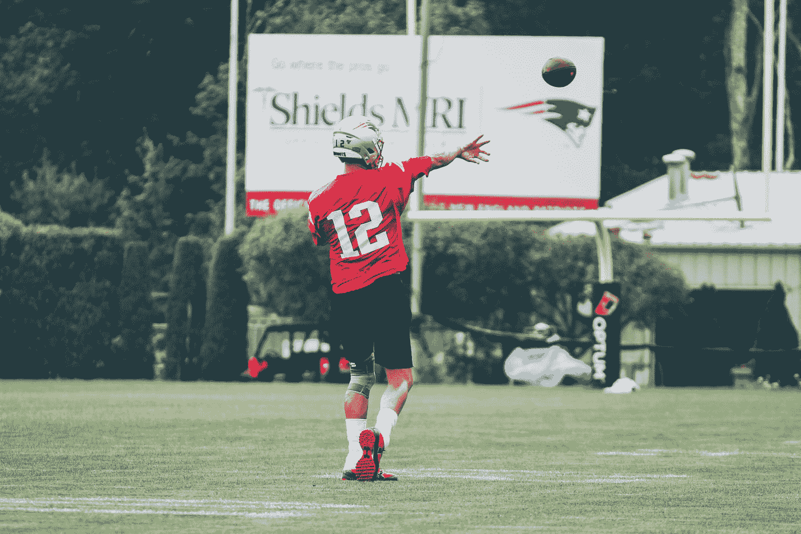

照片由[钱璐·利奇](https://unsplash.com/@cianleach?utm_source=medium&utm_medium=referral)在 [Unsplash](https://unsplash.com?utm_source=medium&utm_medium=referral) 拍摄

# 假设

为了透明和彻底，有许多因素可以决定*尝试*通过的结果。以下是一些例子:

*   球在空中飞行的螺旋以及投掷的整体质量
*   投掷的距离
*   接收器的运行速度
*   试图阻止接球的防守队员人数
*   太阳的位置(遮挡接收者的视线)
*   天气(湿球更难接住)

其中一些信息实际上是通过 NFL 的历史数据收集的。然而，这开启了一个麻烦的问题，我们可能有比*样本*更多的*特征*，从而使我们的机器学习模型受到*欠拟合*。如果我们在 NFL 中采用四分卫和接球手的任何组合，我们几乎肯定会**而不是**在每种可能的天气条件下找到完整的传球，对抗联盟中的每个防守队员，所有人都以不同的速度奔跑等等。正因为如此，我们必须做出一个重要的假设来继续这个实验:

**假设:NFL 已完成传球的历史数据在总传球码中“编码”了潜在信息(包括但不限于:天气、投掷质量、防守队员和距离)。**

然而，这个假设得到了接球手和四分卫之间长期合作关系的支持。阿朵在一起玩的时间越长，他们经历的游戏场景就越多。这对我们来说是个好消息，因为我们实际上想了解四分卫和接球手之间的“兼容性”，并翻译任何一个接球手如何与另一个四分卫合作，反之亦然。

解决了这个问题，让我们简单谈谈我们将要关注的机器学习技术。

# 非负矩阵分解(NMF)

非负矩阵分解是一种无监督的机器学习技术。在这种情况下，无监督意味着我们没有预先存在的“分数”或我们的训练数据所属的“类”。因此，我们必须首先在训练数据集中自我发现任何自然出现的模式。开头是这样的:

*   给定我们的初始数据，我们执行任何特征提取和数据预处理，使我们的数据以二维表示。对于这个实验，我们有二维数据(一个矩阵),第一轴是 NFL 接收机，第二轴是 NFL 四分卫。实际数据点(四分卫和接球手的交叉点)是通过完成传球获得的总码数。我们称这个矩阵为 *X* 。以下是这种情况的一个示例:

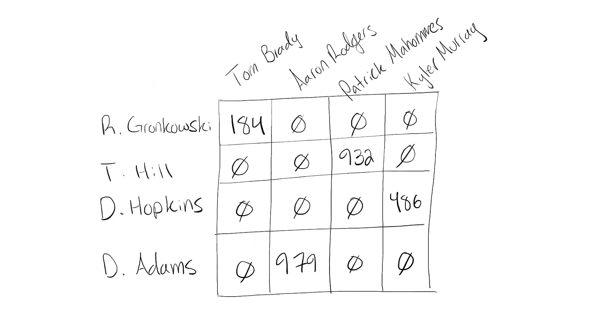

矩阵 *X* 。沿着纵轴是 NFL 接收器，沿着横轴是 NFL 四分卫。包含的数据包括截至第 11 周的 2021 NFL 赛季的总接收码数。

*   我们的 NMF 算法是“秩 k”的。这意味着我们手动选择一个值 *k* ，它对应于我们想要发现的分组的数量。稍后我会详细说明这一点。
*   矩阵(我们的初始数据)以类似于分解多项式方程的方式被分解。这产生了两个新的矩阵 *W* 和 *H* ，我们通过学习和分析来收集新的见解。

概括一下:让接球手的数量用术语 *R* 来表示，四分卫的数量用术语 *Q* 来表示。我们给定的码数数据集由矩阵 *X* 表示。也就是说:

*X* 是一个大小为 *R* x *Q* 的矩阵。 *X* 将被分解成矩阵 *W* 和 *H* ，其中 *W* 是大小为 *R* x *k* 的矩阵， *H* 是大小为 *k* x *Q* 的矩阵。这很重要，因为在矩阵乘法中，两个矩阵之间的“中间”维度必须匹配，而生成的矩阵保持“外部”维度。因此:

**给定 X，我们学习 *W* 和 *H* 使得我们满足等式*X*≈*W*X*H .***

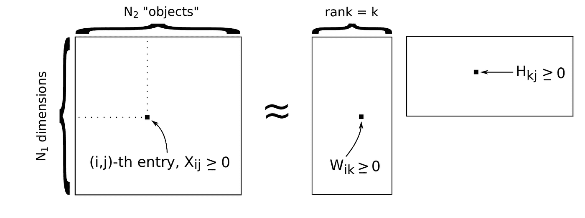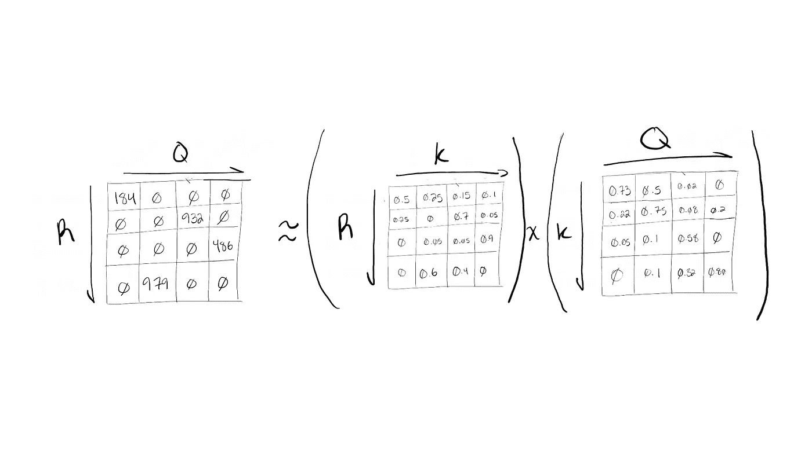

(从左至右)矩阵乘法为***X*≈*W*X*H****展示了 NMF 期望的结果。*

为此，我将使用 [scikit-learn python 包](https://scikit-learn.org/stable/modules/generated/sklearn.decomposition.NMF.html)中方便提供的 NMF 类。想了解更多关于 NMF 的信息，我推荐从这个博客开始，深入研究 NMF 的数学及其相关的训练算法。本实验中使用的 NFL 数据来自 [nfl_data_py](https://github.com/cooperdff/nfl_data_py) Python 包。

# 期望值和实验设置

这个实验的假设是，NMF 算法可以在四分卫-接收器组合中找到模式，这样，我们就可以发现 NFL 中从未见过的新球员组合，这将成为一个伟大的双人组合。同样，NMF 声明了秩 k 矩阵 *W* 和 *H* ，其中 *k* 实际上是“习得的”组或类别的数量。

如果这还不清楚，*主题建模*是 NMF 的另一个流行用例。当将 NMF 应用于新闻文章中的数据时，我们可以发现体育文章、商业文章或政治文章等主题。我们会选择 k 来代表我们想要学习的主题的数量。在 NFL 四分卫和接球手的背景下，我们将学习两个球员之间的比赛风格或一般兼容性。

矩阵 *W* 和 *H* 被随机初始化，并通过 [NMF 算法](https://en.wikipedia.org/wiki/Non-negative_matrix_factorization#Algorithms)进行更新，使得 *W* 和 *H* 的矩阵乘法近似等于矩阵 *X* 。结果， *W* 成为大小为 *R* x *k* 的矩阵， *H* 成为大小为 *k* x *Q* 的矩阵。

翻译成英语，这意味着 *W* 将会告诉我们一个接收者与我们所学的任何一个 *k* 组有多接近。H 会告诉我们每个组与某个四分卫的兼容性如何。例如，假设我们决定学习 k=4 组。让我们假设(在 matrix *W* 中)接收者 Rob Gronkowski、Tyreek Hill、DeAndre Hopkins 和 Davante Adams 在第 2 组中得分很高(高意味着接近 1)。当我们查看 matrix *H* 时，我们可能会发现四分卫汤姆·布拉迪、帕特里克·马霍斯、凯勒·默里和亚伦·罗杰斯(在他们的职业生涯中，他们各自都是四分卫)在第二组也有很高的分数。这表明第二组四分卫和接球手的任何组合都应该很好地配合，即获得许多完成和传球码数。以下是矩阵 *W* 和 *H* 的示例:

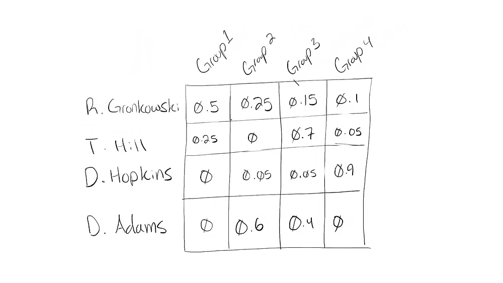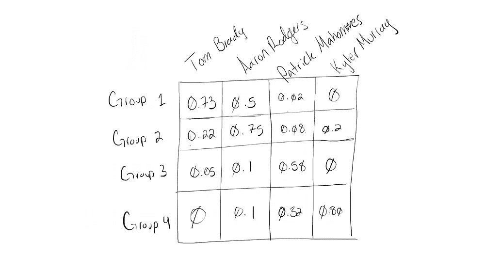

(左)矩阵 W，其中每个接收者都有一个适合他们的分数。(右)矩阵 H，其中每个四分卫都有一个分数，表示他们在给定团队中的表现。注意对于矩阵 *W* ，行总和为一。对于矩阵 *H* ，列总数为 1。这种格式使得每个矩阵中的值可以被解释为良好匹配的概率。

如果你决定查看代码(链接在本博客的末尾)，你会看到矩阵 *W* 和 *H* 在计算后被*规格化*，这意味着它们的值被按比例压缩到 0 和 1 之间。这只是让数字更容易解释；分数越接近零表示比赛越差，分数越接近一表示比赛越好。

# 超参数调谐

为了从这个实验中找到最好的结果，我研究了与 NMF 相关的四个超参数。其中包括:

1.  拟合前用于 *X* 的数据量(即*学习* ) *W* 和 *H*
2.  *k* —学习到的分组数
3.  *alpha* —用于学习 *W* 和 *H* 的正则化参数(正则化是一种可选技术，可用于对异常值如何影响算法进行更多控制)
4.  *公差*—NMF 算法的停止条件。即近似值*X*≈*W*X*h*的接近程度。较低的容差意味着更多的训练迭代(在结果部分中有更多相关信息)。

我研究了一次 hyper 参数 2 到 4，其中有少量数据用于 *X* (大约。两年的 NFL 数据)和大量的数据(大约。12 年 NFL 数据)。我们先看少量数据。

**注:**在以下情节中，使用了至少在*一次完成*中担任四分卫的所有球员，然而 Y 轴上的*平均 QB 分数*仅取自联盟中的 32 名首发四分卫——每队一名。

## 调整 *k*

组数 *k* 在数值 3 和 14 之间变化。与较高的 *k* 值相比，较低的 *k* 值工作得非常好。这可能是早期假设的结果，即各种通过条件被编码在全部完成的通过码中。这种简化可以降低该 NMF 模型的最大复杂度，使得模型将在更高的 *k* 值下填充。或者，有可能 NFL 中四分卫和接球手的组合更少，例如四分卫赢得了最有价值球员(MVP)奖，四分卫没有。应该注意的是，虽然曲线的形状基本相同，但 k 值较低时的峰值得分较高，使用的数据较少，左侧的图仅采用了最近两个 NFL 赛季的数据。

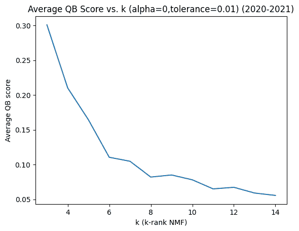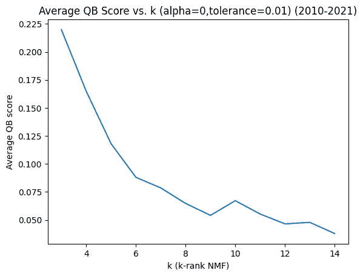

rank-k 超参数的调整

## 希腊字母的第一个字母

当达到*平均 QB 分数*时，alpha 或正则化参数显示了两年 NFL 数据的振荡行为。阿尔法值在 0 到 1 之间扫描，分数峰值在阿尔法=0.4、阿尔法=0.7 和阿尔法=0.9 附近。然而，对于 12 年的 NFL 数据，行为具有更细粒度的振荡，得分从 alpha=0.25 到 alpha=0.4 达到最小值，而在 alpha=0.5 达到峰值。这种差异可能是因为使用的数据越多，发现的异常值就越多，因此正则化的效果就越显著。这将产生一个更紧密的拟合曲线，如下图所示。

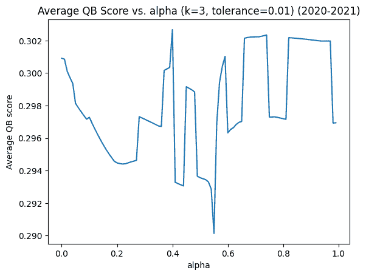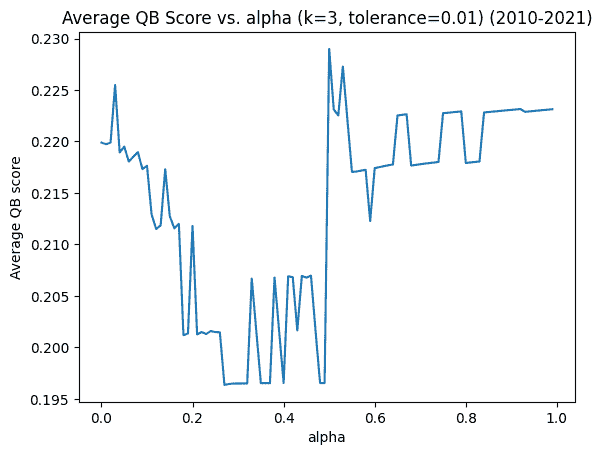

阿尔法正则化超参数的调整

## 容忍

最后公差被扫到了 0.001 到 0.01 之间。下面我们看到短期和长期数据的阶梯状曲线。尽管形状有些相似，但请注意，短期 NFL 数据的峰值*平均 QB 得分*仍然更高(略低于 0.3)，就像其他超级参数一样。峰值*平均 QB 分数*的位置也出现在不同的位置，对于长期数据出现在较早的位置，对于短期数据出现在中间位置。

较低的容差值意味着算法要经历更多的训练迭代。这些图表告诉我们，在 NMF 算法的更多次迭代之后，长期数据(也有更多的 T4 信息)具有最高的精确度。短期数据(具有少于*的*信息)以较少的迭代次数达到最高精度。这将是有意义的，因为信息更丰富的矩阵 *X* 应该花费**更多的**次迭代来学习适当的矩阵 *W* 和 *H* 。用短期数据学习 *X* 的迭代次数少，所以不用把容忍度设得太低。事实上，将它设置得太低会略微降低平均 QB 分数*,如下图左侧所示。*

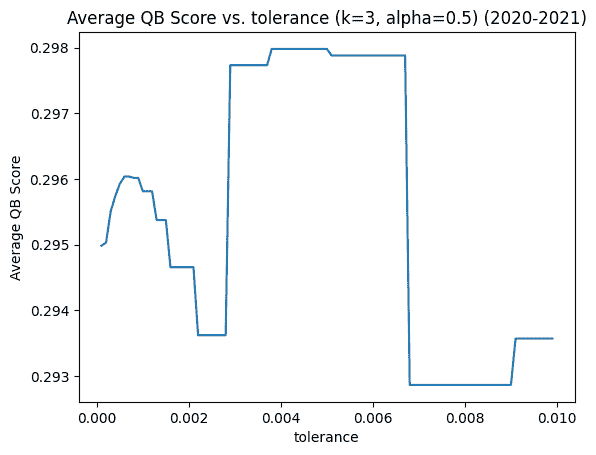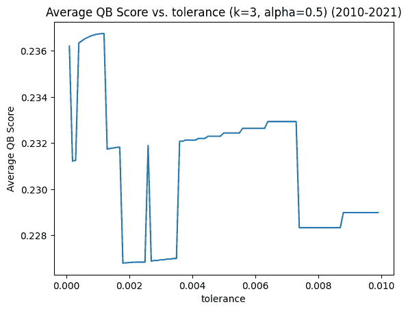

公差超参数的调整

## 概述

让我们回顾一下我们在这里学到的内容。我们已经观察到，在我们最初的 *X* 矩阵中使用更多的长期数据通常会将四分卫和接收机之间的最大兼容性得分降低约 25%。我对此的理论是，旧数据使模型偏向于历史上更成功和更长寿的球员(如汤姆·布拉迪、亚伦·罗杰斯、拉塞尔·威尔逊)。我们还发现， *k* 的较低值显著增加了*平均 QB 分数*，而与输入数据大小无关。然而，与 *k* 不同的是，正则化参数α和容差都受输入数据量的影响，其峰值*平均 QB 得分*的位置也不同。

# 结果

随着超参数的调整，让我们来看看一些四分卫-接收器组合，使用以下标准来最大化我们的准确性指标— *平均 QB 得分:*

1.  仅 2020 和 2021 赛季的 NFL 短期数据
2.  *k*:3
3.  阿尔法=0.9
4.  公差=0.005

**注:**下面列出的只是每个 NFL 球队的首发四分卫。这些接收器是其组中兼容性得分最高的前 10 个接收器。

```
GROUP 1 out of 3 k-rank group(s)average quarterback score: 0.13548700559442842Quarterbacks: [‘J.Burrow’, ‘C.McCoy’, ‘T.Brady’, ‘M.Rudolph’, ‘J.Hurts’]Receivers: [‘L.McCoy’, ‘R.Gronkowski’, ‘A.Brown’, ‘C.Brate’, ‘M.Evans’, ‘J.Mickens’, ‘C.Grayson’, ‘L.Fournette’, ‘O.Howard’, ‘C.Godwin’]— — — — — — — — — — — — — — — — — — -GROUP 2 out of 3 k-rank group(s)average quarterback score: 0.2006553965063584Quarterbacks: [‘J.Garoppolo’, ‘P.Walker’, ‘L.Jackson’, ‘P.Mahomes’, ‘T.Bridgewater’, ‘D.Carr’, ‘D.Prescott’]Receivers: [‘A.Sherman’, ‘J.Gordon’, ‘T.Kelce’, ‘E.Fisher’, ‘B.Bell’, ‘D.Robinson’, ‘T.Hill’, ‘G.Dieter’, ‘M.Kemp’, ‘N.Keizer’]— — — — — — — — — — — — — — — — — — -GROUP 3 out of 3 k-rank group(s)average quarterback score: 0.5274625854006478Quarterbacks: [‘J.Herbert’, ‘T.Siemian’, ‘M.Jones’, ‘J.Brissett’, ‘B.Mayfield’, ‘Jos.Allen’, ‘Ty.Taylor’, ‘M.Ryan’, ‘C.Wentz’, ‘J.Fields’, ‘J.Goff’, ‘R.Tannehill’, ‘Aa.Rodgers’, ‘M.Stafford’, ‘M.White’, ‘T.Heinicke’, ‘R.Wilson’, ‘K.Cousins’, ‘T.Lawrence’]Receivers: [‘C.Beasley’, ‘J.Brown’, ‘S.Diggs’, ‘J.Kumerow’, ‘T.Yeldon’, ‘I.McKenzie’, ‘S.Neal’, ‘E.Turner’, ‘J.Allen’, ‘D.Singletary’]
```

您可以看到，第 3 组的平均分高于第 1 组或第 2 组，这表明第 3 组的化学反应更强，而第 1 组和第 2 组的化学反应不太自信。1.0 分意味着近乎完美的匹配。不出所料，这往往会在 k 接近 32 时发生，在这种情况下，该算法几乎完美地学习了基于四分卫和接球手组合的 32 支 NFL 球队。此外，如果你查找 2021-2022 赛季中期的一些球员，你会注意到有许多组合，其中一个组的四分卫和接球手在同一支球队。这是意料之中的，因为联盟中先前存在的双人组已经经受住了时间的考验。换句话说，他们可以“互相担保”。除此之外，试着在你的梦幻足球队中交换队员，看看他们表现如何！

# 结论

我希望你能从这个博客中学到一些新的东西，也希望你能从这个博客中学到一些有用的东西。在这里，我们讨论了非负矩阵分解，以及如何将它应用于 NFL 的历史数据，这样我们就可以学习四分卫和接收器的组合，这些组合可能一起表现很好。

如果你想查看这个实验的源代码，可以查看这个 github 库:[https://github.com/ChristopheBrown/nfl-ml](https://github.com/ChristopheBrown/nfl-ml)