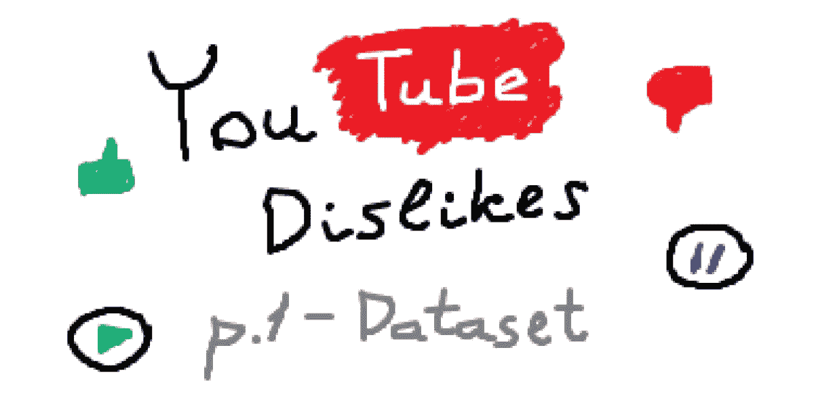
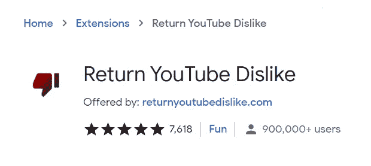
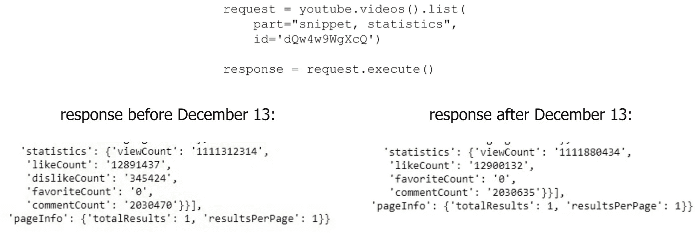
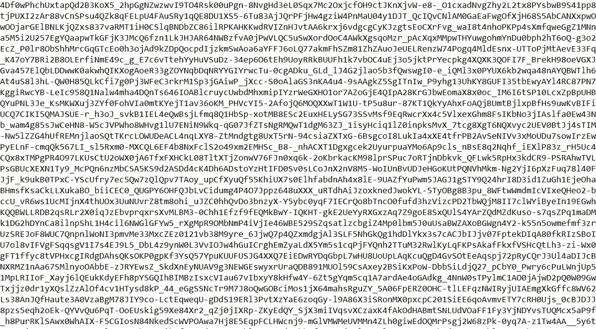
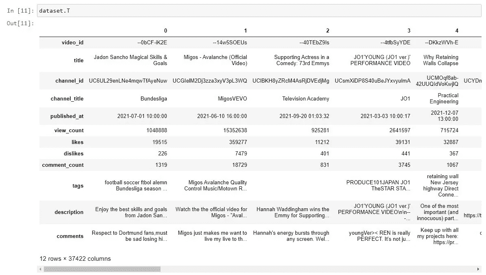
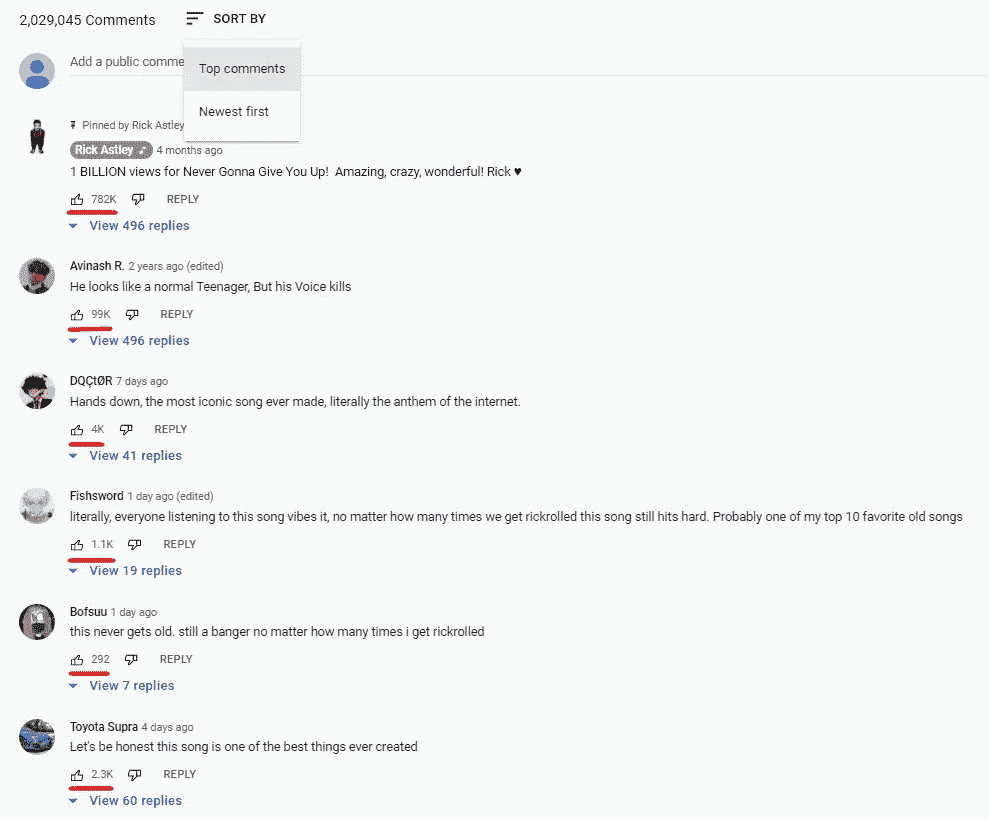

# 预测 YouTube 视频上不喜欢的数量。第 1 部分—数据集

> 原文：<https://towardsdatascience.com/predicting-the-number-of-dislikes-on-youtube-videos-part-1-dataset-9ec431585dc3?source=collection_archive---------17----------------------->

## 如何使用 Python 和 Youtube 数据 API v3 收集热门的 YouTube 数据

预览。作者图片

在本文中，您将学习如何使用 Youtube API 来获取关于视频的最新信息。

这是不喜欢预测项目的第一部分。在这里，我将收集和清理数据，并在第二部分-训练一个基于它的模型。

我收集的数据集可以在 [Kaggle](https://www.kaggle.com/dmitrynikolaev/youtube-dislikes-dataset) 上下载。
我使用的所有代码都可以在 [GitLab 资源库](https://gitlab.com/Winston-90/youtube_dislikes)中找到。

## 数据集许可证

注意 [YouTube 趋势视频数据集](https://www.kaggle.com/rsrishav/youtube-trending-video-dataset)和 [YouTube 不喜欢的数据集](https://www.kaggle.com/dmitrynikolaev/youtube-dislikes-dataset)都有 [CC0: Public Domain](https://creativecommons.org/publicdomain/zero/1.0/) 许可，所以可以免费使用。你可以在 Kaggle 上了解更多关于数据来源和数据收集方法的信息。

# 介绍

众所周知，Youtube 在 2021 年 11 月左右宣布了向用户隐藏不喜欢数量的决定。这个决定可以根据我们的意愿进行讨论，但是我们有我们所拥有的——不喜欢率现在只对视频创作者可见。

幸运的是，互联网社区人才济济，工匠们几乎立刻就创造出了一个返回厌恶的扩展。

返回 YouTube 不喜欢的 Chrome 扩展。一个[公共网页的截图](https://chrome.google.com/webstore/detail/return-youtube-dislike/gebbhagfogifgggkldgodflihgfeippi)

不幸的是，根据[官方文件](https://developers.google.com/youtube/v3/docs/videos?hl=en#properties)，从 2021 年 12 月 13 日起`dislikeCount`地产为私有。

扩展仍然工作，**但是现在它** **不能使用 API 接收官方信息**。相反，不喜欢的数量是“自己”计算的，并存储在外部数据库中。这种解决方案部分解决了问题，但它与事实相差甚远，这种差距将越来越大。

基于此，在 12 月 13 日前几天，我有了一个有趣的想法——训练一个神经网络来预测不喜欢的数量。这是这个想法的第一部分，因为像任何机器学习算法一样，神经网络需要数据。

# 重要的是——一切都与代码有关

本文片段中给出的代码将无法正常工作。嗯，会的，但是要得到一个正常工作的程序，你需要添加许多额外的验证和 try-catch 块。

> **不要从文章**中复制代码。

其目的是显示程序的简化结构。

如果您想使用代码，请浏览下面的资源库。您还可以看到每个代码片段所需的文件名。

 [## dmy tro Nikolai ev/YouTube _ 不喜欢

### YouTube 不喜欢用 Python 预测，YouTube 数据 API v3，TensorFlow/Keras。

gitlab.com](https://gitlab.com/Winston-90/youtube_dislikes) 

# 来自 Kaggle 的 YouTube 趋势视频数据集

类似的任务有现成的数据集——来自 Kaggle 的 [YouTube 趋势视频数据集。](https://www.kaggle.com/rsrishav/youtube-trending-video-dataset)

该数据集自 2020 年 8 月 12 日起每天更新，每天接收以下每个国家的约 200 个趋势视频的信息:印度、美国、英国、德国、加拿大、法国、俄罗斯、巴西、墨西哥、韩国和日本。于是，在这段时间里，这个数据集为每个国家积累了约 10 万条记录((*一年 365 天*从 2020 年 8 月到 2021 年 8 月+ *120 天*从 9 月到 12 月) **每天 200 条视频* ≈ *10 万条*)。

很明显，数据集中有重复的行(具有相同的视频 ID)，因为视频可以有一天以上的趋势。如果我们考虑到这一点，并且只读取唯一的视频 id，我们将得到所有国家的大约 *20 万条记录*。

不幸的是，数据集不包含关于评论的信息，但在我看来，它们具有最大的预测潜力。此外，关于数据集的早期行的信息是不相关的，因为今年喜欢/不喜欢的数量已经改变。

然后，我决定使用 Youtube 数据 API 构建一个类似但相关的数据集。

# 构建自定义数据集

## 请求示例

我们需要执行两个请求，一个是获取视频信息，另一个是请求评论。

一点都不难。首先，你需要[获得一个 API 密匙](https://developers.google.com/youtube/v3/quickstart/python#step_1_set_up_your_project_and_credentials)并用 pip 或 conda 命令安装`google-api-python-client`库。然后按照官方文档查看[视频()。list()](https://developers.google.com/youtube/v3/docs/videos/list) 和 [commentThreads()。](https://developers.google.com/youtube/v3/docs/commentThreads/list)方法列表()。

在代码中，首先你需要获得一个`googleapiclient.discovery.build`对象，它将允许你发出请求。在下面的代码中，您需要将 API 键分配给`DEVELOPER_KEY`变量。要了解更多，请访问[官方文档](https://developers.google.com/youtube/v3/quickstart/python#step_1_set_up_your_project_and_credentials)或一些[教程](https://rapidapi.com/blog/how-to-get-youtube-api-key/)。

当`youtube`变量被成功初始化后，剩下的只是制定一个请求并执行它。

这两个请求都返回一个 python 字典，这很容易理解，因为文档足够详细地描述了一切。

正如我之前说过的，现在`dislikeCount`属性被隐藏了——它不再出现在响应中。这是来自[YouTube _ API _ requests _ examples . ipynb 笔记本](https://gitlab.com/Winston-90/youtube_dislikes/-/blob/main/datasets/youtube_custom_dataset/youtube_API_requests_examples.ipynb)的一个例子。

2021 年 12 月 13 日前后对同一请求的响应。作者图片

## **YouTube** 视频 id

如您所见，您需要为这两个请求指定一个视频 ID。YouTube 允许你获得流行(趋势)视频的信息，但每天只有 200 个。

YouTube 视频 ID 有一个清晰的结构，我们可以迭代所有可能的组合。我们可以，对吗？为了好玩，让我们做数学。YouTube 视频 ID 由 11 个字符组成，每个字符可以是数字(0-9)、字母(a-z 和 A-Z)、破折号(-)或下划线(_)。所以总共有 64 个可能的符号(10 个数字+ 2*26 个字母+ 2 个特殊字符)。在这种情况下，可能的 id 数是 64。就是这么多:

> **73786976294838206464**

73 * 10 ⁸，73 万亿分之一，或者更好理解，730 亿亿分之一。即使我们有时间进行计算(每秒一百万次运算需要**200 万年**)，硬盘上肯定没有足够的*空间来存储这么多数据。*

当然，我们不需要这么做。由于我们有一个包含 20 万个唯一 id 的 Kaggle 数据集，这应该足够了。

YouTube 视频 id。作者图片

由于 20 万对我们来说太多了(我们将在后面看到)，我开始使用在加拿大、美国和英国流行的视频 id。那种情况下大概有三万一千个唯一 id。它们位于`unique_ids_GB_CA_US.txt`文件中。

## YouTube 数据 API 配额使用规则

现在我们有一个问题——配额使用。当然，没有人会允许你每天发出无限的请求——这就是限额的目的。虽然读取操作花费 1 个单位，但默认情况下 YouTube 允许你每天发出 10，000 个请求，参见[配额使用规则](https://developers.google.com/youtube/v3/getting-started#calculating-quota-usage)。

我为每个视频做两个请求(获得统计数据和评论)，所以理想情况下，我每天将为一个 API 键在数据集中获得 5000 个条目。听起来还不错。

但是 YouTube 会时不时屏蔽你的访问。所以你不能在 5000 个 id 上运行一个循环然后悄悄地离开。在我调试了代码并捕获了所有可能的异常(在我看来)之后，有时我仍然会得到 HTTP 403 错误(*表示服务器理解请求，但不会执行它*)，所以我必须不断地监控代码的执行。这就是为什么在下面的代码中，我不仅按视频 ID 循环，还按尝试次数循环。

所以最后，我收集了一些小的数据集，然后把它们放在一起。

## 执行时间

执行时间取决于很多因素——硬件、网速、可能还有 YouTube 本身的限制等等。我得到的最好结果大约是每秒 6 个请求，平均是每秒**2–3 个请求**。

为了收集结果数据集，我发送了大约 60k 个请求，用了**大约 7 个小时**。没有那么多，但请记住，这个时间是分布在几天内，需要几乎不间断的监督。

# 将所有这些放在一起——工作代码

据我所知，这段代码与作者用来从 Kaggle 收集 [YouTube 趋势视频数据集的代码非常相似。让我解释一下。](https://www.kaggle.com/rsrishav/youtube-trending-video-dataset)

主函数`get_video_info_by_id()`将视频 ID 作为参数，并以列表形式返回关于该视频的数据。您可以获得任何想要的字段，您只需要浏览查询返回的 python 字典。这个函数的实际代码并不复杂，它只是包含许多 try-catch 块来确保字段可用。

`request_loop()`函数遍历视频 ID 列表，并对每个 ID 执行`get_video_info_by_id()`函数。它将信息累积到一个列表列表中，并使用 [pickle 库](https://docs.python.org/3/library/pickle.html)保存。

主程序或主请求循环是多次运行`request_loop()`，每次移动 ID 列表，以免多次请求关于同一视频的信息。

上面的代码将列表保存到磁盘。要将其转换成数据集，您需要读取所有保存的文件，将它们转换成一个 *pandas DataFrame* ，并将它们连接在一起。

我不会在这里详细描述数据清理，但请记住，这是必须要做的。我检查了 ID 的唯一性、非英语字符等数据。要了解更多信息，请探索 [clean_data()函数](https://gitlab.com/Winston-90/youtube_dislikes/-/blob/main/datasets/youtube_custom_dataset/dataset_collection.ipynb)。

# 摘要

结果我设法收集了大约 **37k 张唱片**。考虑到这个想法是在 12 月 13 日之前产生的，这还不算太坏。我对这个结果很满意，因为我有一个小的但是热门的数据集。

你可以从这里得到——YouTube 不喜欢 Kaggle 上的数据集。它看起来像这样(它只是被转置以适合屏幕上的所有列):

Youtube 不喜欢数据集。作者图片

在编写这段代码的过程中，我还编写了代码来清理 Kaggle 数据集(从最后一个请求中只获取惟一的 id，删除特殊字符，等等)。你可以在库或 Kaggle 上的[中找到做这件事的代码](https://www.kaggle.com/dmitrynikolaev/youtube-trending-video-dataset-cleaning)[。](https://gitlab.com/Winston-90/youtube_dislikes/-/blob/main/datasets/youtube_kaggle_dataset/data_cleaning_kaggle.ipynb)

两个数据集具有相同的结构，因此它们可用于训练相同的模型或具有相同架构的模型。以下是其特点:

*   `video_id` -唯一视频 ID
*   `title` -视频标题
*   `channel_id` -频道 ID
*   `channel_title` -频道标题
*   `published_at` -视频发布日期
*   `view_count` -浏览次数
*   `likes` -喜欢的数量
*   `dislikes` -不喜欢的数量
*   `comment_count` -评论数量
*   `tags` -作为一个字符串的视频标签
*   `description` -视频描述
*   `comments` - 20 条视频评论为一串

All text fields contain only ASCII and Latin characters (numbers, English letters, and punctuation marks). If there are no letters left in the string after deleting these characters, this row will be deleted too. This applies to `title` and `channel_title` (for example `"伟大的视频!!!!"` -> `"!!!!"` will be deleted).

## 关于评论

值得一提的是，用最热门的评论进行预测是符合逻辑的。但是 YouTube API 不允许你获取它们。设置`video_id`时，请求中的`relevance`参数被忽略，如文档中描述的[。](https://developers.google.com/youtube/v3/docs/commentThreads/list)

即使通过解析也不可能获得最受欢迎的评论，因为即使是 YouTube 也是以无序的顺序显示的。如果你知道如何解决这个问题，请联系我或写评论。

所以事实上，YouTube 决定发送的只是这 20 条评论。但总比没有好，对吧？

YouTube 上的热门评论是无序的。一个[公共网页的截图](https://www.youtube.com/watch?v=dQw4w9WgXcQ)

由于 Kaggle YouTube 趋势视频数据集不包含`comments`字段，因此对于整个数据集，该值等于一个空格(" ")。

# 结论

为了写这篇文章，我编写并执行了允许我获得以下内容的代码:

1.  第 **137k** 行的 [YouTube 趋势视频数据集](https://www.kaggle.com/rsrishav/youtube-trending-video-dataset)的干净版本。该数据集包含 11 个县从 2020 年 8 月到 2021 年 12 月的趋势 YouTube 视频信息。
2.  客户收集的 [YouTube 不喜欢 **37k** 行的数据集](https://www.kaggle.com/dmitrynikolaev/youtube-dislikes-dataset)。该数据集包含关于 37k 视频的不喜欢的信息，这些视频同时在美国、加拿大和英国流行。
    信息是在 12 月 13 日之前收集的，这使得该数据集**成为最相关的厌恶数据集**。不幸的是，**不可能得到这样一个数据集的新版本**。

现在，我将在这些数据集上训练一个神经网络，以预测视频中不喜欢的数量。第二部分在这里:

 [## 预测 YouTube 视频上不喜欢的数量。第 2 部分—模型

### 如何(尝试)使用 Tensorflow/Keras 建立深度神经网络来预测不喜欢的数量

towardsdatascience.com](/predicting-the-number-of-dislikes-on-youtube-videos-part-2-model-aa981a69a8b2) 

# 感谢您的阅读！

*   我希望这些材料对你有用。在媒体上关注我以获得更多类似的文章。
*   如果您有任何问题或意见，我将很高兴得到任何反馈。在评论中问我，或者通过 [LinkedIn](https://www.linkedin.com/in/andimid/) 或 [Twitter](https://twitter.com/dimid_ml) 联系我。
*   为了支持我作为一名作家，并获得数以千计的其他媒体文章，使用[我的推荐链接](https://medium.com/@andimid/membership)获得媒体会员资格(不收取额外费用)。