# 用机器学习预测 NBA 比赛的结果

> 原文：<https://towardsdatascience.com/predicting-the-outcome-of-nba-games-with-machine-learning-a810bb768f20?source=collection_archive---------1----------------------->

## 我们如何使用(你也可以)机器学习来更好地理解统计在体育运动中的作用。

在决定大数据分析课程的最终项目时，我和我的合作伙伴 Jack Rosener、Jackson Joffe 希望将对体育的兴趣与整个学期学到的原则结合起来。经过几天的讨论，我们选定了一个旨在预测 NBA 比赛结果的项目。在实现我们的目标时，我们发现通过以下问题将项目提炼为以下步骤很有帮助:

1.  **收集相关数据**–我们从哪里收集几个赛季的相关球队和球员统计数据？
2.  **清理和处理数据**——我们如何有效地组合我们收集的数据，使其既可读又可用？
3.  **特征工程**——我们可以将哪些额外的指标添加到我们的数据集，以帮助任何用户或 ML 模型分别更好地理解和预测数据的结果和趋势？
4.  **数据分析** —我们能否确定数据中的任何共线性或其他关系，从而更好地为我们的预测提供信息？
5.  **预测**–哪些模型和特性对我们开发准确的预测最有用？我们关注团队还是个人的统计数据？

在我们进入工作流程的本质之前，让我们花点时间回顾和了解在这个特定主题上所做的其他工作。首先，2013 年[来自威斯康星大学麦迪逊分校的雷纳托·托雷斯](https://homepages.cae.wisc.edu/~ece539/fall13/project/AmorimTorres_rpt.pdf)着手完成与我们类似的目标，并使用不同的机器学习模型预测 NBA 数据的具体赛季结果。他使用了我们项目中的多种技术，主要是要素约简，以消除可用数据中的多重共线性，还探索了不同的模型，以探索那些具有最高精度的模型。像我们的项目一样，他选择的功能包括得分，但不像我们的项目特别关注主场和客场的输赢百分比。(我们将在后面探讨我们的特征分析。)
之前已经有很多关于这方面的精彩工作，可以在这里阅读:

> [程，葛【张，】振宇&凯班贝，摩西&纳赛尔，金布威。(2016).基于最大熵原理](https://www.researchgate.net/publication/312236952_Predicting_the_Outcome_of_NBA_Playoffs_Based_on_the_Maximum_Entropy_Principle)预测 NBA 季后赛结果。
> [琼斯，埃里。(2016)预测 NBA 比赛结果。北达科他州立大学](https://library.ndsu.edu/ir/bitstream/handle/10365/28084/Predicting%20Outcomes%20of%20NBA%20Basketball%20Games.pdf?sequence=1&isAllowed=y)。
> [法亚德，亚历山大。建立我的第一个机器学习模型| NBA 预测算法。走向数据科学](/building-my-first-machine-learning-model-nba-prediction-algorithm-dee5c5bc4cc1)。
> [NBA 的完整历史。五三八。](https://projects.fivethirtyeight.com/complete-history-of-the-nba/#lakers)

通过我们的研究，我们发现公布的最佳模型的预测准确率为 74.1%(针对季后赛结果)，其他大多数模型的准确率上限在 66-72%之间。大多数已发表的研究也集中在预测季后赛得分上——这可能会导致有偏见的数据:季后赛球队在整个常规赛的一些数据上更一致，因此季后赛比赛预期结果可能会经历更少的变化。至关重要的是，请注意 NBA 整个赛季的失望率平均为 32.1%。在季后赛中，冷门率——由常规赛胜率较低的球队定义——下降到 [22%](https://www.theringer.com/nba/2019/4/12/18307008/nba-playoff-momentum) (这实际上意味着大多数 NBA 季后赛预测模型*表现不佳*)。因为我们的项目旨在预测任何 NBA 比赛的结果，并且是季后赛不可知的，所以我们希望开发一个可以达到并有望超过 67.9%准确率的模型，并在这样做时预测一些冷门。

请随意点击这里的或者在 GitHub 上查看我们的文件[。](https://github.com/JoshWeiner/NBA_Game_Prediction)

# 收集我们的数据

我们从 Synergy Sports 的可用信息中搜集数据，该网站有自 2008-2009 赛季以来每场比赛的极其详细的球队和球员数据。由于速度限制(因为我们必须查询 12 个赛季的每场比赛的结果)，刮花了几天时间，最初被编译成 JSON 格式，最后保存为 csv 文件。

> **作者注:**我们获得了宾夕法尼亚大学资助的 Synergy Sports 的数据。不幸的是，我们无权向公众公开我们的数据。然而，我们已经编辑了一个备选数据集的列表，通过它我们可以复制和改进我们的数据:
> [【https://www.basketball-reference.com/leagues】](https://www.basketball-reference.com/leagues/) 
> [https://www.kaggle.com/datasets/nathanlauga/nba-games](https://www.kaggle.com/datasets/nathanlauga/nba-games)
> [https://www.kaggle.com/datasets/drgilermo/nba-players-stats](https://www.kaggle.com/datasets/drgilermo/nba-players-stats)

# 清理数据

我们现在把每个 NBA 赛季的球员和球队数据都保存为单独的 csv 文件。我们的下一步是读入所有这些数据，并将其组合成两个大的数据帧:一个包含过去 12 个赛季的球员统计数据，另一个包含球队统计数据。创建后，我们将清理数据帧，以删除无效的统计数据(负分钟)和对我们没什么用的列(例如，收取/承诺的费用)。

然后，我们将这些新的数据帧保存到以下 csv 文件中，这样我们(和您)就可以在重启笔记本运行时，跳过采集和清理数据的费力而冗长的步骤:

# 特征工程

这是有趣的事情开始的地方。我们的主要目标是让所有可用的数据都可以理解:整支球队每场比赛的篮板对我们没有太大帮助，除非我们可以在更高层次的分析中使用这些数据，引导我们达到最终目标——预测输赢。为此，我们试图创建五个不同的特征，用于了解我们的团队在每个赛季如何进步和退步:

1.  **Elo 评级**

这也许是现有的比较 NBA 球队实力和多个赛季表现的最佳方法。Elo 评级的计算方法很简单:所有球队都以 1500 分的中值开始，并根据每场比赛的最终得分以及比赛地点来加分或减分，分数差异、冷门和位置是权重。本质上，这是一个更复杂的输赢记录。大多数 NBA 预测模型并不考虑 Elo 评分，而是将一个简单的输赢记录与其他几个统计数据结合起来。我们希望使用 Elo 来恰当地衡量质量上的成功(和失败)，同时也认识到并非所有的团队都生来平等。
确切的公式如下:
如果𝑅_𝑖是一支球队当前的 Elo 等级，那么它在打完下一场比赛后的 Elo 等级定义如下:

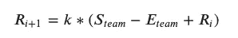

我们计算每支球队和每场比赛的 ELO，以及我们拥有的每个赛季的数据。

在这里， *S_team* 是一个状态变量:如果团队赢了就 1，如果团队输了就 0。E_team 表示球队的期望获胜概率，表示为:

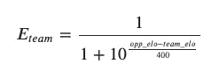

*k* 是一个移动常数，取决于胜率和 Elo 评分的差异:

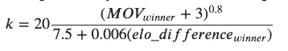

同样重要的是要注意，Elo 评级会随着赛季的变化而变化(因为所有的球队都不是生来平等的，优秀的球队往往会保持优秀，或者至少会逐渐衰落——很少会出现球队掉队或掉队的情况)。如果 R 代表一个赛季中一支球队的最终 Elo，那么它在下一个赛季开始时的 Elo 评级大约为:

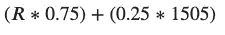

实际上，我们可以随着时间的推移查看这一指标，随机选择三支球队查看，并立即看到我们可以获得关于球队在整个赛季中的实力的关键见解:

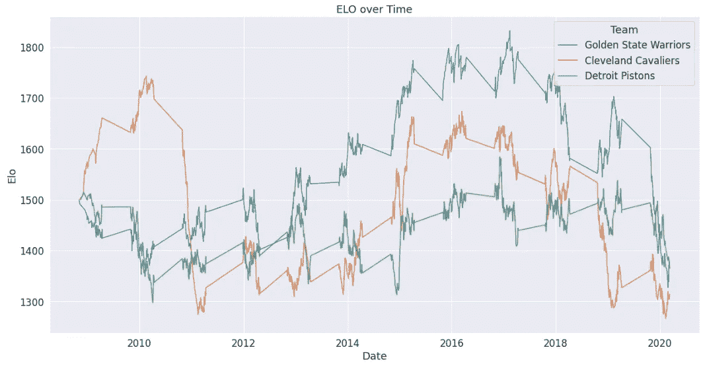

在这里，我们实际上可以看到，Elo 收视率与球队在特定赛季的表现相当吻合:金州勇士队和克利夫兰队在 NBA 总决赛中出现和对决的年份很明显是他们 Elo 收视率的高峰。我们还可以看到当时被大多数篮球分析师广泛证实的事实:西部联盟比东部联盟更艰难——正如勇士队对骑士队的高质量胜利对 Elo 的影响所展示的那样。我们也可以看到这些球队在他们的冠军赛季后迅速下滑了多少，因为他们都遭受了名册损失和伤病。(图片由作者提供)

2.**最近的团队表现(平均。最近 10 场比赛的统计数据)**

这些都是不言而喻的，我们只是简单地看一下每支球队过去 10 场比赛的平均数据。为此，我们编写了一个简单的函数来计算给定球队的统计数据和 n 场比赛的滑动平均值:

在将这些数据保存到一个新的 dataframe 中之后，我们试图将每场比赛(包含主队和客场队的统计数据)按球队划分到自己的行中，这使我们能够更容易地分组和汇总球队统计数据，并简化了现有的功能。最后，我们添加了一个 win 状态变量列来包含我们项目中最关键的度量:赢和输。

3.**最近的球员表现(平均。最近 10 场比赛的统计数据)**

我们使用与上一节类似的方法创建我们的球员最近表现数据框架，这次是用个人球员而不是团队。这创造了一个每个球员在过去 10 场比赛中表现的数据框架。

4.**球员赛季表现**

我们还试图包括整个赛季的平均球员统计数据:与球队不同，球员自己会受伤或在轮换中摔倒，这对我们来说可能更重要的是了解球员在个人比赛中的表现如何与他们的平均水平保持一致。我们将在稍后的模型中使用它，看看它是否能在团队层面上实现准确的预测。

5.**球员效率评分(PER)**

至关重要的是，正如我们通过 Elo 评级对球队所做的那样，我们希望能够使用一种结合了看似不相关的统计数据的指标来相对化球员的表现。我们的希望是，我们可以使用 [Hollinger 的球员效率评级](https://bleacherreport.com/articles/113144-cracking-the-code-how-to-calculate-hollingers-per-without-all-the-mess)来比较和预测球队球员的综合 PER 得分。在 NBA，球员很容易经历疯狂膨胀或缩小的统计数据(如每分钟得分)，仅仅是凭借他们获得的上场时间，与替补球员或首发球员的比赛，比赛次数，甚至是异常表现。我们不想仅仅因为玩家的偏差能力而仅仅依赖他们的平均水平。PER 通过用上场时间的倒数对某些游戏中的统计数据进行加权来解决这个问题，它创建了一个相对于上场时间来定义玩家表现的指标。
因此，对于每个玩家，我们根据以下公式为给定游戏中的 PER 添加了一列:

> PER = (FGM x 85.910 +抢断 x 53.897+3 PTM x 51.757+FTM x 46.845+盖帽 x 39.190 +进攻 _Reb x 39.190 +助攻 x 34.677 +防守 _Reb x 14.707 —犯规 x 17.174—FT _ Miss x 20.091—FG _ Miss x 39.190—至 x 53.897) x

# 数据分析

我们的数据分析集中在使用 Elo 评级作为我们的测试指标。从本质上讲，我们能确信 Elo 与其他统计数据相关并正确汇总吗？此外，我们使用球队数据(Elo 评分)或平均球员数据(PER 评分)来预测比赛结果是否更合适？

首先，让我们探索一下 NBA 每个赛季 Elo 收视率的密度。这告诉我们整个联盟的均等水平:如果我们可以看到 Elo 评分接近正态分布，这将表明联盟的球队相对匹配。否则，我们会看到巨大的差距和“超级团队”的发展。

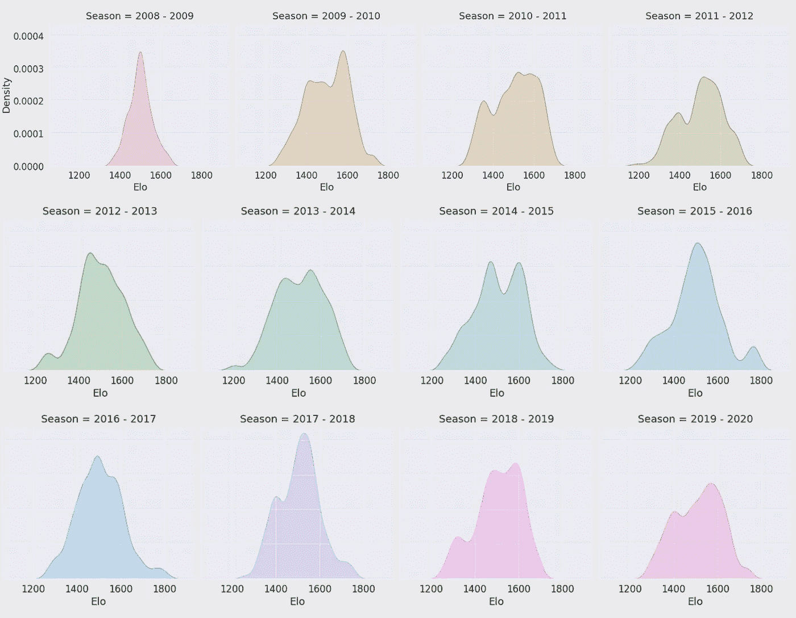

十二个赛季的联赛 Elo 密度。(图片由作者提供)

从联盟的角度来理解 Elo 评分，我们努力去看看 Elo 评分是如何与单个球队在其他数据上的表现相对照的。

首先，我们根据最近几场比赛的平均得分绘制随机球队的 Elo 分布图:

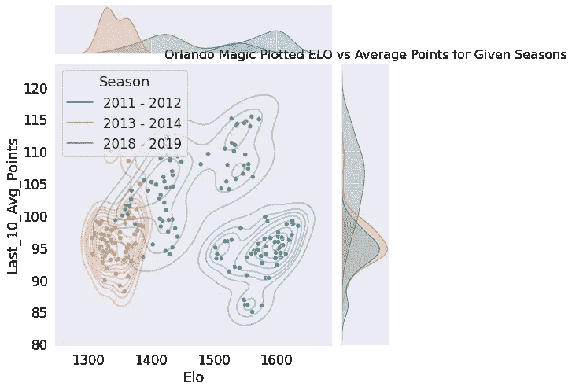

(图片由作者提供)

我们实际上可以从中看出，一支球队的平均得分与其 Elo 评级之间存在某种相关性——在一段时间内的比赛中，平均得分越高，Elo 评级似乎就越高。然而，我们还可以看到，Elo 也可能在类似的得分数字之间表现出较高的方差。因此，为了更好地了解 Elo 评分与得分的关系，我们检查了平均得分与整个联盟的赛季平均得分的对比情况——从那里我们可以确定得分是否提高了 ELO，前提是高分是相对于联盟的其他得分。为了做到这一点，让我们来看看同一支球队在同一赛季的表现，并绘制出该队相对于对手的得分分布图。

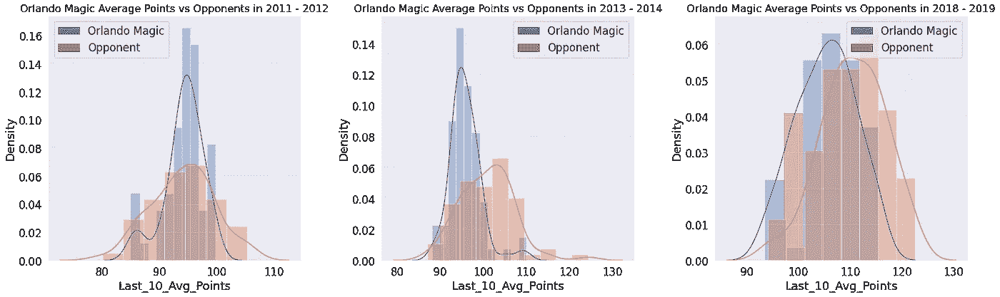

(图片由作者提供)

这证实了我们的怀疑，因为我们可以看到，当平均分数的分布大于其对手的平均分数，或者更集中在相同或更高的水平时，Elo 在这些赛季中更高。当分组接近一个相等或更小的值时，给定团队的那些赛季的 Elo 评级更低。因此，平均得分是一个单独的预测游戏结果的可靠决定因素，但当 ***相对于*** 时更好。这向我们证明了 Elo 比积分更能决定我们的胜率，因为它是一个相对的统计数据。

抛开团队统计数据，我们试图了解 Elo 对球员表现的追踪是否比团队表现更好。为了做到这一点，我们采用了一种类似的方法，用相同随机团队的平均得分来绘制 Elo 评级，这次用的是 PER。

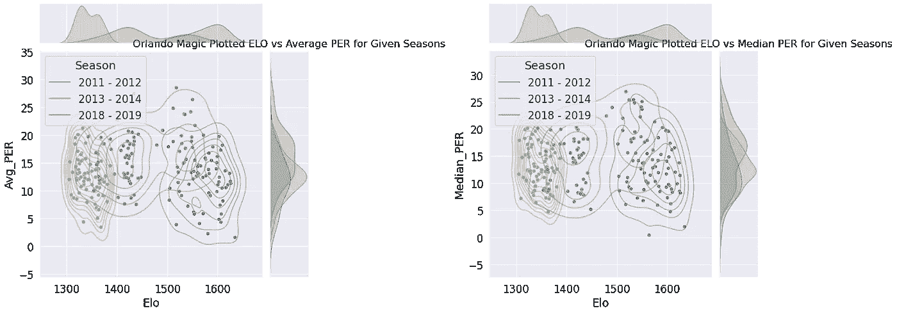

(图片由作者提供)

从绘制的数据中，我们可以看到，与对手相比，总 PER 并没有显示出与 Elo 评级所确定的团队实力有任何关联。相反，得分转化得更好——这在某种程度上是有意义的，因为球员的效率不一定与得分最多相关联——与对手的得分是赢得比赛的决定性因素，因此会影响 Elo。

我们可以通过绘制相同赛季中奥兰多魔术队相对于其对手的平均和中值 PER 评级来进一步了解这一点，并发现球队平均或中值 PER 和球队实力之间几乎没有关系。

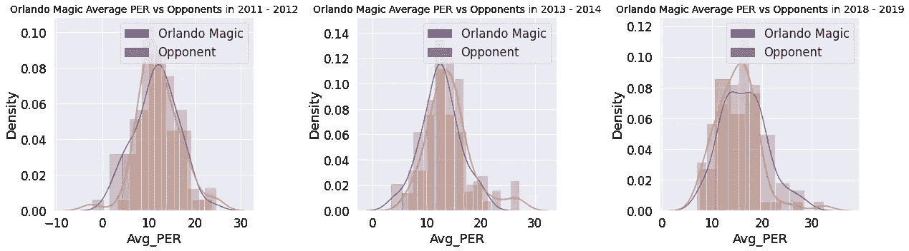

从这些和上面绘制的分布图中，我们看到平均 PER——虽然与整个赛季的 Elo 评分略有关联——通常很少向我们显示在与对手进行跟踪时，个人球员效率如何影响团队实力。(图片由作者提供)

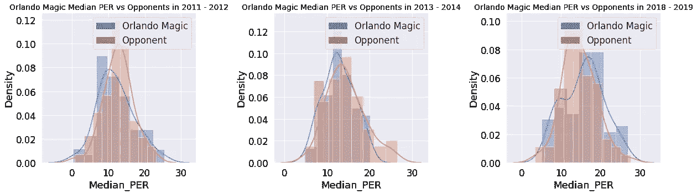

PER 收视率中值显示，在整个赛季中，与 Elo 收视率的相关性甚至更小。在这里，我们可以观察到，在获胜赛季(2011-12)，奥兰多魔术队在大多数比赛中的 PER 中位数都低于其对手，但他们却拥有近年来最高的 Elo 收视率和最佳战绩。(图片由作者提供)

从我们对相对化球队与聚合球员统计数据的所有分析中，我们清楚地看到，当预测 NBA 比赛结果时，我们的 Elo 评级及其决定因素将是训练我们模型的更好特征。

# 根据团队统计数据和 Elo 评分预测比赛结果

这里，我们的第一步是将数据分为要素和列。从我们的数据集中读取，一旦分割，我们就使用 sklearn 以 80:20 的比例将我们的数据随机分割成训练集和测试集。

我们旨在用来预测 NBA 比赛结果的第一个模型是逻辑回归模型。与线性回归模型不同，线性回归模型预测 0 和 1 之间(有时在 0 和 1 之外)的结果，[逻辑回归模型](/logistic-regression-explained-and-implemented-in-python-880955306060)旨在将预测分组为二元结果。因为我们预测的是赢和输，这种分类非常适合我们。

首先，我们使用一个简单的非参数化 LR 模型，使用 sklearn 将我们的团队统计数据和 Elo 评级作为参数:

在进行了一些超参数调优之后，我们发现使用 max_iter=131 和 verbose=2 将我们的初始测试精度略微提高到了 66.95%。对于一个非参数化的模型来说绝对不坏，非常接近我们期望的预测精度。然而，我们试图看看我们是否可以更好地调整我们的超参数，以提高我们的整体准确性。本质上，我们将在我们的数据上尝试可能的超参数的许多组合，以给出我们的 LR 模型的绝对最佳权重。

我们通过交叉验证实现了这一点:因为我们对可能要使用的参数只有一个模糊的概念，所以我们最好的方法是缩小搜索范围，并对每个超参数的大范围值进行评估。

使用 RandomizedSearchCV，我们在 2 * 4 * 5 * 11 * 3 * 3 * 5 * 3 =**59400**个可能的设置中进行搜索——因此最有效的方法是随机抽取值。

使用随机样本的最佳参数值运行我们的模型实际上将我们模型的准确性降低到了 66.27%，这向我们表明，虽然随机采样帮助我们缩小了分布内的超参数调整范围，但我们必须使用 GridSearchCV 显式检查所有组合。

在这种情况下，实现 GridSearch 只是略微提高了 LR 模型的准确性。

我们希望实现的第二个模型是一个 [RandomForestClassifier](https://builtin.com/data-science/random-forest-algorithm) ，它可以有效地用于回归和分类。在这种情况下，我们将会看到分类器是否能够构建一个合适的决策树来从给定的团队统计数据中确定胜利。

很快，我们得到 RandomForestClassifier 达到了 66.95%的初始准确率，这也是非常好的。像 LR 模型一样，我们试图调整超参数以给出更准确的结果——首先使用 RandomizedSearchCV。

与 LR 模型不同，我们发现随机化搜索改善了我们的超参数调整，使我们获得了 67.15%的更好的准确性。

以与上面类似的方式运行 GridSearchCV，我们还试图明确测试 2 * 1 * 6 * 2 * 3 * 3 * 5 = 1080 个设置组合，而不是随机抽样设置分布。GridSearch 也给了我们一个相对于基础 RandomForestClassifier 的改进，准确率达到了 67.11%。

总的来说，当对团队统计数据和 Elo 评级运行 LinearRegression 和 RandomForestClassifier 时，我们实现了**66.95%–67.15%**的胜利预测准确率。对于篮球比赛来说，正如我们之前所确定的，实际结果与预测结果相差很大，这是一个重要的结果。

# 根据单个玩家的统计数据和得分预测游戏结果

然后我们采取了不同的方法来预测比赛的结果，看看我们是否能取得更好的表现。使用我们收集的个人玩家统计数据的更大数据集，我们将训练一个模型来预测玩家在给定游戏中会得到多少分。我们将根据我们试图预测的比赛之前球员的平均赛季统计数据以及他们在过去 10 场比赛中的平均表现来预测这一点。我们已经在上面的特征工程部分创建了这些数据。我们也将在预测中使用 Elo 等级，因为对手的等级越高，玩家得到的分数就越少。一旦我们有了这个模型，我们就可以通过合计每个球员的预测得分来预测一个球队在一场比赛中会得多少分。有了这些信息，我们就能预测哪一队得分更多，从而赢得比赛。

在运行模型之前，我们需要稍微清理一下数据。对于该数据集中的一些比赛，我们有一个队的球员的统计数据，但没有另一个队的统计数据，通常只包括另一个队在赛季中的第一场比赛。因此，我们将从数据集中删除所有这些游戏。

与上述游戏不同，我们不能将数据随机分为训练集和测试集。我们希望使用单个球员的统计数据来预测一支球队的最终得分，因此我们必须让所有球员一起参加同一场比赛。为了做到这一点，我们将把我们的训练集和测试集按游戏分开，这样玩同一个游戏的玩家就可以呆在一起。大约 80%的游戏将在训练集中进行，20%将在测试集中进行:

对于玩家得分，我们将使用线性回归模型，而不是使用逻辑回归模型，因为我们希望预测一系列可能的值(得分)，而不是简单地预测输赢。我们对所有球员的 RMSE(均方根误差)是 5.56，或者相当于每个球员在他们的平均水平上完成或错过了大约 2-3 场比赛。

在测试集上，我们将每支球队每场比赛的预测得分分组，并与他们的实际得分数字进行比较。根据预测得分计算获胜游戏的数量与获胜者的数量，我们得到的比率为 1483/2528，或准确率为 **58.66%** 。很明显，正如我们之前在观察球队与对手的 PER 分布时所认识到的，球员的总体表现变化太大，无法准确预测比赛的结果，尤其是与球队的表现相比，球队的表现在比赛中往往更加一致。

# 结论和未来考虑

作为狂热的 NBA 球迷，我们认为创建一个模型来预测 NBA 比赛的结果将是一个有趣的项目，并教会了我们许多关于构建职业体育比赛结果的分类器的知识。我们能够在这个项目中利用我们在大数据分析课上学到的许多概念，包括刮擦、数据清理、特征分析、构建模型和超参数调整，我们要感谢 Ives 教授在整个学期的教学中所做的出色工作。

我们的随机森林回归模型，通过 RandomSearchCV 优化参数，给我们最高的测试精度为 67.15%。略高于 Logistic 回归模型，也远高于基于单个玩家统计的线性回归模型。使用 GridSearchCV 和 RandomizedSearchCV 优化参数既耗时又计算量大，而且对测试精度的影响很小。如果我们有更多的时间，我们可能会花更少的时间优化参数，花更多的时间选择模型。

最好的 NBA 比赛预测模型仅在大约 70%的时间内准确预测获胜者，因此我们的逻辑回归模型和随机森林分类器都非常接近当前存在的预测上限。如果我们有更多的时间，我们将探索其他模型，看看我们能得到多高的测试准确度。这些候选方法包括 SGD 分类器、线性判别分析、卷积网络或朴素贝叶斯分类器。

希望你喜欢阅读我们的作品，就像我们喜欢制作它一样——并且从中学到一些东西。