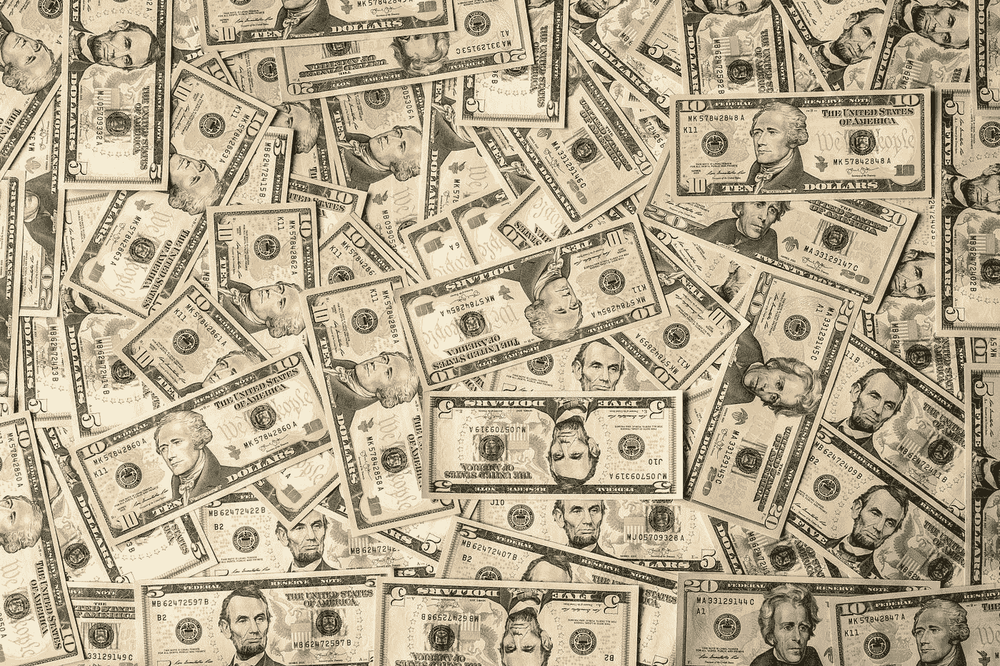
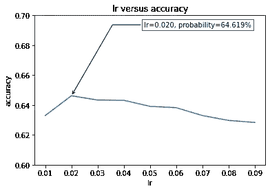
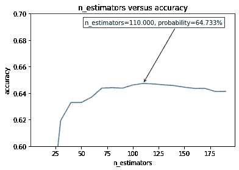
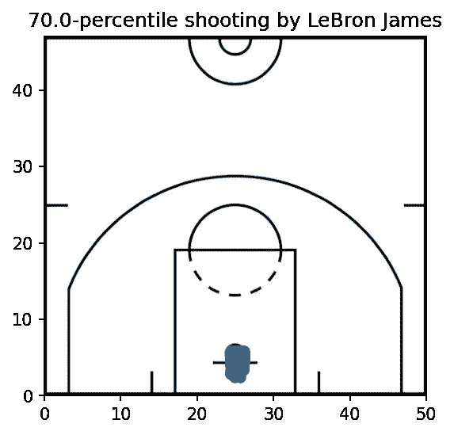
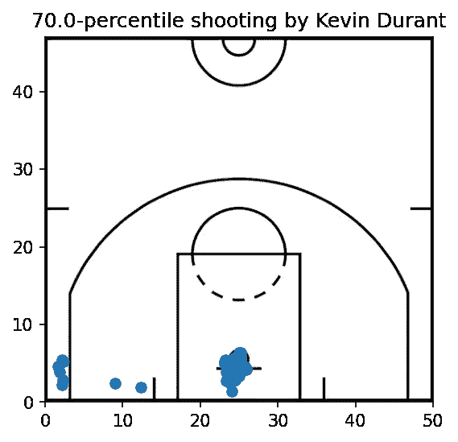
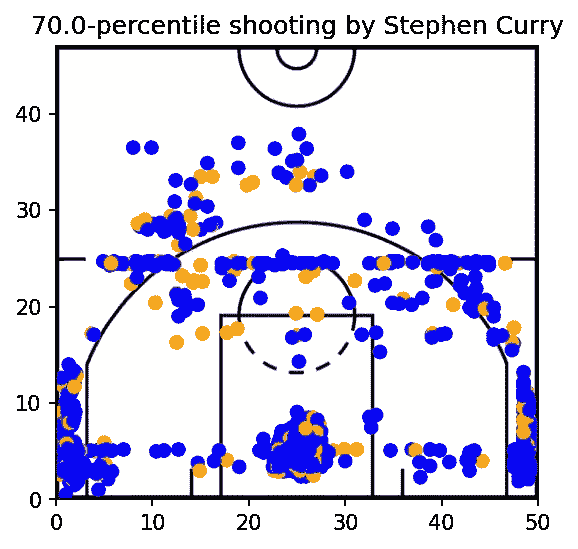

# 使用梯度提升树预测 NBA 得分概率

> 原文：<https://towardsdatascience.com/predicting-the-probability-of-scoring-a-basket-in-the-nba-using-gradient-boosted-trees-c157390fb17?source=collection_archive---------14----------------------->

# 介绍

在我关于 NBA 机器学习的第一篇博客中，我写了职业体育如何产生大量数据，打开了一条广阔的可能性之路。我们可以超越观众的感知，更深入地了解篮球运动的内部运作。

有了尽可能多的可用数据，数据科学家可以在他们创建的模型和用于创建模型的数据方面发挥创造力。这就引出了这篇博文。首先，让我们提出一个奇怪的问题——并使用机器学习来看看我们是否能接近理性的答案:

## 你为勒布朗·詹姆斯在一场篮球赛中的投篮押上了 100 万美元。你怎么能确定你会赢得奖金？

看看这个博客的配套视频:【https://youtu.be/Lxfsvw7rHgU 

由 [Alexander Schimmeck](https://unsplash.com/@alschim?utm_source=medium&utm_medium=referral) 在 [Unsplash](https://unsplash.com?utm_source=medium&utm_medium=referral) 上拍摄

# 统计数据

我们想使用的信息会给我们一个强烈的暗示，詹姆斯是否会得分。撰写本文时，[勒布朗詹姆斯职业生涯投篮命中率 50.4%](https://www.basketball-reference.com/players/j/jamesle01.html)。粗略地说，这意味着如果我们回顾他的整个职业生涯，可以追溯到 2003 年，每次他试图投篮，他得分的几率就像扔硬币一样。如果我们手上有 100 万美元，那就不好了。我们需要让天平向我们这边倾斜。

NBA 中的天才有各种各样的类型，其中一个例子就是看到不同的球员有不同的打球风格和投篮偏好。这方面的一些例子包括:

*   右手对左手射击
*   射击远程对中距离
*   在压力下表现良好(例如在势均力敌的比赛的最后几秒)

信不信由你，这些信息，甚至更多，都是从 NBA 的统计数据中获取的。我们可以利用这些数据，看看如何找到下注的正确篮子。说到这里，我要提到的是，此后在这个博客中引用的所有数据都来自 https://www.basketball-reference.com/。

为了不使事情变得过于复杂，我们将只坚持两个标准来构建我们的模型:**射击尝试的位置**和游戏的**阶段。**我们的模型将使用勒布朗·詹姆斯职业生涯投篮数据中的这些特征:

*   尝试击球的 XY 坐标(即球场上的位置)
*   运动员到篮筐的距离
*   射击发生时该季度的剩余时间
*   不管是否在半场结束前尝试投篮
*   不管镜头是否在第四节

最后两个特性是为了给游戏的舞台增加更多的背景。特别是在势均力敌的比赛中，那些最后一分钟或最后一秒钟的投篮会极大地影响比赛的结果，我们希望抓住这一点。这意味着我们假设游戏时间结束时得分的篮子更有价值，玩家会更有动力得分。

# 梯度增强树

我们将尝试使用梯度增强树来回答这个问题。这是一种用于监督机器学习的决策树。

**决策树**是一个广泛使用的算法家族，从输入特征中学习“数学流程图”。**梯度提升树**是一种变体，其中决策树被连续构建，并且每棵树都试图纠正前一棵树的错误。一棵树可能看起来像这样:

可用于确定得分可能性的众多决策树之一。用 GraphViz 可视化。

上图中，我们可以看到一棵树，它的值是从输入要素中获取的。它向我们展示了每个值如何让我们更接近树的决策。“样本”字段告诉我们有多少样本(或篮子尝试)属于这一类别。“值”字段(以及颜色阴影的暗度)告诉我们这棵树的更重要的指标。使用的总树数将等于下面描述的 *n_estimators* 参数。

在这里了解更多关于梯度增强的信息:[梯度增强解释【演示】(arogozhnikov.github.io](https://arogozhnikov.github.io/2016/06/24/gradient_boosting_explained.html)

我们将花时间在我们的树中调整两个超参数:

*   ***n_estimators*** :要执行的升压阶段数(换句话说，按顺序排列的树的数量；我们从一棵树到下一棵树“推进”或学习)
*   ***learning _ rate***:每棵树从上一棵树学习的强度

在这个实验中，我们希望该算法能够学习球场上的“最佳投篮点”，以及标记最佳投篮时间的窗口。它可能看起来像“在比赛还剩 3 分 26 秒时，短距离投篮将有 73%的机会得分。”

我喜欢决策树的一点是，它们在概念和分析上更容易理解。我们在寻找投篮命中率最高的机会。这将在树的某个节点，并且存在我们的特征集的某种组合，它将导航我们到那里。

# 结果和案例分析

在这篇博客中，我们将花更多的时间讨论方法和结果，而不是代码设置。如果你对源代码感兴趣，我有一个 GitHub 库链接在这个博客的末尾。

## 列车测试分离

勒布朗·詹姆斯在 2021-22 赛季的投篮次数比任何现役球员都多。这对我们来说是一个好消息，因为我们可以使用他所有得分的篮筐和他所有错过的篮筐来训练一个模型，以了解他在哪里和什么时候表现最好。我们使用的特征对于每次尝试都是已知的，包括尝试是否成功。为了训练以下模型，我采用了标准的训练-测试-分割，其中 75%的数据用于训练，25%用于测试。重要的是，在分割数据之前，先对数据进行洗牌，以避免我们的模型偏向于只从詹姆斯职业生涯的前 3/4 学习。

## 超参数调谐

接下来，为了最大化成功的可能性，我进行了一个简短的实验来观察*学习率*和 *n 估计量*的影响。这有助于选择最佳模型。

我使用 0.01 到 0.1 之间的学习率，步长为 0.01。准确度迅速上升，然后逐渐下降，一直保持在 2%的范围内。最高准确率为 64.619%，学习率为 0.02。

调整 learning_rate (lr)超级参数

接下来，我调整了 n_estimators 参数。准确率稍高，达到 64.733%。这是使用 learning_rate=0.02 找到的。

调整 n_estimators 超参数

## 模型检验

随着我们的模型准备好行动，我们可以向它输入测试数据，以检查勒布朗在给定他的球场位置和比赛时间的情况下投篮的概率。我应该注意到，大约 64%的预测准确率是勒布朗所有投篮(即用于训练模型的投篮)的平均*预测率。这意味着有*特定的*投篮场景，在这些场景中，模型可以更准确地预测一个篮筐是否得分。我们可以利用这些场景赢得现金奖励。*

有成千上万的样本可供选择，我发现最有见地的方法是看他投篮的上百分位数。换句话说，我们可以规划出勒布朗至少有 70%的可能性投篮得分的投篮场景:

勒布朗·詹姆斯的 70%投篮命中率(坐标轴是 X-Y 球场坐标)

没什么好惊讶的。勒布朗身高 6 英尺 9 英寸，体重 250 磅。在他的职业生涯中，他很少直接冲向篮筐，从干净利落的上篮到高空扣篮。他最可靠的投篮应该就在篮筐下面。蓝色斑点由 609 个独特的镜头组成。有趣的是，这些镜头只发生在比赛时间还剩 1 分 30 秒到 5 分 07 秒的时候。

因此，我们现在有了一个答案:尽管勒布朗·詹姆斯的投篮命中率为 50.4%，但如果我们为勒布朗·詹姆斯的投篮投入 100 万美元，在比赛还剩 1 分 30 秒至 5 分 07 秒的时候，我们有 70%的机会在篮筐下成功。

其他玩家呢？

我们可以将这个算法应用于联盟中的任何球员。最理想的是那些更有得分经验的人。让我们简单看看另外两位高产射手:凯文·杜兰特和斯蒂芬·库里。

凯文·杜兰特 70%的投篮命中率

凯文·杜兰特和詹姆斯有着相似的身材，因此在篮筐下轻松得分。然而，众所周知，他也是“T2”【easy money sniper】的远射手。如果你对凯文·杜兰特下同样的赌注，你会有更多的位置可供选择，你会希望他的投篮发生在比赛还剩 2.8 秒到 5 分 33 秒之间。说说离合器吧！

斯蒂芬·库里 70%的投篮命中率(第四节橙色部分)

如果你碰巧跳过这篇博客中的文字，只看这些情节，你仍然会看到斯蒂芬·库里在投篮方面独树一帜。上面标绘的是库里的 613 次投篮。令我惊讶的是，斯蒂芬·库里的职业生涯投篮命中率比勒布朗·詹姆斯还要低，只有 47.6%。那么*为什么*我们可以从几乎任何地方选择斯蒂芬库里的镜头呢？

因为斯蒂芬·库里*可以*从任何地方投篮。

他的投篮不像詹姆斯那样集中。他简直是全能的，几乎可以在球场的任何地方落地。如果你想把赌注下在库里身上，请确保比赛还剩 0.8 秒到 11 分 53 秒。这实际上是整个游戏中的任何时间！我还用橙色标记了可选的第四季度照片。鉴于他在第四节的表现仍然覆盖了整个球场，库里已经成为这项运动有史以来最可靠的射手之一。

## 模型限制

每一个伟大的机器学习模型都有其局限性。如果我们在这里谈论职业篮球比赛，我们应该承认，在我们的模型中有许多量化和非量化的变量没有考虑到，这些变量可能会影响比赛的结果或投篮的结果。一些例子包括:

*   有争议的射门:在一场比赛中，一名球员可以尝试在完全无人防守的情况下射门，或者有多达 5 名防守队员防守。显然，更多的防守者意味着更强硬的投篮和更低的得分概率。
*   受伤历史:手或脚受伤的球员可能不愿意从一侧或另一侧投篮，即使这是他们占优势的一侧。他们也可能选择避免激烈的接触，这很可能发生在篮下([有些仍然盛行，但是](https://www.youtube.com/watch?v=s-Cny6Qqaa8&ab_channel=BAKETS))。
*   常规赛与季后赛:虽然这个博客中描述的模型考虑了常规赛和季后赛中的投篮，但数据本身没有明确的区别。众所周知，一些球员在 NBA 季后赛中提升了他们的比赛水平，或者总体上打了更多的时间，这可能会影响他们在比赛中的表现，无论是好是坏。

为了了解球员在压力下投篮时的心态，还需要进一步的研究。我们可以额外考虑球员的生理状况，比如他们能跳多高，他们手腕和肩膀的角度，或者他们对球网的可见度。然而，这一数据更为稀缺。

## 偏见、过度适应和 NBA 篮球的背景

在这个实验的概念验证阶段，我向我的推特粉丝分享了一个[视频，显示勒布朗·詹姆斯实际上有高达 98%的可能性投篮。纯粹从数字的角度来看，它*是* *可能*为概率高。一个场景可能是这样的:](https://twitter.com/christophejmb/status/1457378199768346632)

众所周知，沙奎尔·奥尼尔在他 19 年的联盟生涯中几乎从来没有投过三分球。在总共 22 次尝试中，他只有一次得分。相反，他 22 次出手都得了分，而且他的三分球命中率接近 100%。纵观奥尼尔的所有尝试，他尝试了超过 19000 次投篮，其中大部分是两分投篮，平均得分率为 58.3%。如果他的短程两分篮成功率为 58.3%，而他的远程三分尝试成功率为 100%，你会期望我们的模型将远程三分球视为有效的保证投篮。这是模型*偏差*，，因为我们高估了进行三分尝试的真实可能性，这被广泛认为是更困难的投篮。

另一种情况，正如我的视频中的情况，是过度适应训练数据的结果。这突出了调整超参数的重要性，以选择能够在专业运动环境中执行的适当模型。NBA 的竞争性质可能会导致像这样的高概率永远不会见天日。

# 结论

为了重述这篇博客，我们报道了 NBA 球员如何有不同的得分可能性的时空分析。使用梯度增强树，我创建了一个模型，该模型将考虑球员在球场上的位置以及本季度的剩余时间，以预测相应组合产生得分投篮尝试的可能性。在分析中，我们发现像勒布朗·詹姆斯这样的球员经常在接近篮筐的地方投篮，像斯蒂芬·库里这样的球员甚至比我们想象的更好，几乎在任何时间，任何地方都能可靠地投篮。

希望你在博客里学到了新的东西，学到了有用的东西。如果您对查看源代码感兴趣，可以在这里找到我的 GitHub repo:

[ChristopheBrown/nba-ml:所有 nba 机器学习演示的主存储库(github.com)](https://github.com/ChristopheBrown/nba-ml)