# 使用 Spotify 音频功能和 Pollstar 数据预测卖票艺术家

> 原文：<https://towardsdatascience.com/predicting-ticket-selling-artists-using-spotify-audio-features-and-pollstar-data-2e231dec4713?source=collection_archive---------27----------------------->

## 你的艺人会卖票吗？

作者图片

我们为什么关心？

作为一名人才购买者和音乐会推广者，预测门票销售对我来说是一项日常任务。票房记录、流媒体数量、社交媒体关注者数量是音乐行业用来决定艺术家和节目是否值得投资的常用指标。问题是:如果一个艺术家没有票房历史，没有活跃的社交媒体账户，或者没有流媒体历史，那该怎么办？还有其他我们可以考虑的指标吗？我们能通过一个艺术家的音频特征而不是流媒体数量来预测他的销售潜力吗？

**项目**

这个项目的目标是通过使用 Spotify 音频功能来预测一个艺术家是否有潜力成为顶级售票艺术家。这个项目包括四个部分:(Spotify 数据的数据分析(2)卖票艺人和非卖票艺人的特征比较(3)音乐流派分析(4)机器学习模型。

**数据来源**

这个项目中使用的数据集来自两个来源:Spotify 和 [Pollstar](https://www.pollstar.com/concert-pulse) 。Pollstar 是音乐会行业的贸易出版物。我从 Pollstar 获得的数据集包括 834 位艺术家的每周票房记录，包括平均票房总收入、平均售出门票、平均票价等。从 2017 年-2020 年初。

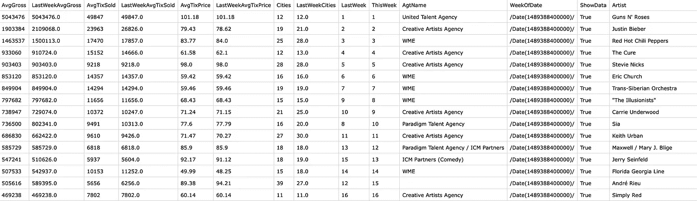

Pollstar 数据集

从 [Kaggle](https://www.kaggle.com/yamaerenay/spotify-dataset-19212020-160k-tracks) 获得的两个 Spotify 数据集包含(1)1921 年至 2020 年间发布的 16 万多首歌曲的音频特征和(2)每位艺术家的音乐流派。

**Spotify 数据的数据分析**

了解音乐的趋势可以帮助投资者评估并引导他们更好地投资音乐会行业。因此，我决定首先只对 Spotify 数据集进行数据分析，以探索每个音频特征之间的关系。有关每个音频特性的定义，请在此处查看[。](https://developer.spotify.com/documentation/web-api/reference/#endpoint-get-several-audio-features)

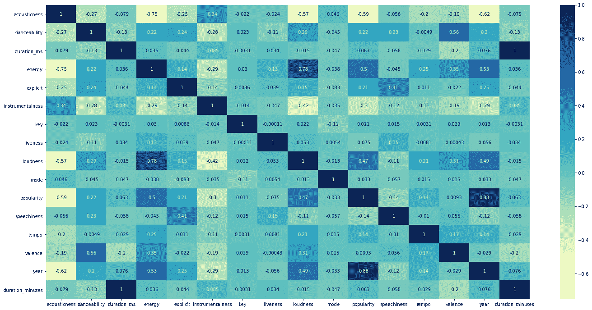

音频特征相关矩阵

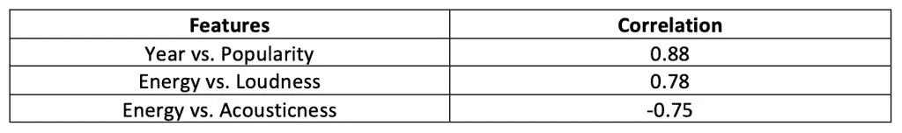

相关图显示，年份与流行度、能量与响度以及能量与声音高度相关。

我对每个音频特性如何随时间变化很感兴趣，所以我创建了一些折线图来检查特定时代是否有任何趋势。

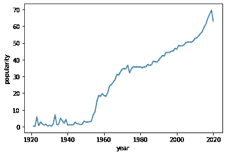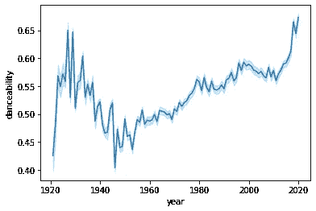

从图表上看，似乎一首歌越新，受欢迎程度越高；然而，请注意，Spotify 计算其受欢迎程度的方式不仅基于总流媒体数量，还基于歌曲最近的播放次数。一些歌曲可能有较高的流计数，但最近没有播放太多。在这种情况下，受欢迎程度可能会下降。所以，我不会把新歌比老歌流行的结论简单化。

从 1935 年到 1950 年，可跳舞性显著下降，1950 年后逐渐上升。

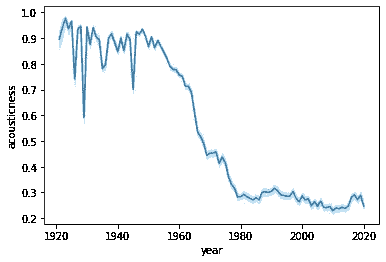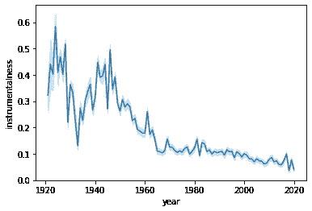

艺术家制作越来越少的原声和器乐曲目。

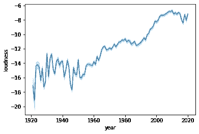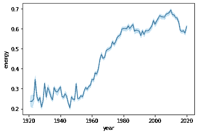

现在的音乐比以前更响亮，更有活力。

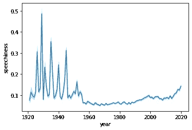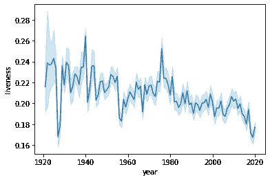

1950 年后的歌曲比 1950 年前的歌曲口语词少得多；然而，2000 年后，歌曲中的口语单词开始增加。赛道的活跃度会有波动，但总的来说，活跃度会随着时间的推移越来越低。

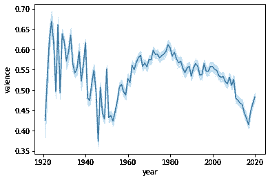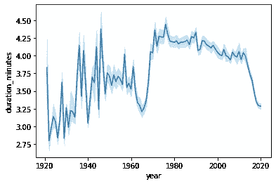

积极的音乐氛围在 1940 年后显著下降，在 1950 年左右开始上升，但在 2000 年后又开始下降。20 世纪 60 年代后，歌曲的时长显著增加，但在 2010 年后开始减少。

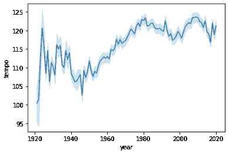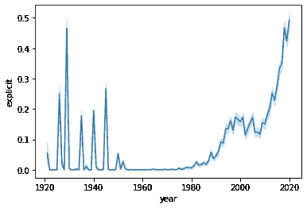

1950 年后，曲目的节奏越来越快。2000 年后露骨歌词明显增多。非常有趣的是，在 2000 年后的很短时间内，显式轨迹增加了，这是最近才发生的。我很好奇显性和其他音频特征之间的关系。我发现，虽然显性歌曲只占总曲目的 9%，但这些歌曲的平均受欢迎程度比非显性歌曲高 55%。此外，明确的轨道比非明确的歌曲有更高的可舞性和能量。

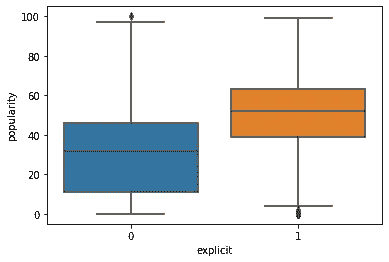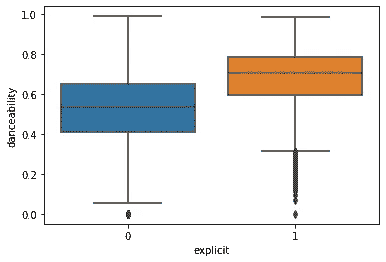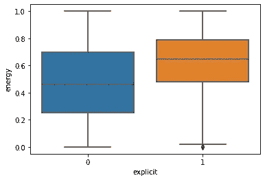

在探索了年份和音频特征之间的关系后，可以看到图表中显示的一些转折点出现在同一时间段。我想知道这些转折点是否与社会环境/背景有关。以下是我对此的想法:

*   **战前音乐 vs 战后音乐**

一些音频特征在 1940-1950 年间发生了显著的变化，例如可跳舞性、速度、响度和能量的下降。这种变化是由那段时间的战争或其他社会事件引起的吗？

*   **说唱音乐的兴起**

该表按流派降序显示了不同年份的显性歌曲数量，2000 年以后的显性歌曲多为 hip hop 和 rap 音乐。露骨歌词的增加与嘻哈音乐的兴起有关吗？

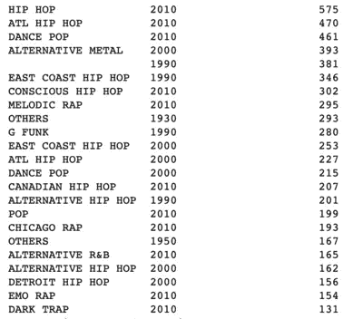

*   **流媒体时代**

一首歌时长的缩短很可能与流媒体时代有关。流媒体服务对艺术家创作音乐和获得报酬的方式产生了巨大影响。这种影响使得艺术家创作出能在短时间内吸引听众注意力的作品。我已经开始怀疑抖音是否会让音乐变得更短。

**顶级卖票艺人与其他艺人的特征对比**

**预处理**

在从 Spotify 数据中获得一些对音乐趋势的见解后，我想探讨一下顶级售票艺术家和其他艺术家之间每个音频功能的差异。经过一些数据清理后，我在艺术家栏上合并了 Spotify 数据集和 Pollstar 数据集。最初包含在 Pollstar 数据集中的艺术家将被分配到下面提到的 top_artist 列中为“是”，其余的艺术家将为“否”。

**特色工程**

我添加了以下用于探索性数据分析的列。

*   top_artists: YES 表示某个艺术家在 Pollstar 数据集中；否则，没有。
*   active_years:一个艺术家已经发行了多少年的歌曲。
*   发行数量:一位艺术家在 Spotify 上有多少首歌曲。
*   duration_minutes:以毫秒为单位的音轨时长转换为以分钟为单位的时长([' duration _ ms ']* 1.66666666667 e-5)。

如前所述，我的目标是通过艺术家的音频特征来预测他们的售票潜力，所以我根据每个艺术家聚合了数据集，以获得每个特征的平均数和标准差。

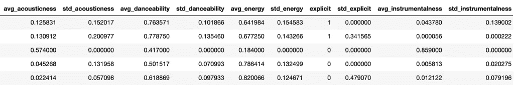

以下是顶级卖票艺人和其他艺人的特征对比:

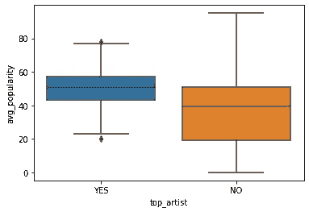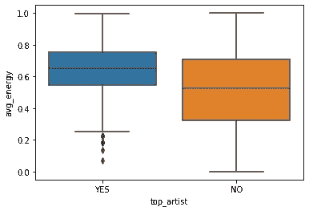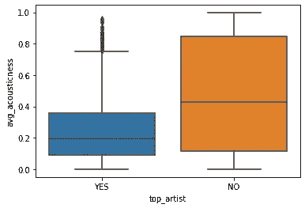

顶级卖票艺人的曲目，人气更高，能量更大，声学更弱。

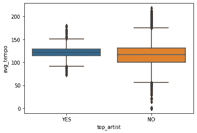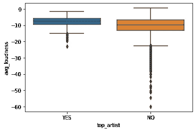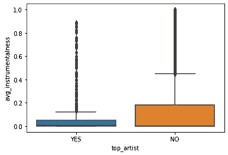

顶级卖票艺术家的曲目速度稍快，声音更大，乐器演奏更少。

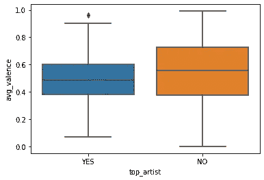

顶级卖票艺人的曲目稍长，也不那么正面。

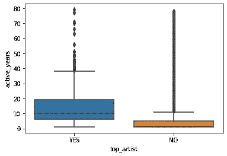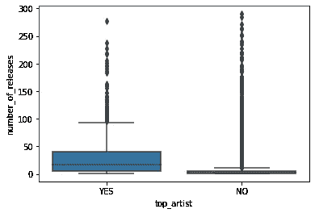

平均而言，顶级卖票艺人在市场上活跃的时间更长。顶级卖票艺人在市场上活跃了 14 年，相比之下其他艺人只有 6 年。顶级卖座艺人平均发行 34 首歌曲，相比之下，其他艺人平均发行 7 首。

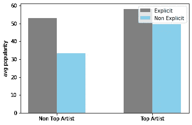

根据这个图表，平均而言，顶级卖票艺人在 Spotify 上的受欢迎程度更高。然而，无论艺术家是否销售，发布露骨内容的艺术家比在 Spotify 上发布非露骨内容的艺术家更受欢迎。

**音乐流派分析**

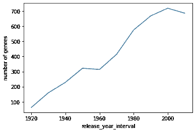

总的来说，这些年涌现出越来越多的音乐流派，但我更感兴趣的是顶级卖票艺人演奏的顶级音乐流派。请注意，我并没有用 Spotify 的“流行度”来定义哪些流派更受欢迎；相反，我用每个流派的曲目数量来定义不同年份流行的音乐流派。Spotify 上的流行度功能定义了每首歌曲的流行度，但在某些情况下，高流行度歌曲的风格可能不会得到广泛认可。这就是为什么我宁愿用制作了多少首歌曲来定义每个流派的受欢迎程度，而不是用 Spotify 功能来定义受欢迎程度。

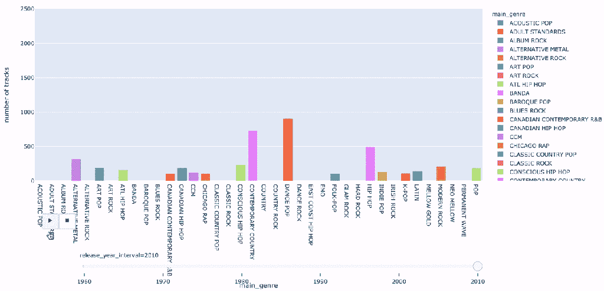

访问[此处](https://yilinglin597.github.io/pollstar_spotify_project/index.html)查看交互式仪表盘！

上面的[互动图](https://yilinglin597.github.io/pollstar_spotify_project/index.html)显示了顶尖艺术家的音乐流派在不同的年代演奏。你还可以看到音乐流派的流行程度是如何随着时间的推移而变化的。摇滚乐在 70 年代和 80 年代统治着这个行业。然而，90 年代以后，随着流行音乐和嘻哈音乐开始主导市场，摇滚乐越来越少了。韩国流行音乐和拉丁音乐最近也开始获得认可。

我在用于机器学习的数据集中没有包括音乐流派。在这个数据集中有大约 1000 种不同的音乐流派，所以要对这些流派进行重新分类需要大量的时间和工作。这甚至可能是一个单独的项目，所以我期待着在未来从事这项工作，并看到将流派添加到我的机器学习数据集中的不同结果。

**机器学习模型**

我用于训练模型的这个数据集是一个不平衡数据集。该数据集包括我们从 Pollstar 数据集了解到的 834 位顶级售票艺术家，以及其他 18851 位非售票艺术家。

**数据插补**

标准差列中有一些空值。标准差栏中的空值仅仅意味着一些艺术家在 Spotify 上只有一个音轨，因此无法计算每个音频特征的标准差。因此，我用 0 替换了空值。我还虚拟了目标变量(1: top_artist，0: non top_artist)。

**型号**

在这个项目中使用了两个模型:(1)随机森林分类器(2)逻辑回归。

**随机森林分类器**

Auc_roc 评分是评价模型性能的指标之一。然而，由于这是一个不平衡的数据集，auc_roc 分数单独可能无法很好地衡量性能。在这种情况下，我会考虑精确度和召回率。精确度和召回率分别解释了正确预测的比例和正确预测目标类的程度。我在进行随机森林分类器时运行了几次 GridSearch，并将其缩小到三个结果。这三种模型之间的得分差异不大，但假阳性率和假阴性率存在差异。

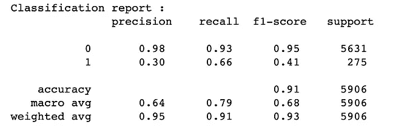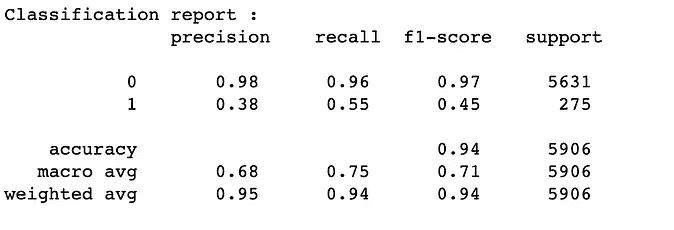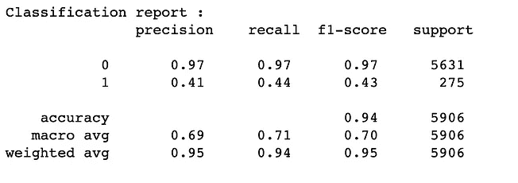

从左至右:型号 1、型号 2、型号 3

**型号 1:**

*   交叉验证得分(auc_roc): 0.92
*   训练分数(auc-roc): 0.98
*   测试得分(auc-roc): 0.91
*   假阳性率:0.07
*   假阴性率:0.33

**型号 2:**

*   交叉验证得分(auc_roc): 0.92
*   训练分数(auc-roc): 0.99
*   测试分数(auc-roc): 0.90
*   假阳性率:0.04
*   假阴性率:0.45

**模型 3:**

*   交叉验证得分(auc_roc): 0.91
*   训练分数(auc-roc): 0.99
*   测试分数(auc-roc): 0.90
*   假阳性率:0.03
*   假阴性率:0.55

**特征重要性**

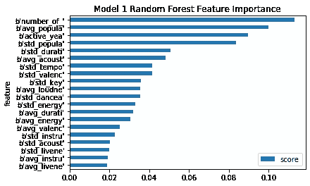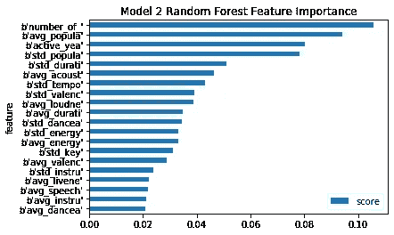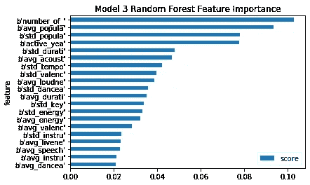

这三个模型的特征重要性也是相似的。发行数量、平均受欢迎程度、活跃年限是进行预测时的三大指标。这三个特征的得分也远远高于其他特征。

**逻辑回归**

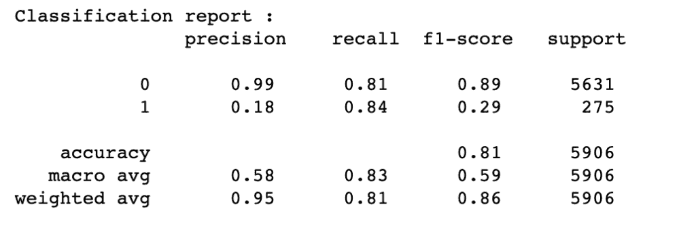

逻辑回归的性能不如随机森林分类器，所以我们不考虑这个模型。

我建议选择精度最高的模型作为我们的最终模型。在这种情况下，它将是来自随机森林分类器的模型 3。由于预测一个非卖票艺人成为顶级卖票艺人的成本高于预测一个卖票艺人成为非卖票艺人的成本，我们应该真正关注我们的模型能够多精确地检测到卖票艺人。例如，你会期望为顶级卖票艺术家的演唱会或巡演在场地、设备、员工、招待等方面花更多的钱；然而，如果模型作出了错误的预测，很可能会失去你投资的钱，因为门票销售不会像你预期的那么好。

**结论**

音乐对社会环境和语境很敏感。虽然我们有先进的技术来帮助我们预测艺术家的表现，但评估你的艺术家是否符合当前的社会环境或背景与模型分数一样重要，甚至更重要。

发行数量、平均受欢迎程度、活跃年份是我们模型中最重要的特征。基于我们的探索性数据分析，这三个特征也显示了卖票艺人与其他艺人的显著差异。然而，在我的探索性分析中，显式是一个非常明显的特征，显式歌词自 2000 年以来一直在显著增加，并继续增长，但它没有显示在特征重要性图中。一个可能的解释是，露骨的内容在两组艺术家中都更受欢迎，所以这个特征不足以预测艺术家的票房表现。然而，由于这是我们探索性数据分析中的一个明显特征，我也会考虑这个特征。

在这个项目中，第一类错误(假阳性)的成本高于第二类错误(假阴性)，选择准确率最高的模型将有助于我们避免第一类错误。

音乐流派可以作为投资者了解市场当前趋势的一个指标。根据我们的分析，摇滚乐不像以前那样受欢迎了。相反，流行音乐和嘻哈音乐最近开始主导音乐产业。投资嘻哈歌手可能比投资摇滚歌手风险更低。

音乐行业是一个微妙的行业，与我们的日常生活和社会息息相关。在我看来，选择投资对象比我们想象的要复杂得多。这个项目对我自己的音乐商业之旅是一个很好的开始，也希望对任何对这个行业感兴趣的人有所帮助。

**来源**

1.  [Yamac Eren Ay](https://www.kaggle.com/yamaerenay) ， [Spotify 数据集 1921–2020，160k+曲目](https://www.kaggle.com/yamaerenay/spotify-dataset-19212020-160k-tracks)，(2020)，Kaggle。
2.  [演唱会脉动](https://www.pollstar.com/concert-pulse)2017–2020，Pollstar。