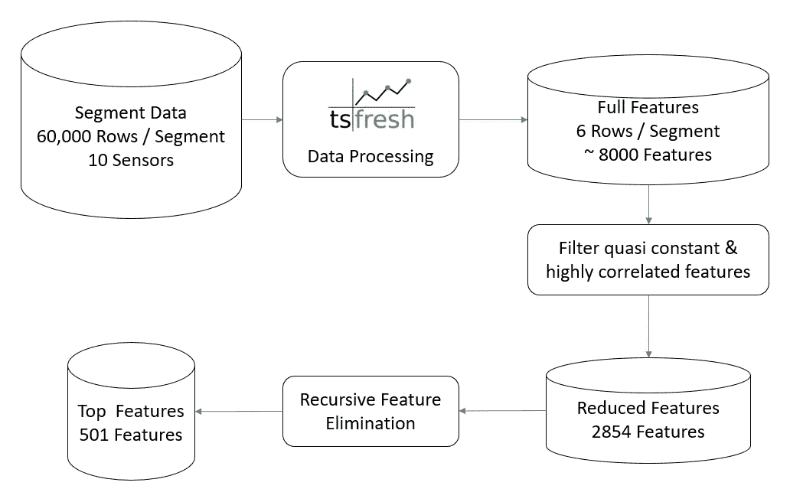
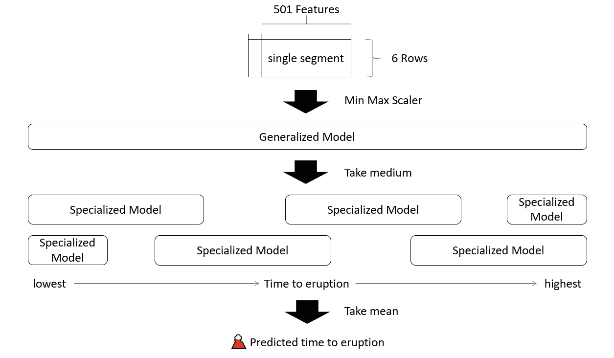
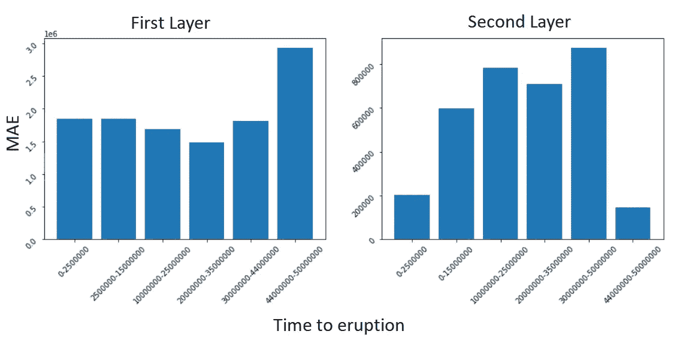

# 预测火山爆发🌋带 tsfresh 和 lightGBM 的喷发

> 原文：<https://towardsdatascience.com/predicting-volcanic-eruption-with-tsfresh-lightgbm-8fa119774458?source=collection_archive---------9----------------------->

## 多元时序数据特征工程和机器学习的最小努力方法。


肖恩·阿佩尔在 [Unsplash](https://unsplash.com?utm_source=medium&utm_medium=referral) 上的照片

火山爆发可能夺去数万人的生命，摧毁数百万美元的基础设施，并造成大量的不便。如果科学家可以像预测天气一样预测火山爆发会怎么样？这就是由 INGV 国家地理和火山研究所组织的 [INGV 火山爆发预测](https://www.kaggle.com/c/predict-volcanic-eruptions-ingv-oe/overview) Kaggle 竞赛的目的。

我与 tsfresh 和 lightGBM 一起为这场比赛创建了一个简单的解决方案，它在比赛的公共排行榜上排名第 18 位。在这篇文章中，我想详细描述我的解决方案。我还清理并记录了我的竞赛代码，作为 Kaggle 上的公共内核。您可以通过下面的链接查看本文的完整代码。

<https://www.kaggle.com/ekhtiar/18th-place-predicting-eruption-full-tutorial>  

如果您正从多元时间序列数据开始，我希望阅读这篇文章能对您的以下两个主题有所帮助:

1.  自动生成多元时间序列数据的特征。
2.  为时间序列预测设计鲁棒的机器学习模型。

# 基于 tsfresh 的时间序列特征生成

时序数据的特征生成可能非常耗时。然而，我们想要为时间序列数据生成的许多技术/特征是众所周知的和标准化的。使用 tsfresh，您可以毫不费力地自动计算大量这些已知的时间序列特征。它甚至有内置的方法来评估生成的要素的要素重要性。整个项目是开源的，你可以在 GitHub 上查看回购。

<https://github.com/blue-yonder/tsfresh>  

使用 tsfresh 相当简单。API 非常干净，你只需要从他们详尽的可用特性列表中描述你想要的特性，然后让 tsfresh 提取它们。然而，在探索的开始，不知道你想要的那种特性是非常普遍的。所以 tsfresh 也提供了预构建的特征提取设置。我将在下面描述其中的一些:

*comprehensive fc parameters*:用于处理所有可用的时间序列特性。当您不知道需要哪些功能时，这很有用。

*MinimalFCParameters* :包含一组非常小且基本的时序特征(最小值、最大值、标准差等)。对于在启动管道之前设置快速测试非常有用。

*efficient FCS parameters*:包含所有计算时间不高的特性。如果您有一个非常大的数据集，并且没有办法处理一组完整的要素，这将非常有用。

以下代码片段说明了如何使用这些设置之一来提取数据帧上的时间序列要素。

```
**import pandas as pd
from** **tsfresh.feature_extraction** **import** extract_features
**from** **tsfresh.feature_extraction** **import** ComprehensiveFCParametersdf = pd.read_csv('/path/to/file.csv')
settings = ComprehensiveFCParameters()
features_df = extract_features(df, default_fc_parameters=settings)
```

一旦处理了足够的数据，就可以应用不同的技术来理解特性的重要性。一旦知道了想要的要素，就可以“手写”想要从数据集中提取的设置。还有一个方便的技巧，使用 *from_columns* 函数从列名到设置。下面是如何工作的代码片段。

```
**from tsfresh.feature_extraction.settings import from_columns**# fictions function to get top features from your dataset
top_features_column_names = features_df.get_top_features()# get the config for the selected columnsconfig = from_columns(top_features_column_names)# get selected features for another dataframe
selected_features_df = extract_features(another_df, column_id =   'id', kind_to_fc_parameters = config)
```

在这次比赛的情况下，我首先用 ComprehensiveFCParameters 处理了训练数据集。然后，我删除了高度相关和准常数的列，并生成定制设置来处理测试集。下一节将给出更多的细节。注意，lightGBM 不会接受由 tsfresh 生成的列名，因为它们通常带有减号(-)。你必须写一个小函数来匹配两者之间的名字。

# 数据处理细节

这项比赛提供了十分钟的地震传感器读数和每一段的爆发时间。在训练数据集中，我们有 4231 个片段，在测试数据集中，我们有 4520 个片段。我们需要预测每段测试数据的爆发时间。对于每个片段，我们有 60，000 个数据点(10 分钟)；所以我们有高质量和高频率的数据。

由于一些特征计算量很大，对于每个片段，我将数据点分成 6 批(每批 10，000 个数据点)。我也可以对数据点的总数进行下采样，这样更符合常规，但我想采用非常规方法。



图:数据处理流程(图片作者提供)

目前，我们的数据集有 2854 个要素。首先，我处理了训练数据集的所有可能特征(ComprehensiveFCParameters)。这产生了近 8000 个特征。然后，我删除了高度相关的列和准常数特征。这使我们的特征下降到 2854。我还应用了一个递归的特性排除法来选择前 501 个特性(500 似乎是一个太好的数字了)。这些列在此笔记本中是硬编码的。完整的数据集也作为公共数据集上传到 Kaggle 上，您可以通过以下链接查看:

<https://www.kaggle.com/ekhtiar/ingv-parquet>  

# 模型架构

为了预测火山爆发的时间，我使用了基于树的学习算法和 lightGBM (LGBM)框架。它是 Kaggle 上许多人的首选框架，也是我的起点。起初，我使用了一个使用顶级特性的普通 lightGBM 模型；它产生了不错的结果。从这里开始，改善我的结果的最常见的方法可能是用算法创建更多的模型，并对结果进行平均。然而，在现实生产模型中，多种模型的混合很难管理。因此，我决定做一些稍微不同的事情，而不是混合多个模型。

为了改进我的结果，我创建了两层 lightGBM 模型。我称之为一般化-特殊化分层。首先，单个模型用于对整个数据集进行初始预测。然后在第二层，我训练了多个模型。这些模型更加专业化，因为它们是用特定喷发时间范围内的数据训练的。为了处理第一个模型的更大程度的误差，我在第二个模型的范围之间创建了重叠。最后一点琐碎的细节，在拟合之前，我还使用了最小-最大缩放来缩放我们的数据，以获得最佳性能。

为了预测测试数据，首先使用来自第一层的模型进行初始预测。基于这种预测，我们使用第二层的特定模型来进行更准确的预测。因为我们在喷发时间范围上有重叠，所以可以用两个模型评估一个测试段。最后，对于测试数据集中的每个片段，我们有六个输出或预测。然后我们取这些输出的中间值来得到我们最终预测的喷发时间。我试着在下面的图表中想象这个过程(尽我所能)。



图:按模型层的预测流程(图片由作者提供)

# 超参数调谐

LightGBM 有非常多的超参数需要调整。像所有基于树的算法一样，lightGBM 也因过度拟合而闻名。过度拟合的一个主要原因是模型的复杂性。我通过控制叶子的数量( *num_leaves* )和最大深度( *max_depth* )参数来防止 lightGBM 构建过于复杂的模型。我还使用了大量的估计器(*n _ 估计器)*和正则化*(λ_ L1*和*λ_ L2)*来减少过拟合。还控制了总迭代次数( *num_iterations* )，并且还引入了早期停止( *early_stopping_round)* 以防止过拟合。最后，我还试图通过使用额外的树、特征分数和 bagging_fraction 来引入大量的随机性。下面是第二层模型的超参数配置。

```
params = {
         'application':'regression',
         'boosting ': 'dart',
         'num_iterations':8000, 
         'learning_rate':0.05, 
         'num_leaves': 95,
         'extra_trees': True,
         'feature_fraction':0.8, 
         'bagging_fraction':0.9,
         'lambda_l1':0.1, 
         'lambda_l2':0.1, 
         'min_split_gain':0.01, 
         'early_stopping_round':100, 
         'max_depth': 7,
         'min_child_weight':40, 
         'n_estimators': 400,
         'metric':'mae',
         }
```

您还会注意到，第一层要简单得多(叶子的数量和深度更多)。实验表明，保持第一个模型没有第二个模型复杂会产生好的结果。这也使得第一个模型可以一般化，第二个模型可以专门化。

# 结果

本次竞赛使用平均得分(MAE ),该解决方案的个人得分为 4200311。这在排行榜上排在第 18 位，我很高兴我的简单解决方案最终排在了这么高的位置。下面的条形图显示了不同范围的喷发时间值的平均得分。左边的条形图来自第一个模型，右边的来自第二个模型。

由于第二种模式可以关注更小的时间范围，他们往往做得更好。此外，该模型的总体得分有所提高。对于这两个极端(爆发的时间很快或很晚)，我创建了一个额外的模型。由于最低和最高之间的范围非常大，即使是专门的模型也更倾向于该范围的中间。这些针对两种极端情况的额外模型有助于更好地预测极端情况。



图:层间 MAE 比较(图片由作者提供)

# 最后的想法

这是一场有趣的 Kaggle 比赛，非常感谢组织者组织了这场比赛。像任何其他比赛一样，在参加这个比赛时，我从其他卡格勒的作品中学到了很多。

我希望我有时间对特性的重要性做更系统的研究和可视化。我还认为在第一层使用多个分类器而不是单个模型可能是更好的方法。哦，好吧，我会把这段经历带在身边，以便将来做得更好。