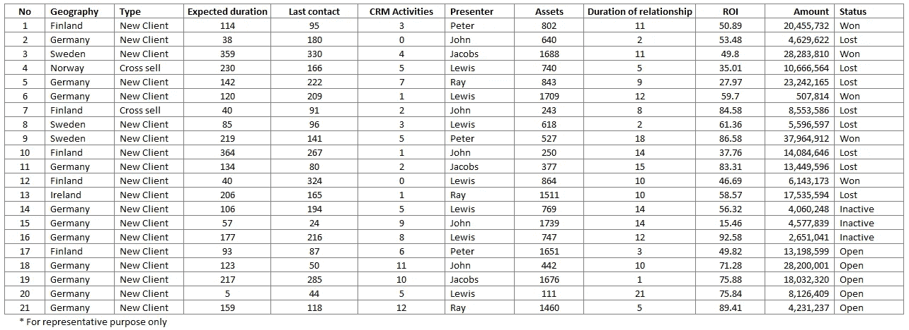
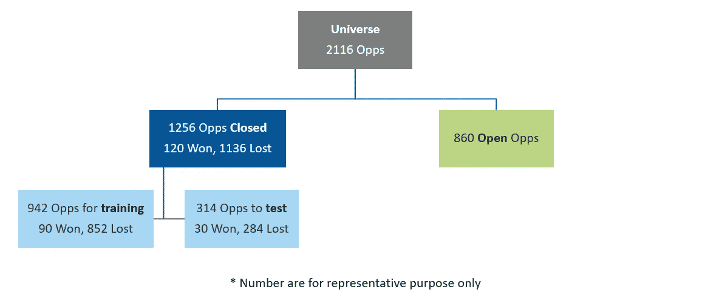
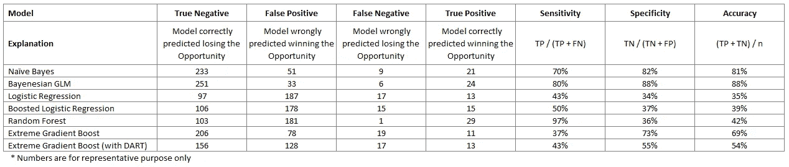
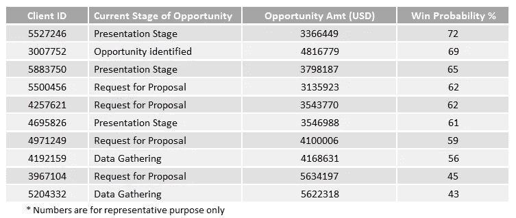

# 预测获胜概率

> 原文：<https://towardsdatascience.com/predicting-win-probability-910af3b48f75?source=collection_archive---------13----------------------->

## 迷你教程

## 在销售机会上使用机器学习

您是否曾经不得不确定在销售渠道中赢得机会的概率？营销团队创造销售线索，销售团队跟进销售线索，在此过程中，每个机会都会经历一个生命周期，从 RFP 阶段一直到最终成交。随着机会从一个阶段过渡到下一个阶段，联系人会分配一个将销售线索转化为销售的概率，从而赢得机会。

但是这个概率有多准呢？给定一个足够大的包含多个预测变量的数据集，我们可以使用机器学习来确定赢得机会的概率吗？我们在一家领先的资产管理公司建立了一个概念验证，展示让机器说话的好处:)

## **特性**

利用九个不同的数据源提取了机会级别的 14 个属性。这些因素包括关系持续时间、预期的机会持续时间、CRM 活动数量、机会数量、机会类型(新的、交叉销售等)。)、自上次联系以来的持续时间、进行的演示次数、演示者姓名、参加的产品网络研讨会次数、管理的资产以及资产价值的增长。

这些被转换成单个数据框，每个记录代表一个机会，如下所示



作者图片

## 培训和测试

然后，机会数据框架被分为开放和关闭的机会。对于已结束的业务机会，最终状态是已知的——成功、失败或无效，而对于开放的业务机会，状态是预测的。状态标签转换为 0 或 1，1 表示赢得机会，0 表示失去机会(包括“非活动”状态)。

关闭的机会以 75:25 的比例分成培训和测试，同时使用 Caret 包中的 createDataPartition 函数维护状态标签的比例。



作者图片

```
> set.seed(101) 
> intrain = createDataPartition(y=closed_opps$Label, p=0.75, list=FALSE)
> traindf = closed_opps[intrain,]; traindf$Label = as.factor(traindf$Label)
> testdf = closed_opps[-intrain,]; testdf$Label = as.factor(testdf$Label)
```

## 模型

我使用 R 中的 Caret、ARM 和 XGBoost 包在训练数据上建立监督机器学习模型，并将机会分类为赢或输。

**朴素贝叶斯:**一种基于贝叶斯定理的分类算法，在给定每个预测变量取某个值的情况下，确定赢得或失去机会*的概率。*

```
nb_model <- train(Label ~ ., data = traindf, method = “naive_bayes”, trControl = fitControl, na.action = na.pass)
```

**逻辑回归:**具有二元结果的广义线性模型，使用 sigmoid 函数将其转换为概率。每个预测变量的“权重”由模型确定，以减少实际值和预测值之间的误差。

```
lr_model <- train(Label ~ ., data = traindf, method = “glm”, family = “binomial”, trControl = fitControl, na.action = na.pass)
```

**贝叶斯 GLM:** 逻辑回归模型的扩展，但它根据贝叶斯方法假设预测变量的先验分布。

```
bayenesian_model <- train(Label ~ ., data = traindf, method = “bayesglm”, trControl = fitControl, na.action = na.pass)
```

**增强逻辑回归:**几个逻辑回归模型的集合，然后用于根据单个预测进行预测。

```
boosted_lr_model <- train(Label ~ ., data = traindf, method = “LogitBoost”, trControl = fitControl, na.action = na.pass)
```

**随机森林:**决策树的集合，用作慢学习器，通过使用在每个节点提供最佳分割的特征将训练数据分成各自的状态，对每个机会进行分类。

```
library(randomForest) # to build a random forest model
rf_model = train(Label ~ ., data = traindf, method = “rf”, ntree = 30, maxdepth = 5, trControl = fitControl, na.action = na.pass)
detach(“package:randomForest”, unload=TRUE) #conflicts with margin in ggplot
```

**极端梯度推进:**以连续的方式构建决策树的集合，其中每个模型的残差适合后续的模型。

```
xgb_model <-train(Label ~., data = traindf, method = “xgbTree”, trControl = fitControl, tuneGrid = xgb.grid, verbose = T, nthread = 2, na.action = na.pass)
```

**极限梯度提升(带 DART):** 极限梯度提升算法的扩展，但是为了避免过度拟合的问题，在每个阶段都要丢弃树。

```
xgbDART_model <- train(Label ~ ., data = traindf, method = “xgbDART”, trControl = fitControl, na.action = na.pass)
```

## 性能指标

然后，每个 ML 模型被部署在测试数据集上

```
nb_predictions_test = predict(nb_model, newdata = testdf, type = “raw”)
bayenesian_predictions_test = predict(bayenesian_model, newdata = testdf, type = “raw”)
boosted_lr_predictions_test = predict(boosted_lr_model, newdata = testdf, type = “raw”)
lr_predictions_test = predict(lr_model, newdata = testdf, type = “raw”)
rf_predictions_test = predict(rf_model, newdata = testdf, type = “raw”)
xgbDART_predictions_test = predict(xgbDART_model, newdata = testdf, type = “raw”)
xgb_predictions_test = predict(xgb_model, newdata = testdf, type = “raw”)
```

使用 3 个度量来测量性能:ROC、灵敏度和特异性。ROC 是接收器操作特性，即曲线下的面积，分类器的整体精度。敏感度是真正的肯定率，即被正确预测为成功的机会数量占总成功的比例。特异性是真实的负比率，即被正确预测为失去的机会数占失去的机会总数的比例。



作者图片

## 结果

随机森林模型在测试数据集上提供了最高的灵敏度。这用于预测赢得公开机会的概率，结果以下列方式展示。



作者图片

该算法还用于使用 Caret 包中的 varImp 函数来确定每个输入特征的重要性。结果表明，我们假设对模型有贡献的某些特征实际上没有帮助，这就需要讨论数据是否有错，或者我们是否必须修改我们对该特征的假设。

## 用例

能够预测管道中机会的成功率将使我们能够实施“早期预警系统”，并提供一个与潜在客户互动的框架。例如，CRM 活动可以基于成功概率以及机会数量来划分优先级。此模型的输出也可以成为后续细分模型的输入，该模型将客户划分为战略客户或其他客户。

## 挑战

我们在研究这些模型时面临的主要挑战是缺乏清晰的数据。我们发现在不同的电子表格文件中维护数据的方式有几处不一致，必须手动将它们映射到中央存储库中的 kID。我们还发现，ML 模型需要比构建模型时更多的数据。随着我们从遗留系统过渡，并同时清理数据，我们相信这种概念验证将会出现。

如果您有任何意见或反馈，或其他预测销售渠道中机会成功率的方法，请使用下面的评论部分。


斯蒂芬·道森在 [Unsplash](https://unsplash.com/s/photos/sales?utm_source=unsplash&utm_medium=referral&utm_content=creditCopyText) 上拍摄的照片

## 有用的链接

以下是 Caret 软件包上的一个链接，您会发现它很有用:

[https://cran . r-project . org/web/packages/caret/vignettes/caret . html](https://cran.r-project.org/web/packages/caret/vignettes/caret.html)