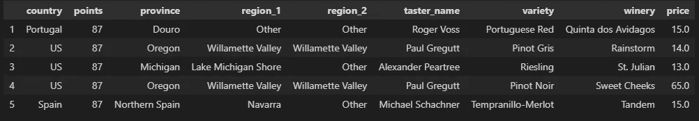
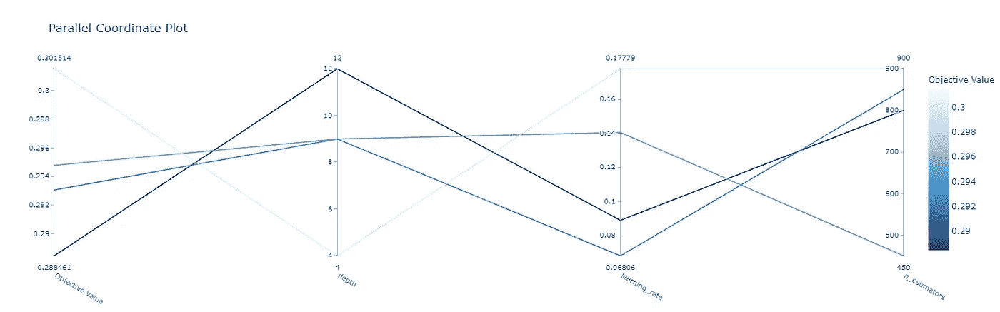

# 用调谐梯度提升树预测葡萄酒价格

> 原文：<https://towardsdatascience.com/predicting-wine-prices-with-tuned-gradient-boosted-trees-9ab5ebd0b85e?source=collection_archive---------40----------------------->

## 利用 Optuna 寻找最佳超参数组合

# 什么是超参数调谐？

许多流行的机器学习库使用超参数的概念。这些可以被认为是机器学习模型的**配置设置**或**控制**。虽然在拟合模型的过程中学习或求解了许多参数(比如回归系数)，但有些输入需要数据科学家预先指定值。这些是超参数，然后用于建立和训练模型。

梯度推进决策树的一个例子是决策树的深度。较高的值可能会产生更复杂的树，可以提取某些关系，而较小的树可能能够更好地进行概括，并避免过度拟合我们的结果，这可能会导致预测未知数据时出现问题。这只是超参数的一个例子，许多模型都有许多这样的输入，它们都必须由数据科学家定义，或者使用代码库提供的默认值。

这可能看起来很困难— ***我们如何知道哪种超参数组合会产生最准确的模型呢？*** 手动调优(寻找最佳组合)可能需要很长时间，并且覆盖很小的样本空间。这里将介绍的一种方法是使用 [Optuna](https://github.com/optuna/optuna) 来自动完成一些工作。可以指定超参数的范围，而不是手动测试组合，Optuna 进行了一项研究，以确定给定时间限制下的最佳组合。

# 数据集概述

为了演示 Optuna 和 hyperparameter 调优，我们将使用一个包含来自 [Kaggle](https://www.kaggle.com/mysarahmadbhat/wine-tasting) 的葡萄酒评级和价格的数据集。给定一瓶红酒的一些输入特征——比如地区、点数和品种——使用超参数调优，我们能在多大程度上预测葡萄酒的价格？



数据集概述[点击查看全尺寸版本](https://datastud.dev/media/optuna_hyperparameter/dataset_overview.png)

在我们的数据中加载几行代码，并进行训练/测试分割:

```
# Read in data from local csv
df = pd.read_csv('winemag-data-130k-v2.csv')

# Choose just a few features for demonstration, infer categorical features
feature_cols = ['country', 'points', 'province', 'region_1', 'region_2', 'taster_name', 'variety', 'winery']
cat_features = [col for col in feature_cols if df[col].dtype == 'object']
for col in cat_features:
    df[col] = df[col].fillna('Other')
target_col = 'price'

# Train test split
train_df, test_df = train_test_split(df, test_size=0.3, shuffle=False)

train_x = train_df.loc[:, feature_cols]
train_y = train_df.loc[:, target_col]

test_x = test_df.loc[:, feature_cols]
test_y = test_df.loc[:, target_col]
```

# 模特培训

## 基线模型

为了知道我们的超参数优化是否有帮助，我们将训练几个基线模型。第一种是采用简单的平均价格。使用这种方法的结果是 79%的平均绝对百分比误差——不是很好，希望一些机器学习模型可以改善我们的预测！

第二个基线是用默认参数训练我们的模型(使用 [Catboost 库](https://catboost.ai/docs/concepts/python-reference_catboostregressor.html))。下面是几行代码。这击败了我们的基线简单均值预测，但我们能通过进一步优化做得更好吗？

```
# Train a model with default parameters and score
model = CatBoostRegressor(loss_function = 'RMSE', eval_metric='RMSE', verbose=False, cat_features=cat_features, random_state=42)
default_train_score = np.mean(eda.cross_validate_custom(train_x, train_y, model, mean_absolute_percentage_error))
print('Training with default parameters results in a training score of {:.3f}.'.format(default_train_score))Output: Training with default parameters results in a training score of 0.298.
```

# 超参数优化模型

## 设置优化研究

为了使用优化的超参数创建我们的模型，我们创建了 Optuna 所谓的研究——这允许我们定义具有超参数范围的试验，并优化最佳组合。

您将在下面的代码中看到，我们用一个试验对象定义了一个目标函数，它根据我们定义的范围建议超参数。然后，我们创建研究并进行优化，让 Optuna 完成它的工作。

```
def objective(trial):

    # Define parameter dictionary used to build catboost model
    params = {
        'loss_function': 'RMSE',
        'eval_metric': 'RMSE',
        'verbose': False,
        'cat_features': cat_features,
        'random_state': 42,
        'learning_rate': trial.suggest_float('learning_rate', 0.001, 0.2),
        'depth': trial.suggest_int('depth', 2, 12),
        'n_estimators': trial.suggest_int('n_estimators', 100, 1000, step=50)
    }

    # Build and score model
    clf = CatBoostRegressor(**params)
    score = np.mean(eda.cross_validate_custom(train_x, train_y, clf, mean_absolute_percentage_error))

    return score
```

## 查看结果

Optuna 将最佳结果存储在我们的学习对象中。运行以下程序可以让我们访问最佳试用和查看培训结果。

```
# Grab best trial from optuna study
best_trial_optuna = study.best_trial
print('Best score {:.3f}. Params {}'.format(best_trial_optuna.value, best_trial_optuna.params))Output: Best score 0.288\. Params {'learning_rate': 0.0888813729642258 'depth': 12 'n_estimators': 800}
```

## 与默认参数比较

将训练结果与我们初始运行的默认参数进行快速比较，显示出良好的迹象。您将看到优化的模型具有更好的训练拟合度(在这种情况下，分数是百分比误差，因此越低=越好)。

```
# Compare best trial vs. default parameters
print('Default parameters resulted in a score of {:.3f} vs. Optuna hyperparameter optimization score of {:.3f}.'.format(default_train_score, best_trial_optuna.value))Output: Default parameters resulted in a score of 0.298 vs. Optuna hyperparameter optimization score of 0.288.
```

## 分析优化趋势

一个很好的例子是平行坐标图。这使我们能够观察试验并分析潜在趋势的超参数。如果我们发现有趣的优化，我们可能希望在审查结果后运行新的研究，允许我们搜索额外的超参数空间。

```
# Visualize results to spot any hyperparameter trends
plot_parallel_coordinate(study)
```



平行坐标图[点击查看全尺寸版本](https://datastud.dev/media/optuna_hyperparameter/paralell_coordinates_plot.png)

您可以在左侧看到成本指标(越低=越好)。沿着黑线(最佳试验)，您会注意到深度越高效果越好，学习率在测试值的中间，并且有更多的估计值。鉴于这些发现，我们可以重新运行一项研究，缩小这些值的范围，并潜在地扩大其他值的范围——例如深度可能增加到我们的上限以上，或者添加额外的超参数进行调整。

# 比较测试结果

最后一步是比较测试结果。第一步是观察我们的简单平均预测基线在测试集上的表现。

```
# Run baseline model (default predicting mean)
preds_baseline = np.zeros_like(test_y)
preds_baseline = np.mean(train_y) + preds_baseline
baseline_model_score = mean_absolute_percentage_error(test_y, preds_baseline)
print('Baseline score (mean) is {:.2f}.'.format(baseline_model_score))Output: Baseline score (mean) is 0.79.
```

下一步是查看我们默认超参数模型的测试结果:

```
# Rerun default model on full training set and score on test set
simple_model = model.fit(train_x, train_y)
simple_model_score = mean_absolute_percentage_error(test_y, model.predict(test_x))
print('Default parameter model score is {:.2f}.'.format(simple_model_score))Output: Default parameter model score is 0.30.
```

比简单地用平均值作为预测要好很多。我们的超参数优化解决方案能在测试集上做得更好吗？

```
# Rerun optimized model on full training set and score on test set
params = best_trial_optuna.params
params['loss_function'] = 'RMSE'
params['eval_metric'] ='RMSE'
params['verbose'] = False
params['cat_features'] = cat_features
params['random_state'] = 42
opt_model = CatBoostRegressor(**params)
opt_model.fit(train_x, train_y)
opt_model_score = mean_absolute_percentage_error(test_y, opt_model.predict(test_x))
print('Optimized model score is {:.2f}.'.format(opt_model_score))Output: Optimized model score is 0.29.
```

我们能够通过超参数优化改进我们的模型！我们只在一个小空间里搜索了几次，但是改进了我们的成本度量，得到了更好的分数(误差降低了 1%)。

*所有的例子和文件都可以在* [*Github*](https://github.com/bstuddard/python-examples/tree/master/hyperparameter-optimization/optuna) *上找到。*

*原发布于*[*https://data stud . dev*](https://datastud.dev/posts/wine-optuna-hyperparameter)*。*