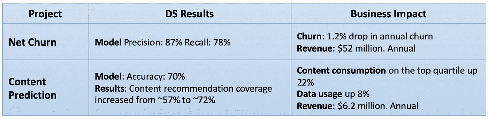
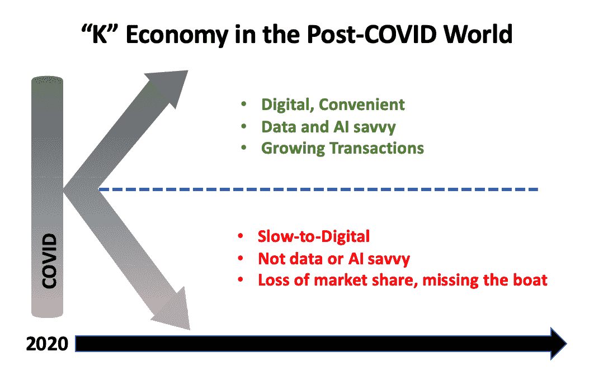
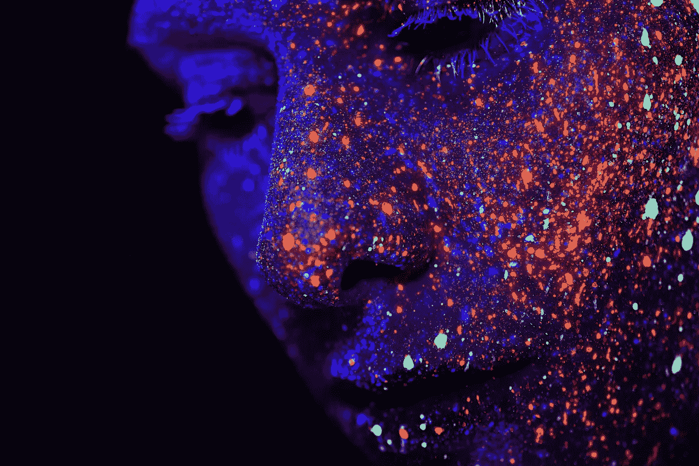

# 预测 2021 年:人工智能正常化的一年

> 原文：<https://towardsdatascience.com/prediction-2021-the-year-ai-became-normal-1968d4053803?source=collection_archive---------37----------------------->

## ***2021 年将看到商家拥抱 AI，不是因为他们想，而是因为他们不得不***

许多年后，2020 年将被视为人工智能的分水岭。在新冠肺炎肆虐世界的前所未有的一年，关于人工智能的有用性已经出现了一个明确的答案——企业需要找到一种创造性地，广泛地，大胆地应用人工智能的方法，以在短期内变得更强大，并在长期内生存。

人工智能已经出现了一个清晰的增长模式:2018-19 年，实验阶段变得成熟；2020 年，采用以一种严肃的方式开始，突然，新冠肺炎给了商业领袖一个推动自动化和人工智能的机会和动力。2021 年，英国和其他许多国家第二波新冠肺炎的余波将最终变得清晰，首先是许多传统的非数字业务的迅速衰落。随着高管们的关注，以下是我预计将在 2021 年出现的相关趋势:

# **1。企业将衡量“真正的”人工智能指标**

2020 年，企业跳出实验模式，在后 COVID 时代，立足于现实，加速采用。2021 年，他们将采用人工智能计划在传统指标方面的商业成果，如收入、客户流失、客户忠诚度等。虽然企业有责任理解人工智能的影响，但我们这些数据科学家有责任建立“翻译表”来实现同样的目标。

数据科学家根据准确度、精确度和召回率、F1 分数、AUC 或类似的“科学”指标来评估他们项目的“成功”,这与企业衡量项目有效性的方式非常不同。为了弥合这一差距，数据科学家必须坐下来，最好是先验地，与企业一起制定一个通用框架，以了解和衡量他们工作的影响。

例如，在我的雇主、世界顶级电信公司之一的 Airtel，我们使用以下简单的表格来与产品组和业务部门分享成果:

图 1:将数据科学成果转化为清晰理解的业务影响，改善沟通并建立信任。图片来源:作者

一旦这些“翻译表”建立起来，所有的数据科学家、产品专家和相关企业就可以很容易地专注于同一个目标并衡量影响。

# **2。职场 AI 和人机协作将加速**

我们看到了一个有趣的视频，波士顿动力公司的机器人随着西部、好莱坞、印度等音乐起舞。曲调。除了这个[广受欢迎的视频](https://youtu.be/fn3KWM1kuAw)的社交媒体狂热之外，工作场所人工智能还有一个长期趋势正在出现，并将尽快推动自动化和增强需求。后 COVID 世界将更加虚拟化，基于位置、身体或人际接触的工作者和在家工作的知识工作者的工作场所都将被破坏。它也将越来越少接触，特别是在 B2C 环境中，如零售、酒店、运输、食品和饮料服务等，导致下一个预测…

图 2:波士顿动力公司的机器人在年终舞蹈表演中

# **3。计算机视觉将是“下一个前沿”**

在第二波疫情在全球传播的过程中，2020 年 12 月发布的一则鲜为人知的公告没有引起大多数人的注意:亚马逊计划推出监控工厂工人和机器的工具[。该系统名为 AWS Panorama，使用计算机视觉分析设施内的闭路电视摄像机镜头，自动检测安全和合规问题，如工人未穿戴 PPE，或车辆在未经授权的区域行驶。虽然这听起来微不足道，但考虑到一个大型工业仓库(250，000 平方英尺。25，000 平方英尺 mt .)可以拥有 500-600 台以 60 fps(每秒帧数)运行的闭路电视摄像机，每天生成约 4300 万至 5200 万张图像，每月约 15 亿张。](https://www.ft.com/content/58bdc9cd-18cc-44f6-bc9b-8ca4ac598fc8)

图 3:在边缘运行的视觉算法能够实时确定“热点”。视频:S20.ai 和 Youtube

过去几年发明的新一代技术使这成为可能；[联邦学习](/the-new-dawn-of-ai-federated-learning-8ccd9ed7fc3a)平台如 [S20。专注于工业计算机视觉的 AI](https://www.s20.ai/) 或专注于医学研究数据和图像的 Owkin[，使得以](https://owkin.com/)[隐私保护方式](https://searchenterpriseai.techtarget.com/feature/Federated-deep-learning-offers-new-approach-to-model-training)处理和理解这些数据成为可能。

这得益于硬件能力的快速增长。 [NVIDIA 的 Jetson](https://blogs.nvidia.com/blog/2020/06/18/jetson-nano-vision-product-award/) 系列 GPU 及其 [EGX AI 平台](https://www.nvidia.com/en-in/data-center/products/egx-edge-computing/)为物联网应用的计算机视觉和边缘计算开辟了巨大的机遇。与此同时，[NVIDIA A100 GPU](https://developer.nvidia.com/blog/improving-computer-vision-with-nvidia-a100-gpus/)通过多实例功能，可以在单个 GPU 上并行运行多达七个任务，显著提高了云中繁重计算机视觉工作负载的处理能力。苹果最新的 [M1 芯片](https://www.apple.com/in/mac/m1/)也显示出 3.9 倍的视频处理速度和 7.1 倍的图像处理速度。

然而，随着人工智能技术渗透到我们生活的各个领域，它对大流行后世界的经济未来产生了重大影响。

# **4。由人工智能驱动的“K 经济”的增长将加速**

2021 年，遭受重创的经济体将开始重建，世界上最早从 COVID 中复苏的地区，如印度和中国，将是增长最快的。2021 年将是“K 经济”的开始，其大致定义是，数字化和推动更快人工智能增长的经济体和公司之间的表现差异越来越大。最坚韧的公司将把人工智能推向新的前沿，用于远程协作、按需制造，并转向数字体验、推荐等方面的智能实验。在边缘。

图 4:由人工智能驱动的“K 经济”的增长将在后 COVID 世界加速

鉴于人工智能工具在过去两年中已经显著民主化，一流的算法在斯坦福、谷歌或中国开发出来后很快就可以使用，落后者仍然有可能一次性的机会积极实现他们的顶级人工智能 10、20 或 50 个用例，可能是用无代码的 AutoML 工具。

随着人工智能模型开始影响我们生活的许多方面，…

# **5。人工智能模型必须保证信任和公平，很快**

随着人工智能渗透到我们的生活中，系统必须公平、负责任并可靠地重现结果。考虑一个基于“替代”信用数据对无银行账户客户进行信用评分的人工智能系统。这种评分模型依赖于对零工经济工资支票、小额贷款的使用和偿还、社交档案、智能手机的使用(通话、数据)、电子商务网站上的购物等的访问。虽然创造这些产品的崇高目的是让数百万人获得正规信贷，但贷款人和用户都必须信任该系统，产品才会有效。

随着电子商务、银行、娱乐和其他日常系统与人工智能结合，企业将必须确保公众可以确信正在使用的人工智能技术是透明、安全的，并且其结论不会有偏见或受到操纵。2021 年，[提供可信度](https://link.springer.com/article/10.1007/s13347-019-00378-3)和“公平”衡量标准的技术将开始融入人工智能生命周期，帮助我们构建、测试、运行、监控和认证人工智能应用，以获得信任，而不仅仅是性能

这不仅限于人工智能算法…

# **6。AI 的阴暗面**

随着数据量的增加，2021 年可能会展示人工数据的好的、坏的和丑陋的使用，这些数据被注入模型中以造成伤害。例如，在一个稀疏的数据环境中，某个月升级手机通话计划的人数，“合成数据”允许科学家创建扩展的数据集来训练人工智能。虚假数据是为了完全相反的目的而创建的:它意味着扰乱人工智能训练，以创建受污染的模型和结果。

图 5:伪造的数据和内容，“深度伪造”将在 2021 年成为人工智能的“黑暗面”。照片由[h·海尔莱恩](https://unsplash.com/@heyerlein?utm_source=unsplash&utm_medium=referral&utm_content=creditCopyText)在 [Unsplash](https://unsplash.com/s/photos/machine-learning?utm_source=unsplash&utm_medium=referral&utm_content=creditCopyText) 上拍摄

正如 2020 年美国大选所展示的那样，传播错误信息和虚假内容的人工智能机器人[更难被检测到](https://www.nature.com/articles/d41586-020-03034-5)。事实上，这次对 [Deepfake](https://en.wikipedia.org/wiki/Deepfake) AI 文本内容操纵选举结果的担忧如此之高，以至于 GPT-3 AI 的创造者 OpenAI 已经承诺[限制其仅用于道德用途的可用性](https://www.c4isrnet.com/opinion/2020/08/28/deepfake-text-potential-ai-influences-on-the-upcoming-us-election/)，密切监控其应用编程接口(API)。

人工智能在未来几年的发展将与任何其他最近的技术发展非常不同。人工智能不同于过去开发的任何其他强大的技术——它无处不在的高质量算法在几周内就可以到达全球，包括 GPU 在内的廉价计算能力以及 AutoML 等无代码技术都是可用的。为了应对这种威胁，我预计 2021 年的人工智能专业人员将寻找一种共识的方法来识别和揭示人工智能应用程序中的敌对威胁。对抗式人工智能威胁度量标准，一个开放的、可扩展的行业框架，用于对最常见的用于破坏 ML 系统的对抗策略进行分类，可能会被 ML 和 DevOps 工程师采用。

# 摘要

2021 年将是人工智能的分水岭，该技术将在 2018-19 年脱离实验周期，在 2020 年被采用，并开始成为所有类型的企业、流程、产品和服务的日常活动的一部分。像 COVID 这样的百年一遇的“黑天鹅”事件将推动“K 经济”的增长，迫使企业迅速开始采用人工智能，否则就会面临灭亡的风险。

后 COVID 世界将是无接触和数字化的，服务是自动化和远程驱动的。因此，工作场所人工智能和人机协作将加速发展，将计算机视觉技术置于最前沿。

随着人工智能渗透到我们生活的每个领域，消费者对技术的理解将开始改变。然而，要被公众广泛接受，这些制度必须是公平和负责任的。否则，预计会看到人工智能的采用受到严重抵制——推迟，但仍不会最终阻止人工智能驱动的世界。

> ***结语:我写的是关于数据科学、机器学习、产品管理和职业成功的故事。你可以跟着我把这些放进你的培养基里。***

***上一篇:*** [***用“印度级”技术为世界供电***](https://medium.com/@SantanuB/powering-the-world-with-india-class-technologies-2c7dab9c496b?source=friends_link&sk=defcbb3c0e1f7a7cefcbea3331c478f0)

***下一个故事:*** [***印度贫困地址的经济影响:一年 100-140 亿美元***](/economic-impact-of-poor-addresses-in-india-10-14-billion-a-year-11cc97cb40fc?source=friends_link&sk=53dbad114fd73c8cc3e44a3f0398209a)