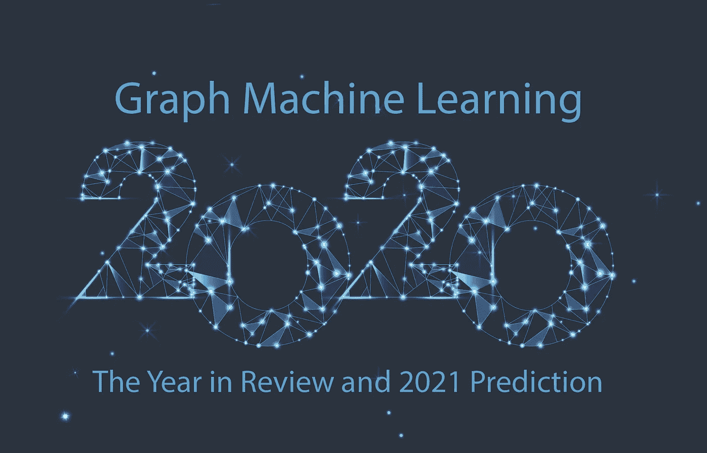
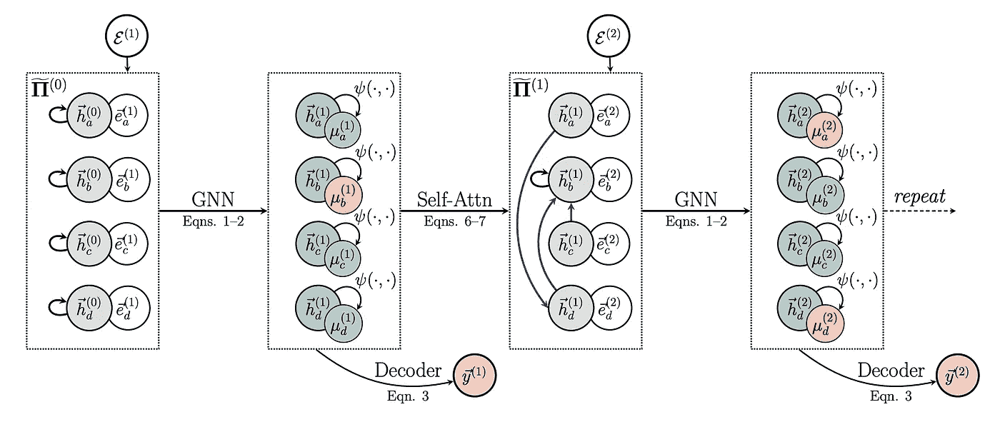
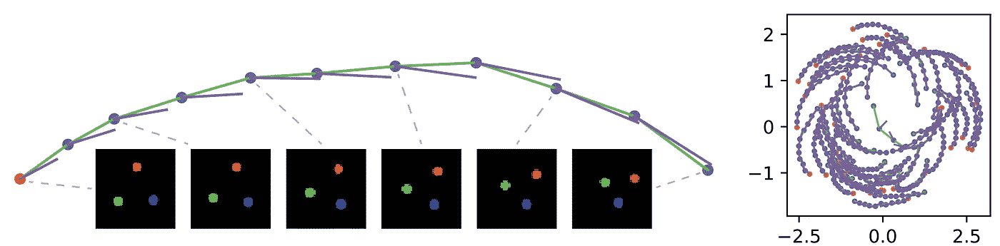
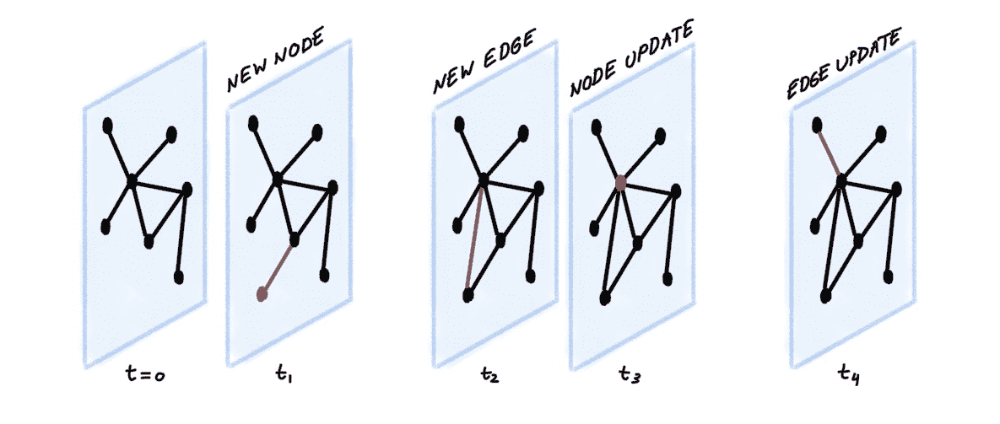
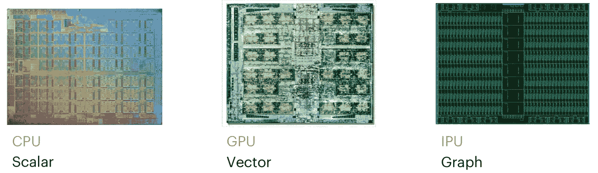
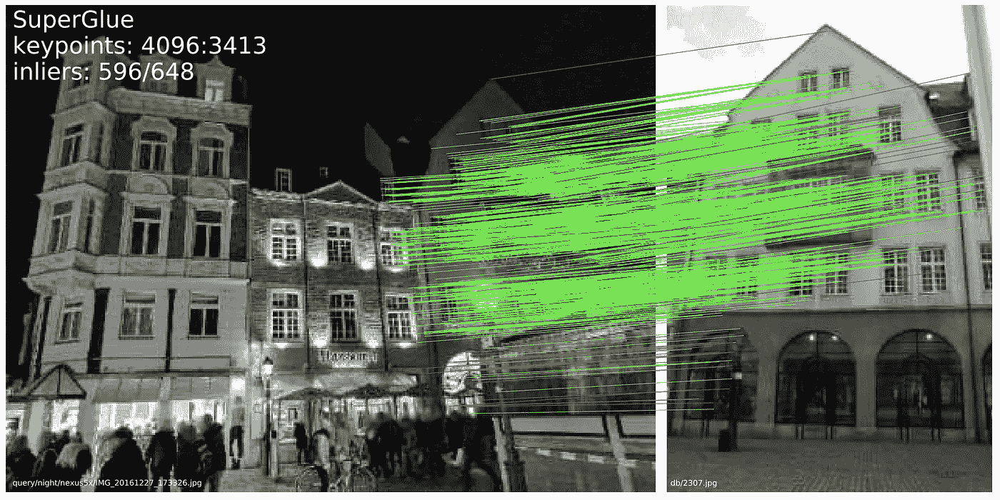
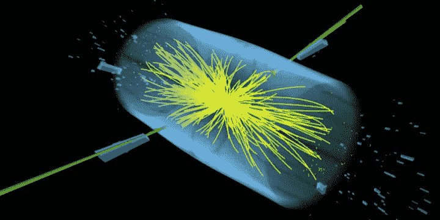
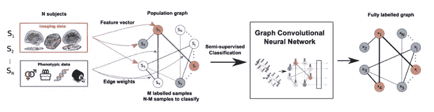
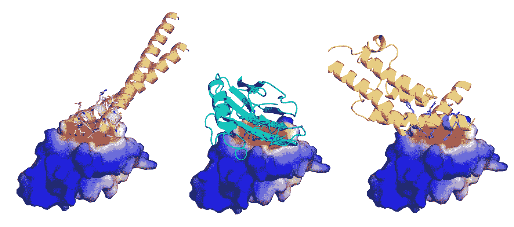
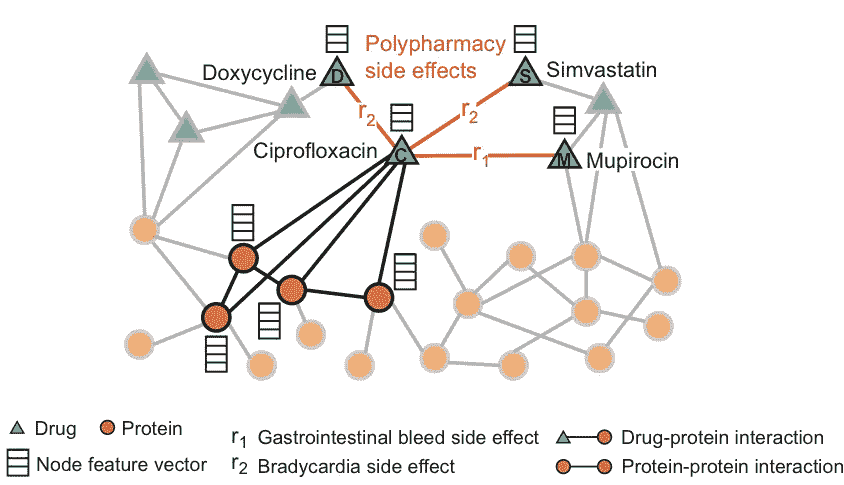

# 2021 年对 Graph ML 来说意味着什么？

> 原文：<https://towardsdatascience.com/predictions-and-hopes-for-graph-ml-in-2021-6af2121c3e3d?source=collection_archive---------3----------------------->

## 2020 年回顾与 2021 年预测

## 年底是总结和预测的好时机。2020 已经把 Graph ML 变成了机器学习的名人。在这篇文章中，我征求了 graph ML 及其应用领域的杰出研究人员的意见，试图总结过去一年的亮点，并预测 2021 年将会发生什么。

图片:Shutterstock

# **超越消息传递**

[**威尔汉密尔顿**](https://williamleif.github.io/) ，*麦吉尔大学助理教授兼米拉大学 CIFAR 主席，著有*[*graph sage*](http://snap.stanford.edu/graphsage/)*。*

> “2020 年，图形 ML 领域面临着消息传递范式的基本限制。

这些限制包括所谓的“瓶颈”问题[1]，过度平滑的问题[2]，以及代表能力方面的理论限制[3，4]。展望未来，我预计在 2021 年我们将寻找图形 ML 的下一个大范式。我不确定下一代 Graph ML 算法到底会是什么样子，但我相信，要取得进展，就需要打破 2020 年及之前主导该领域的消息传递模式。

我也希望 2021 年 Graph ML 也将进入更有影响力和更具挑战性的应用领域。最近太多的研究集中在简单的、同质的节点分类任务上。我还希望看到在需要更复杂的算法推理的任务方面的方法进步，比如涉及知识图、强化学习和组合优化的任务。"

# **算法推理**

指针图网络结合了经典计算机科学中的结构归纳偏差。图片来源:P. Velič ković。

[**佩塔尔·韦利奇科维奇**](https://petar-v.com/) **，***deep mind 高级研究员，著有* [*图关注网络*](https://petar-v.com/GAT/) *。*

> “2020 年已经明确且不可逆转地将图形表示学习转变为 ML 领域的一等公民。”

今年取得的巨大进步不胜枚举，但我个人最感兴趣的是神经算法推理。传统上，神经网络在插值领域非常强大，但众所周知，它是可怕的外推器——因此也是不充分的推理器；因为推理的主要特征之一是能够在非分布情况下发挥作用。推理任务很可能是 GNNs 进一步发展的理想选择，不仅因为它们与这种任务非常匹配[5]，还因为许多现实世界的图形任务表现出同质性，这意味着最有效和可扩展的方法通常是 GNNs 的更简单形式[6，7]。

基于以前的神经执行器的历史成功，如神经图灵机[8]和可微分神经计算机[9]，并通过现在无处不在的图形机器学习工具箱得到加强，2020 年发表的几部作品探索了神经执行器的理论限制[5，10，11]，基于 GNNs[12-15]导出了新的和更强的推理架构，并实现了对神经推理任务的完美的强泛化[16]。虽然这种架构可以自然地转化为 2021 年组合优化的胜利[17]，但我个人最兴奋的是预先训练的算法执行者如何允许我们将经典算法应用于过于原始或不适合该算法的输入。作为一个例子，我们的 XLVIN 代理[18]正是使用这些概念来允许 GNN 在强化学习管道中执行值迭代式算法，即使底层 MDP 的细节是未知的。我相信到 2021 年，GNN 应用于强化学习的时机将会成熟。"

# **关系结构发现**

GNNs 允许学习一个状态转移图(右)，它解释了一个复杂的多粒子系统(左)。图片来源:T. Kipf。

[**托马斯·基普夫**](https://tkipf.github.io/) ，*谷歌大脑研究科学家，《图卷积网络*<https://tkipf.github.io/graph-convolutional-networks/>**的作者。**

> *自从最近广泛采用基于 GNN 的模型以来，Graph ML 社区中一个特别值得注意的趋势是计算结构与数据结构的分离。*

*在最近的 ICML 研讨会上，我将这种趋势称为关系结构发现的 T2。通常，我们设计图形神经网络以在数据集提供的固定(或临时演变)结构上传递消息，即数据集的节点和边被视为我们模型的计算结构或*消息传递结构*的黄金标准。*

*在 2020 年，我们已经看到人们对能够适应*计算结构*的模型越来越感兴趣，即它们使用哪些组件作为节点，以及它们在哪些节点对上执行消息传递，同时超越简单的基于注意力的模型。2020 年有影响力的例子包括摊销因果发现[19–20]，它利用神经关系推理从时间序列数据中推断(并推理)因果图，具有可学习指针[21，15]和关系机制[22–23]的 GNNs，具有自适应计算图的基于学习网格的物理模拟器[24]，以及学习推断执行计算的抽象节点的模型[25–26]。这一发展具有广泛的影响，因为它允许我们在其他领域(如文本或视频处理)有效地利用 GNN 架构提供的对称性(如节点置换等方差)和归纳偏差(如成对交互作用函数的建模)。*

*展望未来，我预计我们将看到在给定一些数据和任务而不依赖于显式监督的情况下，如何学习最佳计算图结构(在节点和关系方面)的许多发展。对这种习得结构的检验可能有助于更好地解释和诠释习得模型为解决任务而执行的计算，并可能允许我们进一步类比因果推理。"*

# *表现力*

*[**Haggai Maron**](https://haggaim.github.io/) ，*Nvidia 研究科学家，著有* [*可证明表现力的高维图形神经网络*](http://irregulardeep.org/How-expressive-are-Invariant-Graph-Networks-(2-2)/) *。**

> *“图形神经网络的表达能力是 2020 年 Graph ML 的中心主题之一。*

*有许多优秀的论文讨论了各种 GNN 架构的表达能力[27]，并显示了当 GNN 的深度和宽度受到限制时 gnn 的基本表达能力限制[28]，描述了使用 gnn 可以检测和计数什么类型的结构[29]，显示了使用固定数量的 gnn 对于许多图形任务没有意义，并建议了一种迭代 GNN，该迭代学会自适应地终止消息传递过程[14]。*

*在 2021 年，我很高兴看到图形生成模型的原则性方法的进步，GNNs 的图形匹配和 GNNs 的表达能力之间的联系，学习图像和音频等结构化数据的图形，以及在 GNN 社区和处理场景图形的计算机视觉社区之间建立更强的联系。"*

# ***可扩展性***

*[**马蒂亚斯**](https://rusty1s.github.io/#/) ，*多特博士生，* [*PyTorch 的开发者几何*](https://pytorch-geometric.readthedocs.io/en/latest/)*[*开图基准*](https://ogb.stanford.edu/) *。***

> **“2020 年 Graph ML 研究中最热门的话题之一是解决 GNNs 的可伸缩性问题。**

**一些方法依赖于通过从传播中分离预测来简化底层计算。我们已经看到许多论文简单地将不可训练的传播方案与图不可知的模块相结合，作为预处理[30，7]或后处理[6]步骤。这导致了极好的运行时间，并且，值得注意的是，在同形图上，性能基本相当。随着对越来越大的数据集的访问，我渴望看到如何从这里向前发展，以及如何以可扩展的方式利用可训练和表达的传播。"**

# ****动态图表****

****

**动态图表。**

**[**伊曼纽·罗西**](https://www.emanuelerossi.co.uk/) ， *ML 推特研究员，伦敦帝国理工学院博士生，著有* [*时态图网络*](/temporal-graph-networks-ab8f327f2efe) *。***

> **“许多有趣的图形 ML 应用程序本质上是动态的，其中图形拓扑和属性都随着时间而发展。**

**在社交网络、金融交易网络或用户-物品交互网络中就是这种情况。直到最近，绝大多数关于图 ML 的研究都集中在静态图上。试图处理动态图的少数作品主要考虑的是*离散时间动态图*，一系列有规律间隔的图快照。在 2020 年，我们看到了一组新兴的作品[31–34 ],它们是关于更一般类别的*连续时间动态图*,可以被认为是一个异步的定时事件流。此外，动态图模型的首次有趣的成功应用也开始出现:我们看到了虚假账户检测[35]，欺诈检测[36]，以及控制流行病的传播[37]。**

**我认为我们只是触及了这个令人兴奋的方向的表面，许多有趣的问题仍然没有答案。重要的开放性问题包括可扩展性、对动态模型更好的理论理解，以及在单一框架中结合信息的空间和时间扩散。我们还需要更可靠和更具挑战性的基准，以确保能够更好地评估和跟踪进展。最后，我希望看到更多动态图神经架构的成功应用，尤其是在行业中。"**

# **新硬件**

****

**Graphcore 是一家为图形开发新硬件的半导体公司。图片来源:Graphcore**

****Mark Saroufim，** *ML 工程师*[*graph core*](https://www.graphcore.ai/)*。***

> **“我想不出我合作过的任何一个客户没有在生产中部署过图形神经网络，也不打算这样做。**

**这种趋势的一部分是，在诸如 NLP、蛋白质设计或分子性质预测的应用中，自然图形结构传统上被忽略了，取而代之的是，数据被视为适合于现有的和完善的 ML 模型(如 Transformers)的序列。然而，我们知道，变形金刚只不过是 GNNs，注意力被用作邻居聚集函数。在计算领域，某些算法获胜并不是因为它们非常适合解决某个问题，而是因为它们在现有硬件上运行良好，这种现象被称为*硬件彩票*【38】——在 GPU 上运行的变形金刚就是这种情况。**

**在 Graphcore，我们建立了一个新的 MIMD 架构，它有 1472 个内核，可以并行运行总共 8832 个程序，我们称之为智能处理单元(IPU)。这种架构非常适合加速 GNNs。我们的 Poplar 软件堆栈利用稀疏性将计算图的不同节点分配给不同的内核。对于可以放入 IPU 900 MB 片上存储器的模型，我们的架构提供了比 GPU 更大的吞吐量提升；否则，只需几行代码，就可以将模型分布到数千个 IPU 上。**

**我很高兴看到我们的客户利用我们的架构建立了一个大型研究机构，包括 SLAM 的束调整、使用本地更新训练深度网络或加速粒子物理中各种问题的 T2。我希望在 2021 年看到更多的研究人员利用我们先进的 ML 硬件。"**

# ****在工业、物理、医学等领域的应用****

****

**MagicLeap 的 SuperGlue 使用 GNN 来解决特征匹配的经典计算机视觉问题。图片来源:P.-E .萨林等人。**

**[**谢尔盖·伊万诺夫**](https://ivanovml.com/)***研究科学家克里捷奥主编* [*图形机器学习简讯*](https://graphml.substack.com/) *。*****

> ****“对于 Graph ML 研究来说，这是令人震惊的一年。所有主要的 ML 会议都有大约 10-20%的论文致力于这个领域，在这个范围内，每个人都可以找到自己感兴趣的图形主题。****

****Google Graph Mining 团队在 NeurIPS 上表现突出。看着 [312 页的演示文稿](https://gm-neurips-2020.github.io/master-deck.pdf)，人们可以说谷歌在生产中利用图表方面比其他任何人都先进。他们使用 Graph ML 解决的应用包括用时空 GNNs 对新冠肺炎建模、欺诈检测、隐私保护等等。此外，DeepMind 在谷歌地图的全球范围内推出了用于旅行[时间预测](https://deepmind.com/blog/article/traffic-prediction-with-advanced-graph-neural-networks)的 GNNs。他们的方法的一个有趣的细节是 RL 模型的集成，以选择相似的采样子图为 GNNs 的训练参数。这种方法和高级超参数调整将实时到达时间估计的精度提高了 50%。****

****GNNs 的另一个值得注意的应用是 Magic Leap，它专注于 3D 计算机生成图形。他们的 SuperGlue 架构[39]将 GNNs 应用于图像中的特征匹配，这是 3D 重建、地点识别、定位和映射的一个重要主题。这种端到端的特征表示与最佳传输优化相结合，在实时室内和室外姿态估计上取得了胜利。这些结果只是触及了 2020 年所取得成就的表面。****

****明年，我相信我们会看到 Graph ML 开发在[工业环境](https://medium.com/criteo-labs/top-applications-of-graph-neural-networks-2021-c06ec82bfc18)中的进一步应用。这将包括生产管道和框架、新的开源图形数据集，以及为电子商务、工程设计和制药行业大规模部署 GNNs。"****

********

****用图形表示的粒子射流。人们正在探索 gnn 来探测粒子物理中的事件。图片来源:LHC****

****[**凯尔·克兰默**](http://theoryandpractice.org/) ，*NYU 大学物理学教授，希格斯玻色子的发现者之一。*****

> ****“令人惊讶的是，在过去的两年中，Graph ML 在物理领域变得非常流行。****

****粒子物理中深度学习的早期工作经常迫使数据进入图像表示以与 CNN 一起工作，这是不自然的，因为我们的数据本身不是网格状的，图像表示非常稀疏。图表是我们数据的更自然的表示[40，41]。大型强子对撞机的研究人员正在努力将 Graph ML 集成到每秒处理数十亿次碰撞的实时数据处理系统中。通过部署[推理服务器](https://news.fnal.gov/2020/09/the-next-big-thing-the-use-of-graph-neural-networks-to-discover-particles/)将 Graph ML 与实时数据采集系统【42】集成，并努力在 FPGAs 和其他特殊硬件上实现这些算法【43】，努力实现这一点。****

****2020 年图表 ML 的另一个亮点是证明了它的归纳偏差可以与符号方法配对。例如，我们使用 GNN 来学习如何预测各种动态系统，然后我们对沿着边缘发送的消息进行符号回归[44]。我们不仅能够恢复这些动力系统的基本真理力定律，还能够在我们没有基本真理的情况下提取方程。令人惊讶的是，提取的符号方程可以重新引入 GNN，取代原来的学习组件，我们甚至获得了更好的分布数据的推广。"****

********

****GNNs 可以利用人口图进行疾病分类。图片来源:S. Parisot。****

****[**Anees Kazi**](http://campar.in.tum.de/Main/AneesKazi) **，***TUM 博士生，医学影像中图形 ML 多篇论文作者。*****

> ****“在医疗领域，Graph ML 改变了分析多模态数据的方式，这种方式非常类似于专家在临床常规中从所有可用维度查看患者病情的方式。****

****最近，与医学成像和医疗保健应用中的 Graph ML 相关的研究出现了巨大的增长[45]，包括大脑分割[46]，使用针对疾病预测的 MRI/fMRI 数据进行的大脑结构分析[47]，以及药物效果分析[48]。****

****在 Graph ML 的主题中，有几个在 2020 年的医学领域中脱颖而出。首先，*潜在图学习* [22，49，50]，因为根据经验为给定数据定义一个图在当时是获得最佳结果的瓶颈，现在已经通过自动学习潜在图结构的方法得到解决。其次，*数据插补*【51】，由于缺失数据是医学领域许多数据集中的一个长期存在的问题，基于图形的方法有助于根据来自图形邻域的关系进行数据插补。第三，Graph ML 模型的*可解释性*[52]，因为对于临床和技术专家来说，专注于推理 Graph ML 模型的结果以将其可靠地合并到 CADx 系统中是很重要的。2020 年医疗领域的另一个重要亮点当然是冠状病毒疫情，Graph ML 方法用于检测新冠肺炎[53]。****

****在 2021 年，Graph ML 可用于进一步提高 ML 模型的可解释性，以更好地做出决策。其次，已经观察到图 ML 方法仍然对图结构敏感，因此对图扰动和敌对攻击的鲁棒性是一个重要的课题。最后，将自我监督学习与 Graph ML 的集成应用于医学领域将会非常有趣。"****

********

****使用几何 ML 架构 MaSIF 设计的肿瘤学靶标的不同蛋白质结合剂。图片来源:巴勃罗·盖恩萨。****

****[**Bruno Correia**](https://people.epfl.ch/bruno.correia/?lang=en)**，***EPFL 助理教授，蛋白质设计与免疫工程实验室负责人，*[*MaSIF*](https://github.com/LPDI-EPFL/masif)*开发者之一。*****

> ****“2020 年，蛋白质结构预测这一生物信息学的关键问题取得了令人振奋的进展。然而，最终显示在这些分子表面的化学和几何图案对于蛋白质功能是至关重要的。****

****基于表面的分子表示已经使用了几十年，但它们对机器学习方法提出了挑战。几何深度学习领域的方法给蛋白质建模领域带来了令人印象深刻的能力，因为它们能够处理不规则数据，特别适合蛋白质表示。在 MaSIF [1]中，我们在基于网格的分子表面表示上使用几何深度学习来学习模式，这些模式允许我们预测蛋白质与其他分子(蛋白质和代谢物)的相互作用，并将对接计算速度提高几个数量级。反过来，这可以促进更大规模的蛋白质相互作用网络的预测。****

****在 MaSIF 框架[2]的进一步发展中，我们设法动态生成我们的表面和化学特征，避免了所有的预计算阶段。我预计这种进展将对蛋白质和小分子设计产生变革性影响，从长远来看，可能有助于生物药物的更快发展。"****

********

****GNNs 在 Decagon 中用于预测多种药物的副作用。图片鸣谢:M. Zitnik。****

****[**马林卡·齐特尼克**](https://dbmi.hms.harvard.edu/people/marinka-zitnik) ，*哈佛大学医学院生物医学信息学助理教授，著有* [*迪卡侬*](http://snap.stanford.edu/decagon/) *。*****

> ****“看到 Graph ML 在 2020 年进入生命科学领域令人兴奋。****

****我们已经看到，图形神经网络不仅在精心设计的基准数据集上优于早期方法，而且可以开辟开发新药的途径，以帮助人们从根本上理解自然。亮点包括单细胞生物学的进展[56]，蛋白质和结构生物学[54，57]，以及药物发现[58]和重新定位[59]。****

****几个世纪以来，科学方法——科学家用来系统和逻辑地解释自然世界的基本科学实践——基本上保持不变。我希望在 2021 年，我们将在使用 Graph ML 来改变这一点上取得实质性进展。为了做到这一点，我认为我们需要设计能够优化和操纵网络系统并预测其行为的方法，例如基因组学——自然对人的实验——如何在疾病背景下影响人类特征。这种方法需要处理干扰和干预数据(不仅仅是摄取我们世界的观测数据)。此外，我希望我们将开发更多的方法来学习可操作的表示，这些表示很容易在科学中适用于可操作的假设。这种方法可以在高风险环境(例如，化学测试、粒子物理、人类临床试验)中进行决策，我们需要精确、可靠的预测，并对其进行有意义的解释。"****

****[1] U. Alon 和 E. Yahav，[论图神经网络的瓶颈及其实际意义](https://arxiv.org/pdf/2006.05205.pdf) (2020) arXiv:2006.05205 .****

****[2] Q. Li，Z. Han，X.-M. Wu，[半监督学习的图卷积网络的深入见解](https://www.aaai.org/ocs/index.php/AAAI/AAAI18/paper/download/16098/16553) (2019) Proc .AAAI。****

****[3] K. Xu *等* [图神经网络到底有多强大？](https://arxiv.org/abs/1810.00826) (2019) Proc。ICLR。****

****[4] C. Morris *等人* [Weisfeiler 和 Leman go neural:高阶图神经网络](https://aaai.org/ojs/index.php/AAAI/article/view/4384/4262) (2019) Proc。AAAI。****

****[5]徐国光*等*神经网络能推理什么？(2019) arXiv:1905.13211。****

****[6] Q. Huang *等* [结合标签传播和简单模型优于图神经网络](https://arxiv.org/pdf/2010.13993.pdf) (2020) arXiv:2010.13993 .****

****[7] F .弗拉斯卡*等* [SIGN:可扩展初始图神经网络](https://arxiv.org/pdf/2004.11198.pdf) (2020) arXiv:2004.11198 .****

****[8] A. Graves，G. Wayne 和 I. Danihelka，[神经图灵机](https://arxiv.org/pdf/1410.5401.pdf) (2014) arXiv:1410.5401。****

****[9] A. Graves *等* [使用具有动态外部存储器的神经网络的混合计算](https://www.nature.com/articles/nature20101) (2016)。自然 538:471–476。****

****[10]耶胡达、加贝尔和舒斯特。不是机器能学会什么，而是我们不能教什么 (2020) arXiv:2002.09398。****

****[11] K .徐*等* [神经网络如何外推:从前馈到图神经网络](https://arxiv.org/pdf/2009.11848.pdf) (2020) arXiv:2009.11848 .****

****[12]p . veli kovi*等，* [图算法的神经执行](https://arxiv.org/pdf/1910.10593.pdf) (2019) arXiv:1910.10593。****

****[13] O. Richter 和 R. Wattenhofer，[无概率笼的标准化注意](https://arxiv.org/pdf/2005.09561.pdf) (2020) arXiv:2005.09561。****

****[14] H. Tang *等*，[利用迭代齐次图神经网络求解尺度不变图相关问题](https://arxiv.org/pdf/2010.13547.pdf) (2020) arXiv:2010.13547 .****

****[15]p . veli kovi*等人* [指针图网络](https://proceedings.neurips.cc/paper/2020/file/176bf6219855a6eb1f3a30903e34b6fb-Paper.pdf) (2020) Proc。神经炎。****

****[16] Y. Yan *等* [神经执行引擎:学习执行子程序](https://openreview.net/pdf?id=rJg7BA4YDr) (2020) Proc。ICLR。****

****[17] C. K .乔希*等* [学习 TSP 需要反思概括](https://arxiv.org/pdf/2006.07054.pdf) (2020) arXiv:2006.07054 .****

****[18] A. Deac *等* [XLVIN:已执行潜值迭代网](https://openreview.net/pdf?id=OodqmQT3fir) (2020) arXiv:2010.13146。****

****[19]s . lwe*等*，[摊余因果发现:学习从时间序列数据推断因果图](https://arxiv.org/pdf/2006.10833.pdf) (2020) arXiv:2006.10833。****

****[20] Y. Li *等*，[从视频中发现物理系统中的因果关系](https://papers.nips.cc/paper/2020/file/6822951732be44edf818dc5a97d32ca6-Paper.pdf) (2020) Proc。神经炎。****

****[21] D. Bieber *等*，[用指令指针注意图神经网络学习执行程序](https://proceedings.neurips.cc/paper/2020/file/62326dc7c4f7b849d6f013ba46489d6c-Paper.pdf) (2020) Proc。神经炎。****

****[22] A .卡兹*等*，[图卷积网络的可微图模(DGM)](https://arxiv.org/pdf/2002.04999.pdf)(2020)arXiv:2002.04999****

****[23] D. D .约翰逊、h .拉罗歇尔和 d .塔洛*。*、[用有限状态自动机层学习图结构](https://arxiv.org/pdf/2007.04929.pdf) (2020)。arXiv:2007.04929。****

****[24] T .普法夫*等*，[用图网络学习基于网格的仿真](https://arxiv.org/pdf/2010.03409.pdf) (2020) arXiv:2010.03409 .****

****[25] T. Kipf *等*，[结构化世界模型的对比学习](https://openreview.net/pdf?id=H1gax6VtDB) (2020) Proc .ICLR****

****[26] F. Locatello *等*，[带槽注意的对象中心学习](https://papers.nips.cc/paper/2020/file/8511df98c02ab60aea1b2356c013bc0f-Paper.pdf) (2020) Proc .神经炎。****

****[27] W. Azizian 和 M. Lelarge，[表征不变和等变图神经网络的表达能力](https://arxiv.org/pdf/2006.15646.pdf) (2020) arXiv:2006.15646。****

****[28] A. Loukas，[神经网络无法学习的图形:深度与宽度](https://openreview.net/pdf?id=B1l2bp4YwS) (2020) Proc。ICLR。****

****[29] Z .陈*等*，[图神经网络能统计子结构吗？](https://proceedings.neurips.cc/paper/2020/file/75877cb75154206c4e65e76b88a12712-Paper.pdf) (2020) Proc。神经炎。****

****[30] A. Bojchevski *等*，[用近似 PageRank 的标度图神经网络](https://arxiv.org/pdf/2007.01570.pdf) (2020) Proc .KDD。****

****[31] E. Rossi *等*，[动态图上深度学习的时态图网络](https://arxiv.org/pdf/2006.10637.pdf) (2020) arXiv:2006.10637 .****

****[32] S. Kumar，X. Zhang，J. Leskovec，[预测时态交互网络中的动态嵌入轨迹](https://arxiv.org/pdf/1908.01207.pdf) (2019) Proc .KDD。****

****[33] R. Trivedi *等*， [DyRep:动态图上的学习表示](https://openreview.net/pdf?id=HyePrhR5KX) (2019) Proc .ICLR。****

****[34] D .徐*等*，[时态图上的归纳表征学习](https://openreview.net/pdf?id=rJeW1yHYwH) (2019) Proc .ICLR。****

****[35] M. Noorshams，s .维尔马和 A. Hofleitner，[关系:在脸书加强社会媒体完整性的时间互动嵌入](https://arxiv.org/pdf/2002.07917.pdf) (2020) arXiv:2002.07917。****

****[36] X .王*等*，[:用于实时时态图嵌入的异步传播注意网络](https://arxiv.org/pdf/2011.11545.pdf) (2020) arXiv:2011.11545 .****

****[37] E. A. Meirom *等*，[如何阻止流行病:用强化学习和图神经网络控制图动力学](https://arxiv.org/pdf/2010.05313.pdf) (2020) arXiv:2010.05313 .****

****[38] S .胡克，[硬件彩票](https://arxiv.org/pdf/2009.06489.pdf) (2020)，arXiv:2009.06489。****

****[39] P. E. Sarlin *等*，[强力胶:用图形神经网络学习特征匹配](https://openaccess.thecvf.com/content_CVPR_2020/papers/Sarlin_SuperGlue_Learning_Feature_Matching_With_Graph_Neural_Networks_CVPR_2020_paper.pdf) (2020)。继续。CVPR。****

****[40] S. Ruhk *等*，[用距离加权图网络学习不规则粒子探测器几何图形的表示](https://arxiv.org/pdf/1902.07987.pdf) (2019) arXiv:1902.07987。****

****[41] J .什洛米，p .巴塔格利亚，J.-R .弗利芒特，[粒子物理中的图形神经网络](https://arxiv.org/pdf/2007.13681.pdf) (2020) arXiv:2007.13681 .****

****[42] J .克鲁帕等人。、 [GPU 协处理器作为高能物理中深度学习推理的服务](https://arxiv.org/pdf/2007.10359.pdf) (2020) arXiv:2007.10359。****

****[43] A. Heintz *等*，[基于 FPGAs 的图形神经网络加速带电粒子跟踪](https://arxiv.org/pdf/2012.01563.pdf) (2020) arXiv:2012.01563。****

****[44] M. Cranmer *等*，[从具有归纳偏差的深度学习中发现符号模型](https://arxiv.org/pdf/2006.11287.pdf) (2020) arXiv:2006.11287。迈尔斯·克兰默与凯尔·克兰默无关，尽管两人都是这篇论文的合著者。另请参见论文的[视频演示](https://www.youtube.com/watch?v=LMb5tvW-UoQ)。****

****[45] Q .蔡*等*，[多模态数据驱动的智慧医疗系统综述:方法与应用](https://ieeexplore.ieee.org/document/8836450)(2020)*IEEE Access**7*:133583–133599****

****[46] K. Gopinath，C. Desrosiers 和 H. Lombaert，[用于对齐不变的大脑表面分割的图形域适应](https://arxiv.org/pdf/2004.00074.pdf)(2020)*arXiv:2004.00074*****

*****[47] J. Liu *等*，[利用多模态数据和图卷积网络识别早期轻度认知障碍](https://bmcbioinformatics.biomedcentral.com/articles/10.1186/s12859-020-3437-6) (2020) *BMC 生物信息学*21(6):1–12*****

****[48] H. E. Manoochehri 和 M. Nourani，[使用半二分图模型和深度学习进行药物-靶标相互作用预测](https://bmcbioinformatics.biomedcentral.com/articles/10.1186/s12859-020-3518-6) (2020)。 *BMC 生物信息学**21*(4):1–16****

****[49] Y. Huang 和 A. C. Chung，[用于不确定性感知疾病预测的边变分图卷积网络](https://arxiv.org/pdf/2009.02759.pdf) (2020) Proc .米凯****

****[50] L. Cosmo *等，* [用于疾病预测的潜图学习](https://arxiv.org/pdf/2003.13620.pdf) (2020) Proc。米凯****

****[51] G. Vivar *等，* [利用多图几何矩阵补全对不完整医学数据集中的同时插补和疾病分类](https://arxiv.org/pdf/2005.06935.pdf) (2020) arXiv *:2005.06935。*****

****[52] X. Li 和 J. Duncan， [BrainGNN:用于 fMRI 分析的可解释脑图神经网络](https://www.biorxiv.org/content/10.1101/2020.05.16.100057v1)(2020)bior XIV:2020 . 05 . 16 . 100057****

****[53] X .于*等*， [ResGNet-C:一种用于检测的图卷积神经网络](https://www.sciencedirect.com/science/article/pii/S0925231220319184) (2020)神经计算。****

****[54] P .盖恩萨*等*，[利用几何深度学习从蛋白质分子表面破译相互作用指纹](https://www.nature.com/articles/s41592-019-0666-6) (2020)《自然方法》17(2):184–192。****

****[55] F .斯维里松*等*，[蛋白质表面的快速端到端学习](https://www.biorxiv.org/content/10.1101/2020.12.28.424589v1)(2020)bior XIV:2020 . 12 . 28 . 424589。****

****[56] A. Klimovskaia *等*，[用于分析单细胞数据中复杂层次的庞加莱图](https://www.nature.com/articles/s41467-020-16822-4) (2020)《自然通讯》11。****

****[57] J. Jumper *等*，利用深度学习的高精度蛋白质结构预测(2020)a . k . a .[alpha fold 2.0](https://deepmind.com/blog/article/alphafold-a-solution-to-a-50-year-old-grand-challenge-in-biology)(论文尚未提供)。****

****[58] J. M. Stokes *等*，[抗生素发现的深度学习方法](https://www.cell.com/cell/fulltext/S0092-8674(20)30102-1?_returnURL=https%3A%2F%2Flinkinghub.elsevier.com%2Fretrieve%2Fpii%2FS0092867420301021%3Fshowall%3Dtrue) (2020)《细胞》180(4):688–702。****

****[59] D. Morselli Gysi *等*，[为新冠肺炎确定药物再利用机会的网络医学框架](https://arxiv.org/abs/2004.07229) (2020) arXiv:2004.07229。****

*****我感谢 Bruno Correia、Kyle Cranmer、Matthias Fey、Will Hamilton、Sergey Ivanov、Anees Kazi、Thomas Kipf、Haggai Maron、伊曼纽·罗西、Mark Saroufim、Petar Velič ković和 Marinka Zitnik 令人鼓舞的评论和预测。这是我第一次尝试“科学新闻”的新形式，我很欣赏改进的建议。不用说，所有的荣誉都属于前面提到的那些人，而任何批评都是我的责任。本帖的* [*中文翻译*](https://zhuanlan.zhihu.com/p/342662347) *由* [*志强钟*](https://twitter.com/zhong_zhiqiang) *提供。我也和萨姆·查林顿在* [*TWIML 播客*](https://twimlai.com/trends-in-graph-machine-learning-with-michael-bronstein/) *中讨论了这些预测。*****

*****对图形 ML 和几何深度学习感兴趣？查看我的* [*博客*](https://towardsdatascience.com/graph-deep-learning/home) *关于走向数据科学，* [*订阅我的*](https://michael-bronstein.medium.com/subscribe) *帖子，获取* [*中等会员*](https://michael-bronstein.medium.com/membership) *，或者关注我的* [*推特*](https://twitter.com/mmbronstein) *。*****