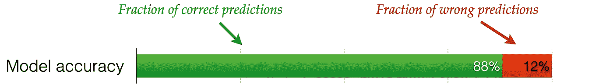
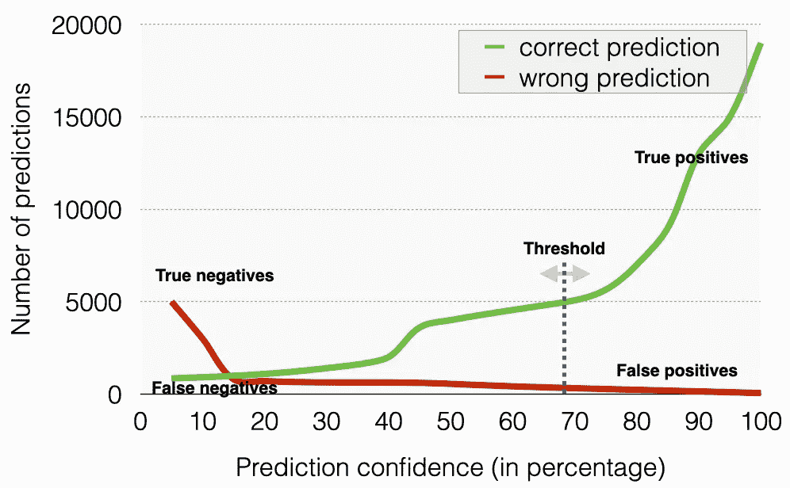
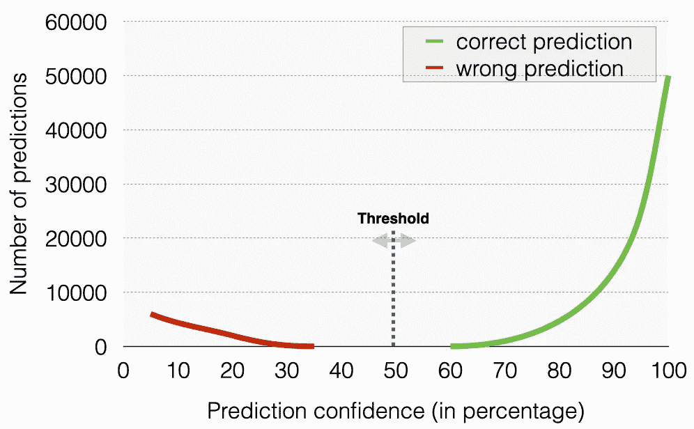
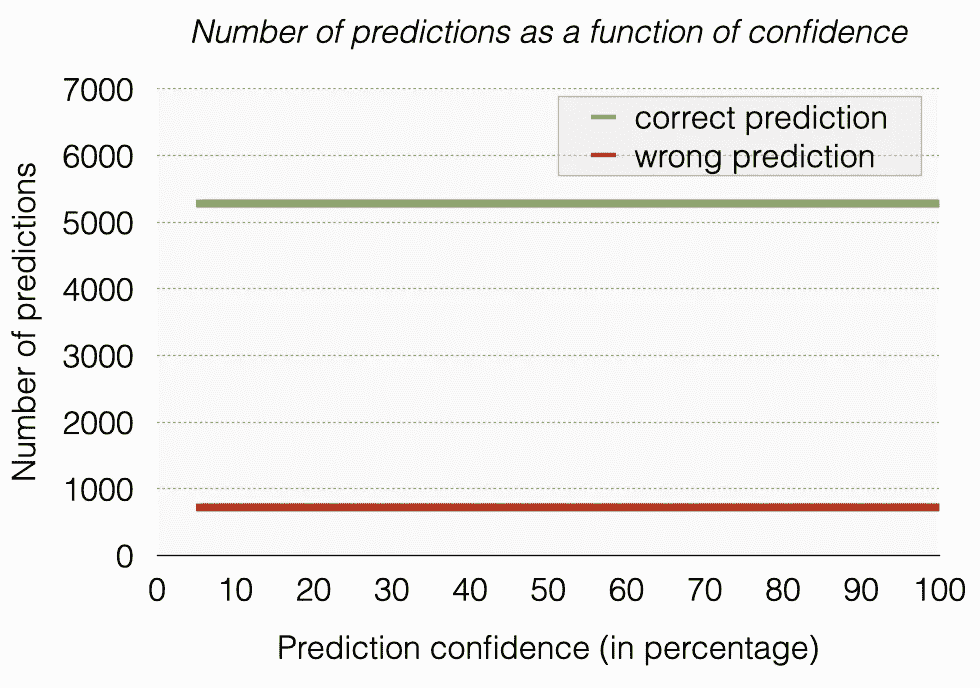
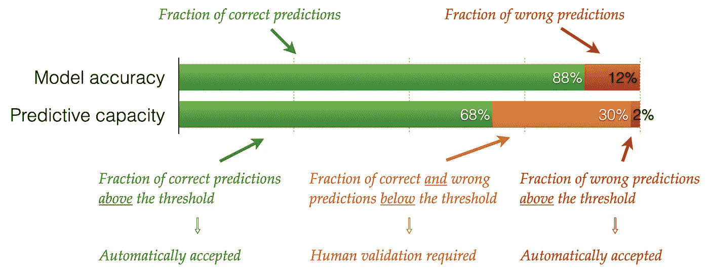
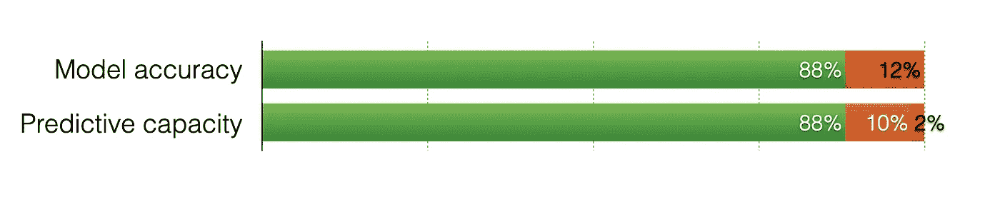

# 人工智能模型的预测能力

> 原文：<https://towardsdatascience.com/predictive-capacity-of-ai-models-989d19675e86?source=collection_archive---------24----------------------->

## 知道人工智能的极限！

由 [Unsplash](https://unsplash.com/s/photos/capacity?utm_source=unsplash&utm_medium=referral&utm_content=creditCopyText) 上的 [drmakete 实验室](https://unsplash.com/@drmakete?utm_source=unsplash&utm_medium=referral&utm_content=creditCopyText)拍摄的照片

# 模型精度

基于神经网络的预测机器学习模型在判断大型数据集时非常强大。但是理解它们是众所周知的困难。

使用标记的数据集来训练神经网络。它们的表现如何是用一个标记的测试集来验证的。这是模型准确性、混淆矩阵、roc 等的地方。派上用场了。

让我们假设我们已经训练了一个 88%准确的模型。这意味着在验证模型的过程中，88%的预测被发现是正确的，12 %的预测被发现是错误的。

(图片由作者提供)

将这个模型应用到新数据中，我们知道 88%的情况下预测是正确的，但在哪些情况下预测是完全正确的。因此，模型精度本身并不是评估单个预测的一个很好的指标。我们需要估计一下*有多大信心*预测是正确的。

如果模型旨在基于预测自动做出决策，则没有预测置信度估计的预测模型是无用的。

因此，人工智能模型也应该为每个预测估计一个*置信度*。我们有多确定这个预测是正确的？

# 预测置信度

让我们假设我们有一个能够计算预测置信度的算法。然后，我们可以根据标记的测试数据验证训练好的模型，并根据预测置信度分析预测结果(正确或错误)。一个实际的例子是根据测试集计算每 5%置信区间的正确和错误预测的数量。

下图显示了一个示例，其中 88%的模型精度现在分布在置信区间上。我们有两类人:正确的预测和错误的预测。考虑这个**例子 1。**

示例 1:88%准确度的模型的预测置信度的实际分布。(图片由作者提供)

如果我们想在自动化过程中使用预测，我们希望能够设置一些置信度阈值，高于该阈值我们接受预测，低于该阈值我们拒绝预测。被拒绝的预测将需要额外的验证，要么通过其他模型，要么通过人类。

具有*高*置信度的预测为真或假阳性，而具有*低*置信度的预测为真或假阴性。

一个理想的模型应该显示正确和错误预测的两个群体之间没有重叠。在下面给出的例子中，同样具有 88%的模型精度，阈值可以设置在 35%-60%置信度范围内的任何地方。考虑这个**例 2** 。

示例 2:88%准确度的模型的预测置信度的理想分布。(图片由作者提供)

作为另一个极端，我们有一个模型，同样具有 88%的准确性，但我们根本无法定义阈值，因为两个群体最大程度地重叠，如下所示。(*这相当于没有对预测置信度的估计！*)考虑这个**例 3** 。

示例 3:准确度为 88%的模型的预测置信度的最坏情况分布。(图片由作者提供)

这三个模型的准确率都是 88%。但是模型的预测能力却大相径庭！

# 计算置信度阈值

阈值是一个重要的参数，取决于你愿意接受多少*假阳性*。这真的取决于商业案例。

与通过阅读医生的笔迹来预测药物剂量的商业案例相比，预测图像显示的是猫还是狗的商业案例可能会接受更多的假阳性结果，这需要准确的高置信度预测。

例如，假设我们有一个可以处理 2%误报的业务案例。那么我们的信心阈值是多少，预测的正确率是多少？我们将会看到我们的三个示例模型有着非常不同的结果。

我们定义了与业务案例相关的三个预测群体:

1.  **误报**:高于阈值的高置信度预测*，被认为是正确预测，但实际上是错误预测。*
2.  **真阳性**:高于阈值的高置信度预测*被接受为正确预测，并且确实如此。*
3.  **否定**:低于置信阈值的任何预测。这些无论实际上是错是对都会被拒绝。

我们现在通过沿着置信分布图中的 x 轴从 100%向下移动到 0%来计算阈值。我们向下滑动它，直到所有误报的总和是总数的 2%。(这对应于阈值右侧红色曲线下的区域。)

每个模型都有不同的阈值解决方案。在我们的示例中，如果我们允许 2%的假阳性，则示例 1 的阈值约为 75%，示例 2 的阈值约为 35%，示例 3 的阈值无解，因为对于所有预测置信度，假阳性的数量为 12%。

记住，三个模型的准确率都是 88%！

让我们直观地比较一下准确性和预测能力。

示例 1:比较模型准确性和预测能力。(图片由作者提供)

对于示例 1，我们发现 70%的预测具有高于阈值的置信度，并且可以被认为是正确的。我们知道，这不会给系统带来超过 2%的误差。只有 30%的案例需要人工验证。

人类也会犯错误，因此引入系统的总误差分数将大于 2%。

我们可以使用这样的技术来估计模型的预测能力，作为业务指标的函数，因此我们可以计算模型的投资回报。

在这个例子中，以前 100%的工作是人工劳动，现在我们已经减少到 30%。

在理想情况下，作为预测置信度函数的正确和不正确预测的总体不重叠，预测能力实际上接近准确度。

示例 2:比较模型准确性和预测能力。(图片由作者提供)

在这种特殊的情况下，如果我们接受 0%的误报，我们就会得到准确的结果。因此，模型精度是模型能够达到的预测能力的上限。

# 持续培训

当人工智能被部署时，你希望它及时变得更好。这就是人类反馈数据如此重要的地方:人类纠正错误的预测，提供新标记的数据，这些数据可用于模型的未来训练。该模型已经在高置信度数据上表现良好，因此我们不需要太多的人对这些数据的反馈。

随机挑选一小部分高可信度预测，并人为降低它们的可信度，这样它们就会被人类挑选出来，而不是被自动处理。再加上低置信度的预测，这些预测总是会被人发现，这就确保了我们能得到整个群体的反馈。

持续学习的模型有效地在置信空间中分离正确和不正确预测的群体。这允许您降低阈值并增加可以自动处理的预测的比例。最大值等于模型精度！

随着数据的增加，模型的准确性可能会提高，但事实并非如此。例如，如果你在数据的标注上有 5%的误差，你将永远不会获得优于 95%的准确度。

# 最终带走

尽管模型准确性对于评估机器学习模型的质量和性能很重要，但对于现实世界的预测人工智能来说，你需要掌握一个预测有多*自信*。

您可以使用可接受的误差分数(误报)等业务指标来计算模型的预测能力。

如果不理解预测的可信度，你的模型可能是没有价值的，即使它的准确性非常高！

*注意:以上分析成功应用于多个神经网络模型读取医生笔迹。你可以在之前的阅读中找到更多关于手写项目* [*早期版本的信息。*](/deciphering-doctors-handwriting-using-deep-learning-b3fce634f2e1)