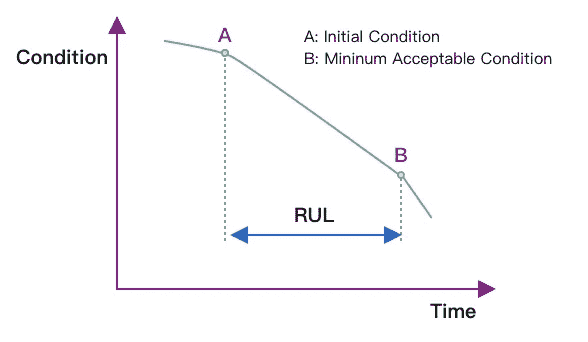
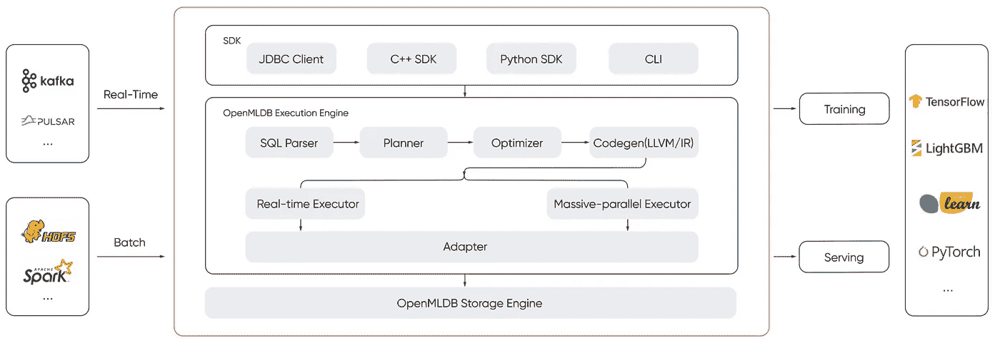

# 预测性维护— 5 分钟的端到端机器学习项目演示

> 原文：<https://towardsdatascience.com/predictive-maintenance-5minutes-demo-of-an-end-to-end-machine-learning-project-60941f1c9793?source=collection_archive---------37----------------------->

## 构建机器学习项目的循序渐进和端到端指南


卢卡·斯拉普尼卡在 [Unsplash](https://unsplash.com?utm_source=medium&utm_medium=referral) 上拍摄的照片

## 背景

剩余使用寿命(RUL)是指系统一般工作一段时间后能继续正常运行的剩余寿命时间。借助 RUL，工程师可以安排维护时间、优化运行效率并避免计划外停机。因此，预测 RUL 是预测性维护计划的首要任务。



作者图片

这张照片显示了机器随着时间的推移而退化的情况。如果 **A** 是当前条件，而 **B** 是机器将失效的最小可接受条件，剩余使用寿命计算为这两点之间的时间。如果提前估计到 RUL，就可以对其进行维护或更换，以避免计划外停机和经济损失。由于 RUL 的预测对运营和决策具有重要意义，因此对其进行准确的估计至关重要。

今天，我们的任务是通过机器学习模型开发一个用于剩余使用寿命预测的实时智能应用程序。我们使用 NASA 提供的涡扇发动机退化仿真数据集作为训练集和测试集，开发了一个智能预测硬件剩余寿命的应用程序，并完成实时预测。最终的预测结果是 **time_ in_ cycle** ，这意味着在可接受的条件下，发动机未来可以旋转多少次。

可以直接按照以下步骤操作。后面我们还会附上培训所需的代码。本文主要展示了如何快速完成一个端到端的机器学习应用，省略了数据探索的过程。

## 使用 docker 提取演示图像

首先，请检查 docker(运行演示的唯一依赖组件)是否安装在您的计算机上。

```
$ docker pull 4pdosc/openmldb_turbo_rul_demo:0.7.0
```

## 运行图像

这里我们选择 bash 命令来运行它

```
$ docker run -it 4pdosc/openmldb_turbo_rul_demo:0.7.0 bash
```

## 切换到相应的目录并初始化环境。

整个初始化过程包括安装 [OpenMLDB](https://github.com/4paradigm/OpenMLDB) 和相关的运行环境。关于初始化脚本，请参考 *init。上海*

```
$ cd rul && sh init.sh
```

## 将历史数据导入到 [OpenMLDB](https://github.com/4paradigm/OpenMLDB)

使用 [OpenMLDB](https://github.com/4paradigm/OpenMLDB) 进行时间序列特征计算需要历史数据，所以我们将历史数据导入 [OpenMLDB](https://github.com/4paradigm/OpenMLDB) 进行实时推理。历史数据可用于特征推断。

1.  进口代码请参考 *import.py* 。
2.  使用' t *est here_ Fd004。TXT* `作为历史数据，有多个发动机循环的检测数据。

```
$ python3 import.py
```

## 训练模型

模型训练需要训练数据。以下是用于生成的代码。

1.  训练特征生成脚本代码在 *train.p* y 中
2.  训练数据是` *train_ Fd004。TXT* `，有多个发动机循环的检测数据

最后，我们可以生成模型。

```
$ python3 train.py ./fe.sql /tmp/model.txt
```

## 利用训练模型构建实时推理 HTTP 服务

基于上一步生成的训练特征矩阵，我们使用'*随机森林回归器*进行训练。得到的训练模型，结合 [OpenMLDB](https://github.com/4paradigm/OpenMLDB) 中的历史数据，构建实时推理服务，整个推理服务代码引用 *predict_ server.py.*

```
$ sh start_predict_server.sh ./fe.sql 9887 /tmp/model.txt
```

## 然后我们可以通过 HTTP 请求发送一个推理请求

```
$ python3 predict.py
```

## 最后，可以打印预测结果

```
----------------ins---------------
         1     2      3       4    5    6    7
0  35.0033  0.84  100.0  449.44  0.0  0.0  0.0
---------------predict rul -------------
[321.26]
Congraduation! You have finished the task.
Your Key:b'kSpmZICy0kuTqgAPGC8TMCg/3HmnscIfJrESkOEekOpfcW6+oGnltUf9Vts='
```

上面的 *ins* 部分显示了使用 [OpenMLDB](https://github.com/4paradigm/OpenMLDB) 计算的特性。这里我们使用的特征被简化了。您可以阅读 *fe.sql* 文件了解具体特性；

下面的*预测 RUL* 显示了预测结果 *time_ in_ cycle* ，这意味着发动机可以继续旋转 321 次。

在一个数据库的帮助下，你可以完成机器学习的端到端应用。是不是很神奇！

如果你想了解更多，你可以点击: [OpenMLDB](https://github.com/4paradigm/OpenMLDB)

# 体系结构



作者图片