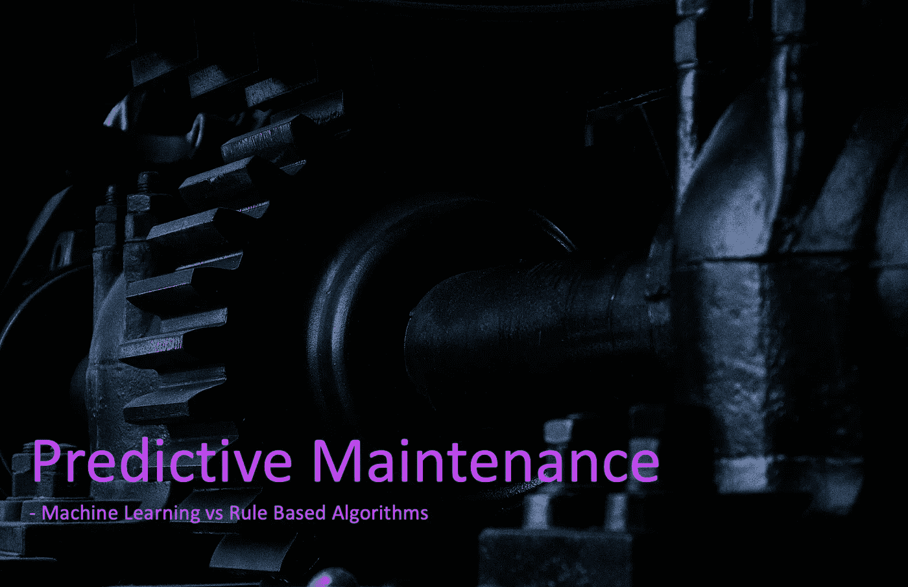
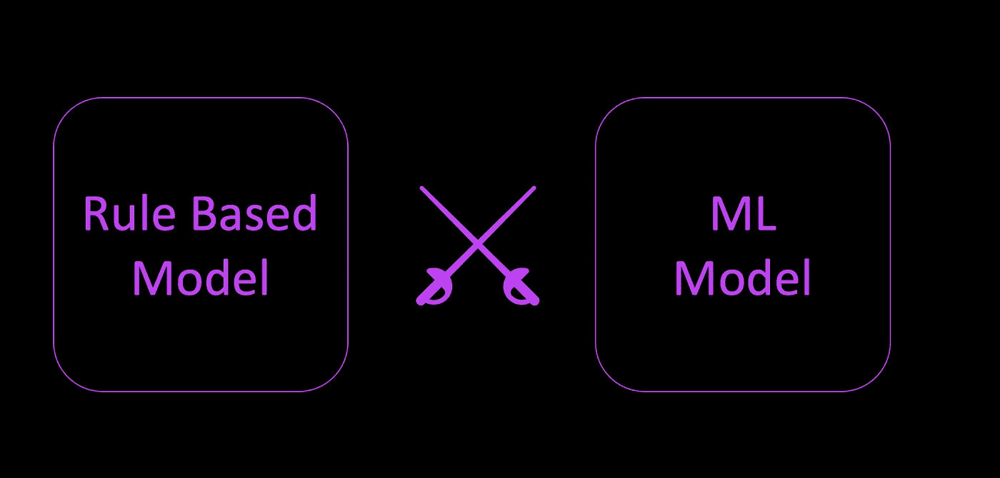
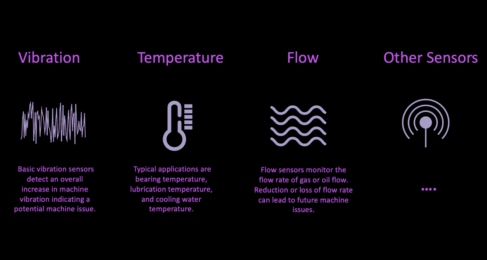
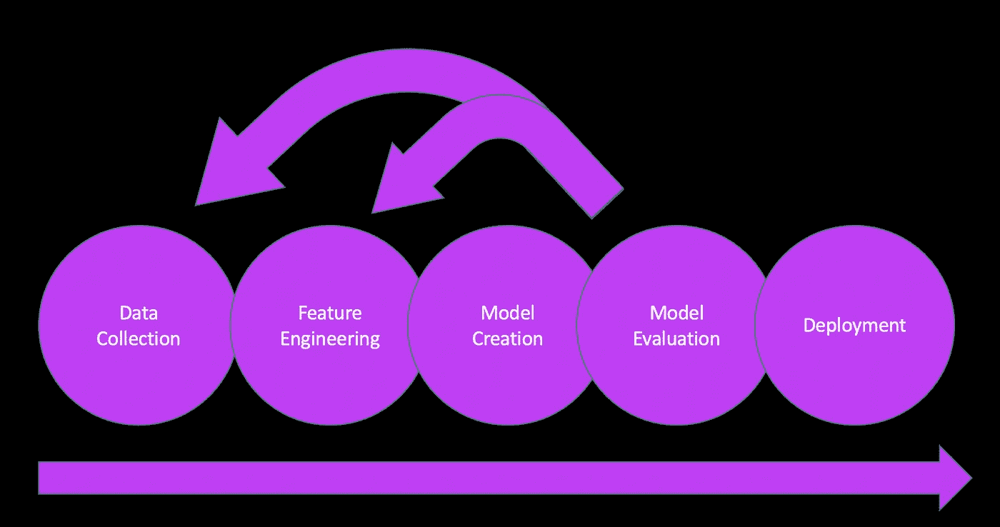

# 预测性维护:机器学习与基于规则的算法

> 原文：<https://towardsdatascience.com/predictive-maintenance-machine-learning-vs-rule-based-algorithms-cb48414df448?source=collection_archive---------21----------------------->

## 在您的预测性维护项目中，使用机器学习更好还是应该首先使用基于规则的算法？

虽然各种文章中都讨论了基本的预测性维护概念，但在选择预测错误的最佳方法时，实际上很少有发现。在本文中，我们先简要介绍预测性维护，然后重点介绍如何选择最适合您的预测性算法:是使用机器学习模型更好，还是应该首先使用基于规则的算法？

预测性维护——ML vs 基于规则(图片由[Isis frana](https://unsplash.com/@isisfra?utm_source=unsplash&utm_medium=referral&utm_content=creditCopyText)在 [Unsplash](https://unsplash.com/?utm_source=unsplash&utm_medium=referral&utm_content=creditCopyText) 上拍摄)

## 什么是预测性维护？

让我们从理解我们从哪里来开始，它是关于什么的，我们需要一些背景:预测性维护基本上和它一样古老，并且在它的基础上没有什么新的东西。过去，如果机械师维修机器时发现某个部件有异常的视觉或听觉行为，机器可能会在损坏前停机并更换部件。这已经是预测性维护。今天的新事物是，机器和算法可以基于智能算法、更多数据和自动警报来执行这项任务。

(由 NBC[https://media.giphy.com/media/l1ZzUHEoKOnqa2v7Rv/giphy.gif](https://media.giphy.com/media/l1ZzUHEoKOnqa2v7Rv/giphy.gif)拍摄)

预测性维护很难实现，但潜在的好处远远超过了努力。尽管在许多情况下实际部署比预期花费更多时间和精力的原因有很多(团队专业知识、数据可用性和处理、理解相关性和算法、授权给利益相关方等等)，但最终的解决方案将产生:

*   主要由于减少了停机时间，节省了大量成本
*   避免因连接部件导致的相关机械故障
*   降低备件存储成本
*   维护团队可以专注于长期改进，而不是紧急维修
*   额外的好处:将会产生一个宝贵的数据宝藏，可用于所有类型的其他优化任务。

因此，如果您还在犹豫预测性维护对您的组织来说是否是一个好的下一步，那么您不应该浪费更多的时间，最好现在就开始。

## 选择正确的方法

众所周知，你将把大部分时间花在数据采集、清理和准备上。这是最具挑战性的任务之一，尤其是在传感器数据方面，预计会有大量数据需要适当的大数据环境来相应处理。但在开始所有这些工作之前，您应该考虑如何进行预测，以适应基于规则的方法或机器学习模型的特征工程。

预测性维护—选择正确的方法(图片由作者提供)

当然，我们首先需要知道这两种选择之间的区别，以便能够为您的组织选择最佳方法。让我们从基于规则的预测性维护开始。

## 基于规则的预测性维护

基于规则的模型非常依赖于你的工程团队的知识和经验。让我在下面解释一下原因:与客户服务反馈一起，质量管理、产品负责人和其他与产品密切相关的团队可以提供关于机器故障原因或哪些特定零件可能会损坏的见解。基于规则的“IF-X-THEN-Y”模型是根据您团队的实践经验和理论知识实施的，以确定某个测量变量是否失控(例如，谢瓦尔特规则、六适马等)。

用于预测性维护的典型传感器数据(图片由作者提供)

一个实际的例子是，生产中的机器的振动传感器长时间高于阈值，并且特定轴承的温度稳定增加。这将触发通知或发送警报，以便问题可以提前解决，工程师需要知道在哪里查看。

## 机器学习预测维护

实现一个预测性的机器学习模型你的团队的领域知识仍然是不可避免的，特别是当涉及到特征工程时，但是没有必要定义与我们在基于规则的预测模型中看到的相反的特定规则。

要符合机器学习模型，输入和输出都是必需的。在这种情况下，所谓的输入是我们的独立变量，特征或者随便你怎么称呼它。例如，在预测性维护中，这通常是温度或振动传感器的实际数量。当然这真的取决于你去计算新的独立变量。这个过程被称为特征工程，它本身就是一个主题。

标准的机器学习过程(图片由作者提供)

一旦你有了你的独立变量，你需要添加你想要的结果，之前称之为输出。预测性维护中的因变量通常是零件故障的警报或警告。然后，在创建的训练集的帮助下训练机器学习模型，以预测即将出现的错误。

请注意，有大量不同的机器学习模型，我们将在未来的文章中探索它们，因为现在的主要焦点是基于区分规则与机器学习模型。

## 结论——现在选择哪种方法？

有这样的情况，组织试图提出最先进的机器学习模型，而不事先做好基础工作。因此，问问你自己，你是否有足够的经验、技术知识和数据基础设施来实现一种胜过基于规则的系统的机器学习算法。

如果答案是否定的，并且您正准备开始处理整个数据问题，还不确定数据环境，并且希望收集初步经验，我强烈建议您首先从基于规则的模型开始，然后随着时间的推移，它可以发展为高级机器学习算法。

**************************************************************

与此相关的文章:

[动手:预测客户流失](/hands-on-predict-customer-churn-5c2a42806266)

[应用机器学习提高初创公司估值](/applied-machine-learning-models-for-improved-startup-valuation-a7b180fee127)

[动手:客户细分](/hands-on-customer-segmentation-9aeed83f5763)

[数据误导&统计](/misleading-with-data-statistics-c6d506bdb9cf)

什么是 [landingdata.de](http://landingdata.de) ？

***************************************************************