# 提督:如何用 Python 编写和调度你的第一个 ETL 管道

> 原文：<https://towardsdatascience.com/prefect-how-to-write-and-schedule-your-first-etl-pipeline-with-python-54005a34f10b?source=collection_archive---------2----------------------->

## [实践教程](https://towardsdatascience.com/tagged/hands-on-tutorials)

## 工作流管理系统变得简单——在本地和云中


照片由 [**海伦娜从**](https://www.pexels.com/@wildlittlethingsphoto?utm_content=attributionCopyText&utm_medium=referral&utm_source=pexels) **[**洛佩斯**](https://www.pexels.com/photo/young-man-writing-reminder-on-fridge-and-drinking-coffee-at-home-3867001/?utm_content=attributionCopyText&utm_medium=referral&utm_source=pexels) 删节**

Prefect 是一个基于 Python 的工作流管理系统，它基于一个简单的前提*——您的代码可能会工作，但有时会不工作* ( [来源](https://docs.prefect.io/core/))。当一切都按预期运行时，没有人会考虑工作流系统。但是当事情变糟时，提督会保证你的代码成功失败。

作为一个工作流管理系统，Prefect 可以轻松地将日志记录、重试、动态映射、缓存、失败通知等添加到您的数据管道中。当你不需要它时，它是看不见的——当一切都按预期运行时，当你需要它时，它是看得见的。类似保险的东西。

虽然 Prefect 不是 Python 用户唯一可用的工作流管理系统，但它无疑是最熟练的一个。诸如 Apache Airflow 这样的替代方案通常工作得很好，但是在处理大型项目时会带来很多令人头疼的问题。你可以在这里阅读 Prefect 和 Airflow [的详细对比。](https://docs.prefect.io/core/getting_started/why-not-airflow.html#overview)

本文涵盖了库的基础知识，比如任务、流、参数、失败和时间表，还解释了如何在本地和云中设置环境。我们将使用[土星云](https://www.saturncloud.io/s/?utm_source=dario-radecic)作为那部分，因为它使配置毫不费力。它是一个由数据科学家制作的云平台，因此大部分繁重的工作都是为您完成的。

土星云可以毫不费力地处理完美的工作流程。它也是从仪表板到分布式机器学习、深度学习和 GPU 培训的前沿解决方案。

今天，您将学习如何:

*   在本地安装提督
*   用 Python 写一个简单的 ETL 管道
*   使用提督来声明任务、流程、参数、时间表和处理故障
*   在土星云中跑完全程

# 如何在本地安装提督

我们将在虚拟环境中安装完美的库。基于 Python 3.8，以下命令将通过 Anaconda 创建并激活名为`prefect_env`的环境:

```
conda create — name prefect_env python=3.8
conda activate prefect_env
```

您必须输入几次`y`来指示 Anaconda 继续，但是每个安装都是如此。就库而言，我们将需要 *Pandas* 进行数据操作，*请求*下载数据，当然还有*perfect*进行工作流管理:

```
conda install requests pandas
conda install -c conda-forge prefect
```

我们现在已经具备了开始编写 Python 代码所需的一切。让我们接下来做那件事。

# 用 Python 编写 ETL 管道

今天我们将使用 Prefect 来完成一个相对简单的任务——运行 ETL 管道。这个管道将从一个伪 API 下载数据，对其进行转换，并将其保存为 CSV 格式。JSON 占位符网站将作为我们的虚拟 API。其中，它包含了十个用户的虚假数据:

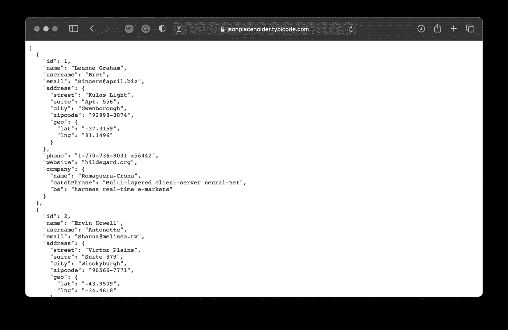

*图片 1——伪造的用户数据(来源:*[【https://jsonplaceholder.typicode.com/users )](https://jsonplaceholder.typicode.com/users))*(图片作者)*

让我们从创建一个 Python 文件开始——我已经将我的文件命名为`01_etl_pipeline.py`。此外，确保有一个文件夹，用于保存提取和转换的数据。我称之为`data`，它位于 Python 脚本所在的位置。

任何 ETL 管道都需要实现三个功能——提取、转换和加载数据。在我们的例子中，这些函数的作用如下:

*   `extract(url: str) -> dict` —向`url`参数发出获取请求。测试以查看是否返回了一些数据—在这种情况下，它作为字典返回。否则，将引发异常。
*   `transform(data: dict) -> pd.DataFrame` —转换数据，以便只保留特定的属性:ID、姓名、用户名、电子邮件、地址、电话号码和公司。以熊猫数据帧的形式返回转换后的数据。
*   `load(data: pd.DataFrame, path: str) -> None` —在`path`将之前转换的`data`保存为 CSV 文件。我们还将在文件名后附加一个时间戳，这样文件就不会被覆盖。

在函数声明之后，当执行 Python 脚本时，这三个函数都会被调用。以下是完整的代码片段:

现在，您可以通过从终端执行以下命令来运行该脚本:

```
python 01_etl_pipeline.py
```

如果一切运行正常，您应该看不到任何输出。但是，您应该在`data`文件夹中看到 CSV 文件(我已经运行了该文件两次):

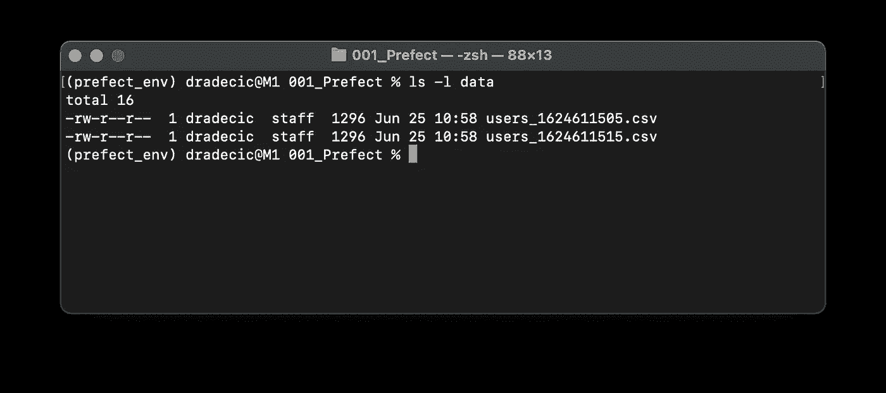

*图 2 —运行两次 ETL 管道后，数据文件夹中的 CSV 文件列表(图片由作者提供)*

正如您所看到的，ETL 管道运行并完成，没有任何错误。但是，如果您想按计划运行管道，该怎么办呢？这就是提督的用武之地。

# 探索提督的基础

在这一部分中，您将学习*perfect*任务、流程、参数、时间表等更多的基础知识。

## 完美的任务

让我们从最简单的开始——任务。这基本上是你工作流程中的一个步骤。接下来，创建一个名为`02_task_conversion.py`的新 Python 文件。从`01_etl_pipeline.py`复制一切，你就可以开始了。

要将 Python 函数转换成完美的任务，首先需要进行必要的导入— `from prefect import task`，并修饰任何感兴趣的函数。这里有一个例子:

```
@task
def my_function():
    pass
```

这就是你要做的！下面是我们 ETL 管道的更新版本:

让我们运行它，看看会发生什么:

```
python 02_task_conversion.py
```

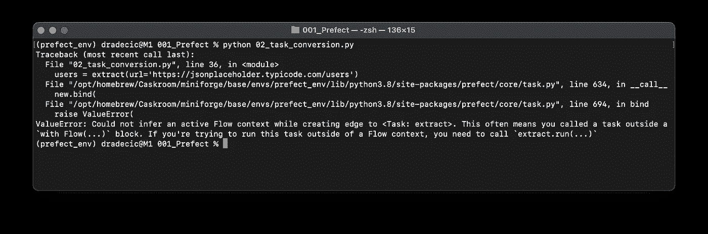

*图 3 —用提督将功能转换为任务(图片由作者提供)*

看起来好像有什么不对劲。那是因为*提督任务*离不开*提督流程。*接下来就来实现吧。

## 完美流程

将`02_task_conversion.py`中的所有内容复制到一个新文件——`03_flow.py`。在声明之前，您需要从`prefect`库中导入`Flow`。

为了声明一个流，我们将编写另一个 Python 函数— `prefect_flow()`。它不会接受任何参数，也不会用任何东西修饰。在函数内部，我们将使用 Python 的上下文管理器来创建一个流。该流应该包含之前在`if __name__ == ‘__main__”`代码块中的三行代码。

在上面提到的块中，我们现在必须用相应的`run()`函数运行流程。

以下是该文件的完整代码:

让我们运行它，看看会发生什么:

```
python 03_flow.py
```

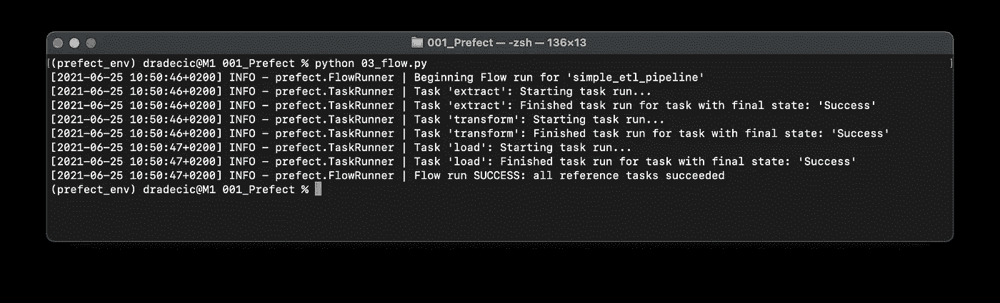

*图片 4——第一次运行提督流(图片由作者提供)*

这下好了！不仅执行了 ETL 管道，而且我们还获得了每个任务开始和结束的详细信息。我已经运行了这个文件两次，所以两个新的 CSV 文件应该会保存到`data`文件夹中。让我们验证一下事实是否如此:

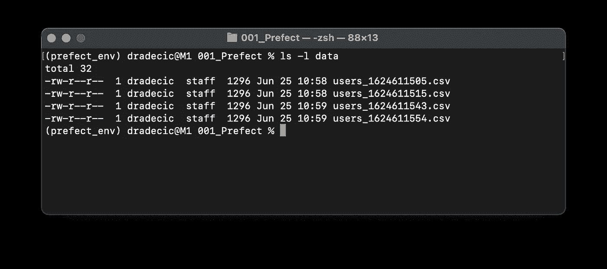

*图片 5 —提督流生成的 CSV 文件(图片由作者提供)*

这就是你如何用 Prefect 运行一个简单的 ETL 管道。与纯 Python 实现相比，它还没有太多好处，但我们会很快改变这一点。

## 完美的参数

硬编码参数值从来都不是一个好主意。这就是*完美参数*的用武之地。首先，将所有内容从`03_flow.py`复制到一个新文件`04_parameters.py`。你需要从`prefect`包中导入`Parameter`类。

您可以在流上下文管理器中使用这个类。以下是你会发现有用的论点:

*   `name` —参数的名称，稍后将在运行流程时使用。
*   `required` —布尔值，指定该参数是否是流程执行所必需的。
*   `default`-指定参数的默认值。

我们将为 API URL 声明一个参数— `param_url = Parameter(name=’p_url’, required=True)`。

为了给参数赋值，您需要指定`parameters`字典作为`run()`函数的参数。参数名和值应该写成键值对。

以下是该文件的完整代码:

让我们运行该文件，看看会发生什么:

```
python 04_parameters.py
```

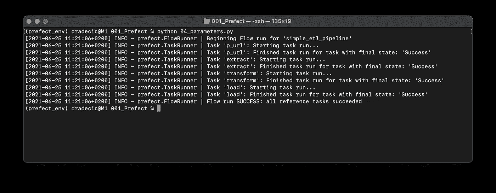

*图片 6 —运行包含参数的完美流程(图片由作者提供)*

我已经运行了这个文件两次，所以两个新的 CSV 文件应该出现在`data`文件夹中。让我们验证一下这是不是真的:

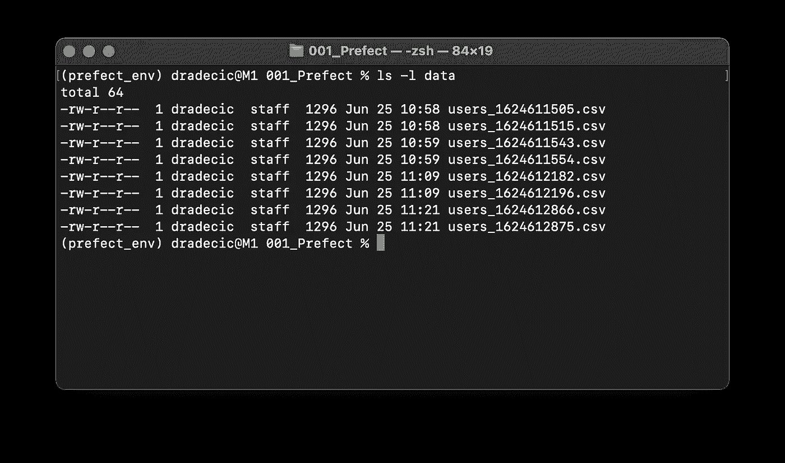

*图 7 —包含参数的提督流生成的 CSV 文件(图片由作者提供)*

这就是你要的——一个地方的参数值规范。它使得以后进行更改和管理更复杂的工作流变得容易。

接下来，我们将探索 Prefect 的一个特别有用的特性——时间表。

## 完美的时间表

今天我们将探讨两种任务调度方式——*间隔调度*和 *Cron 调度*。第二个可能听起来很熟悉，因为 Cron 是一种众所周知的在 Unix 上调度任务的方法。

我们将从**间隔调度器**开始。首先，复制从`04_intervals.py`到`05_interval_scheduler.py`的所有内容。你必须从`prefect.schedules`导入`IntervalScheduler`。

然后，我们将在`prefect_flow()`函数声明之前创建一个导入类的实例，并指示它每十秒钟运行一次。这可以通过设置`interval`参数的值来实现。

要将调度程序连接到工作流，您必须在使用上下文管理器初始化`Flow`类时指定`schedule`参数的值。

整个脚本文件应该如下所示:

让我们运行该文件，看看会发生什么:

```
python 05_interval_scheduler.py
```

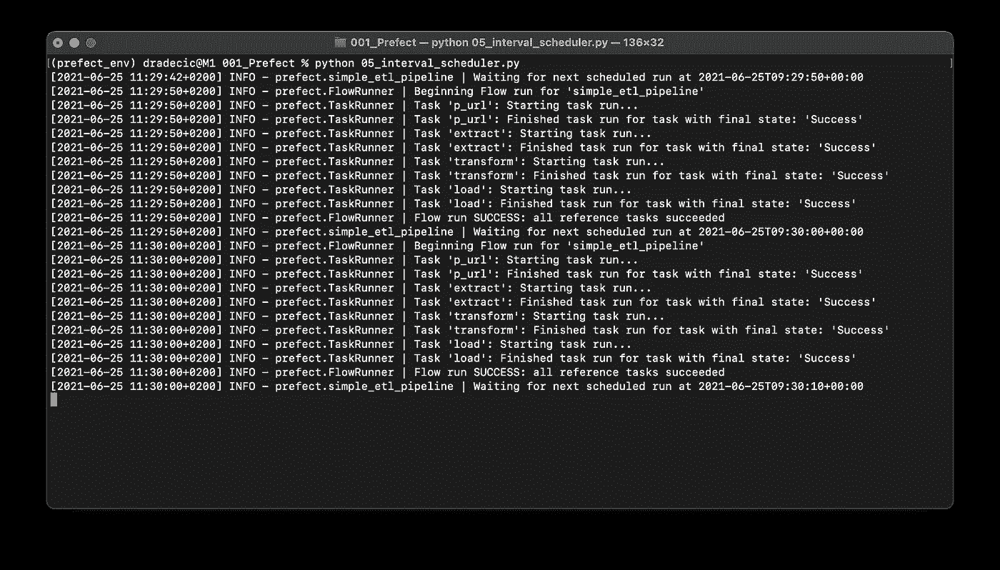

*图片 8 —使用间隔时间表(图片由作者提供)*

如您所见，整个 ETL 管道运行了两次。提督将向终端报告下一次执行的时间。

现在，让我们探索一下 **Cron 调度器**。复制从`05_interval_scheduler.py`到`06_cron_scheduler.py`的所有内容。这次你将导入`CronSchedule`而不是`IntervalSchedule`。

在类初始化时，您将为`cron`参数指定一个 cron 模式。五星符号将确保工作流程每分钟都在运行。这是 Cron 可能的最低间隔。

文件的其余部分保持不变。代码如下:

让我们运行该文件:

```
python 06_cron_scheduler.py
```

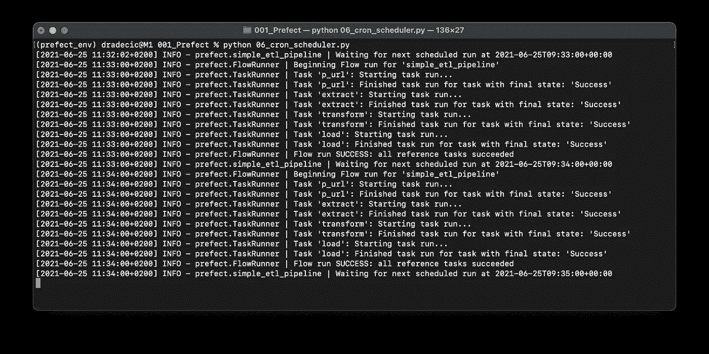

*图片 9 —使用 Cron 计划(图片由作者提供)*

正如您所看到的，ETL 管道每一分钟运行两次，这是由 Cron 模式指定的。在这一部分的最后，我们将探索如何处理失败——并解释为什么你应该总是为它做准备。

## 完美的失败

迟早，你的工作流程中会发生意外的错误。Prefect 提供了一种极其简单的方式来重试任务的执行。首先，将所有内容从`04_parameters.py`复制到一个新文件`07_failures.py`。

`extract()`功能可能因不同的网络原因而失败。例如，也许 API 现在不可用，但几秒钟后就会可用。这些事情发生在生产环境中，不应该使您的应用程序完全崩溃。

为了避免不必要的崩溃，我们可以扩展一下我们的`task`装饰器。它可以接受不同的参数，今天我们将使用`max_retries`和`retry_delay`。两者都是不言自明的，我就不赘述了。

唯一的问题是——我们的工作流程不会像现在这样失败。但是如果我们将一个不存在的 URL 作为参数值放在`flow.run()`中，它就会。代码如下:

让我们运行该文件:

```
python 07_failures.py
```

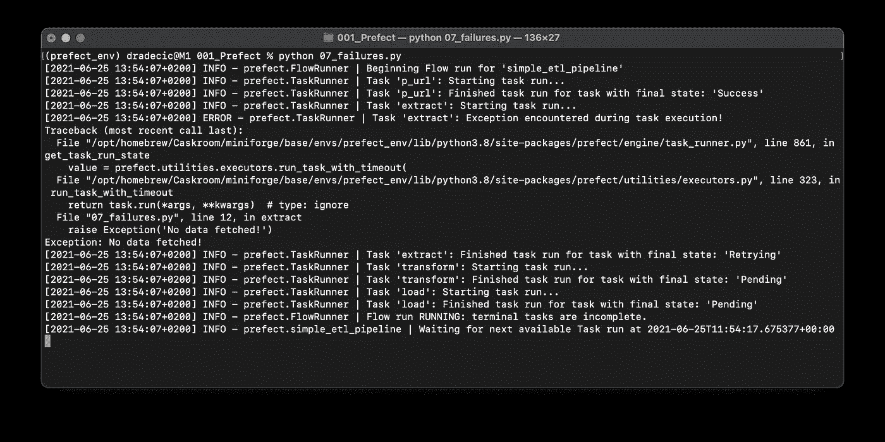

*图片 10——与提督一起预防故障(图片由作者提供)*

任务失败，但工作流没有崩溃。当然，它会在十次重试后崩溃，但您可以随时更改参数规范。

这也是我和地方长官一起工作的原因。接下来，让我们将代码迁移到云中，并探索其中的变化。

# 在土星云中奔跑

让我们马上把手弄脏。首先，注册一个免费版的[提督云](https://www.prefect.io/cloud/)账号。注册过程非常简单，无需进一步解释。注册后，创建一个项目。我给我的取名为`SaturnCloudDemo`。

在进入[土星云](https://www.saturncloud.io/s/?utm_source=dario-radecic)之前，你必须在 Prefect 中创建一个 API 键来连接两者。你会在设置下找到 *API 键*选项。如您所见，我已经将我的命名为`SaturnDemoKey`:

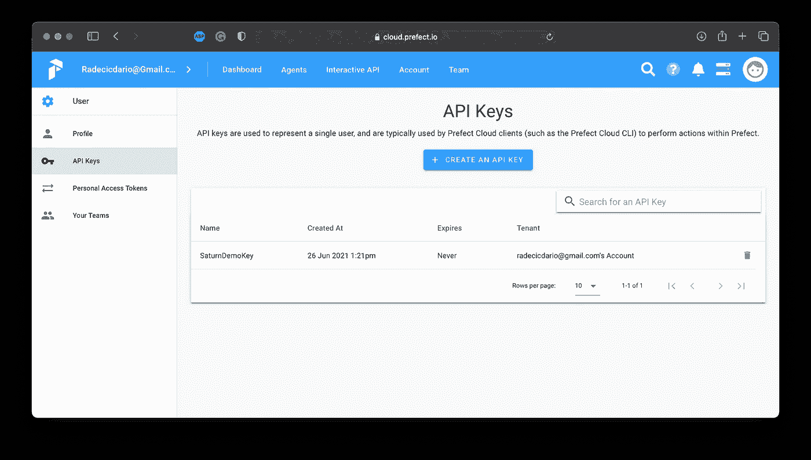

*图片 11 —提督云 API 密钥创建(图片由作者提供)*

你现在已经有了所有需要的东西，所以去[土星云](https://www.saturncloud.io/s/?utm_source=dario-radecic)创建一个免费账户。在仪表板上，您将看到项目创建的多个选项。选择*提督*选项，如下图所示:

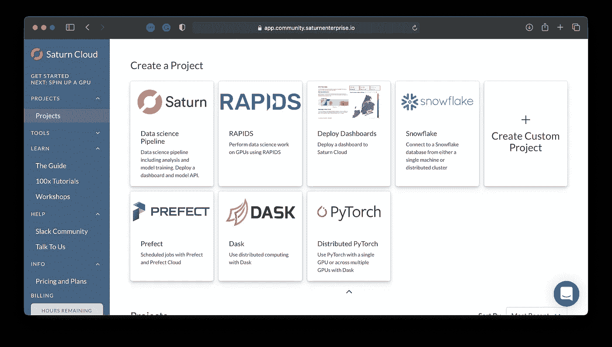

*图片 12——在土星云中创建一个完美的项目(图片由作者提供)*

Saturn Cloud 现在将自动为您完成所有繁重的工作，几分钟后，您将能够通过单击按钮打开 JupyterLab 实例:

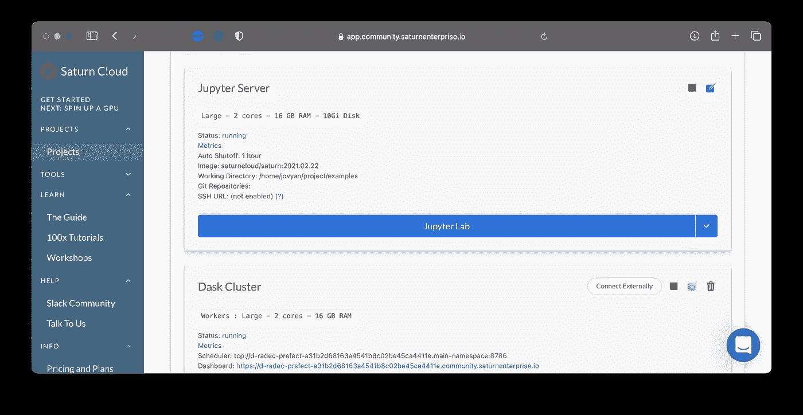

*图 13——土星云中打开的木星实验室(图片由作者提供)*

你可以使用两个笔记本——第二个展示了在土星云中使用 Prefect 的快速演示。它看起来是这样的:

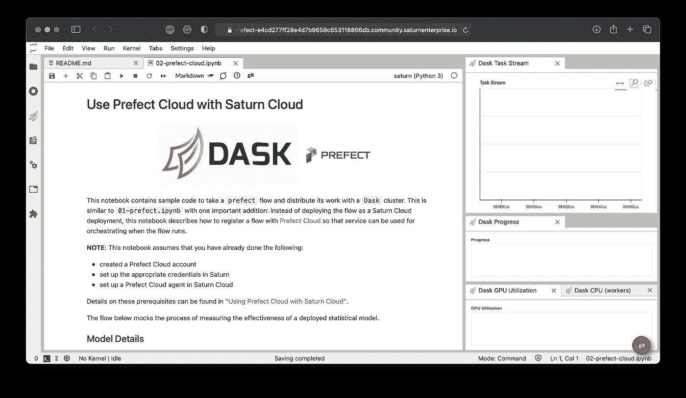

*图片 14——土星云中的完美云笔记本(图片由作者提供)*

要让笔记本工作，您只需更改两件事情。首先，将项目名称更改为您在 Prefect Cloud 中的项目名称。其次，用几分钟前生成的 API 密匙替换`<your_api_key_here>`。如果您做的一切都正确，您应该会看到以下消息:

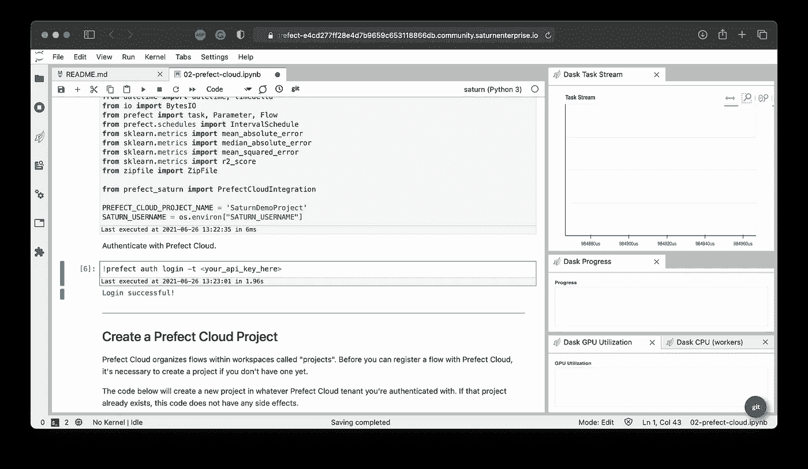

*图片 15——土星云中登录成功的消息(图片由作者提供)*

要进行测试，请运行笔记本中的每个单元格。然后转到完美云仪表板，打开你的项目。它不会像几分钟前那样空无一人:

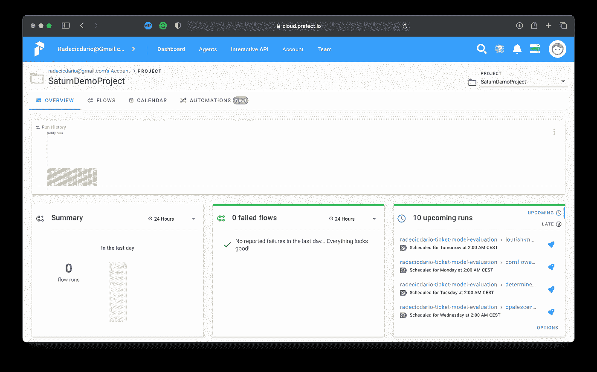

*图片 16 —成功的提督任务调度(图片由作者提供)*

这就是你要做的一切！请随意复制/粘贴我们的 ETL 管道，并验证它是否工作。这就是 Saturn Cloud 的亮点——您可以从本地机器上复制/粘贴代码，只需做最小的更改，因为所有繁琐的工作都是自动配置的。

让我们在下一部分总结一下。

# 最后的想法

现在你有了它 Prefect 的基础解释，包括本地和云。我希望您能够看到工作流管理系统对于生产应用程序的价值，即使您在阅读本文之前对这个主题一无所知。

有关更高级的指南，即配置日志记录和空闲通知，请参考[官方文档](https://docs.prefect.io/core/)。提供的例子足以让你开始。

*喜欢这篇文章吗？成为* [*中等会员*](https://medium.com/@radecicdario/membership) *继续无限制学习。如果你使用下面的链接，我会收到你的一部分会员费，不需要你额外付费。*

[](https://medium.com/@radecicdario/membership) [## 通过我的推荐链接加入 Medium-Dario rade ci

### 作为一个媒体会员，你的会员费的一部分会给你阅读的作家，你可以完全接触到每一个故事…

medium.com](https://medium.com/@radecicdario/membership) 

# 保持联系

*   在[媒体](https://medium.com/@radecicdario)上关注我，了解更多类似的故事
*   注册我的[简讯](https://mailchi.mp/46a3d2989d9b/bdssubscribe)
*   在 [LinkedIn](https://www.linkedin.com/in/darioradecic/) 上连接