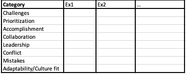
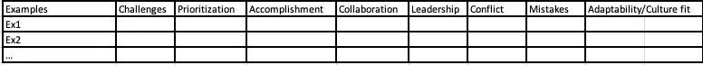
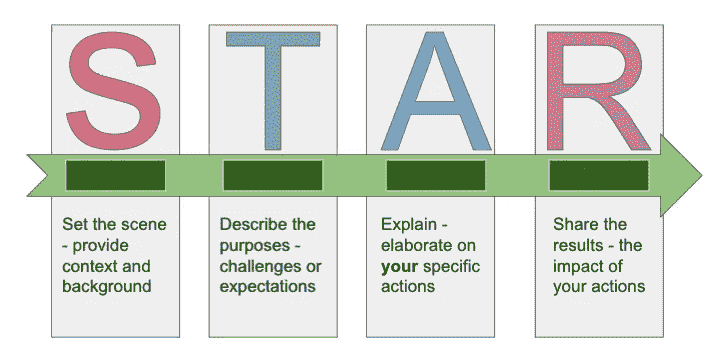

# 为数据科学面试准备行为问题

> 原文：<https://towardsdatascience.com/prepare-behavioral-questions-for-data-science-interviews-96e97f13be15?source=collection_archive---------5----------------------->

Clem Onojeghuo 在 [Unsplash](https://unsplash.com/s/photos/job-interview?utm_source=unsplash&utm_medium=referral&utm_content=creditCopyText) 拍摄的照片

## [办公时间](https://towardsdatascience.com/tagged/office-hours)

## 自信地完成数据科学面试，第 5 部分

我在之前关于数据科学面试准备的文章中已经列出了[机器学习](/20-machine-learning-related-questions-to-prepare-for-interviews-93bcba72f911)、[统计学](/22-statistics-questions-to-prepare-for-data-science-interviews-d5651a8b3c56)、[概率论](/12-probability-practice-questions-for-data-science-interviews-2ec5230304d9)中需要练习的技术问题。我还讨论了可用于在数据科学面试之前和期间准备[案例研究问题](/structure-your-answers-for-case-study-questions-during-data-science-interviews-a14a02d21e6c)的策略。本文是数据科学面试准备系列的第五篇文章，将重点讨论行为问题。我将首先讨论如何准备行为回合，然后列出一些常见问题供您练习技巧。

我最喜欢面试过程中的行为环节，因为与其他技术环节相比，它相当放松。在我知道任何回答行为问题的策略之前，我总是觉得我在和某人聊天，谈论我在这一轮中的有趣经历。虽然在面试中拥有一个不那么紧张的心态是件好事，但是过度放松的心态可能不会帮你给面试官留下好印象。结果我说了太多细节，失去了证明我拥有面试官想要的东西的机会。请记住，即使你大部分时间都在和面试官聊天，你仍然会通过这一轮的谈话得到评估。如果你能借此机会向面试官展示，根据你的经验和个性，你是这个职位的最佳人选，那就最好了。没有坚实的例子和既定的结构，你就无法有效地表达自己，我将在本文中讨论这一点。

## **第一部分。收集实例**

你回答行为问题的内容是基础。在面试过程中，为了保持对话流畅，你很少有时间去想一个完美的例子来回答这个问题。因此，在准备面试时，我们应该从收集所有“有用”的经验开始，并根据它们可以用来回答什么类型的问题进行分类。这样，你就知道你总会有话题可谈，并且有合适的例子来支持你的论点。在这一节中，我将讨论收集可靠示例的过程。

**列出你的清单**

你应该用什么例子来回答行为问题？想想你过去有过的工作和学习经历，分门别类。

当我准备行为问题时，我用下表来头脑风暴我的经历。虽然提问的方式有上百万种，但我们可以将其归纳为以下八类。你遇到过哪些挑战？你如何安排工作的优先次序？有哪些你想分享的成就？有哪些展现你领导能力的例子？你们什么时候有过矛盾，怎么处理的？你犯过哪些错误？你如何适应一个新的环境，你如何融入？

类别清单

对于每个类别，搜索你的记忆，准备至少一个例子来分享。如果你有一个以上的每个类别的例子，太好了！把它们都写下来，在不同的方面进行强调。例如，对于显示你的成就的同一类别，你可能会发现一个例子强调你的自学技能，另一个例子显示你是一个团队成员。都是面试官可能会寻找的优秀品质。将它们全部收集起来，并学习如何在面试中根据问题的背景来优先考虑要分享的内容。

**区分例子的优先顺序**

如果你有几个你征服过的挑战，你应该选择哪一个来回答一个特定的问题？我建议您遵循这些原则来排列示例的优先级:

*   优先考虑影响较大的例子:影响是关键。它展示了你的工作成果，证明你有资格申请。当你说我为我的项目建立了一个新的模型，人们可能会想知道为什么，直到你提到这个模型增加了 x%的客户保持率。
*   优先考虑相关的例子:这里的相关性有几个方面。首先，基于问题的语境是没有疑问的，问题怎么问，答案可能不一样。因此，积极倾听在面试中非常重要。虽然你可能已经准备了一个很好的演讲，但如果与问题无关，你应该随时调整你的答案。此外，如果你申请工作岗位，与工作相关的例子与学校项目更相关。
*   优先考虑最近的例子:讨论最近发生的例子比讨论很久以前发生的事情更好。例如，你可以讨论你在最近职位上的经历。如果你有工作经验，当被问到领导技能时，你仍然使用学校的例子，面试官可能会怀疑你是否能够在工作中实践你的技能。这将发出一个不好的信号。

**研究公司核心价值观和职位描述**

基于你所谈论的经历，面试官希望从你身上找到一些关键特征。一般来说，这些特征是:

*   优秀的沟通者
*   自信与谦逊
*   积极进取
*   遵守规则和协议的能力
*   独立自主
*   与他人合作愉快
*   问题求解程序
*   对角色和公司的承诺
*   领导素质
*   公司的正面代表

你使用的例子应该向面试官展示你拥有他们所寻找的关键特征。此外，每个公司都有自己的核心价值观，这些价值观会优先考虑某些品质。你应该很容易在网上找到核心价值观，或者从工作描述中总结出来。在准备例子的时候，记住所有的核心价值观，试着在你的答案中融入它们并区分它们的优先次序。

**充分利用每个例子**

在回答一个关于解决冲突的问题时，除了展示你解决问题的技巧，你还可以展示你优秀的沟通技巧和领导主动性。因此，我建议也为你所有的代表性例子制作下表:

首先总结一下这个例子的量化影响。然后，尝试分析该示例，并勾选标记该示例有助于演示的类别。你可以用一句话总结一下你在这个例子中完成的任务，展示你在这个类别中的素质。

如果你以前有工作经验，你可以很容易地找到大量的例子，当你全职工作，兼职，或在实习期间。对于新毕业生来说，学术经验也可以被视为工作经验，只要有合适的例子。你可以谈论你从事的一个个人研究项目；你如何与顾问合作，顾问就像是工作中的监督者；你是如何和其他研究生一起工作的，他们就像工作中的同事一样。如果你曾经做过助教，即使这份工作本身可能与你现在申请的职位无关，你仍然可以谈论一些展示你沟通和领导能力的经历。

**要诚实**

**不要编造任何例子！** **不要冒充自己不是的人。**找到工作不是故事的结束，而是一个开始的篇章。你不想给你未来的同事或老板留下错误的印象，在未来的每一天你都必须表现得像另一个人。与其编造例子，不如试着思考你的经历，挖掘细节。当我寻找我的第一份全职工作时，我很难向一些面试官证明我的工作能力。我非常强调我在创业公司的实习经历，尤其是我和我的主管以及来自不同团队的同事一起工作的时候。这段经历给了我很多例子来证明我的沟通和领导能力，并向面试官展示我能在快节奏的工作环境中表现出色。这也是为什么我们需要深入并充分利用我们上面讨论的所有例子。

## **第二部分。建立并练习结构**

你的答案应该总是有条理的。否则，你会很容易发现自己长时间无目的地说话，或者喃喃自语不必要的细节。你没有赶上朋友，你需要深入你经历的每一个细节。你也没有写一部惊悚片，你需要你的读者努力思考，并试图给他们惊喜。面试时，你的回答应该直接、简洁、清晰。

**遵循星型结构**

星星代表状况、要求、结果。这是一个可靠的方法来组织你的答案。

作者绘图

你可以通过简单描述你所处的情况或者你需要完成的任务来开始你的回答。然后谈论你必须完成的任务。之后，列出你完成任务所采取的行动。最后，总结你行动的结果。比如发生了什么？事件是如何结束的？你完成了什么？你学到了什么？请注意:

*   你可以用结果来描述情况。例如，你可以以“我想分享我建立一个将客户流失率降低 x%的模型的时间”开始你的回答。
*   你选择的任务应该是具体的，而不是笼统的或者假设的。
*   重点描述**你的**任务和行动，即使是一个团队项目。如果你需要提及他人的任务，强调沟通和协作技巧。
*   如果能量化结果，总会更让人印象深刻。

更多细节和例子，参考[这篇文章](https://www.indeed.com/career-advice/interviewing/how-to-use-the-star-interview-response-technique)和许多其他在线文章，帮助你练习这个结构。

**关注影响而非过程**

我再怎么强调展示你的作品的影响力也不为过。你如何做到这一点很重要，但这不是重点，因为你不是在参加知识共享会议。你应该专注于你做了什么，特别是有什么结果。量化对公司关键 KPI 的影响会给面试官留下更深刻的印象。

**细节留待后续提问**

一开始不要深究细节，尤其是技术细节。保持你的答案清晰，直奔主题。对示例进行高水平的介绍，首先关注影响和结果。如果面试官很好奇你是如何取得结果的，他们会问一些后续问题，那么你可以谈得更详细一些。如前所述，对你知道的和不知道的要诚实。如果你假装做过某事或知道某事的细节，面试官可能会问后续问题，发现你在撒谎。这是一个可怕的信号。

## 第三部分。练习常见问题

现在，您已经有了一些例子，并且知道了要使用的正确结构，请练习以下问题:

*   告诉我一次你被要求做你以前从未做过的事情？你学到了什么？
*   告诉我你同时参与多个项目的时候。你是如何安排时间的？结果如何？
*   告诉我你工作中某件重要的事情没有按计划进行的时候。你的角色是什么？结果如何？你从经历中学到了什么？
*   告诉我你不得不与难以相处的人一起工作的时候。你如何处理与那个人的互动？
*   告诉我一个当问题出现时你的主管不在的时候。你是如何处理这种情况的？你和谁商量了？

## 最后的话

还有很多其他的问题你可以在网上找来练习。当我说练习时，我的意思不是让你写下答案并通读一遍，希望在面试中得到完全相同的问题。而是用既定的结构来练习答题。此外，在镜子前或与同伴练习，这样你会得到一些反馈。请记住，在面试过程中，你不是在演讲，而是在和别人交谈。因此，积极倾听，同时留意他人的反应非常重要。我知道虚拟面试可能更具挑战性，我这里有一篇文章[可以帮助你更好地准备虚拟面试。我们的目标是进行一次精彩的对话，这样你就可以专注于回答问题，而不是提供“完美的答案”。](/how-to-be-better-prepared-for-virtual-data-science-interviews-7650c4492d65)

这就是本文的全部内容。感谢您的阅读。这是我所有博客帖子的列表。如果你感兴趣的话，可以去看看！

 [## 我的博客文章库

### 我快乐的地方

zzhu17.medium.com](https://zzhu17.medium.com/my-blog-posts-gallery-ac6e01fe5cc3)  [## 阅读朱(以及媒体上成千上万的其他作家)的每一个故事

### 作为一个媒体会员，你的会员费的一部分会给你阅读的作家，你可以完全接触到每一个故事…

zzhu17.medium.com](https://zzhu17.medium.com/membership)