# 使用 Amazon SageMaker Data Wrangler 这款可视化和数据准备工具，以最快、最简单的方式为您的 ML 模型准备数据

> 原文：<https://towardsdatascience.com/prepare-data-for-your-ml-models-in-the-fastest-and-easiest-way-with-amazon-sagemaker-data-wrangler-186aaa71e7d9?source=collection_archive---------29----------------------->

## 使用 SageMaker Data Wrangler 对数据进行预处理和可视化的分步指南

# 摘要

亚马逊 SageMaker [Data Wrangler](https://aws.amazon.com/sagemaker/data-wrangler/) 是 2020 年 12 月宣布的一项新服务，旨在简化机器学习的数据准备和特征工程过程。您可以使用该工具的可视化界面来构建预处理和可视化管道(或称之为流程)。准备就绪后，导出您的代码流并在任何地方运行！它还集成了其他 SageMaker (SM)服务(如 SM [管道](https://aws.amazon.com/sagemaker/pipelines/)和 SM [功能商店](https://aws.amazon.com/sagemaker/feature-store/) )

。在这篇文章中，我们将通过使用一个样本数据集构建一个*数据牧马人* *流*来介绍这一新服务的功能。我们将在 Data Wrangler 环境中导入我们的数据，并探索其数据处理和可视化能力。最后，我们将看到我们的工作如何运作。这篇文章的目的是探索这种新的 SageMaker 产品的可能性，并展示如何以简单、快速和可重复的方式为机器学习任务准备数据。

# 先决条件

如果你打算继续下去，有几样东西你需要拿到手。即使你没有，你仍然可以阅读这篇文章，自己决定这个工具是否适合你。
Data Wrangler 是 SageMaker Studio 的一部分，sage maker Studio 是基于云的 IDE。因此，您需要访问 SM Studio 和 Data Wrangler。如果您是第一次从您的帐户使用 SageMaker，那么免费层将涵盖您的费用，因为它包括前两个月每月 25 小时的 Data Wrangler 使用。但是，请注意，如果您不属于这一类别，将会产生一些费用。
在这两种情况下，一定要坚持到这篇文章的结尾，看看如何清理使用的资源，并确保不会留下任何运行的东西，这会在月底引起令人惊讶的账单。

您还需要使用现有的或新的 [S3](https://aws.amazon.com/s3/) 铲斗。

# 资料组

我们将使用众所周知的葡萄酒质量数据集，你可以在这里找到并下载。本质上，这是一个回归问题，我们试图根据一些已知的特征(物理化学测试)来预测葡萄酒的质量分数(感官数据)。
以上链接中的数据由两个数据集组成，白葡萄酒和红葡萄酒各一个。

# 设置

在我们深入 SageMaker 世界之前，请确保下载数据并进行以下处理。截至本文撰写之时，如果数据是 CSV 格式的，Data Wrangler 可以直接从 S3 加载数据(它也支持从 Redshift 或通过使用 Amazon Athena 加载数据，但这超出了本文的范围)。
我们拥有的数据集实际上是分号分隔的值，而不是逗号分隔的值。因此，您需要打开您选择的文本编辑器并替换“；”带“，”。
或者，如果您喜欢命令行，并且在基于 Unix 的系统上，您可以从命令行快速完成此操作:

```
sed ‘s/;/,/g’ winequality-white.csv > winequality-white-converted.csv
sed ‘s/;/,/g’ winequality-red.csv > winequality-red-converted.csv
```

下一步，将这些文件上传到 s3 存储桶。不管它是新的还是现有的存储桶，只要您有权限将数据上传到那里并检索它们。

首先，打开 SageMaker Studio，因为这是我们访问 Data Wrangler 图形用户界面(GUI)的方式。如果你以前没有这样做过，打开 AWS 控制台，搜索“sagemaker”并打开 Studio。如果你想了解更多关于 Studio 的信息，请看这里。

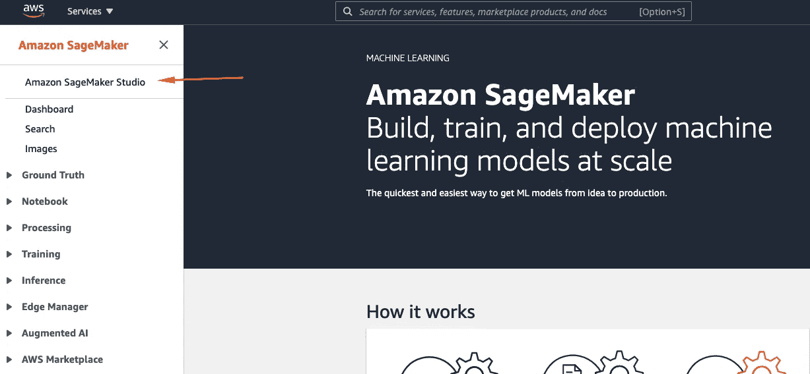

# 步骤 1 —创建新的流并导入数据

SageMaker studio 启动并运行后，点击进入 Data Wrangler 菜单后出现的“新流程”,创建新的 Data Wrangler 流程，如下所示。

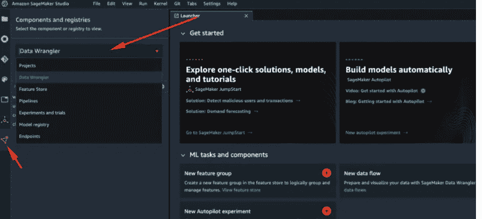

一旦完成，就该导入数据了。在 import 选项卡上，单击 s3 并导航到包含数据的 s3 文件。

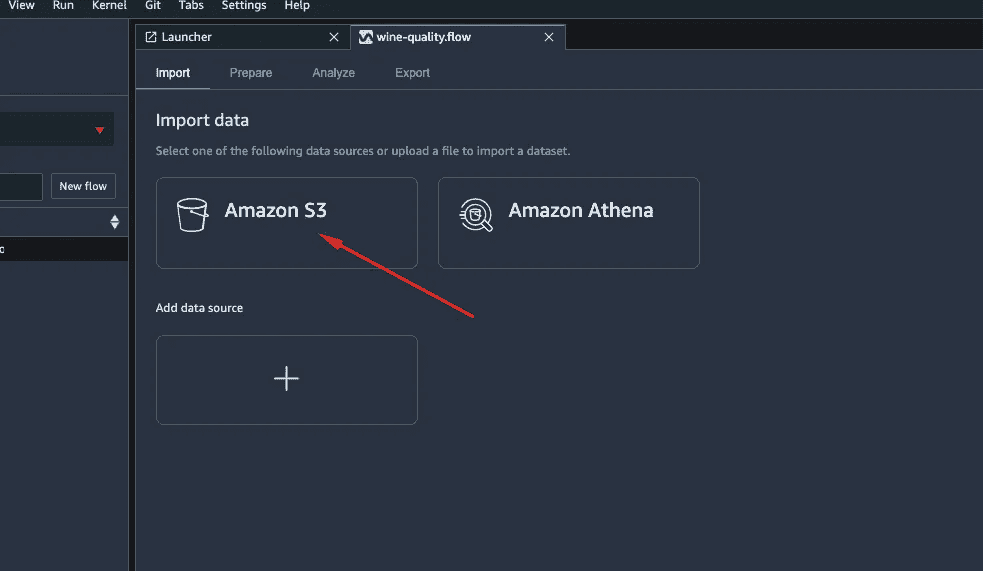

请注意，您将能够一次导入一个数据集，因此您需要这样做两次，因为我们的数据在两个文件中。再次点击“导入”标签，出现如上页面，再次点击从亚马逊 S3 导入。

# 步骤 2 —将数据连接在一起

在同一个窗口中，转到选项卡*准备*应该如下所示。如果没有，请再次检查您是否遵循了说明。

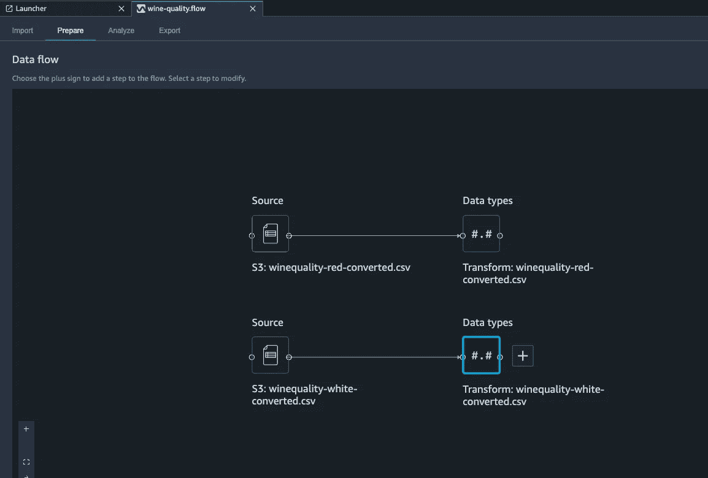

现在，我们将在这里构建我们的处理流程！第一步是将我们的数据集连接起来。
点击“+”图标，显示我们可以采取/添加到流程中的行动。

在我们现在的例子中，我们将选择连接。
单击*连接*后，您需要单击要连接的数据集。单击另一个数据集。然后点击*配置*获得更多选项。
在这里，我们选择新数据集的名称，以及我们是否想要添加一列来指示任何特定行来自哪个文件。

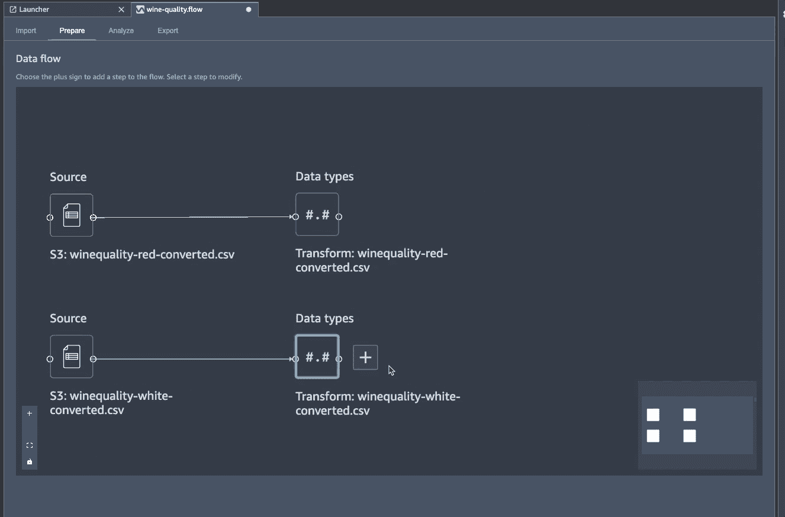

# 步骤 3 —转换数据

Data Wrangler 的好处之一是收集了可用的转换，您可以对数据进行开箱即用。但是如果这还不够，您还可以添加自定义转换。

我们将再次按下“+”图标，这次是新创建的葡萄酒质量框旁边的那个图标(代表新数据集)。从下拉菜单中选择“*添加转换”。*
在右边你会看到一个支持的转换列表。随意探索和试验你喜欢的。

为了向您展示它是如何工作的，让我们选择处理数字→保持变换&缩放器不变→选择一列(如糖残留)→点击缩放&中心→预览&添加

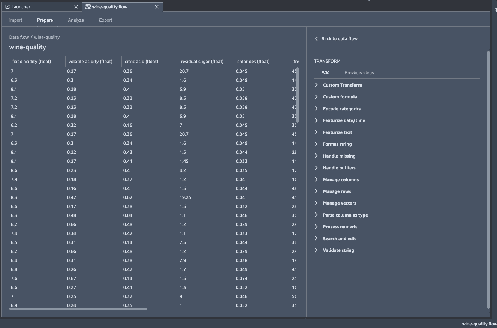

让我向您展示如何添加自定义计算。
点击自定义转换，选择您将使用的底层框架并键入您的代码。就这么简单。
目前你的选择是使用 Python 和 Pandas，Python 和 PySpark，或者在 PySpark SQL 上使用 SQL。

那么，让我们创建一个新的特性。我将使用 python-pandas 代码创建它:

```
*df[‘leakyFeature’] = df[‘quality’] * 2*
```

如果你正在注意，你可能会从椅子上跳起来，对我大喊这毫无意义。请耐心听我说，一会儿我想给你看些有趣的东西。现在，这展示了如何使用定制代码来添加您自己的、独特的转换。

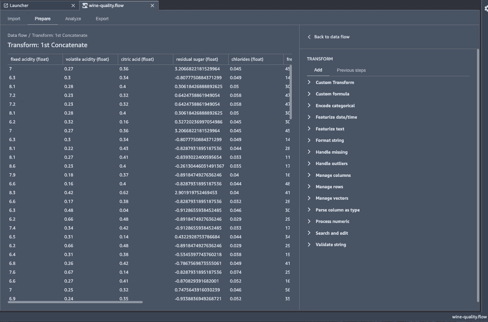

# 步骤 4 —可视化数据

构建处理流程不可或缺的一部分是理解您的数据，而帮助您理解数据的最佳方式之一就是将数据可视化。Data Wrangler 也可以帮助您做到这一点。

让我们回到主*准备*页面，再次点击“+”图标。这次选择“*添加分析*”。
这将带您进入一个菜单，您可以从可用图形类型列表中进行选择。你可以随意探索，但是现在，让我们选择做一个散点图。我想看看*残糖*与*总二氧化硫*按*酒型分解的关系。*
选择预览以生成绘图，如果你想保留它，点击*创建。*

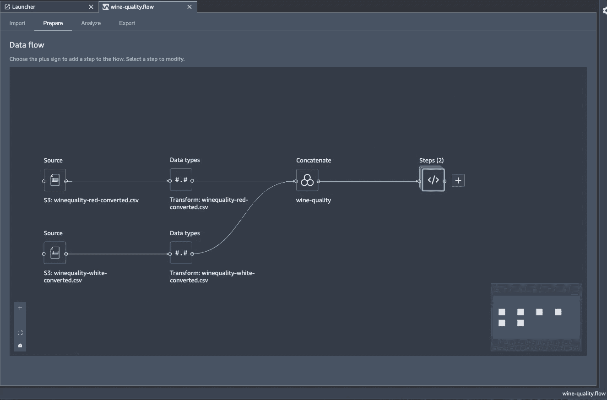

这样做又快又省事。使用这些图表，我们现在可以探索数据集，更好地理解我们的数据之间的关系，并且我们可以选择保留我们希望在未来重新创建的分析步骤，或者删除没有信息的步骤。

谈到这种分析功能，您可以做几个重要的分析，这可以极大地帮助您为即将到来的机器学习建模阶段准备数据。

首先让我们来看看泄漏检测。这个分析试图告知我们潜在的 ***目标泄露*** 。这就是目标变量的信息似乎通过另一个特征泄漏的时候。在现实生活中，这可能发生在我们使用一个可能是目标变量的子产品，但实际上在推理时不可用的特征的情况下。这正是我们之前创建“泄漏特征”的原因。来模拟这样的场景。这听起来不太可能发生，但它确实发生了，你需要做好准备并留意它。让我们看看我们如何能做它。

我们创建一个新的分析，这次选择“TargetLeakage”作为*分析类型*。选择适当的*问题类型*和*目标*变量(对我们来说是“质量”)。点击预览，等待几秒钟。

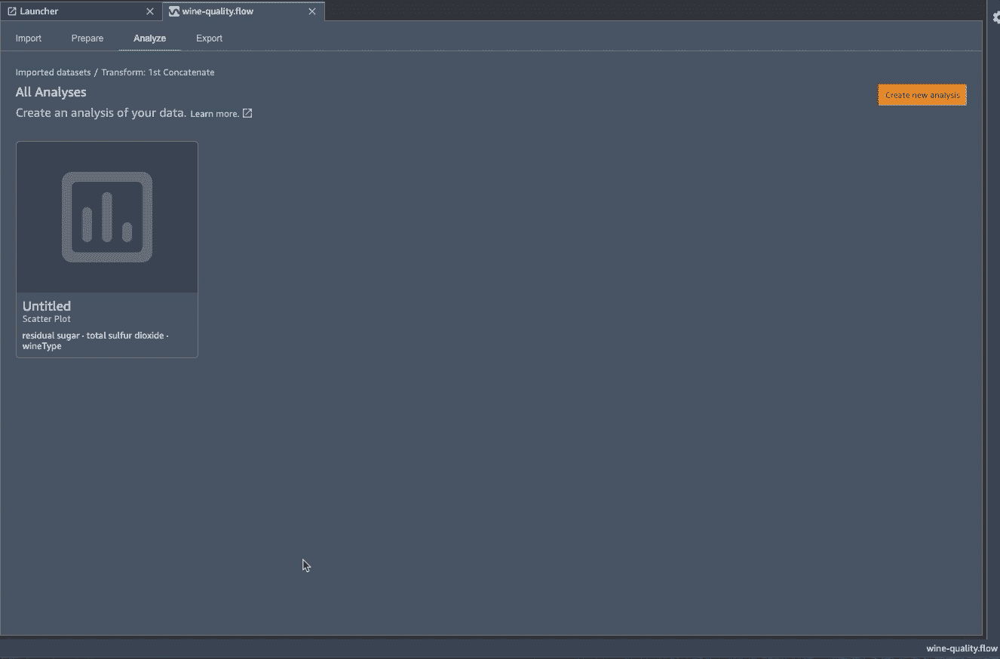

如您所见，它能够检测到由于特性“ *leakyFeature* ”(如预期的那样)而导致的信息泄漏，因此现在我们可以添加一个步骤来从我们的数据集中删除该列。

请注意，在这一步，数据科学家负责进一步调查某个特征是否确实在泄露信息。可能存在这样的情况，即某个特征非常具有预测性，并且实际上将在推断时间期间可用。机器和算法变得越来越智能，但仍然需要数据科学家来做出这样的决定。
要删除该列，*像以前一样添加一个转换*，并选择 *Manage columns* 来删除列 *leakyFeature* (当然，您可以一开始就不创建它，但这只是一个例子)

我想向您展示的最后一个分析功能是 ***快速模型*** *。*

这是一个非常方便的特性，在引擎盖下训练一个模型(一个随机的森林)并报告性能和特性重要性。这不是用来作为预测的模型，而是作为一个指示，你可以期望模型工作的多好，也给你什么样的特性会更重要的见解。有了这些信息，你可以决定回到绘图板，考虑你的特征工程，节省你的时间，让你更快地迭代特征工程。如果你有兴趣了解更多关于快速模型是如何工作的，我鼓励你阅读更多关于文档的内容。我需要强调的一点是。快速模型将尝试自动猜测我们要解决的问题类型(分类或回归)。方法是通过查看目标变量来推断。如果它有超过 100 个不同的值，那么它假设这是一个回归问题，如果它没有那么它是分类。在我们的例子中，我们只有 10 个不同的值，所以这将被理解为一个分类问题。

*下一步完全是可选的————*

有人可能会说，我们可以把这个问题作为一个分类问题来处理，但我想把它变成一个回归问题。怎么会？你还记得我们之前做的自定义计算吗？让我们利用这一点。
让我们创建一个自定义计算，这次添加以下 python 代码:

```
*import numpy as np*
*df[‘quality’] = df[‘quality’] + 0.1 * np.random.random(size=(df.shape[0]))*
```

这是在做什么？这给我们的目标变量增加了一些低量级的随机噪声。这不会影响任何分析的质量，但会使 data wrangler 将我们的问题视为回归

注意:如果您尝试以下两种回归和分类方法，您会发现特征重要性基本相同。

*完全可选步骤结束———*

要运行快速模型分析你需要添加分析，选择快速模型然后选择目标变量是什么。点击预览，等待几秒钟，看看结果。


正如你所看到的，快速建模非常快速和容易使用，可以给我们一些很好的见解，哪些功能可能在建模阶段更有用。

# 步骤 5 —导出您的作品

到目前为止，这很好，但是我听到你问我们如何通过点击来操作我们创建的流程。
是时候将我们的工作以一种更易于操作的格式导出了。

Data Wrangler 提供了几种不同的方法来导出您的流量。简而言之，这些选项如下。

*   用 python 代码导出:您可以将您的流导出到 python 文件中。然后，您可以获取这个 python 文件，并在您需要的任何地方以任何方式运行它。你甚至可以编辑文件，添加你定制的额外步骤或改变一些东西。
*   导出为 Data Wrangler 作业:这将生成一个笔记本，在运行时，它将加载您的流文件并将其作为 SageMaker 处理作业执行。
*   导出为要素存储:这与上述方法类似，但也会在要素存储中创建和接收数据。如果您正在创建希望团队中的其他成员或未来的自己能够访问的功能，并且您认为 SageMaker 功能商店是适合您这样做的服务，那么这将非常方便。
*   Export as Pipeline:这将创建一个笔记本，它定义一个 SageMaker 管道，其中一个处理步骤是流的执行。如果您希望使用 SageMaker Pipelines 来操作您正在进行的整个 ML 项目，这将是理想的，因为 Pipelines 是 ML 领域 AWS 的 CI/CD 工具。

无论如何，让我们看看我们能做什么。
我们单击顶部的导出选项卡，我们单击我们流程的步骤，然后单击“*导出步骤*”。

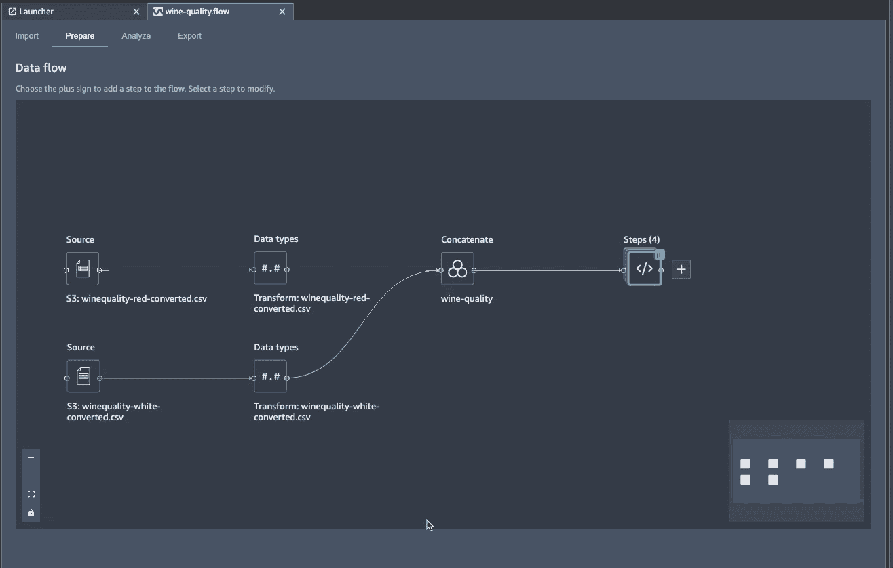

正如您所看到的，生成的 python 文件相当长，但是不用担心，大部分都是转换的函数定义。滚动到底部，您将清楚地看到我们在流程中采取的所有步骤现在都是通过代码完成的。

# 总结

综上所述，我们已经快速地做了相当多的工作，而且几乎没有编写任何代码。
我们首先将数据集组合在一起，创建并转换特征，可视化我们的数据，并了解哪些特征在建模过程中更有用，这样我们甚至不用离开我们正在使用的工具就可以重复特征工程阶段。最后，我们看到，这种互动和可视化流程可以很容易地导出为各种格式，这取决于我们的运营需求。

你现在已经准备好试验你自己的数据并创建你自己的流了。请在下面的评论中告诉我你的成功或者你在这个过程中遇到的任何挫折。

# 清理

如果你一直在跟踪，那么在你关闭浏览器窗口之前，不要忘记关闭我们一直在使用的 Data Wrangler 服务器，否则你将会产生意想不到的费用。
首先确保保存您的 Data Wrangler 流，如果您想保留它，然后关闭实例，如下图所示。

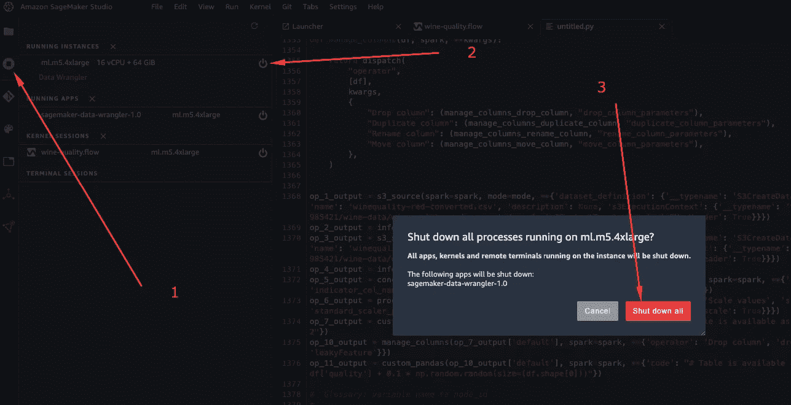

现在去享受一杯茶或咖啡吧。这是你应得的！