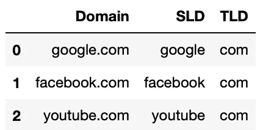

# 为注重网络安全的数据科学准备 DNS 数据

> 原文：<https://towardsdatascience.com/preparing-dns-data-for-cyber-security-focused-data-science-e596eb03cdf?source=collection_archive---------34----------------------->

## TLDextract 和其他数据准备方法指南


阿迪·戈尔茨坦在 [Unsplash](https://unsplash.com/@adigold1?utm_source=unsplash&utm_medium=referral&utm_content=creditCopyText) 上拍摄的照片。

互联网的域名系统(DNS)将域名转换为数字互联网协议(IP)地址[1]。这使得人类浏览网页变得容易得多，比起一串看似随机的数字，人类更容易记住 medium.com。但是像网络空间中几乎所有的活动一样，网络威胁已经并将继续利用 DNS 活动[2]。

正因为如此，专注于网络安全的数据科学家经常发现自己在处理 DNS 数据。通常，这由一个域列表组成，没有其他内容；发现不寻常的或恶意的域名可能具有挑战性。然而，了解域名结构和基本功能工程可以让数据科学家丰富域名数据，以便进行更深入的分析。

# (域名)中有什么？

域名包含了相当多的信息。考虑下面这个维基百科的例子:


https://en.wikipedia.org 元素的分解。作者创建的图像。

顶级域名(TLD)和二级域名(SLD)共同构成了互联网用户通常记忆中的根域名。顶级域名可以传达额外的信息，例如国家代码顶级域名(ccTLDs)的地理位置。有些网站有子域；在上面的例子中，维基百科有不同的语言和不同的子域相关联。维基百科使用“en”来表示英语子域，而 fr.wikipedia.org 会提供法语子域[3]。其他常见的子域用途包括博客、商店和支持网站。

说到 DNS 和网络安全数据分析，一个域名列表，如 medium.com，google.com，yahoo.com 等。，可能看起来没多大价值。这就是通过[TLDextract](https://github.com/john-kurkowski/tldextract)【4】的数据准备和来自特征工程的概念【5】发挥作用的地方:

> 特征工程是利用领域知识从原始数据中提取特征(特性、性质、属性)的过程。
> 
> — [特色工程，维基百科](https://en.wikipedia.org/wiki/Feature_engineering#:~:text=Feature%20engineering%20is%20the%20process,competitions%20and%20machine%20learning%20projects.)

# 领域数据

首先，我们需要一些数据。 [Majestic Million](https://majestic.com/reports/majestic-million) 根据参考子网跟踪排名前 100 万的域名，以衡量网站的重要性或相关性[6]。该网站提供基于知识共享署名的 CSV 数据导出许可。

本演练使用 GitHub 页面上提供的 Majestic Million [**的前 100 个域名的样本，以及分析中使用的完整 Jupyter 笔记本**](https://github.com/kurtklingensmith/DNSdataPrep) 。下载笔记本和数据以便跟进。下面是原始数据的一个示例:


Majestic Million 数据样本的前五行的作者截屏。

# 右旋糖酐

从一个域名中提取 TLD、子域名等看起来就像在句点处拆分字符串一样简单。但是，在国家代码的情况下，一些顶级域名是由多个部分组成的(例如:co . uk)；TLDextract 说明了这一点，它是一个比内置函数更好的工具，内置函数可能会将字符串拆分成句点[7]。

首先安装 [TLDextract](https://github.com/john-kurkowski/tldextract) :

```
pip install tldextract
```

然后导入库:

```
import tldextract
```

## 1.剥离二级域名

要获取一个域，例如 medium.com，并提取“medium ”,请运行以下代码:

```
df['SLD'] = [tldextract.extract(i).domain for i in df.Domain]
```

产生的数据帧样本为:


作者截图。

## 2.剥夺顶级域名

要提取 medium.com 的 TLD，如“com ”,请运行以下代码:

```
df['TLD'] = [tldextract.extract(i).suffix for i in df.Domain]
```

产生的数据帧样本为:



作者截图。

## 3.提取子域

要提取子域，如 en.wikipedia.com 的“en ”,请运行以下代码:

```
df['subdomain'] = [tldextract.extract(i).subdomain for i in df.Domain]
```

并非所有的域都有子域，因此要查看效果，有必要通过以下代码进行排序:

```
df.sort_values(by='subdomain', ascending=False).head(3)
```

按视图子域排序的结果 dataframe 示例为:


作者截图。

请注意 TLDextract 是如何将一列域转换成几列数据的。查看子域名和顶级域名可以证明对各种类型的网络安全分析有用。例如:

*   Spamhaus 跟踪[十大最差顶级域名](https://www.spamhaus.org/statistics/tlds/)的滥用情况，并提供 TLD 检查功能[8]。提取 TLD 提供了一种识别数据集中常见滥用 TLD 的方法。
*   子域名构成了劫持的机会，并且根据 ATT 协议 CK 框架是一个已知的漏洞。

# 后续步骤:特征工程概念

虽然 TLDextract 提供了丰富的信息，但域名有更多值得提取的数据:

## 1.字母比率

域名由字母数字组成。除了字母，域名中还有其他字符，如数字和句点。字母与非字母的比率可以提供对领域特征的洞察。以下 python 函数将有助于提取字母比例信息:

```
def LetterRatio(domain):
    if len(domain) > 0:
        return len(list(filter(str.isalpha, domain)))/len(domain)
    return "No Domain"
```

尝试运行一个示例域，如 medium.com:

```
LetterRatio("medium.com")
```

这应该返回 0.9，因为有 10 个字符，其中 9 个是字母，一个是句点。使用以下代码将其应用于数据帧:

```
df['LetterRatio'] = df['Domain'].apply(LetterRatio)
```


作者截图。

## 2.领域部分

域部分将域分成多个可用的部分。例如，medium.com 有两个，用句点分隔两个部分。提取它的函数是:

```
def DomainSections(domainName):
    array1 = domainName.split(".")
    return len(array1)
```

使用以下代码将其应用于数据帧:

```
df['DomainSections'] = df['Domain'].apply(DomainSections)
```


作者截图。

## 3.字符计数

最后一个是域名中的简单字符数。使用以下代码将其应用于数据帧:

```
df['DomainCharacters'] = df['Domain'].str.len()
```


最终准备好的数据框架的作者截屏。

# 准备好的数据帧及其用途

曾经只有一列域名的数据框架现在增加了六列。衍生的信息可能对未来的工作有用，例如识别滥用 TLD 的存在，甚至利用字母比率和字符数等进行异常检测。识别异常值的基本可视化示例如下图所示:

请注意，任何字母比低于. 81 的域都是异常值。

这是域名分析的简单起点，提取的特征可以为更深入、更高级的后续分析提供信息。请随意使用 GitHub 页面的[上的笔记本来准备您自己的域名数据。](https://github.com/kurtklingensmith/DNSdataPrep)

## 参考

【1】cloud flare，[什么是 DNS？DNS 如何工作](https://www.cloudflare.com/learning/dns/what-is-dns/) (2021)，Cloudflare。

[2] MITRE | ATT&CK，[应用层协议:DNS，子技术 T1071.004](https://attack.mitre.org/techniques/T1071/004/) (2021)，MITRE。

[3]维基百科:免费的百科全书，[维基百科](https://www.wikipedia.org/) (2021)。

[4] J. Kurkowski，[GitHub—John-Kurkowski/tldextract](https://github.com/john-kurkowski/tldextract)(2021)，GitHub。

[5]维基百科，[特征工程](https://en.wikipedia.org/wiki/Feature_engineering#:~:text=Feature%20engineering%20is%20the%20process,competitions%20and%20machine%20learning%20projects) (2021)。

[6]浩浩荡荡，[浩浩荡荡的百万](https://majestic.com/reports/majestic-million) (2021)。

[7] J .库尔科夫斯基， [GitHub —约翰-库尔科夫斯基/tldextract](https://github.com/john-kurkowski/tldextract) (2021)，GitHub。

[8]Spamhaus 项目，[十大最常被滥用的顶级域名](https://www.spamhaus.org/statistics/tlds/) (2021)，Spamhaus。

[9]ATT 和 CK，[妥协基础设施:域名](https://attack.mitre.org/techniques/T1584/001/) (2021)。