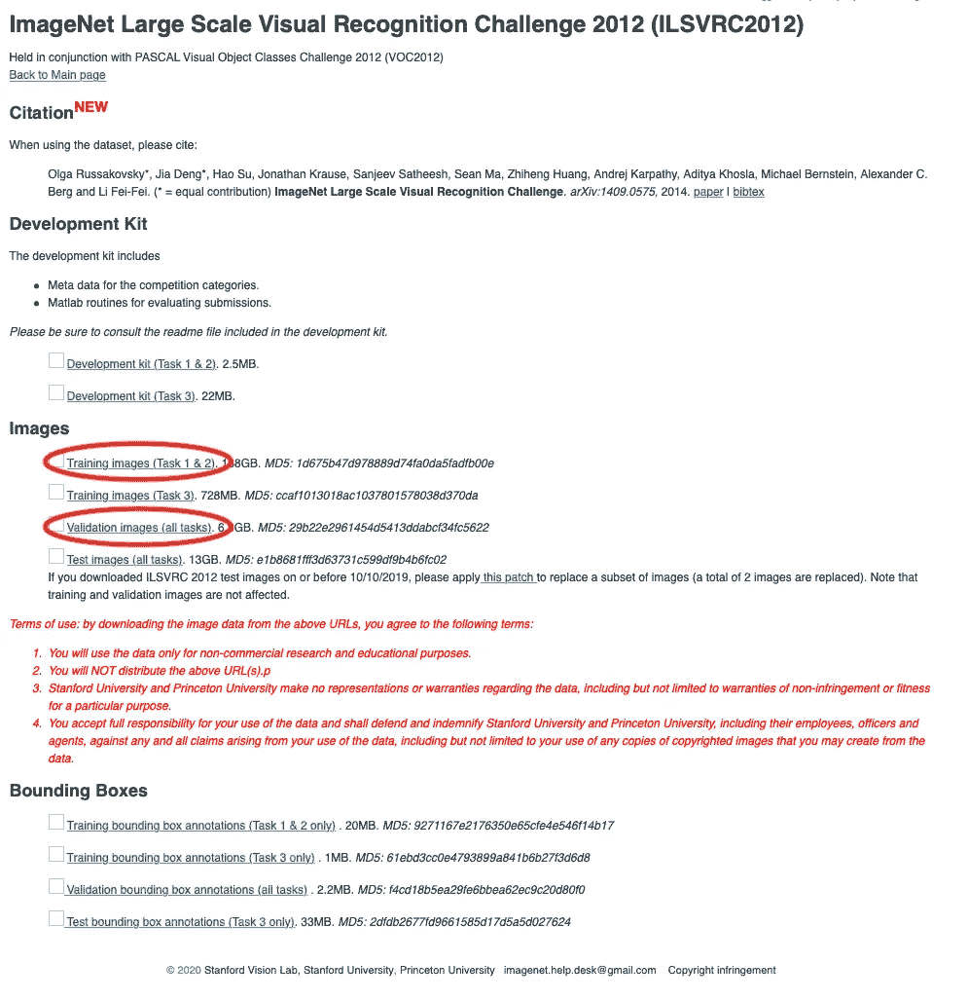

# 使用 TensorFlow 准备 ImageNet 数据集

> 原文：<https://towardsdatascience.com/preparing-the-imagenet-dataset-with-tensorflow-c681916014ee?source=collection_archive---------32----------------------->

## 方便地设置 150 GB 的图像数据

毫无疑问，ImageNet 数据集已经成为开发高级机器学习算法的关键因素。其庞大的规模和众多的类别给处理带来了挑战。这些问题导致了更好的数据处理工具和新颖的神经网络结构。

亨特·哈里特在 [Unsplash](https://unsplash.com?utm_source=medium&utm_medium=referral) 上的照片

TensorFlow Datasets 就是这样一个数据集处理工具。在它的帮助下，您可以方便地访问许多类别的各种数据集。大多数情况下，您可以直接从 TensorFlow 下载数据。

但是，ImageNet 是个例外；它需要手动设置。虽然*似乎有一些实现这一目标的指示，但它们有些模糊。因此，我花了一些时间来准备数据集，但我最终得到了一个简洁的脚本。在下文中，我将指导您使用 ImageNet 数据集进行实验。*

# 下载 ImageNet

在我们做任何准备之前，我们需要获得数据集。为此，请转到[注册页面](https://image-net.org/signup.php)并创建一个帐户。完成此操作并申请使用 ImageNet 数据集后，进入[下载页面](https://image-net.org/download-images.php)。在“ImageNet 大规模视觉识别挑战赛(ILSVRC)”下，选择 2012 版。这将引导您进入新的一页:

ImageNet 下载页面。作者截图。

在此页面上，我们需要下载“训练图像(任务 1 和 2)”和“验证图像(所有任务)”文件。因为它们总共有 150 GB 大，这将需要一些时间。如果你有大学提供的网络，我建议你利用他们的网络。通常，它们的下载速度非常快。

之后，您有两个文件。第一个，*ils vrc 2012 _ img _ train . tar*，包含训练图像及其标签。第二个， *ILSVRC2012_img_val.tar* ，包含验证图像及其标签。有了这些存档，我们现在可以为实际使用准备数据集了。

# 准备 ImageNet 数据集

准备数据集的完整脚本如下所示。根据您的情况调整任何目录路径:

要安装 TensorFlow 数据集，请运行

> pip 安装 tensor flow-数据集

在必要的安装和导入之后，我们定义了*ils vrc 2012 _ img _ train . tar*和 *ILSVRC2012_img_val.tar* 文件所在的路径:

然后，我们设置一些配置参数。*手动 _ 方向*参数是这里的关键。它确保 TensorFlow 数据集在我们指定的位置搜索下载的文件。 *extracted_dir* 是数据集准备期间使用的临时目录。您可以在以后删除它:

最后，我们实现实际的构建过程。准备工作是通过一个 *DatasetBuilder* 对象完成的，它“知道”如何设置一个特定的数据集。例如，为了获得 ImageNet 的构建器，我们通过传递“imagenet2012”来实例化它。

然后我们在这个对象上调用实际的准备方法， *download_and_prepare()* 。这里我们唯一要做的就是传递我们的配置对象:

这就是我们在 python 端要做的全部工作。

# 运行脚本

要运行该脚本，我们键入

> python <script_name>。巴拉圭</script_name>

这样直接在默认 *~/tensorflow_datasets/* 中构建 ImageNet 数据集。要改变这一点，我们可以用

> TFDS _ 数据 _ 目录= <custom_path>python <script_name>。巴拉圭</script_name></custom_path>

我们在前面加上了 TFDS 数据目录，将负责构建位置的环境变量设置到我们选择的目录中。这主要在计算集群中有用，在计算集群中，多个工作人员访问相同的数据集。

# 摘要

我们已经完成了 ImageNet 数据集的设置。不幸的是，我们无法方便地设置测试数据集。此外，没有提供标签，以防止不公平的技术被使用。因此，评估模型的唯一方法是将带有图像->预测标签映射的文件上传到分级服务器。要获取测试图像，从[与之前](https://image-net.org/download-images.php)相同的下载页面下载测试档案。然后，将其解压缩到您选择的目录中。任何进一步的处理都遵循典型的数据流水线。然而，这超出了本文的范围。为了更进一步，看看 Keras 的[功能来实现这个](https://keras.io/api/preprocessing/image/)或者在这篇[文章](/a-practical-guide-to-tfrecords-584536bc786c)中获得使用数据集的印象。