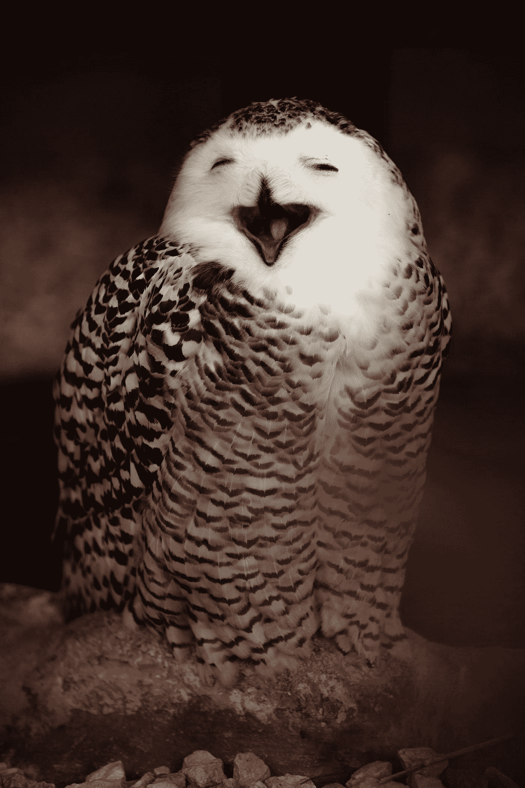
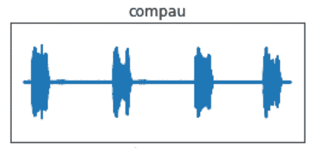
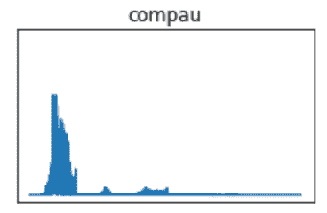
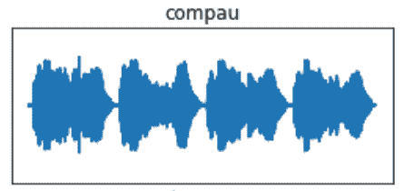
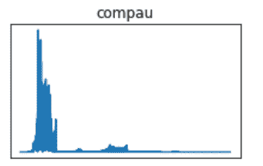
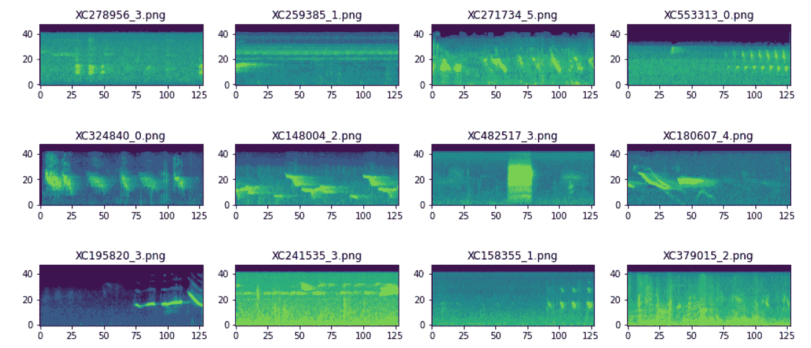

# 用信号包络预处理音频数据

> 原文：<https://towardsdatascience.com/preprocess-audio-data-with-the-signal-envelope-499e6072108?source=collection_archive---------17----------------------->

## [动手教程](https://towardsdatascience.com/tagged/hands-on-tutorials)；人工智能

## 如何去除音频数据中的多余噪音

心情——照片由[弗朗西斯科·德·托马索](https://unsplash.com/@detpho?utm_source=medium&utm_medium=referral)在 [Unsplash](https://unsplash.com?utm_source=medium&utm_medium=referral) 上拍摄

当我第一次通过熨斗学校进入数据科学领域时，我就着眼于将我正在接受的培训与我的音乐背景相结合。课程的最后一项要求是顶点工程。目标是用我们新获得的技能解决一个感兴趣的问题。我觉得这是开始理解音乐和机器学习之间相互关系的黄金机会。

我的导师和我在很多会议上讨论了这个项目的范围。起初，我想为音乐合成创建一个生成模型。然后我开始对非人类动物的音乐感兴趣，尤其是鲸鱼的歌声。我们一起寻找数据，发现不是鲸鱼，而是鸟类:2021 年鸟叫声识别数据集。这是一个利基但开放的音频数据集合。通过对数据的深入挖掘，我了解到其中的含义远非简单归类，而是有着非常具体的途径。音频数据可以为鸟类学研究和濒危物种保护工作的实施增加另一个维度。这也让休闲观鸟者更容易识别他们看不到的鸟类。从声音上来说，我看到了研究鸟类发声的音乐性和利用被识别的鸟作为艺术灵感来源的大好机会。

帕特里克·亨德利在 [Unsplash](https://unsplash.com?utm_source=medium&utm_medium=referral) 上拍摄的照片

我想分享一个我用来帮助预处理音频数据的整洁的东西(感谢 [Seth Adams](https://youtu.be/OUHU7K_dD30?t=118) 的大力帮助):信号包络。包络勾勒出音频信号的最高点和最低点(dB)。这是更大的预处理目标的一部分:量化音频信号的物理属性。有几种测量方法，如采样率( *n* 每秒数据点)、振幅(dB)、频率(Hz)。包络包含这些元素，是一个非常有用的工具，即使不是必需的，也可以用来清理音频数据，尤其是环境录音。收集音频信号的极值的目的是减少记录中的环境噪声，以便模型可以在训练期间关注发声的值。

我在任务中主要使用了这些库:[熊猫](https://pandas.pydata.org/)、 [NumPy](https://numpy.org/) 、 [Librosa](https://librosa.org/doc/latest/index.html) 和 [Matplotlib](https://matplotlib.org/) 。我发现 Librosa 真的很整洁。它广泛用于分析音频数据，在本例中，它执行几个关键功能。总之，用于在音频数据上训练我的模型的管道包括(1)加载原始音频文件；(2)转换成波形；(3)将波形转换成 [Mel 谱图](https://medium.com/analytics-vidhya/understanding-the-mel-spectrogram-fca2afa2ce53)。我将主要关注前两步。

下面是主**包络**函数的代码，它接受三个参数:音频信号、采样率和阈值。在引擎盖下，它将信号转换成熊猫系列，并获取其所有数据点的绝对值。从这里开始，[滚动窗口](https://pandas.pydata.org/docs/reference/api/pandas.DataFrame.rolling.html)用于取 **sample_rate(Hz)/10** 的每个窗口的平均值。for 循环用于遍历 Pandas 均值信号系列。如果任何新数据点高于您设置的阈值(dB)，它将被附加到一个名为 **mask** 的 NumPy 数组中(我使用这个名称是为了与 Seth 的工作保持一致)。任何低于阈值的数据点都不会包含在数组中。

**信封功能:**

作者代码

您可能想知道平均数据点数组在其余预处理步骤中的位置。介绍[快速傅立叶变换](/fast-fourier-transform-937926e591cb) (FFT)，预处理音频的重要功能。FFT 将一个域的信号转换到另一个域。例如，如果我们看下面的音频波形(原谅未标记的轴)，它是在时域中，这意味着信号的幅度(dB)是随时间测量的。FFT 将信号转换到频域，这将显示发声的频谱频率的集中；这被称为周期图。虽然信号包络和 FFT 是两个独立的功能，但理想情况下，它们可以协同工作，为将波形图像转换为 Mel 频谱图做准备。

**计算 FFT 函数:**

作者代码

我已经包含了两组使用这些函数的代码。除了后者包括前面所示的包络函数之外，二者是相同的。定义了两个空白字典，一个用于原始信号量，一个用于 FFT 信号量。for 循环遍历 bird 类的列表，将类与元数据数据帧中的标签进行匹配。之后，通过 Librosa 的**加载**功能搜索音频目录，以匹配音频文件目录中的标签，并以高于设定的采样率(16kHz)将其作为单声道信号加载。然后根据鸟的种类对信号进行标记，随后以 16kHz 的采样率进行 FFT。原始信号和 FFT 信号都与它们的标签一起被添加到字典中。让我们看看下面。

**无信号包络:**

作者代码

无包络函数的时间序列中的波形，FFT 之前—作者提供的图像

以上波形的 FFT 周期图—图片由作者提供

在加载数据之后，FFT 之前，调用包络函数**。新的信号被重新定义为，我称之为“被包围的”信号；这被添加到 **sig_new** 字典中。新信号然后进行 FFT。**

***带*信号包络:**

作者代码

使用包络函数后时间序列中的波形，FFT 之前—作者提供的图像

以上波形的 FFT 周期图—图片由作者提供

我用一个物种，普通的短尾猿，作为例子。FFT 之前的图像显示了看起来更稳定的波形，但这是因为消除了低于 0.009 dB 阈值的数据。同样的原理也适用于 FFT 周期图，其中消除的数据将显示发声中频率的更大集中。

为了将所有这些放在一起，下面是对所有信号应用信号包络和 FFT 后的 12 个 Mel 频谱图样本。越亮的颜色表示频率越集中(kHz)。现在，音频分类任务变成了*图像分类*任务。

信号包络和 FFT 后的 Mel 光谱图—作者提供的图像

值得注意的是，这个函数被用于 27 种鸟类，每一种都包含数百个不同保真度的记录。其影响的大小因记录而异。虽然仍然是一个有用的预处理步骤，但很难确定一致性，以及在公式化数据切片后是否所有期望的信息都将被保留。尽管如此，我还是强烈建议音频机器学习从业者结合这个功能，让自己更接近于处理更有组织的数据。

请随时检查项目[在这里](https://github.com/jeremypagirsky/birdcall_classification)，问我问题的清晰度，或建议的方式来推进到最好的版本。非常感谢！

# 参考资料:

*   [塞斯·亚当斯](https://github.com/seth814/Audio-Classification/blob/master/models.py)
*   斯特凡·卡尔
*   阿尤什·塔库尔
*   [DrCapa](https://www.kaggle.com/ayuraj/birdclef-quick-eda-with-w-b)
*   安德烈·史特劳斯
*   瓦莱里奥·维拉多
*   弗朗索瓦·勒马尔尚德
*   [亚当·萨布拉](https://github.com/theadamsabra/InstrumentClassifier)