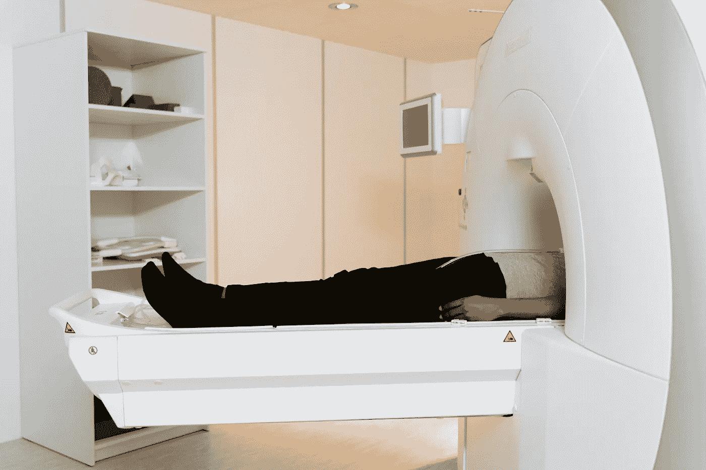
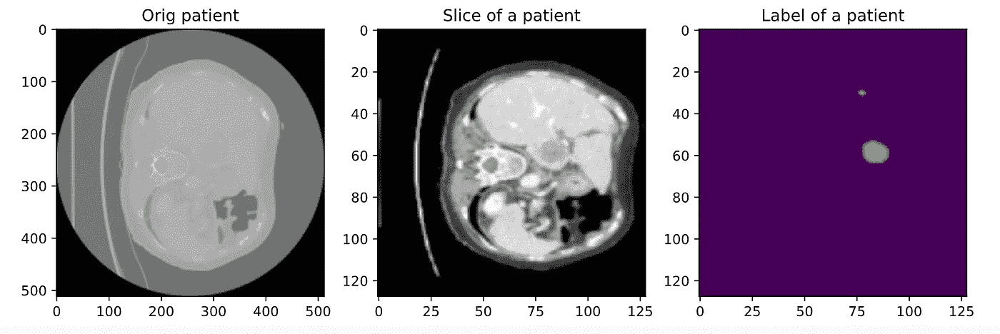

# 使用 Monai 和 PyTorch 预处理用于肿瘤分割的 3D 体积

> 原文：<https://towardsdatascience.com/preprocessing-3d-volumes-for-tumor-segmentation-using-monai-and-pytorch-eaeb3d718570?source=collection_archive---------37----------------------->

## 为肿瘤或器官分割准备 nifti 体积

你可以在我的网站 [***这里***](https://pycad.co/preprocessing-3d-volumes-for-tumor-segmentation-using-monai-and-pytorch/) 找到原文。

下面是这篇文章的视频版本，其中可能包括一些我忘记在文章中包括的解释。

图片来自 Mart Production 的 Pexels

# 介绍

关于我们在使用传统图像处理工具时可能遇到的困难，深度学习已经成为医疗保健领域的主要解决方案。

由于医学图像比标准图像更难处理(密集的对比度，人体的大范围变化…)，深度学习用于分类，对象检测，尤其是分割任务。

说到分割，深度学习被用于分割人体器官，如肝脏、肺等，或者分割身体不同部位的肿瘤。

有许多不同类型的医学图像，如 MRI(主要用于脑瘤分割)、CT 扫描、PET 等。

本文将重点介绍 CT 扫描，但同样的操作也可以应用于其他类型。

所以我们知道，执行深度学习任务需要许多步骤，其中之一是数据预处理，这是我们在启动培训之前必须做的第一件事。这是本文的主题；我们将讨论可用于执行这一预处理的工具。

准备数据因任务而异；例如，分类是最容易的，因为我们只需要准备图像，而对象检测和分割需要我们准备图像以及标签(用于分割的边界框或遮罩)。

在本文中，我们将以分割为例，它可用于肿瘤或器官分割。

在医学成像中，我们可以处理 2D 图像，这些图像可以是 DICOM、jpg 或 png，也可以是 3D 体积，它们是切片组，每个切片是一个 2D 文件(大多数情况下是 DICOM)，而这个组是一个 nifti 文件，它代表整个患者或他身体的一部分。请阅读 [***本文***](https://pycad.co/what-is-the-difference-between-dicom-and-nifti-images/) 了解 dicom 和 nifti 的区别。

我们将在本文中使用 3D 卷，因此如果您有想要转换成卷的 2D 文件，请参见本文<https://pycad.co/how-to-convert-a-dicom-series-into-one-nifti-file-python/>*。*

# *我们将使用的工具*

*为了完成这个任务，我们将使用一个名为 monai 的开源框架，它基于 PyTorch，我在实习期间使用过这个框架，发现非常有用。*

*想看它的文档请见 [***这个链接***](https://docs.monai.io/en/latest/) 。*

# *方法学*

*我们现在将开始编写我们的函数来执行 CT 扫描中肿瘤分割的预处理。第一步是使用 pip 或 conda 安装库，这取决于您使用的环境。*

*`***pip install monai***`*

*我强烈建议您为您的项目建立一个虚拟环境，因为这个库在直接安装到系统中时并不总是能够工作。*

*然后需要安装 PyTorch 和 monai 的一些依赖项。*

*`***pip install torch***`*

*`***pip install torch-vision***`*

*`***pip install “monai-weekly[gdwon, nibabel,tqdm]”***`*

*然后，您需要包含您将需要的库。*

*作者编写的代码*

*现在我们来看看如何加载数据。对此有两种方法。*

****1-*** 首先是分别加载图像和蒙版(如果你想进行图像分类，可以使用这种方法，但它也适用于分割)。*

****2-*** 第二种方法是创建一个包含两列的 Python 字典，一列用于图像路径，一列用于标签路径。然后在每一行中输入带有相应遮罩的图像的路径。*

*就我个人而言，我更喜欢第二种方法，因为当我们应用转换时，我们将能够只选择图像或标签或两者的关键字，而不是为图像和标签(遮罩)创建转换。*

*现在，您必须创建一个包含整个数据集路径的变量。在我的例子中，我有四个文件夹:TrainData，用于训练图像和遮罩的 TrainLabels，以及 ValData，用于验证图像和遮罩的 ValLabels。*

*因此，要创建一个字典来存储路径，请使用下面几行代码:*

*作者编写的代码*

*之后，你已经创建了字典，如果你不熟悉它，这很简单。如果要引用字典中的第一项，可以像在普通数组中一样使用 index 0，但是第一项将有两列，第一列是图像的路径，第二列是标签的路径(关于这一部分的更多信息，可以查看上面的 youtube 视频)。*

# *变换*

*为了对同一个病人应用多个转换，我们将使用 monai 的“compose”功能，该功能允许您组合任何想要的转换(monai 文档中定义的转换)。*

*在应用任何转换时，您应该知道一些事情:有些步骤是必需的，而有些是可选的。*

*使用 monai 时，主要的转换是“Load image”来加载漂亮的文件，以及“ToTensor”来将转换后的数据转换成 torch tensors，以便我们可以使用它进行训练。*

*现在我们已经讨论了基本的转换，我们将继续讨论其他的。我将讨论在我实习期间特别重要的五个转变。*

****AddChanneld:*** 这个函数会给我们的图像加上一个通道，并贴上标签(我说的图像是指多个切片的体积)，因为我们在做肿瘤分割的时候，需要一个通道起到背景或者肿瘤的作用。*

****Spacingd:*** 该功能将帮助我们改变体素尺寸，因为我们不知道医学图像的数据集是通过相同扫描还是不同扫描获得的，所以它们可能具有不同的体素尺寸(宽度、高度、深度)，所以我们需要将它们全部归纳为相同的尺寸。*

******cropforeground:***该功能将帮助我们裁剪掉图像中我们不需要的空白区域，只留下感兴趣的区域。***

******调整大小:*** 最后，这个函数是可选的，但在我看来，如果您使用 cropforeground 函数，则它是必需的，因为执行裁剪的函数将根据每个患者的情况输出随机尺寸，所以如果我们不添加一个操作来为所有患者提供相同的尺寸，我们的模型将无法工作。***

***作者编写的代码***

***正如你所看到的，在我们使用的每个函数的末尾都有一个**“d”**，这是字典(如果你没有使用字典，那么你需要删除它)。我们还为每个操作添加了参数***【keys】***，以指定我们是否要将该变换应用于图像、标签或两者。您可以看到，几乎所有时间我们都将该函数应用于标签和图像，但在 ScaleIntensityRange 中，我们仅将其应用于图像，因为我们不需要更改强度或归一化标签的值。***

# ***数据加载器***

***现在，与任何深度学习代码一样，我们必须在开始训练之前加载数据及其转换；为此，必须使用两个基本函数。***

******数据集:*** 该函数将定义数据及其转换，因此如果您有训练集和验证集，您将需要创建两个“数据集”函数，一个将训练数据与其转换相结合，另一个将验证数据与其转换相结合。当然，如果对定型集和验证集应用相同的转换，则必须在函数“dataset”的参数“transform”中使用相同的转换***

******数据加载器:*** 这是将数据加载到具有特定批量大小的 RAM 中的函数(它将创建另一个通道以在训练期间指定批量大小的索引)将有两个数据加载器，一个用于训练，一个用于验证。***

***作者编写的代码***

# ***绘制一个例子***

***应用转换后，您可以绘制一些切片，以查看使用和不使用转换时数据有何不同。***

***您可以使用 monai 函数***【first】***从 dataloader 中获取第一个项目，这将是第一个患者。***

***这里有几行代码可以帮助你绘制例子。***

***作者编写的代码***

***现在让我们来看看有和没有转换的输出:***

******

***作者捕获的图像***

***左边是没有转换的切片，中间是我们讨论过的带有转换的同一切片，右边是相应的标签。***

***这就是如何使用 monai 为分割准备 3D 体积。如果你想看更多的变形金刚，去莫奈的网站。但是，有些转换是为数据扩充而设计的，而不是为预处理而设计的。我也会写一篇关于它的文章。***

> ***PS:我推荐看视频，因为文中还有我可能忽略的额外解释。***

> ***你可以从[这个链接](https://github.com/amine0110/preporcess-volume-medical-imaging/blob/main/main.ipynb)找到代码。***

# ***你想学医学影像的深度学习！***

***即将推出全面的医学成像课程，涵盖使用 Monai 和 PyTorch 的 2D 和 3D 分割，并提供额外支持。加入等候名单以接收任何课程更新的通知。***

***<https://pycad.co/monai-and-pytoch-for-medical-imaging/> *** 

> ***订阅[我的简讯](https://astounding-teacher-3608.ck.page/136bdb1fbe)获取我工作的所有更新:)。***