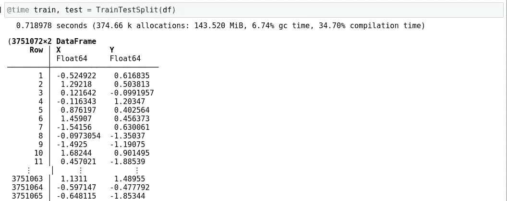
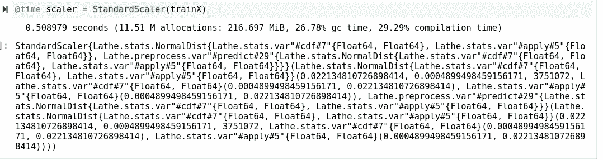
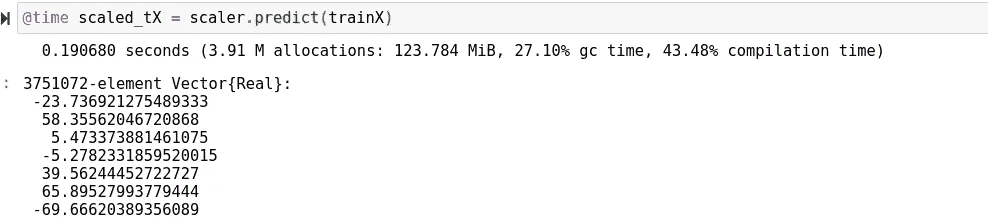
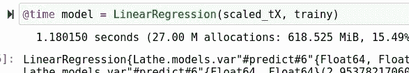
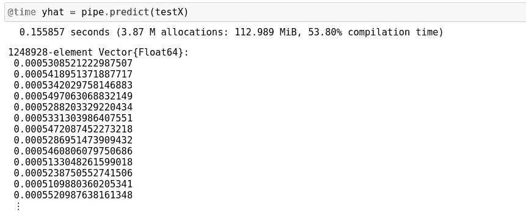
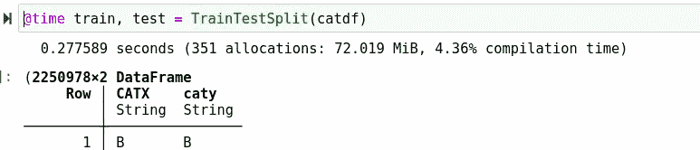
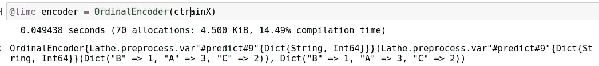
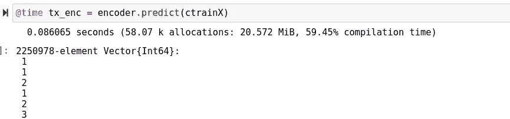
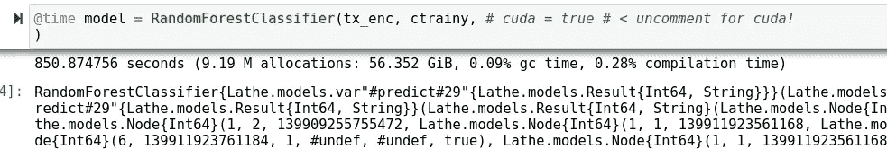
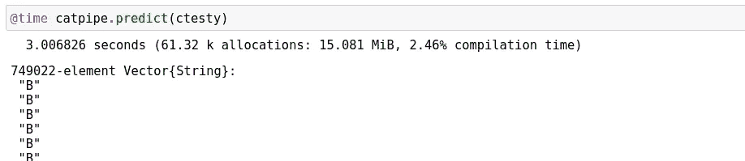

# 用车床预处理 Julia 中的大数据

> 原文：<https://towardsdatascience.com/preprocessing-big-data-in-julia-with-lathe-90c8b95120f4?source=collection_archive---------24----------------------->

## 用大数据测试 Julia 语言和车床。


(src =[https://pixabay.com/images/id-895567/](https://pixabay.com/images/id-895567/)

# 介绍

W 当谈到机器学习的奇妙和广阔的世界时，有许多流行的选项值得许多数据科学家选择。老实说，就我个人对数据科学生态系统的看法而言，我认为该领域的许多方面已经过时，而其他方面正在以光速向前发展。在某种程度上，这是有道理的，因为像这样一个爆炸性的行业还没有时间成熟到它的规模，因此我们最终会面临一些问题。

数据科学面临的一个重要问题是编程语言。对于许多入门级的开发人员来说，数据科学可能很难进入。因为有如此多的选择，以及某些语言的狂热的，有时是公然的宗教信徒，他们可能会解释为什么 X 或 Y 比另一个更好的某些观点。如果你碰巧在那条船上，我实际上有一篇文章可以回答这个问题，因为你选择的语言很可能会对你最终从事的工作类型产生重大影响。如果你愿意，你可以在这里查阅这篇文章:

</what-language-should-you-learn-for-data-science-in-2021-fdeebb88d6e>  

我离题了…最终我认为，虽然还不清楚也不知道哪种语言将成为新的数据科学的典型，但如果语言发生了变化，我认为语言的问题往往会在数据科学工作中暴露出来。让我们回想一下，在 2015 年，大多数数据科学工作清单都是针对 Java 的。也就是说，Python 仅仅统治了这个领域大约 7 年，这意味着这种语言直到最近才开始面向这些受众。许多人会争论 Python 是数据科学的完美语言，但事实上不可能有完美的语言，因为总会有某种缺陷。

> [来源](/8-reasons-why-python-is-good-for-artificial-intelligence-and-machine-learning-4a23f6bed2e6)

虽然 Python 拥有终极的数据科学生态系统，但它也是一种解释型语言，更类似于 JavaScript，而不是 Scala 或 C++之类的东西。这当然会减慢速度，虽然大多数包是用 C 编写的，并且由于优化和良好的代码，实际上可以运行得非常快，但它们仍然存在问题。Python 的问题在于，如果你想处理更复杂、多维度的大数据，那么你就会遇到很多意想不到的问题。不用说，因为你使用的编程语言而试图从你的计算机中挤出最后一滴性能并不是一种完美的体验。

Python 也有并行计算的后见之明，这意味着它在设计时不一定考虑了并行计算。每天，并行计算变得越来越重要，应用越来越广泛。Python 有时会遇到麻烦，这一事实无疑是这门语言的一个障碍，尤其是当它与其他任何东西混合在一起时。

当然，朱莉娅也不是完美的，因为她也有很多缺点。虽然我认为它的范例非常适合编写，而且没有其他地方我更愿意编写我的代码，但我也看到了这种语言的一些问题。当然，语言还是比较新的，所以这肯定是明智的。事实上，它最近才开始流行，这意味着这个生态系统还很不成熟。在一个不成熟的生态系统中，Julia 是否会被业界采用是值得怀疑的，主要是因为他们不想花钱让人编写已经用另一种语言编写的包。

所有这些都不在话下，我真的认为这个时候没有完美的语言。我觉得 Python 很棒，我觉得 Julia 也很棒，但我觉得他们都有减损他们伟大的瑕疵。也就是说，我也认为 Julia 展示了对未来的承诺，即使未来是 Python 的一个副作用。今天，我想用一个成熟的生态系统展示这种语言的潜力，并在核心本身上做更多的工作，我真的认为 Julia 可以在数据科学领域做很多非常令人兴奋的事情，这当然让我兴奋。

> [笔记本](https://github.com/emmettgb/Emmetts-DS-NoteBooks/blob/master/Julia/Big%20Data%20With%20Lathe%20(Gingerbread%20Beta.ipynb)

# 车床

这是一个针对 Julia 的机器学习包，自 2019 年以来一直在广泛活跃的开发中。Julia 的一个问题是，通用机器学习的生态系统内部存在很大差距。许多软件包分别针对线性建模、数据处理、统计或深度学习，没有一致的方向或类型。这是有问题的，因为我们有所有这些独立创建的工具，它们相互依赖，但不知何故不能一起工作——这是愚蠢的，因为 Julia 使用子类型很容易扩展。如果您想了解更多关于该产品包的信息，请访问

  

或者 Github 页面，

<https://github.com/ChifiSource/Lathe.jl>  

我记得当我在 2018 年开始在朱莉娅工作时，我一辈子都找不到一个好方法来训练-测试-分割我的数据。最后我不得不写一个函数来做这件事，每次我需要训练-测试-分割一些东西的时候，我都会使用同一个函数。车床的目的是建立某种程度的一致性，虽然它是面向对象的，工具是用来扩展的。如果我们想到 Python，SkLearn 为使用模型进行预测设置了一个标准，此后其他包也一直遵循这个标准。

今天，我想使用一些巨大的数据集，并真正测试一下车床，以便在某种程度上演示如何实际使用该模块，并演示该模块实际上有多大的能力。首先，让我们生成绝对大量的随机数据。我想做两个分类和连续的选择，编码器和定标器放入管道。首先让我们导入我们的依赖项:

```
using DataFramesusing Lathe.preprocess: TrainTestSplitusing Lathe.preprocess: StandardScaler, OrdinalEncoder, OneHotEncoderusing Lathe.models: LinearRegression, RandomForestClassifier, Router
```

# 数据

对于连续数据，我基本上只是使用 randn()来生成一些随机数。至于观察次数，我选择了 500 万次。在大多数行业标准工具中，数百万次的观察基本上是不可能的，即使是从一维的角度来看。我不认为 Python 会创建这个数组，尽管我可能是错的。我使用 randn()函数生成了这个数据:

```
x = randn(5000000)
y = randn(5000000)
```

现在分类数据有点棘手，因为 Julia 真的没有像 Python 那样的随机选择函数。你可以迭代地抽取样本，就是这样。我编写了这个简洁的小函数，利用了 Lathe 的 ordinal encoder 对象来创建一个查找字典，对其进行反转，然后用给定范围内的整数对其进行索引:

```
function randchoice(opts::Array{String}, count = 5)mapping = OrdinalEncoder(opts).lookupinverse_dct = Dict([pair[2] => pair[1] for pair in Set(mapping)])[inverse_dct[Int64(rand(1:length(opts)))] for i in 1:count]end
```

接下来，我创建了一些字符串形式的分类选项。我创建了 3，000，000 个这样的模型，因为我认为我应该挑战这个模型，同时测试这个模型的 CUDA 实现。

```
opts = ["A", "B", "C"]
caty = randchoice(opts, 3000000)
catx = randchoice(opts, 3000000)
```

最后，让我们将数据压缩成两个数据框架:

```
df = DataFrame(:X => x, :Y => y)
catdf = DataFrame(:CATX => catx, :caty => caty)
```

# 处理

我们将分割每个数据帧，我用时间宏来计时，从现在开始所有的车床下面都会有一些时间截图！

```
@time train, test = TrainTestSplit(df)
```



(图片由作者提供)

然后我做了一个 trainX 和 trainy 数组:

```
tr = :Xte = :YtrainX = Array(train[!, tr])trainy = Array(train[!, te])testX = Array(test[!, tr])testy = Array(test[!, te])
```

接下来，让我们创建一个标准缩放器来缩放传入的 X:

```
@time scaler = StandardScaler(trainX)
```



(图片由作者提供)

然后，我们将使用它的 predict()函数来获取一些用于训练的数据:

```
@time scaled_tX = scaler.predict(trainX)
```



(图片由作者提供)

# 建模

最后，让我们将其与一个基本的线性回归模型进行拟合:

```
@time model = LinearRegression(scaled_tX, trainy)
```



(图片由作者提供)

现在，我将使用加法运算符用我们的缩放器和模型制作一个管道:

```
pipe = scaler + model
@time yhat = pipe.predict(testX)
```



(图片由作者提供)

# 预处理 II

对于我们的分类模型，我做了与之前完全相同的分割过程:

```
@time train, test = TrainTestSplit(catdf)
```



(图片由作者提供)

然后将数据放入一维数组:

```
tr = :CATXte = :catyctrainX = Array(train[!, tr])ctrainy = Array(train[!, te])ctestX = Array(test[!, tr])ctesty = Array(test[!, te])
```

之后，我安装了一个顺序代码:

```
@time encoder = OrdinalEncoder(ctrainX)
```



(图片由作者提供)

并再次使用 predict()函数预测:

```
@time tx_enc = encoder.predict(ctrainX)
```



(图片由作者提供)

# 建模 II

最后，我安装了一个随机森林分类器:

```
@time model = RandomForestClassifier(tx_enc, ctrainy, # cuda = true # < uncomment for cuda!)
```



(图片由作者提供)

接下来，让我们再次使用加法运算符为分类输入创建另一个管道:

```
catpipe = encoder + model
@time catpipe.predict(ctesty)
```



(图片由作者提供)

# 结论

我认为很明显，对于大多数机器学习场景，车床对于预处理数据来说是强大而快速的。我认为，能够使用这些预处理工具如此轻松地处理这些大数据，无疑给了 Lathe 和 Julia 留在该行业的巨大希望。即使系统仅用于输入 Python 编写的机器学习模型，情况也可能如此。在所有这些测试中，唯一一个编译时间超过 10 秒的是随机森林分类器，我认为它在处理这么多数据时仍然有相当激进的时间。

我试图将这些时间与 CUDA 时间进行比较，但看起来好像我的 CUDA 不工作，这破坏了乐趣！如果你刚好有显卡和 CUDA，你可以在笔记本上随意试用，并让我知道效果如何，这对我来说意味着一切！感谢您的阅读，我希望这篇文章能够展示 Julia 语言在正确的支持下会有多么强大！