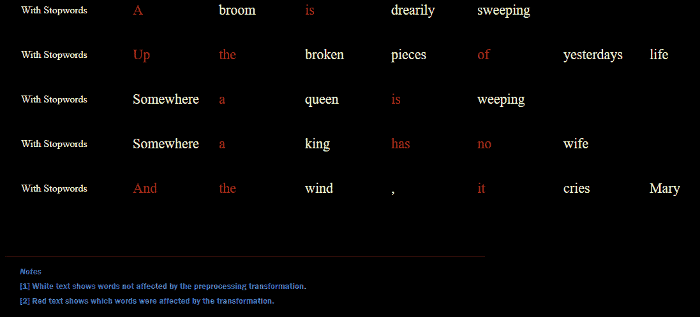

# 为机器学习预处理文本数据

> 原文：<https://towardsdatascience.com/preprocessing-text-data-for-machine-learning-6b98f7bb0258?source=collection_archive---------27----------------------->

## 使用 NLTK 和动画展示常见的文本转换


帕特里克·托马索在 [Unsplash](https://unsplash.com?utm_source=medium&utm_medium=referral) 上的照片

非结构化文本数据需要独特的步骤进行预处理，以便为机器学习做准备。本文将介绍其中的一些步骤，包括标记化、停用词、删除标点、词条化、词干化和矢量化。

# **数据集概述**

为了演示一些自然语言处理文本清理方法，我们将使用我最喜欢的音乐家之一吉米·亨德里克斯的歌词。原始歌词数据可以在这里找到[。为了这个演示的目的，我们将使用他的著名歌曲*中的几行:*](https://www.kaggle.com/paultimothymooney/poetry?select=jimi-hendrix.txt)

```
A broom is drearily sweeping
Up the broken pieces of yesterdays life
Somewhere a queen is weeping
Somewhere a king has no wife
And the wind, it cries Mary
```

# **标记化**

大多数自然语言处理工作流程的第一步是对文本进行标记。有一些不同的变体，但在最基本的意义上，这涉及到将一个文本字符串拆分成单个的单词。

我们将首先回顾 NLTK(用于演示本文中的大多数概念),并很快看到标记化在其他几个框架中的应用。

## **NLTK**

我们已经将数据集读入字符串列表，并可以使用来自 [NLTK python 库](https://www.nltk.org/)的[单词标记化](https://www.nltk.org/api/nltk.tokenize.html)函数。您将看到，在循环遍历每一行时，应用 word tokenize 会将该行拆分为单个单词和特殊字符。


在标记化之前，按作者排序的图像


标记化后，作者的图像

## **其他库中的记号赋予器**

有许多不同的方法来完成标记化。NLTK 库在这个领域有一些很棒的功能，但是其他的包括 [spaCy](https://spacy.io/) 和许多深度学习框架。下面是这些库中标记化的一些例子。

**火炬**

空间

不同的记号赋予器之间可能会有细微的差别，但是以上或多或少都是一样的。spaCy 库有自己的对象，这些对象结合了框架的特性，例如返回一个 [doc](https://spacy.io/api/doc) 对象，而不是一个令牌列表。

# **停用词**

在某些情况下，移除停用词可以提高自然语言处理模型的理解或准确性。停用字词是常用的字词，可能不携带太多信息，并且可以在信息损失很少的情况下删除。您可以使用下面的 python 命令从 NLTK 获得停用词列表。

## **加载和查看停用词**


停用词，作者图片- [点击查看完整版本](https://datastud.dev/media/nlp_preprocess/stopwords.png)

## **删除停用词**

我们可以创建一个简单的函数来删除停用词并返回一个更新的列表。



停用字词删除前后的文本，按作者排序的图像

# **标点符号**

类似于停用词，因为我们的文本已经被分成句子，删除标点符号可以在没有太多信息损失的情况下执行，并且将文本清理为单词。一种方法是简单地使用标点符号的字符串对象列表。

我们有一个额外的逗号，现在在应用此函数后被删除:


删除标点符号后的文本，按作者排序的图像

# **词汇化**

我们可以通过词汇化来进一步规范我们的文本。这将一个单词归结为词根，这有助于最小化所用单词的唯一数量。这当然是一个可选的步骤，在某些情况下，比如文本生成，这些信息可能很重要，而在其他情况下，比如分类，这些信息可能不太重要。

## **单字测试**

为了对我们的令牌进行符号化，我们将使用 NLTK [WordNetLemmatizer](https://www.nltk.org/api/nltk.stem.wordnet.html) 。一个例子是将单词“cry”应用到单词 lemmatizer，得到单词“cry”的词根。

```
Output text: cry
```

## **所有标记/词性**

NLTK 函数在特定的词类上运行，所以我们将在一个通用函数中循环遍历这些函数，以对标记进行词汇化。


词汇化前后的文本，作者提供的图像

# **词干**

词干化类似于词汇化，但它不是转换成一个词根，而是去掉后缀和前缀。我更喜欢词汇化，因为它不那么激进，而且单词仍然有效；然而，词干有时也会被使用，所以我在这里展示如何使用。

## **雪球斯特梅尔**

有许多不同风格的词干算法，对于这个例子，我们使用 NLTK 的[雪球词干分析器](https://www.nltk.org/api/nltk.stem.html)。对“sweeping”应用词干删除后缀，产生单词“sweep”。

```
Output text: sweep
```

## **适用于所有令牌**

与前面的步骤类似，我们可以创建一个更通用的函数，并将其应用于每一行。


词干前后的文本，作者的图像

如你所见，有些不是单词。出于这个原因，在几乎所有的情况下，我都倾向于使用词汇化，以便在嵌入过程中更成功地查找单词。

# **把它们放在一起**

我们已经经历了许多可能的步骤来清理我们的文本，并为每个步骤创建了函数。最后一步是将它合并成一个简单的通用函数，在文本上运行。我将这些函数包装在一个组合函数中，允许启用任何所需的函数，并在不同的文本行上依次运行每个函数。下面我使用了一种函数式方法，但是使用类似的原理当然也可以构建一个类。

# **矢量嵌入**

现在我们终于清理了我们的文本，它准备好机器学习了吗？不完全是。大多数模型需要数字输入，而不是字符串。为了做到这一点，经常使用将字符串转换成向量的嵌入。你可以认为这是在一个固定长度的数字向量中获取文本的信息和含义。

我们将浏览一个使用 gensim 的例子；然而，许多深度学习框架也可能有快速加载预训练嵌入的方法。

## **Gensim 预训练模型概述**

我们将用来为我们清理过的令牌查找预训练嵌入向量的库是 [gensim](https://github.com/RaRe-Technologies/gensim) 。他们有多个预先训练好的嵌入可供下载，你可以在 [word2vec 模块](https://github.com/RaRe-Technologies/gensim/blob/develop/gensim/models/word2vec.py)内联文档中查看这些。

## **最相似的词**

Gensim 提供了多种功能来与预训练的嵌入一起使用。一个是查看哪些单词最相似。为了了解这是如何工作的，让我们试试吉米·亨德里克斯歌词样本中的“queen”这个词。


最相似的单词，作者图片

## **检索矢量嵌入示例**

为了将单词转换成嵌入向量，我们简单地使用像字典一样的预训练模型。我们来看看“扫帚”这个词的嵌入向量是什么样子的。


样本嵌入向量，图片由作者提供

## **应用于所有令牌**

与过去的步骤类似，我们可以简单地循环遍历清理后的令牌，并构建一个转换为向量的列表。实际上，对于查找不成功的单词可能会有一些错误处理(由于字典中没有它，所以会导致一个键错误)，但是我在这个简单的例子中忽略了这一点。

# **填充向量**

许多自然语言处理模型需要相同数量的单词作为输入。然而，文本长度通常参差不齐，每行都不符合完全相同的字数。为了解决这个问题，一种常用的方法是填充序列。我们可以在较短句子的末尾添加虚拟向量，以使所有内容对齐。

## **py torch 中的填充序列**

许多库都有用于这种工作流的帮助器方法。例如，torch 允许我们以如下方式填充序列。

```
Output: torch.Size([5, 4, 100])
```

填充我们的序列后，您现在可以看到这 5 行文本的长度都是 4，嵌入维数为 100，与预期的一样。但是我们第一条只有三个字(令牌)的线清洗后怎么了？

## **查看填充向量**

默认情况下，Torch 只为任何需要填充的内容创建零值向量。


填充零向量示例，作者图片

# **总结**

在为机器学习准备数据时，文本数据通常需要独特的步骤。清理文本对于标准化单词以允许嵌入和查找很重要，同时对于给定的任务丢失尽可能少的信息。一旦你清理和准备了文本数据，它就可以用于更高级的机器学习工作流，如文本生成或分类。

*在*[*Github*](https://github.com/bstuddard/python-examples/tree/master/nlp/preprocess)*上可以找到所有的例子和文件。*

*原发布于*[*https://data stud . dev*](https://datastud.dev/posts/nlp-preprocess)*。*